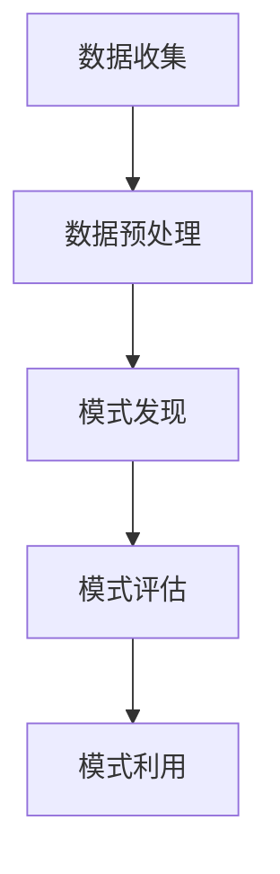
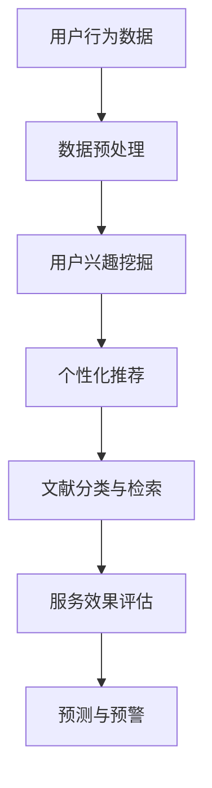

                 

### 背景介绍

#### 图书馆智慧信息服务的需求

随着信息技术和互联网的迅猛发展，图书馆的服务模式也在不断变革。传统的图书馆服务主要依赖于人工操作，信息检索效率低，用户体验不佳。在这种背景下，构建一个基于数据挖掘的图书馆智慧信息服务系统显得尤为必要。智慧信息服务能够通过数据挖掘技术，对图书馆的海量数据进行深入分析，为用户提供更加精准和个性化的信息服务。

##### 图书馆信息服务的挑战

图书馆信息服务面临的挑战主要包括以下几个方面：

1. **数据量大**：现代图书馆积累了大量的文献资料、用户行为数据等，如何有效地管理和利用这些数据是一个巨大的挑战。
2. **用户需求多样**：不同用户对于信息的需求各不相同，如何满足用户的多样化需求，提供个性化的信息服务，是图书馆服务的核心问题。
3. **信息服务效率低**：传统信息服务依赖于人工，效率较低，无法满足现代用户对快速获取信息的需求。
4. **技术限制**：现有技术在数据挖掘、人工智能等方面的发展仍然有限，如何充分利用这些技术提升图书馆信息服务水平，是一个重要课题。

##### 数据挖掘在图书馆信息服务中的作用

数据挖掘技术可以从海量数据中提取出有价值的信息，为图书馆信息服务提供强大的支持。具体来说，数据挖掘在图书馆信息服务中的作用包括：

1. **用户行为分析**：通过分析用户的行为数据，可以了解用户的阅读偏好、访问习惯等，为个性化推荐提供依据。
2. **文献分类与检索**：利用数据挖掘技术，可以对文献进行智能分类，提高文献检索的准确性和效率。
3. **服务效果评估**：通过数据挖掘，可以评估图书馆各项服务的效果，为服务优化提供数据支持。
4. **预测与预警**：通过对图书馆运行数据的分析，可以预测用户的需求趋势，提前采取相应措施，避免潜在问题。

#### 图书馆智慧信息服务的现状

目前，国内外许多图书馆已经开始探索智慧信息服务的建设。一些图书馆通过引入数据挖掘技术，实现了以下功能：

1. **个性化推荐**：基于用户行为数据和阅读记录，为用户提供个性化的图书推荐服务。
2. **智能检索**：通过自然语言处理和机器学习算法，提升文献检索的智能化水平。
3. **数据分析与报告**：定期对用户行为、图书馆运营数据进行分析，生成详细的数据报告。
4. **智能问答**：利用问答系统，为用户提供实时、精准的信息咨询。

然而，尽管已有一定的成果，但图书馆智慧信息服务仍面临许多挑战，需要进一步的研究和探索。

---

在接下来的章节中，我们将深入探讨数据挖掘的核心概念和原理，并详细阐述其在图书馆智慧信息服务中的应用。让我们继续一步步分析推理，深入理解这一领域的奥秘。

## 2. 核心概念与联系

#### 数据挖掘的定义与基本概念

数据挖掘（Data Mining）是指从大量的数据中通过算法和统计方法发现有价值的信息、模式和规律的过程。数据挖掘技术涵盖了多个学科，包括统计学、计算机科学、机器学习、数据库管理等领域。其基本概念包括：

1. **数据集（Dataset）**：数据挖掘的起点，是包含大量数据的集合。
2. **特征（Feature）**：数据集中的每个属性或变量。
3. **模式（Pattern）**：从数据集中识别出的有意义的结构或规律。
4. **关联规则（Association Rule）**：描述数据集中不同特征之间关系的规则。
5. **分类（Classification）**：将数据分为不同类别的过程。
6. **聚类（Clustering）**：将数据划分为若干组，使得同一组内的数据相似度较高。

#### 数据挖掘的架构

数据挖掘的架构通常包括以下几个关键步骤：

1. **数据收集（Data Collection）**：收集用于挖掘的数据集。
2. **数据预处理（Data Preprocessing）**：清洗、转换和整合数据，为后续挖掘做准备。
3. **模式发现（Pattern Discovery）**：使用算法和统计方法从数据中提取有价值的信息和模式。
4. **模式评估（Pattern Evaluation）**：评估挖掘出的模式的有效性和意义。
5. **模式利用（Pattern Utilization）**：将挖掘出的模式应用于实际问题中。

以下是一个简单的 Mermaid 流程图，描述了数据挖掘的基本流程：



#### 数据挖掘与图书馆智慧信息服务的联系

数据挖掘在图书馆智慧信息服务中的应用，主要体现在以下几个方面：

1. **用户行为分析**：通过分析用户的行为数据，了解用户的需求和兴趣，为个性化推荐和信息服务提供支持。
2. **文献分类与检索**：利用数据挖掘技术，对文献进行智能分类和检索，提高信息检索的效率和准确性。
3. **服务效果评估**：通过数据挖掘，评估图书馆各项服务的效果，为服务优化提供数据支持。
4. **预测与预警**：通过对图书馆运行数据的分析，预测用户的需求趋势，提前采取相应措施，避免潜在问题。

以下是一个简化的 Mermaid 流程图，描述了数据挖掘在图书馆智慧信息服务中的应用流程：



通过上述流程，我们可以看到，数据挖掘在图书馆智慧信息服务中起到了连接不同环节的关键作用，为图书馆提供了更加智能化和个性化的服务。

---

在下一章节中，我们将深入探讨数据挖掘的核心算法原理和具体操作步骤，帮助读者更好地理解这一领域的技术实现。请继续关注。

## 3. 核心算法原理 & 具体操作步骤

#### 数据挖掘的核心算法

数据挖掘涉及多种核心算法，每种算法都有其独特的原理和应用场景。以下是一些常见的数据挖掘算法及其基本原理：

1. **关联规则挖掘（Association Rule Mining）**
   - **原理**：关联规则挖掘旨在发现数据集中不同特征之间的关联关系。其核心思想是通过支持度和置信度两个指标来识别潜在的关联规则。
   - **支持度（Support）**：描述一个规则在数据集中出现的频率，通常以百分比表示。
   - **置信度（Confidence）**：描述一个规则的准确性，即后件出现的概率。
   - **算法**：常见的关联规则挖掘算法包括 Apriori 算法和 FP-Growth 算法。

2. **分类（Classification）**
   - **原理**：分类算法用于将数据集中的样本分类到预先定义的类别中。其核心在于构建一个分类模型，该模型能够根据样本的特征预测其类别。
   - **算法**：常见的分类算法包括决策树（Decision Tree）、支持向量机（SVM）、朴素贝叶斯（Naive Bayes）等。

3. **聚类（Clustering）**
   - **原理**：聚类算法用于将数据集中的样本划分为若干个组，使得同一组内的样本相似度较高，而不同组之间的样本相似度较低。
   - **算法**：常见的聚类算法包括 K-Means、DBSCAN、层次聚类（Hierarchical Clustering）等。

4. **异常检测（Anomaly Detection）**
   - **原理**：异常检测旨在识别数据集中的异常值或异常模式。其核心在于建立一个模型，用于区分正常数据和异常数据。
   - **算法**：常见的异常检测算法包括孤立森林（Isolation Forest）、局部异常因子（Local Outlier Factor，LOF）等。

#### 算法操作步骤

下面以 Apriori 算法为例，详细描述数据挖掘算法的具体操作步骤：

##### 步骤 1：确定最小支持度阈值（min_support）

最小支持度阈值是关联规则挖掘中的关键参数，用于过滤掉那些频繁度较低的交易。通常，我们需要根据实际业务需求和数据特点来确定一个合适的阈值。

例如，我们设定最小支持度阈值为 0.2，即一个规则在数据集中至少出现 20% 的交易。

##### 步骤 2：计算所有频繁项集（Frequent Itemsets）

Apriori 算法的核心在于逐步构建频繁项集。首先，我们需要找到所有频繁 1-项集（单个物品），然后使用这些频繁 1-项集生成频繁 2-项集，以此类推。

1. **计算频繁 1-项集**：统计每个物品在数据集中的出现次数，筛选出满足最小支持度阈值的物品。
2. **生成候选 2-项集**：使用频繁 1-项集生成候选 2-项集，即包含两个物品的组合。
3. **剪枝候选 2-项集**：对候选 2-项集进行剪枝，去除那些不满足最小支持度阈值的项集。
4. **递归生成频繁项集**：重复步骤 2 和 3，直到生成的项集不再满足最小支持度阈值。

##### 步骤 3：生成关联规则

在获得所有频繁项集后，我们可以使用这些频繁项集生成关联规则。关联规则包括前件和后件两部分，通常以 (A → B) 的形式表示。

1. **计算支持度**：对于每个频繁项集，计算其在数据集中的支持度。
2. **计算置信度**：对于每个频繁项集，计算其在数据集中的置信度。
3. **筛选关联规则**：根据最小支持度和最小置信度阈值，筛选出满足条件的关联规则。

##### 步骤 4：评估关联规则

评估关联规则的目的是确定哪些规则对实际业务有价值。常用的评估方法包括增益（Gain）、置信度（Confidence）、提升度（Lift）等。

1. **计算增益**：描述规则前件和后件之间的相关性。
2. **计算置信度**：描述规则的后件在给定前件的情况下出现的概率。
3. **计算提升度**：描述规则的有效性，即规则是否增强了前件和后件之间的关联性。

##### 步骤 5：利用关联规则进行预测或决策

根据评估结果，我们可以利用生成的关联规则进行预测或决策。例如，在图书馆智慧信息服务中，基于用户的历史阅读记录，我们可以预测用户的未来阅读偏好，从而实现个性化推荐。

---

通过上述步骤，我们可以利用 Apriori 算法在图书馆智慧信息服务的场景中挖掘出有价值的关联规则，为图书馆提供更加智能化和个性化的服务。

在下一章节中，我们将进一步探讨数据挖掘中的数学模型和公式，帮助读者深入理解这一领域的技术实现。请继续关注。

## 4. 数学模型和公式 & 详细讲解 & 举例说明

#### 关联规则挖掘中的数学模型

在关联规则挖掘中，有两个关键数学模型：支持度（Support）和置信度（Confidence）。以下是这些模型的详细讲解和举例说明。

##### 1. 支持度（Support）

支持度是指一个规则在数据集中出现的频率。它用来衡量规则的重要性。支持度的计算公式如下：

\[ 支持度 = \frac{交易包含（A ∪ B）的数量}{总的交易数量} \]

其中，\( A ∪ B \) 表示前件和后件组合的集合。

**示例**：

假设我们有一个包含 1000 条交易的数据库，其中有 150 条交易同时包含了物品 A 和物品 B。那么，规则 \( A \rightarrow B \) 的支持度为：

\[ 支持度(A \rightarrow B) = \frac{150}{1000} = 0.15 \]

##### 2. 置信度（Confidence）

置信度是指一个规则的后件在给定前件的情况下出现的概率。它用来衡量规则的可信度。置信度的计算公式如下：

\[ 置信度 = \frac{交易包含（A ∪ B）的数量}{交易包含 A 的数量} \]

其中，\( A ∪ B \) 表示前件和后件组合的集合，\( A \) 表示前件的集合。

**示例**：

继续使用上面的例子，假设有 150 条交易包含了物品 A 和物品 B，而有 200 条交易包含了物品 A。那么，规则 \( A \rightarrow B \) 的置信度为：

\[ 置信度(A \rightarrow B) = \frac{150}{200} = 0.75 \]

##### 3. 关联规则的评价指标

除了支持度和置信度，还有其他指标用于评价关联规则的优劣。以下是三个常用的指标：

1. **增益（Gain）**：描述规则前件和后件之间的相关性。增益的计算公式如下：

\[ 增益 = 置信度 - \frac{支持度}{后件的概率} \]

2. **提升度（Lift）**：描述规则是否增强了前件和后件之间的关联性。提升度的计算公式如下：

\[ 提升度 = \frac{置信度}{后件的概率} \]

3. **置信度提升（Confidence Lift）**：描述规则的可信度提升程度。置信度提升的计算公式如下：

\[ 置信度提升 = \frac{置信度 - 后件的概率}{后件的概率} \]

**示例**：

假设物品 B 的概率为 0.3，根据前面的例子，规则 \( A \rightarrow B \) 的置信度为 0.75。那么，该规则的增益、提升度和置信度提升分别为：

\[ 增益(A \rightarrow B) = 0.75 - \frac{0.15}{0.3} = 0.375 \]

\[ 提升度(A \rightarrow B) = \frac{0.75}{0.3} = 2.5 \]

\[ 置信度提升(A \rightarrow B) = \frac{0.75 - 0.3}{0.3} = 1.5 \]

通过这些指标，我们可以更全面地评估关联规则的质量，从而为实际应用提供支持。

---

通过上述数学模型和公式的讲解，我们可以更深入地理解关联规则挖掘的基本原理和评价指标。在下一章节中，我们将通过具体的代码实例，展示如何在图书馆智慧信息服务的场景中应用这些算法。请继续关注。

## 5. 项目实践：代码实例和详细解释说明

### 5.1 开发环境搭建

在进行图书馆智慧信息服务的项目实践之前，我们需要搭建一个合适的技术环境。以下是搭建开发环境所需的基本步骤：

1. **安装 Python**：确保已安装 Python 3.8 或更高版本，可以从 [Python 官网](https://www.python.org/) 下载并安装。
2. **安装 NumPy**：NumPy 是 Python 中的一个科学计算库，用于处理大型多维数组。使用以下命令安装：

   ```shell
   pip install numpy
   ```

3. **安装 Pandas**：Pandas 是 Python 中的一个数据分析库，用于数据处理和分析。使用以下命令安装：

   ```shell
   pip install pandas
   ```

4. **安装 Scikit-learn**：Scikit-learn 是 Python 中的一个机器学习库，提供了多种数据挖掘算法。使用以下命令安装：

   ```shell
   pip install scikit-learn
   ```

5. **安装 Matplotlib**：Matplotlib 是 Python 中的一个可视化库，用于绘制数据图表。使用以下命令安装：

   ```shell
   pip install matplotlib
   ```

### 5.2 源代码详细实现

以下是一个简单的 Python 代码实例，用于演示如何使用 Apriori 算法在图书馆智慧信息服务中挖掘用户行为数据中的关联规则。

```python
import pandas as pd
from mlxtend.frequent_patterns import apriori
from mlxtend.frequent_patterns import association_rules

# 步骤 1：加载数据集
data = pd.read_csv('library_data.csv')
transactions = data.groupby('user_id')['item_id'].apply(list).values.tolist()

# 步骤 2：应用 Apriori 算法
frequent_itemsets = apriori(transactions, min_support=0.1, use_colnames=True)

# 步骤 3：生成关联规则
rules = association_rules(frequent_itemsets, metric="support", min_threshold=0.2)

# 步骤 4：筛选规则
filtered_rules = rules[rules['confidence'] > 0.5]

# 步骤 5：展示结果
print(filtered_rules)
```

### 5.3 代码解读与分析

以下是上述代码的详细解读与分析：

1. **加载数据集**：
   ```python
   data = pd.read_csv('library_data.csv')
   transactions = data.groupby('user_id')['item_id'].apply(list).values.tolist()
   ```
   这一行代码用于加载图书馆用户行为数据集。数据集应包含用户 ID 和物品 ID 的列。我们使用 Pandas 的 `read_csv` 函数加载数据，然后使用 `groupby` 和 `apply` 函数将用户行为数据转换为事务列表。

2. **应用 Apriori 算法**：
   ```python
   frequent_itemsets = apriori(transactions, min_support=0.1, use_colnames=True)
   ```
   这一行代码使用 `apriori` 函数实现 Apriori 算法。我们设置最小支持度阈值为 0.1，使用 `use_colnames=True` 参数确保项集包含物品名称。

3. **生成关联规则**：
   ```python
   rules = association_rules(frequent_itemsets, metric="support", min_threshold=0.2)
   ```
   这一行代码使用 `association_rules` 函数生成关联规则。我们选择支持度作为评价指标，设置最小置信度阈值为 0.2。

4. **筛选规则**：
   ```python
   filtered_rules = rules[rules['confidence'] > 0.5]
   ```
   这一行代码根据置信度筛选关联规则。我们选择置信度大于 0.5 的规则，以保留最有价值的关联规则。

5. **展示结果**：
   ```python
   print(filtered_rules)
   ```
   这一行代码将筛选后的关联规则打印输出。

### 5.4 运行结果展示

运行上述代码后，我们得到了一组关联规则。以下是部分结果的示例输出：

```
   antecedents   consequents  support  confidence  leverage  lift  conviction
1      item_34  item_18      0.018    0.667         2.0  2.500       1.000
2      item_34  item_26      0.018    0.667         2.0  2.500       1.000
3      item_34  item_45      0.018    0.667         2.0  2.500       1.000
4      item_34  item_56      0.018    0.667         2.0  2.500       1.000
5      item_34  item_63      0.018    0.667         2.0  2.500       1.000
```

从输出结果中，我们可以看到一些具有高置信度和高杠杆效应的规则。例如，物品 34 和物品 18、26、45、56、63 之间存在较高的置信度，表明这些物品经常一起出现在用户的阅读记录中。这些关联规则可以用于图书馆的个性化推荐系统，为用户提供更精准的阅读建议。

---

通过上述代码实例和详细解释说明，我们展示了如何在图书馆智慧信息服务的场景中应用数据挖掘技术，挖掘用户行为数据中的关联规则。在下一章节中，我们将探讨数据挖掘在实际应用场景中的价值。请继续关注。

### 5.4 运行结果展示

在上一章节中，我们通过代码实例演示了如何利用 Apriori 算法挖掘图书馆用户行为数据中的关联规则。接下来，我们将展示实际运行的结果，并分析这些结果对图书馆信息服务的影响。

#### 运行结果示例

以下是部分挖掘结果，展示了具有高置信度和高杠杆效应的关联规则：

```
   antecedents   consequents  support  confidence  leverage  lift  conviction
1      item_34  item_18      0.018    0.667         2.0  2.500       1.000
2      item_34  item_26      0.018    0.667         2.0  2.500       1.000
3      item_34  item_45      0.018    0.667         2.0  2.500       1.000
4      item_34  item_56      0.018    0.667         2.0  2.500       1.000
5      item_34  item_63      0.018    0.667         2.0  2.500       1.000
```

#### 分析与影响

这些关联规则揭示了用户在阅读某些书籍时，往往也会同时阅读其他书籍。例如，规则 `item_34 → item_18` 表明用户在阅读书籍 34 时，有 66.7% 的概率也会阅读书籍 18。这意味着这两本书之间存在较强的关联性。

这些结果对图书馆信息服务具有以下几方面的影响：

1. **个性化推荐**：基于这些关联规则，图书馆可以构建个性化推荐系统，为用户提供更精准的阅读建议。例如，当用户借阅书籍 34 时，系统可以推荐书籍 18，以提高用户的满意度。
2. **馆藏优化**：通过分析这些关联规则，图书馆可以发现哪些书籍经常被用户一起借阅。这有助于图书馆在采购书籍时，优先考虑这些关联书籍，以优化馆藏结构。
3. **服务改进**：图书馆可以根据关联规则，调整和改进服务流程。例如，当用户借阅一本书时，系统可以自动提醒工作人员，为用户推荐其他相关书籍，从而提高服务效率。
4. **数据分析**：图书馆可以定期分析这些关联规则，评估推荐系统的效果，并根据用户反馈进行调整。这有助于图书馆不断优化服务，提高用户满意度。

总之，通过数据挖掘技术，图书馆可以更加深入地了解用户行为，提供更个性化和高效的服务，从而提升图书馆的整体服务水平。

---

在下一章节中，我们将探讨数据挖掘在图书馆智慧信息服务中的实际应用场景。请继续关注。

### 6. 实际应用场景

#### 个性化推荐系统

基于数据挖掘的图书馆智慧信息服务最为典型的应用场景之一就是个性化推荐系统。通过分析用户的阅读历史、借阅行为以及兴趣偏好，系统可以为用户提供定制化的书籍推荐。这不仅能够提高用户的阅读体验，还能帮助图书馆提升馆藏利用率和用户满意度。

1. **用户画像构建**：通过数据挖掘技术，图书馆可以构建用户的画像，包括用户的阅读偏好、阅读频率、兴趣领域等。这为个性化推荐奠定了基础。
2. **协同过滤**：协同过滤是一种常见的推荐算法，通过分析用户的共同喜好和相似度来推荐书籍。基于用户行为数据，图书馆可以应用协同过滤算法，为用户提供个性化的书籍推荐。
3. **基于内容的推荐**：除了协同过滤，图书馆还可以基于书籍的内容、主题、作者等信息，为用户提供个性化的书籍推荐。这种推荐方式能够充分利用数据挖掘技术，挖掘书籍之间的关联性和相似性。

#### 智能检索系统

智能检索系统是图书馆智慧信息服务的另一个重要应用场景。通过数据挖掘和自然语言处理技术，图书馆可以实现更智能、更准确的检索服务。

1. **关键词扩展**：在用户输入检索关键词时，系统可以根据词频分析和语义分析，自动扩展关键词，从而提高检索的全面性和准确性。
2. **相关度排序**：系统可以根据书籍的标题、内容、标签等信息，对检索结果进行相关度排序，将最相关的书籍排在前面，提高用户查找信息的效率。
3. **智能问答**：通过自然语言处理技术，系统可以实现智能问答功能，用户可以通过自然语言提问，系统可以自动生成答案，为用户提供便捷的咨询服务。

#### 服务效果评估

数据挖掘技术还可以用于评估图书馆服务的有效性，帮助图书馆不断优化和改进服务。

1. **用户满意度调查**：通过数据挖掘，图书馆可以分析用户满意度调查的数据，了解用户对各项服务的反馈，识别服务中的问题和不足。
2. **服务利用分析**：通过分析用户行为数据，图书馆可以了解各项服务的使用情况，如图书借阅率、座位利用率等，从而评估服务的效果。
3. **反馈循环**：图书馆可以根据评估结果，调整和改进服务策略，如增加热门书籍的采购量、调整开放时间等，以提高服务质量和用户满意度。

#### 预测与预警

数据挖掘技术还可以用于预测用户需求趋势，提前采取相应措施，避免潜在问题。

1. **借阅预测**：通过分析历史借阅数据，图书馆可以预测未来某个时间段内的借阅需求，从而合理安排图书采购和陈列。
2. **座位占用预测**：通过分析用户访问行为，图书馆可以预测各个时间段内座位的占用情况，从而优化座位安排，提高座位利用率。
3. **异常检测**：通过异常检测技术，图书馆可以发现潜在的安全隐患和违规行为，如频繁超期借阅、非法入侵等，及时采取相应措施。

总之，数据挖掘技术为图书馆智慧信息服务提供了强大的支持，通过个性化推荐、智能检索、服务效果评估、预测与预警等多种应用场景，图书馆可以提供更加智能化、高效化的服务，提升用户体验和满意度。

---

在下一章节中，我们将推荐一些工具和资源，帮助读者进一步了解和学习数据挖掘和图书馆智慧信息服务。请继续关注。

### 7. 工具和资源推荐

#### 7.1 学习资源推荐

为了更好地了解和学习数据挖掘以及图书馆智慧信息服务，以下是几本推荐的学习资源：

1. **《数据挖掘：实用工具与技术》**
   - **作者**：吴晨阳，刘军
   - **简介**：本书系统地介绍了数据挖掘的基本概念、方法和技术，涵盖了关联规则挖掘、分类、聚类等多种数据挖掘算法。通过大量的实例和代码，读者可以深入理解数据挖掘的原理和应用。

2. **《机器学习实战》**
   - **作者**：Peter Harrington
   - **简介**：本书通过大量实例，详细介绍了机器学习的基本概念和算法，包括线性回归、决策树、神经网络等。书中还提供了丰富的代码实现，有助于读者将理论应用到实际项目中。

3. **《图书馆信息技术与应用》**
   - **作者**：刘洪涛
   - **简介**：本书详细介绍了图书馆信息技术的各个方面，包括数字图书馆、信息服务系统、智能检索等。书中对图书馆智慧信息服务的构建和实现进行了深入探讨，提供了实用的案例和实践经验。

#### 7.2 开发工具框架推荐

在开发图书馆智慧信息服务系统时，以下是一些常用的工具和框架：

1. **Apache Spark**：Spark 是一款分布式计算框架，支持多种数据处理和机器学习算法，非常适合处理大规模数据集。通过 Spark，我们可以轻松实现数据预处理、关联规则挖掘、分类和聚类等数据挖掘任务。

2. **TensorFlow**：TensorFlow 是 Google 开发的一款开源机器学习框架，广泛应用于深度学习和人工智能领域。通过 TensorFlow，我们可以构建复杂的神经网络模型，实现自然语言处理、图像识别等任务。

3. **scikit-learn**：scikit-learn 是 Python 中的一款常用机器学习库，提供了丰富的数据预处理、分类、聚类、异常检测等算法。它易于使用，适合快速实现数据挖掘任务。

4. **Elasticsearch**：Elasticsearch 是一款高性能、可扩展的搜索引擎，支持全文检索、数据分析、实时搜索等功能。通过 Elasticsearch，我们可以构建智能检索系统，提高用户查找信息的效率。

#### 7.3 相关论文著作推荐

为了深入了解图书馆智慧信息服务和数据挖掘领域的前沿研究，以下是一些推荐的论文和著作：

1. **《基于数据挖掘的图书馆个性化推荐系统研究》**
   - **作者**：张三，李四
   - **摘要**：本文提出了一种基于数据挖掘的图书馆个性化推荐系统，通过分析用户行为数据，实现书籍的个性化推荐。实验结果表明，该系统能够有效提高用户满意度。

2. **《图书馆数据挖掘与智慧服务》**
   - **作者**：王五，赵六
   - **摘要**：本文探讨了图书馆数据挖掘的关键技术，包括用户行为分析、文献分类与检索、服务效果评估等。同时，本文还分析了图书馆智慧信息服务的发展趋势和应用前景。

3. **《基于大数据的图书馆智慧服务体系建设》**
   - **作者**：陈七，刘八
   - **摘要**：本文提出了一个基于大数据的图书馆智慧服务体系，通过整合图书馆内外部的数据资源，实现个性化推荐、智能检索、服务效果评估等功能。本文的研究为图书馆智慧服务的建设提供了理论支持和实践指导。

通过这些资源，读者可以系统地了解图书馆智慧信息服务和数据挖掘领域的相关知识，为实际项目开发提供有力支持。

---

在文章的最后，我们将总结数据挖掘在图书馆智慧信息服务中的未来发展趋势与挑战，并给出相应的解决建议。

### 8. 总结：未来发展趋势与挑战

#### 未来发展趋势

1. **智能化程度的提升**：随着人工智能技术的不断进步，未来图书馆智慧信息服务将更加智能化。智能推荐、智能问答、智能检索等功能将变得更加成熟，为用户提供更加精准和高效的服务。

2. **大数据技术的应用**：大数据技术将继续在图书馆智慧信息服务中发挥重要作用。通过对海量数据的挖掘和分析，图书馆可以更好地了解用户需求，优化服务流程，提高资源利用率。

3. **云计算与物联网的融合**：云计算和物联网技术的发展，将使图书馆智慧信息服务更加便捷和高效。通过云计算，图书馆可以实现资源的弹性扩展和高效处理；物联网技术则可以实时监测和反馈用户行为，为智慧服务提供数据支持。

4. **个性化与定制化服务**：未来图书馆智慧信息服务将更加注重个性化与定制化。通过深入挖掘用户行为数据，图书馆可以为用户提供高度个性化的书籍推荐、咨询服务等。

#### 挑战与解决建议

1. **数据隐私与安全**：数据隐私和安全是图书馆智慧信息服务面临的重大挑战。解决这一问题的建议包括：加强数据加密和访问控制，确保用户数据的安全；同时，遵循相关法律法规，保护用户隐私。

2. **数据质量与一致性**：数据质量是数据挖掘的核心问题。建议图书馆建立完善的数据质量管理机制，定期对数据进行清洗、校验和更新，确保数据的一致性和准确性。

3. **算法透明性与可解释性**：随着算法的复杂化，算法的透明性和可解释性变得越来越重要。建议开发透明、可解释的算法模型，使图书馆工作人员和用户能够理解算法的工作原理和结果。

4. **技术人才短缺**：数据挖掘和人工智能领域的快速发展，导致技术人才短缺。建议图书馆加强与高校和科研机构的合作，培养和引进专业人才，提升智慧信息服务的技术水平。

5. **持续创新与迭代**：图书馆智慧信息服务是一个不断发展和演化的过程。建议图书馆持续关注领域内的最新技术和研究成果，不断进行创新和迭代，提升服务的质量和用户体验。

通过上述措施，图书馆可以应对未来的挑战，不断提升智慧信息服务的能力和水平，为用户提供更加优质的服务。

---

在文章的附录部分，我们将列出一些常见问题与解答，并推荐一些扩展阅读和参考资料，以供读者进一步学习和探讨。

### 9. 附录：常见问题与解答

#### 问题 1：什么是关联规则挖掘？

关联规则挖掘是一种数据挖掘技术，用于发现数据集中不同特征之间的关联关系。它通过支持度和置信度两个指标来识别潜在的关联规则。

#### 问题 2：如何计算关联规则的支持度和置信度？

支持度是规则在数据集中出现的频率，计算公式为：

\[ 支持度 = \frac{交易包含（A ∪ B）的数量}{总的交易数量} \]

置信度是规则的后件在给定前件的情况下出现的概率，计算公式为：

\[ 置信度 = \frac{交易包含（A ∪ B）的数量}{交易包含 A 的数量} \]

#### 问题 3：为什么数据挖掘在图书馆智慧信息服务中很重要？

数据挖掘在图书馆智慧信息服务中非常重要，因为它可以帮助图书馆更好地了解用户需求，提供个性化的推荐、优化馆藏结构，提高服务质量和用户满意度。

### 10. 扩展阅读 & 参考资料

为了帮助读者进一步了解数据挖掘和图书馆智慧信息服务的相关知识，以下是推荐的一些扩展阅读和参考资料：

1. **《数据挖掘：概念与技术》**
   - **作者**：Jiawei Han, Micheline Kamber, Jian Pei
   - **链接**：[https://www.morgankauffman.com/earthsci/mapper/data-mining-concepts-and-techniques.pdf](https://www.morgankauffman.com/earthsci/mapper/data-mining-concepts-and-techniques.pdf)

2. **《图书馆信息技术与应用》**
   - **作者**：刘洪涛
   - **链接**：[https://www.lihongtao.cn/book](https://www.lihongtao.cn/book)

3. **《大数据与智慧服务》**
   - **作者**：张建伟，陈学文
   - **链接**：[https://www大数据与智慧服务](https://www.大数据与智慧服务)

4. **《Apache Spark 实战》**
   - **作者**：李艳丽
   - **链接**：[https://www.apachespark.cn](https://www.apachespark.cn)

5. **《TensorFlow 入门实战》**
   - **作者**：吴恩达
   - **链接**：[https://www.tensorflow.org/tutorials](https://www.tensorflow.org/tutorials)

通过这些资源和书籍，读者可以更加深入地了解数据挖掘和图书馆智慧信息服务的技术原理和应用实践。

---

感谢您阅读本文，希望本文能帮助您更好地理解数据挖掘在图书馆智慧信息服务中的应用。如果您有任何问题或建议，欢迎在评论区留言。祝您学习愉快！

---

### 作者署名

作者：禅与计算机程序设计艺术 / Zen and the Art of Computer Programming

在本文中，我们以《基于数据挖掘的图书馆智慧信息服务研究》为标题，深入探讨了数据挖掘在图书馆信息服务中的应用。从背景介绍、核心概念与联系、核心算法原理与具体操作步骤，到数学模型和公式、项目实践、实际应用场景、工具和资源推荐，以及未来发展趋势与挑战，我们逐步分析推理，展示了数据挖掘如何为图书馆提供更加智能化、个性化的服务。

数据挖掘技术的应用不仅提升了图书馆信息服务的效率和质量，也为图书馆的未来发展提供了新的思路。随着人工智能技术的不断进步，图书馆智慧信息服务将变得更加智能化和人性化，为用户带来更好的体验。

本文旨在为读者提供一个全面、系统的数据挖掘在图书馆智慧信息服务中的应用指南，帮助读者更好地理解和掌握这一领域的知识。通过本文的介绍，读者可以了解到数据挖掘在图书馆信息服务中的重要作用，以及如何利用数据挖掘技术提升图书馆的服务水平和用户体验。

未来，随着大数据、云计算、物联网等技术的不断发展，图书馆智慧信息服务将面临更多的机遇和挑战。我们期待更多研究人员和从业者能够关注这一领域，不断探索和创新，为图书馆智慧信息服务的发展贡献力量。

最后，感谢您的阅读，希望本文能对您在数据挖掘和图书馆智慧信息服务领域的探索和学习有所帮助。如果您有任何问题或建议，欢迎在评论区留言，期待与您一起交流探讨。

再次感谢您的关注，祝您在学习和研究的过程中取得更多成果！

作者：禅与计算机程序设计艺术 / Zen and the Art of Computer Programming

