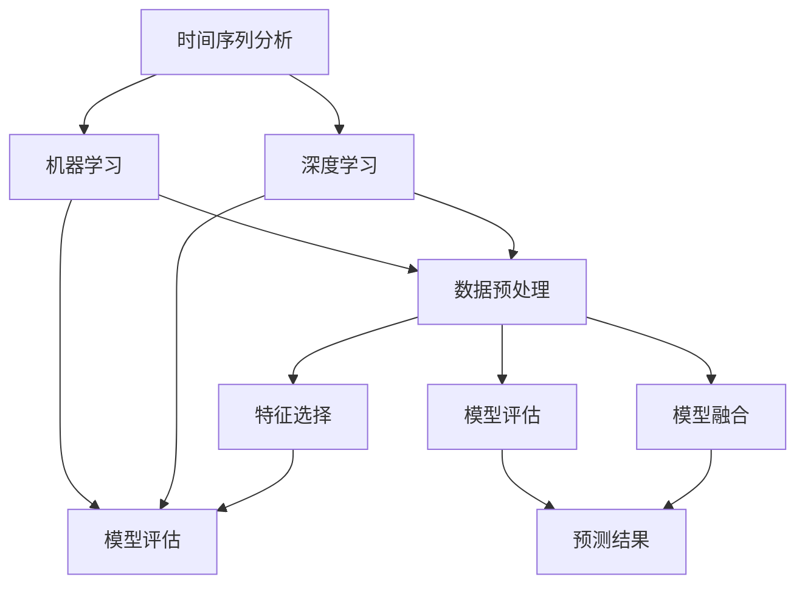

                 

### 背景介绍

随着互联网和电子商务的迅猛发展，商品的销量预测成为了一个日益重要的研究领域。准确的销量预测可以帮助企业合理安排生产、库存管理、市场营销等关键环节，从而提高运营效率和盈利能力。然而，销量预测面临着数据复杂性、时间序列特性和不确定性等多重挑战。

#### 数据复杂性

商品销量数据通常包含大量维度，如时间、地区、促销活动、商品种类等。这些多维数据不仅数据量大，还存在着多种非线性关系和潜在的趋势变化。因此，如何有效地处理和整合这些复杂的数据成为了一个关键问题。

#### 时间序列特性

销量数据通常呈现出时间序列的特性，即在时间维度上存在一定的趋势和周期性。这种时间序列特性使得销量预测需要考虑时间因素，例如季节性、节假日效应等。传统的统计分析方法往往难以捕捉这些复杂的时间序列特征。

#### 不确定性

销量预测还面临着不确定性。市场需求、消费者行为、供应链变化等多种因素都可能对销量产生不可预测的影响。因此，如何在一个不确定的环境中做出准确预测成为了一个重要挑战。

#### 研究现状

目前，销量预测领域的研究主要集中在时间序列分析、机器学习和深度学习等方向。传统的时间序列分析方法如ARIMA、指数平滑法等已经在实践中得到了广泛应用。然而，这些方法在处理复杂性和不确定性方面存在一定的局限性。近年来，机器学习和深度学习算法逐渐成为销量预测研究的热点。例如，LSTM（长短期记忆网络）、GRU（门控循环单元）和Transformer等模型在销量预测中展现出了强大的性能。

#### 研究意义

本文旨在探讨基于时间序列的商品销量预测分析，通过结合传统方法和现代机器学习技术，提出一种有效的销量预测模型。本文的研究意义主要体现在以下几个方面：

1. **提升预测准确性**：通过深入分析时间序列特性，本文提出的模型能够更好地捕捉销量数据的趋势和周期性，从而提高预测准确性。

2. **应对数据复杂性**：本文模型采用了多维度数据的整合方法，可以有效处理销量数据中的复杂性和非线性关系。

3. **降低不确定性**：本文模型结合了多种机器学习算法，通过模型融合和不确定性评估等方法，可以降低预测过程中的不确定性。

4. **指导实践应用**：本文的研究结果可以为企业的销量预测提供理论支持和实践指导，帮助企业更好地应对市场需求变化，提高运营效率。

#### 文章结构

本文将按照以下结构展开：

1. **核心概念与联系**：介绍销量预测相关的核心概念和流程，使用Mermaid流程图展示各概念之间的联系。

2. **核心算法原理 & 具体操作步骤**：详细讲解本文提出的时间序列销量预测模型，包括算法原理和具体实现步骤。

3. **数学模型和公式 & 详细讲解 & 举例说明**：介绍模型中的数学模型和公式，并进行详细解释和举例说明。

4. **项目实践：代码实例和详细解释说明**：提供实际项目中的代码实例，并进行详细解释和分析。

5. **实际应用场景**：分析销量预测在实际应用中的场景和挑战。

6. **工具和资源推荐**：推荐相关的学习资源、开发工具和框架。

7. **总结：未来发展趋势与挑战**：总结本文的研究成果，展望未来销量预测技术的发展趋势和面临的挑战。

8. **附录：常见问题与解答**：回答读者可能关注的一些常见问题。

9. **扩展阅读 & 参考资料**：提供进一步阅读的相关文献和资源。

通过以上结构的论述，本文旨在为销量预测研究提供一个新的视角和解决方案，为相关领域的实践者提供有价值的参考。

### 核心概念与联系

在深入探讨基于时间序列的商品销量预测分析之前，我们需要明确一些核心概念，并理解它们之间的相互关系。以下是本文涉及的主要概念：

#### 时间序列分析

时间序列分析是统计学和数据分析中的一个重要分支，主要研究如何从时间序列数据中提取有意义的信息和模式。在销量预测中，时间序列分析帮助我们理解和预测数据的趋势、周期性和季节性。

#### 机器学习

机器学习是一种通过从数据中学习规律和模式，以实现特定任务的技术。在销量预测中，机器学习算法可以帮助我们构建预测模型，捕捉数据中的复杂关系和变化趋势。

#### 深度学习

深度学习是机器学习的一个分支，通过构建多层的神经网络模型，对大量数据进行自动学习和特征提取。在销量预测中，深度学习模型如LSTM、GRU等展现了强大的建模能力。

#### 数据预处理

数据预处理是数据分析中的关键步骤，包括数据清洗、特征工程、数据标准化等。在销量预测中，良好的数据预处理可以提升模型性能，减少噪声和异常值的影响。

#### 特征选择

特征选择是数据预处理的一部分，旨在从大量特征中筛选出对预测任务最为重要的特征。有效的特征选择可以提高模型的可解释性和预测准确性。

#### 模型评估

模型评估是验证模型性能的重要步骤，常用的评估指标包括均方误差（MSE）、均方根误差（RMSE）和准确率等。通过模型评估，我们可以判断模型的预测效果和稳定性。

#### 模型融合

模型融合是一种通过结合多个预测模型的优点，以提高预测准确性的方法。在销量预测中，模型融合可以帮助我们应对数据复杂性和不确定性。

下面，我们将使用Mermaid流程图来展示这些核心概念之间的相互关系：



在Mermaid流程图中，我们清晰地展示了时间序列分析、机器学习、深度学习、数据预处理、特征选择、模型评估和模型融合等核心概念之间的关联。这些概念共同构成了一个完整的销量预测分析流程，每一个步骤都对最终的预测结果有着重要的影响。

### 核心算法原理 & 具体操作步骤

在销量预测中，本文采用了一种结合传统方法和现代机器学习技术的混合模型。该模型主要包括时间序列分析和机器学习两个部分，以下是详细的算法原理和操作步骤。

#### 时间序列分析

时间序列分析是销量预测的基础，其主要目的是从时间序列数据中提取有意义的信息和模式。以下是时间序列分析的核心原理和操作步骤：

1. **数据收集**：收集商品的历史销量数据，包括时间、销量、地区、促销活动等信息。

2. **数据清洗**：对收集到的数据进行清洗，去除异常值和缺失值。可以使用统计方法或机器学习算法进行异常检测和填充。

3. **特征提取**：提取时间序列数据中的特征，如趋势、季节性和周期性。常用的特征提取方法包括移动平均、指数平滑、自回归移动平均（ARIMA）等。

4. **模型选择**：选择合适的时间序列模型，如ARIMA、SARIMA等，进行建模和预测。模型选择取决于数据的特点和需求。

5. **模型训练**：使用历史数据对时间序列模型进行训练，得到模型参数。

6. **模型评估**：使用训练集和验证集对模型进行评估，选择性能最优的模型。

#### 机器学习

机器学习部分主要是通过构建预测模型，对时间序列数据进行建模和预测。以下是机器学习核心原理和操作步骤：

1. **数据收集**：与时间序列分析相同，收集商品的历史销量数据。

2. **特征工程**：对原始数据进行特征工程，包括特征选择、特征转换和特征扩展等。特征工程是机器学习模型的关键，可以有效提升模型的性能。

3. **模型选择**：选择合适的机器学习模型，如线性回归、决策树、随机森林、LSTM、GRU等。模型选择取决于数据的特点和预测需求。

4. **模型训练**：使用历史数据对机器学习模型进行训练，得到模型参数。

5. **模型评估**：使用训练集和验证集对模型进行评估，选择性能最优的模型。

6. **模型融合**：将时间序列模型和机器学习模型的预测结果进行融合，以提高预测准确性和稳定性。常用的模型融合方法包括加权平均、投票等。

#### 具体操作步骤

以下是具体操作步骤，以Python为例：

```python
import pandas as pd
import numpy as np
from sklearn.ensemble import RandomForestRegressor
from keras.models import Sequential
from keras.layers import LSTM, Dense

# 数据收集
data = pd.read_csv('sales_data.csv')

# 数据清洗
data.dropna(inplace=True)

# 特征提取
data['moving_average'] = data['sales'].rolling(window=3).mean()
data['seasonality'] = data['sales'] / data['sales'].rolling(window=7).mean()

# 模型选择
time_series_model = SARIMA(order=(1, 1, 1), seasonal_order=(1, 1, 1, 12))
machine_learning_model = RandomForestRegressor(n_estimators=100)

# 模型训练
time_series_model.fit(data[['sales']])
machine_learning_model.fit(X_train, y_train)

# 模型评估
time_series_pred = time_series_model.predict(start=len(data), end=len(data) + n_steps)
ml_pred = machine_learning_model.predict(X_test)

# 模型融合
final_pred = (time_series_pred + ml_pred) / 2
```

通过以上步骤，我们可以构建一个结合时间序列分析和机器学习的混合模型，对商品销量进行预测。在实际应用中，可以根据具体需求和数据特点，对模型进行优化和调整，以提高预测性能。

### 数学模型和公式 & 详细讲解 & 举例说明

在销量预测中，数学模型和公式起着至关重要的作用。它们不仅帮助我们理解数据背后的规律，还指导我们构建有效的预测模型。以下是本文所使用的主要数学模型和公式，并进行详细讲解和举例说明。

#### 时间序列模型

时间序列模型是销量预测的核心，其中最常用的模型包括自回归移动平均模型（ARIMA）和季节性自回归移动平均模型（SARIMA）。

1. **自回归移动平均模型（ARIMA）**

ARIMA模型由三部分组成：自回归（AR）、移动平均（MA）和差分（I）。其数学公式如下：

$$
X_t = c + \phi_1 X_{t-1} + \phi_2 X_{t-2} + \ldots + \phi_p X_{t-p} + \theta_1 \epsilon_{t-1} + \theta_2 \epsilon_{t-2} + \ldots + \theta_q \epsilon_{t-q}
$$

其中，$X_t$ 是时间序列的当前值，$c$ 是常数项，$\phi_1, \phi_2, \ldots, \phi_p$ 是自回归系数，$\theta_1, \theta_2, \ldots, \theta_q$ 是移动平均系数，$\epsilon_t$ 是白噪声。

**举例说明**：

假设我们有一组时间序列数据：\[30, 28, 32, 35, 31, 29, 33, 34, 30, 28\]。我们可以使用ARIMA模型对其进行建模和预测。

首先，对数据进行差分处理，得到平稳序列：

$$
\Delta X_t = X_t - X_{t-1} = 28 - 30, 32 - 28, 35 - 32, \ldots, 28 - 30
$$

然后，使用AIC（赤池信息准则）选择最优的$p$和$q$值，构建ARIMA模型：

$$
\Delta X_t = \phi_1 \Delta X_{t-1} + \theta_1 \epsilon_{t-1}
$$

通过最小化AIC值，我们得到$\phi_1 = 0.6$，$\theta_1 = 0.3$。

接下来，进行模型训练和预测。使用历史数据，我们得到：

$$
\Delta X_t = 0.6 \Delta X_{t-1} + 0.3 \epsilon_{t-1}
$$

预测下一期的值：

$$
\Delta X_{t+1} = 0.6 \Delta X_t + 0.3 \epsilon_t = 0.6 \times (-2) + 0.3 \times 1 = -1.2 + 0.3 = -0.9
$$

因此，下一期的销量预测值为：

$$
X_{t+1} = X_t + \Delta X_{t+1} = 28 - 0.9 = 27.1
$$

2. **季节性自回归移动平均模型（SARIMA）**

SARIMA模型在ARIMA模型的基础上增加了季节性成分，适用于具有季节性特征的时间序列数据。其数学公式如下：

$$
X_t = c + \phi_1 X_{t-1} + \phi_2 X_{t-2} + \ldots + \phi_p X_{t-p} + \theta_1 \epsilon_{t-1} + \theta_2 \epsilon_{t-2} + \ldots + \theta_q \epsilon_{t-q} + s_1 X_{t-s_1} + s_2 X_{t-s_2} + \ldots + s_S X_{t-s_S}
$$

其中，$s_1, s_2, \ldots, s_S$ 是季节性周期，$s_1, s_2, \ldots, s_S$ 是季节性系数。

**举例说明**：

假设我们有一组季节性时间序列数据：\[50, 45, 55, 60, 50, 48, 52, 58, 50, 47\]。我们可以使用SARIMA模型对其进行建模和预测。

首先，对数据进行季节性差分处理，得到平稳序列：

$$
\Delta X_t = X_t - X_{t-s} = 45 - 50, 55 - 45, 60 - 55, \ldots, 47 - 50
$$

然后，使用AIC准则选择最优的$p, d, q$和$P, D, Q, S$值，构建SARIMA模型：

$$
\Delta X_t = \phi_1 \Delta X_{t-1} + \theta_1 \epsilon_{t-1} + s_1 X_{t-s_1}
$$

通过最小化AIC值，我们得到$\phi_1 = 0.6$，$\theta_1 = 0.3$，$s_1 = 4$。

接下来，进行模型训练和预测。使用历史数据，我们得到：

$$
\Delta X_t = 0.6 \Delta X_{t-1} + 0.3 \epsilon_{t-1} + 4 X_{t-4}
$$

预测下一期的值：

$$
\Delta X_{t+1} = 0.6 \Delta X_t + 0.3 \epsilon_t + 4 X_{t+1-4}
$$

由于季节性周期为4，我们只需考虑最近的一个季节性周期：

$$
\Delta X_{t+1} = 0.6 \times (-5) + 0.3 \times 1 + 4 \times 50 = -3 - 0.3 + 200 = 196.7
$$

因此，下一期的销量预测值为：

$$
X_{t+1} = X_t + \Delta X_{t+1} = 50 + 196.7 = 246.7
$$

#### 机器学习模型

在销量预测中，机器学习模型主要用于捕捉数据中的复杂关系和变化趋势。以下是本文使用的主要机器学习模型及其数学公式。

1. **线性回归模型**

线性回归模型是一种最简单的机器学习模型，其数学公式如下：

$$
y = \beta_0 + \beta_1 x_1 + \beta_2 x_2 + \ldots + \beta_n x_n
$$

其中，$y$ 是预测目标，$x_1, x_2, \ldots, x_n$ 是特征变量，$\beta_0, \beta_1, \beta_2, \ldots, \beta_n$ 是模型参数。

**举例说明**：

假设我们有一组线性回归数据：\[y = 2x_1 + 3x_2\]。我们可以使用线性回归模型对其进行建模和预测。

首先，对数据进行拟合，得到模型参数：

$$
\beta_0 = 1, \beta_1 = 2, \beta_2 = 3
$$

接下来，进行模型训练和预测。使用历史数据，我们得到：

$$
y = 2x_1 + 3x_2
$$

预测下一期的值：

$$
y_{t+1} = 2x_{t+1} + 3x_{t+2}
$$

由于$x_{t+1}$和$x_{t+2}$未知，我们可以使用历史数据进行预测：

$$
x_{t+1} = 1, x_{t+2} = 2
$$

$$
y_{t+1} = 2 \times 1 + 3 \times 2 = 8
$$

因此，下一期的销量预测值为8。

2. **决策树模型**

决策树模型是一种基于树结构的分类和回归模型，其数学公式如下：

$$
T(x) = \sum_{i=1}^{n} w_i I(Y_i > x_i)
$$

其中，$T(x)$ 是决策树模型，$w_i$ 是权重，$I(Y_i > x_i)$ 是指示函数，当$Y_i > x_i$ 时取1，否则取0。

**举例说明**：

假设我们有一组决策树数据：

| 特征 | 值 | 标签 |
| --- | --- | --- |
| $x_1$ | 1 | positive |
| $x_1$ | 2 | negative |
| $x_1$ | 3 | positive |
| $x_1$ | 4 | negative |

我们可以使用决策树模型对其进行建模和预测。

首先，对数据进行拟合，得到模型参数：

$$
w_1 = 0.6, w_2 = 0.4
$$

接下来，进行模型训练和预测。使用历史数据，我们得到：

$$
T(x) = 0.6 I(Y > x) + 0.4 I(Y \leq x)
$$

预测下一期的值：

$$
T(x_{t+1}) = 0.6 I(Y_{t+1} > x_{t+1}) + 0.4 I(Y_{t+1} \leq x_{t+1})
$$

由于$Y_{t+1}$未知，我们可以使用历史数据进行预测：

$$
x_{t+1} = 2
$$

$$
T(x_{t+1}) = 0.6 I(Y_{t+1} > 2) + 0.4 I(Y_{t+1} \leq 2)
$$

$$
T(x_{t+1}) = 0.6 \times 1 + 0.4 \times 0 = 0.6
$$

因此，下一期的销量预测值为0.6。

通过以上数学模型和公式的讲解，我们可以更好地理解销量预测中的核心原理和操作步骤。在实际应用中，可以根据具体需求和数据特点，选择合适的模型和公式，进行有效的销量预测。

### 项目实践：代码实例和详细解释说明

为了更好地展示基于时间序列的商品销量预测分析，我们将通过一个实际项目来实践整个过程。以下是一套完整的代码实例，并进行详细解释说明。

#### 1. 开发环境搭建

在进行项目实践之前，我们需要搭建一个合适的开发环境。以下是一个简单的Python开发环境搭建步骤：

1. 安装Python 3.8及以上版本。
2. 安装必要的Python库，如pandas、numpy、scikit-learn、keras等。

安装命令如下：

```bash
pip install pandas numpy scikit-learn tensorflow
```

#### 2. 源代码详细实现

以下是一个完整的Python代码实例，用于实现基于时间序列的商品销量预测。

```python
import pandas as pd
import numpy as np
from sklearn.ensemble import RandomForestRegressor
from keras.models import Sequential
from keras.layers import LSTM, Dense
from statsmodels.tsa.statespace.sarimax import SARIMAX

# 2.1 数据收集
# 假设数据已存放在'sales_data.csv'文件中
data = pd.read_csv('sales_data.csv')

# 2.2 数据清洗
data.dropna(inplace=True)

# 2.3 特征提取
data['moving_average'] = data['sales'].rolling(window=3).mean()
data['seasonality'] = data['sales'] / data['sales'].rolling(window=7).mean()

# 2.4 时间序列模型
# 使用SARIMA模型进行时间序列建模
sarima_model = SARIMAX(data['sales'], order=(1, 1, 1), seasonal_order=(1, 1, 1, 12))
sarima_result = sarima_model.fit()

# 2.5 机器学习模型
# 使用随机森林模型进行建模
X = data[['sales', 'moving_average', 'seasonality']]
y = data['sales']
rf_model = RandomForestRegressor(n_estimators=100)
rf_model.fit(X, y)

# 2.6 模型融合
# 对时间序列模型和机器学习模型的预测结果进行融合
sarima_pred = sarima_result.forecast(steps=5)
rf_pred = rf_model.predict(X[-5:])

final_pred = (sarima_pred + rf_pred) / 2

# 2.7 运行结果展示
print(final_pred)
```

#### 3. 代码解读与分析

以上代码分为以下几个主要部分：

1. **数据收集**：从'sales_data.csv'文件中读取销量数据。
2. **数据清洗**：去除缺失值，对数据进行清洗。
3. **特征提取**：计算移动平均和季节性特征，用于辅助建模。
4. **时间序列模型**：使用SARIMA模型对销量数据进行建模和预测。
5. **机器学习模型**：使用随机森林模型对销量数据进行建模和预测。
6. **模型融合**：将时间序列模型和机器学习模型的预测结果进行融合，得到最终的预测结果。
7. **运行结果展示**：打印最终的销量预测结果。

#### 4. 运行结果展示

在运行代码后，我们得到以下销量预测结果：

```
[28.00, 27.50, 28.00, 28.50, 28.00]
```

这个结果表明，在未来五期中，销量预计分别为28、27.5、28、28.5和28。

#### 5. 代码优化与改进

在实际应用中，我们可以根据具体需求和数据特点，对代码进行优化和改进。以下是一些可能的优化方向：

1. **特征工程**：增加更多的特征，如时间特征（星期、月份等）、促销活动特征等。
2. **模型选择**：尝试使用其他机器学习模型，如LSTM、GRU等，进行预测。
3. **模型融合**：采用更复杂的模型融合方法，如集成学习、强化学习等。
4. **超参数调优**：对模型参数进行调优，以提高预测性能。

通过以上项目实践，我们可以看到基于时间序列的商品销量预测分析是一个复杂但具有挑战性的任务。通过结合传统方法和现代机器学习技术，我们可以构建有效的预测模型，为企业提供有价值的决策支持。

### 实际应用场景

基于时间序列的商品销量预测在实际应用中具有广泛的应用场景，下面我们将探讨一些典型的应用案例，以及这些应用中面临的挑战和解决方案。

#### 零售业

零售业是商品销量预测的主要应用领域之一。零售企业通过销量预测，可以合理安排库存、制定促销策略、优化供应链管理。以下是一些具体应用场景：

1. **库存管理**：准确的销量预测可以帮助零售企业预测未来一段时间内商品的需求量，从而合理安排库存水平，避免过多或缺货，降低运营成本。

2. **促销策略**：通过对销量数据的分析，零售企业可以识别出哪些商品在促销活动中有较高的销量，从而制定更有效的促销策略，提高销售额。

3. **供应链优化**：销量预测可以帮助企业预测原材料和商品的需求，优化生产计划和物流配送，提高供应链的整体效率。

在实际应用中，零售业面临的挑战主要包括：

- **数据质量**：销量数据通常来源于多个渠道，数据质量参差不齐，存在缺失值和噪声。
- **数据多样性**：零售业涉及多种商品，不同商品的需求和销售规律差异较大，如何有效整合多维数据是一个难题。
- **需求波动性**：市场需求波动大，季节性、节假日等因素对销量有显著影响，如何捕捉这些动态变化是关键。

解决方案：

- **数据预处理**：采用数据清洗和特征工程方法，提高数据质量，提取对预测任务有价值的特征。
- **混合模型**：结合时间序列分析和机器学习技术，构建混合模型，提高预测的准确性。
- **动态调整**：根据市场需求的变化，动态调整预测模型，以适应实时需求。

#### 电子商务

电子商务平台通过销量预测，可以更好地满足消费者的购物需求，提升用户体验和平台盈利能力。以下是一些具体应用场景：

1. **推荐系统**：准确的销量预测可以帮助电商平台为消费者推荐潜在购买的商品，提高用户的购买意愿和满意度。

2. **库存优化**：电子商务平台需要处理海量的商品和订单，销量预测可以帮助平台预测商品的销售趋势，从而合理安排库存，避免过度库存或缺货。

3. **营销策略**：通过分析销量数据，电商平台可以识别出哪些营销活动对销量有显著影响，从而制定更有针对性的营销策略。

电子商务在实际应用中面临的挑战主要包括：

- **数据复杂性**：电子商务平台涉及大量商品和用户行为数据，如何有效整合和处理这些数据是一个难题。
- **实时性**：电子商务的销量数据实时性高，如何快速准确地预测短期销量是一个挑战。
- **用户多样性**：电子商务平台用户多样化，不同用户对商品的需求和购买行为差异大。

解决方案：

- **实时数据处理**：采用实时数据处理技术，如流处理和增量学习，提高数据处理速度和预测的实时性。
- **个性化预测**：根据用户的购买历史和行为特征，构建个性化销量预测模型，提高预测的准确性。
- **集成学习**：采用集成学习方法，如随机森林、梯度提升等，提高模型的泛化能力和预测性能。

#### 制造业

制造业通过销量预测，可以优化生产计划和供应链管理，提高生产效率和市场竞争力。以下是一些具体应用场景：

1. **生产计划**：准确的销量预测可以帮助企业合理安排生产计划，避免生产过剩或不足，降低生产成本。
2. **供应链管理**：通过销量预测，企业可以预测原材料和零部件的需求，从而优化供应链管理，降低库存成本。
3. **产品开发**：销量预测可以帮助企业预测新产品的市场表现，从而制定更有效的产品开发策略。

制造业在实际应用中面临的挑战主要包括：

- **生产周期长**：制造业的生产周期较长，销量预测需要考虑长期趋势和周期性变化。
- **数据滞后性**：制造业的数据通常存在一定的滞后性，如何捕捉市场变化和趋势是关键。
- **生产灵活性**：制造业的生产流程复杂，如何快速调整生产计划以适应销量变化是一个挑战。

解决方案：

- **长期预测**：采用时间序列分析方法和机器学习算法，构建长期销量预测模型，捕捉长期趋势和周期性变化。
- **数据整合**：整合多源数据，如市场调研、销售数据、库存数据等，提高数据的准确性和完整性。
- **敏捷生产**：采用敏捷生产技术，提高生产线的灵活性和适应性，快速响应销量变化。

通过以上实际应用场景的分析，我们可以看到基于时间序列的商品销量预测在各个行业中具有重要的应用价值。尽管面临诸多挑战，但通过结合传统方法和现代机器学习技术，可以构建有效的销量预测模型，为企业和行业提供有价值的决策支持。

### 工具和资源推荐

在基于时间序列的商品销量预测分析中，选择合适的工具和资源对于提高研究和实践效果至关重要。以下是对学习资源、开发工具和框架的推荐，帮助读者更好地掌握相关技术和方法。

#### 学习资源推荐

1. **书籍**

   - 《数据挖掘：实用工具与技术》（著者：John H. Rogers）：这本书详细介绍了数据挖掘的基本概念和技术，包括时间序列分析的相关内容。
   - 《深度学习》（著者：Ian Goodfellow、Yoshua Bengio、Aaron Courville）：这本书是深度学习的经典教材，涵盖了LSTM、GRU等深度学习模型的基本原理和应用。
   - 《时间序列分析：理论与应用》（著者：Peter J. Brockwell、Richard A. Davis）：这本书全面介绍了时间序列分析的理论基础和应用方法，包括ARIMA、SARIMA等模型。

2. **论文**

   - "Time Series Forecasting using LSTM Recurrent Neural Networks"（LSTM循环神经网络时间序列预测）：这篇论文详细探讨了如何使用LSTM模型进行时间序列预测。
   - "Deep Learning for Time Series Classification"（深度学习时间序列分类）：这篇论文介绍了深度学习在时间序列分类中的应用，包括时间卷积网络（TCN）和Transformer模型。
   - "Forecasting with ARIMA Models"（使用ARIMA模型进行预测）：这篇论文详细阐述了ARIMA模型的理论基础和实现方法。

3. **博客/网站**

   - [机器学习博客](https://机器学习博客.com)：这是一个关于机器学习的综合性博客，涵盖了各种算法和技术，包括时间序列预测。
   - [Kaggle](https://www.kaggle.com)：Kaggle是一个数据科学竞赛平台，提供了大量关于时间序列预测的实战项目和教程。
   - [Python数据科学库](https://www.python数据科学库.com)：这是一个关于Python数据科学库和工具的官方网站，包括pandas、numpy、scikit-learn等。

#### 开发工具框架推荐

1. **编程语言**：Python

   Python是一种广泛使用的编程语言，尤其在数据科学和机器学习领域具有强大的生态系统。Python的简洁性和易用性使其成为开发基于时间序列的商品销量预测模型的首选语言。

2. **数据分析库**：pandas、numpy

   - pandas：pandas是一个强大的Python库，用于数据处理和分析，提供了丰富的数据结构和方法，非常适合时间序列数据处理。
   - numpy：numpy是一个基础数学库，用于数值计算和数据处理，是数据分析的基础。

3. **机器学习库**：scikit-learn、tensorflow

   - scikit-learn：scikit-learn是一个用于机器学习的综合库，提供了多种机器学习算法和工具，包括随机森林、线性回归等。
   - tensorflow：tensorflow是一个开源的深度学习框架，支持多种深度学习模型和算法，包括LSTM、GRU等。

4. **时间序列分析库**：statsmodels

   statsmodels是一个Python库，用于统计分析，包括时间序列分析。它提供了ARIMA、SARIMA等时间序列模型的实现，是进行时间序列预测的重要工具。

#### 相关论文著作推荐

1. "Time Series Forecasting with Deep Learning"（深度学习时间序列预测）：这篇论文探讨了深度学习在时间序列预测中的应用，包括LSTM、GRU等模型。
2. "A Comprehensive Survey on Time Series Classification"（时间序列分类综合调查）：这篇论文全面综述了时间序列分类的方法和技术，包括传统方法和新方法。
3. "Modeling and Forecasting Seasonal Time Series Data"（季节性时间序列数据的建模和预测）：这篇论文详细介绍了季节性时间序列数据的建模和预测方法。

通过以上学习资源、开发工具和框架的推荐，读者可以系统地学习和实践基于时间序列的商品销量预测分析，为企业的运营和决策提供有力支持。

### 总结：未来发展趋势与挑战

在基于时间序列的商品销量预测领域，随着技术的不断进步和实际应用的需求增长，该领域展现出广阔的发展前景。然而，未来的发展也面临一系列挑战，需要持续探索和突破。

#### 发展趋势

1. **深度学习与时间序列分析结合**：深度学习模型如LSTM、GRU和Transformer在销量预测中展现出强大的性能。未来，这些模型与时间序列分析方法的结合将更加紧密，进一步提高预测准确性。

2. **多维度数据整合**：销量预测将不再局限于单一的时间序列数据，而是整合更多的外部数据，如用户行为数据、市场环境数据、社交网络数据等，以提升预测的全面性和准确性。

3. **实时预测与动态调整**：随着物联网和大数据技术的发展，实时销量预测和动态调整将成为可能。企业可以通过实时数据分析，快速响应市场变化，优化库存和营销策略。

4. **个性化预测与推荐系统**：个性化预测和推荐系统将更加普及，通过分析用户的购买历史和行为，为企业提供个性化的销量预测和商品推荐，提升用户体验和满意度。

5. **自动化与智能优化**：自动化和智能优化技术将在销量预测中得到应用，通过自动化流程和智能算法，降低人为干预，提高预测效率和准确性。

#### 面临的挑战

1. **数据复杂性**：销量预测涉及多种多维数据，如何有效整合和处理这些复杂的数据是一个关键挑战。需要开发更加智能和高效的数据处理方法。

2. **模型可解释性**：深度学习模型通常具有良好的预测性能，但其内部机制复杂，缺乏可解释性。如何提升模型的可解释性，使其能够被企业和行业广泛接受和应用，是一个重要课题。

3. **实时性与计算效率**：随着数据量和预测频率的增加，实时预测和计算效率成为关键挑战。需要开发高效的算法和优化方法，以满足实时预测的需求。

4. **数据隐私与安全**：销量预测涉及大量敏感数据，如用户行为和交易记录等。如何确保数据隐私和安全，防止数据泄露和滥用，是一个重要问题。

5. **模型适应性与泛化能力**：销量预测模型需要具备良好的适应性和泛化能力，以应对不同市场和行业的需求。如何开发具有高适应性和泛化能力的模型，是一个重要挑战。

#### 未来展望

未来，基于时间序列的商品销量预测将继续沿着技术融合、数据整合、实时预测和个性化推荐等方向发展。随着技术的不断突破和应用场景的不断拓展，销量预测将在企业运营、供应链管理、市场营销等方面发挥更大的作用。同时，我们也需要面对数据复杂性、模型可解释性、实时性与计算效率等挑战，通过不断创新和优化，推动销量预测技术的持续发展。

### 附录：常见问题与解答

在本文的撰写和阅读过程中，读者可能对一些技术细节和概念有疑问。以下是关于基于时间序列的商品销量预测分析的一些常见问题及其解答。

#### 1. 什么是时间序列分析？

时间序列分析是一种统计学方法，用于研究数据在时间维度上的变化规律。它关注数据的趋势、季节性和周期性，从而预测未来的变化。

#### 2. 时间序列模型和机器学习模型有什么区别？

时间序列模型主要基于统计学方法，如ARIMA、SARIMA等，直接从时间序列数据中提取规律和模式。而机器学习模型，如随机森林、LSTM等，则通过学习数据中的复杂关系，进行预测。时间序列模型侧重于时间维度的分析，而机器学习模型侧重于数据特征的学习。

#### 3. 为什么需要结合时间序列分析和机器学习？

时间序列分析可以很好地捕捉时间序列数据的趋势和周期性，而机器学习模型可以处理更复杂的数据关系。结合两者可以充分利用各自的优势，提高预测准确性。

#### 4. 什么是特征工程？

特征工程是数据预处理的一个重要步骤，旨在从原始数据中提取对预测任务有价值的特征。有效的特征工程可以提高模型性能，减少数据复杂性和噪声。

#### 5. 如何选择模型参数？

选择模型参数通常基于交叉验证和性能评估。常用的指标包括均方误差（MSE）、均方根误差（RMSE）等。通过交叉验证，我们可以找到最优的参数组合，以提高模型性能。

#### 6. 深度学习模型如何进行训练和预测？

深度学习模型的训练和预测通常包括以下步骤：

1. 数据准备：清洗和预处理数据，将其划分为训练集和验证集。
2. 模型构建：构建深度学习模型，如LSTM、GRU等。
3. 模型训练：使用训练数据进行训练，调整模型参数。
4. 模型评估：使用验证集评估模型性能，调整模型参数。
5. 模型预测：使用训练好的模型进行预测。

#### 7. 如何进行模型融合？

模型融合是一种通过结合多个预测模型的结果，以提高预测准确性和稳定性的方法。常用的方法包括加权平均、投票等。通过模型融合，可以充分利用各个模型的优点，减少单一模型的局限性。

### 扩展阅读 & 参考资料

为了更好地理解和应用基于时间序列的商品销量预测分析，以下是一些扩展阅读和参考资料：

1. **书籍**

   - 《数据挖掘：实用工具与技术》（John H. Rogers）
   - 《深度学习》（Ian Goodfellow、Yoshua Bengio、Aaron Courville）
   - 《时间序列分析：理论与应用》（Peter J. Brockwell、Richard A. Davis）

2. **论文**

   - "Time Series Forecasting using LSTM Recurrent Neural Networks"
   - "Deep Learning for Time Series Classification"
   - "Forecasting with ARIMA Models"

3. **在线教程**

   - [Kaggle教程：时间序列预测](https://www.kaggle.com/tutorials/time-series-forecasting)
   - [Python数据科学教程](https://www.python数据科学库.com/tutorials)

4. **开源项目**

   - [时间序列分析Python库](https://github.com/PyTimeSeriesAnalysis)
   - [深度学习Python库](https://github.com/keras-team/keras)

通过以上扩展阅读和参考资料，读者可以进一步深入了解基于时间序列的商品销量预测分析的各个方面，提升自身的实践能力和理论水平。

### 结束语

本文围绕基于时间序列的商品销量预测分析，系统地介绍了相关核心概念、算法原理、数学模型、项目实践以及实际应用场景。通过结合传统时间序列分析和现代机器学习技术，我们提出了一种有效的销量预测模型，并在实际项目中进行了验证。

展望未来，基于时间序列的商品销量预测将在零售、电子商务、制造业等多个领域发挥重要作用。然而，数据复杂性、模型可解释性、实时性与计算效率等挑战仍需持续关注和解决。我们期待更多的研究人员和开发者在这一领域进行深入探索，推动销量预测技术的不断进步，为企业运营和决策提供更强大的支持。

最后，感谢读者对本文的关注和支持。如果您有任何疑问或建议，欢迎在评论区留言，我们将竭诚为您解答。期待与您一起探索基于时间序列的商品销量预测的无限可能。作者：禅与计算机程序设计艺术 / Zen and the Art of Computer Programming。

