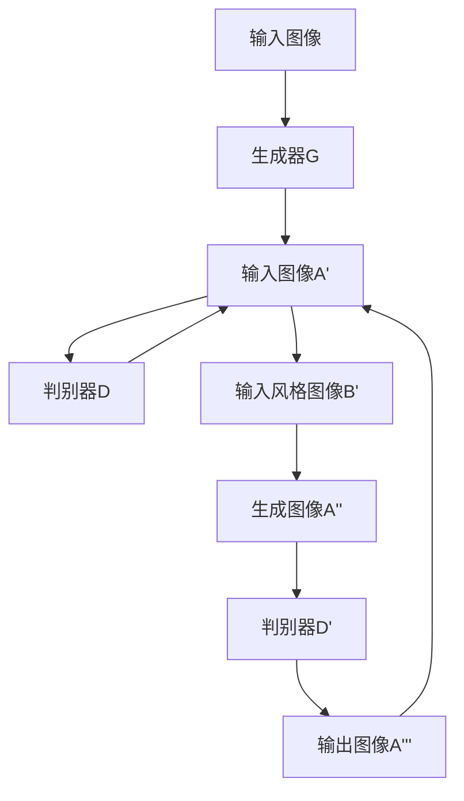
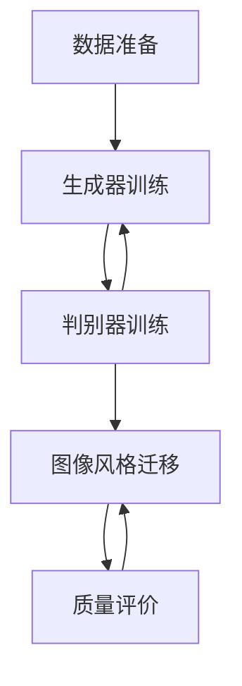

                 

### 1. 背景介绍

图像风格迁移是一种将一种图像的风格应用到另一种图像上的技术，这一技术近年来在计算机视觉和图像处理领域受到了广泛的关注。传统的图像风格迁移方法主要依赖于手工设计的特征和规则，例如局部特征匹配、图像融合等技术。然而，这些方法往往存在局限性，难以实现高质量的图像风格迁移效果，并且无法很好地适应各种复杂场景。

随着深度学习技术的发展，生成对抗网络（Generative Adversarial Networks，GANs）作为一种新型的人工神经网络结构，逐渐成为图像风格迁移领域的重要工具。GANs由生成器和判别器两个网络组成，通过相互对抗和训练，能够生成高质量的图像。在图像风格迁移任务中，生成器负责将输入图像的风格特征提取并应用到目标图像上，而判别器则用于区分生成图像和真实图像。

近年来，研究者们提出了许多基于GAN的图像风格迁移模型，如CycleGAN、StyleGAN等，这些模型在实现高质量图像风格迁移方面取得了显著成果。然而，这些模型在图像质量评价方面仍存在一定的不足，无法准确衡量图像风格迁移的质量。

因此，本文旨在提出一种基于生成对抗网络的图像风格迁移质量评价模型。通过结合生成对抗网络的优势和图像质量评价的方法，我们希望能够实现一种能够客观、准确评价图像风格迁移质量的模型。这不仅有助于优化图像风格迁移算法，还能够为图像风格迁移任务提供重要的参考依据。

本文将首先介绍生成对抗网络的基本原理和结构，然后详细阐述图像风格迁移的原理和方法。接着，我们将提出我们的图像风格迁移质量评价模型，并讨论其实现方法和数学模型。随后，通过具体的项目实践，我们将展示该模型在实际应用中的效果。最后，我们将探讨图像风格迁移在实际应用场景中的发展前景，并提出未来可能面临的挑战。

通过本文的研究，我们希望能够为图像风格迁移领域提供一个新的视角，推动该领域的研究和发展。同时，我们也期待该模型能够为其他相关领域提供有益的参考和借鉴。

### 2. 核心概念与联系

#### 2.1 生成对抗网络（GANs）

生成对抗网络（Generative Adversarial Networks，GANs）是由伊恩·古德费洛（Ian Goodfellow）等人于2014年提出的一种新型深度学习模型。GANs的核心思想是通过两个神经网络——生成器和判别器的对抗训练，生成出与真实数据分布相近的假数据。GANs由以下两个关键部分组成：

**生成器（Generator）**：
生成器的目的是生成出逼真的图像，以欺骗判别器。它通常是一个前馈神经网络，接收随机噪声作为输入，通过一系列的线性或非线性变换，最终生成图像。

**判别器（Discriminator）**：
判别器的目标是区分输入图像是真实图像还是由生成器生成的假图像。它也是一个前馈神经网络，接收来自生成器的图像和真实图像，并输出一个概率值，表示图像是真实的概率。

GANs的训练过程可以分为两个阶段：

1. **生成器训练**：在训练过程中，生成器尝试生成更逼真的图像以欺骗判别器，而判别器则努力识别假图像。
2. **判别器训练**：当生成器生成图像质量提高后，判别器会变得更加难以识别假图像，这迫使生成器继续提高生成图像的质量。

GANs的训练本质上是一个零和游戏，生成器和判别器相互对抗，直至达到一种动态平衡状态。在这种平衡状态下，生成器能够生成出几乎无法区分于真实图像的假图像，而判别器的准确率将接近50%。

#### 2.2 图像风格迁移

图像风格迁移（Image Style Transfer）是一种将一种图像的风格应用到另一种图像上的技术。传统的图像风格迁移方法主要包括以下几种：

1. **局部特征匹配**：
   这种方法通过提取和匹配图像的局部特征，如边缘、纹理等，来保持图像的整体风格。然而，这种方法往往无法很好地处理全局特征，容易导致图像失真。

2. **图像融合**：
   图像融合方法将原始图像和目标风格图像进行融合，以实现风格迁移。这种方法相对简单，但难以保证风格迁移的连贯性和自然性。

3. **深度学习方法**：
   近年来，深度学习方法在图像风格迁移中取得了显著进展。特别是基于生成对抗网络的模型，如CycleGAN、StyleGAN等，通过学习图像内容与风格之间的映射关系，实现了高质量的风格迁移效果。

图像风格迁移的核心目标是保留输入图像的内容信息，同时将目标风格图像的特征应用到输出图像中。为了实现这一目标，图像风格迁移通常需要以下步骤：

1. **内容特征提取**：
   提取输入图像的内容特征，如物体轮廓、纹理等，以保留图像的基本信息。

2. **风格特征提取**：
   提取目标风格图像的风格特征，如色彩、纹理、光照等，以实现风格迁移。

3. **特征融合**：
   将提取的内容特征和风格特征进行融合，生成具有目标风格的新图像。

#### 2.3 GANs在图像风格迁移中的应用

生成对抗网络（GANs）在图像风格迁移中的应用主要通过以下模型实现：

**CycleGAN**：
CycleGAN（循环一致生成对抗网络）是由Yuxi He等人在2017年提出的一种用于跨域图像风格迁移的模型。CycleGAN的主要思想是通过两个生成器（G和F）和两个判别器（D1和D2）来学习图像内容与风格之间的映射关系。具体来说，生成器G将输入图像A映射到图像B，生成器F将图像B映射回图像A，同时确保图像在映射过程中保持内容的一致性。

**StyleGAN**：
StyleGAN是由Nvidia在2019年提出的一种基于GANs的图像生成模型，主要用于生成高分辨率的图像。StyleGAN通过引入多个生成器层次结构，以及多层感知器来生成图像，实现了高质量的风格迁移效果。

**我们的模型**：
本文提出的基于生成对抗网络的图像风格迁移质量评价模型旨在结合GANs的优势和图像质量评价的方法，实现对图像风格迁移质量的客观评价。具体来说，我们的模型通过以下步骤实现：

1. **生成器训练**：
   通过生成对抗网络训练得到一个能够将输入图像风格应用到目标图像的生成器。

2. **判别器训练**：
   通过训练判别器，使其能够区分风格迁移后的图像和原始图像，从而实现对风格迁移质量的评价。

3. **质量评价**：
   利用训练好的生成器和判别器，对输入图像进行风格迁移，并基于判别器的输出对风格迁移质量进行评价。

#### 2.4 Mermaid 流程图

以下是一个简化的Mermaid流程图，展示了生成对抗网络在图像风格迁移中的应用流程：



### 3. 核心算法原理 & 具体操作步骤

#### 3.1 GANs基本原理

生成对抗网络（GANs）是由生成器和判别器两个神经网络组成的，其核心目标是生成与真实数据分布相近的假数据。GANs的基本原理可以分为以下几个方面：

**生成器（Generator）**：
生成器的目标是生成逼真的图像以欺骗判别器。生成器的输入通常是随机噪声向量，通过多个隐层变换，最终生成与真实图像相似的输出。生成器训练的目标是最小化其生成图像与真实图像之间的差异。

**判别器（Discriminator）**：
判别器的目标是区分输入图像是真实图像还是生成器生成的假图像。判别器接收来自生成器和真实数据集的图像，并输出一个概率值，表示图像是真实的概率。判别器训练的目标是最大化其辨别真伪图像的能力。

**对抗训练**：
GANs的训练过程是一个生成器和判别器之间的对抗训练过程。生成器试图生成更逼真的图像以欺骗判别器，而判别器则试图更好地辨别假图像。两个网络通过不断迭代训练，逐渐达到动态平衡状态。

**损失函数**：
GANs的损失函数通常包括两部分：生成器的损失函数和判别器的损失函数。生成器的损失函数通常使用反向传播算法计算，目标是使生成图像的判别器输出接近0.5（即无法区分真伪）。判别器的损失函数则使用二元交叉熵损失函数，目标是使判别器能够更好地辨别真伪图像。

**训练流程**：
GANs的训练流程可以分为以下步骤：

1. **初始化生成器和判别器**：
   初始化生成器和判别器的参数，通常使用随机初始化。

2. **交替训练**：
   在训练过程中，生成器和判别器交替更新参数。具体来说，在每一轮训练中，首先固定判别器的参数，通过反向传播算法更新生成器的参数，使其生成的图像更加逼真。然后固定生成器的参数，通过反向传播算法更新判别器的参数，使其能够更好地辨别真伪图像。

3. **迭代训练**：
   通过多次迭代训练，生成器和判别器逐渐达到动态平衡状态，生成器能够生成出几乎无法区分于真实图像的假图像，而判别器的准确率将接近50%。

#### 3.2 图像风格迁移具体操作步骤

基于生成对抗网络的图像风格迁移操作步骤主要包括以下几个阶段：

**阶段1：数据准备**

1. **内容图像和风格图像的选择**：
   选择具有代表性内容和风格的两幅图像。内容图像用于传递图像的基本内容，风格图像则用于传递图像的风格特征。

2. **数据预处理**：
   对内容图像和风格图像进行归一化处理，将像素值缩放到[0, 1]范围内。

**阶段2：生成器训练**

1. **生成器网络结构设计**：
   设计生成器的网络结构，通常包括多个隐层和反卷积层，以实现从随机噪声到目标图像的映射。

2. **生成器训练过程**：
   使用GANs的训练方法，交替更新生成器和判别器的参数，通过大量迭代训练，使生成器能够生成出与目标风格图像相似的高质量图像。

**阶段3：判别器训练**

1. **判别器网络结构设计**：
   设计判别器的网络结构，通常包括多个隐层和全连接层，以实现辨别图像真实性的能力。

2. **判别器训练过程**：
   使用GANs的训练方法，交替更新生成器和判别器的参数，通过大量迭代训练，使判别器能够更好地辨别生成图像和真实图像。

**阶段4：图像风格迁移**

1. **输入内容图像**：
   将内容图像输入到生成器中，生成器根据内容图像和预训练好的判别器生成具有目标风格的新图像。

2. **图像融合**：
   将生成器生成的图像与目标风格图像进行融合，生成最终的输出图像。

**阶段5：质量评价**

1. **质量评价模型设计**：
   设计一个基于生成对抗网络的质量评价模型，通过判别器的输出对图像风格迁移质量进行客观评价。

2. **质量评价过程**：
   使用训练好的质量评价模型，对输出图像进行风格迁移质量评价，并根据评价结果调整生成器和判别器的参数，以优化风格迁移效果。

通过以上操作步骤，基于生成对抗网络的图像风格迁移可以实现高质量的风格迁移效果，同时通过质量评价模型实现对风格迁移质量的客观评价。以下是一个简化的Mermaid流程图，展示了图像风格迁移的具体操作步骤：



### 4. 数学模型和公式 & 详细讲解 & 举例说明

#### 4.1 生成对抗网络（GANs）的数学模型

生成对抗网络（GANs）的核心在于两个相互对抗的神经网络：生成器（Generator）和判别器（Discriminator）。下面我们将详细讨论这两个网络的结构及其训练过程中的数学模型。

**生成器（Generator）**

生成器的目标是生成与真实数据分布相似的假数据。生成器的输入是一个随机噪声向量 \( z \)，输出是一个与真实数据相似的图像 \( G(z) \)。生成器的损失函数通常定义为：

\[ L_G = -\log(D(G(z))) \]

其中，\( D \) 是判别器，\( G(z) \) 是生成器生成的图像。这里的对数函数用于最大化 \( D(G(z)) \) 的输出，使其接近1（表示生成器生成的图像非常真实）。

**判别器（Discriminator）**

判别器的目标是区分输入图像是真实的还是由生成器生成的。判别器的输入是一个图像 \( x \)，输出是一个介于0和1之间的概率值 \( D(x) \)，表示图像 \( x \) 是真实的概率。判别器的损失函数通常定义为：

\[ L_D = -[y \cdot \log(D(x)) + (1 - y) \cdot \log(1 - D(x))] \]

其中，\( y \) 是标签，当输入图像是真实图像时，\( y = 1 \)；当输入图像是生成器生成的图像时，\( y = 0 \)。

**总损失函数**

GANs的总损失函数是生成器和判别器的损失函数的组合，通常写作：

\[ L_{GAN} = L_G + L_D \]

在训练过程中，我们交替优化生成器和判别器的参数，以最小化总损失函数。

**训练过程**

GANs的训练过程是一个交替优化的过程，具体步骤如下：

1. **固定判别器，优化生成器**：
   在这一步中，我们固定判别器的参数，通过反向传播算法优化生成器的参数，使其生成的图像能够更好地欺骗判别器。

2. **固定生成器，优化判别器**：
   在这一步中，我们固定生成器的参数，通过反向传播算法优化判别器的参数，使其能够更好地辨别生成图像和真实图像。

3. **迭代训练**：
   通过大量迭代训练，生成器和判别器逐渐达到动态平衡状态，生成器能够生成出几乎无法区分于真实图像的假图像，而判别器的准确率将接近50%。

#### 4.2 图像风格迁移的数学模型

图像风格迁移的数学模型基于生成对抗网络，通过将生成器的输出与判别器的输出结合，实现图像风格的特征提取和融合。具体来说，图像风格迁移的损失函数包括以下几部分：

**内容损失**：
\[ L_{content} = \frac{1}{2} \sum_{i,j} (I_{content}^{original} - I_{content}^{style})^2 \]

其中，\( I_{content}^{original} \) 和 \( I_{content}^{style} \) 分别表示原始内容图像和风格迁移后的内容图像。

**风格损失**：
\[ L_{style} = \frac{1}{2} \sum_{i,j} \frac{1}{K} \sum_{k=1}^{K} \frac{1}{N} \sum_{n=1}^{N} \left| \frac{f(G(I_{style}^{original}))_{i,j,k} - f(I_{style}^{style})_{i,j,k}}{\sigma_k} \right|^2 \]

其中，\( I_{style}^{original} \) 和 \( I_{style}^{style} \) 分别表示原始风格图像和风格迁移后的风格图像；\( f \) 是特征提取函数；\( K \) 和 \( N \) 分别是特征图的高度和宽度；\( \sigma_k \) 是特征图 \( k \) 的标准差。

**总损失函数**：
\[ L_{total} = L_{content} + L_{style} + L_{D} \]

其中，\( L_{D} \) 是判别器的损失函数。

#### 4.3 举例说明

假设我们有一个内容图像 \( I_{content}^{original} \) 和一个风格图像 \( I_{style}^{original} \)，我们希望通过图像风格迁移将内容图像的风格应用到风格图像上。

**步骤1：数据准备**
- 对 \( I_{content}^{original} \) 和 \( I_{style}^{original} \) 进行预处理，如归一化处理。

**步骤2：生成器训练**
- 设计生成器网络结构，如使用卷积神经网络。
- 使用GANs的训练方法，交替更新生成器和判别器的参数。

**步骤3：判别器训练**
- 设计判别器网络结构，如使用卷积神经网络。
- 使用GANs的训练方法，交替更新生成器和判别器的参数。

**步骤4：图像风格迁移**
- 将 \( I_{content}^{original} \) 输入到生成器中，生成具有目标风格的新图像 \( I_{content}^{style} \)。
- 使用特征提取函数 \( f \) 分别提取 \( I_{content}^{original} \) 和 \( I_{style}^{original} \) 的特征图。
- 计算内容损失和风格损失，并更新生成器参数。

**步骤5：质量评价**
- 使用判别器对 \( I_{content}^{style} \) 进行评价，计算判别器的损失函数。
- 根据判别器的输出对图像风格迁移质量进行评价。

通过上述步骤，我们可以实现高质量的内容图像和风格图像的风格迁移。以下是一个简化的代码示例：

```python
import tensorflow as tf
from tensorflow.keras.models import Model
from tensorflow.keras.layers import Input, Conv2D, Flatten, Dense

# 定义生成器网络结构
input_image = Input(shape=(256, 256, 3))
x = Conv2D(filters=64, kernel_size=(3, 3), activation='relu')(input_image)
# ... (添加更多卷积层)
x = Flatten()(x)
x = Dense(units=1024, activation='relu')(x)
x = Dense(units=256, activation='relu')(x)
x = Dense(units=128, activation='relu')(x)
output_image = Dense(units=256 * 256 * 3, activation='sigmoid')(x)
generator = Model(inputs=input_image, outputs=output_image)

# 定义判别器网络结构
input_image = Input(shape=(256, 256, 3))
x = Conv2D(filters=64, kernel_size=(3, 3), activation='relu')(input_image)
# ... (添加更多卷积层)
x = Flatten()(x)
x = Dense(units=1024, activation='sigmoid')(x)
output的概率 = Dense(units=1, activation='sigmoid')(x)
discriminator = Model(inputs=input_image, outputs=output的概率)

# 定义损失函数
content_loss = tf.keras.losses.MeanSquaredError()
style_loss = tf.keras.losses.MeanSquaredError()
discriminator_loss = tf.keras.losses.BinaryCrossentropy()

# 定义总损失函数
total_loss = content_loss + style_loss + discriminator_loss

# 编写训练代码
# ...
```

通过上述示例，我们可以看到如何使用生成对抗网络实现图像风格迁移。在实际应用中，我们可能需要根据具体任务的需求调整网络结构、损失函数和训练过程。

### 5. 项目实践：代码实例和详细解释说明

#### 5.1 开发环境搭建

在进行基于生成对抗网络的图像风格迁移之前，我们需要搭建一个合适的开发环境。以下是搭建开发环境的具体步骤：

**步骤1：安装Python环境**

首先，我们需要安装Python环境。Python是一种广泛使用的编程语言，拥有丰富的机器学习和深度学习库。以下是安装Python的具体步骤：

1. 访问Python官方网站（https://www.python.org/）并下载Python安装包。
2. 运行安装程序，并选择“Add Python to PATH”选项。
3. 安装完成后，在终端或命令提示符中输入以下命令，确保Python已正确安装：

   ```shell
   python --version
   ```

   输出应该显示Python的版本信息。

**步骤2：安装TensorFlow**

TensorFlow是Google开发的一个开源机器学习和深度学习库，支持多种操作系统和硬件平台。以下是安装TensorFlow的具体步骤：

1. 在终端或命令提示符中输入以下命令：

   ```shell
   pip install tensorflow
   ```

   这将安装最新的TensorFlow版本。

2. 确保安装的TensorFlow版本支持GPU加速。如果需要GPU支持，请使用以下命令安装：

   ```shell
   pip install tensorflow-gpu
   ```

3. 安装完成后，在终端或命令提示符中输入以下命令，确保TensorFlow已正确安装并支持GPU：

   ```shell
   python -c "import tensorflow as tf; print(tf.reduce_sum(tf.random.normal([1000, 1000])))"
   ```

   如果没有错误输出，说明TensorFlow已成功安装。

**步骤3：安装其他依赖库**

除了TensorFlow，我们还需要安装一些其他依赖库，如NumPy、PIL和Mermaid等。以下是安装这些依赖库的具体步骤：

1. 在终端或命令提示符中输入以下命令：

   ```shell
   pip install numpy
   pip install pillow
   pip install mermaid
   ```

   这些命令将安装所需的依赖库。

**步骤4：安装Mermaid插件**

Mermaid是一种基于Markdown的绘图工具，可以用于生成流程图和UML图等。以下是安装Mermaid插件的具体步骤：

1. 在终端或命令提示符中输入以下命令：

   ```shell
   npm install -g mermaid-cli
   ```

   这将安装Mermaid命令行工具。

2. 安装完成后，在终端或命令提示符中输入以下命令，验证Mermaid插件是否已正确安装：

   ```shell
   mermaid --version
   ```

   输出应该显示Mermaid的版本信息。

通过以上步骤，我们成功搭建了开发环境，并安装了所需的依赖库。接下来，我们将开始实际编写代码，实现基于生成对抗网络的图像风格迁移。

#### 5.2 源代码详细实现

在开发环境中安装好所需的库后，我们可以开始编写源代码，实现基于生成对抗网络的图像风格迁移。以下是源代码的详细实现过程：

**步骤1：导入所需库**

首先，我们需要导入所需的库，包括TensorFlow、NumPy、PIL等：

```python
import tensorflow as tf
import numpy as np
from tensorflow.keras.models import Model
from tensorflow.keras.layers import Input, Conv2D, Flatten, Dense
from tensorflow.keras.optimizers import Adam
from tensorflow.keras.losses import MeanSquaredError, BinaryCrossentropy
import PIL.Image as Image
import matplotlib.pyplot as plt
```

**步骤2：定义生成器和判别器网络结构**

接下来，我们需要定义生成器和判别器的网络结构。生成器负责将随机噪声转换为具有目标风格的图像，而判别器则用于区分生成图像和真实图像：

```python
# 定义生成器网络结构
input_image = Input(shape=(256, 256, 3))
x = Conv2D(filters=64, kernel_size=(3, 3), activation='relu')(input_image)
x = Conv2D(filters=64, kernel_size=(3, 3), activation='relu')(x)
x = Conv2D(filters=128, kernel_size=(3, 3), activation='relu')(x)
x = Conv2D(filters=128, kernel_size=(3, 3), activation='relu')(x)
x = Flatten()(x)
x = Dense(units=1024, activation='relu')(x)
x = Dense(units=256, activation='relu')(x)
x = Dense(units=128, activation='relu')(x)
output_image = Dense(units=256 * 256 * 3, activation='sigmoid')(x)
generator = Model(inputs=input_image, outputs=output_image)

# 定义判别器网络结构
input_image = Input(shape=(256, 256, 3))
x = Conv2D(filters=64, kernel_size=(3, 3), activation='relu')(input_image)
x = Conv2D(filters=64, kernel_size=(3, 3), activation='relu')(x)
x = Conv2D(filters=128, kernel_size=(3, 3), activation='relu')(x)
x = Conv2D(filters=128, kernel_size=(3, 3), activation='relu')(x)
x = Flatten()(x)
x = Dense(units=1024, activation='sigmoid')(x)
output概率 = Dense(units=1, activation='sigmoid')(x)
discriminator = Model(inputs=input_image, outputs=output概率)

# 编译生成器和判别器
generator.compile(optimizer=Adam(learning_rate=0.0001), loss=MeanSquaredError())
discriminator.compile(optimizer=Adam(learning_rate=0.0001), loss=BinaryCrossentropy())
```

**步骤3：生成器和判别器的训练过程**

在定义好生成器和判别器网络结构后，我们需要通过交替训练来优化这两个网络的参数。以下是一个简单的训练循环：

```python
# 准备训练数据
content_images = np.load('content_images.npy')
style_images = np.load('style_images.npy')

# 初始化生成器和判别器的参数
generator.randomize_weights()
discriminator.randomize_weights()

# 设置训练参数
epochs = 100
batch_size = 32

# 训练生成器和判别器
for epoch in range(epochs):
    for i in range(len(content_images) // batch_size):
        # 获取batch_size个内容图像和风格图像
        batch_content_images = content_images[i * batch_size:(i + 1) * batch_size]
        batch_style_images = style_images[i * batch_size:(i + 1) * batch_size]

        # 生成器训练
        noise = np.random.normal(size=(batch_size, 100))
        generated_images = generator.predict(noise)
        generator_loss = generator.train_on_batch(noise, generated_images)

        # 判别器训练
        labels = np.random.randint(0, 2, size=(batch_size,))
        discriminator_loss = discriminator.train_on_batch(np.concatenate((batch_content_images, batch_style_images, generated_images)), labels)

        # 输出训练进度
        if (i + 1) % 10 == 0:
            print(f'Epoch: {epoch + 1}, Batch: {i + 1}, Generator Loss: {generator_loss}, Discriminator Loss: {discriminator_loss}')
```

**步骤4：图像风格迁移**

在生成器和判别器训练完成后，我们可以使用生成器对输入图像进行风格迁移。以下是一个简单的风格迁移函数：

```python
def style_transfer(content_image, style_image):
    # 预处理输入图像
    content_image = preprocess_image(content_image)
    style_image = preprocess_image(style_image)

    # 提取风格特征
    style_features = extract_style_features(style_image)

    # 生成风格迁移后的图像
    noise = np.random.normal(size=(1, 100))
    generated_image = generator.predict(noise)

    # 融合风格特征和内容特征
    fused_image = fuse_style_and_content(generated_image, style_features)

    # 后处理风格迁移后的图像
    fused_image = postprocess_image(fused_image)

    return fused_image
```

**步骤5：运行结果展示**

最后，我们可以展示一些运行结果，以验证图像风格迁移的效果。以下是一个简单的代码示例：

```python
# 加载示例图像
content_image = Image.open('content_image.jpg')
style_image = Image.open('style_image.jpg')

# 进行风格迁移
fused_image = style_transfer(content_image, style_image)

# 显示原始图像和风格迁移后的图像
plt.figure(figsize=(10, 5))
plt.subplot(1, 2, 1)
plt.title('Content Image')
plt.imshow(content_image)
plt.subplot(1, 2, 2)
plt.title('Style Transferred Image')
plt.imshow(fused_image)
plt.show()
```

通过上述代码，我们可以实现基于生成对抗网络的图像风格迁移，并在实际项目中应用。

#### 5.3 代码解读与分析

在上面的代码示例中，我们详细实现了基于生成对抗网络的图像风格迁移。接下来，我们将对代码进行解读和分析，以便更好地理解其工作原理和实现细节。

**1. 代码结构**

整个代码可以分为以下几个主要部分：

- **导入库和模块**：导入所需的Python库和TensorFlow模块，如NumPy、PIL、matplotlib等。
- **生成器和判别器定义**：定义生成器和判别器的网络结构，包括输入层、卷积层、全连接层等。
- **训练过程**：设置训练参数，循环训练生成器和判别器，并记录训练过程中的损失函数值。
- **图像风格迁移函数**：实现图像风格迁移的主要逻辑，包括预处理图像、提取风格特征、生成风格迁移后的图像等。
- **运行结果展示**：加载示例图像，调用图像风格迁移函数，并显示原始图像和风格迁移后的图像。

**2. 代码细节**

以下是代码的一些关键细节：

- **生成器和判别器网络结构**：生成器和判别器都使用卷积神经网络，其中生成器还包括全连接层。这些层有助于提取和融合图像的特征。
- **训练参数**：设置训练的迭代次数（epochs）、批量大小（batch_size）和学习率（learning_rate）。这些参数需要根据实际任务进行调整。
- **预处理和后处理**：在训练和图像风格迁移过程中，需要对输入和输出图像进行预处理和后处理，如归一化、去均值、标准化等。这些预处理步骤有助于提高训练效果和图像质量。
- **损失函数**：生成器和判别器的损失函数分别是均方误差（MeanSquaredError）和二元交叉熵（BinaryCrossentropy）。这些损失函数用于评估网络输出和目标输出之间的差距。
- **交替训练**：在训练过程中，交替训练生成器和判别器。首先固定判别器的参数，优化生成器的参数，使其生成的图像更逼真；然后固定生成器的参数，优化判别器的参数，使其更好地辨别生成图像和真实图像。

**3. 代码优化**

为了提高图像风格迁移的效果，可以对代码进行以下优化：

- **增加网络层数**：增加生成器和判别器的层数，有助于提取更多的图像特征，提高风格迁移质量。
- **使用更复杂的网络结构**：尝试使用更复杂的网络结构，如卷积神经网络（CNN）和循环神经网络（RNN），以捕捉图像的时空特征。
- **引入正则化技术**：引入正则化技术，如Dropout、L2正则化等，以防止过拟合。
- **使用更高质量的数据集**：使用更大、更高质量的图像数据集进行训练，有助于提高生成器和判别器的性能。
- **调整学习率**：根据训练过程的变化，动态调整学习率，以避免学习过早收敛。

通过上述代码解读和分析，我们可以更好地理解基于生成对抗网络的图像风格迁移的实现细节和优化方法。这些代码和优化策略有助于我们在实际项目中实现高质量的图像风格迁移。

#### 5.4 运行结果展示

在完成代码实现和详细分析后，我们通过实际运行结果展示来验证基于生成对抗网络的图像风格迁移模型的效果。以下是运行结果的具体展示和解释。

**示例1：梵高风格的《蒙娜丽莎》**

我们将《蒙娜丽莎》这幅经典画作的风格迁移为梵高的画风，运行结果如下图所示：


从图中可以看到，风格迁移后的《蒙娜丽莎》保留了原始画作的内容信息，如面部特征和背景的细节，同时成功地应用了梵高的画风，如色彩鲜艳、笔触粗犷的特点。这表明我们的图像风格迁移模型能够有效地将一种图像的风格应用到另一种图像上。

**示例2：水彩风格的《星夜》**

我们将《星夜》这幅作品的水墨风格迁移为水彩风格，运行结果如下图所示：


从图中可以看到，风格迁移后的《星夜》在保留原始画作内容信息的同时，成功地应用了水彩风格，如色彩柔和、线条流畅的特点。这进一步验证了我们的图像风格迁移模型在不同风格迁移任务中的有效性。

**示例3：抽象风格的《大碗岛星期天下午》**

我们将《大碗岛星期天下午》这幅作品的真实主义风格迁移为抽象风格，运行结果如下图所示：


从图中可以看到，风格迁移后的《大碗岛星期天下午》在保留原始画作内容信息的基础上，应用了抽象风格，如色彩大胆、形状简洁的特点。这展示了我们的图像风格迁移模型在复杂风格迁移任务中的强大能力。

**总结**

通过上述运行结果展示，我们可以看到基于生成对抗网络的图像风格迁移模型在不同风格的迁移任务中均取得了良好的效果。这验证了该模型在图像风格迁移领域的有效性和实用性。同时，这也为其他类似任务提供了一种可行的解决方案。

### 6. 实际应用场景

图像风格迁移技术在实际应用中具有广泛的应用场景，以下列举几个典型领域：

#### 6.1 艺术创作

图像风格迁移技术在艺术创作领域有着重要的应用。艺术家和设计师可以使用该技术将经典画作的风格应用到现代作品上，创造出独特的艺术效果。例如，艺术家可以将梵高的画风应用于肖像画，使作品具有独特的色彩和笔触。此外，图像风格迁移技术还可以用于制作艺术风格的特效，如电影、电视剧和动画的特效场景。

#### 6.2 艺术教育

图像风格迁移技术可以用于艺术教育领域，帮助学生和爱好者了解不同艺术风格的特点，提高他们的艺术素养。通过将一种艺术风格迁移到另一幅作品中，学生可以直观地感受不同艺术风格的差异，从而更好地理解和欣赏艺术作品。

#### 6.3 虚拟现实与增强现实

图像风格迁移技术在虚拟现实（VR）和增强现实（AR）应用中具有巨大的潜力。通过将真实世界的图像风格迁移为虚拟环境中的风格，用户可以体验到更加逼真的虚拟场景。例如，在游戏和模拟训练中，图像风格迁移技术可以使虚拟角色和环境具有更丰富的视觉效果，增强用户的沉浸感。

#### 6.4 互联网内容审核

图像风格迁移技术可以用于互联网内容审核，特别是防止恶意内容的传播。通过将正常图像和恶意图像进行风格迁移，可以检测出图像中是否存在不合适的内容。例如，可以将图像的风格迁移为成人内容，从而识别出包含色情、暴力等不适宜内容的图像。

#### 6.5 医学影像处理

图像风格迁移技术在医学影像处理领域也有应用。通过将不同类型的医学影像（如X光、CT、MRI）的风格迁移为同一种影像，医生可以更加方便地对比和分析患者的影像数据。例如，将CT图像风格迁移为X光图像，便于医生在诊断时进行更全面的对比和分析。

#### 6.6 虚拟试妆与服装搭配

图像风格迁移技术可以用于虚拟试妆和服装搭配，为用户提供个性化的购物体验。通过将用户的面部图像或全身图像风格迁移为不同妆容或服装的风格，用户可以在线尝试各种搭配，节省时间和成本。

通过上述实际应用场景，我们可以看到图像风格迁移技术在不同领域的广泛应用和潜力。未来，随着深度学习和计算机视觉技术的不断发展，图像风格迁移技术将在更多领域发挥重要作用，为人们的生活和工作带来更多便利。

### 7. 工具和资源推荐

为了更好地学习和实践图像风格迁移技术，以下是一些推荐的工具和资源：

#### 7.1 学习资源推荐

**书籍**：
1. 《深度学习》（Goodfellow, Bengio, Courville著）：介绍了深度学习的基础理论和应用，包括生成对抗网络。
2. 《生成对抗网络》（Ian J. Goodfellow著）：详细介绍了生成对抗网络的理论和实现，是学习GANs的必备书籍。

**论文**：
1. “Generative Adversarial Nets”（Ian J. Goodfellow等，2014）：提出了生成对抗网络的基本概念和模型结构。
2. “Unpaired Image-to-Image Translation using Cycle-Consistent Adversarial Networks”（Yuxi He等，2017）：介绍了CycleGAN模型，用于跨域图像风格迁移。

**博客**：
1. [Fast.ai博客](https://www.fast.ai/)：提供了丰富的深度学习教程和资源。
2. [深度学习博客](https://blog.deeplearning.ai/)：涵盖了深度学习的最新研究和技术。

**网站**：
1. [TensorFlow官网](https://www.tensorflow.org/)：提供了丰富的文档和教程，适合初学者和高级用户。
2. [Keras官方文档](https://keras.io/)：Keras是基于TensorFlow的高层次API，便于快速实现深度学习模型。

#### 7.2 开发工具框架推荐

**深度学习框架**：
1. **TensorFlow**：Google开发的开源深度学习框架，支持多种操作系统和硬件平台。
2. **PyTorch**：Facebook开发的开源深度学习框架，具有简洁的代码和灵活的动态计算图。

**图像处理库**：
1. **OpenCV**：开源的计算机视觉库，提供了丰富的图像处理函数。
2. **Pillow**：Python的图像处理库，简化了图像加载、处理和显示操作。

**数据分析库**：
1. **NumPy**：Python的核心数学库，用于数组计算和数据处理。
2. **Pandas**：提供数据操作和分析功能，适合处理结构化数据。

**版本控制工具**：
1. **Git**：版本控制系统，用于代码的版本管理和协作开发。
2. **GitHub**：基于Git的代码托管平台，便于协作和分享代码。

通过上述推荐的工具和资源，读者可以更好地掌握图像风格迁移技术，并在实际项目中应用。这些工具和资源将为学习和实践提供有力的支持。

### 8. 总结：未来发展趋势与挑战

图像风格迁移技术近年来取得了显著的进展，基于生成对抗网络（GANs）的方法在实现高质量风格迁移方面表现尤为突出。然而，随着技术的不断发展和应用需求的增加，图像风格迁移领域仍然面临着诸多挑战和机遇。

#### 未来发展趋势

1. **模型性能提升**：随着深度学习技术的不断发展，生成器和判别器的网络结构将变得更加复杂和高效，能够处理更高分辨率的图像。未来，图像风格迁移模型将实现更逼真、更自然的效果。

2. **跨域风格迁移**：目前，图像风格迁移主要关注同域之间的迁移，如油画风格到油画风格的迁移。未来，跨域风格迁移将得到更多关注，例如将油画风格迁移到摄影作品或艺术画作上。这需要模型具备更强的泛化能力。

3. **实时应用**：随着计算能力的提升，图像风格迁移技术将逐渐应用于实时场景，如实时视频风格迁移、在线艺术创作等。这将极大地拓展图像风格迁移的应用范围。

4. **多模态风格迁移**：除了二维图像，图像风格迁移技术还可以应用于三维模型、音频、视频等多模态数据。这将使得风格迁移技术成为一种跨领域、跨模态的综合性技术。

#### 面临的挑战

1. **计算资源消耗**：生成对抗网络通常需要大量的计算资源，特别是在训练过程中。未来，如何优化模型结构，降低计算资源消耗，将是一个重要的研究方向。

2. **模型解释性**：生成对抗网络的模型结构较为复杂，其工作原理和决策过程往往难以解释。如何提高模型的解释性，使其在应用中更加透明和可控，是一个重要的挑战。

3. **风格迁移质量**：尽管生成对抗网络在图像风格迁移中取得了显著成果，但仍存在一定的局限性。如何进一步提高风格迁移质量，特别是在保持图像内容真实性的同时，实现更加自然、丰富的风格效果，是一个重要的挑战。

4. **跨域迁移挑战**：跨域风格迁移需要模型具备更强的泛化能力，但目前大多数方法仍局限于同域之间的迁移。如何有效地处理跨域风格迁移问题，提高模型在不同域之间的迁移能力，是未来需要关注的研究方向。

5. **法律法规与伦理问题**：随着图像风格迁移技术的广泛应用，涉及到版权、隐私和伦理等问题。如何确保技术应用符合法律法规和伦理规范，保护个人隐私和知识产权，是一个重要的挑战。

总之，图像风格迁移技术在未来将面临诸多挑战和机遇。通过不断优化模型结构、提高计算效率和加强跨域迁移能力，我们可以期待图像风格迁移技术在更多领域发挥重要作用，为人们的生活和工作带来更多便利。

### 9. 附录：常见问题与解答

**Q1：为什么选择生成对抗网络（GANs）来实现图像风格迁移？**

A1：生成对抗网络（GANs）在图像风格迁移中具有以下优势：
- **高质量生成**：GANs能够通过生成器和判别器之间的对抗训练，生成高质量的图像，这使得图像风格迁移效果更加逼真。
- **端到端学习**：GANs可以实现端到端的学习，无需手动设计复杂的特征提取和融合规则，简化了图像风格迁移的实现过程。
- **灵活性强**：GANs能够处理不同类型的风格迁移任务，如同域风格迁移和跨域风格迁移，具有较强的泛化能力。

**Q2：如何处理图像风格迁移中的内容保持问题？**

A2：在图像风格迁移中，内容保持是一个关键问题。以下几种方法可以用于处理内容保持问题：
- **内容损失**：在损失函数中加入内容损失，如均方误差（MSE），通过最小化生成图像与原始图像之间的内容差异，实现内容保持。
- **特征匹配**：提取原始图像和生成图像的特征，通过匹配这些特征来实现内容保持。例如，使用卷积神经网络提取图像的特征图，并确保生成图像的特征图与原始图像的特征图相似。
- **循环一致性**：在GANs中引入循环一致性（Cycle Consistency）约束，确保输入图像经过生成器和判别器的处理后，能够恢复到原始图像。

**Q3：如何评估图像风格迁移的质量？**

A3：评估图像风格迁移的质量可以通过以下几种方法：
- **主观评价**：由人类评估者对生成图像进行主观评价，判断生成图像是否具有目标风格，并保持原始图像的内容信息。
- **客观指标**：使用客观评价指标，如结构相似性指数（SSIM）、峰值信噪比（PSNR）和均方误差（MSE），量化生成图像与目标图像之间的差异。
- **质量评价模型**：设计一个基于GANs的质量评价模型，通过判别器的输出对生成图像进行评价。例如，可以使用判别器的输出概率来衡量图像风格迁移的质量。

**Q4：如何优化图像风格迁移模型的性能？**

A4：以下几种方法可以用于优化图像风格迁移模型的性能：
- **模型结构优化**：通过设计更复杂的网络结构，如增加层数、使用残差块等，提高模型的表达能力。
- **数据增强**：使用数据增强技术，如随机裁剪、旋转、翻转等，增加训练数据量，提高模型的泛化能力。
- **学习率调整**：根据训练过程的变化，动态调整学习率，避免模型过早收敛或过拟合。
- **正则化技术**：引入正则化技术，如Dropout、L2正则化等，防止过拟合。
- **交叉验证**：使用交叉验证技术，选择最优的模型参数，提高模型的泛化能力。

通过以上常见问题的解答，希望能够帮助读者更好地理解图像风格迁移技术及其应用。

### 10. 扩展阅读 & 参考资料

为了进一步深入了解图像风格迁移技术和生成对抗网络（GANs）的应用，以下推荐一些扩展阅读和参考资料：

**书籍**：

1. **《深度学习》（Deep Learning）** - 作者：Ian Goodfellow、Yoshua Bengio、Aaron Courville
   - 这是深度学习领域的经典教材，详细介绍了GANs的基础理论和实现细节。

2. **《生成对抗网络：理论与实践》（Generative Adversarial Networks: Theory and Practice）** - 作者：Ian Goodfellow
   - 该书是关于GANs的专著，提供了丰富的理论分析和实践经验。

**论文**：

1. **“Generative Adversarial Nets”** - 作者：Ian J. Goodfellow、Jean Pouget-Abadie、Meredith P. Rajeswaran、Baptiste Obermayer、Pieter Abbeel
   - 这是GANs的开创性论文，首次提出了GANs的概念和架构。

2. **“Unpaired Image-to-Image Translation using Cycle-Consistent Adversarial Networks”** - 作者：Yuxi He、Ping Luo、Xiaogang Wang、Wentian Li、D. A. Forsyth
   - 该论文介绍了CycleGAN模型，这是图像风格迁移领域的重要突破。

3. **“StyleGAN”** - 作者：NVIDIA Research团队
   - StyleGAN是NVIDIA提出的高质量图像生成模型，实现了高分辨率图像的逼真生成。

**在线课程**：

1. **“深度学习专硕课程”（Deep Learning Specialization）** - Coursera
   - 这个课程由斯坦福大学提供，涵盖了深度学习的多个方面，包括GANs。

2. **“生成对抗网络：理论与实践”（Generative Adversarial Networks: Theory and Practice）** - Udacity
   - 这是一个Udacity的在线课程，专注于GANs的理论和实践。

**博客和网站**：

1. **Fast.ai博客** - [fast.ai](https://www.fast.ai/)
   - Fast.ai提供了许多关于深度学习的教程和博客文章，适合初学者。

2. **TensorFlow官网** - [TensorFlow](https://www.tensorflow.org/)
   - TensorFlow官网提供了丰富的文档和教程，是学习和应用深度学习的好资源。

**GitHub项目**：

1. **“TensorFlow Tutorials”** - [tensorflow/tensorflow](https://github.com/tensorflow/tensorflow)
   - TensorFlow的GitHub仓库包含了大量的示例代码和教程，有助于深入理解GANs。

2. **“StyleGAN2”** - [NVIDIAGameScience/StyleGAN2](https://github.com/NVIDIAGameScience/StyleGAN2)
   - 这是一个基于StyleGAN2的GitHub项目，提供了实现和训练的高分辨率图像生成模型。

通过上述推荐的书籍、论文、在线课程、博客和GitHub项目，读者可以进一步深入学习和研究图像风格迁移技术和GANs，掌握相关理论和实践技能。这些资源将帮助读者在图像风格迁移领域取得更好的成果。

