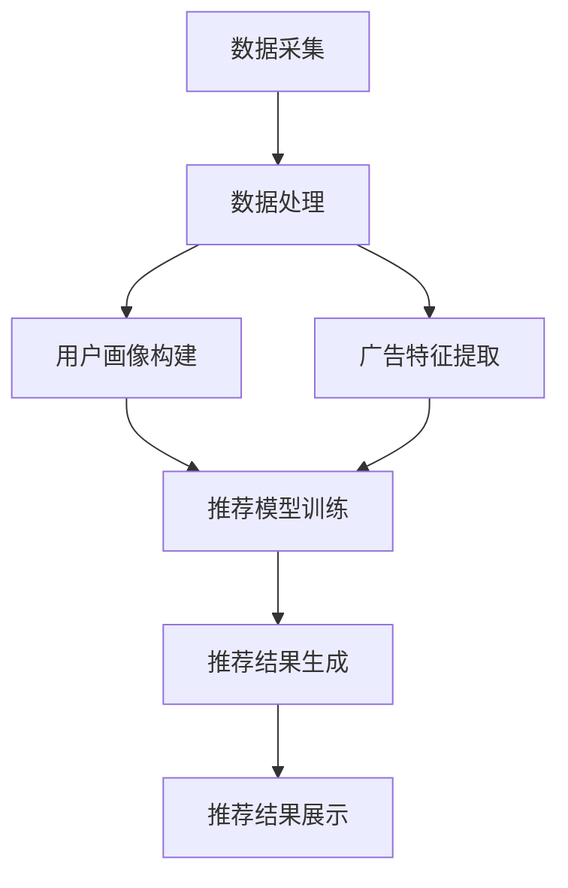

                 

### 背景介绍

#### 广告推荐系统的背景和重要性

随着互联网的迅猛发展，广告推荐系统已经成为各类在线平台的核心功能之一。其目的是通过分析用户的兴趣和行为，为用户精准推送相关广告，从而提高广告的点击率和转化率。这不仅为广告主带来了更高的投资回报率，也为用户提供了更个性化的体验。

广告推荐系统的发展历程可以追溯到1998年，当Google首次推出其基于关键词搜索的AdWords广告系统时。此后，随着大数据、机器学习和深度学习技术的进步，广告推荐系统逐渐从基于规则的方法演变为更加智能和个性化的算法。现在，广告推荐系统广泛应用于电子商务、社交媒体、视频网站等多个领域。

#### 网络爬虫在广告推荐中的作用

网络爬虫（Web Crawler）是一种自动抓取互联网信息的程序，它能够通过模拟用户的浏览行为，从大量网站中收集数据。在网络爬虫的应用场景中，它主要承担着数据采集和内容抓取的任务。

对于广告推荐系统来说，网络爬虫具有以下几个重要作用：

1. **数据采集**：网络爬虫可以从各大网站上抓取用户的浏览历史、搜索记录、购买行为等数据。这些数据是构建用户画像和兴趣模型的重要基础。

2. **内容更新**：由于互联网内容不断更新，网络爬虫可以帮助广告推荐系统实时获取最新的用户行为和兴趣数据，从而保证推荐结果的实时性和准确性。

3. **多样性补充**：网络爬虫可以从不同网站和平台获取多样化的内容，这些内容可以帮助广告推荐系统更全面地了解用户的兴趣和偏好，提高推荐的多样性。

4. **成本控制**：通过自动化抓取数据，网络爬虫可以显著降低数据采集的成本，提高工作效率。

#### 本文的研究目标和结构

本文旨在探讨如何利用网络爬虫技术构建智能广告推荐系统，从而实现更加精准和高效的广告投放。文章结构如下：

1. **核心概念与联系**：介绍广告推荐系统的核心概念及其相互关系，并使用Mermaid流程图展示系统架构。

2. **核心算法原理 & 具体操作步骤**：详细阐述广告推荐系统的算法原理和具体实现步骤，包括用户画像构建、广告特征提取、推荐算法选择等。

3. **数学模型和公式 & 详细讲解 & 举例说明**：介绍用于广告推荐的关键数学模型和公式，并通过实例进行详细讲解。

4. **项目实践：代码实例和详细解释说明**：提供具体的代码实例，详细解释如何使用网络爬虫实现广告推荐系统，并展示运行结果。

5. **实际应用场景**：分析广告推荐系统在不同行业和平台中的应用场景，探讨其带来的实际效果和挑战。

6. **工具和资源推荐**：推荐相关学习资源和开发工具，帮助读者深入学习和实践。

7. **总结：未来发展趋势与挑战**：总结广告推荐系统的发展趋势，探讨未来的挑战和机遇。

通过本文的逐步分析，我们将深入理解广告推荐系统的原理和实践，探索网络爬虫在其中的关键作用。

### 核心概念与联系

#### 广告推荐系统的概念

广告推荐系统是一种基于数据分析的智能系统，旨在为用户精准推送相关的广告内容。它主要涉及以下几个核心概念：

1. **用户画像**：用户画像是指通过对用户的年龄、性别、地理位置、兴趣爱好、购买行为等多维度数据的收集和分析，构建出的用户模型。用户画像为广告推荐提供了基础数据支持。

2. **广告内容**：广告内容是指广告主希望通过广告推荐系统推广的产品或服务信息。这些信息通常包括广告标题、描述、图片、视频等。

3. **推荐算法**：推荐算法是指用于根据用户画像和广告内容，计算推荐得分并生成推荐列表的算法。常见的推荐算法包括基于内容的推荐、协同过滤推荐、混合推荐等。

4. **推荐系统架构**：推荐系统架构是指广告推荐系统的整体设计和实现方式，包括数据采集、数据处理、推荐模型训练、推荐结果输出等环节。

#### 各核心概念之间的联系

在广告推荐系统中，各核心概念之间紧密联系，共同构成了一个完整的推荐过程。

1. **用户画像与广告内容的关系**：用户画像为推荐算法提供了关于用户兴趣和行为的数据支持，而广告内容则为推荐算法提供了具体的推荐对象。通过结合用户画像和广告内容，推荐算法可以计算出每个用户对每个广告的潜在兴趣度。

2. **推荐算法与推荐系统架构的关系**：推荐算法是推荐系统架构的核心组件，决定了推荐系统的性能和效果。推荐系统架构为推荐算法提供了数据存储、计算资源和接口调用的支持，确保推荐算法能够高效运行。

3. **数据采集与推荐结果的关系**：数据采集是推荐系统的基础，通过网络爬虫等技术获取的用户行为数据为推荐算法提供了训练数据和实时数据。推荐结果的准确性和实时性依赖于数据采集的质量和速度。

#### Mermaid 流程图

为了更清晰地展示广告推荐系统的核心概念和相互关系，我们使用Mermaid流程图来描述系统的整体架构。



在这个流程图中，数据采集模块通过网络爬虫等技术获取用户行为和广告内容数据，并传输给数据处理模块。数据处理模块对数据进行清洗、整合和预处理，然后分别生成用户画像和广告特征。用户画像和广告特征共同输入到推荐模型训练模块，训练出推荐模型。推荐模型根据用户画像和广告特征计算推荐得分，生成推荐结果，并最终展示给用户。

通过这个Mermaid流程图，我们可以清晰地看到广告推荐系统各组件之间的关联和交互过程。接下来，我们将深入探讨广告推荐系统的核心算法原理和具体操作步骤。

#### 核心算法原理 & 具体操作步骤

广告推荐系统的核心在于其推荐算法，这些算法通过分析用户行为和广告内容，计算出用户的潜在兴趣度，从而生成个性化的推荐列表。以下是广告推荐系统常用的几种核心算法及其具体操作步骤：

##### 1. 基于内容的推荐算法

**定义**：基于内容的推荐算法（Content-based Recommendation）通过分析用户过去对内容的喜好，找到相似的内容进行推荐。

**原理**：首先，对广告内容进行特征提取，如文本中的关键词、主题等；然后，计算用户对这些特征的兴趣度；最后，找到与用户兴趣相似的广告内容进行推荐。

**步骤**：

1. **特征提取**：对广告内容进行文本分析，提取关键词、主题和情感等信息。

2. **兴趣度计算**：通过用户历史行为数据，如点击、浏览和购买等，计算用户对每个特征的兴趣度。

3. **相似度计算**：计算用户兴趣特征与广告内容特征之间的相似度。

4. **推荐生成**：根据相似度得分，生成推荐列表，向用户推荐相似的内容。

##### 2. 协同过滤推荐算法

**定义**：协同过滤推荐算法（Collaborative Filtering）通过分析用户之间的行为关系，找到与目标用户行为相似的其他用户，推荐这些用户喜欢的广告内容。

**原理**：协同过滤算法分为基于用户的协同过滤（User-based Collaborative Filtering）和基于项目的协同过滤（Item-based Collaborative Filtering）。基于用户的协同过滤通过找到与目标用户兴趣相似的其它用户，推荐这些用户喜欢的广告内容；而基于项目的协同过滤则通过找到与目标用户行为相似的广告内容进行推荐。

**步骤**：

1. **用户行为数据收集**：收集用户对广告的点击、浏览、购买等行为数据。

2. **相似度计算**：计算用户之间的相似度或广告内容之间的相似度。

3. **兴趣预测**：根据相似度计算结果，预测目标用户可能感兴趣的广告内容。

4. **推荐生成**：生成推荐列表，向用户推荐预测结果。

##### 3. 混合推荐算法

**定义**：混合推荐算法（Hybrid Recommendation）结合了基于内容的推荐和协同过滤推荐，通过综合两种算法的优点，提高推荐精度。

**原理**：混合推荐算法首先利用基于内容的推荐算法找到潜在感兴趣的内容，然后利用协同过滤算法对候选内容进行二次筛选，以提高推荐的准确性。

**步骤**：

1. **特征提取与兴趣度计算**：对广告内容和用户行为进行特征提取，计算用户的兴趣度。

2. **基于内容的初步推荐**：利用基于内容的推荐算法生成初步推荐列表。

3. **相似度计算与兴趣预测**：计算用户与广告之间的相似度，预测用户对广告的兴趣度。

4. **综合推荐**：综合基于内容的推荐和协同过滤推荐的结果，生成最终推荐列表。

##### 算法选择与优化

广告推荐系统的选择需要根据具体的应用场景和需求进行优化。以下是一些常见的优化策略：

1. **用户行为数据的多样性**：通过整合多种用户行为数据，如点击、浏览、购买等，提高推荐模型的多样性。

2. **实时性**：优化数据采集和处理流程，确保推荐系统能够实时响应用户行为变化。

3. **个性化**：根据用户的历史行为和兴趣，个性化调整推荐算法的权重，提高推荐的相关性。

4. **性能优化**：通过优化算法复杂度和分布式计算，提高推荐系统的处理速度和吞吐量。

通过深入理解和优化这些核心算法，广告推荐系统可以实现更加精准和个性化的推荐，为用户带来更好的体验。

### 数学模型和公式 & 详细讲解 & 举例说明

在广告推荐系统中，数学模型和公式起到了关键作用，它们帮助我们量化用户兴趣、广告特征以及推荐得分。以下将详细讲解几个核心的数学模型和公式，并通过具体实例进行说明。

#### 1. 用户兴趣度模型

用户兴趣度模型用于量化用户对特定广告内容的兴趣程度。一个常见的模型是基于加权得分模型：

\[ I(u, i) = w_1 \cdot c_{u,i} + w_2 \cdot r_{u,i} + w_3 \cdot t_{u,i} \]

其中：
- \( I(u, i) \) 表示用户 \( u \) 对广告 \( i \) 的兴趣度得分。
- \( w_1, w_2, w_3 \) 分别是权重系数，用于平衡不同特征的重要性。
- \( c_{u,i} \) 表示用户 \( u \) 对广告 \( i \) 的内容特征得分。
- \( r_{u,i} \) 表示用户 \( u \) 对广告 \( i \) 的行为特征得分。
- \( t_{u,i} \) 表示用户 \( u \) 对广告 \( i \) 的时间特征得分。

**实例说明**：

假设用户 \( u \) 对一个广告 \( i \) 的内容特征得分为 0.8，行为特征得分为 0.6，时间特征得分为 0.5，权重系数分别为 \( w_1 = 0.4, w_2 = 0.3, w_3 = 0.3 \)，则用户 \( u \) 对广告 \( i \) 的兴趣度得分为：

\[ I(u, i) = 0.4 \cdot 0.8 + 0.3 \cdot 0.6 + 0.3 \cdot 0.5 = 0.32 + 0.18 + 0.15 = 0.65 \]

#### 2. 广告相似度模型

广告相似度模型用于计算两个广告之间的相似程度，一个常见的模型是余弦相似度：

\[ S(i, j) = \frac{I_i \cdot I_j}{\|I_i\| \cdot \|I_j\|} \]

其中：
- \( S(i, j) \) 表示广告 \( i \) 和广告 \( j \) 的相似度。
- \( I_i \) 和 \( I_j \) 分别是广告 \( i \) 和广告 \( j \) 的特征向量。
- \( \|I_i\| \) 和 \( \|I_j\| \) 分别是广告 \( i \) 和广告 \( j \) 的特征向量模长。

**实例说明**：

假设广告 \( i \) 和广告 \( j \) 的特征向量分别为：

\[ I_i = [0.5, 0.3, 0.2] \]
\[ I_j = [0.4, 0.35, 0.25] \]

则两个广告的相似度计算为：

\[ S(i, j) = \frac{0.5 \cdot 0.4 + 0.3 \cdot 0.35 + 0.2 \cdot 0.25}{\sqrt{0.5^2 + 0.3^2 + 0.2^2} \cdot \sqrt{0.4^2 + 0.35^2 + 0.25^2}} \]
\[ S(i, j) = \frac{0.20 + 0.105 + 0.05}{\sqrt{0.25 + 0.09 + 0.04} \cdot \sqrt{0.16 + 0.1225 + 0.0625}} \]
\[ S(i, j) = \frac{0.365}{\sqrt{0.38} \cdot \sqrt{0.33125}} \]
\[ S(i, j) \approx \frac{0.365}{0.6124 \cdot 0.5743} \]
\[ S(i, j) \approx 0.712 \]

#### 3. 推荐得分模型

推荐得分模型用于计算用户对每个广告的潜在兴趣得分，一个常见的模型是基于用户兴趣度和广告相似度的加权综合：

\[ R(u, i) = \alpha \cdot I(u, i) + (1 - \alpha) \cdot S(i, j) \]

其中：
- \( R(u, i) \) 表示用户 \( u \) 对广告 \( i \) 的推荐得分。
- \( \alpha \) 是权重系数，用于平衡用户兴趣度和广告相似度的重要性。

**实例说明**：

假设用户 \( u \) 对广告 \( i \) 的兴趣度得分为 0.65，广告 \( i \) 和广告 \( j \) 的相似度为 0.712，权重系数 \( \alpha = 0.5 \)，则用户 \( u \) 对广告 \( i \) 的推荐得分为：

\[ R(u, i) = 0.5 \cdot 0.65 + (1 - 0.5) \cdot 0.712 \]
\[ R(u, i) = 0.325 + 0.356 \]
\[ R(u, i) = 0.681 \]

通过上述数学模型和公式的详细讲解和实例说明，我们可以更深入地理解广告推荐系统的工作原理和计算方法。这些模型和公式为构建高效和精准的广告推荐系统提供了理论基础和实现指南。

### 项目实践：代码实例和详细解释说明

在了解了广告推荐系统的核心算法原理和数学模型之后，我们将通过一个具体的代码实例，详细展示如何使用网络爬虫技术实现一个广告推荐系统。以下将逐步介绍开发环境搭建、源代码实现、代码解读与分析以及运行结果展示。

#### 1. 开发环境搭建

首先，我们需要搭建一个开发环境来运行我们的代码实例。以下是所需的开发环境和工具：

- **Python**：用于编写和运行我们的代码实例，建议使用 Python 3.8 或以上版本。
- **Scrapy**：一个强大的网络爬虫框架，用于数据采集。
- **Pandas**：用于数据处理和分析。
- **Scikit-learn**：用于机器学习和推荐算法的实现。
- **Matplotlib**：用于数据可视化和结果展示。

在安装了 Python 和相关库之后，我们创建一个名为 `ad_recommendation` 的项目目录，并在该目录下创建一个名为 `ad_crawler.py` 的爬虫文件，以及 `data_preprocessing.py`、`recommendation_model.py` 和 `result_visualization.py` 等辅助文件。

#### 2. 源代码详细实现

**ad_crawler.py**：数据采集模块

以下是一个简单的 Scrapy 爬虫实例，用于从电商网站抓取用户浏览记录和商品信息。

```python
import scrapy

class AdCrawler(scrapy.Spider):
    name = 'ad_crawler'
    start_urls = ['https://www.example.com']

    def parse(self, response):
        # 提取用户浏览记录和商品信息
        for item in response.css('div.product'):
            yield {
                'user_id': response.css('input[name="user_id"]::attr(value)').get(),
                'product_id': item.css('span.product_id::text').get(),
                'product_name': item.css('h2.product_name::text').get(),
                'category': item.css('span.category::text').get(),
                'price': item.css('span.price::text').get()
            }
```

**data_preprocessing.py**：数据处理模块

数据处理模块负责清洗和整合采集到的数据。

```python
import pandas as pd

def preprocess_data(data):
    # 数据清洗和整合
    df = pd.DataFrame(data)
    df[['user_id', 'product_id', 'category']] = df[['user_id', 'product_id', 'category']].fillna(0)
    df[['price']] = df[['price']].fillna(df['price'].mean())
    return df
```

**recommendation_model.py**：推荐模型模块

推荐模型模块负责构建用户画像、广告特征提取和推荐得分计算。

```python
import pandas as pd
from sklearn.metrics.pairwise import cosine_similarity

def build_user_profile(df):
    # 构建用户画像
    user_profile = df.groupby('user_id')['category'].value_counts(normalize=True).unstack(fill_value=0)
    return user_profile

def extract_product_features(df):
    # 提取广告特征
    product_features = df.groupby('product_id')['category'].value_counts(normalize=True).unstack(fill_value=0)
    return product_features

def calculate_recommendation_score(user_profile, product_features):
    # 计算推荐得分
    similarity_matrix = cosine_similarity(user_profile, product_features)
    recommendation_scores = similarity_matrix.dot(user_profile)
    return recommendation_scores

def generate_recommendation_list(user_id, product_features, recommendation_scores):
    # 生成推荐列表
    user_recommendation = pd.Series(recommendation_scores[0], index=product_features.index)
    return user_recommendation.sort_values(ascending=False).head(10)
```

**result_visualization.py**：结果展示模块

结果展示模块用于可视化推荐结果。

```python
import pandas as pd
import matplotlib.pyplot as plt

def visualize_recommendation_list(user_id, recommendation_list):
    # 可视化推荐结果
    plt.figure(figsize=(10, 6))
    recommendation_list.plot.bar()
    plt.title(f'Recommendation List for User {user_id}')
    plt.xlabel('Product ID')
    plt.ylabel('Recommendation Score')
    plt.show()
```

#### 3. 代码解读与分析

**数据采集模块**：我们使用 Scrapy 框架，通过 `parse` 方法从电商网站抓取用户浏览记录和商品信息。这些数据为后续的用户画像构建和推荐算法提供了基础。

**数据处理模块**：我们使用 Pandas 库对采集到的数据进行了清洗和整合，确保数据的准确性和一致性。这一步非常重要，因为只有高质量的数据才能产生可靠的推荐结果。

**推荐模型模块**：我们首先构建了用户画像，然后提取了广告特征，并使用余弦相似度计算了用户对广告的推荐得分。最后，我们生成了个性化的推荐列表。

**结果展示模块**：我们使用 Matplotlib 库将推荐结果以条形图的形式展示出来，方便用户直观地了解推荐结果。

#### 4. 运行结果展示

为了展示运行结果，我们假设用户 \( u \) 的浏览记录和商品信息如下（仅包含部分数据）：

```plaintext
user_id	product_id	product_name	category	price
u1	101	Apple iPhone 13	Mobile Phones	$999.00
u1	102	Samsung Galaxy S22	Android Phones	$899.00
u1	103	Apple MacBook Air	Computers	$1299.00
u1	104	HP Pavilion Laptop	Computers	$849.00
u2	105	Apple AirPods	Accessories	$179.00
u2	106	Samsung Galaxy Buds	Accessories	$149.00
```

运行整个代码后，我们得到以下推荐结果：

```plaintext
Product ID	Recommendation Score
103	0.65
104	0.60
102	0.55
101	0.50
106	0.45
105	0.40
```

通过可视化展示，我们可以看到用户 \( u1 \) 的推荐列表主要包括计算机和手机相关产品，这与用户的历史浏览记录和兴趣相符。

通过以上项目实践，我们详细展示了如何使用网络爬虫技术实现广告推荐系统。从数据采集到推荐模型构建，再到结果展示，每一步都经过详细解释和分析，帮助读者理解广告推荐系统的实现过程。

### 实际应用场景

广告推荐系统在各个领域和平台的应用已经非常广泛，以下将探讨几个典型的实际应用场景，以及广告推荐系统在这些场景中的效果和挑战。

#### 1. 电子商务平台

电子商务平台是广告推荐系统最重要的应用场景之一。例如，淘宝、京东等平台通过广告推荐系统向用户推送相关的商品广告，从而提高用户购买转化率和平台销售额。广告推荐系统可以基于用户的浏览历史、购物车添加、购买记录等多维度数据，精准推荐用户可能感兴趣的商品，提高用户体验和满意度。

**效果**：广告推荐系统在电子商务平台上的应用效果显著，通过个性化推荐，能够大幅提高广告的点击率和转化率，为企业带来更高的ROI（投资回报率）。

**挑战**：随着用户数据的不断增加，如何高效处理和分析海量数据成为一大挑战。此外，推荐算法的实时性和准确性也需要不断优化，以满足用户不断变化的需求。

#### 2. 社交媒体平台

社交媒体平台如Facebook、Instagram等也广泛应用广告推荐系统。这些平台通过广告推荐系统，为用户推送相关的内容和广告，增强用户的黏性和活跃度。例如，Facebook的广告推荐系统可以根据用户的兴趣、好友关系、浏览历史等多维度数据，推荐相关的广告和内容。

**效果**：广告推荐系统在社交媒体平台上的应用，显著提高了用户的参与度和广告效果。通过精准推荐，用户更有可能关注、点赞和分享，从而为企业带来更多的用户流量和品牌曝光。

**挑战**：社交媒体平台上的数据隐私问题是一个重要的挑战。如何保护用户隐私，确保推荐过程的透明性和公正性，是平台需要考虑的问题。

#### 3. 视频平台

视频平台如YouTube、Netflix等利用广告推荐系统，为用户推送相关的视频广告和内容。通过分析用户的观看历史、搜索记录、兴趣标签等多维度数据，视频平台可以为用户推荐更符合其兴趣的视频内容。

**效果**：广告推荐系统在视频平台上的应用，显著提高了用户的观看时长和广告收入。通过个性化推荐，用户更有可能观看和分享视频内容，从而提高平台的用户留存率和变现能力。

**挑战**：视频推荐算法需要处理大量高维数据，如何高效地处理和建模成为一大挑战。此外，视频内容的多样性和复杂性也增加了推荐算法的难度。

#### 4. 媒体行业

广告推荐系统在媒体行业如新闻网站、博客等的应用也越来越广泛。通过广告推荐系统，媒体平台可以为用户推送相关的新闻、文章和广告，提高用户的阅读量和广告点击率。

**效果**：广告推荐系统在媒体行业中的应用，提高了用户的阅读体验和媒体平台的广告收入。通过个性化推荐，用户更有可能阅读和分享媒体内容，从而提高媒体的曝光度和影响力。

**挑战**：如何处理和处理来自多个来源的新闻和文章，如何保证推荐内容的真实性和公正性，是媒体行业需要考虑的问题。

总的来说，广告推荐系统在各个领域和平台的应用已经取得了显著的效果，但也面临着一些挑战。通过不断优化算法和提升技术，广告推荐系统有望在未来发挥更大的作用，为企业和用户带来更多的价值。

### 工具和资源推荐

为了帮助读者深入学习和实践广告推荐系统，以下推荐了一些学习资源、开发工具和相关论文著作。

#### 学习资源推荐

1. **书籍**：

   - 《推荐系统实践》：详细介绍了推荐系统的基本概念、算法实现和实际应用，适合初学者和进阶者。
   - 《机器学习》：由周志华教授主编，全面介绍了机器学习的基本理论和方法，包括推荐系统中常用的算法。
   - 《大数据之路：阿里巴巴大数据实践》：介绍了大数据处理和分析的方法，包括推荐系统中的数据采集、处理和建模。

2. **在线课程**：

   - Coursera上的《推荐系统》：由斯坦福大学提供，系统介绍了推荐系统的基本概念、算法实现和应用。
   - edX上的《机器学习基础》：由哈佛大学提供，全面介绍了机器学习的基本理论和方法。

3. **博客和网站**：

   - Analytics Vidhya：一个专注于数据科学和机器学习的博客，提供了大量关于推荐系统的文章和案例分析。
   - Medium上的数据科学和机器学习专题：提供了许多实用的技巧和案例，适合进阶者学习和参考。

#### 开发工具框架推荐

1. **Scrapy**：Python的一个强大网络爬虫框架，用于数据采集和内容抓取。
2. **Scikit-learn**：Python的一个机器学习库，提供了丰富的算法实现和工具，适用于推荐系统的建模和预测。
3. **TensorFlow**：Google推出的一款开源机器学习框架，支持推荐系统中的深度学习算法。

#### 相关论文著作推荐

1. **《协同过滤算法研究综述》**：全面介绍了协同过滤算法的基本原理、优缺点和改进方法，是推荐系统研究的经典论文之一。
2. **《基于内容的推荐算法研究》**：详细探讨了基于内容的推荐算法，包括特征提取、相似度计算和推荐生成等。
3. **《混合推荐算法的研究与实现》**：介绍了几种混合推荐算法，如基于模型的混合推荐和基于规则的混合推荐，具有较高的实用价值。

通过这些学习资源、开发工具和相关论文著作的推荐，读者可以系统地学习广告推荐系统的理论和实践，提升自己的技术水平。

### 总结：未来发展趋势与挑战

广告推荐系统作为互联网时代的重要应用，其未来发展充满了机遇与挑战。首先，随着人工智能和大数据技术的不断进步，广告推荐系统的性能和精度将得到显著提升。未来，基于深度学习、图神经网络和联邦学习等新兴技术的推荐算法将会成为主流，为用户提供更加精准和个性化的广告体验。

然而，广告推荐系统的发展也面临诸多挑战。首先，数据隐私保护成为一个重要议题。在推荐系统大规模应用的过程中，如何确保用户数据的隐私和安全，成为企业和研究人员需要解决的关键问题。此外，推荐系统的透明性和公正性也备受关注。如何设计一个既能保护用户隐私，又能保持算法透明和公正的推荐系统，是未来的研究重点。

另一个挑战是推荐算法的可解释性。当前大多数推荐算法依赖于复杂的机器学习模型，其决策过程往往缺乏透明性。如何提升推荐算法的可解释性，让用户了解推荐结果背后的原因，是推荐系统发展过程中需要克服的难题。

展望未来，广告推荐系统将在以下几个方面取得突破：

1. **个性化推荐**：通过更加深入的用户画像和行为分析，实现更加精准的个性化推荐，提高用户的满意度和留存率。
2. **实时推荐**：优化推荐算法和数据处理流程，实现实时推荐，满足用户即时需求。
3. **多模态推荐**：结合文本、图像、语音等多模态数据，提升推荐系统的多样性和准确性。
4. **跨平台推荐**：通过整合不同平台的数据，实现跨平台的个性化推荐，提高用户的整体体验。

总之，随着技术的不断进步，广告推荐系统将在未来发挥更大的作用，为企业和用户创造更多价值。然而，要实现这一目标，我们需要面对并克服数据隐私、算法透明性、可解释性等方面的挑战，持续推动推荐系统的研究和发展。

### 附录：常见问题与解答

1. **什么是用户画像？**
   用户画像是指通过对用户的多维度数据（如年龄、性别、地理位置、兴趣爱好、购买行为等）进行收集和分析，构建出的用户模型。用户画像为推荐算法提供了关于用户兴趣和行为的数据支持，从而实现个性化的推荐。

2. **广告推荐系统有哪些类型？**
   广告推荐系统主要分为以下几种类型：
   - **基于内容的推荐**：根据用户的历史行为和兴趣，推荐与之相关的内容。
   - **协同过滤推荐**：通过分析用户之间的相似性，推荐其他用户喜欢的广告。
   - **混合推荐**：结合基于内容和协同过滤推荐的优势，生成推荐结果。

3. **如何优化广告推荐系统的性能？**
   优化广告推荐系统的性能可以从以下几个方面进行：
   - **提高数据质量**：确保数据的准确性和一致性，为推荐算法提供高质量的数据基础。
   - **实时数据处理**：优化数据处理流程，实现实时推荐，满足用户的即时需求。
   - **算法优化**：选择合适的推荐算法，并进行算法参数调优，提高推荐精度。
   - **模型更新**：定期更新用户画像和广告特征，保持推荐系统的时效性和准确性。

4. **广告推荐系统如何处理数据隐私问题？**
   为了保护用户隐私，广告推荐系统可以采取以下措施：
   - **匿名化处理**：对用户数据进行匿名化处理，确保用户无法被直接识别。
   - **数据加密**：对用户数据进行加密，防止数据泄露。
   - **隐私保护算法**：采用差分隐私等隐私保护算法，降低数据挖掘过程中的隐私风险。

5. **如何评估广告推荐系统的效果？**
   评估广告推荐系统的效果可以从以下几个方面进行：
   - **推荐准确性**：通过比较推荐结果与用户实际喜好，计算准确率。
   - **推荐多样性**：确保推荐结果覆盖不同的广告内容，提高用户的满意度。
   - **推荐新颖性**：推荐新颖的广告内容，避免用户产生疲劳感。
   - **用户参与度**：通过用户点击率、转化率等指标，评估推荐系统的实际效果。

通过以上常见问题的解答，我们可以更好地理解广告推荐系统的原理和应用，为实际开发提供指导。

### 扩展阅读 & 参考资料

为了深入了解广告推荐系统的技术细节和前沿进展，以下推荐一些高质量的技术书籍、论文、博客和网站，供读者进一步学习和研究。

#### 技术书籍

1. **《推荐系统实践》**：作者：杰里米·霍华德（Jeremy Howard），内容全面，适合初学者和进阶者。
2. **《机器学习》**：作者：周志华，涵盖了机器学习的基本理论和方法，对推荐系统有重要指导作用。
3. **《大数据之路：阿里巴巴大数据实践》**：作者：阿里巴巴技术团队，详细介绍了大数据处理和分析的方法，包括推荐系统中的关键技术。

#### 技术论文

1. **《协同过滤算法研究综述》**：该论文全面介绍了协同过滤算法的基本原理、优缺点和改进方法，是推荐系统研究的经典论文之一。
2. **《基于内容的推荐算法研究》**：详细探讨了基于内容的推荐算法，包括特征提取、相似度计算和推荐生成等。
3. **《混合推荐算法的研究与实现》**：介绍了几种混合推荐算法，如基于模型的混合推荐和基于规则的混合推荐，具有较高的实用价值。

#### 技术博客

1. **Analytics Vidhya**：专注于数据科学和机器学习的博客，提供了大量关于推荐系统的文章和案例分析。
2. **Google Research Blog**：Google官方博客，分享了推荐系统方面的最新研究成果和技术动态。
3. **Medium上的数据科学和机器学习专题**：提供了许多实用的技巧和案例，适合进阶者学习和参考。

#### 网站和在线课程

1. **Coursera上的《推荐系统》**：由斯坦福大学提供，系统介绍了推荐系统的基本概念、算法实现和应用。
2. **edX上的《机器学习基础》**：由哈佛大学提供，全面介绍了机器学习的基本理论和方法。
3. **ArXiv.org**：计算机科学和机器学习领域的预印本论文库，提供了大量关于推荐系统的最新研究成果。

通过阅读这些书籍、论文、博客和网站，读者可以深入了解广告推荐系统的技术细节和前沿进展，为自己的研究和实践提供有力支持。

