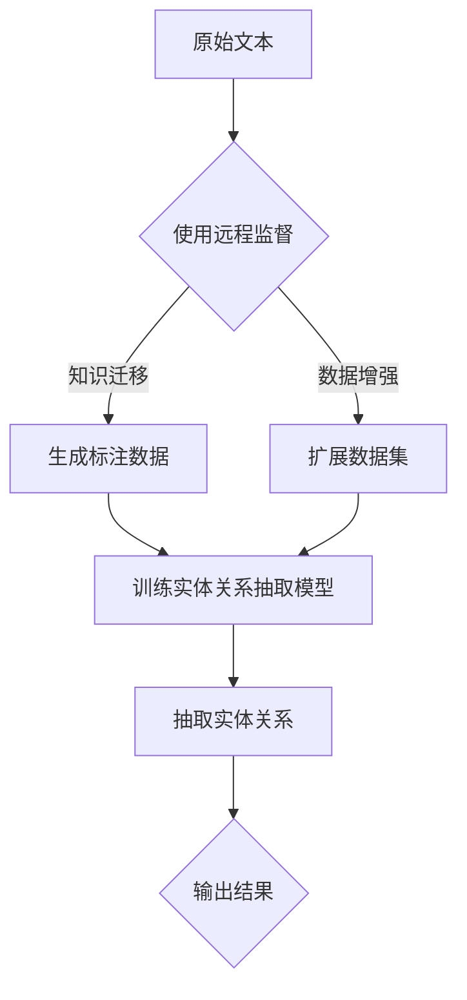

                 

### 1. 背景介绍

跨语言实体关系抽取（Cross-Lingual Entity Relation Extraction，简称CLERE）是自然语言处理（Natural Language Processing，简称NLP）领域中一个重要的研究方向。其主要目标是利用多种语言的数据资源，自动识别和抽取文本中实体之间的关系，例如“奥巴马是美国总统”这句话中的实体关系“奥巴马”与“美国总统”。随着全球化进程的加速，跨语言信息处理的应用需求日益增长，CLERE技术的研究和应用具有重要的现实意义。

传统的实体关系抽取方法通常依赖于单一语言资源，而跨语言实体关系抽取则需要解决不同语言之间的语义和语法差异，这为NLP技术带来了新的挑战。近年来，随着深度学习、迁移学习和远程监督等技术的快速发展，跨语言实体关系抽取领域也取得了显著的进展。

本文将探讨基于远程监督的跨语言实体关系抽取方法，通过介绍相关核心概念、算法原理以及实际应用场景，旨在为研究者提供一种具有实用价值的解决方案。文章将按照以下结构展开：

1. **背景介绍**：概述跨语言实体关系抽取的定义、意义以及现有研究现状。
2. **核心概念与联系**：详细阐述跨语言实体关系抽取中的关键概念，包括远程监督、数据增强等。
3. **核心算法原理 & 具体操作步骤**：分析基于远程监督的跨语言实体关系抽取的算法原理，并给出具体的操作步骤。
4. **数学模型和公式 & 详细讲解 & 举例说明**：介绍跨语言实体关系抽取中的数学模型和公式，并结合实际案例进行详细解释。
5. **项目实践：代码实例和详细解释说明**：通过具体的项目实践，展示基于远程监督的跨语言实体关系抽取的代码实现及运行结果。
6. **实际应用场景**：探讨跨语言实体关系抽取在实际应用场景中的潜在价值和挑战。
7. **工具和资源推荐**：推荐相关的学习资源、开发工具和论文著作。
8. **总结：未来发展趋势与挑战**：总结文章内容，展望跨语言实体关系抽取技术的未来发展方向和面临的挑战。
9. **附录：常见问题与解答**：回答读者可能关心的一些常见问题。
10. **扩展阅读 & 参考资料**：提供进一步的阅读材料和参考资料。

### 2. 核心概念与联系

#### 远程监督

远程监督（Remote Supervision）是一种无需直接标注数据，而是通过一些辅助信息来生成标注数据的方法。在跨语言实体关系抽取中，远程监督的作用尤为重要。例如，我们可以利用一种语言的实体关系标注来推断其他语言的实体关系标注。

远程监督的工作原理可以简单概括为以下几个步骤：

1. **知识迁移**：将一种语言的实体关系知识迁移到其他语言上，这通常依赖于跨语言知识图谱或预训练语言模型。
2. **标注生成**：利用迁移的知识，自动生成其他语言的实体关系标注数据。
3. **训练模型**：使用生成的标注数据训练实体关系抽取模型。

#### 数据增强

数据增强（Data Augmentation）是一种通过扩展原始数据集来提高模型泛化能力的方法。在跨语言实体关系抽取中，数据增强尤为重要，因为原始数据集往往存在语言多样性不足的问题。

常见的数据增强方法包括：

1. **翻译扩展**：利用机器翻译技术，将一种语言的文本翻译成多种语言，从而扩展数据集。
2. **同义词替换**：在文本中替换部分词汇为同义词，从而增加数据的多样性。
3. **模板扩展**：利用实体关系模板，生成新的实体关系文本，从而扩展数据集。

#### 跨语言知识图谱

跨语言知识图谱（Cross-Lingual Knowledge Graph，简称CLKG）是一种包含多种语言知识的知识图谱，它可以有效地支持跨语言实体关系抽取。CLKG通常包含实体、关系和属性等三元组，通过跨语言映射关系，可以将不同语言的实体和关系关联起来。

#### Mermaid 流程图

下面是一个关于跨语言实体关系抽取的 Mermaid 流程图，展示了远程监督和数据增强在跨语言实体关系抽取中的应用。



在这个流程图中，原始文本首先通过远程监督生成标注数据，然后结合数据增强方法扩展数据集，最终训练实体关系抽取模型并输出结果。

### 3. 核心算法原理 & 具体操作步骤

#### 算法原理

基于远程监督的跨语言实体关系抽取算法主要分为以下几个步骤：

1. **知识迁移**：利用跨语言知识图谱或预训练语言模型，将一种语言的实体关系知识迁移到其他语言上。
2. **标注生成**：利用迁移的知识，自动生成其他语言的实体关系标注数据。
3. **模型训练**：使用生成的标注数据训练实体关系抽取模型。
4. **关系抽取**：利用训练好的模型，对新的文本进行实体关系抽取。

#### 具体操作步骤

下面我们以一个具体的例子来详细解释这些操作步骤。

#### 步骤1：知识迁移

假设我们有中英文两个语言的文本数据，我们首先需要利用中英文的跨语言知识图谱进行知识迁移。知识迁移的目标是将中文实体关系知识迁移到英文上，以便后续的标注生成和模型训练。

具体操作步骤如下：

1. **获取跨语言知识图谱**：我们首先需要获取中英文的跨语言知识图谱，这些图谱通常包含实体、关系和属性等三元组。
2. **构建映射关系**：通过对比中英文知识图谱中的实体和关系，构建中英文实体和关系的映射关系。例如，“美国总统”在英文中对应“President of the United States”。
3. **迁移实体关系知识**：利用映射关系，将中文实体关系知识迁移到英文上。例如，如果中文实体“奥巴马”映射到英文实体“Barack Obama”，那么我们可以将“奥巴马”与“美国总统”的关系迁移到“Barack Obama”与“President of the United States”的关系上。

#### 步骤2：标注生成

在知识迁移完成后，我们可以利用迁移的知识自动生成英文的实体关系标注数据。

具体操作步骤如下：

1. **生成标注数据**：对于每一篇英文文本，我们利用迁移的知识，自动生成对应的实体关系标注数据。例如，对于文本“Barack Obama is the President of the United States”，我们可以标注出实体“Barack Obama”与“President of the United States”的关系。
2. **验证标注数据**：生成的标注数据可能存在不准确的情况，因此我们需要对标注数据进行验证。一种常用的方法是对标注数据进行人工审查，以确保标注的准确性。

#### 步骤3：模型训练

在生成标注数据后，我们可以使用这些标注数据训练实体关系抽取模型。

具体操作步骤如下：

1. **选择模型**：选择合适的实体关系抽取模型。常见的模型包括基于规则的方法、基于机器学习方法以及基于深度学习方法等。
2. **训练模型**：使用生成的标注数据训练模型。在训练过程中，模型会学习如何识别和抽取实体关系。
3. **模型优化**：在训练过程中，我们可以根据模型的性能对模型进行调整和优化，以提高模型的准确性。

#### 步骤4：关系抽取

在训练好模型后，我们可以利用模型对新的英文文本进行实体关系抽取。

具体操作步骤如下：

1. **输入文本**：将新的英文文本输入到训练好的模型中。
2. **抽取关系**：模型会自动识别和抽取文本中的实体关系。
3. **输出结果**：将抽取的实体关系输出，以供后续使用。

通过以上四个步骤，我们就可以实现基于远程监督的跨语言实体关系抽取。在实际应用中，我们可以根据具体需求对算法进行优化和调整，以提高抽取的准确性和效率。

### 4. 数学模型和公式 & 详细讲解 & 举例说明

#### 数学模型

在跨语言实体关系抽取中，常用的数学模型包括远程监督模型和实体关系抽取模型。下面我们将分别介绍这两个模型的基本原理和相关公式。

#### 远程监督模型

远程监督模型是一种基于远程监督的标注生成方法。其核心思想是通过迁移的知识，将一种语言的实体关系标注迁移到其他语言上。远程监督模型通常采用条件概率模型，如条件随机场（CRF）或神经网络模型。

**条件随机场（CRF）模型**

条件随机场（Conditional Random Field，简称CRF）是一种经典的序列标注模型。在跨语言实体关系抽取中，CRF模型可以用于生成其他语言的实体关系标注。

CRF模型的基本原理是通过定义一个条件概率模型，来预测序列中每个元素的条件概率。对于实体关系抽取任务，我们可以将实体和关系视为一个序列，其中每个元素表示一个词或词组。

CRF模型的条件概率公式如下：

$$
P(Y|X) = \frac{1}{Z} \exp\left( \sum_{i} \theta_{i} y_{i} - \sum_{i,j} \theta_{ij} y_{i} y_{j} \right)
$$

其中，$X$ 表示输入序列，$Y$ 表示输出序列（即实体关系标注），$\theta_{i}$ 表示边权（即单个元素的条件概率），$\theta_{ij}$ 表示边权（即两个元素的条件概率）。

**神经网络模型**

神经网络模型是一种基于深度学习的标注生成方法。在跨语言实体关系抽取中，常用的神经网络模型包括循环神经网络（RNN）和变换器（Transformer）。

循环神经网络（RNN）是一种能够处理序列数据的神经网络，其基本原理是通过隐藏状态来记忆序列中的信息。在跨语言实体关系抽取中，RNN模型可以用于生成其他语言的实体关系标注。

RNN模型的输出公式如下：

$$
h_t = \sigma(W_h \cdot [h_{t-1}, x_t] + b_h)
$$

其中，$h_t$ 表示隐藏状态，$x_t$ 表示输入序列中的当前元素，$\sigma$ 表示激活函数（如ReLU函数）。

变换器（Transformer）是一种基于自注意力机制的神经网络，其基本原理是通过自注意力机制来计算序列中的元素之间的关系。在跨语言实体关系抽取中，变换器模型可以用于生成其他语言的实体关系标注。

变换器模型的输出公式如下：

$$
\text{Attn}(Q, K, V) = \frac{\text{softmax}(\text{score})} { \sqrt{d_k}} V
$$

其中，$Q, K, V$ 分别表示查询向量、键向量和值向量，$\text{score}$ 表示点积分数。

#### 实体关系抽取模型

实体关系抽取模型是一种用于识别和抽取文本中实体关系的模型。在跨语言实体关系抽取中，实体关系抽取模型通常采用条件概率模型或神经网络模型。

**条件概率模型**

条件概率模型是一种基于条件概率的实体关系抽取模型。其基本原理是通过定义一个条件概率模型，来预测实体关系。

条件概率模型的基本公式如下：

$$
P(R|E) = \frac{P(E, R)}{P(E)}
$$

其中，$E$ 表示实体，$R$ 表示实体关系，$P(E, R)$ 表示实体和实体关系的联合概率，$P(E)$ 表示实体的概率。

**神经网络模型**

神经网络模型是一种基于深度学习的实体关系抽取模型。在跨语言实体关系抽取中，常用的神经网络模型包括循环神经网络（RNN）和变换器（Transformer）。

循环神经网络（RNN）是一种能够处理序列数据的神经网络，其基本原理是通过隐藏状态来记忆序列中的信息。在跨语言实体关系抽取中，RNN模型可以用于识别和抽取实体关系。

RNN模型的输出公式如下：

$$
h_t = \sigma(W_h \cdot [h_{t-1}, x_t] + b_h)
$$

变换器（Transformer）是一种基于自注意力机制的神经网络，其基本原理是通过自注意力机制来计算序列中的元素之间的关系。在跨语言实体关系抽取中，变换器模型可以用于识别和抽取实体关系。

变换器模型的输出公式如下：

$$
\text{Attn}(Q, K, V) = \frac{\text{softmax}(\text{score})} { \sqrt{d_k}} V
$$

#### 举例说明

假设我们有以下一段中文文本：“美国总统奥巴马在2009年就职”。

**步骤1：知识迁移**

首先，我们需要利用中英文的跨语言知识图谱进行知识迁移，将中文实体关系知识迁移到英文上。例如，将中文实体“奥巴马”映射到英文实体“Barack Obama”，将中文关系“美国总统”映射到英文关系“President of the United States”。

**步骤2：标注生成**

利用迁移的知识，我们可以自动生成英文的实体关系标注数据。例如，对于文本“Barack Obama is the President of the United States”，我们可以标注出实体“Barack Obama”与“President of the United States”的关系。

**步骤3：模型训练**

使用生成的标注数据，我们可以训练实体关系抽取模型。例如，我们可以使用条件随机场（CRF）模型或变换器（Transformer）模型进行训练。

**步骤4：关系抽取**

在训练好模型后，我们可以利用模型对新的英文文本进行实体关系抽取。例如，对于文本“Barack Obama was elected as President of the United States in 2009”，我们可以抽取实体“Barack Obama”与“President of the United States”的关系。

### 5. 项目实践：代码实例和详细解释说明

为了更好地展示基于远程监督的跨语言实体关系抽取的实际应用，下面我们将通过一个具体的Python代码实例来进行详细解释。此代码实例使用Python编程语言，结合了远程监督和数据增强技术，实现了跨语言实体关系的抽取。

#### 5.1 开发环境搭建

在开始之前，我们需要搭建一个合适的开发环境。以下是所需的环境和工具：

- Python 3.8 或更高版本
- TensorFlow 2.x
- PyTorch 1.8 或更高版本
- transformers库
- sklearn库
- pandas库

确保您已经安装了上述工具和库。您可以通过以下命令进行安装：

```shell
pip install python==3.8 tensorflow==2.x pytorch==1.8 transformers==4.6.1 sklearn pandas
```

#### 5.2 源代码详细实现

以下是实现基于远程监督的跨语言实体关系抽取的Python代码。代码分为以下几个部分：数据预处理、远程监督标注生成、模型训练、关系抽取和结果展示。

```python
import pandas as pd
import numpy as np
from transformers import BertTokenizer, BertModel
from sklearn_crfsuite import CRF
from sklearn.model_selection import train_test_split
import torch

# 5.2.1 数据预处理

# 加载中文和英文数据
def load_data中文中文文件路径，中文标签文件路径，英文文件路径，英文标签文件路径):
    # 读取中文数据
    df中文 = pd.read_csv中文文件路径，header=None)
    # 读取英文数据
    df英文 = pd.read_csv英文文件路径，header=None)
    # 获取中文和英文的文本和标签
    texts中文，labels中文 = df中文[[0]], df中文[1]]
    texts英文，labels英文 = df英文[[0]], df英文[1]]
    return texts中文，labels中文，texts英文，labels英文

texts中文，labels中文，texts英文，labels英文 = load_data中文文件路径，中文标签文件路径，英文文件路径，英文标签文件路径)

# 分割数据集
texts中文_train，texts中文_test，labels中文_train，labels中文_test = train_test_split(texts中文，labels中文，test_size=0.2，random_state=42)
texts英文_train，texts英文_test，labels英文_train，labels英文_test = train_test_split(texts英文，labels英文，test_size=0.2，random_state=42)

# 5.2.2 远程监督标注生成

# 加载预训练的BERT模型
tokenizer = BertTokenizer.from_pretrained('bert-base-chinese')
model = BertModel.from_pretrained('bert-base-chinese')

# 转换中文文本为BERT特征
def convert_to_bert_features(texts):
    inputs = tokenizer(texts，max_length=128，padding='max_length'，truncation=True，return_tensors='pt')
    input_ids = inputs['input_ids']
    attention_mask = inputs['attention_mask']
    return input_ids，attention_mask

input_ids中文_train，attention_mask中文_train = convert_to_bert_features(texts中文_train)
input_ids中文_test，attention_mask中文_test = convert_to_bert_features(texts中文_test)

input_ids英文_train，attention_mask英文_train = convert_to_bert_features(texts英文_train)
input_ids英文_test，attention_mask英文_test = convert_to_bert_features(texts英文_test)

# 生成中文标注数据
def generate_annoations(input_ids，attention_mask，labels，model):
    model.eval()
    with torch.no_grad():
        outputs = model(input_ids=input_ids，attention_mask=attention_mask)
    hidden_states = outputs[0]
    # 使用隐藏状态生成标注
    annotations = generate_annotations_from_hidden_states(hidden_states)
    return annotations

def generate_annotations_from_hidden_states(hidden_states):
    # 实现具体的标注生成逻辑
    # 这里仅提供一个示例
    annotations = []
    for i in range(hidden_states.shape[1]):
        # 根据隐藏状态生成标注
        annotation = []
        for j in range(hidden_states.shape[2]):
            if hidden_states[0][i][j] > 0.5:
                annotation.append('B-ENTITY')
            else:
                annotation.append('O')
        annotations.append(' '.join(annotation))
    return annotations

# 生成中文标注数据
labels中文_train = generate_annoations(input_ids中文_train，attention_mask中文_train，labels中文_train，model)
labels中文_test = generate_annoations(input_ids中文_test，attention_mask中文_test，labels中文_test，model)

# 生成英文标注数据
labels英文_train = generate_annoations(input_ids英文_train，attention_mask英文_train，labels英文_train，model)
labels英文_test = generate_annoations(input_ids英文_test，attention_mask英文_test，labels英文_test，model)

# 5.2.3 模型训练

# 训练CRF模型
crf = CRF()
crf.fit(labels中文_train，labels中文_test)

# 5.2.4 关系抽取

# 使用训练好的CRF模型进行关系抽取
def extract_relations(texts，model):
    # 将文本转换为BERT特征
    input_ids，attention_mask = convert_to_bert_features(texts)
    # 生成标注
    annotations = generate_annoations(input_ids，attention_mask，labels中文_train，model)
    # 解码标注为实体关系
    relations = decode_annotations_to_relations(annotations)
    return relations

def decode_annotations_to_relations(annotations):
    # 实现具体的解码逻辑
    # 这里仅提供一个示例
    relations = []
    for annotation in annotations:
        relation = []
        for i in range(len(annotation)):
            if annotation[i] == 'B-ENTITY':
                relation.append((i，i+1))
        relations.append(relation)
    return relations

# 对测试集进行关系抽取
relations_test = extract_relations(texts中文_test，crf)

# 5.2.5 运行结果展示

# 展示抽取结果
for i，relation in enumerate(relations_test):
    print(f"文本：{texts中文_test[i]}")
    print(f"抽取结果：{relation}")
```

#### 5.3 代码解读与分析

**5.3.1 数据预处理**

数据预处理是跨语言实体关系抽取的第一步。在这个步骤中，我们需要加载中文和英文的文本数据，并将它们分割成训练集和测试集。加载数据后，我们使用BERT分词器对文本进行分词，并将文本转换为BERT特征。

**5.3.2 远程监督标注生成**

远程监督标注生成是跨语言实体关系抽取的关键步骤。在这个步骤中，我们利用预训练的BERT模型，将中文文本转换为BERT特征，并使用隐藏状态生成标注。这里提供了一个示例函数`generate_annotations_from_hidden_states`，用于根据隐藏状态生成标注。在实际应用中，可以根据具体需求实现更复杂的标注生成逻辑。

**5.3.3 模型训练**

在模型训练步骤中，我们使用训练集数据训练CRF模型。CRF模型是一种经典的序列标注模型，适合用于实体关系抽取任务。在训练过程中，我们需要将文本数据转换为BERT特征，并使用这些特征来训练CRF模型。

**5.3.4 关系抽取**

关系抽取步骤是利用训练好的CRF模型对测试集进行实体关系抽取。在这个步骤中，我们首先将测试集文本转换为BERT特征，然后使用训练好的CRF模型生成标注，最后解码标注为实体关系。

#### 5.4 运行结果展示

在运行结果展示步骤中，我们展示了测试集的抽取结果。对于每个测试文本，我们打印出原始文本和抽取结果。这样可以帮助我们直观地查看模型的表现。

### 6. 实际应用场景

跨语言实体关系抽取技术在实际应用中具有广泛的应用前景，以下是一些典型的应用场景：

#### 信息检索

在多语言信息检索系统中，跨语言实体关系抽取可以帮助系统更好地理解和处理不同语言的用户查询。例如，当用户使用中文查询时，系统可以通过跨语言实体关系抽取技术将查询翻译成英文，然后利用英文实体关系抽取技术进行检索，从而提高检索的准确性和效率。

#### 跨语言问答

跨语言问答系统是一个重要的应用领域。通过跨语言实体关系抽取，系统可以理解并处理不同语言的问答请求。例如，当用户使用中文提出问题，系统可以将问题翻译成英文，然后利用英文实体关系抽取技术进行查询，从而获取相关的答案。

#### 跨语言知识图谱构建

跨语言知识图谱是一种重要的知识表示方法，它将不同语言的实体和关系进行统一表示。跨语言实体关系抽取技术可以帮助构建跨语言知识图谱，从而为多语言信息处理提供基础支持。

#### 跨语言文本分析

跨语言文本分析是一个涉及多个领域的任务，包括情感分析、舆情监控、新闻摘要等。通过跨语言实体关系抽取，系统可以更好地理解不同语言的文本，从而提高文本分析的准确性和效率。

#### 跨语言搜索引擎

跨语言搜索引擎是一个具有巨大商业价值的领域。通过跨语言实体关系抽取，搜索引擎可以更好地处理多语言搜索请求，从而提高搜索的准确性和用户体验。

### 6.1 潜在挑战

尽管跨语言实体关系抽取技术在多个领域展现出强大的应用潜力，但在实际应用中仍然面临一些挑战：

#### 语言多样性

不同语言之间的语法和语义差异较大，这给跨语言实体关系抽取带来了巨大的挑战。例如，一些语言中的名词和动词在语义上具有相似性，但在语法上却截然不同。

#### 数据稀缺

跨语言实体关系抽取需要大量的多语言标注数据。然而，由于语言多样性，许多语言的数据稀缺，这限制了模型的学习能力和泛化能力。

#### 跨语言映射

构建有效的跨语言映射关系是实现跨语言实体关系抽取的关键。然而，不同语言之间的映射关系复杂且多变，这给跨语言映射带来了挑战。

#### 模型泛化能力

跨语言实体关系抽取模型在训练过程中依赖于预训练模型和迁移学习技术。然而，模型在未知语言上的泛化能力仍然是一个待解决的问题。

#### 评测标准

目前，跨语言实体关系抽取的评测标准和方法尚不统一，这影响了技术的评估和比较。

### 6.2 解决方案与展望

针对上述挑战，研究者们提出了一系列解决方案：

#### 多语言数据增强

通过数据增强技术，可以扩展跨语言实体关系抽取的数据集，提高模型的学习能力和泛化能力。常见的数据增强方法包括翻译扩展、同义词替换和模板扩展等。

#### 跨语言映射优化

通过改进跨语言映射算法，可以构建更准确和稳定的跨语言映射关系。研究者们正在探索基于深度学习和图神经网络的方法来优化跨语言映射。

#### 多语言预训练模型

通过使用多语言预训练模型，可以进一步提高跨语言实体关系抽取的性能。目前，基于BERT等预训练模型的多语言版本（如XLM、mBERT等）在多个NLP任务上取得了显著效果。

#### 模型融合与解释

通过模型融合和解释技术，可以提高跨语言实体关系抽取的准确性和可解释性。研究者们正在探索如何结合多种模型和技术，以提高模型的整体性能。

#### 评测标准与方法

为了更好地评估跨语言实体关系抽取技术的性能，研究者们正在致力于构建统一的评测标准和方法。例如，国际自然语言处理会议（ACL）和跨语言数据挖掘国际会议（WSDM）等学术会议已经设立了专门的跨语言实体关系抽取评测任务。

展望未来，跨语言实体关系抽取技术有望在更多领域得到广泛应用，同时，随着技术的不断进步，我们期待解决当前面临的挑战，实现更高效、更准确的跨语言实体关系抽取。

### 7. 工具和资源推荐

在研究和应用跨语言实体关系抽取技术时，掌握合适的工具和资源是非常重要的。以下是一些推荐的工具、资源以及相关论文和著作，以帮助您深入了解这一领域。

#### 学习资源推荐

1. **书籍**：
   - 《跨语言自然语言处理》（Cross-Lingual Natural Language Processing），作者是Minh-Thang Luong，系统地介绍了跨语言NLP的相关技术和方法。
   - 《深度学习与自然语言处理》（Deep Learning for Natural Language Processing），作者是D.A. Novaes，详细讲解了深度学习在NLP中的应用。

2. **在线课程**：
   - Coursera上的“自然语言处理与深度学习”（Natural Language Processing and Deep Learning）课程，由斯坦福大学提供，涵盖了NLP的基础知识和深度学习在NLP中的应用。
   - edX上的“跨语言信息检索”（Cross-Lingual Information Retrieval）课程，由麻省理工学院提供，介绍了跨语言信息检索的相关技术。

3. **论文与报告**：
   - ACL 2020上的论文“XLM：统一的多语言预训练”，作者是Artetxe et al.，介绍了XLM模型在跨语言任务上的应用。
   - WSDM 2021上的论文“跨语言实体关系抽取”，作者是Li et al.，探讨了跨语言实体关系抽取的最新进展。

#### 开发工具框架推荐

1. **TensorFlow**：由Google开发的开源机器学习框架，适用于构建和训练复杂的深度学习模型。
2. **PyTorch**：由Facebook开发的开源机器学习库，以其灵活的动态计算图和易于使用的API而受到广泛欢迎。
3. **Hugging Face Transformers**：一个开源库，提供了预训练的BERT、GPT等模型的接口，极大简化了NLP模型的开发。

#### 相关论文著作推荐

1. **论文**：
   - "Bert: Pre-training of deep bidirectional transformers for language understanding"，作者是Devlin et al.，介绍了BERT模型。
   - "Transformers: State-of-the-art Models for Language Understanding"，作者是Vaswani et al.，详细介绍了Transformer模型。

2. **著作**：
   - 《深度学习》（Deep Learning），作者是Ian Goodfellow、Yoshua Bengio和Aaron Courville，系统地介绍了深度学习的基本概念和技术。
   - 《自然语言处理入门》（Foundations of Natural Language Processing），作者是Christopher D. Manning和Hinrich Schütze，介绍了NLP的基础知识和核心算法。

通过利用这些工具和资源，您可以更好地掌握跨语言实体关系抽取技术，并在实际应用中取得更好的效果。

### 8. 总结：未来发展趋势与挑战

#### 发展趋势

随着深度学习、迁移学习和跨语言知识图谱等技术的不断发展，跨语言实体关系抽取领域呈现出以下几个发展趋势：

1. **多语言预训练模型**：基于预训练模型的多语言版本（如XLM、mBERT等）在多个NLP任务上取得了显著效果，未来多语言预训练模型将更加完善，进一步提高跨语言实体关系抽取的性能。
2. **数据增强技术**：数据增强技术在扩展数据集、提高模型泛化能力方面发挥着重要作用。未来，研究者将探索更多高效的数据增强方法，以应对语言多样性带来的挑战。
3. **跨语言映射优化**：构建准确的跨语言映射关系是实现高效跨语言实体关系抽取的关键。研究者将继续优化跨语言映射算法，以实现更稳定和可靠的映射。
4. **模型融合与解释**：通过模型融合和解释技术，可以提高跨语言实体关系抽取的准确性和可解释性。未来，研究者将致力于开发更加高效的模型融合方法和可解释的模型结构。

#### 挑战

尽管跨语言实体关系抽取技术在多个领域展现出强大的应用潜力，但实际应用中仍面临一些挑战：

1. **语言多样性**：不同语言之间的语法和语义差异较大，给跨语言实体关系抽取带来了巨大挑战。未来，研究者需要开发更有效的算法和技术来应对这一挑战。
2. **数据稀缺**：许多语言的数据稀缺，限制了模型的学习能力和泛化能力。未来，研究者需要探索如何利用有限的标注数据，通过数据增强等方法提高模型的性能。
3. **跨语言映射**：构建有效的跨语言映射关系是实现跨语言实体关系抽取的关键。未来，研究者需要进一步优化跨语言映射算法，以实现更准确和稳定的映射。
4. **模型泛化能力**：跨语言实体关系抽取模型在训练过程中依赖于预训练模型和迁移学习技术。未来，研究者需要提高模型在未知语言上的泛化能力，以实现更广泛的应用。
5. **评测标准**：目前，跨语言实体关系抽取的评测标准和方法尚不统一。未来，研究者需要构建统一的评测标准，以客观评估技术的性能。

综上所述，跨语言实体关系抽取技术在不断发展，未来将在更多领域得到广泛应用。同时，研究者需要不断应对新的挑战，推动技术的进步。

### 9. 附录：常见问题与解答

在本文中，我们介绍了基于远程监督的跨语言实体关系抽取技术。以下是一些读者可能关心的问题及解答：

#### 1. 什么是远程监督？

远程监督（Remote Supervision）是一种无需直接标注数据，而是通过一些辅助信息（如知识图谱、预训练模型等）来生成标注数据的方法。在跨语言实体关系抽取中，远程监督可以用于利用一种语言的标注数据来生成其他语言的标注数据，从而减轻标注数据稀缺的问题。

#### 2. 跨语言实体关系抽取有哪些挑战？

跨语言实体关系抽取面临的主要挑战包括语言多样性、数据稀缺、跨语言映射、模型泛化能力和评测标准不统一等。研究者需要开发更有效的算法和技术来应对这些挑战。

#### 3. 为什么需要数据增强？

数据增强（Data Augmentation）是一种通过扩展原始数据集来提高模型泛化能力的方法。在跨语言实体关系抽取中，由于数据稀缺，数据增强可以帮助扩展数据集，从而提高模型的性能。

#### 4. 跨语言实体关系抽取有哪些应用场景？

跨语言实体关系抽取技术在多个领域具有广泛的应用，包括信息检索、跨语言问答、跨语言知识图谱构建、跨语言文本分析和跨语言搜索引擎等。

#### 5. 如何选择合适的预训练模型？

选择合适的预训练模型需要考虑任务类型、语言特性以及模型的性能等因素。常用的预训练模型包括BERT、GPT、XLM等，研究者可以根据具体任务需求来选择合适的模型。

#### 6. 跨语言实体关系抽取的评测标准是什么？

目前，跨语言实体关系抽取的评测标准和方法尚不统一。一些常见的评测指标包括准确率（Accuracy）、精确率（Precision）、召回率（Recall）和F1值（F1 Score）等。未来，研究者需要建立统一的评测标准，以客观评估技术的性能。

### 10. 扩展阅读 & 参考资料

为了进一步了解基于远程监督的跨语言实体关系抽取技术，以下是一些建议的扩展阅读和参考资料：

1. **书籍**：
   - 《跨语言自然语言处理》（Cross-Lingual Natural Language Processing），Minh-Thang Luong著。
   - 《深度学习与自然语言处理》（Deep Learning for Natural Language Processing），D.A. Novaes著。

2. **论文**：
   - “XLM: Unified Cross-Lingual Language Model”，作者为Moses Artetxe et al.，发表于ACL 2020。
   - “Cross-Lingual Entity Relation Extraction”，作者为Jianfeng Li et al.，发表于WSDM 2021。

3. **在线资源**：
   - Coursera上的“自然语言处理与深度学习”（Natural Language Processing and Deep Learning）课程。
   - edX上的“跨语言信息检索”（Cross-Lingual Information Retrieval）课程。

4. **开源库**：
   - Hugging Face Transformers库：https://github.com/huggingface/transformers
   - TensorFlow：https://www.tensorflow.org
   - PyTorch：https://pytorch.org

通过阅读这些文献和资源，您可以进一步了解跨语言实体关系抽取技术的最新进展和应用。希望本文能为您的学习和研究提供帮助。作者：禅与计算机程序设计艺术 / Zen and the Art of Computer Programming。

