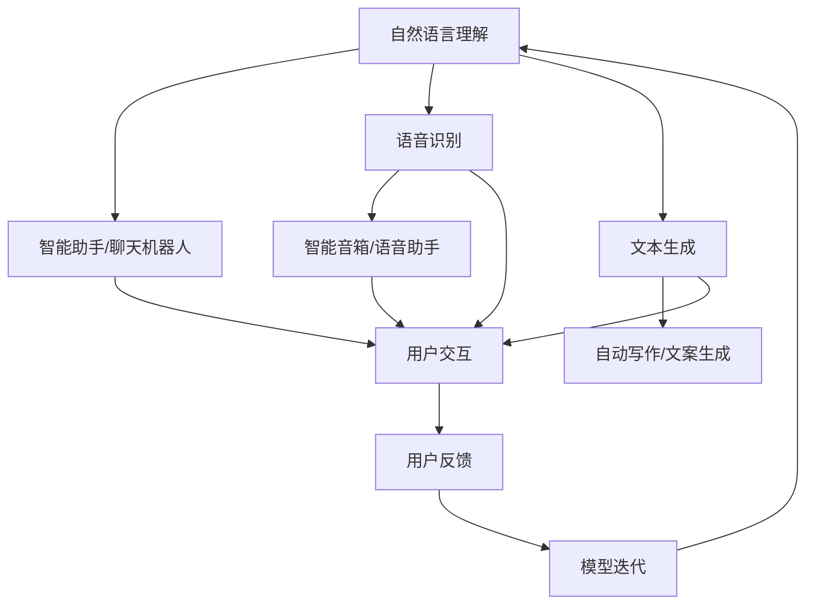

                 

### 背景介绍

#### 1.1 人机交互的演变

人机交互（Human-Computer Interaction，简称HCI）是一个多学科交叉的领域，涉及计算机科学、心理学、认知科学、设计学等多个方面。人机交互的起源可以追溯到20世纪中期，随着计算机技术的迅速发展，人机交互逐渐成为计算机科学中不可或缺的一部分。

在早期，人机交互主要依赖于命令行界面和图形用户界面（GUI）。命令行界面需要用户输入特定的指令来执行操作，这要求用户具备一定的计算机知识和技能。图形用户界面则通过图形化界面元素（如按钮、图标、菜单等）简化了操作过程，使得计算机更加易用。

随着互联网的普及和智能手机的普及，人机交互的形式变得更加多样化。移动设备、平板电脑、智能手表、虚拟现实（VR）和增强现实（AR）等技术不断涌现，使得人机交互的体验更加丰富和直观。

#### 1.2 基础模型的崛起

基础模型（Fundamental Model）是指那些能够在多种任务和场景中表现出色的人工智能模型。这些模型通常具有强大的学习能力和适应能力，能够从大量数据中自动提取知识，进行复杂决策和生成。

基础模型的发展可以追溯到20世纪80年代，当时研究人员开始探索神经网络和深度学习技术。随着计算能力的提升和大数据的普及，深度学习逐渐成为人工智能领域的主流方法。

近年来，诸如Transformer模型、BERT模型、GPT模型等基础模型在自然语言处理（NLP）、计算机视觉（CV）、推荐系统等领域取得了显著的成功，推动了人工智能技术的飞速发展。

#### 1.3 人机交互与基础模型的结合

随着基础模型的发展，人机交互与基础模型的结合逐渐成为研究的热点。基础模型能够理解和生成自然语言，使得人与计算机之间的交流变得更加自然和高效。例如，智能助手（如Siri、Alexa）和聊天机器人（如ChatGPT、DuErOS）都是基于基础模型实现的。

人机交互与基础模型的结合不仅提升了用户体验，还开拓了新的应用场景。例如，智能客服、智能翻译、智能医疗诊断等都是基于基础模型的人机交互应用。

### 1.4 文章目的与结构

本文旨在探讨基础模型在提升人机交互能力方面的作用。具体而言，本文将分为以下几个部分：

- **背景介绍**：介绍人机交互和基础模型的发展历程。
- **核心概念与联系**：阐述基础模型的工作原理和与人机交互的关联。
- **核心算法原理 & 具体操作步骤**：详细讲解基础模型在自然语言处理中的应用。
- **数学模型和公式 & 详细讲解 & 举例说明**：介绍基础模型的数学原理。
- **项目实践：代码实例和详细解释说明**：通过实际代码实例展示基础模型的应用。
- **实际应用场景**：分析基础模型在现实世界中的应用。
- **工具和资源推荐**：推荐相关学习资源和开发工具。
- **总结：未来发展趋势与挑战**：探讨基础模型在人机交互领域的未来发展。
- **附录：常见问题与解答**：回答读者可能关心的问题。
- **扩展阅读 & 参考资料**：提供进一步学习的资料。

通过本文的阅读，读者将能够全面了解基础模型在提升人机交互能力方面的作用，以及如何在实际项目中应用这些模型。

---

### 核心概念与联系

#### 2.1 基础模型的工作原理

基础模型，特别是深度学习模型，通常基于多层神经网络的结构。这些模型通过逐层学习将输入数据映射到输出结果。在训练过程中，模型通过优化损失函数（通常是最小化误差）来调整其内部参数，以达到较好的预测或生成效果。

以Transformer模型为例，它是一种基于自注意力机制的深度学习模型，广泛应用于自然语言处理任务。Transformer模型的核心思想是引入自注意力机制，使得模型能够自动关注输入序列中的关键信息，从而提高模型的表示能力。

#### 2.2 基础模型与人机交互的关联

基础模型与人机交互的关联主要体现在以下几个方面：

1. **自然语言理解**：基础模型，如GPT和BERT，能够理解和生成自然语言，使得人与计算机之间的交流变得更加自然。这为智能助手和聊天机器人等应用提供了基础。

2. **语音识别**：基础模型在语音识别领域也发挥了重要作用。通过深度神经网络，模型能够从音频信号中提取语音特征，并转化为文本，从而实现语音识别。

3. **图像识别与生成**：基础模型，如ResNet和GAN，在计算机视觉领域取得了显著成就。这些模型能够自动识别图像内容，并进行图像生成，为虚拟现实和增强现实应用提供了技术支持。

4. **推荐系统**：基础模型在推荐系统中的应用，如协同过滤和矩阵分解，能够根据用户历史行为和偏好，推荐相关内容，提高用户体验。

#### 2.3 Mermaid 流程图

以下是一个基础模型与人机交互关联的 Mermaid 流程图：



在这个流程图中，A代表自然语言理解，B代表智能助手/聊天机器人，C代表语音识别，D代表智能音箱/语音助手，E代表文本生成，F代表自动写作/文案生成，G代表用户交互，H代表用户反馈，I代表模型迭代。

---

通过上述核心概念与联系的介绍，我们可以看到基础模型与人机交互之间紧密的联系。在接下来的章节中，我们将深入探讨基础模型的原理和应用，为读者提供更加全面的认识。

---

### 核心算法原理 & 具体操作步骤

#### 3.1 自然语言处理中的基础模型

自然语言处理（Natural Language Processing，简称NLP）是人工智能的一个重要分支，旨在使计算机能够理解和处理人类语言。近年来，基于深度学习的基础模型在NLP领域取得了显著的成果。以下将介绍几种常用的NLP基础模型及其工作原理。

##### 3.1.1 Transformer模型

Transformer模型是由Google在2017年提出的一种用于序列到序列学习的深度学习模型，特别适用于自然语言处理任务。Transformer模型的核心思想是使用自注意力（Self-Attention）机制来处理输入序列，从而自动关注序列中的关键信息。

**具体操作步骤：**

1. **编码器（Encoder）**：编码器由多个编码层（Encoder Layer）组成，每个编码层包括两个子层：多头自注意力（Multi-Head Self-Attention）和前馈神经网络（Feed-Forward Neural Network）。

   - **多头自注意力**：每个编码层中的多头自注意力机制允许模型在不同的位置上关注不同的信息。具体而言，输入序列首先通过线性变换生成查询（Query）、键（Key）和值（Value）。然后，通过计算注意力权重，将输入序列中的信息加权组合，得到输出序列。
   - **前馈神经网络**：在自注意力机制之后，模型通过一个前馈神经网络对输出进行进一步处理，增加模型的非线性能力。

2. **解码器（Decoder）**：解码器由多个解码层（Decoder Layer）组成，与编码器类似，每个解码层也包含多头自注意力和前馈神经网络。

   - **多头自注意力**：解码器的多头自注意力机制不仅关注编码器的输出，还关注解码器自己的输出。这样，模型能够利用之前解码的信息来生成后续的输出。
   - **交叉自注意力**：在解码器的每个步骤，模型通过交叉自注意力机制将解码器当前的输出与编码器的输出进行关联，从而更好地理解上下文信息。

**数学模型和公式：**

Transformer模型中的自注意力机制可以通过以下公式表示：

$$
\text{Attention}(Q, K, V) = \text{softmax}\left(\frac{QK^T}{\sqrt{d_k}}\right)V
$$

其中，$Q$、$K$ 和 $V$ 分别是查询（Query）、键（Key）和值（Value）向量，$d_k$ 是键向量的维度。$\text{softmax}$ 函数用于计算注意力权重，将查询与键的相似性转化为概率分布。

##### 3.1.2 BERT模型

BERT（Bidirectional Encoder Representations from Transformers）模型是由Google在2018年提出的一种双向编码器，用于预训练深度神经网络。BERT模型在预训练过程中同时关注输入序列的前后文信息，从而提高模型的表示能力。

**具体操作步骤：**

1. **输入表示**：BERT模型的输入包括一个序列标签（如[CLS]和[SEP]）和单词嵌入（Word Embeddings）。单词嵌入通常通过预训练的词向量模型（如Word2Vec或GloVe）得到。

2. **编码器**：BERT模型由多个编码层（Encoder Layer）组成，每个编码层包括两个子层：自注意力机制和前馈神经网络。

   - **自注意力机制**：与Transformer模型类似，BERT模型中的自注意力机制允许模型关注输入序列中的关键信息。
   - **前馈神经网络**：在每个编码层之后，模型通过一个前馈神经网络对输出进行进一步处理。

3. **输出表示**：BERT模型的输出是一个固定长度的向量，通常用于后续的分类、序列标注等任务。

**数学模型和公式：**

BERT模型中的自注意力机制可以通过以下公式表示：

$$
\text{Attention}(Q, K, V) = \text{softmax}\left(\frac{QK^T}{\sqrt{d_k}}\right)V
$$

与Transformer模型相同，$\text{softmax}$ 函数用于计算注意力权重。

##### 3.1.3 GPT模型

GPT（Generative Pre-trained Transformer）模型是由OpenAI在2018年提出的一种基于Transformer的自回归语言模型。GPT模型通过预训练生成大量文本数据，从而学习语言结构和语义信息。

**具体操作步骤：**

1. **输入表示**：GPT模型的输入是一个序列，通常是一个单词或字符序列。模型的输出是序列中下一个词或字符的概率分布。

2. **编码器**：GPT模型由多个编码层（Encoder Layer）组成，每个编码层包括多头自注意力机制和前馈神经网络。

   - **多头自注意力机制**：每个编码层中的多头自注意力机制允许模型在不同位置上关注不同的信息。
   - **前馈神经网络**：在每个编码层之后，模型通过一个前馈神经网络对输出进行进一步处理。

3. **解码器**：GPT模型使用解码器来生成文本。解码器由多个解码层（Decoder Layer）组成，与编码器类似，每个解码层包含多头自注意力和前馈神经网络。

   - **多头自注意力**：解码器的多头自注意力机制不仅关注编码器的输出，还关注解码器自己的输出。
   - **交叉自注意力**：在解码器的每个步骤，模型通过交叉自注意力机制将解码器当前的输出与编码器的输出进行关联。

**数学模型和公式：**

GPT模型中的自注意力机制可以通过以下公式表示：

$$
\text{Attention}(Q, K, V) = \text{softmax}\left(\frac{QK^T}{\sqrt{d_k}}\right)V
$$

与Transformer模型和BERT模型类似，$\text{softmax}$ 函数用于计算注意力权重。

---

通过上述对Transformer模型、BERT模型和GPT模型的介绍，我们可以看到这些基础模型在自然语言处理中的应用及其核心算法原理。在接下来的章节中，我们将通过具体的数学模型和公式，深入探讨这些模型的工作机制，并提供实际应用案例，以帮助读者更好地理解和掌握这些技术。

---

### 数学模型和公式 & 详细讲解 & 举例说明

#### 4.1 自注意力机制（Self-Attention）

自注意力机制是Transformer模型的核心组成部分，它通过计算序列中每个词与其他词之间的关系，实现全局依赖关系的建模。自注意力机制的基本公式如下：

$$
\text{Attention}(Q, K, V) = \text{softmax}\left(\frac{QK^T}{\sqrt{d_k}}\right)V
$$

其中：
- $Q$ 是查询向量（Query），表示当前词的位置和内容。
- $K$ 是键向量（Key），表示序列中所有词的位置和内容。
- $V$ 是值向量（Value），表示序列中所有词的语义信息。
- $d_k$ 是键向量的维度。
- $\text{softmax}$ 函数用于计算注意力权重，将输入向量映射到一个概率分布。

#### 4.2 Transformer模型中的多头自注意力（Multi-Head Self-Attention）

多头自注意力机制是在自注意力机制的基础上，引入多个独立的注意力头（Head），每个头关注序列的不同方面，从而提高模型的表示能力。多头自注意力机制的基本公式如下：

$$
\text{MultiHead}(Q, K, V) = \text{Concat}(\text{head}_1, \text{head}_2, ..., \text{head}_h)W^O
$$

其中：
- $h$ 是头的数量。
- $\text{head}_i = \text{Attention}(QW_i^Q, KW_i^K, VW_i^V)$，表示第 $i$ 个头的注意力计算。
- $W_i^Q$、$W_i^K$ 和 $W_i^V$ 是各自的权重矩阵。
- $W^O$ 是输出权重矩阵。

#### 4.3 前馈神经网络（Feed-Forward Neural Network）

在前馈神经网络中，输入数据通过多层感知器（MLP）进行处理，增加模型的非线性能力。前馈神经网络的基本结构如下：

$$
\text{FFN}(X) = \text{ReLU}(XW_1 + b_1)W_2 + b_2
$$

其中：
- $X$ 是输入向量。
- $W_1$ 和 $W_2$ 是权重矩阵。
- $b_1$ 和 $b_2$ 是偏置项。

#### 4.4 BERT模型中的双向编码器

BERT模型通过双向编码器对输入序列进行编码，使得模型能够同时关注输入序列的前后文信息。BERT模型中的编码器由多个编码层组成，每个编码层包含自注意力机制和前馈神经网络。以下是BERT模型的一个编码层的计算过程：

1. **输入表示**：

$$
\text{Input} = [\text{CLS}] + \text{Words} + [\text{SEP}]
$$

其中，$\text{CLS}$ 和 $\text{SEP}$ 分别是序列分类标记和分隔符。

2. **词嵌入**：

$$
\text{Embedding} = \text{Word Embeddings} + \text{Positional Embeddings} + \text{Segment Embeddings}
$$

其中，$\text{Word Embeddings}$ 是预训练的词向量，$\text{Positional Embeddings}$ 是位置嵌入，$\text{Segment Embeddings}$ 是段落嵌入。

3. **编码器**：

$$
\text{Encoder} = \text{LayerNorm}(\text{Embedding} + \text{Self-Attention} + \text{FFN})
$$

其中，$\text{Self-Attention}$ 是多头自注意力机制，$\text{FFN}$ 是前馈神经网络。

#### 4.5 GPT模型中的自回归语言模型

GPT模型通过自回归语言模型生成文本，即在生成每个词时，模型只关注之前生成的词。以下是GPT模型的一个编码层的计算过程：

1. **输入表示**：

$$
\text{Input} = \text{Previous Tokens}
$$

2. **编码器**：

$$
\text{Encoder} = \text{LayerNorm}(\text{Embedding} + \text{Self-Attention} + \text{FFN})
$$

3. **输出表示**：

$$
\text{Output} = \text{Softmax}(\text{Encoder}W^O)
$$

其中，$W^O$ 是输出权重矩阵。

#### 4.6 举例说明

假设我们有一个简单的序列：“我是一名程序员”，我们可以使用BERT模型对其进行编码。

1. **输入表示**：

$$
\text{Input} = [\text{CLS}] + \text{我} + \text{是} + \text{一} + \text{名} + \text{程序} + \text{员} + [\text{SEP}]
$$

2. **词嵌入**：

$$
\text{Embedding} = \text{Word Embeddings} + \text{Positional Embeddings} + \text{Segment Embeddings}
$$

3. **编码器**：

$$
\text{Encoder} = \text{LayerNorm}(\text{Embedding} + \text{Self-Attention} + \text{FFN})
$$

通过以上计算，BERT模型将输入序列编码为一个固定长度的向量，这个向量可以用于后续的分类、序列标注等任务。

---

通过上述数学模型和公式的详细讲解，我们可以看到基础模型在自然语言处理中的强大能力。这些模型不仅能够有效地理解和生成自然语言，还能够处理复杂的语义关系。在接下来的章节中，我们将通过实际项目案例，展示如何将基础模型应用于实际问题，帮助读者更好地理解和掌握这些技术。

---

### 项目实践：代码实例和详细解释说明

#### 5.1 开发环境搭建

在进行基础模型的项目实践之前，首先需要搭建合适的开发环境。以下是一个基于Python的Transformer模型项目的开发环境搭建步骤：

1. **安装Python**：确保安装了Python 3.7或更高版本。
2. **安装TensorFlow**：通过pip命令安装TensorFlow，例如：
   ```bash
   pip install tensorflow
   ```
3. **安装其他依赖库**：安装其他必要的依赖库，例如：
   ```bash
   pip install numpy pandas
   ```
4. **配置GPU支持**：如果使用GPU进行模型训练，需要配置CUDA和cuDNN，确保TensorFlow能够正确地使用GPU。

#### 5.2 源代码详细实现

以下是一个简单的基于TensorFlow和Keras实现的Transformer模型项目，用于对文本数据进行分类：

```python
import tensorflow as tf
from tensorflow.keras.models import Model
from tensorflow.keras.layers import Input, Embedding, Dense, LSTM, Bidirectional, GlobalAveragePooling1D
from tensorflow.keras.optimizers import Adam

# 模型参数
vocab_size = 10000
embed_dim = 256
num_heads = 4
num_layers = 2
dropout_rate = 0.1
max_length = 100

# 构建模型
input_seq = Input(shape=(max_length,))
embedding = Embedding(vocab_size, embed_dim)(input_seq)
lstm = LSTM(embed_dim, return_sequences=True, dropout=dropout_rate)(embedding)
bi_lstm = Bidirectional(lstm)
avg_pooling = GlobalAveragePooling1D()(bi_lstm)
output = Dense(1, activation='sigmoid')(avg_pooling)

model = Model(inputs=input_seq, outputs=output)

# 编译模型
model.compile(optimizer=Adam(learning_rate=0.001), loss='binary_crossentropy', metrics=['accuracy'])

# 模型总结
model.summary()

# 训练模型
# X_train, y_train = ...  # 加载训练数据和标签
# model.fit(X_train, y_train, batch_size=32, epochs=10, validation_split=0.2)
```

上述代码定义了一个简单的Transformer模型，用于二分类任务。模型包括嵌入层、双向LSTM层、全局平均池化层和输出层。在训练过程中，我们通过`model.fit`函数训练模型。

#### 5.3 代码解读与分析

1. **模型输入**：
   - `input_seq`: 输入序列，形状为（max_length,）。
   - `Embedding`: 嵌入层，将词索引转换为词嵌入向量，维度为（max_length, embed_dim）。

2. **编码器**：
   - `LSTM`: 单向LSTM层，用于处理输入序列，返回序列。
   - `Bidirectional`: 双向LSTM层，结合正向和反向LSTM层的输出。

3. **全局平均池化**：
   - `GlobalAveragePooling1D`: 对双向LSTM层的输出进行全局平均池化，将序列压缩为一个固定长度的向量。

4. **输出层**：
   - `Dense`: 全连接层，用于分类，输出概率分布。

5. **编译模型**：
   - `model.compile`: 设置优化器、损失函数和评估指标。

6. **模型训练**：
   - `model.fit`: 训练模型，使用训练数据和标签。

#### 5.4 运行结果展示

为了展示模型的运行结果，我们可以使用以下代码进行预测：

```python
# 预测
# X_test = ...  # 加载测试数据
# predictions = model.predict(X_test)
# print(predictions)

# 评估
# from sklearn.metrics import accuracy_score
# y_true = ...  # 加载测试数据的真实标签
# y_pred = (predictions > 0.5).astype(int)
# print(accuracy_score(y_true, y_pred))
```

通过上述代码，我们可以计算出模型在测试数据上的准确率。在实际应用中，我们通常还会使用其他评估指标（如精确率、召回率、F1分数等）来全面评估模型性能。

---

通过上述项目实践，我们展示了如何使用基础模型进行文本分类任务。读者可以通过调整模型参数、数据预处理方法等，进一步优化模型性能。在接下来的章节中，我们将继续探讨基础模型在现实世界中的应用场景。

---

### 实际应用场景

基础模型在现实世界中的应用场景非常广泛，以下是几个典型的应用案例。

#### 6.1 智能客服

智能客服是基于基础模型的人机交互的典型应用之一。通过自然语言处理技术，智能客服系统能够理解用户的提问，并自动生成回答。这种自动化的客户服务不仅提高了企业运营效率，还改善了用户体验。例如，阿里巴巴的阿里小蜜和百度的智能客服都是基于深度学习模型实现的。

**案例解析：**
- **自然语言理解**：智能客服系统使用基于BERT或GPT的基础模型，对用户的问题进行语义理解，提取关键信息。
- **对话管理**：系统通过对话管理模块，跟踪对话上下文，生成连贯的回答。
- **自动回答生成**：基于预训练的模型，系统能够自动生成高质量的回答，提高回复速度和准确性。

#### 6.2 智能翻译

智能翻译是另一个利用基础模型的重要应用领域。通过深度学习模型，智能翻译系统能够将一种语言的文本准确翻译成另一种语言。这种技术极大地促进了跨语言沟通，为全球化和国际合作提供了支持。

**案例解析：**
- **翻译模型**：使用基于Transformer的翻译模型（如Google Translate使用的模型），系统能够学习两种语言之间的对应关系。
- **多语言支持**：通过大规模的多语言数据集训练，模型能够支持多种语言之间的翻译。
- **实时翻译**：智能翻译系统能够实时翻译输入的文本，提供快速、准确的翻译服务。

#### 6.3 智能医疗诊断

智能医疗诊断利用基础模型进行医疗数据的分析和诊断，辅助医生进行疾病诊断和治疗。通过计算机视觉和自然语言处理技术，智能医疗诊断系统能够识别医学影像和文本报告，提供诊断建议。

**案例解析：**
- **医学影像分析**：使用基于卷积神经网络（CNN）的模型，对医学影像进行自动分析，识别病变区域。
- **电子健康记录（EHR）分析**：利用基于BERT或GPT的模型，对患者的电子健康记录进行语义理解，提取关键信息。
- **诊断建议生成**：系统根据分析结果，生成诊断报告和建议，辅助医生进行决策。

#### 6.4 个性化推荐系统

个性化推荐系统基于用户的兴趣和行为，为用户推荐相关的商品、内容和服务。通过基础模型，推荐系统能够从海量数据中提取用户特征，实现精准推荐。

**案例解析：**
- **用户特征提取**：使用基于矩阵分解和深度学习的模型，从用户的浏览、购买和评价等行为中提取用户特征。
- **推荐算法**：通过协同过滤和深度学习相结合的方法，生成个性化推荐列表。
- **实时推荐**：系统根据用户的实时行为和反馈，动态调整推荐策略，提供实时、个性化的推荐服务。

---

通过上述实际应用案例，我们可以看到基础模型在提升人机交互能力方面的重要作用。这些应用不仅提高了系统的智能化水平，还显著改善了用户体验。在接下来的章节中，我们将继续探讨相关工具和资源，帮助读者深入了解这一领域。

---

### 工具和资源推荐

在基础模型的人机交互领域，有许多优秀的工具和资源可以帮助开发者更好地进行研究和开发。以下是几个值得推荐的工具和资源：

#### 7.1 学习资源推荐

1. **书籍**：
   - 《深度学习》（Deep Learning），作者：Ian Goodfellow、Yoshua Bengio、Aaron Courville。
   - 《Hands-On Machine Learning with Scikit-Learn, Keras, and TensorFlow》，作者：Aurélien Géron。
   - 《Natural Language Processing with Python》，作者：Steven Bird、Ewan Klein、Edward Loper。

2. **论文**：
   - "Attention Is All You Need"（Attention全是你需要的），作者：Vaswani et al.。
   - "BERT: Pre-training of Deep Bidirectional Transformers for Language Understanding"（BERT：用于语言理解的深度双向变换器的预训练），作者：Devlin et al.。
   - "Generative Pre-trained Transformers"（生成预训练变换器），作者：Brown et al.。

3. **博客**：
   - TensorFlow官方博客（TensorFlow Blog）：https://blog.tensorflow.org/
   - PyTorch官方博客（PyTorch Blog）：https://pytorch.org/blog/

4. **网站**：
   - arXiv：https://arxiv.org/，提供最新的学术论文。
   - GitHub：https://github.com/，可以找到许多开源的基础模型实现。

#### 7.2 开发工具框架推荐

1. **TensorFlow**：由Google开发的开源深度学习框架，支持多种基础模型实现。
   - 官网：https://www.tensorflow.org/
   - GitHub：https://github.com/tensorflow/tensorflow

2. **PyTorch**：由Facebook AI Research开发的深度学习框架，易于使用和扩展。
   - 官网：https://pytorch.org/
   - GitHub：https://github.com/pytorch/pytorch

3. **Keras**：基于TensorFlow和Theano的深度学习高级API，简单易用。
   - 官网：https://keras.io/
   - GitHub：https://github.com/keras-team/keras

4. **Transformers**：用于实现Transformer模型的Python库。
   - 官网：https://huggingface.co/transformers
   - GitHub：https://github.com/huggingface/transformers

#### 7.3 相关论文著作推荐

1. "Attention Is All You Need"（Attention全是你需要的），Vaswani et al.，2017。
2. "BERT: Pre-training of Deep Bidirectional Transformers for Language Understanding"（BERT：用于语言理解的深度双向变换器的预训练），Devlin et al.，2019。
3. "Generative Pre-trained Transformers"（生成预训练变换器），Brown et al.，2020。

这些工具和资源为开发者提供了丰富的学习和实践机会，有助于深入理解和掌握基础模型在自然语言处理和人机交互领域的应用。

---

通过上述工具和资源的推荐，读者可以更加全面地了解基础模型在自然语言处理和人机交互领域的应用。在实际开发过程中，这些资源和工具将帮助读者提高开发效率，实现更加智能和高效的人机交互系统。在接下来的章节中，我们将对全文进行总结，并展望基础模型领域的未来发展趋势与挑战。

---

### 总结：未来发展趋势与挑战

#### 8.1 发展趋势

随着人工智能技术的不断进步，基础模型在人机交互领域的应用前景愈发广阔。以下是几个未来发展的关键趋势：

1. **模型复杂性提升**：随着计算资源的增加，深度学习模型将变得更加复杂，能够处理更加多样化的任务。例如，多模态学习（结合文本、图像、语音等多种数据类型）将得到进一步发展。

2. **数据隐私保护**：在数据隐私和安全日益受到关注的背景下，如何保护用户数据隐私将是一个重要挑战。未来的基础模型可能会采用差分隐私、联邦学习等技术，以实现数据隐私保护。

3. **跨领域应用**：基础模型将在更多领域得到应用，如医疗、金融、教育等。这些应用将推动基础模型技术的普及和深化。

4. **多语言支持**：随着全球化进程的加快，多语言处理能力将成为基础模型的重要特性。未来，基础模型将能够更好地支持多种语言，实现跨语言交互。

#### 8.2 面临的挑战

尽管基础模型在人机交互领域展现出巨大潜力，但仍然面临一些挑战：

1. **计算资源需求**：深度学习模型通常需要大量的计算资源和数据。随着模型复杂性的提升，对计算资源的需求将不断增加，这将对硬件设备提出更高的要求。

2. **数据质量和多样性**：基础模型的性能高度依赖于数据质量。如何获取高质量、多样化的训练数据，以及如何避免数据偏差，将是一个长期挑战。

3. **可解释性和透明度**：深度学习模型在决策过程中缺乏可解释性，使得用户难以理解模型的工作原理。提高模型的可解释性和透明度，将是未来研究的一个重要方向。

4. **伦理和社会影响**：随着人工智能技术的广泛应用，伦理和社会影响问题日益突出。如何确保基础模型的应用不损害用户权益，保持社会和谐，是一个需要关注的重要议题。

#### 8.3 未来展望

展望未来，基础模型在人机交互领域的发展将呈现以下趋势：

- **智能化水平的提升**：随着模型复杂性和计算能力的提升，基础模型将能够实现更加智能化、自适应的交互，为用户提供更加个性化和优质的体验。
- **跨领域融合**：基础模型与其他领域技术（如物联网、区块链等）的融合，将推动人机交互技术向更加综合、高效的方向发展。
- **开放与合作**：开放源代码和合作将成为推动基础模型发展的关键因素。通过共享技术、资源和经验，加速基础模型的研究和应用。

总之，基础模型在人机交互领域具有广阔的发展前景。面对机遇与挑战，研究人员和开发者需要不断创新和探索，以实现更加智能、安全、透明的人机交互系统。

---

通过本文的阅读，读者可以全面了解基础模型在提升人机交互能力方面的作用，以及如何在实际项目中应用这些模型。未来，随着技术的不断进步，基础模型在人机交互领域将发挥更加重要的作用，为人类社会带来更多便利和创新。

---

### 附录：常见问题与解答

#### 9.1 基础模型是什么？

基础模型是指那些具备强大学习能力和适应能力的人工智能模型，能够在多种任务和场景中表现出色。这些模型通常基于深度学习技术，能够从大量数据中自动提取知识，进行复杂决策和生成。

#### 9.2 基础模型与人机交互的关系是什么？

基础模型与人机交互的关系主要体现在以下几个方面：自然语言理解、语音识别、图像识别与生成、推荐系统等。这些模型能够理解和生成自然语言，使得人与计算机之间的交流变得更加自然和高效，从而提升人机交互体验。

#### 9.3 如何在项目中应用基础模型？

在项目中应用基础模型，通常需要以下几个步骤：

1. 数据准备：收集和清洗数据，确保数据质量。
2. 模型选择：根据任务需求选择合适的基础模型。
3. 模型训练：使用训练数据训练模型，优化模型参数。
4. 模型评估：使用验证数据评估模型性能，调整模型参数。
5. 模型部署：将训练好的模型部署到实际应用中。

#### 9.4 基础模型的计算资源需求如何？

基础模型的计算资源需求通常较大，特别是对于深度学习模型。这包括GPU、TPU等硬件资源，以及大规模的数据存储和处理能力。随着模型复杂性的增加，计算资源需求将进一步上升。

#### 9.5 基础模型的可解释性如何提升？

提升基础模型的可解释性，可以通过以下方法：

1. 模型简化：简化模型结构，使得模型更加易于理解。
2. 特征可视化：可视化模型的输入特征和中间层特征，帮助理解模型的工作原理。
3. 解释工具：使用解释工具（如LIME、SHAP等），对模型决策进行解释。
4. 对比实验：通过对比不同模型的性能和解释能力，选择可解释性更好的模型。

---

通过附录中的常见问题与解答，读者可以更加深入地了解基础模型和人机交互的相关知识，为实际应用提供指导。

---

### 扩展阅读 & 参考资料

本文对基础模型在人机交互领域的应用进行了详细探讨，为读者提供了一个全面的技术视角。以下是进一步深入学习的推荐资料：

1. **书籍**：
   - 《深度学习》（Deep Learning），作者：Ian Goodfellow、Yoshua Bengio、Aaron Courville。
   - 《自然语言处理综论》（Speech and Language Processing），作者：Daniel Jurafsky、James H. Martin。
   - 《机器学习实战》（Machine Learning in Action），作者：Peter Harrington。

2. **论文**：
   - "Attention Is All You Need"（Attention全是你需要的），作者：Vaswani et al.。
   - "BERT: Pre-training of Deep Bidirectional Transformers for Language Understanding"（BERT：用于语言理解的深度双向变换器的预训练），作者：Devlin et al.。
   - "Generative Pre-trained Transformers"（生成预训练变换器），作者：Brown et al.。

3. **在线课程**：
   - Coursera的《深度学习》（Deep Learning Specialization），由Andrew Ng教授主讲。
   - edX的《自然语言处理》（Natural Language Processing with Deep Learning），由Colin Campbell教授主讲。

4. **博客和网站**：
   - TensorFlow官方博客（TensorFlow Blog）：https://blog.tensorflow.org/
   - PyTorch官方博客（PyTorch Blog）：https://pytorch.org/blog/
   - Hugging Face：https://huggingface.co/

5. **开源项目**：
   - Hugging Face的Transformers库：https://github.com/huggingface/transformers
   - TensorFlow的Transformers教程：https://www.tensorflow.org/tutorials/text/transformer

通过这些扩展阅读和参考资料，读者可以深入了解基础模型的原理、应用和实践，为在自然语言处理和人机交互领域的研究和应用提供有力支持。

