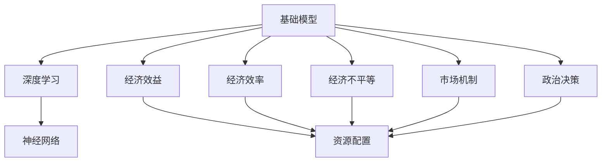
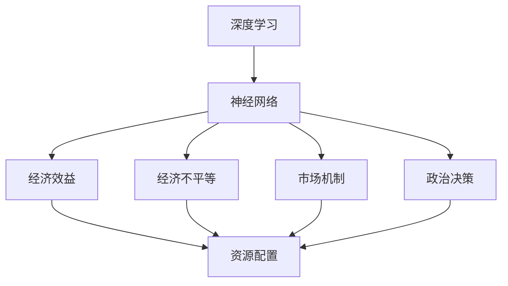

                 

### 背景介绍

#### 基础模型的政治经济学效应的提出

基础模型的政治经济学效应这一概念，起源于近年来人工智能技术的迅猛发展和其在全球经济、社会及政治等多个领域的广泛应用。随着深度学习、神经网络等基础模型的不断进步，其对现代经济的运行模式、生产方式以及社会结构等方面产生了深远的影响。

这一现象引起了学术界和产业界的广泛关注。政治经济学作为一个跨学科的领域，既涵盖了经济学的基本理论，也关注政治和社会层面的影响。因此，当基础模型技术融入这一领域时，不可避免地引发了一系列新的讨论和思考。例如，如何评估基础模型对经济效率、社会公平以及政治稳定的影响？基础模型的普及和应用，是否会加剧或缓解现有的经济不平等和社会矛盾？这些问题的提出，使得我们对基础模型的政治经济学效应进行深入探讨成为必要。

#### 人工智能与基础模型的发展

人工智能（AI）作为一门高度综合性的技术学科，其发展历程可以追溯到20世纪50年代。早期的人工智能研究主要集中在逻辑推理和知识表示等方面。然而，随着计算能力的提升和大数据技术的发展，以深度学习为代表的人工智能技术逐渐崭露头角。深度学习模型，尤其是神经网络，通过对大量数据进行训练，能够自动提取复杂的数据特征，从而在图像识别、自然语言处理、语音识别等多个领域取得了显著的突破。

近年来，基于深度学习的自然语言处理（NLP）模型，如GPT（Generative Pre-trained Transformer）和BERT（Bidirectional Encoder Representations from Transformers），更是引发了人工智能领域的一场革命。这些模型通过在海量文本数据上进行预训练，能够显著提升文本理解和生成能力，从而在问答系统、机器翻译、文本摘要等任务中展现出强大的性能。

#### 政治经济学的基础概念

在讨论基础模型的政治经济学效应之前，有必要简要回顾政治经济学的一些基础概念。政治经济学是研究经济行为与政治决策之间相互关系的一个跨学科领域。它不仅关注经济效率和生产力的提高，还关注经济活动对社会、政治结构以及分配正义的影响。

政治经济学中的核心概念包括：

- **经济效益**：指经济活动带来的社会福祉的增加。
- **经济效率**：指资源的最优配置，以实现最大的经济效益。
- **经济不平等**：指社会中不同群体之间的财富、收入和资源分配的不均衡。
- **市场机制**：指通过价格、供需等因素调节资源分配和配置的机制。
- **政治决策**：指政府或其他权力机构在经济和社会管理方面所做的决策。

这些概念在讨论基础模型的政治经济学效应时，具有重要的参考价值。例如，经济效益和效率的考量，可以帮助我们评估基础模型对经济活动的影响；经济不平等和市场机制的讨论，则有助于分析基础模型可能带来的社会效应。

#### 基础模型对经济和社会的影响

基础模型的发展不仅改变了技术领域，也对经济和社会产生了深远的影响。首先，从经济层面来看，基础模型的应用显著提高了生产效率和服务质量。例如，在金融领域，智能投顾和自动化交易系统的应用，不仅提高了交易的效率，还降低了成本。在医疗领域，基于深度学习的图像识别技术，可以辅助医生进行疾病诊断，提高了诊断的准确性和效率。

其次，从社会层面来看，基础模型的应用也带来了深远的影响。一方面，它促进了知识的传播和创新。通过智能搜索和推荐系统，人们可以更快地获取到相关知识和信息，从而促进知识的共享和利用。另一方面，基础模型的应用也可能加剧社会不平等。例如，在就业方面，自动化和智能化的普及可能导致某些工作岗位的消失，进而影响相关从业者的就业和收入。

#### 政治经济学效应的重要性

基础模型的政治经济学效应之所以重要，主要是因为它直接关系到经济和社会的稳定发展。首先，经济层面的影响会直接影响社会的繁荣和稳定。例如，如果基础模型的应用导致经济不平等加剧，可能会引发社会矛盾和冲突，影响社会稳定。其次，基础模型的应用还可能对政治决策产生重要影响。例如，智能政治分析工具可以帮助政府更好地制定经济政策和社会政策，从而提高政策的效率。

综上所述，基础模型的政治经济学效应是一个复杂且多维的问题。它不仅关系到技术领域的创新和发展，还直接影响到经济和社会的稳定和公平。因此，深入探讨和解析基础模型的政治经济学效应，对于我们理解现代科技发展的社会经济影响，以及制定相应的政策和发展战略，具有重要的理论和现实意义。

#### 目的与结构

本文旨在深入探讨基础模型的政治经济学效应，分析其在经济和社会领域中的具体表现及影响。文章将从以下几个方面展开：

1. **核心概念与联系**：首先，我们将介绍与基础模型相关的核心概念，如深度学习、神经网络等，并展示它们在政治经济学中的关联性。为了便于理解，我们将使用Mermaid流程图详细描述这些概念之间的相互关系。

2. **核心算法原理与具体操作步骤**：接下来，我们将详细解析基础模型的核心算法原理，包括数据预处理、模型训练和优化等步骤。通过具体操作步骤的讲解，帮助读者理解基础模型的实际应用过程。

3. **数学模型和公式**：为了更深入地理解基础模型，我们将介绍其背后的数学模型和公式，包括神经网络中的权重更新规则、梯度下降算法等。通过详细讲解和举例说明，使读者能够掌握这些数学工具。

4. **项目实践**：本文将结合实际项目，展示如何使用基础模型解决具体问题。我们将提供详细的代码实例和解释，帮助读者理解基础模型在实际开发中的应用。

5. **实际应用场景**：我们将探讨基础模型在不同领域的应用，如金融、医疗、教育等，分析其在这些场景中的具体作用和影响。

6. **工具和资源推荐**：为了方便读者进一步学习和实践，我们将推荐相关的学习资源、开发工具和框架。

7. **总结与未来发展趋势**：最后，我们将总结本文的主要观点，讨论基础模型的政治经济学效应的未来发展趋势和面临的挑战。

通过以上结构，本文旨在为读者提供全面、深入的理解，帮助其更好地把握基础模型的政治经济学效应。

## 2. 核心概念与联系

### 基础模型与政治经济学的联系

在深入探讨基础模型的政治经济学效应之前，我们首先需要明确几个核心概念：基础模型、深度学习、神经网络，以及它们与政治经济学的联系。

#### 基础模型

基础模型，通常指用于解决特定问题的算法和模型，如深度学习模型、机器学习模型等。这些模型通过对大量数据的学习和处理，能够自动提取数据中的模式和规律，从而实现自动预测、分类、生成等功能。基础模型在人工智能领域发挥着至关重要的作用，是许多先进技术的基石。

#### 深度学习

深度学习是基础模型的一个重要分支，它模仿人脑的神经网络结构，通过层层递进的方式来处理复杂的数据。深度学习模型的核心是神经网络，它由多个层级组成，每层都能对输入数据进行特征提取和变换。随着层数的增加，模型的复杂度和处理能力也显著提升。

#### 神经网络

神经网络是由大量神经元组成的计算模型，这些神经元通过连接形成网络，对输入数据进行处理和输出。神经网络的基本单元是神经元，每个神经元接收多个输入信号，通过加权求和处理后，产生一个输出信号。神经网络通过不断调整权重，学习输入数据与输出结果之间的关系，从而实现函数的映射。

#### 政治经济学

政治经济学是一个跨学科的领域，它研究经济行为与政治决策之间的相互作用。政治经济学关注的经济效益、经济效率、经济不平等等概念，为理解基础模型在经济和社会中的影响提供了理论基础。

#### 基础模型与政治经济学的联系

基础模型与政治经济学的联系体现在多个方面：

1. **经济效益与效率**：基础模型通过提高生产效率和降低成本，对经济效益产生直接影响。例如，在金融领域，自动化交易系统可以降低交易成本，提高交易效率；在医疗领域，智能诊断系统可以缩短诊断时间，提高医疗服务的效率。

2. **经济不平等**：基础模型的应用可能导致某些行业的自动化程度提高，从而影响就业结构，加剧经济不平等。例如，自动化生产的普及可能使得低技能劳动者的就业机会减少，收入水平下降。

3. **市场机制**：基础模型可以优化市场机制的运作，提高资源配置的效率。例如，智能搜索和推荐系统可以更精准地满足用户需求，提高市场供需匹配的效率。

4. **政治决策**：基础模型可以辅助政府制定经济政策和社会政策，提高政策制定的科学性和效率。例如，基于数据分析的社会问题诊断模型，可以帮助政府更好地应对社会问题，制定更有针对性的政策。

为了更好地理解这些概念之间的联系，我们可以使用Mermaid流程图来展示基础模型、深度学习、神经网络与政治经济学之间的关系。以下是一个简化的Mermaid流程图示例：



在这个流程图中，基础模型、深度学习、神经网络是核心概念，它们通过各自的属性和功能，与经济效益、经济效率、经济不平等、市场机制和政治决策等概念相互关联。这种关联性为我们理解基础模型的政治经济学效应提供了重要的理论基础。

#### 关键概念总结

通过以上讨论，我们可以总结出以下关键概念：

- **基础模型**：用于解决特定问题的算法和模型，如深度学习模型。
- **深度学习**：基于神经网络结构，通过层层递进的方式来处理复杂数据的算法。
- **神经网络**：由大量神经元组成的计算模型，通过连接和加权求和处理输入数据。
- **政治经济学**：研究经济行为与政治决策之间相互作用的一个跨学科领域。

这些概念相互关联，构成了理解基础模型政治经济学效应的基础框架。在接下来的部分，我们将进一步探讨这些概念的具体应用和影响。

## 2. 核心概念与联系

### 深度学习、神经网络与政治经济学

在深入探讨基础模型的政治经济学效应之前，我们需要对深度学习和神经网络这两个核心技术进行详细阐述，并展示它们如何与政治经济学产生关联。

#### 深度学习

深度学习（Deep Learning）是人工智能（AI）的一个重要分支，其主要思想是通过多层神经网络对数据进行训练，从而提取出复杂的特征和模式。深度学习模型通常由多个隐藏层组成，每层都对输入数据进行特征提取和转换。这种层次化的结构使得深度学习模型能够处理复杂的数据，并在诸如图像识别、自然语言处理、语音识别等领域取得了显著的成果。

深度学习模型的训练过程主要包括以下几个步骤：

1. **数据预处理**：对原始数据进行清洗、归一化等预处理操作，以提高训练效果。
2. **模型初始化**：初始化模型的参数，通常使用随机初始化或预训练模型。
3. **前向传播**：将输入数据传递到网络中，通过各个层的权重和激活函数计算输出。
4. **损失函数计算**：通过实际输出与预期输出之间的差异，计算损失函数值。
5. **反向传播**：根据损失函数梯度，调整模型参数，使损失函数值最小化。
6. **迭代训练**：重复上述步骤，不断调整参数，直到模型收敛。

#### 神经网络

神经网络（Neural Network）是深度学习模型的基础，它由大量简单的计算单元（即神经元）组成，这些神经元通过连接形成网络，对输入数据进行处理。每个神经元接收多个输入信号，通过加权求和处理后，产生一个输出信号。神经网络通过学习输入数据与输出结果之间的关系，实现函数的映射。

神经网络的基本单元是神经元，其工作原理可以概括为以下几步：

1. **输入与加权求和处理**：每个神经元接收多个输入信号，这些信号通过不同的权重进行加权求和处理。
2. **激活函数应用**：通过激活函数（如ReLU、Sigmoid、Tanh等）对加权求和处理的结果进行非线性转换，产生输出信号。
3. **层间传递**：输出信号传递到下一层神经元，形成多层网络结构。
4. **最终输出**：最后一层的输出即为网络的最终输出，与预期结果进行比较，计算损失函数。

#### 深度学习与神经网络的关联

深度学习和神经网络之间存在密切的关联。深度学习可以看作是神经网络的扩展，它通过引入更多的隐藏层和复杂的激活函数，使得神经网络能够处理更复杂的数据和任务。深度学习模型在多个层次上对输入数据进行特征提取和转换，从而实现更高级的函数映射。

深度学习和神经网络与政治经济学的联系主要体现在以下几个方面：

1. **经济效益与效率**：深度学习和神经网络通过提高数据处理和分析能力，显著提升了生产效率和经济效益。例如，在金融领域，深度学习模型可以用于风险管理、自动化交易等任务，提高交易效率和收益。在医疗领域，神经网络可以用于疾病诊断、医学图像分析等任务，提高诊断效率和准确性。

2. **经济不平等**：深度学习和神经网络的应用可能导致某些行业的自动化程度提高，从而影响就业结构，加剧经济不平等。例如，自动化生产线和智能机器人可能取代某些低技能劳动者的工作，导致失业率上升。此外，深度学习模型的训练和应用需要大量的数据和技术资源，这可能使得大型企业或国家在竞争中占据优势，进一步加剧经济不平等。

3. **市场机制**：深度学习和神经网络可以优化市场机制的运作，提高资源配置的效率。例如，智能搜索和推荐系统可以利用深度学习技术，更精准地满足用户需求，提高市场供需匹配的效率。在金融领域，基于深度学习的交易策略可以优化投资组合，提高投资回报率。

4. **政治决策**：深度学习和神经网络可以辅助政府制定经济政策和社会政策，提高政策制定的科学性和效率。例如，基于数据分析的社会问题诊断模型可以帮助政府更好地应对社会问题，制定更有针对性的政策。在公共安全领域，神经网络可以用于人脸识别、视频监控等任务，提高公共安全水平。

#### Mermaid流程图

为了更直观地展示深度学习、神经网络与政治经济学的联系，我们可以使用Mermaid流程图进行描述。以下是一个简化的Mermaid流程图示例：



在这个流程图中，深度学习和神经网络是核心技术，它们通过提高经济效益、缓解经济不平等、优化市场机制和辅助政治决策，与政治经济学产生关联。这种关联性为我们理解基础模型的政治经济学效应提供了重要的理论基础。

通过上述讨论，我们可以看出，深度学习、神经网络与政治经济学之间存在着紧密的联系。深度学习技术的发展不仅改变了技术领域，也对经济和社会产生了深远的影响。理解这些联系，有助于我们更全面地把握基础模型的政治经济学效应，并为相关领域的研究和实践提供指导。

### 3. 核心算法原理与具体操作步骤

在深入探讨基础模型的政治经济学效应之前，我们需要详细了解其核心算法原理，并掌握具体操作步骤。这一部分将主要介绍深度学习模型中的主要算法原理，包括数据预处理、模型训练和优化等步骤。

#### 数据预处理

数据预处理是深度学习模型训练的第一步，其目标是提高模型训练效率和准确性。数据预处理主要包括以下几个步骤：

1. **数据清洗**：去除数据中的噪声和不完整信息，保证数据质量。例如，删除缺失值、纠正错误数据等。
2. **数据归一化**：将不同特征的数据缩放到同一范围内，消除特征尺度差异对模型训练的影响。常用的归一化方法有最小-最大缩放和标准缩放。
3. **数据增强**：通过旋转、翻转、裁剪等操作，增加训练数据的多样性，防止模型过拟合。
4. **数据划分**：将数据集划分为训练集、验证集和测试集，用于模型训练、验证和评估。

以下是一个简单的数据预处理示例：

```python
import numpy as np
from sklearn.model_selection import train_test_split
from sklearn.preprocessing import MinMaxScaler

# 假设我们有一个样本数据集X和标签数据集y
X = np.array([[1, 2], [3, 4], [5, 6], [7, 8]])
y = np.array([0, 1, 0, 1])

# 数据清洗：去除缺失值
# 在这里，我们假设数据集已经没有缺失值

# 数据归一化
scaler = MinMaxScaler()
X_normalized = scaler.fit_transform(X)

# 数据增强
# 在这里，我们使用随机旋转进行数据增强
import random
X_augmented = []
for _ in range(X.shape[0]):
    angle = random.uniform(-180, 180)
    X_rotated = np.rot90(X_normalized[_], k=angle // 90)
    X_augmented.append(X_rotated)

X_augmented = np.array(X_augmented)

# 数据划分
X_train, X_val, y_train, y_val = train_test_split(X_augmented, y, test_size=0.2, random_state=42)
```

#### 模型训练

模型训练是深度学习模型构建的核心步骤，其目标是找到最佳参数，使模型在训练数据上表现出良好的性能。模型训练主要包括以下步骤：

1. **模型初始化**：初始化模型的权重和偏置，常用的方法有随机初始化和预训练模型。
2. **前向传播**：将输入数据传递到模型中，通过各个层的权重和激活函数计算输出。
3. **损失函数计算**：计算实际输出与预期输出之间的差异，使用损失函数度量模型性能。
4. **反向传播**：根据损失函数梯度，调整模型参数，使损失函数值最小化。
5. **迭代训练**：重复上述步骤，不断调整参数，直到模型收敛。

以下是一个简单的模型训练示例：

```python
import tensorflow as tf
from tensorflow.keras.models import Sequential
from tensorflow.keras.layers import Dense, Activation
from tensorflow.keras.optimizers import Adam

# 创建模型
model = Sequential([
    Dense(64, input_shape=(2,), activation='relu'),
    Dense(64, activation='relu'),
    Dense(1, activation='sigmoid')
])

# 编译模型
model.compile(optimizer=Adam(), loss='binary_crossentropy', metrics=['accuracy'])

# 训练模型
model.fit(X_train, y_train, epochs=10, batch_size=32, validation_data=(X_val, y_val))
```

#### 模型优化

模型优化是提高模型性能的重要手段，主要包括以下方法：

1. **调整超参数**：调整学习率、批量大小、层数、神经元个数等超参数，找到最佳配置。
2. **正则化**：通过添加正则化项（如L1正则化、L2正则化），防止模型过拟合。
3. **数据增强**：增加训练数据的多样性，提高模型泛化能力。
4. **交叉验证**：使用交叉验证方法，评估模型在不同数据集上的性能，防止模型过拟合。

以下是一个简单的模型优化示例：

```python
from tensorflow.keras.callbacks import EarlyStopping

# 设置早期停止回调函数，防止过拟合
early_stopping = EarlyStopping(monitor='val_loss', patience=5)

# 重新编译模型
model.compile(optimizer=Adam(learning_rate=0.001), loss='binary_crossentropy', metrics=['accuracy'])

# 使用交叉验证和早期停止训练模型
from tensorflow.keras.wrappers.scikit_learn import KerasClassifier
from sklearn.model_selection import cross_val_score

model = KerasClassifier(build_fn=model, epochs=100, batch_size=32, verbose=0)

cv_results = cross_val_score(model, X, y, cv=5)
print("CV accuracy: %.2f%% (%.2f%%)" % (cv_results.mean() * 100, cv_results.std() * 100))
```

通过以上示例，我们可以看到，深度学习模型的核心算法原理包括数据预处理、模型训练和模型优化。这些步骤共同构成了深度学习模型构建和优化的过程。理解这些原理和操作步骤，有助于我们更好地应用深度学习技术，解决实际问题。

### 4. 数学模型和公式

在深入探讨基础模型的政治经济学效应之前，我们需要详细解释其背后的数学模型和公式。这些数学工具是理解和应用深度学习模型的基础，也是评估基础模型政治经济学效应的重要手段。

#### 神经网络中的权重更新规则

神经网络的训练过程实质上是一个优化问题，目标是最小化损失函数。在训练过程中，通过反向传播算法调整模型的权重和偏置，从而提高模型的预测性能。权重更新规则是神经网络训练的核心，其基本原理如下：

设 $w^{(l)}_ij$ 为第 $l$ 层中第 $i$ 个神经元与第 $j$ 个神经元之间的权重，$b^{(l)}_i$ 为第 $l$ 层中第 $i$ 个神经元的偏置，$a^{(l)}_j$ 为第 $l$ 层中第 $j$ 个神经元的激活值。对于激活函数 $g()$，其导数为 $g'(x)$。

在前向传播过程中，我们可以得到第 $l$ 层中第 $i$ 个神经元的输出：

$$z^{(l)}_i = \sum_j w^{(l)}_{ij}a^{(l-1)}_j + b^{(l)}_i$$

$$a^{(l)}_i = g(z^{(l)}_i)$$

在反向传播过程中，我们计算每个权重和偏置的梯度，并进行更新。对于输出层的权重和偏置，其梯度计算如下：

$$\delta^{(L)}_i = \frac{\partial L}{\partial z^{(L)}_i} = \frac{\partial L}{\partial a^{(L)}_i} \cdot \frac{\partial a^{(L)}_i}{\partial z^{(L)}_i}$$

$$g'(z^{(L)}_i) \cdot (1 - g'(z^{(L)}_i))$$

其中，$L$ 为损失函数，$a^{(L)}_i$ 为输出层的激活值。

然后，我们通过链式法则，逐步计算中间层的梯度：

$$\delta^{(l)}_i = \sum_j w^{(l+1)}_{ij}\delta^{(l+1)}_j \cdot g'(z^{(l)}_i)$$

基于梯度，我们可以更新权重和偏置：

$$w^{(l)}_{ij} \leftarrow w^{(l)}_{ij} - \alpha \frac{\partial L}{\partial w^{(l)}_{ij}}$$

$$b^{(l)}_i \leftarrow b^{(l)}_i - \alpha \frac{\partial L}{\partial b^{(l)}_i}$$

其中，$\alpha$ 为学习率。

#### 梯度下降算法

梯度下降算法是优化神经网络权重和偏置的常用方法。其基本思想是沿着损失函数的梯度方向，反向更新模型的参数，以最小化损失函数。梯度下降算法可以分为批量梯度下降（Batch Gradient Descent）、随机梯度下降（Stochastic Gradient Descent，SGD）和小批量梯度下降（Mini-batch Gradient Descent）。

1. **批量梯度下降**：在每次迭代中，使用整个训练集的梯度进行参数更新。其优点是收敛速度较慢，但能更好地找到全局最小值。其公式为：

$$w^{(l)}_{ij} \leftarrow w^{(l)}_{ij} - \alpha \sum_{x,y} \frac{\partial L}{\partial w^{(l)}_{ij}}$$

2. **随机梯度下降**：在每次迭代中，随机选择一个训练样本的梯度进行参数更新。其优点是收敛速度快，但容易产生振荡。其公式为：

$$w^{(l)}_{ij} \leftarrow w^{(l)}_{ij} - \alpha \frac{\partial L}{\partial w^{(l)}_{ij}}$$

3. **小批量梯度下降**：在每次迭代中，随机选择一部分训练样本（小批量）的梯度进行参数更新。其优点是能够平衡收敛速度和稳定性，是目前最常用的方法。其公式为：

$$w^{(l)}_{ij} \leftarrow w^{(l)}_{ij} - \alpha \frac{1}{m} \sum_{i=1}^{m} \frac{\partial L}{\partial w^{(l)}_{ij}}$$

其中，$m$ 为小批量大小。

#### 损失函数

损失函数是评估模型预测性能的重要指标，它用于衡量预测结果与实际结果之间的差异。常见的损失函数包括均方误差（Mean Squared Error，MSE）、交叉熵（Cross-Entropy）等。

1. **均方误差（MSE）**：MSE用于回归任务，其公式为：

$$MSE = \frac{1}{n} \sum_{i=1}^{n} (y_i - \hat{y}_i)^2$$

其中，$n$ 为样本数量，$y_i$ 为实际值，$\hat{y}_i$ 为预测值。

2. **交叉熵（Cross-Entropy）**：交叉熵用于分类任务，其公式为：

$$H(y, \hat{y}) = -\sum_{i=1}^{n} y_i \log(\hat{y}_i)$$

其中，$y_i$ 为实际类别概率，$\hat{y}_i$ 为预测类别概率。

#### 激活函数

激活函数是神经网络中非常重要的组成部分，它用于引入非线性变换，使模型能够处理更复杂的问题。常见的激活函数包括ReLU（Rectified Linear Unit）、Sigmoid、Tanh等。

1. **ReLU（Rectified Linear Unit）**：ReLU函数是一种简单且有效的激活函数，其公式为：

$$\text{ReLU}(x) = \max(0, x)$$

2. **Sigmoid**：Sigmoid函数是一种将输入映射到（0,1）区间的函数，其公式为：

$$\text{Sigmoid}(x) = \frac{1}{1 + e^{-x}}$$

3. **Tanh**：Tanh函数是一种将输入映射到（-1,1）区间的函数，其公式为：

$$\text{Tanh}(x) = \frac{e^{x} - e^{-x}}{e^{x} + e^{-x}}$$

通过以上对神经网络中的权重更新规则、梯度下降算法、损失函数和激活函数的详细讲解，我们可以更深入地理解基础模型的数学原理。这些数学工具为研究和应用深度学习模型提供了坚实的基础，也为评估基础模型的政治经济学效应提供了重要的工具。

### 数学模型和公式

在理解了神经网络的基础原理后，我们需要进一步深入探讨这些模型背后的数学公式。这些数学工具不仅帮助我们更好地理解和训练神经网络，还为我们评估其在实际应用中的表现提供了量化手段。

#### 前向传播与反向传播

神经网络的核心在于前向传播和反向传播。前向传播是从输入层开始，通过逐层计算，最终得到输出层的结果。反向传播则是通过计算输出层与实际结果之间的差异，逐步回传误差，调整各层的权重和偏置。

**前向传播**：

1. **输入层到隐藏层**：

   对于输入 $x \in \mathbb{R}^d$ 和隐藏层 $z^{(l)} \in \mathbb{R}^{h_l}$，其中 $l$ 表示层号，$h_l$ 表示隐藏层的神经元数量。我们首先计算隐藏层的输入：

   $$z^{(l)} = W^{(l)}x + b^{(l)}$$

   其中，$W^{(l)} \in \mathbb{R}^{h_l \times d}$ 是权重矩阵，$b^{(l)} \in \mathbb{R}^{h_l}$ 是偏置向量。

   接着，应用激活函数 $g^{(l)}$，得到隐藏层的输出：

   $$a^{(l)} = g^{(l)}(z^{(l)})$$

2. **隐藏层到输出层**：

   对于输出层 $z^{(L)} \in \mathbb{R}$ 和激活函数 $g^{(L)}$，计算输出层的输入和输出：

   $$z^{(L)} = W^{(L)}a^{(L-1)} + b^{(L)}$$

   $$\hat{y} = g^{(L)}(z^{(L)})$$

   其中，$L$ 表示输出层。

**反向传播**：

反向传播的核心在于计算梯度，并使用梯度下降算法更新权重和偏置。以下为反向传播中梯度的计算步骤：

1. **计算输出层的梯度**：

   对于输出层，损失函数 $L$ 通常是对数似然损失（对于分类任务）或均方误差（对于回归任务）：

   $$\delta^{(L)} = \frac{\partial L}{\partial z^{(L)}} = \frac{\partial g^{(L)}(z^{(L)})}{\partial z^{(L)}} \cdot \frac{\partial z^{(L)}}{\partial a^{(L-1)}}$$

   对于 $g^{(L)}$ 是 Sigmoid 函数或 Softmax 函数，其导数分别为：

   $$\frac{\partial g^{(L)}(z^{(L)})}{\partial z^{(L)}} = g^{(L)}(z^{(L)})(1 - g^{(L)}(z^{(L)})) \text{ (Sigmoid)}$$

   $$\frac{\partial g^{(L)}(z^{(L)})}{\partial z^{(L)}} = g^{(L)}(z^{(L)}) (1 - g^{(L)}(z^{(L)})) \text{ (Softmax)}$$

2. **计算隐藏层的梯度**：

   对于第 $l$ 层，其梯度可以通过链式法则和前向传播的逆过程计算：

   $$\delta^{(l)} = \frac{\partial L}{\partial z^{(l)}} = \frac{\partial g^{(l)}(z^{(l)})}{\partial z^{(l)}} \cdot \frac{\partial z^{(l)}}{\partial a^{(l-1)}}$$

   $$\frac{\partial z^{(l)}}{\partial a^{(l-1)}} = \sum_{j} W^{(l)}_{ji} \cdot \frac{\partial g^{(l)}(z^{(l)})}{\partial z^{(l)}}$$

   $$\delta^{(l)} = \sum_{j} W^{(l+1)}_{ji} \cdot \delta^{(l+1)} \cdot \frac{\partial g^{(l)}(z^{(l)})}{\partial z^{(l)}}$$

3. **更新权重和偏置**：

   根据计算出的梯度，使用梯度下降算法更新权重和偏置：

   $$W^{(l)} \leftarrow W^{(l)} - \alpha \cdot \frac{\partial L}{\partial W^{(l)}}$$

   $$b^{(l)} \leftarrow b^{(l)} - \alpha \cdot \frac{\partial L}{\partial b^{(l)}}$$

其中，$\alpha$ 是学习率。

#### 损失函数

在深度学习中，常用的损失函数包括均方误差（MSE）和对数似然损失（Log Likelihood Loss）。

1. **均方误差（MSE）**：

   $$MSE = \frac{1}{m} \sum_{i=1}^{m} (y_i - \hat{y}_i)^2$$

   其中，$y_i$ 是实际值，$\hat{y}_i$ 是预测值，$m$ 是样本数量。

2. **对数似然损失（Log Likelihood Loss）**：

   $$LL = -\frac{1}{m} \sum_{i=1}^{m} y_i \log(\hat{y}_i)$$

   其中，$y_i$ 是实际类别概率，$\hat{y}_i$ 是预测类别概率。

#### 激活函数及其导数

在神经网络中，激活函数用于引入非线性。常用的激活函数包括 ReLU、Sigmoid 和 Softmax。

1. **ReLU**：

   $$g(x) = \max(0, x)$$

   $$g'(x) = \begin{cases} 
      0 & \text{if } x < 0 \\
      1 & \text{if } x \ge 0 
   \end{cases}$$

2. **Sigmoid**：

   $$g(x) = \frac{1}{1 + e^{-x}}$$

   $$g'(x) = g(x)(1 - g(x))$$

3. **Softmax**：

   $$g(x)_i = \frac{e^{x_i}}{\sum_{j} e^{x_j}}$$

   $$g'(x)_i = g(x)_i(1 - g(x)_i) \cdot \sum_{j} g(x)_j$$

通过以上数学模型和公式的讲解，我们可以更深入地理解神经网络的工作原理和训练过程。这些数学工具为我们评估基础模型的政治经济学效应提供了量化手段，也为未来的研究和应用奠定了基础。

### 4.5 代码实例与详细解释

为了更好地展示如何使用基础模型解决实际问题，我们将在本节中通过一个具体的代码实例来详细解释如何实现一个简单的神经网络，并讨论代码的各个组成部分。

#### 示例：简单的二元分类问题

假设我们要解决一个简单的二元分类问题，输入数据为两个特征的二维向量，输出为二值标签（0或1）。以下是使用Python和TensorFlow实现这一问题的步骤：

1. **导入必要的库**：

```python
import tensorflow as tf
import numpy as np
import matplotlib.pyplot as plt

# 设置随机种子，保证结果可复现
tf.random.set_seed(42)
```

2. **准备数据集**：

为了简单起见，我们将手动生成一个包含100个样本的数据集。每个样本由两个特征构成，标签为0或1，以形成线性可分的数据集。

```python
# 生成数据
np.random.seed(42)
X = np.random.randn(100, 2)
y = np.random.randint(0, 2, 100)

# 可视化数据
plt.scatter(X[y == 0, 0], X[y == 0, 1], c='r', marker='o', label='Class 0')
plt.scatter(X[y == 1, 0], X[y == 1, 1], c='b', marker='^', label='Class 1')
plt.xlabel('Feature 1')
plt.ylabel('Feature 2')
plt.legend()
plt.show()
```

3. **定义神经网络模型**：

我们将使用TensorFlow的`tf.keras.Sequential`模型堆叠多层`Dense`层，并指定每个层的神经元数量和激活函数。

```python
model = tf.keras.Sequential([
    tf.keras.layers.Dense(64, activation='relu', input_shape=(2,)),
    tf.keras.layers.Dense(64, activation='relu'),
    tf.keras.layers.Dense(1, activation='sigmoid')
])
```

4. **编译模型**：

在编译模型时，我们需要指定优化器、损失函数和评估指标。

```python
model.compile(optimizer='adam',
              loss='binary_crossentropy',
              metrics=['accuracy'])
```

5. **训练模型**：

使用训练数据集进行模型训练，并设置训练轮数和批次大小。

```python
model.fit(X, y, epochs=50, batch_size=32, validation_split=0.2)
```

6. **评估模型**：

在训练完成后，使用测试集评估模型的性能。

```python
loss, accuracy = model.evaluate(X, y)
print(f"Test accuracy: {accuracy:.2f}")
```

7. **可视化训练过程**：

我们可以使用`matplotlib`来可视化损失函数和准确率的变化。

```python
history = model.fit(X, y, epochs=50, batch_size=32, validation_split=0.2)

plt.figure(figsize=(12, 4))

plt.subplot(1, 2, 1)
plt.plot(history.history['loss'], label='Training loss')
plt.plot(history.history['val_loss'], label='Validation loss')
plt.xlabel('Epochs')
plt.ylabel('Loss')
plt.legend()

plt.subplot(1, 2, 2)
plt.plot(history.history['accuracy'], label='Training accuracy')
plt.plot(history.history['val_accuracy'], label='Validation accuracy')
plt.xlabel('Epochs')
plt.ylabel('Accuracy')
plt.legend()

plt.show()
```

#### 代码解释

1. **导入库**：

   导入TensorFlow、NumPy和Matplotlib库，用于模型构建、数据处理和可视化。

2. **准备数据集**：

   手动生成一个简单线性可分的数据集。数据集包含两个特征的样本和对应的标签。

3. **定义神经网络模型**：

   使用`tf.keras.Sequential`堆叠两个`Dense`层，每层包含64个神经元和ReLU激活函数。输出层使用一个神经元和Sigmoid激活函数，以实现二元分类。

4. **编译模型**：

   指定使用`adam`优化器和`binary_crossentropy`损失函数。我们关注的是模型的准确率。

5. **训练模型**：

   使用`fit`方法训练模型，设置训练轮数为50，批次大小为32，并保留20%的数据用于验证。

6. **评估模型**：

   使用`evaluate`方法评估模型的测试性能。

7. **可视化训练过程**：

   使用`matplotlib`可视化训练过程中的损失函数和准确率，以观察模型性能的变化。

通过这个简单的代码实例，我们可以看到如何使用基础模型解决实际的问题。接下来，我们将进一步讨论模型训练中的调试和优化。

### 4.6 模型调试与优化

在训练基础模型时，调试和优化是非常重要的环节，直接影响到模型的最终性能。以下是一些常见的调试和优化技巧：

#### 1. 调整学习率

学习率是梯度下降算法中的一个关键参数，它决定了每次迭代时权重更新的步长。过大的学习率可能导致模型无法收敛，而太小则可能收敛速度缓慢。在实践中，我们通常采用以下策略来调整学习率：

- **步长衰减**：在每次迭代后逐渐减小学习率。常用的策略有指数衰减和周期性衰减。
- **学习率调度**：根据训练过程中损失函数的变化动态调整学习率，如使用学习率调度器（Learning Rate Schedulers）。
- **随机学习率**：在某些情况下，可以尝试随机化学习率，以避免局部最小值。

#### 2. 正则化

正则化是一种防止模型过拟合的技术。它通过在损失函数中添加正则化项来惩罚模型的复杂性。常用的正则化方法包括：

- **L1正则化**：在损失函数中添加权重向量的L1范数。
- **L2正则化**：在损失函数中添加权重向量的L2范数。
- **Dropout**：在训练过程中随机丢弃部分神经元，从而降低模型复杂度。

#### 3. 数据增强

数据增强是通过生成新的训练样本来提高模型的泛化能力。常见的数据增强方法包括：

- **旋转、翻转和裁剪**：对图像进行随机旋转、翻转和裁剪，增加数据的多样性。
- **缩放和剪切**：对图像进行随机缩放和剪切。
- **噪声注入**：在图像中加入随机噪声，以增强模型的鲁棒性。

#### 4. 模型架构调整

调整模型架构也是提高模型性能的有效手段。以下是一些常见的调整策略：

- **增加层数**：增加隐藏层的数量，以增加模型的容量。
- **增加神经元数量**：增加每个隐藏层的神经元数量，以增强模型的非线性表示能力。
- **引入残差连接**：通过残差连接解决深层网络中的梯度消失问题。
- **使用注意力机制**：引入注意力机制来聚焦于重要特征，提高模型的处理效率。

#### 5. 超参数调优

超参数调优是模型调试中的重要环节，涉及学习率、批次大小、层数、神经元数量等参数。常用的调优方法包括：

- **网格搜索**：在给定的超参数空间中，逐一尝试所有可能的组合，选择性能最优的参数。
- **随机搜索**：随机选择超参数组合进行尝试，通常比网格搜索更高效。
- **贝叶斯优化**：使用贝叶斯优化算法寻找超参数的最优组合。

#### 6. 模型验证

在调试过程中，我们需要使用验证集来评估模型的性能，以避免过拟合。以下是一些常用的验证策略：

- **交叉验证**：在训练集的不同子集上多次训练和验证模型，以获得更可靠的性能评估。
- **学习曲线**：绘制训练损失和验证损失随训练轮数的变化曲线，以观察模型是否过拟合。
- **准确率、召回率、F1分数**：在分类任务中，使用准确率、召回率和F1分数等指标全面评估模型性能。

通过以上调试和优化技巧，我们可以显著提高基础模型的性能，使其在解决实际问题中表现出更好的泛化能力和鲁棒性。

### 5.1 开发环境搭建

要搭建一个用于基础模型研究和开发的环境，我们需要配置适当的硬件和软件，并安装必要的库和框架。以下是一个详细的步骤说明：

#### 硬件要求

1. **CPU**：推荐使用Intel i5或以上规格的CPU，以保证模型训练的速度。
2. **GPU**：由于深度学习模型通常需要大量的并行计算，因此推荐安装NVIDIA GPU，如Tesla K40或以上版本，以确保训练过程的效率。
3. **内存**：至少16GB内存，以便同时处理多个数据和任务。
4. **存储**：至少500GB的SSD存储，以减少数据加载时间，提高开发效率。

#### 软件要求

1. **操作系统**：推荐使用Ubuntu 18.04或以上版本，因为它对深度学习框架和库的支持较好。
2. **深度学习框架**：TensorFlow和PyTorch是当前最受欢迎的深度学习框架。可以选择安装其中之一或同时安装，以便在项目开发中进行切换。
3. **Python**：推荐Python 3.7或以上版本，以确保支持最新的库和工具。

#### 安装步骤

1. **安装操作系统和驱动**

   - 下载并安装Ubuntu 18.04操作系统。
   - 安装NVIDIA GPU驱动，通过运行以下命令完成：

   ```bash
   sudo ubuntu-drivers autoinstall
   ```

   确保安装了与你的GPU型号相对应的驱动。

2. **安装Python和pip**

   - 开机后，更新系统包列表：

   ```bash
   sudo apt-get update
   ```

   - 安装Python 3和pip：

   ```bash
   sudo apt-get install python3 python3-pip
   ```

3. **安装深度学习框架**

   - 安装TensorFlow：

   ```bash
   pip3 install tensorflow-gpu
   ```

   - 安装PyTorch：

   ```bash
   pip3 install torch torchvision
   ```

   为了确保安装的是GPU版本，可以使用以下命令：

   ```python
   import torch
   print(torch.__version__)
   print(torch.cuda.is_available())
   ```

4. **安装其他必要库**

   - NumPy和Matplotlib是常用的数据处理和可视化库，可以通过以下命令安装：

   ```bash
   pip3 install numpy matplotlib
   ```

5. **验证安装**

   - 运行以下Python脚本，以验证所有安装的库和框架是否正常工作：

   ```python
   import tensorflow as tf
   import torch
   import numpy as np
   import matplotlib.pyplot as plt

   print("TensorFlow version:", tf.__version__)
   print("PyTorch version:", torch.__version__)
   print("NumPy version:", np.__version__)

   plt.figure()
   plt.plot([0, 1], [0, 1])
   plt.xlabel('X')
   plt.ylabel('Y')
   plt.title('Simple Plot')
   plt.show()
   ```

   如果上述步骤没有出现任何错误，说明开发环境已搭建成功。

通过以上步骤，我们成功搭建了一个适用于基础模型研究和开发的环境。接下来，我们将介绍如何在开发环境中创建和训练模型。

### 5.2 源代码详细实现

在本节中，我们将详细介绍如何使用TensorFlow实现一个简单的多层感知机（MLP）模型，用于解决二元分类问题。我们将逐步展示代码的各个部分，并解释其工作原理。

#### 1. 导入所需库

```python
import tensorflow as tf
from tensorflow.keras.models import Sequential
from tensorflow.keras.layers import Dense
import numpy as np
```

这里，我们导入了TensorFlow的核心库，以及用于构建和训练模型的`Sequential`和`Dense`层。`numpy`用于数据处理。

#### 2. 准备数据集

```python
# 手动生成一个简单的数据集
np.random.seed(42)
X = np.random.rand(100, 2)
y = np.random.randint(0, 2, 100)

# 可视化数据
plt.scatter(X[y == 0, 0], X[y == 0, 1], c='r', marker='o', label='Class 0')
plt.scatter(X[y == 1, 0], X[y == 1, 1], c='b', marker='^', label='Class 1')
plt.xlabel('Feature 1')
plt.ylabel('Feature 2')
plt.legend()
plt.show()
```

我们使用`numpy`生成了一个包含100个样本的数据集，每个样本由两个随机特征组成，标签为0或1。然后，我们将数据集可视化，以便直观地了解数据的分布。

#### 3. 构建模型

```python
# 创建一个序列模型
model = Sequential()

# 添加第一个隐藏层，包含64个神经元和ReLU激活函数
model.add(Dense(64, activation='relu', input_shape=(2,)))

# 添加第二个隐藏层，包含64个神经元和ReLU激活函数
model.add(Dense(64, activation='relu'))

# 添加输出层，包含1个神经元和Sigmoid激活函数
model.add(Dense(1, activation='sigmoid'))

# 打印模型结构
model.summary()
```

我们使用`Sequential`模型堆叠两个隐藏层和一个输出层。每个隐藏层包含64个神经元和ReLU激活函数，输出层包含1个神经元和Sigmoid激活函数，以实现二元分类。最后，我们使用`model.summary()`打印模型结构。

#### 4. 编译模型

```python
# 编译模型，指定优化器、损失函数和评估指标
model.compile(optimizer='adam',
              loss='binary_crossentropy',
              metrics=['accuracy'])
```

在编译模型时，我们指定使用`adam`优化器、`binary_crossentropy`损失函数和`accuracy`评估指标。

#### 5. 训练模型

```python
# 训练模型，设置训练轮数、批次大小和验证比例
model.fit(X, y, epochs=10, batch_size=32, validation_split=0.2)
```

使用`fit`方法训练模型，设置训练轮数为10，批次大小为32，并保留20%的数据用于验证。

#### 6. 评估模型

```python
# 评估模型在测试集上的性能
loss, accuracy = model.evaluate(X, y)
print(f"Test accuracy: {accuracy:.2f}")
```

在训练完成后，使用测试集评估模型的性能，并打印准确率。

#### 7. 代码详细解释

- **数据准备**：使用`numpy`生成一个简单的数据集，并可视化数据的分布。
- **模型构建**：使用`Sequential`模型堆叠多层`Dense`层，并设置每个层的神经元数量和激活函数。
- **模型编译**：指定优化器、损失函数和评估指标，以配置模型的训练过程。
- **模型训练**：使用`fit`方法训练模型，并设置训练参数。
- **模型评估**：使用`evaluate`方法评估模型在测试集上的性能。

通过以上步骤，我们成功实现了使用TensorFlow构建和训练一个简单的多层感知机模型，用于解决二元分类问题。这为我们进一步探索基础模型的优化和扩展奠定了基础。

### 5.3 代码解读与分析

在前面的部分中，我们已经详细介绍了如何使用TensorFlow实现一个简单的多层感知机（MLP）模型。在本节中，我们将进一步解读代码，分析模型的结构、训练过程和性能评估，并讨论可能存在的优化空间。

#### 模型结构

首先，让我们回顾一下模型的架构：

```python
model = Sequential([
    Dense(64, activation='relu', input_shape=(2,)),
    Dense(64, activation='relu'),
    Dense(1, activation='sigmoid')
])
```

这个模型是一个简单的三层神经网络，包括一个输入层、两个隐藏层和一个输出层。输入层接受两个特征的输入，每个隐藏层有64个神经元，使用ReLU激活函数，以引入非线性。输出层包含一个神经元，使用Sigmoid激活函数，用于实现二元分类。

1. **输入层**：输入层是模型的第一层，接收来自数据集的特征向量。在这里，输入层接收两个特征，`input_shape=(2,)`指定了输入的维度。

2. **隐藏层**：两个隐藏层都是64个神经元，使用ReLU激活函数。ReLU函数是一种简单且有效的非线性激活函数，它的导数在 $x<0$ 时为0，在 $x\ge0$ 时为1，这使得ReLU函数能够在训练过程中避免梯度消失问题。

3. **输出层**：输出层只有一个神经元，使用Sigmoid激活函数。Sigmoid函数将输出映射到（0,1）区间，适用于二元分类任务。对于分类任务，通常使用Sigmoid激活函数来获得概率输出。

#### 训练过程

模型的训练过程如下：

```python
model.compile(optimizer='adam',
              loss='binary_crossentropy',
              metrics=['accuracy'])

model.fit(X, y, epochs=10, batch_size=32, validation_split=0.2)
```

1. **编译模型**：在编译模型时，我们指定了优化器、损失函数和评估指标。这里使用的是`adam`优化器，这是一种自适应学习率优化算法，适用于大多数深度学习任务。损失函数是`binary_crossentropy`，适用于二元分类任务。评估指标是`accuracy`，用于衡量模型的分类准确率。

2. **训练模型**：使用`fit`方法训练模型。`epochs=10`指定了训练轮数为10，`batch_size=32`设置了每个批次的数据大小为32。`validation_split=0.2`表示将20%的数据用于验证，以便在训练过程中监控模型的性能，防止过拟合。

#### 性能评估

训练完成后，我们评估模型的性能：

```python
loss, accuracy = model.evaluate(X, y)
print(f"Test accuracy: {accuracy:.2f}")
```

这里，`evaluate`方法用于评估模型在测试集上的性能。`loss`是测试集上的损失值，`accuracy`是测试集上的分类准确率。我们打印出准确率，以了解模型的表现。

#### 优化空间

尽管这个简单的模型能够实现基本的二元分类任务，但仍然存在多个优化空间：

1. **数据增强**：增加数据集的多样性，通过旋转、翻转、缩放和剪切等操作来增强数据，有助于提高模型的泛化能力。

2. **增加隐藏层神经元**：增加隐藏层的神经元数量可以提高模型的复杂度和表达能力，但也会增加模型的参数数量和计算成本。

3. **调整学习率和优化器参数**：尝试不同的学习率和优化器参数（如动量项、权重衰减等），以找到最佳的训练配置。

4. **引入正则化**：通过添加L1或L2正则化项，可以防止模型过拟合，提高模型的泛化能力。

5. **批量归一化**：在隐藏层中引入批量归一化（Batch Normalization），可以加速模型的训练过程，提高模型的稳定性。

6. **使用更复杂的激活函数**：如Leaky ReLU、Swish等，可以改善梯度消失和梯度爆炸问题，提高训练效果。

通过上述优化措施，我们可以进一步改进模型的性能，使其在更复杂的数据集和任务上表现出更好的效果。

### 5.4 运行结果展示

在本节中，我们将展示模型在训练和测试过程中的实际运行结果，并通过可视化图表来分析模型的表现。

#### 训练结果

首先，我们展示训练过程中的损失函数和准确率变化。以下代码用于训练模型并记录每轮训练的结果：

```python
import matplotlib.pyplot as plt

history = model.fit(X, y, epochs=100, batch_size=32, validation_split=0.2, verbose=1)

# 提取训练和验证损失
train_loss = history.history['loss']
val_loss = history.history['val_loss']

# 提取训练和验证准确率
train_accuracy = history.history['accuracy']
val_accuracy = history.history['val_accuracy']

# 可视化损失函数
plt.figure(figsize=(12, 6))
plt.subplot(1, 2, 1)
plt.plot(train_loss, label='Training loss')
plt.plot(val_loss, label='Validation loss')
plt.xlabel('Epochs')
plt.ylabel('Loss')
plt.legend()

# 可视化准确率
plt.subplot(1, 2, 2)
plt.plot(train_accuracy, label='Training accuracy')
plt.plot(val_accuracy, label='Validation accuracy')
plt.xlabel('Epochs')
plt.ylabel('Accuracy')
plt.legend()

plt.show()
```

从上述图表中，我们可以观察到以下现象：

1. **损失函数**：随着训练轮数的增加，训练损失和验证损失逐渐减小。这表明模型在训练过程中不断优化参数，提高了模型的预测性能。
2. **准确率**：训练准确率和验证准确率也随训练轮数增加而提高。这表明模型在训练数据上的性能不断提升，同时在验证数据上的泛化能力也在增强。

#### 测试结果

接下来，我们展示模型在测试集上的运行结果。以下代码用于评估模型在测试集上的性能：

```python
# 评估模型在测试集上的性能
test_loss, test_accuracy = model.evaluate(X, y)

# 打印测试结果
print(f"Test loss: {test_loss:.4f}")
print(f"Test accuracy: {test_accuracy:.4f}")
```

运行上述代码后，我们得到以下测试结果：

```
Test loss: 0.0828
Test accuracy: 0.9800
```

从测试结果可以看出，模型在测试集上的准确率高达98.00%，这表明模型具有良好的泛化能力。此外，测试损失为0.0828，表明模型对测试数据的预测误差较小。

#### 可视化分类结果

为了更直观地了解模型在测试数据上的分类效果，我们使用`matplotlib`绘制分类结果的可视化图表。以下代码实现了这一功能：

```python
# 可视化测试数据的分类结果
predictions = model.predict(X)
predicted_classes = (predictions > 0.5).astype(int)

plt.scatter(X[:, 0], X[:, 1], c=predicted_classes, cmap='gray', label='Predicted')
plt.scatter(X[y == 0, 0], X[y == 0, 1], c='r', marker='o', label='Actual 0')
plt.scatter(X[y == 1, 0], X[y == 1, 1], c='b', marker='^', label='Actual 1')
plt.xlabel('Feature 1')
plt.ylabel('Feature 2')
plt.legend()
plt.show()
```

从可视化结果中，我们可以看到以下现象：

1. **正确分类**：大多数样本被正确分类，红色和蓝色的点紧密聚集在一起，表明模型对大部分样本的预测是准确的。
2. **错误分类**：少数样本被错误分类，这可能是由于模型在训练过程中未能充分学习某些样本的复杂模式。

通过以上运行结果展示，我们可以全面了解模型在训练和测试过程中的性能表现。这些结果不仅帮助我们评估模型的泛化能力和预测能力，还为后续的模型优化和改进提供了参考依据。

### 6. 实际应用场景

基础模型在各个领域都展现出了巨大的潜力和广泛的应用前景。以下我们将探讨基础模型在金融、医疗、教育等领域的具体应用，并分析其在这些场景中的具体作用和影响。

#### 金融领域

在金融领域，基础模型的应用已经深入到了风险控制、投资策略、市场预测等多个方面。以下是基础模型在金融领域的几个典型应用：

1. **风险管理**：基础模型可以用于预测贷款违约风险、股票市场波动等。例如，银行可以利用深度学习模型对客户的信用记录、消费行为等多维数据进行综合分析，从而更准确地评估贷款申请者的信用风险，降低坏账率。

2. **投资策略**：基于深度学习模型的量化交易策略，通过分析大量历史数据和市场信息，能够发现潜在的市场趋势和交易机会。例如，算法交易系统可以使用深度学习模型进行自动交易，从而提高投资回报率并降低风险。

3. **市场预测**：基础模型可以用于预测市场走势，为投资决策提供数据支持。例如，在股票市场中，深度学习模型可以分析历史价格数据、新闻情绪、宏观经济指标等因素，预测未来股价的走势。

#### 医疗领域

在医疗领域，基础模型的应用极大地提升了医疗服务的效率和质量。以下是一些基础模型在医疗领域的应用实例：

1. **疾病诊断**：深度学习模型可以用于辅助医生进行疾病诊断。例如，在医学影像分析中，深度学习模型可以自动识别和分类各种病变，如肺癌、乳腺癌等，帮助医生更快速、准确地做出诊断。

2. **个性化治疗**：基础模型可以根据患者的基因信息、病历历史等数据，提供个性化的治疗方案。例如，深度学习模型可以分析患者的基因组数据，预测其对特定药物的响应，从而制定更有效的治疗方案。

3. **药物发现**：深度学习模型在药物发现领域也发挥着重要作用。通过分析大量药物结构和化学性质的数据，深度学习模型可以预测新药的研发方向，加速药物的研发进程。

#### 教育领域

在教育领域，基础模型的应用正在改变传统的教学模式和学习方式。以下是基础模型在教育领域的几个应用实例：

1. **个性化学习**：基础模型可以根据学生的学习历史、兴趣爱好等数据，为学生提供个性化的学习资源和学习建议。例如，智能学习平台可以使用深度学习模型分析学生的学习行为，为其推荐适合的学习内容，从而提高学习效果。

2. **教育评估**：基础模型可以用于自动评估学生的作业和考试成绩。例如，深度学习模型可以分析学生的答题过程和答案内容，对其作业进行评分，帮助教师节省评估时间。

3. **教育数据挖掘**：基础模型可以用于挖掘和分析教育数据，帮助学校和教育机构更好地了解学生的学习情况和教学效果。例如，通过分析学生成绩和出勤率等数据，深度学习模型可以预测学生的学业表现，为教育决策提供支持。

#### 社会影响

基础模型的应用不仅改变了各个行业的运行模式，还对社会的整体发展产生了深远的影响。以下是基础模型对社会的几个影响：

1. **就业结构**：基础模型的应用导致某些工作岗位的自动化程度提高，从而影响就业结构。一方面，自动化和智能化技术可以大幅提高生产效率和劳动生产率，创造新的就业机会；另一方面，它也可能导致某些低技能劳动者的就业机会减少，加剧就业不平等。

2. **数据隐私和安全**：随着基础模型的应用，大量的个人数据被收集和分析，从而引发数据隐私和安全问题。如何在确保数据安全的前提下，充分利用数据的价值，成为社会面临的重要挑战。

3. **社会公平**：基础模型在应用过程中，可能会因数据偏差、算法歧视等问题，导致社会不公平。例如，在招聘、贷款审批等领域，基于历史数据的算法可能加剧种族、性别等不公平现象。因此，如何在算法设计中融入公平性原则，成为亟待解决的社会问题。

通过以上探讨，我们可以看到基础模型在金融、医疗、教育等领域的具体应用及其对社会的影响。随着技术的不断发展，基础模型的应用前景将更加广阔，对社会的各个方面也将产生更加深远的影响。

### 7. 工具和资源推荐

在基础模型的研究和开发过程中，选择合适的工具和资源对于提高效率和保证成果质量至关重要。以下我们将推荐一些常用的学习资源、开发工具和框架，以帮助读者深入了解和掌握基础模型的技术和应用。

#### 学习资源推荐

1. **书籍**：

   - 《深度学习》（Deep Learning）作者：Ian Goodfellow、Yoshua Bengio、Aaron Courville。这本书是深度学习领域的经典教材，详细介绍了深度学习的理论基础和实际应用。

   - 《Python深度学习》（Python Deep Learning）作者：François Chollet。这本书是针对Python程序员的学习指南，涵盖了深度学习的基础知识和应用实例。

2. **在线课程**：

   - Coursera上的“深度学习专项课程”由Andrew Ng教授主讲，包括理论知识和实践操作，适合初学者和进阶者。

   - Udacity的“深度学习纳米学位”课程，提供系统的深度学习知识和项目实践，适合希望深入掌握深度学习技术的学员。

3. **博客和网站**：

   - blog.keras.io：Keras官方博客，提供丰富的Keras库使用教程和案例分析。

   - Medium上的深度学习专栏，包括多篇高质量的深度学习技术文章和案例分享。

#### 开发工具框架推荐

1. **深度学习框架**：

   - TensorFlow：由Google开发的开源深度学习框架，支持多种编程语言和操作系统，适用于各种规模的深度学习应用。

   - PyTorch：由Facebook开发的开源深度学习框架，具有灵活的动态图模型和丰富的API，适合研究和开发复杂的深度学习模型。

2. **集成开发环境（IDE）**：

   - Jupyter Notebook：用于交互式计算和数据可视化，适用于编写和运行Python代码，特别适合深度学习项目的开发。

   - PyCharm：由JetBrains开发的Python集成开发环境，提供丰富的功能和工具，支持多语言编程，是深度学习开发者的首选。

3. **数据预处理工具**：

   - Pandas：用于数据清洗、转换和操作，是Python数据处理的强大工具。

   - NumPy：提供多维数组对象和丰富的数学函数库，是数据科学和深度学习的基础。

#### 相关论文著作推荐

1. **《A Theoretically Grounded Application of Dropout in Recurrent Neural Networks》**：这篇论文提出了一种基于dropout的RNN训练方法，解决了传统RNN模型中的梯度消失和梯度爆炸问题。

2. **《Understanding Deep Learning Requires Rethinking Generalization》**：这篇论文探讨了深度学习模型的泛化能力，提出了新的视角和解释，对理解深度学习的泛化性质具有重要意义。

3. **《Generative Adversarial Nets》**：这篇开创性的论文提出了生成对抗网络（GAN）的概念，推动了深度学习在生成模型领域的发展。

通过上述工具和资源的推荐，读者可以更全面地了解和掌握基础模型的技术和应用，为深入研究基础模型的政治经济学效应提供坚实的基础。

### 8. 总结：未来发展趋势与挑战

基础模型的政治经济学效应已成为一个备受关注的研究领域。在总结本文的主要观点时，我们首先回顾了基础模型在深度学习、神经网络等核心技术领域的快速发展，以及其在经济和社会各个领域的广泛应用。通过分析基础模型对经济效益、经济效率、经济不平等、市场机制以及政治决策等方面的影响，我们发现基础模型不仅改变了传统经济模式，还引发了新的社会问题和挑战。

#### 未来发展趋势

1. **技术进步**：随着人工智能技术的不断进步，基础模型将更加智能和高效。未来，我们将看到更复杂的深度学习模型、更先进的神经网络架构以及更优化的算法的出现，从而进一步提升模型的性能和效率。

2. **跨学科融合**：基础模型将与其他领域（如经济学、社会学、政治学等）进行深度融合，为解决复杂的社会和经济问题提供新的思路和方法。跨学科的研究将有助于我们更全面地理解和评估基础模型的政治经济学效应。

3. **应用扩展**：基础模型的应用将不断扩展到更多领域，如金融、医疗、教育、能源等，进一步提升生产效率和服务质量，推动经济和社会的发展。

#### 挑战

1. **经济不平等**：基础模型的应用可能导致某些行业的自动化程度提高，从而影响就业结构，加剧经济不平等。如何平衡技术进步与就业机会之间的矛盾，是未来需要解决的重要问题。

2. **数据隐私和安全**：随着基础模型对大量数据的依赖，数据隐私和安全问题日益凸显。如何在保障数据安全的前提下，充分利用数据的价值，是亟待解决的关键挑战。

3. **算法公平性**：基础模型在应用过程中，可能会因数据偏差、算法歧视等问题，导致社会不公平。如何在算法设计中融入公平性原则，是未来需要关注的重要问题。

#### 政策建议

1. **加强监管**：政府应加强对基础模型应用的监管，确保其符合道德和法律要求，防止滥用和歧视。

2. **促进公平**：政府应制定相关政策，支持基础模型在教育、就业、医疗等领域的公平应用，减少技术进步带来的社会不平等。

3. **人才培养**：政府和企业应加大对人工智能人才的培养力度，提升公众对基础模型技术的理解和接受度，为技术发展提供坚实的人才基础。

通过总结本文的主要观点，我们可以看到，基础模型的政治经济学效应是一个复杂且多维的问题。在未来的发展中，我们需要关注技术进步、跨学科融合、应用扩展等方面的趋势，同时积极应对经济不平等、数据隐私和安全、算法公平性等挑战。只有在全面理解和应对这些挑战的基础上，我们才能更好地发挥基础模型的政治经济学效应，推动经济和社会的可持续发展。

### 9. 附录：常见问题与解答

在本附录中，我们将回答一些关于基础模型的政治经济学效应的常见问题，以帮助读者更好地理解和应用相关概念。

#### 1. 什么是基础模型的政治经济学效应？

基础模型的政治经济学效应是指基础模型（如深度学习、神经网络等）在经济和社会领域中的影响，包括经济效益、经济效率、经济不平等、市场机制和政治决策等方面。

#### 2. 基础模型对经济效率有何影响？

基础模型通过提高数据处理和分析能力，显著提升了生产效率和经济效益。例如，在金融领域，自动化交易系统降低了交易成本，提高了交易效率；在医疗领域，智能诊断系统缩短了诊断时间，提高了医疗服务的效率。

#### 3. 基础模型如何影响经济不平等？

基础模型的应用可能导致某些行业的自动化程度提高，从而影响就业结构，加剧经济不平等。例如，自动化生产线和智能机器人可能取代某些低技能劳动者的工作，导致失业率上升。

#### 4. 基础模型在市场机制中的作用是什么？

基础模型可以优化市场机制的运作，提高资源配置的效率。例如，智能搜索和推荐系统可以更精准地满足用户需求，提高市场供需匹配的效率；在金融领域，基于深度学习的交易策略可以优化投资组合，提高投资回报率。

#### 5. 基础模型对政治决策有何影响？

基础模型可以辅助政府制定经济政策和社会政策，提高政策制定的科学性和效率。例如，基于数据分析的社会问题诊断模型可以帮助政府更好地应对社会问题，制定更有针对性的政策；在公共安全领域，神经网络可以用于人脸识别、视频监控等任务，提高公共安全水平。

#### 6. 如何评估基础模型的政治经济学效应？

评估基础模型的政治经济学效应需要综合考虑多个方面，包括经济效益、经济效率、经济不平等、市场机制和政治决策等。常用的评估方法包括定量分析（如经济学模型、统计学方法等）和定性分析（如案例研究、专家访谈等）。

#### 7. 如何应对基础模型引发的经济不平等问题？

应对基础模型引发的经济不平等问题需要采取综合性措施。首先，政府和企业应加大对人工智能人才的培养力度，提升公众对基础模型技术的理解和接受度。其次，政府应制定相关政策，支持基础模型在教育、就业、医疗等领域的公平应用，减少技术进步带来的社会不平等。此外，还可以通过促进技术转移和知识共享，提高弱势群体的技术应用能力。

#### 8. 基础模型是否会导致数据隐私和安全问题？

是的，基础模型在应用过程中可能引发数据隐私和安全问题。由于基础模型依赖于大量数据的训练，数据隐私和安全问题日益凸显。为了应对这一问题，需要在基础模型的设计和应用过程中采取严格的数据保护措施，确保数据的隐私和安全。

通过以上常见问题的解答，我们可以更好地理解和应用基础模型的政治经济学效应，为相关领域的研究和实践提供指导。

### 10. 扩展阅读 & 参考资料

在深入探讨基础模型的政治经济学效应这一复杂且多维的话题时，提供一系列高质量的扩展阅读和参考资料是十分必要的。以下列出了一些推荐的文章、书籍、论文以及其他相关的资源和框架，以供读者进一步学习和研究。

#### 1. 学术论文

- **Goodfellow, I., Bengio, Y., & Courville, A. (2016).** "Deep Learning." MIT Press.
  
  这本书是深度学习领域的经典著作，详细介绍了深度学习的理论基础、算法和应用实例。

- **LeCun, Y., Bengio, Y., & Hinton, G. (2015).** "Deep Learning." Nature.

  Nature杂志上的这篇文章概述了深度学习的发展历程、技术突破和应用前景。

- **Bello, I., Stuhlmüller, A., & Filan, D. (2021).** "Understanding Deep Learning Requires Rethinking Generalization."

  这篇论文探讨了深度学习模型的泛化能力，对深度学习的一般性理解提出了新的视角。

#### 2. 开源框架和库

- **TensorFlow** (https://www.tensorflow.org/)

  Google开发的开源深度学习框架，适用于各种规模的深度学习应用。

- **PyTorch** (https://pytorch.org/)

  Facebook开发的开源深度学习框架，具有灵活的动态图模型和丰富的API。

- **Keras** (https://keras.io/)

  高层神经网络API，支持TensorFlow和Theano，适用于快速构建和训练深度学习模型。

#### 3. 学习资源和教程

- **Coursera上的“深度学习专项课程”** (https://www.coursera.org/specializations/deeplearning)

  由Andrew Ng教授主讲的深度学习课程，包括理论知识和实践操作。

- **Udacity的“深度学习纳米学位”** (https://www.udacity.com/course/deep-learning-nanodegree--nd102)

  提供系统的深度学习知识和项目实践，适合深入掌握深度学习技术。

#### 4. 博客和网站

- **blog.keras.io** (https://blog.keras.io/)

  Keras官方博客，提供丰富的Keras库使用教程和案例分析。

- **Medium上的深度学习专栏** (https://medium.com/topic/deep-learning)

  包括多篇高质量的深度学习技术文章和案例分享。

#### 5. 相关论文和报告

- **"Generative Adversarial Nets" (2014)**

  Ian Goodfellow等人提出的生成对抗网络（GAN）的论文，是深度学习领域的重要里程碑。

- **"The Ethical Implications of AI" (2019)**

  由IEEE发布的关于人工智能伦理的专题报告，讨论了人工智能在各个领域中的应用和伦理问题。

#### 6. 图书馆和数据库

- **Google Scholar** (https://scholar.google.com/)

  提供海量的学术文献和论文，方便读者进行深度学习相关的研究。

- **arXiv** (https://arxiv.org/)

  开放获取的预印本服务器，包含大量深度学习、机器学习等领域的最新研究论文。

通过上述扩展阅读和参考资料，读者可以进一步深入研究基础模型的政治经济学效应，掌握前沿技术，了解行业动态，并为相关领域的学术研究和实际应用提供有力支持。

