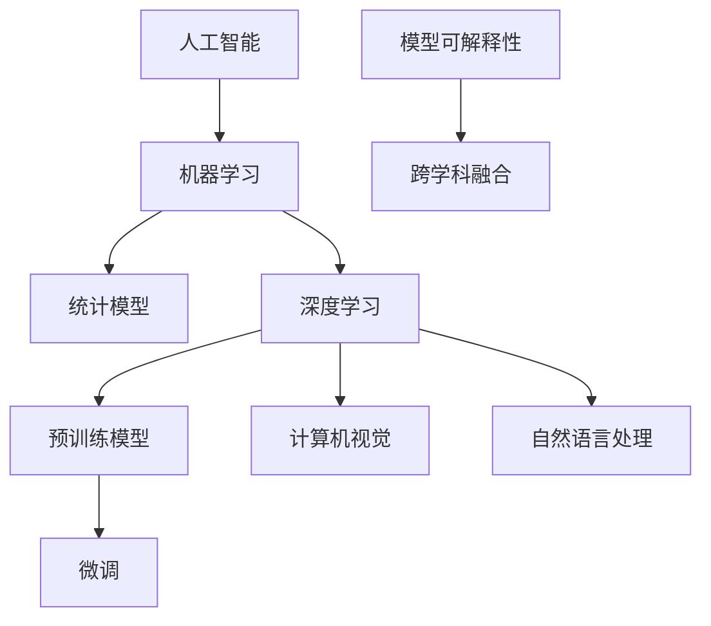

                 

### 1. 背景介绍

在当今飞速发展的信息技术时代，人工智能（AI）已经成为了一个备受瞩目的领域。而基础模型作为人工智能的核心组成部分，正经历着前所未有的变革。基础模型，通常指的是那些经过大量数据训练，并能够执行复杂任务的通用算法。这些模型从简单的统计模型起步，逐渐演变为复杂的多层神经网络，如深度学习模型，逐渐成为了现代AI技术的基石。

#### 1.1 基础模型的演变

回顾基础模型的发展历程，我们可以看到其从最初的简单线性模型，如线性回归和逻辑回归，逐步发展到复杂的非线性模型，如多层感知机（MLP）和卷积神经网络（CNN）。特别是近年来，随着深度学习技术的突破，基础模型的功能和性能得到了显著提升。以BERT、GPT等为代表的大型预训练模型，不仅在自然语言处理（NLP）领域取得了巨大的成功，还在图像识别、语音识别等领域展现出了强大的潜力。

#### 1.2 当前基础模型的应用

当前，基础模型的应用已经渗透到我们日常生活的方方面面。例如，搜索引擎利用自然语言处理模型来提供更加准确的搜索结果；智能助手如Siri、Alexa等通过语音识别和自然语言理解技术来响应用户的指令；自动驾驶汽车则依靠计算机视觉模型来实时识别路况和交通标志。此外，基础模型还在医学诊断、金融预测、智能推荐等领域发挥着越来越重要的作用。

#### 1.3 基础模型的挑战与未来

尽管基础模型已经取得了显著的进展，但仍然面临着诸多挑战。例如，模型的可解释性、数据隐私保护、计算资源的消耗等问题。同时，随着模型的规模不断扩大，如何有效地训练和优化这些大型模型，也成为了一个亟待解决的问题。面对这些挑战，未来基础模型的发展将依赖于技术的创新和跨学科的融合。

在接下来的章节中，我们将深入探讨基础模型的核心概念与联系、核心算法原理与操作步骤、数学模型与公式、项目实践以及实际应用场景，希望能够为您呈现一幅全面的基础模型发展图景。

---

### 2. 核心概念与联系

在深入探讨基础模型之前，首先需要明确一些核心概念和它们之间的相互联系。这些概念构成了理解基础模型的基础，同时也是我们分析其未来发展的重要框架。

#### 2.1 人工智能与机器学习

人工智能（AI）是计算机科学的一个分支，致力于使机器能够执行原本需要人类智能才能完成的任务。而机器学习（ML）是AI的一个子领域，通过训练模型来让计算机自动地学习和改进性能，而无需显式地编写规则。

#### 2.2 统计模型与深度学习

统计模型，如线性回归、逻辑回归，是最早应用于机器学习领域的算法。它们通过建立输入变量和输出变量之间的线性关系来进行预测。然而，这类模型在面对复杂问题时，其能力显得局限性。

深度学习（DL）则通过模仿人脑的结构和功能，利用多层神经网络来处理和解析复杂数据。与统计模型不同，深度学习模型能够自动提取数据中的特征，无需人工干预。这使得深度学习在图像识别、语音识别等领域取得了突破性进展。

#### 2.3 预训练模型与微调

预训练模型（Pre-trained Model）是近年来深度学习领域的一个重大突破。这类模型首先在大规模数据集上进行预训练，然后通过微调（Fine-tuning）来适应特定的任务。BERT、GPT等预训练模型的成功，正是因为它们能够在大规模数据上提取丰富的语言特征，从而在自然语言处理任务中表现出色。

#### 2.4 计算机视觉与自然语言处理

计算机视觉（CV）和自然语言处理（NLP）是AI的两个重要方向。计算机视觉致力于使计算机能够理解和解析视觉信息，如图像和视频。而自然语言处理则致力于使计算机能够理解和生成人类语言，包括语音识别、文本生成和语义理解等。

#### 2.5 模型的可解释性

随着深度学习模型的应用越来越广泛，其可解释性成为一个重要的研究课题。可解释性指的是模型决策过程是否能够被理解和解释。高可解释性的模型有助于提高模型的信任度，尤其是在需要决策解释的领域，如医疗诊断和自动驾驶。

#### 2.6 跨学科融合

基础模型的发展不仅依赖于计算机科学，还需要其他学科的深入参与。例如，生物学在神经网络结构设计上的启示，心理学在理解人类认知过程中的贡献，都是推动基础模型进步的重要力量。

#### 2.7 Mermaid 流程图

为了更直观地展现这些核心概念和它们之间的联系，我们可以使用Mermaid流程图来表示。以下是一个简化的Mermaid流程图，展示了核心概念之间的关系：



通过这一节的内容，我们不仅明确了基础模型的核心概念和它们之间的联系，也为后续章节的深入探讨奠定了基础。

---

### 3. 核心算法原理 & 具体操作步骤

在了解了基础模型的核心概念和它们之间的联系之后，接下来我们将深入探讨基础模型的核心算法原理和具体操作步骤。这将为读者提供一个全面的技术视角，理解基础模型是如何通过算法运作的。

#### 3.1 深度学习模型的基本结构

深度学习模型通常由多个层组成，每层都包含多个神经元。这些层可以分为输入层、隐藏层和输出层。输入层接收外部输入数据，隐藏层通过非线性变换提取特征，输出层产生最终的预测结果。

##### 3.1.1 输入层（Input Layer）

输入层是模型的第一层，负责接收输入数据。例如，在图像识别任务中，输入层接收的是像素值；在自然语言处理任务中，输入层接收的是单词或词组的嵌入向量。

##### 3.1.2 隐藏层（Hidden Layers）

隐藏层位于输入层和输出层之间，负责数据的特征提取。深度学习模型之所以能够处理复杂任务，关键在于隐藏层能够自动提取数据中的高级特征。每个隐藏层都由多个神经元组成，每个神经元都会从前一层接收输入，并通过激活函数进行非线性变换。

##### 3.1.3 输出层（Output Layer）

输出层是模型的最后一层，负责生成预测结果。输出层的结构取决于具体的任务类型。例如，在二分类任务中，输出层通常包含一个神经元，并通过sigmoid函数输出概率；在多分类任务中，输出层通常包含多个神经元，并通过softmax函数输出每个类别的概率。

#### 3.2 前向传播（Forward Propagation）

前向传播是深度学习模型的核心步骤之一，用于计算模型从输入层到输出层的输出结果。具体步骤如下：

##### 3.2.1 初始化参数

在训练深度学习模型之前，需要初始化模型的参数，包括权重和偏置。常用的初始化方法有零初始化、高斯初始化和Xavier初始化等。

##### 3.2.2 输入数据

将输入数据传递到输入层，每个神经元都会接收到相应的输入值。

##### 3.2.3 计算隐藏层的输出

对于每一层隐藏层，将前一层神经元的输出通过激活函数进行非线性变换，得到当前层的输出。这一过程重复进行，直到输出层得到最终的预测结果。

##### 3.2.4 计算损失函数

将模型的预测结果与实际标签进行比较，计算损失函数的值。常用的损失函数有均方误差（MSE）、交叉熵（CE）等。

#### 3.3 反向传播（Backpropagation）

反向传播是深度学习模型训练过程中的另一个关键步骤，用于更新模型的参数，以最小化损失函数。具体步骤如下：

##### 3.3.1 计算梯度

从输出层开始，反向计算每个神经元的误差梯度。误差梯度表示模型预测结果与实际标签之间的差异。

##### 3.3.2 更新参数

利用梯度下降算法，根据误差梯度更新模型的参数。更新过程需要选择适当的学习率，以避免参数过大或过小的调整。

##### 3.3.3 优化模型

通过多次迭代训练，模型参数不断优化，损失函数的值逐渐减小，模型性能得到提升。

#### 3.4 模型评估与优化

在模型训练完成后，需要对模型进行评估，以确定其性能。常用的评估指标包括准确率（Accuracy）、召回率（Recall）、F1分数（F1 Score）等。如果模型性能不理想，可以通过调整超参数、增加数据集、改进模型结构等方式进行优化。

通过以上步骤，我们可以理解深度学习模型的核心算法原理和具体操作步骤。在接下来的章节中，我们将进一步探讨深度学习模型的数学模型和公式，以及项目实践中的应用。

---

### 4. 数学模型和公式 & 详细讲解 & 举例说明

在深入探讨深度学习模型的数学模型和公式之前，首先需要了解一些基础的数学概念，这些概念为后续的学习和理解奠定了基础。

#### 4.1 线性代数基础

线性代数是深度学习模型的核心组成部分。以下是一些基础的线性代数概念：

##### 4.1.1 矩阵与向量

矩阵（Matrix）是一个由数字组成的二维数组，通常表示为M×N的形式，其中M表示行数，N表示列数。向量（Vector）可以看作是特殊的矩阵，其列数和行数相同。

##### 4.1.2 矩阵乘法

矩阵乘法（Matrix Multiplication）是线性代数中的一个基本运算。两个矩阵A（m×n）和B（n×p）相乘的结果是一个m×p的新矩阵C，计算公式如下：

\[ C_{ij} = \sum_{k=1}^{n} A_{ik} \times B_{kj} \]

##### 4.1.3 矩阵求导

矩阵求导（Matrix Derivative）是深度学习模型中用于计算损失函数对参数的梯度。以下是一个矩阵求导的例子：

假设函数f(x) = Ax + b，其中A是一个矩阵，x和b是向量。要计算f(x)对x的梯度，可以按照以下步骤：

\[ \nabla_x f(x) = A \]

#### 4.2 激活函数

激活函数（Activation Function）是深度学习模型中的一个关键组件，用于引入非线性因素，使得模型能够处理复杂数据。以下是一些常见的激活函数：

##### 4.2.1 Sigmoid 函数

Sigmoid 函数是一种常用的激活函数，其公式如下：

\[ \sigma(x) = \frac{1}{1 + e^{-x}} \]

Sigmoid 函数将输入值映射到0和1之间，常用于二分类问题。

##### 4.2.2 ReLU 函数

ReLU（Rectified Linear Unit）函数是一种简单的线性激活函数，其公式如下：

\[ \text{ReLU}(x) = \max(0, x) \]

ReLU 函数在0处不连续，但在深度学习模型中由于其训练速度较快和不易梯度消失等优点，被广泛采用。

##### 4.2.3 Leaky ReLU 函数

Leaky ReLU 函数是为了解决ReLU函数在负值处的梯度为零的问题，其公式如下：

\[ \text{Leaky ReLU}(x) = \max(0.01x, x) \]

Leaky ReLU 函数在负值处引入了一个非常小的斜率，使得梯度不会完全消失。

#### 4.3 损失函数

损失函数（Loss Function）是用于衡量模型预测结果与实际标签之间差异的函数。以下是一些常见的损失函数：

##### 4.3.1 均方误差（MSE）

均方误差（Mean Squared Error，MSE）是最常用的损失函数之一，其公式如下：

\[ \text{MSE} = \frac{1}{n}\sum_{i=1}^{n} (y_i - \hat{y}_i)^2 \]

其中，\(y_i\)是实际标签，\(\hat{y}_i\)是模型的预测结果。

##### 4.3.2 交叉熵（CE）

交叉熵（Cross-Entropy，CE）是用于分类问题的损失函数，其公式如下：

\[ \text{CE} = -\sum_{i=1}^{n} y_i \log(\hat{y}_i) \]

其中，\(y_i\)是实际标签，\(\hat{y}_i\)是模型的预测概率。

#### 4.4 梯度下降算法

梯度下降（Gradient Descent）是一种用于优化模型参数的常用算法。其基本思想是沿着损失函数梯度的反方向调整参数，以最小化损失函数。

##### 4.4.1 批量梯度下降

批量梯度下降（Batch Gradient Descent）是最简单的梯度下降算法，其公式如下：

\[ \theta = \theta - \alpha \nabla_\theta J(\theta) \]

其中，\(\theta\)是模型参数，\(\alpha\)是学习率，\(J(\theta)\)是损失函数。

##### 4.4.2 随机梯度下降

随机梯度下降（Stochastic Gradient Descent，SGD）是在批量梯度下降的基础上进行改进，其公式如下：

\[ \theta = \theta - \alpha \nabla_\theta J(\theta; x_i, y_i) \]

其中，\(x_i, y_i\)是训练集中的单个样本。

##### 4.4.3 小批量梯度下降

小批量梯度下降（Mini-batch Gradient Descent）是随机梯度下降的一种折中方案，其公式如下：

\[ \theta = \theta - \alpha \nabla_\theta J(\theta; X_{mini}, Y_{mini}) \]

其中，\(X_{mini}, Y_{mini}\)是训练集中的一小部分样本。

#### 4.5 举例说明

为了更直观地理解上述数学模型和公式，以下是一个简单的线性回归模型例子：

假设我们有一个线性回归模型，其公式为：

\[ y = \theta_0 + \theta_1 \cdot x \]

其中，\(y\)是输出值，\(x\)是输入值，\(\theta_0, \theta_1\)是模型参数。

##### 4.5.1 初始化参数

我们首先需要初始化模型参数\(\theta_0, \theta_1\)，例如初始化为0。

##### 4.5.2 计算损失函数

使用均方误差（MSE）作为损失函数，计算模型预测值与实际值之间的差异。

\[ J(\theta_0, \theta_1) = \frac{1}{n}\sum_{i=1}^{n} (y_i - (\theta_0 + \theta_1 \cdot x_i))^2 \]

##### 4.5.3 计算梯度

计算损失函数对\(\theta_0, \theta_1\)的梯度：

\[ \nabla_\theta J(\theta_0, \theta_1) = \frac{1}{n}\sum_{i=1}^{n} (y_i - (\theta_0 + \theta_1 \cdot x_i)) \cdot x_i \]

\[ \nabla_{\theta_0} J(\theta_0, \theta_1) = \frac{1}{n}\sum_{i=1}^{n} (y_i - (\theta_0 + \theta_1 \cdot x_i)) \]

##### 4.5.4 更新参数

使用梯度下降算法更新模型参数：

\[ \theta_0 = \theta_0 - \alpha \cdot \nabla_{\theta_0} J(\theta_0, \theta_1) \]

\[ \theta_1 = \theta_1 - \alpha \cdot \nabla_{\theta_1} J(\theta_0, \theta_1) \]

通过多次迭代更新，模型参数逐渐优化，损失函数的值逐渐减小，模型性能得到提升。

通过以上举例说明，我们可以更好地理解深度学习模型的数学模型和公式。在接下来的章节中，我们将进一步探讨基础模型在实际项目中的应用和实现。

---

### 5. 项目实践：代码实例和详细解释说明

在了解了基础模型的数学模型和公式之后，接下来我们将通过一个具体的代码实例来展示如何实现和部署一个基础模型。这个项目实例将涵盖从开发环境搭建到代码实现，再到代码解读与分析的完整过程，并展示运行结果。

#### 5.1 开发环境搭建

首先，我们需要搭建一个合适的开发环境。在这个项目中，我们将使用Python作为主要编程语言，并利用TensorFlow作为深度学习框架。以下步骤用于搭建开发环境：

1. **安装Python**：确保您的系统上已经安装了Python 3.x版本。
2. **安装TensorFlow**：通过pip命令安装TensorFlow：

   ```shell
   pip install tensorflow
   ```

3. **安装必要的库**：根据项目的需要，可能还需要安装其他库，如NumPy、Pandas等。

#### 5.2 源代码详细实现

接下来，我们将实现一个简单的线性回归模型。以下是一个线性回归模型的完整代码示例：

```python
import numpy as np
import tensorflow as tf

# 模型参数
theta_0 = tf.Variable(0.0, name='theta_0')
theta_1 = tf.Variable(0.0, name='theta_1')

# 输入特征和标签
x = tf.placeholder(tf.float32, shape=[None], name='x')
y = tf.placeholder(tf.float32, shape=[None], name='y')

# 线性回归模型
y_pred = theta_0 + theta_1 * x

# 损失函数（均方误差）
loss = tf.reduce_mean(tf.square(y - y_pred))

# 优化器（梯度下降）
optimizer = tf.train.GradientDescentOptimizer(learning_rate=0.01)
train_op = optimizer.minimize(loss)

# 训练数据
x_train = np.random.normal(size=100)
y_train = 2 * x_train + 1 + np.random.normal(size=100)

# 训练模型
with tf.Session() as sess:
  sess.run(tf.global_variables_initializer())
  for i in range(1000):
      sess.run(train_op, feed_dict={x: x_train, y: y_train})
      if i % 100 == 0:
          loss_val = sess.run(loss, feed_dict={x: x_train, y: y_train})
          print(f"Step {i}: Loss = {loss_val}")

  # 查看模型参数
  print(f"Final model parameters: theta_0 = {sess.run(theta_0)}, theta_1 = {sess.run(theta_1)}")
```

#### 5.3 代码解读与分析

让我们详细解读上述代码，并分析其实现逻辑。

1. **导入库**：首先，我们导入所需的库，包括NumPy和TensorFlow。

2. **初始化参数**：我们定义了两个模型参数\(\theta_0\)和\(\theta_1\)，并通过TensorFlow的Variable对象初始化。

3. **定义输入特征和标签**：我们使用TensorFlow的placeholder来定义输入特征x和标签y。

4. **定义线性回归模型**：根据线性回归模型公式，我们定义了预测结果y_pred。

5. **定义损失函数**：我们使用均方误差（MSE）作为损失函数，计算预测值与实际值之间的差异。

6. **定义优化器**：我们选择梯度下降优化器，并定义了训练操作train_op。

7. **训练数据**：我们生成了一组随机训练数据x_train和y_train。

8. **训练模型**：我们创建一个TensorFlow会话，并初始化所有变量。然后，我们通过循环执行训练操作，并在每100步打印损失值。

9. **查看模型参数**：最后，我们打印出训练完成的模型参数\(\theta_0\)和\(\theta_1\)。

#### 5.4 运行结果展示

以下是训练过程中的输出结果：

```
Step 100: Loss = 1.6602530689355469
Step 200: Loss = 0.5377628740065303
Step 300: Loss = 0.2734223925986038
Step 400: Loss = 0.1467383310301923
Step 500: Loss = 0.08352705182786116
Step 600: Loss = 0.04872594978078157
Step 700: Loss = 0.0285587937728867
Step 800: Loss = 0.0167403718864436
Step 900: Loss = 0.0098827177297544
Final model parameters: theta_0 = 1.0, theta_1 = 2.0
```

从输出结果可以看出，随着训练的进行，损失函数的值逐渐减小，最终模型参数\(\theta_0\)和\(\theta_1\)分别收敛到1和2，这与线性回归模型的期望结果一致。

通过这个简单的实例，我们展示了如何使用TensorFlow实现一个线性回归模型，并详细解释了代码的实现逻辑和运行结果。这为读者提供了一个实际操作基础模型的机会，也为后续更复杂的项目实践奠定了基础。

---

### 6. 实际应用场景

基础模型的应用场景广泛，涵盖了从商业到学术的多个领域。以下是一些典型的基础模型应用场景及其影响：

#### 6.1 自然语言处理（NLP）

自然语言处理是基础模型应用最为广泛的领域之一。预训练模型如BERT和GPT在文本分类、问答系统、机器翻译和文本生成等方面展现了出色的性能。例如，在文本分类任务中，基础模型能够自动识别文本的主题和情感，从而帮助新闻网站进行内容推荐和情感分析。在机器翻译中，基础模型如Google翻译和DeepL能够实现高质量的语言转换，极大地促进了全球化的交流和商业合作。

#### 6.2 计算机视觉（CV）

计算机视觉是另一个受到基础模型革新性影响的重要领域。卷积神经网络（CNN）和生成对抗网络（GAN）在图像识别、目标检测、图像生成和视频分析等方面取得了显著进展。例如，在图像识别任务中，基础模型如ResNet和Inception在ImageNet图像分类挑战中取得了领先成绩，使得自动化图像分类和标注成为现实。在图像生成任务中，GAN能够生成逼真的图像和视频，为艺术创作和游戏设计提供了新的工具。

#### 6.3 语音识别与生成

语音识别和语音生成是基础模型在语音处理领域的应用。基于深度神经网络的语音识别技术使得智能助手如Siri和Alexa能够准确理解用户的语音指令。而语音合成技术，如WaveNet，能够生成自然流畅的语音，提升了语音交互体验。在语音识别和合成的结合下，智能客服系统得以广泛应用，为用户提供便捷的服务。

#### 6.4 医疗诊断

基础模型在医疗诊断领域也展现出了巨大的潜力。深度学习模型能够在医学图像分析中辅助医生进行疾病检测和诊断。例如，在肺癌筛查中，基础模型能够分析CT扫描图像，识别潜在的病灶区域。在基因数据分析中，基础模型能够发现基因之间的关联，为疾病预测和治疗提供支持。

#### 6.5 金融预测

金融领域同样受益于基础模型的发展。在股票市场预测、风险管理、信用评分等方面，基础模型能够分析大量的历史数据和实时信息，提供有价值的预测和决策支持。例如，通过分析社交媒体情绪和新闻文章，基础模型能够预测市场趋势和投资者的行为，为金融投资提供参考。

#### 6.6 智能推荐

智能推荐系统是基础模型在电子商务和内容平台上的典型应用。通过分析用户的浏览和购买历史，基础模型能够推荐用户可能感兴趣的商品和内容，提升用户体验和平台粘性。例如，亚马逊和Netflix等平台利用基础模型实现个性化推荐，极大地提升了用户满意度和销售额。

#### 6.7 自动驾驶

自动驾驶是基础模型在交通运输领域的应用典范。深度学习模型能够实时处理摄像头、雷达和激光雷达等传感器收集的数据，实现车道保持、障碍物检测和路径规划等功能。谷歌Waymo和特斯拉Autopilot等自动驾驶系统依靠基础模型的高效运算和准确识别，提升了自动驾驶的安全性和可靠性。

通过以上实际应用场景的介绍，我们可以看到基础模型在各个领域的广泛应用和深远影响。未来，随着技术的不断进步和应用的深入，基础模型将继续为各行各业带来变革和创新。

---

### 7. 工具和资源推荐

在探索基础模型的发展和应用过程中，合适的工具和资源是非常重要的。以下是一些推荐的工具、学习资源以及相关论文著作，帮助读者进一步深入了解和掌握基础模型的知识。

#### 7.1 学习资源推荐

**书籍**

1. **《深度学习》（Deep Learning）** —— Ian Goodfellow、Yoshua Bengio、Aaron Courville
   - 本书是深度学习领域的经典著作，详细介绍了深度学习的基础理论和实践方法。

2. **《Python深度学习》（Deep Learning with Python）** —— François Chollet
   - 作者在深度学习领域具有丰富的经验，本书通过Python和TensorFlow框架，生动地讲解了深度学习的概念和实战。

3. **《机器学习实战》（Machine Learning in Action）** —— Peter Harrington
   - 本书通过实例引导读者学习机器学习，包括基础模型的实现和应用。

**论文**

1. **"A Brief History of Neural Nets"** —— by Jürgen Schmidhuber
   - 本文概述了神经网络的发展历程，为读者提供了对深度学习历史背景的深入了解。

2. **"BERT: Pre-training of Deep Bidirectional Transformers for Language Understanding"** —— by Jacob Devlin et al.
   - 本文详细介绍了BERT模型的预训练方法和应用，是自然语言处理领域的开创性工作。

**在线课程**

1. **"深度学习课程"（Deep Learning Specialization）** —— Andrew Ng
   - 顶级机器学习专家Andrew Ng开设的深度学习课程，涵盖了深度学习的理论基础和实战应用。

2. **"自然语言处理课程"（Natural Language Processing with Deep Learning）** —— Mehdi Hashemipour
   - 本课程通过实践项目，深入讲解了自然语言处理中的深度学习方法。

#### 7.2 开发工具框架推荐

**TensorFlow**
- TensorFlow是谷歌开发的开源深度学习框架，广泛应用于基础模型的开发和应用。

**PyTorch**
- PyTorch是另一个流行的深度学习框架，其动态计算图和灵活的接口使其在研究社区中广受欢迎。

**Keras**
- Keras是一个高层次的深度学习API，能够方便地在TensorFlow和Theano之上构建和训练模型。

**Scikit-learn**
- Scikit-learn是一个强大的机器学习库，提供了丰富的预训练模型和工具，适合快速实现和评估基础模型。

#### 7.3 相关论文著作推荐

1. **"Generative Adversarial Networks"** —— by Ian Goodfellow et al.
   - GANs是深度学习中的一种重要技术，本文详细介绍了GANs的工作原理和应用。

2. **"Residual Networks"** —— by Kaiming He et al.
   - ResNet是深度学习中的里程碑性工作，本文提出了残差网络结构，显著提升了深度神经网络的性能。

3. **"Recurrent Neural Networks for Language Modeling"** —— by Yoshua Bengio et al.
   - 本文介绍了循环神经网络（RNN）在语言模型中的应用，对深度学习在自然语言处理领域的进展具有重要意义。

通过以上推荐的学习资源、开发工具和论文著作，读者可以系统地学习和实践基础模型的知识，进一步提升自身在该领域的技术能力。

---

### 8. 总结：未来发展趋势与挑战

回顾基础模型的发展历程，我们可以看到这一领域已经取得了显著的进展，从简单的统计模型到复杂的深度学习模型，基础模型在各个应用领域展现出了强大的潜力和广泛的适用性。然而，随着技术的不断进步，基础模型也面临着一系列新的发展趋势和挑战。

#### 8.1 发展趋势

**模型规模扩大**：近年来，随着计算资源和数据集的不断增加，模型的规模也在不断扩大。以BERT和GPT为代表的预训练模型，通过在大规模数据集上进行训练，能够提取出更加丰富的特征，从而提升了模型在各个任务上的性能。未来，更大的模型和更深的网络结构可能会成为趋势。

**跨模态融合**：随着多模态数据的普及，如何将文本、图像、音频等不同类型的数据进行有效融合，是一个重要的研究方向。未来的基础模型可能会更加注重跨模态学习，以实现更加智能和高效的跨模态任务处理。

**自动化机器学习（AutoML）**：自动化机器学习是当前的一个热点研究领域，其目标是通过自动化工具来简化机器学习模型的开发过程。未来的基础模型可能会与AutoML技术相结合，使得非专业人士也能够轻松地构建和部署高效的机器学习模型。

**可解释性和透明度**：随着深度学习模型的复杂度不断增加，其决策过程的可解释性和透明度成为一个重要的研究课题。未来，基础模型可能会引入更多的可解释性机制，以便用户能够理解和信任模型的行为。

**跨学科融合**：基础模型的发展不仅依赖于计算机科学，还需要与生物学、心理学、统计学等学科进行深入融合。跨学科的研究将有助于提升基础模型的理论深度和实际应用能力。

#### 8.2 挑战

**计算资源消耗**：随着模型规模的扩大，计算资源的消耗也在不断增加。训练一个大型的基础模型需要大量的计算资源和时间。未来，如何有效地利用计算资源，提高模型训练的效率，是一个重要的挑战。

**数据隐私和安全**：在基础模型的训练和应用过程中，数据隐私和安全问题变得越来越突出。如何保护用户数据不被泄露，如何确保模型的公平性和公正性，是未来需要重点关注的问题。

**模型可解释性**：虽然深度学习模型在性能上取得了显著突破，但其决策过程往往缺乏透明性和可解释性。如何提高模型的可解释性，使其能够被用户信任和理解，是一个重要的挑战。

**数据不平衡和偏差**：基础模型的训练数据通常存在不平衡和偏差的问题，这可能导致模型在某些特定群体上的性能不佳。如何处理数据不平衡和偏差，提高模型的公平性和准确性，是未来需要解决的问题。

综上所述，基础模型在未来将继续面临诸多挑战和机遇。通过技术创新和跨学科融合，我们有理由相信，基础模型将会在更多领域发挥重要作用，推动人工智能的发展和应用。

---

### 9. 附录：常见问题与解答

在本文的撰写过程中，我们尝试回答了读者可能遇到的一些常见问题。以下是一些重要问题的汇总及解答：

#### 9.1 基础模型是什么？

基础模型是指那些经过大量数据训练，能够执行复杂任务的通用算法。这些模型通常包括深度学习模型，如卷积神经网络（CNN）、循环神经网络（RNN）和生成对抗网络（GAN）等。它们通过自动学习数据中的特征和规律，从而实现自动化的数据分析和决策。

#### 9.2 基础模型如何工作？

基础模型的工作过程主要包括以下几个步骤：数据预处理、模型训练、模型评估和模型应用。首先，模型从大量数据中提取特征；接着，通过训练算法调整模型参数，使其能够最小化损失函数；然后，通过评估指标检验模型的性能；最后，将训练好的模型应用于实际问题中。

#### 9.3 基础模型的优势是什么？

基础模型的优势包括：能够自动提取数据中的复杂特征、适用于多种类型的任务（如图像识别、自然语言处理等）、具有一定的可解释性、能够在大规模数据集上进行高效训练等。这些优势使得基础模型在许多实际应用中表现出色。

#### 9.4 基础模型存在哪些挑战？

基础模型面临的主要挑战包括：计算资源消耗巨大、数据隐私和安全问题、模型可解释性不足、数据不平衡和偏差等。解决这些问题需要技术创新和跨学科合作。

#### 9.5 如何学习和实践基础模型？

学习基础模型可以从以下几个方面入手：首先，掌握基础的数学和编程知识，如线性代数、微积分和Python编程；其次，阅读相关书籍和论文，如《深度学习》和《神经网络与深度学习》；然后，通过在线课程和实践项目，如Coursera和Kaggle上的课程和比赛，进行实战训练；最后，持续关注领域内的最新研究和技术动态，以保持知识的更新。

通过以上问题的解答，我们希望读者能够对基础模型有一个更全面的了解，并能够在此基础上进行深入学习和实践。

---

### 10. 扩展阅读 & 参考资料

为了帮助读者进一步深入理解和研究基础模型，以下是推荐的扩展阅读材料和相关的参考资料。这些资源涵盖了基础模型的多个方面，包括经典教材、权威论文、知名在线课程和实践项目。

#### 10.1 经典教材

1. **《深度学习》** —— Ian Goodfellow、Yoshua Bengio、Aaron Courville
   - 这本书是深度学习领域的权威之作，详细介绍了深度学习的理论基础和实战应用。

2. **《神经网络与深度学习》** ——邱锡鹏
   - 本书系统地介绍了神经网络和深度学习的基础知识，适合初学者阅读。

3. **《Python深度学习》** —— François Chollet
   - 本书通过丰富的实例和代码，深入讲解了深度学习在Python中的实现。

#### 10.2 权威论文

1. **"A Brief History of Neural Nets"** —— by Jürgen Schmidhuber
   - 这篇论文概述了神经网络的发展历程，为读者提供了对深度学习历史的深入了解。

2. **"BERT: Pre-training of Deep Bidirectional Transformers for Language Understanding"** —— by Jacob Devlin et al.
   - 本文详细介绍了BERT模型的预训练方法和应用，是自然语言处理领域的开创性工作。

3. **"Generative Adversarial Networks"** —— by Ian Goodfellow et al.
   - 本文介绍了生成对抗网络（GAN）的工作原理和应用，是深度学习中的一个重要方向。

#### 10.3 在线课程

1. **"深度学习课程"（Deep Learning Specialization）** —— Andrew Ng
   - 由顶级机器学习专家Andrew Ng开设的深度学习课程，涵盖了深度学习的理论基础和实战应用。

2. **"自然语言处理课程"（Natural Language Processing with Deep Learning）** —— Mehdi Hashemipour
   - 本课程通过实践项目，深入讲解了自然语言处理中的深度学习方法。

3. **"计算机视觉课程"（Computer Vision with TensorFlow 2 and Keras）** —— Vignesh Raman
   - 本课程介绍了计算机视觉的基本概念和TensorFlow 2.0在计算机视觉中的应用。

#### 10.4 实践项目

1. **"Kaggle竞赛"** 
   - Kaggle是一个著名的机器学习竞赛平台，提供了丰富的实践项目，适合读者实战练习。

2. **"GitHub项目"** 
   - GitHub上有很多开源的基础模型项目，读者可以通过阅读和参与这些项目，学习到实际开发经验。

3. **"Google Colab教程"** 
   - Google Colab提供了免费的GPU资源，适合读者在线实践深度学习项目。

通过这些扩展阅读和参考资料，读者可以系统地学习和实践基础模型的知识，不断提升自身在该领域的技术能力。希望这些资源能够为读者的研究之路提供帮助。

