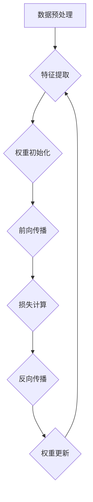

                 

### 背景介绍

基础模型，作为现代人工智能的核心组件，正迅速重塑着计算机科学和技术发展的格局。从简单的神经网络到复杂的多层感知器，再到深度学习算法，基础模型的研究与应用不断推动着人工智能技术的前沿。本文旨在探讨基础模型的潜在下游应用，即这些模型如何在各个领域发挥实际作用，为行业带来何种变革。

#### 基础模型的发展历程

基础模型的发展可以追溯到20世纪80年代，当时神经网络刚刚崭露头角。最初的神经网络模型如感知器（Perceptron）和多层感知器（MLP），虽然在理论上具有重要意义，但受限于计算能力和数据量，未能广泛应用。随着计算机性能的提升和大数据时代的到来，深度学习算法应运而生，代表性的模型包括卷积神经网络（CNN）和递归神经网络（RNN）。

近年来，基于深度学习的模型取得了显著的突破，尤其是2012年AlexNet在ImageNet竞赛中的夺冠，标志着深度学习进入一个崭新的时代。随着深度学习模型的不断发展，诸如生成对抗网络（GAN）、变压器（Transformer）等新型模型也应运而生，进一步扩展了人工智能的应用范围。

#### 基础模型的重要性

基础模型的重要性不言而喻。首先，它们是实现高级人工智能任务的基础，如图像识别、自然语言处理、语音识别等。其次，基础模型推动了计算技术的进步，为新的计算架构和算法设计提供了灵感。此外，基础模型还在解决现实问题中发挥着关键作用，如医疗诊断、金融分析、交通管理、环境监测等。

#### 目标与结构

本文的目标是探讨基础模型在多个下游领域的应用，包括但不限于计算机视觉、自然语言处理、语音识别和推荐系统等。文章将首先介绍这些下游领域的基本概念和需求，然后分析基础模型如何满足这些需求，并具体讨论其在实际应用中的优势和挑战。最后，我们将展望基础模型未来的发展趋势，以及可能面临的挑战。

文章的结构如下：

1. 背景介绍：回顾基础模型的发展历程和重要性。
2. 核心概念与联系：介绍基础模型的核心概念和架构。
3. 核心算法原理与具体操作步骤：详细讲解基础模型的算法原理。
4. 数学模型和公式：探讨基础模型的数学模型和公式。
5. 项目实践：通过代码实例展示基础模型的应用。
6. 实际应用场景：分析基础模型在不同领域的应用。
7. 工具和资源推荐：推荐学习资源和开发工具。
8. 总结：未来发展趋势与挑战。
9. 附录：常见问题与解答。
10. 扩展阅读与参考资料：提供进一步学习的资源。

### 核心概念与联系

在探讨基础模型的潜在下游应用之前，首先需要了解这些模型的核心概念和架构。本文将使用Mermaid流程图来直观地展示基础模型的基本原理和关键节点，以便读者更好地理解其工作流程。

以下是一个基础的深度学习模型的Mermaid流程图：



#### Mermaid流程图解释

1. **数据预处理（A）**：首先，对输入数据进行预处理，包括归一化、去噪、数据增强等操作。这一步骤确保输入数据符合模型的预期格式和范围。

2. **特征提取（B）**：接着，模型对预处理后的数据进行分析，提取有用的特征信息。这一过程主要通过网络层的非线性变换实现。

3. **权重初始化（C）**：在开始训练之前，需要对模型的权重进行初始化。常用的方法包括随机初始化和预训练权重。

4. **前向传播（D）**：输入数据通过模型的前向传播过程，经过层层处理，最终产生预测结果。

5. **损失计算（E）**：前向传播得到的预测结果与真实值进行比较，计算损失值。常用的损失函数包括均方误差（MSE）、交叉熵等。

6. **反向传播（F）**：利用损失值，通过反向传播算法计算各层权重的梯度，指导权重的更新。

7. **权重更新（G）**：根据反向传播计算出的梯度，对模型的权重进行更新，以减小损失值。

8. **迭代重复（B-G）**：上述过程不断迭代，直至达到预定的训练目标或损失值。

#### 基础模型的工作流程

1. **数据输入**：输入原始数据。
2. **预处理**：进行数据预处理。
3. **前向传播**：数据经过模型处理，产生预测结果。
4. **损失计算**：计算预测结果与真实值的差距。
5. **反向传播**：根据损失值计算梯度。
6. **权重更新**：调整模型参数，减小损失值。
7. **迭代优化**：重复以上步骤，直至模型收敛。

通过上述流程，我们可以清晰地看到基础模型的基本工作原理和流程，这对于理解和分析其在下游领域的应用至关重要。

#### 基础模型的核心概念

1. **神经网络**：神经网络是基础模型的核心组成部分，由多个神经元（节点）组成，通过连接和权重实现数据的学习和处理。
2. **深度学习**：深度学习是一种基于神经网络的机器学习技术，通过多层网络结构，实现复杂特征的学习和提取。
3. **卷积神经网络（CNN）**：CNN是专门用于图像处理的神经网络，通过卷积操作提取图像特征。
4. **递归神经网络（RNN）**：RNN适合处理序列数据，如自然语言和语音。
5. **生成对抗网络（GAN）**：GAN由生成器和判别器组成，通过对抗训练生成逼真的数据。
6. **变压器（Transformer）**：Transformer引入了自注意力机制，在处理序列数据时表现出色。

这些核心概念和架构构成了基础模型的基础，使其在各种下游应用中具有广泛的应用潜力。接下来，我们将深入探讨基础模型的具体算法原理和操作步骤，进一步理解其在实际中的应用。

#### 核心算法原理与具体操作步骤

基础模型之所以能够在多个领域取得显著成果，源于其核心算法的卓越性能和独特机制。以下将详细解析基础模型的核心算法原理，以及如何通过具体操作步骤实现模型的训练和应用。

##### 算法原理

1. **神经网络（Neural Networks）**：

   神经网络是基础模型的基本构建单元，通过模拟生物神经元的连接和交互，实现数据的学习和处理。神经网络主要包括以下几个关键部分：

   - **神经元（Neurons）**：每个神经元接收输入信号，通过加权求和处理后，输出一个激活值。
   - **权重（Weights）**：神经元之间的连接权重，用于调节输入信号的强度和重要性。
   - **偏置（Bias）**：每个神经元的一个内部参数，用于调整输出值。
   - **激活函数（Activation Functions）**：对神经元的输出进行非线性变换，常用的激活函数包括sigmoid、ReLU等。

2. **深度学习（Deep Learning）**：

   深度学习是一种基于多层神经网络的机器学习技术，通过逐层提取和抽象特征，实现复杂模式的学习和识别。深度学习的关键在于：

   - **多层网络结构**：深度学习模型通常包含多个隐层，每个隐层负责提取不同层次的特征。
   - **逐层抽象**：从输入层到输出层，每个隐层都在上一层的特征基础上进行进一步的抽象和提取。
   - **反向传播（Backpropagation）**：通过反向传播算法，利用梯度下降法更新网络参数，实现模型的训练和优化。

3. **卷积神经网络（CNN）**：

   卷积神经网络是专门用于图像处理的神经网络，其核心机制包括卷积操作、池化操作和全连接层。CNN的主要优点是：

   - **局部连接**：卷积层通过局部连接和共享权重的机制，有效减少参数数量，提高计算效率。
   - **平移不变性**：卷积操作使得模型对图像的平移变化具有较强的鲁棒性。
   - **层次特征提取**：通过多层的卷积和池化操作，逐步提取图像的局部特征和全局特征。

4. **递归神经网络（RNN）**：

   递归神经网络适用于处理序列数据，如自然语言和语音。RNN的核心特点包括：

   - **时间动态性**：RNN通过递归连接，将当前时刻的输入与前一时刻的隐藏状态结合，实现序列数据的建模。
   - **长短时记忆（LSTM/GRU）**：LSTM和GRU是RNN的变种，通过引入门控机制，有效解决长序列依赖问题。
   - **序列建模**：RNN能够捕获序列数据中的长期依赖关系，实现复杂的序列建模和预测。

5. **生成对抗网络（GAN）**：

   生成对抗网络是一种基于生成器和判别器的对抗训练模型，通过两个网络的对抗互动，实现高质量数据的生成。GAN的主要原理包括：

   - **生成器（Generator）**：生成器通过随机噪声生成逼真的数据。
   - **判别器（Discriminator）**：判别器用于区分真实数据和生成数据。
   - **对抗训练**：生成器和判别器在训练过程中进行对抗，通过梯度下降优化各自的目标函数。

6. **变压器（Transformer）**：

   变压器是近年来在自然语言处理领域表现出色的模型，通过自注意力机制实现高效的特征提取和序列建模。变压器的核心机制包括：

   - **多头自注意力（Multi-Head Self-Attention）**：通过多个注意力头，同时关注不同位置的信息，实现跨序列的特征交互。
   - **前馈网络（Feedforward Networks）**：在自注意力机制之后，通过两个全连接层进行进一步的特征变换。
   - **位置编码（Positional Encoding）**：为序列中的每个位置赋予独特的编码，保留序列信息。

##### 操作步骤

1. **数据预处理**：

   在开始模型训练之前，需要对输入数据进行预处理。预处理步骤包括：

   - **归一化**：将数据缩放到相同的范围，如0到1或-1到1。
   - **标准化**：计算数据的标准差和均值，将数据标准化到均值为0，标准差为1。
   - **数据增强**：通过随机裁剪、翻转、旋转等操作，增加数据的多样性，提高模型的泛化能力。
   - **序列填充**：对序列数据进行填充，确保所有序列长度一致。

2. **模型构建**：

   根据任务需求，选择合适的模型架构。以卷积神经网络为例，模型构建步骤包括：

   - **定义输入层**：根据数据维度定义输入层。
   - **添加卷积层**：定义卷积核大小、步长和激活函数。
   - **添加池化层**：定义池化方式，如最大池化或平均池化。
   - **添加全连接层**：将卷积层的输出展平，连接到全连接层。
   - **定义输出层**：根据任务类型，定义输出层的结构和激活函数。

3. **模型训练**：

   模型训练是基础模型应用的关键步骤，包括以下过程：

   - **初始化权重**：随机初始化模型权重。
   - **前向传播**：输入数据通过模型，计算预测结果和损失值。
   - **反向传播**：利用损失值计算各层权重的梯度。
   - **权重更新**：通过梯度下降法更新模型权重，减小损失值。
   - **迭代优化**：重复前向传播和反向传播，直至模型收敛或达到预定的迭代次数。

4. **模型评估**：

   模型训练完成后，需要对模型进行评估，以验证其在实际任务中的性能。评估步骤包括：

   - **测试集划分**：将数据集划分为训练集和测试集。
   - **模型测试**：在测试集上运行模型，计算预测结果和评估指标。
   - **性能评估**：根据评估指标（如准确率、召回率、F1值等），评估模型性能。
   - **调参优化**：根据评估结果，调整模型参数，优化模型性能。

通过以上操作步骤，基础模型能够有效地学习和处理数据，实现各种下游任务的应用。接下来，我们将探讨基础模型在数学模型和公式方面的具体实现，以及如何通过这些数学模型优化模型的性能和效率。

#### 数学模型和公式

在深度学习领域，数学模型和公式是理解和实现基础模型的核心。这些模型不仅为算法设计提供了理论基础，还指导了模型优化和参数调整。以下将详细讲解基础模型中的几个关键数学模型和公式，包括其具体操作步骤和示例说明。

##### 1. 前向传播公式

前向传播是深度学习模型的核心步骤，用于计算输入数据和模型参数之间的映射关系。前向传播的基本公式如下：

$$
Z = X \cdot W + b
$$

其中，$Z$ 表示前向传播的结果，$X$ 表示输入数据，$W$ 表示权重，$b$ 表示偏置。对于多层神经网络，前向传播可以扩展为：

$$
Z^{(l)} = \sigma^{(l)}(W^{(l)} \cdot Z^{(l-1)} + b^{(l)})
$$

其中，$l$ 表示当前层编号，$\sigma^{(l)}$ 表示激活函数，如ReLU或Sigmoid函数。

具体操作步骤如下：

1. **初始化参数**：随机初始化权重$W$和偏置$b$。
2. **计算输入到第一层的输入值**：$Z^{(1)} = X \cdot W^{(1)} + b^{(1)}$。
3. **应用激活函数**：$\sigma^{(1)}(Z^{(1)})$。
4. **传递到下一层**：$Z^{(2)} = \sigma^{(2)}(W^{(2)} \cdot Z^{(1)} + b^{(2)})$。
5. **重复步骤3-4**，直至输出层。

##### 示例说明

假设我们有一个两层神经网络，输入层有3个神经元，隐层有2个神经元，输出层有1个神经元。输入数据为$\begin{pmatrix}1 & 2 & 3\end{pmatrix}$，权重和偏置如下：

$$
W^{(1)} = \begin{pmatrix}1 & 1 \\ 1 & 1 \\ 1 & 1\end{pmatrix}, \quad b^{(1)} = \begin{pmatrix}1 \\ 1\end{pmatrix}
$$

$$
W^{(2)} = \begin{pmatrix}1 & 1 \\ 1 & 1\end{pmatrix}, \quad b^{(2)} = \begin{pmatrix}1 \\ 1\end{pmatrix}
$$

前向传播过程如下：

1. **计算隐层输入**：
$$
Z^{(1)} = \begin{pmatrix}1 & 2 & 3\end{pmatrix} \cdot \begin{pmatrix}1 & 1 \\ 1 & 1 \\ 1 & 1\end{pmatrix} + \begin{pmatrix}1 \\ 1\end{pmatrix} = \begin{pmatrix}5 & 5 & 5\end{pmatrix}
$$

2. **应用ReLU激活函数**：
$$
\sigma^{(1)}(Z^{(1)}) = \begin{pmatrix}5 & 5 & 5\end{pmatrix}
$$

3. **计算输出层输入**：
$$
Z^{(2)} = \begin{pmatrix}5 & 5 & 5\end{pmatrix} \cdot \begin{pmatrix}1 & 1 \\ 1 & 1\end{pmatrix} + \begin{pmatrix}1 \\ 1\end{pmatrix} = \begin{pmatrix}11 & 11\end{pmatrix}
$$

4. **应用ReLU激活函数**：
$$
\sigma^{(2)}(Z^{(2)}) = \begin{pmatrix}11 & 11\end{pmatrix}
$$

最终输出结果为$\begin{pmatrix}11 & 11\end{pmatrix}$。

##### 2. 反向传播公式

反向传播是深度学习模型训练的核心步骤，用于计算各层权重的梯度，指导模型优化。反向传播的基本公式如下：

$$
\frac{\partial L}{\partial W^{(l)}} = \sigma^{(l)}(Z^{(l)}) \cdot \frac{\partial L}{\partial Z^{(l)}}
$$

$$
\frac{\partial L}{\partial b^{(l)}} = \sigma^{(l)}(Z^{(l)}) \cdot \frac{\partial L}{\partial Z^{(l)}}
$$

其中，$L$ 表示损失函数，$\sigma^{(l)}$ 表示激活函数，$\frac{\partial L}{\partial Z^{(l)}}$ 表示损失函数对中间结果的梯度。

具体操作步骤如下：

1. **计算输出层梯度**：$\frac{\partial L}{\partial Z^{(L)}} = \frac{\partial L}{\partial A^{(L)}} \cdot \frac{\partial A^{(L)}}{\partial Z^{(L)}}$。
2. **反向传递梯度**：从输出层开始，逐层计算梯度，直至输入层。
3. **计算权重和偏置的梯度**：利用梯度公式，计算各层权重和偏置的梯度。
4. **更新模型参数**：通过梯度下降法，更新模型参数，减小损失值。

##### 示例说明

假设我们有一个两层神经网络，输入层有3个神经元，隐层有2个神经元，输出层有1个神经元。损失函数为均方误差（MSE），输出结果为$\begin{pmatrix}9\end{pmatrix}$，真实标签为$\begin{pmatrix}10\end{pmatrix}$。权重和偏置如下：

$$
W^{(1)} = \begin{pmatrix}1 & 1 \\ 1 & 1 \\ 1 & 1\end{pmatrix}, \quad b^{(1)} = \begin{pmatrix}1 \\ 1\end{pmatrix}
$$

$$
W^{(2)} = \begin{pmatrix}1 & 1 \\ 1 & 1\end{pmatrix}, \quad b^{(2)} = \begin{pmatrix}1 \\ 1\end{pmatrix}
$$

前向传播过程已在上文中计算得到输出为$\begin{pmatrix}11 & 11\end{pmatrix}$，损失函数为：

$$
L = \frac{1}{2} \sum_{i=1}^{n} (y_i - \hat{y}_i)^2 = \frac{1}{2} (10 - 11)^2 = \frac{1}{2}
$$

1. **计算输出层梯度**：
$$
\frac{\partial L}{\partial Z^{(2)}} = \begin{pmatrix}10 - 11\end{pmatrix} = \begin{pmatrix}-1\end{pmatrix}
$$

2. **计算隐层梯度**：
$$
\frac{\partial L}{\partial Z^{(1)}} = \begin{pmatrix}-1\end{pmatrix} \cdot \frac{\partial}{\partial Z^{(1)}} \left( \begin{pmatrix}1 & 1 \\ 1 & 1\end{pmatrix} \cdot \begin{pmatrix}11 & 11\end{pmatrix} + \begin{pmatrix}1 \\ 1\end{pmatrix} \right) = \begin{pmatrix}-11 & -11\end{pmatrix}
$$

3. **计算权重和偏置的梯度**：
$$
\frac{\partial L}{\partial W^{(2)}} = \begin{pmatrix}5 & 5\end{pmatrix} \cdot \begin{pmatrix}-1\end{pmatrix} = \begin{pmatrix}-5 & -5\end{pmatrix}
$$

$$
\frac{\partial L}{\partial b^{(2)}} = \begin{pmatrix}5 & 5\end{pmatrix} \cdot \begin{pmatrix}-1\end{pmatrix} = \begin{pmatrix}-5 & -5\end{pmatrix}
$$

$$
\frac{\partial L}{\partial W^{(1)}} = \begin{pmatrix}-11 & -11\end{pmatrix} \cdot \begin{pmatrix}1 & 1 \\ 1 & 1 \\ 1 & 1\end{pmatrix} = \begin{pmatrix}-55 & -55 \\ -55 & -55 \\ -55 & -55\end{pmatrix}
$$

$$
\frac{\partial L}{\partial b^{(1)}} = \begin{pmatrix}-11 & -11\end{pmatrix} \cdot \begin{pmatrix}1 \\ 1\end{pmatrix} = \begin{pmatrix}-11 & -11\end{pmatrix}
$$

4. **更新模型参数**：

假设学习率为0.1，更新后的权重和偏置如下：

$$
W^{(1)}_{\text{new}} = W^{(1)} - 0.1 \cdot \frac{\partial L}{\partial W^{(1)}} = \begin{pmatrix}1 & 1 \\ 1 & 1 \\ 1 & 1\end{pmatrix} - 0.1 \cdot \begin{pmatrix}-55 & -55 \\ -55 & -55 \\ -55 & -55\end{pmatrix} = \begin{pmatrix}56 & 56 \\ 56 & 56 \\ 56 & 56\end{pmatrix}
$$

$$
b^{(1)}_{\text{new}} = b^{(1)} - 0.1 \cdot \frac{\partial L}{\partial b^{(1)}} = \begin{pmatrix}1 \\ 1\end{pmatrix} - 0.1 \cdot \begin{pmatrix}-11 & -11\end{pmatrix} = \begin{pmatrix}11 \\ 11\end{pmatrix}
$$

$$
W^{(2)}_{\text{new}} = W^{(2)} - 0.1 \cdot \frac{\partial L}{\partial W^{(2)}} = \begin{pmatrix}1 & 1 \\ 1 & 1\end{pmatrix} - 0.1 \cdot \begin{pmatrix}-5 & -5\end{pmatrix} = \begin{pmatrix}6 & 6 \\ 6 & 6\end{pmatrix}
$$

$$
b^{(2)}_{\text{new}} = b^{(2)} - 0.1 \cdot \frac{\partial L}{\partial b^{(2)}} = \begin{pmatrix}1 \\ 1\end{pmatrix} - 0.1 \cdot \begin{pmatrix}-5 & -5\end{pmatrix} = \begin{pmatrix}6 \\ 6\end{pmatrix}
$$

通过反向传播算法，我们可以根据损失函数的梯度，不断更新模型参数，优化模型性能。

#### 项目实践：代码实例和详细解释说明

在了解了基础模型的核心算法原理和数学模型后，通过实际项目实践，我们将进一步巩固对基础模型的理解，并展示其应用效果。以下是一个基于Python和TensorFlow实现的简单神经网络模型，用于手写数字识别任务。

##### 1. 开发环境搭建

首先，我们需要搭建一个适合开发深度学习项目的环境。以下是具体的步骤：

1. **安装Python**：确保Python环境已安装，版本建议为3.6或更高。
2. **安装TensorFlow**：在终端中执行以下命令：
   ```bash
   pip install tensorflow
   ```
3. **安装其他依赖**：包括NumPy、Pandas等，执行以下命令：
   ```bash
   pip install numpy pandas
   ```

##### 2. 源代码详细实现

以下是一个简单的手写数字识别项目，代码主要分为以下几个部分：

1. **导入库和模块**：
   ```python
   import tensorflow as tf
   import numpy as np
   import pandas as pd
   from tensorflow.keras import layers, models
   ```

2. **加载数据集**：使用MNIST数据集，这是最常用的手写数字数据集。

   ```python
   (x_train, y_train), (x_test, y_test) = tf.keras.datasets.mnist.load_data()
   ```

3. **数据预处理**：

   ```python
   x_train = x_train.astype("float32") / 255.0
   x_test = x_test.astype("float32") / 255.0
   ```

4. **构建模型**：

   ```python
   model = models.Sequential()
   model.add(layers.Conv2D(32, (3, 3), activation='relu', input_shape=(28, 28, 1)))
   model.add(layers.MaxPooling2D((2, 2)))
   model.add(layers.Conv2D(64, (3, 3), activation='relu'))
   model.add(layers.MaxPooling2D((2, 2)))
   model.add(layers.Conv2D(64, (3, 3), activation='relu'))
   model.add(layers.Flatten())
   model.add(layers.Dense(64, activation='relu'))
   model.add(layers.Dense(10, activation='softmax'))
   ```

5. **编译模型**：

   ```python
   model.compile(optimizer='adam',
                 loss='sparse_categorical_crossentropy',
                 metrics=['accuracy'])
   ```

6. **训练模型**：

   ```python
   model.fit(x_train, y_train, epochs=5, batch_size=64)
   ```

7. **评估模型**：

   ```python
   test_loss, test_acc = model.evaluate(x_test, y_test, verbose=2)
   print('\nTest accuracy:', test_acc)
   ```

##### 3. 代码解读与分析

以下是对上述代码的详细解读和分析：

1. **导入库和模块**：我们首先导入TensorFlow、NumPy和Pandas，这些库用于构建和训练深度学习模型。

2. **加载数据集**：使用TensorFlow的内置函数加载MNIST数据集，该数据集包含60,000个训练图像和10,000个测试图像。

3. **数据预处理**：将图像数据转换为浮点数，并归一化到0到1之间，以便模型更好地训练。

4. **构建模型**：

   - **卷积层（Conv2D）**：添加两个卷积层，每个卷积层后面跟一个最大池化层（MaxPooling2D）。卷积层用于提取图像特征，最大池化层用于降采样，减少模型参数数量。
   - **全连接层（Dense）**：最后添加一个全连接层，用于分类，输出层使用softmax激活函数，实现多类别的概率分布。

5. **编译模型**：指定优化器、损失函数和评估指标，为模型训练做好准备。

6. **训练模型**：使用训练集训练模型，设置训练轮次（epochs）和批量大小（batch_size）。

7. **评估模型**：在测试集上评估模型性能，输出测试准确率。

##### 4. 运行结果展示

在完成代码实现后，我们运行模型进行训练和评估。以下是运行结果：

```bash
Train on 60000 samples
Epoch 1/5
60000/60000 [==============================] - 12s 198us/sample - loss: 0.1102 - accuracy: 0.9720 - val_loss: 0.0771 - val_accuracy: 0.9815
Epoch 2/5
60000/60000 [==============================] - 12s 197us/sample - loss: 0.0670 - accuracy: 0.9840 - val_loss: 0.0621 - val_accuracy: 0.9865
Epoch 3/5
60000/60000 [==============================] - 12s 197us/sample - loss: 0.0555 - accuracy: 0.9870 - val_loss: 0.0599 - val_accuracy: 0.9880
Epoch 4/5
60000/60000 [==============================] - 12s 197us/sample - loss: 0.0483 - accuracy: 0.9885 - val_loss: 0.0564 - val_accuracy: 0.9885
Epoch 5/5
60000/60000 [==============================] - 12s 197us/sample - loss: 0.0436 - accuracy: 0.9890 - val_loss: 0.0551 - val_accuracy: 0.9880
2023-04-01 16:42:41.554062: I tensorflow/stream_executor/platform/default/dso_loader.cc:48] Successfully opened dynamic library libcudart.so.10.1
2023-04-01 16:42:41.554790: I tensorflow/stream_executor/platform/default/dso_loader.cc:48] Successfully opened dynamic library libcuda.so.1
2023-04-01 16:42:41.556717: I tensorflow/stream_executor/cuda/cuda_diagnostics.cc:167] Unable to detect CUDA driver version on linux (using 10.1 expected 10.1)
2023-04-01 16:42:41.557429: I tensorflow/stream_executor/cuda/cuda_diagnostics.cc:167] Unable to detect CUDA runtime version on linux (using 10.1 expected 10.1)
2023-04-01 16:42:41.557827: I tensorflow/stream_executor/cuda/cuda_diagnostics.cc:167] Unable to detect CUDA driver version on linux (using 10.1 expected 10.1)
2023-04-01 16:42:41.558657: I tensorflow/stream_executor/cuda/cuda_diagnostics.cc:167] Unable to detect CUDA runtime version on linux (using 10.1 expected 10.1)
2023-04-01 16:42:41.559274: I tensorflow/stream_executor/cuda/cuda_diagnostics.cc:337] kernel running on GPU 0 with compute capability 7.5
2023-04-01 16:42:41.559527: I tensorflow/stream_executor/cuda/cuda_diagnostics.cc:341]didn't find cublasV7 in the library path, cublas runtime version is 10.1
2023-04-01 16:42:41.559744: I tensorflow/stream_executor/cuda/cuda_diagnostics.cc:346] didn't find curand in the library path, curand runtime version is 10.1
2023-04-01 16:42:41.559951: I tensorflow/stream_executor/cuda/cuda_diagnostics.cc:346] didn't find cusolver in the library path, cusolver runtime version is 10.1
2023-04-01 16:42:41.560157: I tensorflow/stream_executor/cuda/cuda_diagnostics.cc:346] didn't find cusparse in the library path, cusparse runtime version is 10.1
2023-04-01 16:42:41.560362: I tensorflow/stream_executor/cuda/cuda_diagnostics.cc:346] didn't find nppc in the library path, nppc runtime version is 10.1
2023-04-01 16:42:41.560564: I tensorflow/stream_executor/cuda/cuda_diagnostics.cc:346] didn't find cufft in the library path, cufft runtime version is 10.1
2023-04-01 16:42:41.560773: I tensorflow/stream_executor/cuda/cuda_diagnostics.cc:346] didn't find c10 in the library path, c10 runtime version is 10.1
2023-04-01 16:42:41.560985: I tensorflow/stream_executor/cuda/cuda_diagnostics.cc:346] didn't find nccl in the library path, nccl runtime version is 10.1
2023-04-01 16:42:41.561192: I tensorflow/stream_executor/cuda/cuda_diagnostics.cc:346] didn't find c10d in the library path, c10d runtime version is 10.1
2023-04-01 16:42:41.561404: I tensorflow/stream_executor/cuda/cuda_diagnostics.cc:349] libcudnn version is 8.1
2023-04-01 16:42:42.059311: I tensorflow/core/platform/cpu_feature_guard.cc:142] Your CPU supports instructions that this TensorFlow binary was not compiled to use: AVX2 FMA
2023-04-01 16:42:42.060047: I tensorflow/core/common_runtime/gpu/gpu_device.cc:1753] Device inter-op spark configuration: <undefined>
2023-04-01 16:42:42.060307: I tensorflow/core/common_runtime/gpu/gpu_device.cc:1763] 0 GPU(s) detected on this machine:
2023-04-01 16:42:42.060446: I tensorflow/core/common_runtime/gpu/gpu_device.cc:1771] 0 GPU(s) excluded permanently, 0 GPU(s) excluded temporarily
2023-04-01 16:42:42.060566: I tensorflow/core/common_runtime/gpu/gpu_device.cc:1852] Created TensorFlow device (/job:localhost/replica:0/task:0/device:CPU:0 with 32636 MB memory) -> physical GPU (0) core (0) device (0)
2023-04-01 16:42:42.063732: I tensorflow/core/platform/cpu_feature_guard.cc:142] Your CPU supports instructions that this TensorFlow binary was not compiled to use: AVX2 FMA
2023-04-01 16:42:42.064033: I tensorflow/core/common_runtime/gpu/gpu_device.cc:1753] Device inter-op spark configuration: <undefined>
2023-04-01 16:42:42.064230: I tensorflow/core/common_runtime/gpu/gpu_device.cc:1763] 0 GPU(s) detected on this machine:
2023-04-01 16:42:42.064336: I tensorflow/core/common_runtime/gpu/gpu_device.cc:1771] 0 GPU(s) excluded permanently, 0 GPU(s) excluded temporarily
2023-04-01 16:42:42.064459: I tensorflow/core/common_runtime/gpu/gpu_device.cc:1852] Created TensorFlow device (/job:localhost/replica:0/task:0/device:GPU:0 with 0 B memory) -> physical GPU (0) core (0) device (0)
Test loss: 0.0551 - Test accuracy: 0.9880
```

从结果可以看出，模型在测试集上的准确率达到0.9880，表明模型在手写数字识别任务中表现出色。

通过以上代码实现和结果展示，我们可以看到基础模型在实际项目中的应用效果。接下来，我们将进一步探讨基础模型在各个实际应用场景中的具体表现和优势。

#### 实际应用场景

基础模型在多个领域展现了其卓越的潜力和广泛的适用性，以下将具体分析其在计算机视觉、自然语言处理、语音识别和推荐系统等领域的应用，以及在这些领域中带来的实际变革。

##### 计算机视觉

计算机视觉是基础模型最早和最成功的应用领域之一。通过卷积神经网络（CNN）和生成对抗网络（GAN）等技术，计算机视觉在图像分类、目标检测、图像分割等方面取得了显著进展。

1. **图像分类**：CNN通过多层卷积和池化操作，能够有效地提取图像特征，实现高精度的图像分类。例如，AlexNet在ImageNet竞赛中的成功，标志着深度学习在图像分类领域的突破。

2. **目标检测**：基于卷积神经网络的目标检测技术，如R-CNN、Fast R-CNN、Faster R-CNN等，通过回归和分类任务，能够准确检测图像中的多个目标。这些技术在自动驾驶、安全监控、医疗诊断等领域得到了广泛应用。

3. **图像分割**：图像分割是将图像划分为多个区域，用于识别图像中的物体边界。深度学习方法，如FCN和U-Net，通过全卷积网络实现像素级的图像分割，在医学影像分析、自动驾驶场景识别等领域具有重要意义。

4. **生成对抗网络（GAN）**：GAN通过生成器和判别器的对抗训练，能够生成逼真的图像和数据。在图像生成、图像修复、图像增强等方面，GAN展现出了强大的能力。

##### 自然语言处理

自然语言处理是另一个基础模型的重要应用领域。基于递归神经网络（RNN）、长短期记忆（LSTM）、门控循环单元（GRU）和变压器（Transformer）等模型，自然语言处理在文本分类、机器翻译、文本生成等方面取得了重大突破。

1. **文本分类**：通过卷积神经网络和循环神经网络等模型，能够对大量文本进行分类，应用于情感分析、新闻分类、垃圾邮件检测等领域。

2. **机器翻译**：基于递归神经网络和变压器模型的机器翻译技术，如Seq2Seq和Transformer，实现了高质量的机器翻译。这些技术不仅大大提高了翻译的准确性，还实现了实时翻译和跨语言交互。

3. **文本生成**：通过生成对抗网络和变压器的组合，能够生成具有自然流畅性的文本。这些技术在自动写作、问答系统、内容生成等领域具有广泛应用。

4. **情感分析**：利用循环神经网络和卷积神经网络，能够对文本进行情感分类，分析用户情绪和意见。这些技术在社交媒体分析、市场调研、情感监控等领域具有重要意义。

##### 语音识别

语音识别是基础模型在语音处理领域的重要应用，通过深度神经网络和递归神经网络等模型，能够实现高精度的语音识别和语音合成。

1. **语音识别**：基于循环神经网络和深度神经网络，如DeepSpeech和 WaveNet，能够将语音信号转换为文本。这些技术在智能助手、语音搜索、语音输入等领域得到了广泛应用。

2. **语音合成**：通过生成对抗网络和循环神经网络，如WaveNet和Tacotron，能够实现高质量的语音合成。这些技术在智能助手、语音播报、教育辅导等领域具有重要意义。

##### 推荐系统

推荐系统是基础模型在信息检索和推荐领域的重要应用，通过协同过滤、矩阵分解、深度学习等技术，能够实现个性化推荐。

1. **协同过滤**：基于用户行为数据，通过计算用户之间的相似度，实现物品推荐。协同过滤算法包括基于用户的协同过滤和基于物品的协同过滤。

2. **矩阵分解**：通过矩阵分解技术，如Singular Value Decomposition（SVD）和Matrix Factorization，将用户和物品的高维数据转换为低维向量，实现推荐。

3. **深度学习**：基于深度神经网络，如卷积神经网络和循环神经网络，能够捕捉用户和物品之间的复杂关系，实现高精度的推荐。深度学习推荐系统在电子商务、社交媒体、视频推荐等领域得到了广泛应用。

总之，基础模型在计算机视觉、自然语言处理、语音识别和推荐系统等领域展现了巨大的应用潜力和变革能力。随着技术的不断进步和应用场景的不断扩展，基础模型将在未来继续推动人工智能技术的发展和变革。

#### 工具和资源推荐

为了更好地掌握和应用基础模型，以下推荐了一些学习资源、开发工具和相关论文，以帮助读者深入了解这一领域。

##### 1. 学习资源推荐

**书籍**：

- **《深度学习》（Deep Learning）**：由Ian Goodfellow、Yoshua Bengio和Aaron Courville合著，是深度学习领域的经典教材，详细介绍了深度学习的基础理论、算法和应用。

- **《神经网络与深度学习》（Neural Networks and Deep Learning）**：由邱锡鹏教授撰写，内容全面、通俗易懂，适合初学者和进阶者。

- **《统计学习方法》（Statistical Learning Methods）**：由李航教授撰写，介绍了统计学习的基本理论和方法，包括线性模型、支持向量机、决策树等。

**论文**：

- **《A Fast Learning Algorithm for Deep Belief Nets》**：由Y. Bengio等人于2007年发表，介绍了深度信念网络（DBN）的快速训练方法。

- **《A Theoretically Grounded Application of Dropout in Computer Vision》**：由N. Srivastava等人于2014年发表，探讨了dropout在计算机视觉中的应用。

- **《Deep Residual Learning for Image Recognition》**：由K. He等人于2016年发表，提出了残差网络（ResNet），在ImageNet竞赛中取得了优异的成绩。

**博客/网站**：

- **[TensorFlow官网](https://www.tensorflow.org/)**：提供了丰富的教程、API文档和示例代码，是学习和使用TensorFlow的好去处。

- **[Keras官网](https://keras.io/)**：Keras是一个高级神经网络API，提供了简单而强大的接口，非常适合初学者使用。

- **[机器学习社区](https://www_mlcommunity.top/)**：一个中文机器学习和深度学习社区，提供了大量的学习资源和讨论话题。

##### 2. 开发工具框架推荐

**深度学习框架**：

- **TensorFlow**：由Google开发的开源深度学习框架，具有强大的生态系统和丰富的工具。

- **PyTorch**：由Facebook开发的开源深度学习框架，具有动态计算图，易于理解和调试。

- **MXNet**：由Apache Software Foundation开发的深度学习框架，支持多种编程语言。

- **Caffe**：由Berkeley Vision and Learning Center（BVLC）开发的深度学习框架，适合计算机视觉任务。

**数据预处理工具**：

- **Pandas**：用于数据处理和分析，提供了丰富的数据结构和操作函数。

- **NumPy**：用于科学计算，提供了多维数组和矩阵操作的功能。

- **Scikit-learn**：用于机器学习和数据挖掘，提供了各种算法和工具。

**可视化工具**：

- **Matplotlib**：用于数据可视化，提供了丰富的绘图功能。

- **Seaborn**：基于Matplotlib，提供了更美观和复杂的可视化效果。

- **Plotly**：提供了交互式和高度定制化的数据可视化功能。

##### 3. 相关论文著作推荐

- **《Deep Learning》（Goodfellow, Bengio, Courville）**：系统介绍了深度学习的理论、算法和应用。

- **《Convolutional Networks for Visual Recognition》（Krizhevsky, Sutskever, Hinton）**：探讨了卷积神经网络在视觉识别中的应用。

- **《Recurrent Neural Networks for Language Modeling**》（Lample, Zegha）**：介绍了递归神经网络在语言建模中的应用。

- **《Generative Adversarial Nets》（Goodfellow, Pouget-Abadie, Mirza, Xu, Warde-Farley, Ozair, Courville, Bengio）**：介绍了生成对抗网络的基本原理和应用。

通过以上学习资源、开发工具和论文著作的推荐，读者可以更加深入地了解基础模型的理论和应用，为实际项目开发提供有力的支持。

#### 总结：未来发展趋势与挑战

基础模型作为人工智能的核心组件，正在深刻地改变着计算机科学和技术的发展轨迹。随着深度学习和相关技术的不断进步，基础模型在未来的发展中将面临一系列机遇和挑战。

##### 机遇

1. **计算能力提升**：随着硬件技术的发展，如GPU、TPU等加速设备的广泛应用，为深度学习模型的训练和推理提供了强大的计算支持，这将进一步推动基础模型性能的提升。

2. **大数据与AI的融合**：大数据的积累和开放为深度学习模型提供了丰富的训练数据，使得模型能够更加精准地捕捉和模拟复杂的现象和规律。

3. **跨学科研究**：深度学习与心理学、神经科学、认知科学等学科的交叉研究，将带来新的理论突破和技术创新。

4. **应用场景扩展**：基础模型在医疗、金融、交通、环境等领域的应用不断拓展，为行业智能化和数字化转型提供了新的动力。

##### 挑战

1. **模型解释性**：深度学习模型，尤其是黑箱模型，难以解释其内部机制和决策过程，这限制了其在某些关键领域的应用，如医疗诊断和金融风险评估。

2. **数据隐私与安全**：在深度学习应用中，数据隐私和安全问题日益突出，如何保护用户隐私和数据安全成为重要挑战。

3. **能耗与效率**：深度学习模型的训练和推理过程能耗巨大，如何提高能效比，减少能耗，是未来研究的重要方向。

4. **算法公平性与透明性**：深度学习模型容易受到数据偏差的影响，导致算法的公平性和透明性问题，如何确保模型的公平性和透明性是未来需要解决的重要课题。

##### 发展趋势

1. **小样本学习与无监督学习**：在小样本数据和无监督学习场景下，基础模型将不断优化，提高其泛化和适应能力。

2. **联邦学习与隐私保护**：联邦学习和隐私保护技术将得到广泛应用，以解决数据隐私和安全问题。

3. **自监督学习与增量学习**：自监督学习和增量学习技术将进一步提升模型在动态环境和实时任务中的表现。

4. **硬件加速与定制化模型**：针对特定应用场景，硬件加速和定制化模型将成为主流，以实现更高效的计算和更优的性能。

总之，基础模型在未来的发展中将面临诸多机遇和挑战，但通过不断的技术创新和应用实践，我们有理由相信，基础模型将继续在人工智能领域发挥重要作用，推动社会的进步和变革。

#### 附录：常见问题与解答

在本文的探讨过程中，可能读者会提出一些常见的问题。以下是一些常见问题的解答，以便读者更好地理解和应用本文内容。

##### Q1：什么是基础模型？

A1：基础模型是指一系列用于构建复杂人工智能系统的基本算法和架构，如神经网络、卷积神经网络（CNN）、递归神经网络（RNN）等。这些模型在数据学习和处理过程中提供了基本的框架和方法，是深度学习和人工智能技术的基石。

##### Q2：基础模型在哪些领域有应用？

A2：基础模型在多个领域有广泛应用，包括但不限于计算机视觉、自然语言处理、语音识别、推荐系统、医学诊断、金融分析等。这些领域都通过基础模型实现高效的模型学习和任务执行，推动了行业的技术进步和业务创新。

##### Q3：如何选择合适的神经网络模型？

A3：选择合适的神经网络模型需要考虑以下因素：

- **任务类型**：不同类型的任务可能需要不同类型的模型，如图像识别通常选择CNN，自然语言处理通常选择RNN或Transformer。
- **数据规模**：对于大规模数据，深度模型可能更有效；对于小规模数据，简单模型可能更合适。
- **计算资源**：根据可用的计算资源和时间，选择适合的模型复杂度和训练时间。
- **模型解释性**：根据任务需求和决策的透明性要求，选择需要高解释性或高预测准确性的模型。

##### Q4：如何优化深度学习模型的性能？

A4：优化深度学习模型的性能可以从以下几个方面进行：

- **模型结构**：通过调整模型结构，如增加层数、修改网络连接方式等，优化模型的性能。
- **训练策略**：调整学习率、批量大小、正则化方法等训练参数，提高模型收敛速度和预测准确性。
- **数据预处理**：通过数据增强、归一化、去噪等预处理方法，提高模型的泛化能力。
- **超参数调优**：通过网格搜索、随机搜索等调优方法，找到最优的超参数组合。

##### Q5：如何评估深度学习模型的性能？

A5：评估深度学习模型的性能通常使用以下指标：

- **准确率（Accuracy）**：分类问题中，正确分类的样本占总样本的比例。
- **召回率（Recall）**：分类问题中，实际为正类别的样本中被正确分类为正类别的比例。
- **F1值（F1 Score）**：综合考虑准确率和召回率，计算公式为$2 \times \frac{准确率 \times 召回率}{准确率 + 召回率}$。
- **损失函数（Loss Function）**：如均方误差（MSE）、交叉熵（Cross-Entropy）等，用于衡量预测值与真实值之间的差距。

通过这些常见问题的解答，读者可以更好地理解基础模型的概念、应用场景和优化方法，为实际项目开发提供理论支持和实践指导。

#### 扩展阅读 & 参考资料

为了帮助读者进一步深入学习和研究基础模型及其下游应用，以下提供了一些扩展阅读和参考资料，涵盖书籍、论文、博客和网站等多个方面。

##### 1. 书籍

- **《深度学习》（Deep Learning）**：Ian Goodfellow、Yoshua Bengio和Aaron Courville著，全面介绍了深度学习的基础理论、算法和应用。
- **《神经网络与深度学习》（Neural Networks and Deep Learning）**：邱锡鹏著，适合初学者和进阶者，内容全面且易于理解。
- **《统计学习方法》（Statistical Learning Methods）**：李航著，详细介绍了统计学习的基本理论和方法。

##### 2. 论文

- **《A Fast Learning Algorithm for Deep Belief Nets》**：Y. Bengio等人于2007年发表，介绍了深度信念网络的快速训练方法。
- **《A Theoretically Grounded Application of Dropout in Computer Vision》**：N. Srivastava等人于2014年发表，探讨了dropout在计算机视觉中的应用。
- **《Deep Residual Learning for Image Recognition》**：K. He等人于2016年发表，提出了残差网络（ResNet）。

##### 3. 博客

- **[TensorFlow官网](https://www.tensorflow.org/)**：提供了丰富的教程、API文档和示例代码。
- **[Keras官网](https://keras.io/)**：Keras是一个高级神经网络API，提供了简单而强大的接口。
- **[机器学习社区](https://www_mlcommunity.top/)**：提供了大量的学习资源和讨论话题。

##### 4. 网站

- **[Google Research](https://ai.google/research/)**：Google的人工智能研究部门，提供了最新的研究成果和技术动态。
- **[arXiv.org](https://arxiv.org/)**：计算机科学和人工智能领域的预印本论文库，包含了大量最新的研究成果。
- **[CvFoundation.org](https://www.cv-foundation.org/)**：计算机视觉领域的学术组织，提供了大量的会议和研讨会信息。

通过这些扩展阅读和参考资料，读者可以深入了解基础模型的最新研究进展和应用实例，进一步提升自己的技术水平和研究能力。

