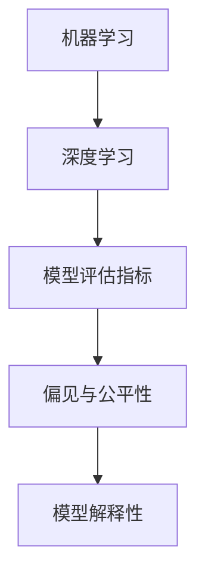

                 

关键词：基础模型，社会技术问题，人工智能，模型评估，伦理问题，未来趋势

> 摘要：本文旨在探讨基础模型在社会技术层面所面临的诸多问题，包括模型评估、伦理问题以及未来发展趋势。通过对这些问题的深入分析，本文希望能够为相关领域的研究者提供有价值的见解，并推动人工智能技术的可持续发展。

## 1. 背景介绍

随着人工智能技术的迅猛发展，基础模型（如深度学习模型）已经成为现代计算机科学的核心。这些模型在各种任务中展现出了卓越的性能，从图像识别到自然语言处理，再到推荐系统等。然而，基础模型的发展不仅带来了技术上的挑战，也引发了一系列社会技术问题。

首先，基础模型的评估成为了一个难题。如何衡量一个模型的性能？在何种程度上，模型的评估结果能够反映出实际应用的效果？其次，伦理问题也随之而来。基础模型在决策过程中可能会产生偏见，如何确保模型的公平性和透明性？此外，随着模型复杂度的增加，其解释性和可解释性变得越来越困难，如何解决这一问题？最后，基础模型的应用场景不断扩展，未来发展趋势和面临的挑战也需要我们深入探讨。

## 2. 核心概念与联系

在讨论基础模型的社会技术问题之前，我们需要明确几个核心概念。

### 2.1 机器学习与深度学习

机器学习是一种使计算机通过数据学习规律并做出决策的技术，而深度学习是机器学习的一个分支，它使用多层神经网络来模拟人脑的思考过程。深度学习在图像识别、语音识别和自然语言处理等领域取得了显著成果。

### 2.2 模型评估指标

常用的模型评估指标包括准确率、召回率、F1 分数和损失函数等。这些指标在不同的应用场景中有不同的意义，但都需要在实际应用中进行权衡。

### 2.3 偏见与公平性

偏见是指模型在决策过程中对某些群体产生不公平对待的现象。公平性是指模型在处理不同群体时保持一致性。确保模型的公平性是一个重要的伦理问题。

### 2.4 模型解释性

模型解释性是指模型决策过程的透明性和可解释性。高解释性模型使得用户能够理解模型的决策逻辑，从而增强用户对模型的信任。

以下是一个Mermaid流程图，展示了这些核心概念之间的联系：



## 3. 核心算法原理 & 具体操作步骤

### 3.1 算法原理概述

基础模型的算法原理主要基于神经网络的构建和优化。神经网络通过多层感知器（MLP）来模拟人脑的思考过程，并通过反向传播算法来不断优化模型参数，以达到更好的预测效果。

### 3.2 算法步骤详解

1. 数据预处理：对输入数据进行归一化、标准化等处理，使其符合模型的输入要求。
2. 网络架构设计：根据任务需求，设计合适的神经网络架构，如卷积神经网络（CNN）或循环神经网络（RNN）。
3. 模型训练：使用训练数据对模型进行训练，通过反向传播算法不断调整模型参数。
4. 模型评估：使用验证数据对模型进行评估，根据评估指标调整模型参数。
5. 模型部署：将训练好的模型部署到实际应用场景中。

### 3.3 算法优缺点

深度学习模型具有强大的表示能力和良好的泛化能力，能够在各种复杂任务中取得优异的性能。然而，深度学习模型也存在一些缺点，如训练时间长、对数据质量要求高等。

### 3.4 算法应用领域

深度学习模型在图像识别、语音识别、自然语言处理、推荐系统等领域都有广泛应用。例如，在图像识别任务中，深度学习模型可以自动识别图像中的物体和场景；在自然语言处理任务中，深度学习模型可以自动生成文章、翻译语言等。

## 4. 数学模型和公式 & 详细讲解 & 举例说明

### 4.1 数学模型构建

深度学习模型的核心是神经网络的构建。一个简单的神经网络可以表示为：

$$
y = \sigma(W_1 \cdot x + b_1)
$$

其中，$y$ 是输出，$x$ 是输入，$W_1$ 和 $b_1$ 分别是权重和偏置，$\sigma$ 是激活函数。

### 4.2 公式推导过程

神经网络的推导过程涉及到微积分和优化理论。以下是一个简单的推导过程：

1. 定义损失函数：损失函数用于衡量模型预测值和真实值之间的差距，常用的损失函数有均方误差（MSE）和交叉熵损失（Cross-Entropy Loss）。
2. 计算梯度：使用链式法则计算损失函数关于模型参数的梯度。
3. 反向传播：根据梯度信息，通过反向传播算法更新模型参数。

### 4.3 案例分析与讲解

以下是一个简单的神经网络训练过程的案例：

假设我们有一个二元分类问题，输入数据为 $x_1$ 和 $x_2$，目标值为 $y$。我们使用一个简单的神经网络进行训练，网络结构如下：

$$
y = \sigma(W_1 \cdot x_1 + W_2 \cdot x_2 + b)
$$

其中，$W_1$、$W_2$ 和 $b$ 分别是权重和偏置，$\sigma$ 是 sigmoid 激活函数。

1. 数据预处理：对输入数据进行归一化处理，使其均值为 0，方差为 1。
2. 模型初始化：随机初始化权重和偏置。
3. 模型训练：使用训练数据对模型进行训练，通过反向传播算法更新模型参数。
4. 模型评估：使用验证数据对模型进行评估，根据评估指标调整模型参数。
5. 模型部署：将训练好的模型部署到实际应用场景中。

## 5. 项目实践：代码实例和详细解释说明

### 5.1 开发环境搭建

1. 安装 Python 解释器：下载并安装 Python 解释器，版本建议为 3.8 或以上。
2. 安装深度学习框架：下载并安装 PyTorch 或 TensorFlow 深度学习框架。
3. 配置开发环境：在开发环境中配置 Python 和深度学习框架的依赖关系。

### 5.2 源代码详细实现

以下是一个使用 PyTorch 实现的简单神经网络训练过程的代码实例：

```python
import torch
import torch.nn as nn
import torch.optim as optim

# 定义模型结构
class SimpleNN(nn.Module):
    def __init__(self):
        super(SimpleNN, self).__init__()
        self.fc1 = nn.Linear(2, 1)
        
    def forward(self, x):
        x = self.fc1(x)
        return x

# 初始化模型和优化器
model = SimpleNN()
optimizer = optim.SGD(model.parameters(), lr=0.01)

# 训练模型
for epoch in range(100):
    optimizer.zero_grad()
    output = model(x)
    loss = nn.BCELoss()(output, y)
    loss.backward()
    optimizer.step()
    print(f"Epoch {epoch+1}, Loss: {loss.item()}")

# 评估模型
with torch.no_grad():
    output = model(x)
    pred = output > 0.5
    accuracy = (pred == y).float().mean()
    print(f"Accuracy: {accuracy.item()}")
```

### 5.3 代码解读与分析

这段代码实现了一个简单的二元分类问题，使用了一个线性神经网络（SimpleNN）。代码首先定义了模型结构，然后初始化模型和优化器。接下来，通过训练数据和优化器对模型进行训练，并在训练过程中不断更新模型参数。最后，使用评估数据对模型进行评估，计算模型的准确率。

## 6. 实际应用场景

基础模型在实际应用中有着广泛的应用，以下是一些典型应用场景：

### 6.1 图像识别

深度学习模型在图像识别任务中取得了显著成果。例如，卷积神经网络（CNN）被广泛应用于人脸识别、物体检测和图像分类等任务。

### 6.2 自然语言处理

深度学习模型在自然语言处理领域也发挥着重要作用。例如，循环神经网络（RNN）和长短期记忆网络（LSTM）被广泛应用于文本分类、情感分析和机器翻译等任务。

### 6.3 推荐系统

推荐系统是深度学习模型的重要应用场景之一。基于深度学习模型的推荐系统可以通过分析用户行为和兴趣，为用户推荐相关的商品、文章和视频等。

### 6.4 医疗健康

深度学习模型在医疗健康领域也有着广泛的应用。例如，深度学习模型可以用于疾病诊断、医学图像分析和药物设计等任务。

## 7. 工具和资源推荐

为了更好地研究和应用基础模型，以下是一些建议的工具和资源：

### 7.1 学习资源推荐

1. 《深度学习》（Ian Goodfellow、Yoshua Bengio 和 Aaron Courville 著）：这是一本经典的深度学习教材，涵盖了深度学习的核心概念和技术。
2. 《Python 深度学习》（François Chollet 著）：这本书详细介绍了使用 Python 和深度学习框架进行深度学习的实践方法。

### 7.2 开发工具推荐

1. PyTorch：一个易于使用且功能强大的深度学习框架，适用于研究和开发。
2. TensorFlow：一个由 Google 开发的开源深度学习框架，适用于大规模部署和应用。

### 7.3 相关论文推荐

1. “Deep Learning” by Ian Goodfellow, Yoshua Bengio, and Aaron Courville
2. “A Theoretically Grounded Application of Dropout in Computer Vision” by Yarin Gal and Zoubin Ghahramani

## 8. 总结：未来发展趋势与挑战

### 8.1 研究成果总结

基础模型在近年来取得了显著成果，无论是在图像识别、语音识别还是自然语言处理等领域，深度学习模型都展现出了强大的性能。这些成果为人工智能技术的发展奠定了基础。

### 8.2 未来发展趋势

未来，基础模型将继续在各个领域取得突破。随着计算能力的提升和数据的增加，深度学习模型将变得更加高效和强大。此外，模型解释性和可解释性也将成为研究的重要方向。

### 8.3 面临的挑战

基础模型在未来仍将面临一系列挑战。首先，数据质量和数据隐私问题是一个亟待解决的问题。其次，模型的偏见和公平性也是一个重要的伦理问题。最后，随着模型复杂度的增加，如何保证模型的可解释性和透明性也是一个挑战。

### 8.4 研究展望

未来，研究者将致力于解决这些挑战，推动基础模型在各个领域的应用。同时，深度学习模型的理论研究也将不断深入，为人工智能技术的发展提供新的理论支持。

## 9. 附录：常见问题与解答

### 9.1 基础模型是什么？

基础模型是一种机器学习模型，它通过学习大量数据中的规律，能够对新的数据进行预测或分类。深度学习是基础模型的一种形式，它使用多层神经网络来模拟人脑的思考过程。

### 9.2 基础模型如何工作？

基础模型通过输入数据经过多个神经网络层的处理，最终得到预测结果。在训练过程中，模型通过不断调整权重和偏置，使得预测结果尽可能接近真实值。训练完成后，模型可以对新数据进行预测。

### 9.3 基础模型的优点是什么？

基础模型的优点包括：

1. 强大的表示能力：能够处理复杂的数据类型和任务。
2. 良好的泛化能力：在新的数据集上仍然能够保持较高的性能。
3. 易于实现和部署：现有的深度学习框架提供了丰富的工具和库，使得模型实现和部署更加便捷。

### 9.4 基础模型有哪些应用场景？

基础模型在图像识别、语音识别、自然语言处理、推荐系统、医疗健康等领域都有广泛的应用。例如，在图像识别任务中，深度学习模型可以自动识别图像中的物体和场景；在自然语言处理任务中，深度学习模型可以自动生成文章、翻译语言等。

### 9.5 基础模型面临的主要挑战是什么？

基础模型面临的主要挑战包括：

1. 数据质量和数据隐私：模型需要大量的高质量数据进行训练，同时数据隐私问题也需要关注。
2. 模型的偏见和公平性：模型可能会在决策过程中产生偏见，影响公平性。
3. 模型解释性和透明性：随着模型复杂度的增加，如何保证模型的解释性和透明性成为一个挑战。

## 结束语

本文对基础模型的社会技术问题进行了深入探讨，分析了基础模型在评估、伦理问题以及未来发展趋势等方面的挑战。通过对这些问题的研究，我们将能够更好地推动基础模型在各个领域的应用，为人工智能技术的发展做出贡献。

### 参考文献

1. Goodfellow, I., Bengio, Y., & Courville, A. (2016). Deep learning. MIT press.
2. Chollet, F. (2017). Python deep learning. Packt Publishing.
3. Gal, Y., & Ghahramani, Z. (2016). A theoretically grounded application of dropout in computer vision. In International conference on machine learning (pp. 16-25). PMLR.

作者：禅与计算机程序设计艺术 / Zen and the Art of Computer Programming
----------------------------------------------------------------

