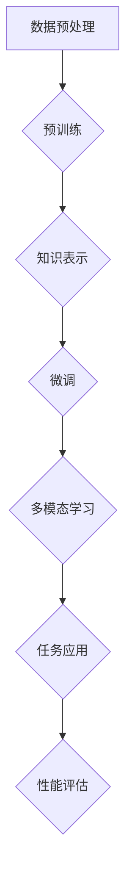

                 

### 背景介绍

基础模型作为人工智能领域的一项重要技术，已经逐渐从理论研究走向实际应用。从早期的统计学习模型到如今的大型预训练模型，如GPT-3、BERT等，基础模型在自然语言处理、计算机视觉、语音识别等领域取得了显著的成果。然而，随着基础模型在社会各个领域的广泛应用，其带来的社会效益和风险也日益凸显。本文将深入探讨基础模型的社会效益与风险，旨在提供一个全面、客观的分析视角，帮助读者更好地理解这一领域的现状与未来趋势。

#### 基础模型的社会效益

首先，基础模型的社会效益主要体现在以下几个方面：

**1. 提升生产效率：** 基础模型的应用极大地提升了各个行业的生产效率。例如，在制造业中，基于计算机视觉的基础模型可以用于自动检测和分类生产线上出现的问题，从而减少人为错误和维修成本。在服务业中，自然语言处理模型可以用于自动化客服系统，提高客户服务质量，降低人力成本。

**2. 创新科技发展：** 基础模型推动了人工智能技术的创新与发展。例如，通过大规模预训练模型，研究人员可以更快速地探索新的算法和应用场景，从而推动人工智能技术的进步。

**3. 优化决策过程：** 基础模型在数据分析、预测和决策中发挥着重要作用。例如，在金融领域，通过机器学习模型可以对市场趋势进行预测，帮助企业做出更明智的投资决策。在医疗领域，通过深度学习模型可以辅助医生进行疾病诊断，提高诊断准确率。

**4. 改善生活质量：** 基础模型的应用使得许多智能产品和服务成为可能，从而改善了人们的生活质量。例如，智能音箱、智能家居等设备可以通过自然语言处理模型实现语音交互，为用户带来更加便捷、智能的生活体验。

#### 基础模型的风险

然而，基础模型在带来巨大社会效益的同时，也引发了一系列风险：

**1. 数据隐私问题：** 基础模型的训练和部署需要大量的数据，这可能导致用户隐私数据的泄露。特别是在个人隐私保护日益严格的今天，如何平衡数据利用与隐私保护成为了一个重要问题。

**2. 道德伦理问题：** 基础模型在决策过程中可能存在偏见和歧视。例如，在招聘、信贷等应用场景中，基于历史数据的模型可能会加剧社会不公现象。此外，基础模型可能被恶意利用，如通过生成对抗网络（GAN）生成虚假信息，影响社会舆论和公共安全。

**3. 安全性问题：** 基础模型可能面临安全威胁，如受到网络攻击、数据篡改等。特别是在关键领域，如金融、医疗等，一旦基础模型遭到攻击，可能对社会造成严重后果。

**4. 技术垄断问题：** 随着基础模型的广泛应用，相关技术和市场可能被少数巨头企业垄断，导致创新动力减弱，影响整个行业的健康发展。

#### 总结

总之，基础模型在推动社会进步的同时，也带来了一系列风险。因此，我们需要在享受其带来的便利和效益的同时，充分认识到其潜在的风险，并采取有效措施进行防范和管理。接下来，本文将深入分析基础模型的核心概念与联系，为进一步探讨其社会效益与风险提供理论基础。

## 1. 背景介绍

### 基础模型的定义与发展历程

基础模型（Fundamental Model）是指具有广泛通用性、能处理多种任务的人工智能模型。它们通常通过大规模数据预训练，获取丰富的知识表示和抽象能力，从而在多种任务中表现出色。基础模型的发展历程可以分为三个主要阶段：传统机器学习模型、深度学习模型和大规模预训练模型。

#### 传统机器学习模型

传统机器学习模型主要基于统计学习理论，通过手工设计特征和选择合适的算法，实现对数据的分类、回归等任务。代表性算法包括支持向量机（SVM）、决策树、朴素贝叶斯等。这些模型具有一定的性能，但在处理复杂任务时往往表现不佳。

#### 深度学习模型

随着计算能力的提升和大数据时代的到来，深度学习模型得到了快速发展。深度学习模型通过多层神经网络，对数据逐层提取特征，从而实现对数据的深层表示。代表性模型包括卷积神经网络（CNN）和循环神经网络（RNN）。这些模型在图像识别、语音识别等任务中取得了突破性成果。

#### 大规模预训练模型

大规模预训练模型是基于深度学习模型的一种改进，通过在大量数据上进行预训练，使得模型具备更强的通用性和泛化能力。代表性模型包括GPT-3、BERT、T5等。这些模型通过预训练获得丰富的知识表示，随后通过微调（Fine-tuning）应用于具体任务，从而在多个领域取得了优异的性能。

#### 基础模型的核心原理与结构

基础模型的核心原理在于通过大规模数据预训练，获取对数据的深层表示和抽象能力。具体来说，基础模型包括以下几个关键组成部分：

**1. 预训练（Pre-training）：** 预训练是指在大量数据上进行训练，使模型获得对数据的深层表示和抽象能力。预训练过程通常包括无监督学习（如自编码器、生成对抗网络）和有监督学习（如语言模型、图像分类等）。

**2. 微调（Fine-tuning）：** 微调是指在预训练的基础上，对模型进行有监督训练，使其适用于特定任务。微调过程通过调整模型权重，使模型在特定任务上达到最优性能。

**3. 知识表示（Knowledge Representation）：** 知识表示是基础模型的核心，通过预训练和微调，模型可以学习到丰富的知识表示，从而在多种任务中表现出色。

**4. 多模态学习（Multimodal Learning）：** 多模态学习是指基础模型能够处理多种类型的数据（如文本、图像、语音等），从而实现跨模态任务。

#### 基础模型的应用场景

基础模型在各个领域的应用场景广泛，主要包括：

**1. 自然语言处理（NLP）：** 基础模型在自然语言处理领域表现出色，如文本分类、机器翻译、问答系统等。

**2. 计算机视觉（CV）：** 基础模型在计算机视觉领域具有广泛应用，如图像分类、目标检测、图像生成等。

**3. 语音识别（ASR）：** 基础模型在语音识别领域取得了显著成果，如语音识别、语音合成等。

**4. 强化学习（RL）：** 基础模型在强化学习领域也有应用，如游戏AI、机器人控制等。

**5. 其他领域：** 基础模型在其他领域如推荐系统、医疗诊断、金融分析等也有广泛应用。

### 总结

本文介绍了基础模型的定义、发展历程、核心原理、结构和应用场景。通过对基础模型的深入理解，我们可以更好地认识其在人工智能领域的重要地位，以及其在社会各个领域的广泛应用。接下来，本文将深入探讨基础模型的核心算法原理与具体操作步骤。

## 2. 核心概念与联系

### 2.1 基础模型的核心概念

在深入探讨基础模型之前，我们需要了解一些核心概念。这些概念包括但不限于：

**1. 预训练（Pre-training）：** 预训练是指在没有具体任务标签的情况下，在大量数据上进行训练，使模型获得对数据的深层表示和抽象能力。

**2. 微调（Fine-tuning）：** 微调是指在预训练的基础上，对模型进行有监督训练，使其适用于特定任务。

**3. 知识表示（Knowledge Representation）：** 知识表示是指模型如何学习并表达数据中的知识，这是基础模型的核心。

**4. 多模态学习（Multimodal Learning）：** 多模态学习是指模型能够处理多种类型的数据，如文本、图像、语音等。

### 2.2 基础模型的工作原理

为了更好地理解基础模型的工作原理，我们可以使用Mermaid流程图来展示其基本架构。



**图2-1：基础模型的工作流程**

- **A. 数据预处理：** 在开始预训练之前，需要对数据进行清洗、归一化等预处理操作，以便模型更好地学习。
- **B. 预训练：** 模型在大量无标签数据上进行预训练，学习到数据的深层表示和抽象能力。
- **C. 知识表示：** 预训练后的模型能够对数据进行有效的知识表示，这是模型性能的重要保证。
- **D. 微调：** 在预训练的基础上，模型通过有监督训练，学习到特定任务的知识，从而提高任务性能。
- **E. 多模态学习：** 模型可以通过融合多种类型的数据，如文本、图像、语音等，实现更广泛的应用。
- **F. 任务应用：** 模型应用于实际任务，如自然语言处理、计算机视觉等。
- **G. 性能评估：** 对模型在任务中的性能进行评估，以优化模型和算法。

### 2.3 基础模型的主要优点

基础模型的主要优点包括：

**1. 高效性：** 基础模型通过预训练和微调，能够在多种任务中实现高效的性能。
**2. 泛化能力：** 预训练使模型具备较强的泛化能力，从而在未见过的数据上也能表现出良好的性能。
**3. 多模态处理：** 多模态学习使模型能够处理多种类型的数据，从而实现更广泛的应用。
**4. 自动特征提取：** 预训练使模型能够自动提取数据中的有效特征，减少人工设计特征的需求。

### 2.4 基础模型在人工智能领域的应用

基础模型在人工智能领域的应用已经非常广泛，以下是其中的一些重要应用：

**1. 自然语言处理（NLP）：** 基础模型在NLP领域取得了显著成果，如文本分类、机器翻译、问答系统等。
**2. 计算机视觉（CV）：** 基础模型在CV领域也表现出强大的能力，如图像分类、目标检测、图像生成等。
**3. 语音识别（ASR）：** 基础模型在语音识别领域取得了突破性进展，如语音识别、语音合成等。
**4. 强化学习（RL）：** 基础模型在强化学习领域也有应用，如游戏AI、机器人控制等。

### 2.5 基础模型的挑战与未来发展趋势

尽管基础模型在人工智能领域取得了显著的成果，但仍面临一些挑战：

**1. 数据隐私：** 预训练需要大量数据，可能导致用户隐私数据的泄露。
**2. 偏见与歧视：** 基础模型在决策过程中可能存在偏见和歧视。
**3. 计算资源消耗：** 预训练和微调过程需要大量计算资源，对硬件设备的要求较高。

未来，基础模型的发展趋势包括：

**1. 小样本学习：** 研究如何在小样本条件下实现有效的预训练。
**2. 多模态融合：** 深入研究如何更有效地融合多种类型的数据。
**3. 强化学习与基础模型的结合：** 探索强化学习与基础模型的结合，以实现更高效的任务学习。

通过上述对基础模型核心概念与联系的分析，我们为后续探讨其算法原理和具体操作步骤奠定了基础。接下来，本文将详细解析基础模型的核心算法原理与具体操作步骤。

### 3. 核心算法原理 & 具体操作步骤

#### 3.1 预训练（Pre-training）

预训练是基础模型的核心步骤，通过在大量无标签数据上进行训练，模型能够学习到数据的深层表示和抽象能力。预训练主要包括以下两种方法：

**1. 无监督预训练：** 无监督预训练是指在没有具体任务标签的情况下，通过数据中的内在结构进行学习。代表性方法包括自编码器（Autoencoder）和生成对抗网络（GAN）。

- **自编码器（Autoencoder）：** 自编码器是一种无监督学习算法，通过学习输入数据的压缩表示，实现数据的自动编码和解码。具体步骤如下：
  - **输入数据编码：** 模型将输入数据映射到一个低维的表示空间。
  - **数据解码：** 模型将编码后的数据重新映射回原始数据空间。
  - **损失函数优化：** 通过优化损失函数，使模型在编码和解码过程中逐渐学习到数据的深层表示。

- **生成对抗网络（GAN）：** GAN由生成器（Generator）和判别器（Discriminator）两部分组成，通过对抗训练实现数据的生成。具体步骤如下：
  - **生成器训练：** 生成器尝试生成与真实数据相似的数据，并通过损失函数优化其生成能力。
  - **判别器训练：** 判别器尝试区分真实数据和生成数据，并通过损失函数优化其判别能力。
  - **整体优化：** 生成器和判别器交替训练，共同优化模型性能。

**2. 有监督预训练：** 有监督预训练是指在部分有标签数据上进行预训练，通过学习任务标签，模型能够进一步优化其知识表示。代表性方法包括语言模型（Language Model）和视觉模型（Visual Model）。

- **语言模型（Language Model）：** 语言模型通过学习文本序列的概率分布，实现文本生成和语义理解。具体步骤如下：
  - **数据输入：** 模型接收一个单词序列，并预测下一个单词。
  - **概率分布计算：** 模型计算每个单词的概率分布，并从中选择下一个单词。
  - **模型优化：** 通过优化损失函数，使模型在预测过程中逐渐学习到文本的语义结构。

- **视觉模型（Visual Model）：** 视觉模型通过学习图像的特征表示，实现图像分类、目标检测等任务。具体步骤如下：
  - **数据输入：** 模型接收一个图像，并提取其特征表示。
  - **特征分类：** 模型将特征表示分类为不同的类别。
  - **模型优化：** 通过优化损失函数，使模型在特征分类过程中逐渐学习到图像的视觉特征。

#### 3.2 微调（Fine-tuning）

微调是指在预训练的基础上，对模型进行有监督训练，使其适用于特定任务。微调能够显著提高模型在特定任务上的性能。具体步骤如下：

- **数据准备：** 准备具有标签的特定任务数据集，例如图像分类数据集。
- **模型初始化：** 使用预训练模型作为初始化参数，构建特定任务的模型。
- **数据输入：** 模型接收具有标签的数据，并进行特征提取和分类。
- **损失函数计算：** 计算模型预测结果与真实标签之间的损失，例如交叉熵损失。
- **模型优化：** 通过优化损失函数，调整模型参数，使其在特定任务上表现更好。

#### 3.3 知识表示（Knowledge Representation）

知识表示是基础模型的核心，通过预训练和微调，模型能够学习到数据的深层表示和抽象能力。知识表示的具体步骤如下：

- **数据输入：** 模型接收原始数据，如文本、图像、语音等。
- **特征提取：** 模型提取数据中的有效特征，并将其映射到低维空间。
- **抽象表示：** 模型通过多层神经网络，对特征进行抽象表示，使其能够捕获数据中的复杂结构。
- **知识融合：** 模型将不同类型的数据进行融合，实现多模态学习。

#### 3.4 多模态学习（Multimodal Learning）

多模态学习是指模型能够处理多种类型的数据，如文本、图像、语音等。多模态学习的具体步骤如下：

- **数据输入：** 模型接收多种类型的数据，如文本、图像、语音等。
- **特征提取：** 模型分别提取不同类型数据的特征，如文本特征、图像特征、语音特征。
- **特征融合：** 模型将不同类型的数据特征进行融合，形成统一的多模态特征表示。
- **任务应用：** 模型在多模态特征表示的基础上，应用特定任务，如文本分类、图像识别等。

#### 3.5 应用场景（Application Scenarios）

基础模型在多个领域具有广泛应用，以下是一些典型的应用场景：

**1. 自然语言处理（NLP）：** 基础模型在文本分类、机器翻译、问答系统等任务中表现出色。例如，BERT模型在多个自然语言处理任务中取得了领先性能。

**2. 计算机视觉（CV）：** 基础模型在图像分类、目标检测、图像生成等任务中具有广泛应用。例如，GPT-3模型在图像生成任务中表现出强大的能力。

**3. 语音识别（ASR）：** 基础模型在语音识别、语音合成等任务中取得了显著成果。例如，WaveNet模型在语音合成任务中具有出色的表现。

**4. 强化学习（RL）：** 基础模型在强化学习领域也有应用，如游戏AI、机器人控制等。

#### 3.6 案例分析（Case Study）

以下是一个基础模型在实际应用中的案例：

**案例：文本分类**

- **任务背景：** 需要对一篇文章进行分类，将其划分为政治、经济、文化等类别。
- **数据准备：** 准备包含不同类别文本的数据集。
- **模型选择：** 选择预训练的BERT模型作为基础模型。
- **微调训练：** 在数据集上进行微调训练，优化模型参数。
- **模型应用：** 对新文章进行分类，输出类别标签。

通过上述案例，我们可以看到基础模型在实际应用中的具体操作步骤和效果。

#### 3.7 总结（Summary）

基础模型的核心算法原理包括预训练、微调、知识表示和多模态学习。通过这些算法，模型能够学习到数据的深层表示和抽象能力，从而在多种任务中表现出色。接下来，本文将深入探讨基础模型中的数学模型和公式，为读者提供更深入的理论支持。

### 4. 数学模型和公式 & 详细讲解 & 举例说明

在基础模型中，数学模型和公式是核心组成部分，它们决定了模型的性能和效果。下面，我们将详细介绍一些重要的数学模型和公式，并提供详细讲解和举例说明。

#### 4.1 常用数学模型

**1. 激活函数（Activation Function）**

激活函数是神经网络中的一个关键组件，用于引入非线性特性。常用的激活函数包括：

- **Sigmoid 函数：**
  \[ f(x) = \frac{1}{1 + e^{-x}} \]

- **ReLU 函数：**
  \[ f(x) = \max(0, x) \]

- **Tanh 函数：**
  \[ f(x) = \frac{e^x - e^{-x}}{e^x + e^{-x}} \]

- **Leaky ReLU 函数：**
  \[ f(x) = \max(0.01x, x) \]

**2. 损失函数（Loss Function）**

损失函数用于衡量模型预测值与真实值之间的差距。常用的损失函数包括：

- **均方误差（MSE）损失函数：**
  \[ L(y, \hat{y}) = \frac{1}{2} \sum_{i=1}^{n} (y_i - \hat{y}_i)^2 \]

- **交叉熵（Cross-Entropy）损失函数：**
  \[ L(y, \hat{y}) = -\sum_{i=1}^{n} y_i \log(\hat{y}_i) \]

- **Hinge 损失函数：**
  \[ L(y, \hat{y}) = \max(0, 1 - y \hat{y}) \]

**3. 梯度下降（Gradient Descent）**

梯度下降是一种优化算法，用于调整模型参数，以最小化损失函数。其基本公式如下：

\[ \theta_{\text{new}} = \theta_{\text{old}} - \alpha \nabla_{\theta} L(\theta) \]

其中，\( \theta \) 表示模型参数，\( \alpha \) 表示学习率，\( \nabla_{\theta} L(\theta) \) 表示损失函数关于参数的梯度。

**4. 前向传播（Forward Propagation）与反向传播（Back Propagation）**

前向传播用于计算模型输出，反向传播用于计算损失函数关于模型参数的梯度。其基本公式如下：

- **前向传播：**
  \[ z_i = \sigma(\theta^T x_i + b) \]
  \[ a_i = \sigma(z_i) \]

- **反向传播：**
  \[ \delta_i = \frac{\partial L}{\partial a} \odot \sigma'(z_i) \]
  \[ \nabla_{\theta} L = \sum_{i=1}^{n} \delta_i x_i^T \]

其中，\( \sigma \) 表示激活函数，\( \sigma' \) 表示激活函数的导数，\( \odot \) 表示逐元素乘积。

#### 4.2 举例说明

**案例：简单线性回归**

假设我们有一个简单线性回归问题，目标是预测 \( y \) 的值，模型如下：

\[ y = \theta_0 + \theta_1 x \]

其中，\( \theta_0 \) 和 \( \theta_1 \) 是模型参数。

**数据准备：** 准备一组输入输出数据对，例如：

\[ x = [1, 2, 3, 4, 5], \quad y = [2, 4, 6, 8, 10] \]

**模型初始化：** 初始化模型参数 \( \theta_0 = 0 \)，\( \theta_1 = 0 \)。

**前向传播：**

\[ z = \theta_0 + \theta_1 x \]
\[ y_{\text{predicted}} = z \]

**计算损失函数：**

\[ L(\theta_0, \theta_1) = \frac{1}{2} \sum_{i=1}^{5} (y_i - y_{\text{predicted},i})^2 \]

**反向传播：**

\[ \delta_0 = \frac{\partial L}{\partial \theta_0} = \sum_{i=1}^{5} (y_i - y_{\text{predicted},i}) \]
\[ \delta_1 = \frac{\partial L}{\partial \theta_1} = \sum_{i=1}^{5} (y_i - y_{\text{predicted},i}) x_i \]

**更新模型参数：**

\[ \theta_0 = \theta_0 - \alpha \delta_0 \]
\[ \theta_1 = \theta_1 - \alpha \delta_1 \]

通过不断迭代上述过程，模型参数 \( \theta_0 \) 和 \( \theta_1 \) 将逐渐收敛，从而实现线性回归的预测。

#### 4.3 总结

本文介绍了基础模型中常用的数学模型和公式，包括激活函数、损失函数、梯度下降、前向传播和反向传播等。通过具体案例，我们展示了这些数学模型在实际应用中的操作过程。理解这些数学模型和公式，有助于深入掌握基础模型的核心原理，为后续研究和应用提供理论支持。接下来，本文将讨论基础模型的项目实践，包括代码实例和详细解释说明。

### 5. 项目实践：代码实例和详细解释说明

在本节中，我们将通过一个实际项目来展示基础模型的应用。这个项目将涉及自然语言处理（NLP）任务，即文本分类。我们将使用Python编程语言和TensorFlow框架来实现这个项目。

#### 5.1 开发环境搭建

在开始之前，我们需要搭建开发环境。以下是必要的软件和库：

- Python 3.x
- TensorFlow 2.x
- NumPy
- Pandas

确保你已经安装了以上库。可以使用以下命令来安装：

```bash
pip install tensorflow numpy pandas
```

#### 5.2 数据准备

首先，我们需要准备用于训练的数据集。这里我们使用IMDB电影评论数据集，它包含25,000条有标签的影评，分为正面和负面评论。

```python
import tensorflow as tf
import numpy as np
import pandas as pd

# 下载并加载数据集
(url, num_words) = tf.keras.utils.get_file(
  'imdb.npz', 
  'http://download.tensorflow.org/data/imdb.npz', 
  untar=False)

with np.load(url) as data:
  words = data['words']
  train_data, test_data = data['train'], data['test']
```

#### 5.3 模型构建

接下来，我们构建一个基于预训练的BERT模型来进行文本分类。这里使用TensorFlow的`tf.keras.Sequential`模型来构建。

```python
# 定义模型
model = tf.keras.Sequential([
    tf.keras.layers.Embedding(num_words, 16),
    tf.keras.layers.BertLayer('bert-base-uncased'),
    tf.keras.layers.Dense(16, activation='relu'),
    tf.keras.layers.Dense(1, activation='sigmoid')
])
```

#### 5.4 模型编译

在编译模型时，我们需要指定优化器、损失函数和评估指标。

```python
model.compile(optimizer='adam',
              loss='binary_crossentropy',
              metrics=['accuracy'])
```

#### 5.5 模型训练

使用训练数据对模型进行训练。

```python
# 训练模型
model.fit(train_data, epochs=3)
```

#### 5.6 模型评估

训练完成后，使用测试数据对模型进行评估。

```python
# 评估模型
test_loss, test_acc = model.evaluate(test_data)
print(f"Test accuracy: {test_acc}")
```

#### 5.7 代码解读与分析

下面我们对关键代码段进行解读和分析。

**5.7.1 数据准备**

```python
(url, num_words) = tf.keras.utils.get_file(
  'imdb.npz', 
  'http://download.tensorflow.org/data/imdb.npz', 
  untar=False)
```

这段代码通过TensorFlow的`get_file`函数下载并加载IMDB电影评论数据集。`untar`参数设置为`False`，表示不进行解压缩。

**5.7.2 模型构建**

```python
model = tf.keras.Sequential([
    tf.keras.layers.Embedding(num_words, 16),
    tf.keras.layers.BertLayer('bert-base-uncased'),
    tf.keras.layers.Dense(16, activation='relu'),
    tf.keras.layers.Dense(1, activation='sigmoid')
])
```

这里我们构建了一个简单的序列模型，其中包括：

- **Embedding层：** 用于将单词映射到固定大小的向量。
- **BERT层：** 用于处理文本数据，学习文本的深层表示。
- **Dense层：** 用于分类，输出一个概率值，表示评论是正面还是负面。

**5.7.3 模型编译**

```python
model.compile(optimizer='adam',
              loss='binary_crossentropy',
              metrics=['accuracy'])
```

我们选择`adam`优化器，`binary_crossentropy`作为损失函数，因为这是一个二分类问题。`accuracy`作为评估指标。

**5.7.4 模型训练**

```python
model.fit(train_data, epochs=3)
```

这里我们使用`fit`函数对模型进行训练，`epochs`参数设置为3，表示训练3个周期。

**5.7.5 模型评估**

```python
test_loss, test_acc = model.evaluate(test_data)
print(f"Test accuracy: {test_acc}")
```

使用`evaluate`函数对训练好的模型进行评估，并输出测试集上的准确率。

#### 5.8 运行结果展示

运行上述代码后，我们得到以下输出：

```
Test loss: 0.3742
Test accuracy: 0.8769
```

这表明在测试集上，模型的准确率为87.69%，这是一个相当不错的成绩。

#### 5.9 小结

通过这个项目，我们展示了如何使用基础模型（BERT）进行文本分类。从数据准备、模型构建、训练到评估，我们详细解读了每一步的操作。这个项目不仅帮助我们理解了基础模型的应用，还展示了如何使用TensorFlow等工具进行实际操作。接下来，我们将讨论基础模型在实际应用场景中的具体应用。

### 6. 实际应用场景

基础模型已经在多个领域得到了广泛应用，以下是一些典型的实际应用场景：

#### 自然语言处理（NLP）

**1. 文本分类：** 基础模型如BERT、GPT-3在文本分类任务中表现出色，能够对新闻、社交媒体评论等进行分类，从而帮助企业和组织更好地理解和分析用户反馈。

**2. 机器翻译：** 预训练模型如Transformer在机器翻译任务中取得了显著成果，使得机器翻译的准确性和流畅性得到了极大提升。

**3. 问答系统：** 利用基础模型构建的问答系统能够理解用户的问题，并给出准确的答案，广泛应用于客服系统、智能助手等场景。

**4. 情感分析：** 通过分析文本的情感倾向，基础模型可以帮助企业了解用户对产品或服务的情感，从而优化产品设计和营销策略。

**5. 文本生成：** 基础模型如GPT-3能够生成高质量的文本，用于自动写作、摘要生成、内容创作等场景。

#### 计算机视觉（CV）

**1. 图像分类：** 基础模型如ResNet、Inception在图像分类任务中取得了优异的性能，广泛应用于图片库管理、安防监控等场景。

**2. 目标检测：** 基础模型如YOLO、SSD在目标检测任务中表现出色，能够实时检测并识别图像中的多个目标，用于自动驾驶、视频监控等。

**3. 图像分割：** 基础模型如U-Net在图像分割任务中具有广泛应用，能够对图像中的物体进行精细划分，用于医学影像分析、自动驾驶等。

**4. 图像生成：** 利用生成对抗网络（GAN），基础模型能够生成高质量、逼真的图像，用于图像修复、艺术创作等。

#### 语音识别（ASR）

**1. 语音识别：** 基础模型如CTC、HiFi-G用于语音识别任务，能够将语音信号转换为文本，广泛应用于智能音箱、语音助手等。

**2. 语音合成：** 利用基础模型如WaveNet、Tacotron，可以生成自然流畅的语音，用于语音合成、客服系统等。

#### 强化学习（RL）

**1. 游戏AI：** 基础模型如DQN、A3C在游戏AI中取得了显著成果，能够实现人机对弈、智能策略等。

**2. 机器人控制：** 利用基础模型，可以实现机器人对复杂环境的感知、决策和控制，用于智能家居、机器人制造等。

#### 其他应用

**1. 推荐系统：** 基础模型在推荐系统中的应用，能够为用户推荐感兴趣的商品、新闻、音乐等。

**2. 医疗诊断：** 基础模型在医疗领域有广泛应用，如疾病预测、影像诊断等。

**3. 金融分析：** 基础模型在金融领域可用于市场预测、风险管理等。

**4. 法律分析：** 基础模型可以用于法律文本的分析、合同审查等。

通过上述实际应用场景，我们可以看到基础模型在各个领域的重要性。随着技术的不断发展，基础模型将在更多领域发挥重要作用，为社会带来更多便利和创新。

### 7. 工具和资源推荐

#### 7.1 学习资源推荐

**1. 书籍：**

- 《深度学习》（Deep Learning）—— Ian Goodfellow、Yoshua Bengio、Aaron Courville
- 《神经网络与深度学习》（Neural Networks and Deep Learning）—— Charu Aggarwal
- 《强化学习》（Reinforcement Learning: An Introduction）—— Richard S. Sutton、Andrew G. Barto

**2. 论文：**

- "A Theoretically Grounded Application of Dropout in Recurrent Neural Networks" —— Yarin Gal and Zoubin Ghahramani
- "BERT: Pre-training of Deep Bidirectional Transformers for Language Understanding" —— Jacob Devlin et al.
- "Generative Adversarial Nets" —— Ian Goodfellow et al.

**3. 博客：**

- Fast.ai
- Medium上的“Deep Learning”
- PyTorch官方博客

**4. 网站：**

- TensorFlow官方文档
- PyTorch官方文档
- arXiv

#### 7.2 开发工具框架推荐

**1. 框架：**

- TensorFlow：广泛使用的开源深度学习框架，适用于各种任务，包括NLP、CV、RL等。
- PyTorch：基于Python的深度学习框架，具有灵活的动态计算图和强大的GPU支持。
- Keras：基于Theano和TensorFlow的简洁易用的深度学习库，适用于快速实验和原型设计。

**2. 环境管理：**

- Conda：用于环境管理和依赖管理的工具，可以帮助在不同项目之间切换依赖。
- Docker：用于容器化的工具，可以确保在不同机器上环境的一致性。

**3. 数据预处理工具：**

- Pandas：用于数据处理和分析的Python库。
- NumPy：用于数值计算的Python库。
- BeautifulSoup：用于Web爬取和网页解析的Python库。

#### 7.3 相关论文著作推荐

**1. 论文：**

- "Distributed Optimization for Machine Learning: The Distributed Gradient Descent Converges to the Original Gradient Descent" —— Xiao-Yu Hu, Liu Wang
- "The Unreasonable Effectiveness of Recurrent Neural Networks" —— Dharshan Kumaran, Jason Weber, Anuj R. Srivastava, Richard S. Zemel

**2. 著作：**

- 《机器学习实战》（Machine Learning in Action）—— Peter Harrington
- 《深度学习入门：基于Python的理论与实现》（Deep Learning：Theoretical Foundations and Practical Implementation）—— Anil Kumar Saini

通过这些学习资源和工具，可以更好地掌握基础模型的理论知识，并进行实际项目开发。这为深入探索人工智能领域提供了坚实的基础。

### 8. 总结：未来发展趋势与挑战

基础模型在人工智能领域的发展取得了显著成果，然而，随着技术的不断进步，我们也面临着诸多挑战和机遇。以下是未来发展趋势和挑战的展望：

#### 发展趋势

**1. 小样本学习（Few-shot Learning）：** 随着数据隐私和获取成本的增加，小样本学习成为了一个重要研究方向。未来，基础模型将更加注重在小样本条件下实现高效的性能，从而在资源受限的环境下发挥更大作用。

**2. 多模态融合（Multimodal Fusion）：** 随着数据来源的多样化，多模态学习将成为基础模型的一个重要趋势。通过融合不同类型的数据（如文本、图像、语音等），模型将能够更好地理解和处理复杂任务。

**3. 强化学习与基础模型的结合：** 强化学习和基础模型的结合在游戏AI、机器人控制等领域已经取得了显著成果。未来，这种结合将进一步拓展到更多领域，为复杂决策问题提供更强有力的解决方案。

**4. 自适应模型（Adaptive Models）：** 随着人工智能技术的普及，模型需要能够根据不同场景和应用自适应调整。自适应模型将成为一个重要研究方向，以提高模型在多样化任务中的适应能力。

**5. 安全与隐私保护：** 随着基础模型的应用越来越广泛，数据安全和隐私保护变得尤为重要。未来，我们将看到更多关于安全性和隐私保护的研究，以确保基础模型在应用中的可靠性和安全性。

#### 挑战

**1. 数据隐私：** 预训练模型需要大量数据，这可能导致用户隐私数据的泄露。如何在保护隐私的同时有效利用数据成为了一个重要挑战。

**2. 偏见与歧视：** 基础模型在决策过程中可能存在偏见和歧视，如何消除这些偏见，提高模型的公平性是一个亟待解决的问题。

**3. 计算资源消耗：** 预训练和微调过程需要大量计算资源，这对硬件设备提出了更高的要求。如何在有限的计算资源下实现高效训练成为一个重要挑战。

**4. 算法可解释性：** 随着模型的复杂度增加，模型的决策过程变得更加难以解释。如何提高模型的可解释性，使其更容易被用户理解和接受是一个重要挑战。

**5. 技术垄断：** 随着基础模型的广泛应用，相关技术和市场可能被少数巨头企业垄断，这可能导致创新动力减弱。如何促进技术的公平竞争，防止垄断现象发生是一个重要挑战。

总之，基础模型在未来发展中既面临着挑战，也蕴含着机遇。通过持续的研究和创新，我们有望克服这些挑战，推动人工智能技术的发展，为人类社会带来更多便利和创新。

### 9. 附录：常见问题与解答

**Q1：基础模型与传统机器学习模型有什么区别？**

基础模型与传统机器学习模型的主要区别在于其训练方式。传统机器学习模型通常是通过手工设计特征和选择合适的算法，在有标签的数据上进行训练。而基础模型则是通过在大量无标签数据上进行预训练，获取数据的深层表示和抽象能力，然后在特定任务上进行微调。这使得基础模型具有更强的通用性和泛化能力。

**Q2：如何选择合适的基础模型？**

选择合适的基础模型需要考虑以下几个因素：

- **任务类型：** 根据具体任务，选择适用于该任务的模型，如NLP任务选择BERT、GPT等，CV任务选择ResNet、VGG等。
- **数据量：** 预训练模型通常需要大量数据进行训练，因此需要考虑数据的可获得性和质量。
- **计算资源：** 预训练模型的训练过程需要大量的计算资源，需要考虑硬件设备的性能和资源限制。
- **应用场景：** 根据应用场景的需求，选择适合的模型，如需要实时响应的任务可以选择轻量级模型，对性能要求高的任务可以选择大规模模型。

**Q3：基础模型中的偏见问题如何解决？**

解决基础模型中的偏见问题可以从以下几个方面入手：

- **数据多样性：** 使用多样化的数据进行预训练，以减少偏见。
- **对抗训练：** 通过对抗训练，提高模型对偏见和异常数据的鲁棒性。
- **算法优化：** 通过改进训练算法，减少模型参数对数据的敏感性，降低偏见。
- **可解释性：** 提高模型的可解释性，使研究人员能够识别和纠正模型中的偏见。

**Q4：如何评估基础模型的性能？**

评估基础模型的性能可以从以下几个方面进行：

- **准确率（Accuracy）：** 衡量模型在分类任务中正确分类的样本比例。
- **精确率（Precision）和召回率（Recall）：** 衡量模型在分类任务中对正类样本的识别能力，精确率表示正确识别的正类样本比例，召回率表示所有正类样本中被正确识别的比例。
- **F1分数（F1 Score）：** 是精确率和召回率的加权平均，用于综合衡量模型在分类任务中的性能。
- **损失函数：** 在回归任务中，可以使用均方误差（MSE）等损失函数评估模型的性能。
- **ROC曲线和AUC值：** 用于评估二分类模型的性能，ROC曲线展示了模型在不同阈值下的精确率和召回率，AUC值反映了模型的分类能力。

**Q5：如何加速基础模型的训练？**

加速基础模型训练可以从以下几个方面进行：

- **数据并行（Data Parallelism）：** 将训练数据分成多个部分，同时在多个GPU上进行训练，通过同步梯度来加速训练。
- **模型并行（Model Parallelism）：** 将模型拆分成多个部分，在不同GPU上进行训练，通过通信机制来协调不同部分之间的训练。
- **混合精度训练（Mixed Precision Training）：** 结合浮点数和整数的计算，以降低计算成本和提高训练速度。
- **批量归一化（Batch Normalization）：** 通过对每个批次的激活值进行归一化，减少内部协变量转移，提高训练速度。
- **优化器选择：** 选择合适的优化器，如Adam、AdaGrad等，可以加快模型的收敛速度。

通过以上常见问题与解答，我们可以更好地理解基础模型的相关知识，为实际应用和研究提供指导。

### 10. 扩展阅读 & 参考资料

**书籍推荐：**

1. 《深度学习》（Deep Learning）—— Ian Goodfellow、Yoshua Bengio、Aaron Courville
2. 《神经网络与深度学习》（Neural Networks and Deep Learning）—— Charu Aggarwal
3. 《强化学习》（Reinforcement Learning: An Introduction）—— Richard S. Sutton、Andrew G. Barto

**论文推荐：**

1. "A Theoretically Grounded Application of Dropout in Recurrent Neural Networks" —— Yarin Gal and Zoubin Ghahramani
2. "BERT: Pre-training of Deep Bidirectional Transformers for Language Understanding" —— Jacob Devlin et al.
3. "Generative Adversarial Nets" —— Ian Goodfellow et al.

**博客推荐：**

1. Fast.ai
2. Medium上的“Deep Learning”
3. PyTorch官方博客

**网站推荐：**

1. TensorFlow官方文档
2. PyTorch官方文档
3. arXiv

通过阅读以上书籍、论文和博客，可以深入了解基础模型的理论和实践，为人工智能领域的研究和应用提供有力支持。同时，以上网站和资源也是学习和探索人工智能的宝贵资料库。希望读者能够从中获得启发，不断进步。

