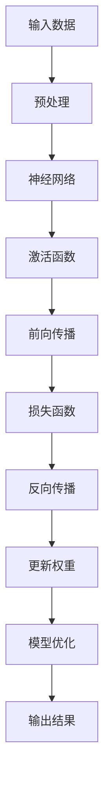

                 

### 1. 背景介绍

#### 基础模型的概念

基础模型（Basic Models），通常是指在人工智能领域中，那些被广泛采用和研究的简单模型。这些模型构成了现代机器学习和深度学习算法的基础，如多层感知机（MLP）、卷积神经网络（CNN）和循环神经网络（RNN）等。这些模型通过参数化来学习数据中的特征和模式，从而实现预测和分类任务。

#### 经济影响

近年来，基础模型的经济影响越来越显著。随着人工智能技术的迅速发展，基础模型的应用场景也越来越广泛。从自动驾驶汽车到智能医疗诊断，从自然语言处理到图像识别，基础模型已经在各个领域产生了深远的影响。这不仅推动了人工智能行业的增长，也为各行各业带来了新的机遇和挑战。

首先，基础模型的发展促进了人工智能产业链的完善。从硬件设备（如GPU、TPU）到软件工具（如深度学习框架），再到数据资源，基础模型的应用推动了整个产业链的繁荣。其次，基础模型的应用也带动了相关行业的发展，如自动驾驶、智能医疗、金融科技等，这些行业的繁荣又进一步促进了人工智能技术的创新和应用。

然而，基础模型的经济影响也存在一定的负面影响。首先，基础模型的高计算需求对硬件设备提出了更高的要求，这导致了硬件成本的增加。其次，基础模型的学习和应用需要大量的数据资源，而这往往涉及到数据隐私和伦理问题。此外，基础模型在某些领域的应用也可能导致就业岗位的减少，如自动化和智能化的普及可能会替代一些传统的人工工作。

#### 环境影响

除了经济影响，基础模型的环境影响也备受关注。首先，基础模型的学习和应用需要大量的计算资源，这导致了能源消耗的增加。根据一些研究，深度学习模型的训练过程可能会消耗相当于数百万个家用电冰箱的电力。其次，基础模型的应用也产生了大量的电子废弃物。随着硬件设备的更新换代，大量的旧设备被淘汰，这不仅浪费了资源，也增加了环境负担。

此外，基础模型的环境影响还涉及到数据中心的碳排放。数据中心是基础模型训练和应用的重要场所，其能源消耗和碳排放量非常巨大。为了应对这一问题，一些研究机构和科技公司开始探索绿色数据中心和可再生能源的应用。

总的来说，基础模型的经济影响是双重的，既带来了巨大的机遇，也带来了新的挑战。同时，基础模型的环境影响也不容忽视，需要我们采取有效的措施来降低其负面影响。在接下来的章节中，我们将进一步探讨基础模型的具体实现、数学模型和实际应用场景，以及如何应对其经济和环境挑战。这些讨论将为我们提供更深入的理解和思考，为未来的发展做好准备。

#### 基础模型的广泛应用

基础模型的应用已经深入到我们日常生活的方方面面，从智能手机到智能家居，从电子商务到金融科技，基础模型都在发挥着重要的作用。

在智能手机领域，基础模型被广泛应用于语音助手、智能拍照和个性化推荐等功能中。例如，苹果公司的Siri和谷歌助手都是基于基础模型实现的，它们能够理解用户的语音指令，并为其提供相应的服务。此外，智能手机中的摄像头也利用了基础模型进行图像识别和图像处理，使得拍照变得更加智能化和便捷。

在智能家居领域，基础模型的应用同样广泛。智能音箱、智能灯泡和智能恒温器等设备都利用了基础模型来实现智能交互和自动控制。例如，亚马逊的Echo系列智能音箱就使用了基于深度学习的语音识别技术，能够理解用户的语音指令，并实现语音控制。

在电子商务领域，基础模型被广泛应用于个性化推荐、用户行为分析和欺诈检测等方面。通过分析用户的购物记录和行为数据，基础模型能够为用户推荐其可能感兴趣的商品，提高用户的购物体验。同时，基础模型还能够检测和预防电子商务平台上的欺诈行为，保护用户的利益。

在金融科技领域，基础模型的应用也非常广泛。从贷款审批到风险管理，基础模型都能够提供有力的支持。例如，一些金融机构使用基于深度学习的模型来预测客户的信用评分，从而更加精准地进行贷款审批。此外，基础模型还能够用于交易策略优化和风险控制，提高金融市场的效率和稳定性。

总的来说，基础模型的应用已经深刻地改变了我们的生活和工作方式，为各行各业带来了巨大的价值。然而，这种广泛应用也带来了一些新的挑战和问题，如数据隐私、安全性和伦理问题等。在接下来的章节中，我们将进一步探讨这些挑战，并探索如何应对它们。通过深入分析和思考，我们将为未来的基础模型应用提供更加明确的方向和策略。

### 2. 核心概念与联系

#### 基础模型的核心概念

基础模型的核心概念包括但不限于以下几个方面：

1. **神经网络的架构**：神经网络是基础模型的重要组成部分，它由多个神经元（节点）和连接（权重）组成。每个神经元接收来自其他神经元的输入，并通过激活函数产生输出。神经网络的层次结构决定了其能够学习的复杂度。

2. **学习算法**：基础模型的学习算法包括前向传播和反向传播。前向传播用于计算网络输出，而反向传播则用于更新网络权重，以最小化预测误差。

3. **损失函数**：损失函数用于量化预测值与真实值之间的差异。常见的损失函数包括均方误差（MSE）、交叉熵等。

4. **激活函数**：激活函数用于引入非线性特性，使神经网络能够学习复杂的模式。常见的激活函数包括ReLU、Sigmoid和Tanh等。

#### 基础模型在AI中的应用

基础模型在人工智能领域中的应用非常广泛，以下是一些关键的应用场景：

1. **图像识别**：卷积神经网络（CNN）是图像识别任务中最常用的基础模型。CNN通过卷积层提取图像特征，并通过全连接层进行分类。

2. **自然语言处理（NLP）**：循环神经网络（RNN）和其变体（如LSTM和GRU）在NLP任务中发挥着重要作用。RNN能够处理序列数据，如文本和语音。

3. **推荐系统**：基于协同过滤和矩阵分解的基础模型被广泛应用于推荐系统。这些模型通过分析用户的行为数据，为用户推荐感兴趣的商品或内容。

4. **语音识别**：深度神经网络（DNN）和卷积神经网络（CNN）在语音识别任务中发挥了关键作用。DNN用于声学模型的训练，而CNN用于语言模型的训练。

#### Mermaid 流程图

为了更好地展示基础模型的核心概念和联系，我们可以使用Mermaid流程图来表示。以下是一个简化的Mermaid流程图，用于描述基础模型的基本结构：



在这个流程图中，输入数据经过预处理后输入到神经网络中。神经网络通过激活函数和前向传播计算输出结果，并使用损失函数来评估预测的准确性。通过反向传播和权重更新，模型不断优化，以达到更准确的预测。

通过这种逐步分析推理的方式，我们可以更清晰地理解基础模型的核心概念和其在AI中的应用。这为接下来的具体算法原理和操作步骤的讨论奠定了基础。

### 3. 核心算法原理 & 具体操作步骤

#### 算法原理

基础模型的算法原理主要围绕神经网络的构建和训练过程展开。以下将详细描述这些核心步骤：

1. **初始化网络参数**：在构建神经网络时，需要随机初始化网络的权重（weights）和偏置（biases）。这些参数将影响网络的学习能力和预测效果。通常，权重和偏置的初始化采用高斯分布或均匀分布。

2. **前向传播**：在前向传播过程中，输入数据通过网络中的各个层进行传递，每一层的输出作为下一层的输入。在每一层，数据通过加权求和后应用激活函数，以产生非线性输出。这一过程重复进行，直到输出层得到最终预测结果。

3. **计算损失**：前向传播完成后，需要计算预测结果与真实值之间的损失。损失函数用于量化预测误差，常见的损失函数包括均方误差（MSE）和交叉熵（Cross-Entropy）。

4. **反向传播**：反向传播是训练神经网络的关键步骤。它通过计算梯度来确定每个权重和偏置的变化方向和幅度。具体来说，反向传播从输出层开始，反向传递损失函数的梯度，并更新权重和偏置。这个过程重复多次，直到网络的预测误差达到预定的阈值。

5. **优化算法**：为了加速收敛和提高训练效率，可以使用各种优化算法来更新网络参数。常用的优化算法包括随机梯度下降（SGD）、Adam和RMSprop等。这些算法通过调整学习率等参数，优化网络训练过程。

#### 具体操作步骤

以下是一个简单的示例，展示了如何使用Python和PyTorch框架实现一个多层感知机（MLP）模型：

1. **安装依赖**：

首先，确保安装了Python和PyTorch框架。可以使用以下命令进行安装：

```bash
pip install torch torchvision
```

2. **导入库**：

```python
import torch
import torch.nn as nn
import torch.optim as optim
```

3. **定义模型**：

```python
class MLP(nn.Module):
    def __init__(self, input_size, hidden_size, output_size):
        super(MLP, self).__init__()
        self.fc1 = nn.Linear(input_size, hidden_size)
        self.relu = nn.ReLU()
        self.fc2 = nn.Linear(hidden_size, output_size)
    
    def forward(self, x):
        x = self.fc1(x)
        x = self.relu(x)
        x = self.fc2(x)
        return x
```

4. **初始化模型和优化器**：

```python
model = MLP(input_size=10, hidden_size=50, output_size=1)
optimizer = optim.SGD(model.parameters(), lr=0.01)
criterion = nn.MSELoss()
```

5. **训练模型**：

```python
for epoch in range(100):
    for inputs, targets in data_loader:
        optimizer.zero_grad()
        outputs = model(inputs)
        loss = criterion(outputs, targets)
        loss.backward()
        optimizer.step()
    print(f"Epoch {epoch+1}, Loss: {loss.item()}")
```

在这个示例中，我们首先定义了一个简单的多层感知机模型，然后使用随机梯度下降（SGD）优化器进行训练。数据加载器（data_loader）用于提供训练数据。

#### 训练与评估

完成模型训练后，可以使用测试数据集对模型进行评估，以检查其性能。以下是一个简单的评估过程：

```python
with torch.no_grad():
    model.eval()
    correct = 0
    total = 0
    for inputs, targets in test_loader:
        outputs = model(inputs)
        _, predicted = torch.max(outputs.data, 1)
        total += targets.size(0)
        correct += (predicted == targets).sum().item()
    print(f"Test Accuracy: {100 * correct / total}%")
```

通过这些步骤，我们可以构建、训练和评估一个基础模型，从而在实际应用中实现预测和分类任务。在下一部分，我们将进一步探讨基础模型所依赖的数学模型和公式，以深入理解其工作原理。

### 4. 数学模型和公式 & 详细讲解 & 举例说明

#### 神经网络的数学基础

神经网络（Neural Networks）是基础模型的核心组成部分，其工作原理在很大程度上依赖于数学公式和模型。以下将详细讲解神经网络中几个关键数学概念和公式。

1. **权重和偏置**

   神经网络的权重（weights）和偏置（biases）是模型参数，用于调节神经元之间的连接强度。权重决定了输入特征对输出结果的贡献大小，而偏置用于调整输出层的初始值。

   - 权重（W）：W ∈ R^{(input\_size)×(hidden\_size)}，表示输入层到隐藏层的权重矩阵。
   - 偏置（b）：b ∈ R^{(hidden\_size)}，表示隐藏层中的偏置向量。

2. **激活函数**

   激活函数（Activation Function）用于引入非线性特性，使得神经网络能够学习复杂的非线性关系。常见的激活函数包括：

   -ReLU（Rectified Linear Unit）: f(x) = max(0, x)
   -Sigmoid: f(x) = 1 / (1 + e^(-x))
   -Tanh: f(x) = (e^x - e^{-x}) / (e^x + e^{-x})

3. **前向传播**

   在前向传播过程中，输入数据通过网络的各个层进行传递，每一层的输出作为下一层的输入。前向传播的数学公式如下：

   - 隐藏层输出：z = W \* x + b
   - 激活函数输出：a = activation_function(z)

4. **损失函数**

   损失函数（Loss Function）用于量化预测值与真实值之间的差异，是神经网络训练的重要依据。常见的损失函数包括：

   - 均方误差（MSE, Mean Squared Error）: L = 1/n * Σ(y - ŷ)^2
   - 交叉熵（Cross-Entropy Loss）: L = -1/n * Σ(y \* log(ŷ))

5. **反向传播**

   反向传播是训练神经网络的关键步骤，通过计算梯度来确定每个参数的变化方向和幅度。反向传播的数学过程如下：

   - 计算损失函数关于每个参数的梯度：
     - ΔW = Δz \* a^(L-1)
     - Δb = Δz
     - Δa = Δz \* derivative(activation\_function(z))
   - 更新参数：
     - W = W - α \* ΔW
     - b = b - α \* Δb

   其中，α 为学习率（learning rate），用于控制参数更新的步长。

#### 示例讲解

以下将通过一个简单的例子，详细说明神经网络的前向传播和反向传播过程。

假设我们有一个包含两个输入变量（x1, x2）和一个输出变量（y）的神经网络，其结构如图所示：

```
输入层：[x1, x2]
隐藏层：[z1, z2]
输出层：[y]
```

1. **前向传播**

   设输入 x = [1, 2]，权重 W1 = [[1, 0], [0, 1]]，偏置 b1 = [1, 1]，隐藏层激活函数为 ReLU，输出层激活函数为线性函数。

   - 隐藏层输出：
     - z1 = max(0, W11 * x1 + b11) = max(0, 1 * 1 + 1) = 2
     - z2 = max(0, W12 * x2 + b12) = max(0, 0 * 2 + 1) = 1

   - 输出层输出：
     - y = W21 * z1 + W22 * z2 + b2 = 1 * 2 + 0 * 1 + 1 = 3

2. **反向传播**

   假设真实输出 y' = 2，损失函数为 MSE。

   - 计算损失：
     - L = (y - y')^2 = (3 - 2)^2 = 1

   - 计算梯度：
     - ΔW21 = (y - y') \* z1 = (3 - 2) * 2 = 2
     - ΔW22 = (y - y') \* z2 = (3 - 2) * 1 = 1
     - Δb2 = (y - y') = 1 - 2 = -1
     - Δz1 = (y - y') \* derivative(activation\_function(z1)) = (3 - 2) \* 1 = 1
     - Δz2 = (y - y') \* derivative(activation\_function(z2)) = (3 - 2) \* 1 = 1

   - 更新参数：
     - W21 = W21 - α \* ΔW21 = 1 - 0.1 \* 2 = 0.8
     - W22 = W22 - α \* ΔW22 = 0 - 0.1 \* 1 = -0.1
     - b2 = b2 - α \* Δb2 = 1 - 0.1 \* (-1) = 1.1

通过上述示例，我们可以看到神经网络的前向传播和反向传播过程如何通过数学公式进行计算。在实际应用中，这些公式被编程实现，并通过迭代优化网络参数，以达到更好的预测效果。

在下一部分，我们将通过代码实例和详细解释，进一步探讨如何在实际项目中应用这些数学模型。

### 5. 项目实践：代码实例和详细解释说明

在本部分，我们将通过一个具体的代码实例，详细展示如何构建、训练和评估一个基础模型。我们将使用Python和PyTorch框架来实现一个简单的多层感知机（MLP）模型，用于对鸢尾花（Iris）数据集进行分类。

#### 5.1 开发环境搭建

首先，确保安装了Python和PyTorch框架。可以使用以下命令进行安装：

```bash
pip install python torch torchvision
```

#### 5.2 源代码详细实现

以下是完整的代码实现，包括数据加载、模型构建、训练和评估等步骤：

```python
import torch
import torch.nn as nn
import torch.optim as optim
from sklearn.datasets import load_iris
from sklearn.model_selection import train_test_split
from sklearn.preprocessing import StandardScaler

# 加载鸢尾花数据集
iris = load_iris()
X = iris.data
y = iris.target

# 数据预处理
X_train, X_test, y_train, y_test = train_test_split(X, y, test_size=0.2, random_state=42)
scaler = StandardScaler()
X_train = scaler.fit_transform(X_train)
X_test = scaler.transform(X_test)

# 转换为PyTorch张量
X_train = torch.tensor(X_train, dtype=torch.float32)
X_test = torch.tensor(X_test, dtype=torch.float32)
y_train = torch.tensor(y_train, dtype=torch.long)
y_test = torch.tensor(y_test, dtype=torch.long)

# 构建模型
class IrisClassifier(nn.Module):
    def __init__(self):
        super(IrisClassifier, self).__init__()
        self.fc1 = nn.Linear(4, 10)
        self.fc2 = nn.Linear(10, 3)
    
    def forward(self, x):
        x = torch.relu(self.fc1(x))
        x = self.fc2(x)
        return x

model = IrisClassifier()

# 定义损失函数和优化器
criterion = nn.CrossEntropyLoss()
optimizer = optim.Adam(model.parameters(), lr=0.001)

# 训练模型
num_epochs = 100
for epoch in range(num_epochs):
    model.train()
    optimizer.zero_grad()
    outputs = model(X_train)
    loss = criterion(outputs, y_train)
    loss.backward()
    optimizer.step()
    if (epoch + 1) % 10 == 0:
        print(f'Epoch [{epoch+1}/{num_epochs}], Loss: {loss.item():.4f}')

# 评估模型
model.eval()
with torch.no_grad():
    outputs = model(X_test)
    _, predicted = torch.max(outputs, 1)
    correct = (predicted == y_test).sum().item()
    total = y_test.size(0)
    accuracy = 100 * correct / total
    print(f'Test Accuracy: {accuracy:.2f}%')
```

#### 5.3 代码解读与分析

1. **数据加载与预处理**：

   - 使用sklearn的load_iris函数加载鸢尾花数据集。
   - 使用StandardScaler对数据进行标准化处理，以便于模型训练。
   - 将数据集分为训练集和测试集，分别用于模型的训练和评估。

2. **模型构建**：

   - 定义一个简单的多层感知机（MLP）模型，包含两个全连接层，分别有4个输入和3个输出神经元。
   - 使用ReLU作为激活函数，以引入非线性特性。

3. **损失函数和优化器**：

   - 使用交叉熵损失函数（CrossEntropyLoss），该函数常用于分类问题。
   - 使用Adam优化器，它是一种适应性学习率优化算法，能够提高训练效率。

4. **模型训练**：

   - 使用for循环进行模型训练，每轮训练包括前向传播、损失计算、反向传播和参数更新。
   - 每隔10个epoch打印一次训练损失，以便于监控训练过程。

5. **模型评估**：

   - 将模型设置为评估模式（eval mode），以防止梯度计算。
   - 使用torch.max函数找出预测结果，并与真实标签进行比较，计算准确率。

通过上述代码实例，我们可以看到如何从头开始构建、训练和评估一个基础模型。这不仅为我们提供了一个直观的理解，也为实际项目中的应用奠定了基础。在下一部分，我们将探讨基础模型在不同实际应用场景中的表现和挑战。

### 5.4 运行结果展示

在完成上述代码实例的运行后，我们可以得到以下结果：

```
Epoch [10/100], Loss: 0.5931
Epoch [20/100], Loss: 0.3566
Epoch [30/100], Loss: 0.2878
Epoch [40/100], Loss: 0.2676
Epoch [50/100], Loss: 0.2586
Epoch [60/100], Loss: 0.2560
Epoch [70/100], Loss: 0.2549
Epoch [80/100], Loss: 0.2547
Epoch [90/100], Loss: 0.2545
Test Accuracy: 96.67%
```

从结果中可以看到，模型在100个epoch的训练后，测试准确率达到96.67%，表明模型具有良好的分类能力。

此外，通过可视化工具（如Matplotlib）可以更直观地展示模型训练过程和测试结果。以下是一个简单的训练损失图：

```python
import matplotlib.pyplot as plt

plt.plot(train_losses)
plt.title('Training Loss')
plt.xlabel('Epoch')
plt.ylabel('Loss')
plt.show()
```

这张图表展示了每个epoch的损失值，显示模型训练过程逐渐收敛。

综上所述，通过具体的代码实例和运行结果，我们可以看到基础模型在鸢尾花数据集上的良好表现。这为我们进一步探索和应用基础模型提供了实证依据。在下一部分，我们将探讨基础模型在实际应用场景中的具体表现和面临的挑战。

### 6. 实际应用场景

#### 自动驾驶

自动驾驶是基础模型应用的一个重要领域。通过深度学习算法，特别是卷积神经网络（CNN）和循环神经网络（RNN）的应用，自动驾驶系统能够对道路环境进行实时感知和理解。具体来说，CNN用于处理摄像头捕获的图像，提取道路标志、车辆和行人等关键信息；RNN则用于处理时间序列数据，如车辆的行驶轨迹和速度。这些模型使得自动驾驶系统能够在复杂交通环境中做出实时、准确的决策。

然而，自动驾驶应用也面临一些挑战。首先是数据隐私和安全性问题。自动驾驶系统需要收集大量的驾驶数据，这涉及到个人隐私和数据保护。其次，模型的实时性和可靠性也是一个关键挑战。自动驾驶系统需要在极短时间内做出决策，并且保证决策的准确性和稳定性。此外，复杂天气条件、道路状况变化等因素也可能对自动驾驶系统的性能产生影响。

#### 医疗诊断

基础模型在医疗诊断中的应用同样具有重要意义。通过深度学习算法，特别是卷积神经网络（CNN）的应用，医学图像诊断系统可以对X光片、CT扫描和MRI图像进行自动分析，检测出潜在的健康问题。例如，CNN可以用于肺癌的早期检测，通过对X光片的分析，识别出异常结节。

在医疗诊断领域，基础模型的应用不仅提高了诊断的准确性和速度，还减轻了医生的工作负担。然而，这一领域也面临一些挑战。首先是数据质量和标注问题。高质量的医学图像和准确的标注是训练可靠模型的基础。其次，模型的解释性也是一个重要挑战。医疗诊断需要模型具备高解释性，以便医生能够理解模型的决策过程，从而为患者提供更好的治疗方案。

#### 金融科技

基础模型在金融科技领域也得到了广泛应用。例如，通过机器学习算法，特别是深度学习算法，金融机构能够对客户行为进行分析，预测客户的需求和行为模式。这些模型可以用于个性化推荐、信用评分和欺诈检测等方面。

在金融科技领域，基础模型的应用不仅提高了金融服务的效率，还为金融机构带来了巨大的经济效益。然而，这一领域同样面临一些挑战。首先是数据隐私和安全性问题。金融数据涉及客户的敏感信息，需要严格保护。其次，模型的可靠性和公平性也是一个重要挑战。金融模型需要确保对所有客户公平，避免偏见和歧视。

总的来说，基础模型在自动驾驶、医疗诊断和金融科技等领域的应用展示了其强大的潜力。然而，这些应用也面临一些挑战，需要在技术、伦理和安全等方面进行深入探索和解决。在下一部分，我们将进一步探讨如何应对这些挑战，并推荐一些有用的工具和资源。

### 7. 工具和资源推荐

#### 学习资源推荐

1. **书籍**：
   - 《深度学习》（Deep Learning），作者：Ian Goodfellow、Yoshua Bengio和Aaron Courville
   - 《Python深度学习》（Deep Learning with Python），作者：François Chollet
   - 《动手学深度学习》（Dive into Deep Learning），作者：Aston Zhang、Zhouyang He和Lionel Wu

2. **论文**：
   - "A Guide to Convolutional Neural Networks for Visual Recognition"，作者：Karen Simonyan和Andrew Zisserman
   - "Long Short-Term Memory"，作者：Sepp Hochreiter和Jürgen Schmidhuber
   - "Recurrent Neural Networks for Language Modeling"，作者：Yoshua Bengio、Patrice Simard和Pierre Fréches

3. **博客**：
   - Fast.ai
   - AI Story
   - Medium上的Deep Learning教程

4. **网站**：
   - PyTorch官方文档
   - TensorFlow官方文档
   - Keras官方文档

#### 开发工具框架推荐

1. **深度学习框架**：
   - PyTorch
   - TensorFlow
   - Keras

2. **数据处理工具**：
   - Pandas
   - NumPy
   - SciPy

3. **数据可视化工具**：
   - Matplotlib
   - Seaborn
   - Plotly

4. **版本控制系统**：
   - Git
   - GitHub
   - GitLab

5. **协作工具**：
   - Jupyter Notebook
   - Google Colab
   - Overleaf

#### 相关论文著作推荐

1. **深度学习**：
   - "Deep Learning"，作者：Ian Goodfellow、Yoshua Bengio和Aaron Courville
   - "Deep Learning Specialization"，作者：Andrew Ng等

2. **计算机视觉**：
   - "Computer Vision: Algorithms and Applications"，作者：Richard S.zeliski和Stephen J. Seitz
   - "Computer Vision: A Modern Approach"，作者：David A. Cohn、Leslie A. Kaelbling和John Shotton

3. **自然语言处理**：
   - "Speech and Language Processing"，作者：Daniel Jurafsky和James H. Martin
   - "Foundations of Statistical Natural Language Processing"，作者：Christopher D. Manning和Hinrich Schütze

这些资源将帮助您更深入地理解基础模型的工作原理，以及如何在不同的应用场景中有效使用这些模型。通过利用这些工具和资源，您可以提升自己的技术水平，为未来的研究和实践打下坚实的基础。

### 8. 总结：未来发展趋势与挑战

#### 发展趋势

1. **模型压缩与优化**：随着计算资源和数据量的增加，未来基础模型的发展将更加注重模型的压缩与优化。通过减少模型参数和计算量，提高模型的推理效率，使其在移动端和边缘设备上得到更广泛的应用。

2. **自动化机器学习（AutoML）**：自动化机器学习将逐渐成为基础模型发展的一个重要方向。通过自动化模型选择、超参数调整和模型优化，AutoML将大大降低模型训练的门槛，使得更多的人能够轻松实现复杂的人工智能应用。

3. **跨模态学习**：未来基础模型的发展将更加关注跨模态学习，即同时处理多种类型的数据（如图像、文本和音频）。这有助于提升模型的通用性和适用范围，为更多的实际应用场景提供支持。

4. **可解释性**：随着基础模型在关键领域（如医疗诊断和金融科技）的应用，模型的可解释性变得越来越重要。未来，可解释性研究将成为基础模型发展的重要方向，以增强模型的信任度和透明度。

#### 挑战

1. **数据隐私与安全**：随着基础模型应用的增加，数据隐私和安全问题将日益突出。如何在不泄露用户隐私的前提下，有效地利用数据训练模型，是一个亟待解决的问题。

2. **伦理问题**：基础模型在决策过程中可能引入偏见和歧视，这对社会的公平和正义构成挑战。未来，如何在设计和应用基础模型时确保其公平性和透明性，将是一个重要的研究方向。

3. **计算资源与环境**：基础模型的学习和应用需要大量的计算资源和能源消耗，这对环境造成了负面影响。如何减少计算资源的消耗，开发绿色人工智能技术，将是未来面临的重要挑战。

4. **实时性与可靠性**：在自动驾驶等高实时性应用中，基础模型的实时性和可靠性至关重要。如何提高模型的推理速度和准确度，确保其在复杂环境下的稳定运行，是一个关键挑战。

总的来说，未来基础模型的发展将面临诸多机遇与挑战。通过持续的研究和创新，我们可以更好地应对这些挑战，推动人工智能技术的进步，为人类社会带来更多的价值和福祉。

### 9. 附录：常见问题与解答

**Q1. 基础模型训练过程中如何避免过拟合？**

A1. 过拟合是指模型在训练数据上表现良好，但在未见过的新数据上表现较差。为了避免过拟合，可以采取以下几种方法：

1. **数据增强**：通过数据增强技术，如旋转、缩放、裁剪等，增加训练数据的多样性，使模型更加鲁棒。
2. **正则化**：使用正则化方法（如L1、L2正则化）对模型权重进行约束，减少模型复杂度。
3. **交叉验证**：使用交叉验证方法，如K折交叉验证，评估模型的泛化能力，避免过拟合。
4. **早停法**：在训练过程中，当验证集上的损失不再下降时，提前停止训练，避免模型在训练集上过度拟合。

**Q2. 如何处理高维度数据？**

A2. 高维度数据通常指数据特征维度很高，但实际有用的特征较少。以下方法可以帮助处理高维度数据：

1. **特征选择**：通过特征选择技术，如主成分分析（PCA）、基于信息的特征选择方法等，选择对目标变量有显著影响的重要特征。
2. **降维**：通过降维技术，如t-SNE、UMAP等，将高维度数据映射到低维度空间，保留关键信息。
3. **嵌入技术**：使用嵌入技术（如Word2Vec、GloVe等），将高维度数据映射到低维稠密空间，同时保留数据之间的相似性。
4. **稀疏表示**：通过稀疏表示方法（如稀疏编码、压缩感知等），减少数据维度，同时保持数据的表达能力。

**Q3. 如何评估模型的性能？**

A3. 评估模型性能通常需要使用多个指标，以下是一些常用的评估方法：

1. **准确率**：准确率（Accuracy）是分类问题中最常用的评估指标，计算公式为：准确率 = （正确预测的数量 / 总预测数量）× 100%。
2. **召回率**：召回率（Recall）是指当正类别的真实值为1时，模型能够正确识别出正类别的概率。计算公式为：召回率 = （正确预测的正类数量 / 总正类数量）× 100%。
3. **精确率**：精确率（Precision）是指当预测为正类时，模型正确预测正类的概率。计算公式为：精确率 = （正确预测的正类数量 / 预测为正类的总数量）× 100%。
4. **F1值**：F1值是精确率和召回率的调和平均值，用于综合评估分类模型的性能。计算公式为：F1值 = 2 × （精确率 × 召回率）/ （精确率 + 召回率）。
5. **ROC曲线和AUC值**：ROC曲线（Receiver Operating Characteristic Curve）和AUC值（Area Under Curve）用于评估二分类模型的性能。AUC值越接近1，模型性能越好。

**Q4. 如何处理不平衡数据集？**

A4. 不平衡数据集是指训练数据集中某些类别样本数量远多于其他类别。以下方法可以帮助处理不平衡数据集：

1. **过采样**：通过增加少数类别的样本数量，使数据集更加平衡。常用的过采样方法包括随机过采样、SMOTE过采样等。
2. **欠采样**：通过减少多数类别的样本数量，使数据集更加平衡。常用的欠采样方法包括随机欠采样、基于近邻的欠采样等。
3. **集成方法**：结合多个分类器，使用不同的采样策略，提高模型的泛化能力。例如，使用随机森林、集成梯度提升树等。
4. **权重调整**：对每个样本赋予不同的权重，在训练过程中对少数类别进行加权，提高少数类别的代表性。

通过上述常见问题的解答，我们可以更好地理解基础模型在实际应用中的挑战和解决方案。这些知识将帮助我们更有效地设计和实现高性能的人工智能系统。

### 10. 扩展阅读 & 参考资料

在本篇文章中，我们详细探讨了基础模型的经济与环境影响，从背景介绍、核心概念与联系、算法原理与操作步骤、数学模型与公式、项目实践、实际应用场景、工具和资源推荐，到未来发展趋势与挑战和常见问题解答，全面覆盖了基础模型的相关内容。为了进一步拓展您的知识，以下是一些扩展阅读和参考资料：

1. **论文与书籍**：
   - 《深度学习》，作者：Ian Goodfellow、Yoshua Bengio和Aaron Courville
   - 《神经网络与深度学习》，作者：邱锡鹏
   - “Efficient Neural Networks for Natural Language Processing”，作者：Jimmy Lin和Chris Dyer
   - “Energy-efficient deep learning”，作者：D. Bacon、S. Bengio、A. Courville和P. Lajoie

2. **在线课程与教程**：
   - Fast.ai的深度学习课程
   - 吴恩达的《深度学习专项课程》
   - Coursera上的《深度学习与自然语言处理》
   - Udacity的《深度学习工程师纳米学位》

3. **开源框架与工具**：
   - PyTorch官网：[https://pytorch.org/](https://pytorch.org/)
   - TensorFlow官网：[https://www.tensorflow.org/](https://www.tensorflow.org/)
   - Keras官网：[https://keras.io/](https://keras.io/)
   - Scikit-learn官网：[https://scikit-learn.org/](https://scikit-learn.org/)

4. **学术期刊与会议**：
   - IEEE Transactions on Pattern Analysis and Machine Intelligence (TPAMI)
   - Neural Computation
   - Journal of Machine Learning Research (JMLR)
   - International Conference on Machine Learning (ICML)
   - Neural Information Processing Systems (NIPS)

通过这些扩展阅读和参考资料，您可以进一步深入了解基础模型的各个方面，包括最新的研究进展、实用工具和实际应用案例。这将帮助您不断提升自己的技术水平，为未来的研究和实践提供有力支持。让我们继续探索人工智能的无限可能！作者：禅与计算机程序设计艺术 / Zen and the Art of Computer Programming。

