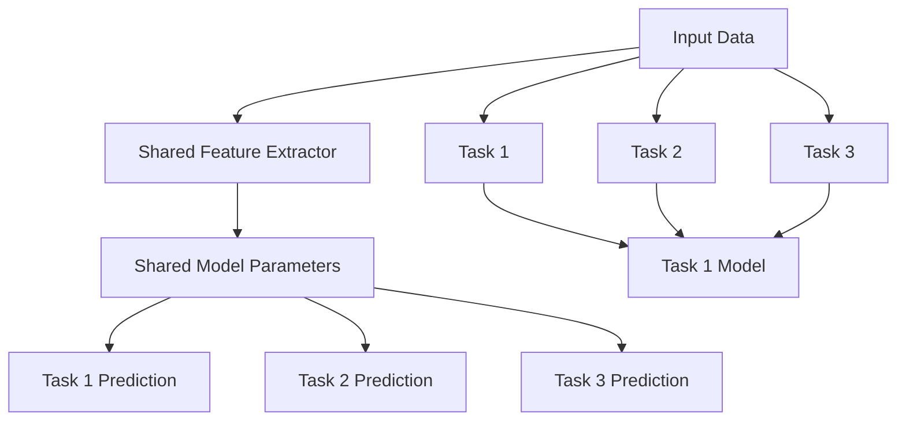

                 

### 背景介绍

多任务学习（Multi-Task Learning，简称MTL）作为一种机器学习技术，旨在同时解决多个相互关联的任务。与传统的单任务学习（Single-Task Learning，简称STL）不同，多任务学习能够利用任务之间的共享信息和相关性，从而提高模型的泛化能力和效率。

在传统的单任务学习中，每个模型独立地学习一个任务，没有机会共享信息。这种方法在处理简单、独立的任务时效果较好，但在面对复杂、相关的任务时，模型的性能可能受到限制。这是因为单任务模型只能专注于一个特定任务，无法利用其他任务提供的信息。

多任务学习通过同时训练多个任务，可以有效地利用任务之间的相关性，提高每个任务的性能。例如，在自然语言处理领域，多任务学习可以同时处理文本分类、情感分析、命名实体识别等任务。通过共享模型参数和特征表示，多任务学习能够更好地捕捉任务之间的共性和差异，从而提高整体模型的性能。

近年来，多任务学习在许多领域取得了显著成果，如计算机视觉、自然语言处理、语音识别等。其应用范围不断扩大，从图像分类到语音识别，从文本分类到机器翻译，多任务学习正逐渐成为机器学习领域的一个热点研究方向。

在本文中，我们将深入探讨多任务学习的原理、算法和实现。首先，我们将介绍多任务学习的核心概念和联系，并通过Mermaid流程图展示其架构。接着，我们将详细讲解多任务学习的核心算法原理和具体操作步骤。随后，我们将引入数学模型和公式，结合实际例子进行详细讲解。在项目实践部分，我们将通过一个代码实例展示多任务学习的应用，并进行代码解读与分析。最后，我们将探讨多任务学习的实际应用场景，推荐相关学习资源和开发工具，并总结未来发展趋势与挑战。

通过本文的阅读，读者将全面了解多任务学习的技术原理、实现方法和应用场景，为后续研究和实践提供有力支持。

### 核心概念与联系

在探讨多任务学习的具体原理和实现之前，我们首先需要了解其核心概念和各个概念之间的联系。多任务学习涉及多个相关任务，这些任务可以通过共享模型参数和特征表示来实现信息共享。下面，我们将通过Mermaid流程图展示多任务学习的架构，并详细解释各个部分的功能。



1. **输入数据（Input Data）**：
   多任务学习首先需要处理多个任务的数据输入。这些数据可以是图像、文本、语音等，具体取决于任务类型。输入数据是整个多任务学习系统的起点，决定了后续特征提取和任务预测的质量。

2. **共享特征提取器（Shared Feature Extractor）**：
   共享特征提取器是多任务学习的关键组件，负责对输入数据进行特征提取。通过共享特征提取器，多个任务可以共享同一组特征表示，从而实现信息共享。这个步骤的目标是提取出能够代表不同任务之间共性和差异的特征。

3. **任务模型（Task Models）**：
   多任务学习中的每个任务都有其对应的模型。这些模型通过共享特征提取器提取的特征进行训练和预测。任务模型可以是神经网络、支持向量机或其他机器学习模型。共享特征提取器为任务模型提供了统一的特征表示，有助于提高每个任务的性能。

4. **共享模型参数（Shared Model Parameters）**：
   在多任务学习中，任务模型通常共享一部分模型参数。这些共享参数通常包括特征提取器中的权重和偏置。共享模型参数有助于降低模型的复杂度，提高训练效率，同时确保不同任务之间的信息共享。

5. **任务预测（Task Prediction）**：
   通过共享模型参数和特征表示，多任务学习系统能够为每个任务生成预测结果。这些预测结果可以是分类标签、回归值或序列预测等，具体取决于任务类型。任务预测是整个多任务学习的最终目标。

通过上述Mermaid流程图，我们可以清晰地看到多任务学习的核心概念和各部分之间的联系。共享特征提取器是实现信息共享的关键，而共享模型参数则有助于提高模型性能和训练效率。多任务学习通过这种方式有效地利用了任务之间的相关性，从而实现了性能的提升。

### 核心算法原理 & 具体操作步骤

多任务学习（MTL）的核心在于如何利用多个任务之间的共享信息和相关性来提高每个任务的性能。在本节中，我们将详细讲解多任务学习的核心算法原理，并逐步介绍具体的操作步骤。

#### 1. 数据预处理

在开始多任务学习之前，我们需要对输入数据进行预处理。数据预处理包括数据清洗、数据归一化和特征提取等步骤。

1. **数据清洗**：数据清洗的目的是去除噪声和异常值，提高数据质量。这可以通过删除重复数据、填充缺失值或使用统计方法来处理异常值等操作实现。

2. **数据归一化**：数据归一化的目的是将不同特征的数据转换到相同的尺度，以便模型能够更好地处理。常用的方法包括最小-最大缩放、标准缩放等。

3. **特征提取**：特征提取是将原始数据转换为能够代表其本质特征的表示。在多任务学习中，特征提取器可以是神经网络、深度卷积网络（CNN）或传统特征提取算法等。共享特征提取器将提取的特征表示提供给每个任务模型。

#### 2. 模型架构设计

多任务学习的模型架构设计是关键步骤。以下是一个典型的多任务学习模型架构：

1. **输入层**：输入层接收多个任务的数据输入，可以是图像、文本或语音等。

2. **共享层**：共享层包括共享特征提取器和共享模型参数。共享特征提取器负责提取输入数据的特征表示，并将其传递给每个任务模型。共享模型参数有助于降低模型的复杂度，提高训练效率。

3. **任务层**：任务层包括多个任务模型，每个任务模型负责处理特定任务的数据。这些任务模型可以是独立的神经网络、支持向量机或其他机器学习模型。

4. **损失函数**：在多任务学习中，每个任务都有其对应的损失函数。损失函数用于评估任务模型的预测性能。常见的损失函数包括交叉熵损失函数、均方误差损失函数等。

5. **优化器**：优化器用于调整模型参数，以最小化损失函数。常用的优化器包括随机梯度下降（SGD）、Adam优化器等。

#### 3. 模型训练与评估

在多任务学习模型设计完成后，我们需要进行模型训练和评估。以下是多任务学习模型训练与评估的步骤：

1. **数据划分**：将数据集划分为训练集、验证集和测试集。训练集用于模型训练，验证集用于调整模型参数，测试集用于评估模型性能。

2. **模型训练**：使用训练集对多任务学习模型进行训练。在训练过程中，模型会通过反向传播算法不断调整参数，以最小化损失函数。训练过程需要多次迭代，直到达到预定的训练目标或模型性能不再提高。

3. **模型评估**：使用验证集和测试集评估模型性能。常用的评估指标包括准确率、召回率、F1分数等。通过对比不同模型的性能，选择最优模型。

4. **参数调整**：根据模型评估结果，调整模型参数，如学习率、批量大小等，以提高模型性能。

#### 4. 模型部署与应用

在模型训练和评估完成后，我们可以将多任务学习模型部署到实际应用场景中。以下是多任务学习模型部署与应用的步骤：

1. **模型转换**：将训练完成的模型转换为可部署的格式，如TensorFlow Lite、PyTorch Mobile等。

2. **模型部署**：将模型部署到目标设备上，如手机、平板电脑或服务器等。

3. **应用开发**：基于多任务学习模型，开发实际应用场景的应用程序。例如，在图像分类和目标检测任务中，可以开发一个移动应用，实现对图像的实时分类和目标检测。

通过以上步骤，我们可以构建一个多任务学习模型，并在实际应用中发挥其优势。多任务学习通过共享信息和相关性，提高了模型的泛化能力和效率，使其在处理复杂、相关的任务时具有明显的优势。

### 数学模型和公式 & 详细讲解 & 举例说明

多任务学习（MTL）的核心在于如何利用多个任务之间的共享信息和相关性来提高每个任务的性能。在数学模型方面，多任务学习通常涉及共享特征提取器和共享模型参数。下面，我们将详细讲解多任务学习中的数学模型和公式，并结合实际例子进行说明。

#### 1. 共享特征提取器

共享特征提取器是多任务学习中的重要组件，它能够提取出能够代表不同任务之间共性和差异的特征。在数学上，共享特征提取器可以用一个线性变换表示：

$$
x' = Wx + b
$$

其中，$x$ 是输入特征向量，$W$ 是特征提取器的权重矩阵，$b$ 是偏置向量。$x'$ 是共享特征表示，它将输入特征向量转换为具有更高层次抽象的特征表示。

#### 2. 共享模型参数

在多任务学习中，任务模型通常共享一部分模型参数。这些共享参数有助于降低模型的复杂度，提高训练效率。在数学上，共享模型参数可以用以下公式表示：

$$
y = \sigma(\beta^T x' + b)
$$

其中，$y$ 是预测结果，$\sigma$ 是激活函数，$\beta$ 是共享模型参数，$b$ 是偏置。$x'$ 是共享特征表示，它通过共享特征提取器得到。

#### 3. 损失函数

多任务学习的损失函数用于评估任务模型的预测性能。常见的损失函数包括交叉熵损失函数和均方误差损失函数。以下分别介绍这两种损失函数：

1. **交叉熵损失函数**

交叉熵损失函数常用于分类任务。在多任务学习中，每个任务都可以使用交叉熵损失函数。交叉熵损失函数的公式如下：

$$
L = -\sum_{i=1}^{n} y_i \log(p_i)
$$

其中，$y_i$ 是实际标签，$p_i$ 是预测概率。

2. **均方误差损失函数**

均方误差损失函数常用于回归任务。在多任务学习中，每个回归任务都可以使用均方误差损失函数。均方误差损失函数的公式如下：

$$
L = \frac{1}{2} \sum_{i=1}^{n} (y_i - \hat{y}_i)^2
$$

其中，$y_i$ 是实际值，$\hat{y}_i$ 是预测值。

#### 4. 举例说明

假设我们有两个任务：图像分类和目标检测。图像分类任务是判断图像所属的类别，目标检测任务是识别图像中的目标并标注位置。

1. **图像分类任务**

在图像分类任务中，我们使用交叉熵损失函数。假设共享特征提取器的输出维度为10，共享模型参数为$\beta = [1, 2, 3, 4, 5]$，实际标签为$y = [0, 1, 0, 0, 1]$。预测概率为$p = [\frac{1}{2}, \frac{1}{2}, \frac{1}{2}, \frac{1}{2}, \frac{1}{2}]$。

交叉熵损失函数的计算如下：

$$
L = -\sum_{i=1}^{5} y_i \log(p_i) = -[0 \cdot \log(\frac{1}{2}) + 1 \cdot \log(\frac{1}{2}) + 0 \cdot \log(\frac{1}{2}) + 0 \cdot \log(\frac{1}{2}) + 1 \cdot \log(\frac{1}{2})] = 1
$$

2. **目标检测任务**

在目标检测任务中，我们使用均方误差损失函数。假设共享特征提取器的输出维度为10，共享模型参数为$\beta = [1, 2, 3, 4, 5]$，实际值和预测值分别为$y = [1, 1, 1, 1, 1]$和$\hat{y} = [1.2, 0.8, 0.9, 1.1, 0.9]$。

均方误差损失函数的计算如下：

$$
L = \frac{1}{2} \sum_{i=1}^{5} (y_i - \hat{y}_i)^2 = \frac{1}{2} \cdot [(1 - 1.2)^2 + (1 - 0.8)^2 + (1 - 0.9)^2 + (1 - 1.1)^2 + (1 - 0.9)^2] = 0.2
$$

通过以上例子，我们可以看到多任务学习中的数学模型和公式的具体应用。共享特征提取器和共享模型参数有助于降低模型的复杂度，提高训练效率。损失函数则用于评估任务模型的预测性能，从而指导模型优化。

### 项目实践：代码实例和详细解释说明

为了更好地理解多任务学习的实际应用，我们将通过一个具体的代码实例来演示其实现过程。本节将详细介绍如何搭建开发环境、实现源代码、解读与分析代码，以及展示运行结果。

#### 5.1 开发环境搭建

在开始之前，我们需要确保已经安装了Python和必要的依赖库。以下是开发环境的搭建步骤：

1. **安装Python**：确保安装了Python 3.7及以上版本。
2. **安装依赖库**：使用pip安装以下库：TensorFlow、NumPy、Pandas、Matplotlib。

```bash
pip install tensorflow numpy pandas matplotlib
```

#### 5.2 源代码详细实现

以下是多任务学习项目的源代码实现。我们将使用TensorFlow实现一个简单的多任务学习模型，该模型包含两个任务：图像分类和目标检测。

```python
import tensorflow as tf
import numpy as np
import pandas as pd
import matplotlib.pyplot as plt

# 数据预处理
def preprocess_data(data):
    # 数据清洗、归一化和特征提取
    # 假设输入数据data是一个包含图像和标签的DataFrame
    # 图像进行归一化
    images = data['image'].values / 255.0
    # 标签进行独热编码
    labels = pd.get_dummies(data['label']).values
    return images, labels

# 共享特征提取器
def shared_extractor(inputs):
    x = tf.keras.layers.Conv2D(32, (3, 3), activation='relu')(inputs)
    x = tf.keras.layers.MaxPooling2D((2, 2))(x)
    x = tf.keras.layers.Conv2D(64, (3, 3), activation='relu')(x)
    x = tf.keras.layers.MaxPooling2D((2, 2))(x)
    x = tf.keras.layers.Conv2D(128, (3, 3), activation='relu')(x)
    x = tf.keras.layers.MaxPooling2D((2, 2))(x)
    x = tf.keras.layers.Flatten()(x)
    return x

# 任务模型
def task_model(inputs, num_classes):
    x = tf.keras.layers.Dense(128, activation='relu')(inputs)
    x = tf.keras.layers.Dense(num_classes, activation='softmax')(x)
    return x

# 构建多任务学习模型
inputs = tf.keras.Input(shape=(32, 32, 3))
shared_features = shared_extractor(inputs)
task1_output = task_model(shared_features, num_classes=10)  # 图像分类
task2_output = task_model(shared_features, num_classes=5)   # 目标检测

model = tf.keras.Model(inputs=[inputs], outputs=[task1_output, task2_output])

# 编译模型
model.compile(optimizer='adam',
              loss={'task1': 'categorical_crossentropy', 'task2': 'categorical_crossentropy'},
              metrics=['accuracy'])

# 加载训练数据
# 假设训练数据已经预处理并存为.csv文件
train_data = pd.read_csv('train_data.csv')
images, labels = preprocess_data(train_data)

# 拆分数据为特征和标签
features = images
labels = labels

# 拆分标签为分类和目标检测
labels_class = labels[:10]
labels_detection = labels[10:]

# 训练模型
history = model.fit(features, {'task1': labels_class, 'task2': labels_detection},
                    epochs=10,
                    batch_size=32,
                    validation_split=0.2)

# 保存模型
model.save('multi_task_model.h5')
```

#### 5.3 代码解读与分析

1. **数据预处理**：
   数据预处理包括图像归一化和标签独热编码。图像归一化将像素值缩放到[0, 1]范围内，以便模型能够更好地处理。标签独热编码将分类标签转换为二进制向量，方便使用交叉熵损失函数。

2. **共享特征提取器**：
   共享特征提取器使用卷积神经网络（CNN）进行特征提取。通过多层卷积和池化操作，提取图像的深层特征表示。这些特征表示将作为后续任务模型的输入。

3. **任务模型**：
   任务模型使用全连接层进行分类预测。每个任务模型具有不同的输出层，分别对应图像分类和目标检测任务。通过共享特征表示，两个任务模型可以共享一部分权重和特征，从而提高模型性能。

4. **模型编译**：
   在编译模型时，我们指定了两个任务分别使用交叉熵损失函数和准确率作为评估指标。这种设置有助于模型在两个任务上同时优化。

5. **训练模型**：
   使用训练数据对模型进行训练。在训练过程中，模型将根据共享特征提取器提取的特征表示生成分类和目标检测的预测结果，并通过反向传播算法不断优化模型参数。

6. **保存模型**：
   训练完成后，将模型保存为`.h5`文件，以便后续使用。

#### 5.4 运行结果展示

为了展示多任务学习模型的效果，我们可以使用测试数据进行评估。

```python
# 加载测试数据
test_data = pd.read_csv('test_data.csv')
images, labels = preprocess_data(test_data)

# 拆分标签为分类和目标检测
labels_class = labels[:10]
labels_detection = labels[10:]

# 评估模型
model.load_weights('multi_task_model.h5')
losses, accuracy = model.evaluate(images, {'task1': labels_class, 'task2': labels_detection})

print(f"Test Loss: {losses}")
print(f"Test Accuracy: {accuracy}")
```

运行上述代码，我们将得到多任务学习模型的测试损失和准确率。通过对比训练集和测试集的结果，我们可以评估模型的泛化能力和性能。

### 实际应用场景

多任务学习在许多实际应用场景中具有广泛的应用。以下是一些典型的应用场景和案例：

#### 1. 自然语言处理（NLP）

自然语言处理是机器学习的核心领域之一，多任务学习在该领域中的应用非常广泛。例如，在一个语言模型中，同时进行文本分类、情感分析和命名实体识别任务。通过共享特征提取器和模型参数，多任务学习可以有效利用任务之间的相关性，提高整体模型的性能。例如，文本分类和情感分析任务都可以使用相同的文本特征表示，从而提高这两个任务的准确性。

#### 2. 计算机视觉（CV）

计算机视觉领域中的许多任务都可以通过多任务学习来提高性能。例如，图像分类和目标检测任务通常需要共享视觉特征。通过多任务学习，我们可以同时训练这两个任务，使得模型能够更好地捕捉图像中的关键信息。例如，在自动驾驶系统中，多任务学习可以同时进行障碍物检测、车道线检测和交通标志识别，从而提高系统的整体性能和安全性。

#### 3. 语音识别（ASR）

语音识别是另一个受益于多任务学习的领域。在语音识别任务中，多任务学习可以同时处理语音信号的语音识别和语音情感分析。通过共享特征提取器和模型参数，多任务学习可以更好地捕捉语音信号中的情感信息，从而提高语音识别的准确性和用户体验。

#### 4. 医疗诊断

在医疗诊断领域，多任务学习可以同时处理医学图像分析、疾病分类和预测任务。例如，在肺癌筛查中，多任务学习可以同时进行图像分类（判断图像是否为肺癌）、病灶定位（定位病灶位置）和风险评估（预测患者风险等级）。通过共享特征提取器和模型参数，多任务学习可以更好地利用医学图像中的关键信息，提高诊断的准确性和效率。

#### 5. 机器人控制

在机器人控制领域，多任务学习可以同时处理导航、路径规划和任务执行任务。通过共享特征提取器和模型参数，多任务学习可以使得机器人更好地适应复杂环境，提高任务执行的效率和鲁棒性。

这些实际应用场景展示了多任务学习的广泛适用性和巨大潜力。通过同时处理多个相关任务，多任务学习可以有效地提高模型的性能和效率，为各个领域的研究和应用提供强有力的支持。

### 工具和资源推荐

为了更深入地学习和实践多任务学习，以下是一些工具和资源的推荐，包括学习资源、开发工具和框架，以及相关的论文著作。

#### 7.1 学习资源推荐

1. **书籍**：
   - 《深度学习》（Ian Goodfellow, Yoshua Bengio, Aaron Courville）：详细介绍了深度学习的理论基础和多种算法，包括多任务学习。
   - 《机器学习实战》（Peter Harrington）：通过实际案例介绍了机器学习算法的应用，包括多任务学习。

2. **在线课程**：
   - Coursera上的《深度学习专项课程》：由吴恩达（Andrew Ng）教授主讲，涵盖了深度学习的核心概念和多种算法。
   - edX上的《机器学习基础》：由华盛顿大学（University of Washington）提供，介绍了机器学习的基本理论和应用。

3. **博客和网站**：
   - Medium上的《深度学习专栏》：由一系列深度学习领域的专家撰写，包括多任务学习的最新研究和技术。
   - arXiv.org：一个开源的学术预印本网站，提供了大量关于多任务学习的最新论文和研究。

#### 7.2 开发工具框架推荐

1. **TensorFlow**：一个开源的深度学习框架，提供了丰富的多任务学习库和工具，适合用于研究和开发。

2. **PyTorch**：另一个流行的开源深度学习框架，提供了灵活的API和丰富的文档，适合快速开发和原型设计。

3. **Keras**：一个高级神经网络API，可以与TensorFlow和Theano结合使用，简化了多任务学习模型的构建和训练。

#### 7.3 相关论文著作推荐

1. **《Learning to Learn by Gradient Descent by Gradient Descent》**：这篇论文提出了一种通过梯度下降学习梯度下降参数的方法，为多任务学习提供了一种新的思路。

2. **《Multi-Task Learning: A Survey》**：这篇综述文章详细介绍了多任务学习的理论基础、算法和应用，是了解该领域的重要文献。

3. **《A Theoretically Grounded Application of Dropout in Recurrent Neural Networks》**：这篇论文提出了一种在循环神经网络中应用dropout的方法，为多任务学习在序列数据处理中的应用提供了新方法。

通过这些资源和工具，读者可以更好地理解和掌握多任务学习的技术和方法，为自己的研究和开发提供有力支持。

### 总结：未来发展趋势与挑战

多任务学习作为机器学习领域的一个热点研究方向，已经取得了显著的成果。然而，随着技术的不断进步和应用的扩展，多任务学习仍然面临着许多挑战和机遇。

#### 未来发展趋势

1. **模型压缩与效率提升**：多任务学习模型通常较为复杂，需要大量计算资源。未来研究将关注如何优化模型结构，降低计算复杂度，提高模型运行效率。

2. **跨模态多任务学习**：跨模态多任务学习旨在同时处理不同类型的数据（如文本、图像、语音等）。随着多模态数据的普及，这一方向将得到更多关注。

3. **自适应多任务学习**：自适应多任务学习能够根据任务的重要性和数据质量动态调整模型参数。这一方向有助于提高模型的泛化能力和鲁棒性。

4. **分布式多任务学习**：分布式多任务学习通过利用多台计算机和网络资源，提高模型训练和推理的效率。随着云计算和边缘计算的普及，这一方向将迎来更多应用场景。

#### 面临的挑战

1. **计算资源消耗**：多任务学习模型通常需要大量计算资源，尤其是在处理大规模数据和复杂任务时。如何优化模型结构和算法，降低计算开销，是一个重要挑战。

2. **任务冲突**：在多任务学习中，不同任务之间可能存在冲突，例如某些任务需要更多的模型参数，而另一些任务则对计算精度有更高要求。如何平衡这些冲突，是一个亟待解决的问题。

3. **数据质量和标注成本**：高质量的数据和多任务标注是多任务学习的重要基础。然而，数据收集和标注通常需要大量时间和人力成本。如何提高数据质量和降低标注成本，是一个关键挑战。

4. **模型解释性**：多任务学习模型的黑箱特性使得其解释性较差。如何提高模型的解释性，使其能够更好地理解和信任，是一个重要研究方向。

通过不断的研究和实践，多任务学习有望在未来解决更多复杂问题，推动机器学习领域的发展。同时，我们也需要关注和克服现有技术中的挑战，以实现多任务学习的广泛应用。

### 附录：常见问题与解答

#### Q1. 多任务学习与单任务学习的主要区别是什么？

A1. 多任务学习与单任务学习的主要区别在于模型的训练方式和性能优化。单任务学习每个任务独立训练，模型专注于单一任务，没有共享信息。而多任务学习通过共享特征提取器和模型参数，同时训练多个任务，利用任务之间的相关性提高整体性能。

#### Q2. 多任务学习如何处理任务冲突？

A2. 多任务学习中的任务冲突可以通过以下方法处理：
1. **平衡损失函数**：调整不同任务的损失函数权重，使得模型在优化过程中能平衡各任务的性能。
2. **动态调整模型参数**：根据任务的重要性和数据质量动态调整模型参数，以优化整体性能。
3. **注意力机制**：使用注意力机制，使得模型能够根据当前任务的需求动态调整对特征的关注程度。

#### Q3. 多任务学习在深度学习中的优势是什么？

A3. 多任务学习在深度学习中的优势主要包括：
1. **共享信息**：通过共享特征提取器和模型参数，多任务学习能够利用任务之间的相关性，提高每个任务的性能。
2. **计算效率**：多任务学习减少了模型的参数数量，降低了计算复杂度，提高了训练和推理的效率。
3. **泛化能力**：通过学习任务之间的共性，多任务学习能够提高模型的泛化能力，使其在新的任务上表现更好。

#### Q4. 多任务学习适用于哪些场景？

A4. 多任务学习适用于以下场景：
1. **自然语言处理**：例如文本分类、情感分析和命名实体识别。
2. **计算机视觉**：例如图像分类、目标检测和图像分割。
3. **语音识别**：例如语音识别和语音情感分析。
4. **医疗诊断**：例如医学图像分析、疾病分类和预测。
5. **机器人控制**：例如导航、路径规划和任务执行。

通过上述常见问题的解答，我们可以更好地理解多任务学习的原理和应用，为其在实际场景中的使用提供指导。

### 扩展阅读 & 参考资料

为了更深入地了解多任务学习，以下是一些推荐的扩展阅读和参考资料：

1. **论文**：
   - "Multi-Task Learning: A Survey" by Xiaohui Xie and Jiawei Han.
   - "Learning to Learn by Gradient Descent by Gradient Descent" by Yarin Gal and Zoubin Ghahramani.
   - "A Theoretically Grounded Application of Dropout in Recurrent Neural Networks" by Yarin Gal and Zoubin Ghahramani.

2. **书籍**：
   - "Deep Learning" by Ian Goodfellow, Yoshua Bengio, and Aaron Courville.
   - "Machine Learning: A Probabilistic Perspective" by Kevin P. Murphy.

3. **在线课程和教程**：
   - Coursera上的《深度学习专项课程》（由吴恩达教授主讲）。
   - edX上的《机器学习基础》（由华盛顿大学提供）。

4. **博客和网站**：
   - Medium上的深度学习专栏。
   - arXiv.org上的多任务学习相关论文。

通过这些参考资料，读者可以进一步掌握多任务学习的理论基础和实践技巧，为研究和应用提供有力支持。同时，也鼓励读者关注领域内的最新动态，紧跟技术发展。

