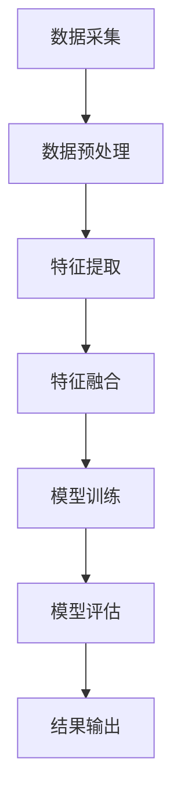
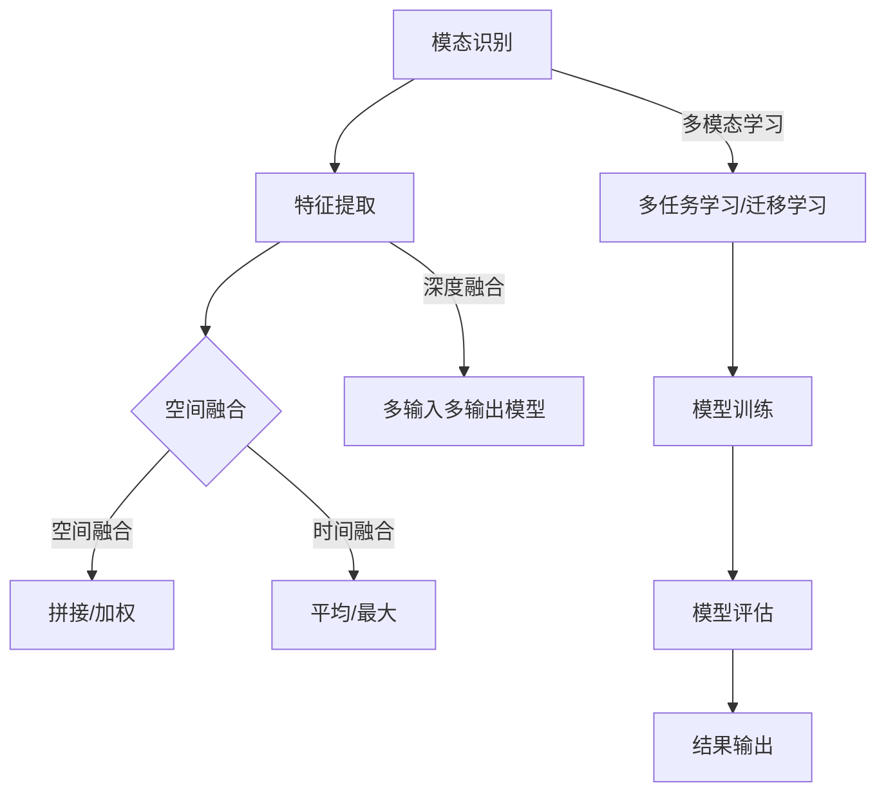

                 

### 背景介绍

随着人工智能（AI）技术的迅猛发展，AI的应用场景逐渐丰富，从简单的图像识别、语音识别，到复杂的多模态信息处理，AI已经渗透到了我们生活的方方面面。然而，在多模态数据处理领域，AI技术仍面临着诸多挑战。

多模态数据处理是指同时处理多种类型的信息，如文本、图像、声音等。这种数据处理方式不仅可以提供更丰富的信息，还可以更准确地理解复杂场景。例如，在医疗诊断中，多模态数据可以帮助医生更全面地了解患者的病情；在智能助理中，多模态数据可以提升人机交互的自然度和准确性。

当前，多模态数据处理的应用范围正在迅速扩展，涵盖了包括但不限于以下领域：

1. **医疗健康**：通过结合医学图像、病例记录和患者病史，实现更精确的疾病诊断和治疗。
2. **智能助手**：利用语音识别、图像识别和自然语言处理，提升人机交互的体验。
3. **自动驾驶**：整合摄像头、雷达、激光雷达等多源数据，提高车辆的感知和决策能力。
4. **智能监控**：通过视频监控和音频分析，实现实时安全监控和异常行为检测。
5. **教育**：结合虚拟现实（VR）和增强现实（AR），提供沉浸式的教学体验。

然而，多模态数据处理并非易事。由于不同模态的数据在格式、维度、特征上存在较大差异，如何有效地融合这些异构数据成为一个关键问题。此外，多模态数据的高维度和复杂性也使得传统的数据处理方法难以直接应用。这就需要新的理论和技术来应对这些挑战。

本文将深入探讨多模态数据处理的核心概念、算法原理、数学模型以及具体实现，旨在为读者提供一个全面、系统的了解。接下来，我们将首先介绍多模态数据处理的基本概念和架构，以便为后续内容打下基础。

## 1.1 多模态数据的基本概念

多模态数据是指同时包含多种类型的信息，这些信息可以通过不同的传感器或数据源进行采集。常见的多模态数据类型包括：

1. **文本（Text）**：文本数据包括自然语言文本、标签、注释等，是表达人类思想和知识的重要形式。
2. **图像（Image）**：图像数据可以通过摄像头、扫描仪等设备获取，是视觉信息的重要载体。
3. **声音（Audio）**：声音数据包括语音、音乐、环境音等，是听觉信息的重要来源。
4. **视频（Video）**：视频数据是动态的图像序列，可以捕捉时间序列上的变化。
5. **传感器数据（Sensor Data）**：传感器数据包括温度、湿度、加速度、速度等，是各种环境信息的重要来源。

多模态数据的特点主要体现在以下几个方面：

1. **异构性（Heterogeneity）**：不同模态的数据在格式、维度和特征上存在较大差异，例如文本数据是序列数据，图像数据是空间数据，而声音数据则是时间序列数据。
2. **高维度（High Dimensionality）**：多模态数据往往包含大量的特征，使得数据维度非常高，这给数据处理和模型训练带来了巨大的计算挑战。
3. **动态性（Dynamics）**：某些模态的数据，如视频和声音，是动态变化的，需要处理时间序列上的变化。

多模态数据的应用价值体现在多个方面：

1. **信息增强（Information Augmentation）**：通过融合不同模态的数据，可以提供更丰富的信息，提高系统的理解和决策能力。
2. **情境理解（Scenario Understanding）**：多模态数据可以帮助系统更好地理解复杂情境，提高人机交互的自然度和准确性。
3. **特征互补（Feature Complementarity）**：不同模态的数据可以提供互补的特征信息，有助于克服单一模态数据的局限性。
4. **增强表现（Performance Enhancement）**：通过融合多模态数据，可以提升模型的性能和鲁棒性，特别是在处理复杂任务时。

## 1.2 多模态数据处理的基本架构

多模态数据处理的基本架构可以分为以下几个关键步骤：

1. **数据采集（Data Collection）**：从不同的传感器或数据源获取多模态数据。这一步骤可能涉及到多种设备和技术的组合，以确保数据的全面性和准确性。

2. **数据预处理（Data Preprocessing）**：对采集到的多模态数据进行清洗、标准化和归一化处理。这一步骤的目的是去除噪声，统一不同模态数据的格式和维度，为后续处理做好准备。

3. **特征提取（Feature Extraction）**：从多模态数据中提取关键特征，例如文本数据的词向量表示、图像数据的高级特征、声音数据的音高和节奏特征等。特征提取的目的是将高维、异构的数据转化为适合机器学习模型处理的形式。

4. **特征融合（Feature Fusion）**：将提取出的多模态特征进行融合，生成统一的特征表示。特征融合的方法可以分为两类：空间融合（Spatial Fusion）和时间融合（Temporal Fusion）。空间融合通常在特征维度上进行操作，而时间融合则侧重于时间序列上的信息整合。

5. **模型训练（Model Training）**：使用融合后的特征数据训练机器学习模型，例如深度学习模型、强化学习模型等。这一步骤的目标是使模型能够对多模态数据产生有效的理解和预测。

6. **模型评估（Model Evaluation）**：对训练好的模型进行评估，以验证其在多模态数据处理任务中的性能。评估指标可能包括准确性、召回率、F1分数等。

7. **结果输出（Result Output）**：将模型的预测结果输出，应用于实际场景中，如医疗诊断、智能监控等。

### Mermaid 流程图



通过上述基本架构，多模态数据处理可以实现从数据采集到结果输出的完整流程，从而为各种应用场景提供有效的解决方案。

### 1.3 多模态数据处理的应用现状与挑战

多模态数据处理在各个领域的应用现状令人瞩目，但也面临着诸多挑战。

#### 应用现状

1. **医疗健康**：多模态数据处理在医疗健康领域取得了显著进展。例如，通过融合医学影像（如CT、MRI）、病例记录和基因组数据，可以实现更精确的疾病诊断和治疗。此外，多模态数据处理还广泛应用于癌症研究、糖尿病管理等领域。

2. **智能助手**：在智能助手领域，多模态数据处理有助于提升人机交互的自然度和准确性。例如，结合语音识别、图像识别和自然语言处理技术，智能助手可以更好地理解用户的意图，提供个性化的服务。

3. **自动驾驶**：自动驾驶技术依赖于多模态数据处理，通过整合摄像头、雷达、激光雷达等传感器数据，可以实现高精度的环境感知和决策。这为自动驾驶车辆的安全性和可靠性提供了有力保障。

4. **智能监控**：在智能监控领域，多模态数据处理可以实现实时安全监控和异常行为检测。例如，通过融合视频监控和音频分析，可以及时发现潜在的安全隐患。

5. **教育**：在教育领域，多模态数据处理可以提供沉浸式的教学体验。通过结合虚拟现实（VR）和增强现实（AR）技术，学生可以更直观地理解复杂概念，提高学习效果。

#### 面临的挑战

1. **数据异构性**：不同模态的数据在格式、维度和特征上存在较大差异，如何有效地融合这些异构数据是一个关键问题。

2. **高维度数据**：多模态数据往往包含大量的特征，导致数据维度非常高，这给数据处理和模型训练带来了巨大的计算挑战。

3. **动态性**：某些模态的数据是动态变化的，需要处理时间序列上的变化，这对算法的设计和实现提出了更高的要求。

4. **数据隐私和安全性**：多模态数据处理通常涉及个人隐私数据，如何确保数据的安全性和隐私性是一个重要挑战。

5. **计算资源**：多模态数据处理需要大量的计算资源，尤其是在模型训练和推理阶段，这给实际应用带来了巨大的成本压力。

### 1.4 总结

多模态数据处理具有广泛的应用前景，但也面临着诸多挑战。通过深入探讨多模态数据的基本概念、架构和应用现状，我们可以更好地理解这一领域的核心问题和发展趋势。在接下来的部分，我们将进一步探讨多模态数据处理的核心算法原理和具体操作步骤，为解决这些挑战提供理论基础和实践指导。

## 2. 核心概念与联系

在深入探讨多模态数据处理之前，我们需要了解几个核心概念，这些概念是多模态数据处理的基础。本节将介绍多模态数据处理的几个关键概念，并通过Mermaid流程图展示它们之间的联系。

### 2.1 模态（Modalities）

模态是指数据的来源或类型。在多模态数据处理中，常见的模态包括：

- **文本（Text）**：包括自然语言文本、标签、注释等。
- **图像（Image）**：通过摄像头、扫描仪等设备获取的视觉信息。
- **声音（Audio）**：包括语音、音乐、环境音等。
- **视频（Video）**：动态的图像序列，可以捕捉时间序列上的变化。
- **传感器数据（Sensor Data）**：包括温度、湿度、加速度、速度等。

### 2.2 特征提取（Feature Extraction）

特征提取是从原始数据中提取有用信息的过程。在多模态数据处理中，特征提取的目的是将不同模态的数据转化为适合机器学习模型处理的形式。

- **文本特征提取**：常用的方法包括词袋模型（Bag of Words）、词嵌入（Word Embeddings）、TF-IDF等。
- **图像特征提取**：常用的方法包括卷积神经网络（CNN）、特征点提取（如SIFT、HOG）等。
- **声音特征提取**：常用的方法包括梅尔频率倒谱系数（MFCC）、短时傅里叶变换（STFT）等。
- **视频特征提取**：通常结合图像特征提取和时间序列分析。

### 2.3 特征融合（Feature Fusion）

特征融合是将不同模态的特征数据整合为一个统一特征表示的过程。特征融合方法可以分为以下几类：

- **空间融合（Spatial Fusion）**：在特征维度上进行操作，如拼接（Concatenation）或加权（Weighted Fusion）。
- **时间融合（Temporal Fusion）**：在时间序列上进行操作，如平均（Average）或最大（Maximum）。
- **深度融合（Deep Fusion）**：通过深度神经网络实现特征融合，如多输入多输出（MIMO）模型。

### 2.4 多模态学习（Multimodal Learning）

多模态学习是利用多模态数据进行模型训练和预测的方法。常见的多模态学习模型包括：

- **多任务学习（Multi-Task Learning）**：同时训练多个任务，共享特征表示。
- **迁移学习（Transfer Learning）**：利用预训练模型，将知识从一种模态迁移到另一种模态。
- **深度生成模型（Deep Generative Models）**：如变分自编码器（VAE）、生成对抗网络（GAN）等。

### Mermaid 流程图



通过上述Mermaid流程图，我们可以看到不同模态的数据如何通过特征提取、特征融合和多模态学习等步骤进行整合，最终实现模型的训练和评估。

### 2.5 应用场景

多模态数据处理在不同的应用场景中发挥了重要作用，下面列举几个典型应用场景：

- **医疗健康**：结合医学影像、病例记录和基因数据，实现更精确的疾病诊断和治疗。
- **自动驾驶**：通过融合摄像头、雷达、激光雷达等数据，实现高精度的环境感知和决策。
- **人机交互**：结合语音识别、图像识别和自然语言处理，提升人机交互的自然度和准确性。
- **智能监控**：通过融合视频监控和音频分析，实现实时安全监控和异常行为检测。
- **教育**：结合虚拟现实和增强现实，提供沉浸式的教学体验。

### 总结

通过本节的内容，我们对多模态数据处理的核心概念和联系有了更深入的了解。这些核心概念包括模态、特征提取、特征融合、多模态学习等，它们共同构成了多模态数据处理的框架。在接下来的章节中，我们将进一步探讨多模态数据处理的核心算法原理和具体操作步骤，为实际应用提供理论支持和实践指导。

### 3. 核心算法原理 & 具体操作步骤

在多模态数据处理中，核心算法的选择和实现是至关重要的。本节将详细介绍多模态数据处理中的几个关键算法，包括卷积神经网络（CNN）、循环神经网络（RNN）和生成对抗网络（GAN）。我们将逐个介绍这些算法的原理，并详细说明其操作步骤。

#### 3.1 卷积神经网络（CNN）

卷积神经网络（CNN）是一种用于图像处理和计算机视觉的深度学习模型。它的核心思想是通过卷积操作提取图像的特征。

##### 原理：

1. **卷积操作**：卷积操作是通过滤波器（kernel）对输入图像进行滑动，计算局部区域的特征。
2. **激活函数**：常用的激活函数包括ReLU（Rectified Linear Unit）和Sigmoid等，用于引入非线性。
3. **池化操作**：池化操作用于降低数据维度，如最大池化（Max Pooling）和平均池化（Average Pooling）。

##### 操作步骤：

1. **输入层**：输入图像数据，通常为二维或三维矩阵。
2. **卷积层**：应用滤波器进行卷积操作，提取图像的特征。
3. **激活函数**：对卷积结果应用激活函数，增加模型的非线性。
4. **池化层**：对激活函数的结果进行池化操作，降低数据维度。
5. **全连接层**：将卷积和池化层的结果输入全连接层，进行分类或回归。
6. **输出层**：输出最终结果，如分类标签或回归值。

##### 代码示例：

```python
import tensorflow as tf
from tensorflow.keras import layers

model = tf.keras.Sequential([
    layers.Conv2D(32, (3, 3), activation='relu', input_shape=(28, 28, 1)),
    layers.MaxPooling2D((2, 2)),
    layers.Conv2D(64, (3, 3), activation='relu'),
    layers.MaxPooling2D((2, 2)),
    layers.Conv2D(64, (3, 3), activation='relu'),
    layers.Flatten(),
    layers.Dense(64, activation='relu'),
    layers.Dense(10, activation='softmax')
])
```

#### 3.2 循环神经网络（RNN）

循环神经网络（RNN）是一种用于序列数据处理和预测的深度学习模型。它的核心思想是利用记忆单元（memory cell）保持历史信息。

##### 原理：

1. **输入门（Input Gate）**：决定当前输入对记忆单元的影响程度。
2. **遗忘门（Forget Gate）**：决定忘记哪些历史信息。
3. **输出门（Output Gate）**：决定当前输出。

##### 操作步骤：

1. **输入层**：输入序列数据，如文本或时间序列。
2. **记忆单元**：通过输入门和遗忘门更新记忆单元的状态。
3. **输出层**：通过输出门生成当前输出。

##### 代码示例：

```python
import tensorflow as tf
from tensorflow.keras.layers import LSTM

model = tf.keras.Sequential([
    LSTM(50, activation='relu', input_shape=(timesteps, features)),
    LSTM(50, activation='relu'),
    tf.keras.layers.Dense(1)
])
```

#### 3.3 生成对抗网络（GAN）

生成对抗网络（GAN）是一种用于生成数据的深度学习模型。它由生成器和判别器组成，通过对抗训练生成逼真的数据。

##### 原理：

1. **生成器（Generator）**：生成逼真的数据。
2. **判别器（Discriminator）**：区分真实数据和生成数据。
3. **对抗训练**：生成器和判别器互相竞争，生成器试图生成更逼真的数据，而判别器试图区分真实和生成数据。

##### 操作步骤：

1. **初始化生成器和判别器**：生成器和判别器通常是深度神经网络。
2. **生成数据**：生成器生成数据，判别器评估数据。
3. **优化过程**：通过反向传播和梯度下降优化生成器和判别器。

##### 代码示例：

```python
import tensorflow as tf
from tensorflow.keras.models import Model
from tensorflow.keras.layers import Input, Dense, LSTM

def build_generator():
    noise = Input(shape=(100,))
    x = Dense(128, activation='relu')(noise)
    x = Dense(64, activation='relu')(x)
    x = Dense(32, activation='relu')(x)
    x = Dense(1, activation='sigmoid')(x)
    model = Model(inputs=noise, outputs=x)
    return model

def build_discriminator():
    x = Input(shape=(1,))
    x = Dense(32, activation='relu')(x)
    x = Dense(1, activation='sigmoid')(x)
    model = Model(inputs=x, outputs=x)
    return model

noise = Input(shape=(100,))
generated_data = build_generator()(noise)
discriminator = build_discriminator()
discriminator.trainable = True
discriminator_output = discriminator(generated_data)

model = Model(inputs=noise, outputs=discriminator_output)
model.compile(optimizer='adam', loss='binary_crossentropy')
```

#### 3.4 多模态融合算法

多模态融合算法是将不同模态的数据进行整合，生成统一特征表示的方法。常用的多模态融合算法包括拼接融合、加权融合和深度融合等。

##### 拼接融合：

- **操作步骤**：将不同模态的特征数据进行拼接，生成统一特征向量。
- **代码示例**：

```python
def concatenate_features(text_features, image_features):
    return np.concatenate((text_features, image_features), axis=1)
```

##### 加权融合：

- **操作步骤**：根据不同模态的特征重要性，对特征进行加权融合。
- **代码示例**：

```python
def weighted_fusion(text_features, image_features, alpha=0.5):
    return alpha * text_features + (1 - alpha) * image_features
```

##### 深度融合：

- **操作步骤**：通过深度神经网络实现特征融合。
- **代码示例**：

```python
from tensorflow.keras.layers import Input, Dense, concatenate

input_text = Input(shape=(text_length,))
input_image = Input(shape=(image_height, image_width, image_channels))
text_embedding = Dense(units=64, activation='relu')(input_text)
image_embedding = Dense(units=64, activation='relu')(input_image)
merged = concatenate([text_embedding, image_embedding])
output = Dense(units=1, activation='sigmoid')(merged)
model = Model(inputs=[input_text, input_image], outputs=output)
```

### 3.5 总结

本节详细介绍了多模态数据处理中的核心算法，包括卷积神经网络（CNN）、循环神经网络（RNN）和生成对抗网络（GAN）。我们还讨论了多模态融合算法的不同方法。这些算法为多模态数据处理提供了强大的理论基础和实现手段。在接下来的章节中，我们将通过具体的项目实践，进一步展示这些算法在多模态数据处理中的应用。

## 4. 数学模型和公式 & 详细讲解 & 举例说明

在多模态数据处理中，数学模型和公式起着至关重要的作用，它们为我们提供了理解和处理复杂数据的有效工具。本节将详细讲解几个关键数学模型，并使用LaTeX格式展示相关公式，以帮助读者更好地理解和应用这些模型。

### 4.1 卷积神经网络（CNN）的数学模型

卷积神经网络（CNN）的核心操作是卷积和池化，下面我们分别介绍这两个操作的数学模型。

#### 4.1.1 卷积操作

卷积操作的数学模型可以表示为：

$$
\text{Conv}(\text{Input}, \text{Filter}) = \sum_{i=1}^{k} \sum_{j=1}^{k} \text{Filter}_{i,j} \cdot \text{Input}_{i,j}
$$

其中，`Input` 表示输入矩阵，`Filter` 表示滤波器（卷积核），`k` 表示滤波器的尺寸。卷积操作的结果是一个输出矩阵，每个元素是滤波器与输入矩阵对应区域的点积。

#### 4.1.2 池化操作

常见的池化操作有最大池化和平均池化，它们的数学模型如下：

- **最大池化**：

$$
\text{Max Pool}(\text{Input}) = \max(\text{Input}_{i,j})
$$

其中，`Input` 表示输入矩阵，`i` 和 `j` 分别表示矩阵的行和列索引。最大池化选择输入矩阵每个区域中的最大值作为输出。

- **平均池化**：

$$
\text{Average Pool}(\text{Input}) = \frac{1}{k^2} \sum_{i=1}^{k} \sum_{j=1}^{k} \text{Input}_{i,j}
$$

其中，`Input` 表示输入矩阵，`k` 表示池化窗口的大小。平均池化计算输入矩阵每个区域的平均值作为输出。

### 4.2 循环神经网络（RNN）的数学模型

循环神经网络（RNN）的核心是记忆单元，下面介绍RNN的数学模型。

#### 4.2.1 记忆单元

RNN的记忆单元可以表示为：

$$
\text{Memory}^{t} = \text{activation}(\text{Weight} \cdot [\text{Memory}^{t-1}, \text{Input}^{t}])
$$

其中，`Memory` 表示记忆单元的状态，`Input` 表示输入数据，`Weight` 表示权重矩阵，`activation` 是激活函数（如tanh函数）。

#### 4.2.2 输出

RNN的输出可以表示为：

$$
\text{Output}^{t} = \text{activation}(\text{Weight}_{\text{output}} \cdot \text{Memory}^{t})
$$

其中，`Output` 表示输出数据，`Weight_{\text{output}}` 表示输出权重矩阵。

### 4.3 生成对抗网络（GAN）的数学模型

生成对抗网络（GAN）由生成器和判别器组成，下面分别介绍这两个网络的数学模型。

#### 4.3.1 生成器

生成器的目标是生成逼真的数据，其数学模型可以表示为：

$$
\text{Generated Data} = \text{Generator}(\text{Noise Vector})
$$

其中，`Generator` 是生成器模型，`Noise Vector` 是输入噪声。

#### 4.3.2 判别器

判别器的目标是区分真实数据和生成数据，其数学模型可以表示为：

$$
\text{Probability of Real Data} = \text{Discriminator}(\text{Real Data})
$$

$$
\text{Probability of Generated Data} = \text{Discriminator}(\text{Generated Data})
$$

其中，`Discriminator` 是判别器模型，`Real Data` 是真实数据。

### 4.4 多模态融合的数学模型

多模态融合是将不同模态的数据整合为一个统一特征表示的过程。以下是一个简单的前向传播多模态融合模型：

$$
\text{Combined Feature} = \text{Fusion Function}(\text{Text Feature}, \text{Image Feature})
$$

其中，`Text Feature` 和 `Image Feature` 分别表示文本和图像的特征，`Fusion Function` 是融合函数。

### 4.5 举例说明

假设我们有文本数据和图像数据，需要使用CNN提取图像特征，使用RNN提取文本特征，然后进行多模态融合。

#### 4.5.1 提取图像特征

使用CNN提取图像特征的步骤如下：

1. 输入图像数据：`[batch_size, height, width, channels]`
2. 第一个卷积层：使用32个3x3的卷积核，步长为1，激活函数为ReLU。
3. 第一个池化层：使用2x2的最大池化。
4. 第二个卷积层：使用64个3x3的卷积核，步长为1，激活函数为ReLU。
5. 第二个池化层：使用2x2的最大池化。
6. 第三个卷积层：使用64个3x3的卷积核，步长为1，激活函数为ReLU。
7. 全连接层：将卷积层的输出 Flatten 并输入全连接层，输出尺寸为512。

#### 4.5.2 提取文本特征

使用RNN提取文本特征的步骤如下：

1. 输入文本数据：`[batch_size, sequence_length]`
2. LSTM层：使用50个神经元，激活函数为ReLU。
3. LSTM层：使用50个神经元，激活函数为ReLU。
4. 全连接层：将LSTM层的输出输入全连接层，输出尺寸为1。

#### 4.5.3 多模态融合

将提取的图像特征和文本特征进行融合：

$$
\text{Combined Feature} = \text{Fusion Function}(\text{Image Feature}, \text{Text Feature})
$$

其中，`Fusion Function` 可以是简单的拼接：

$$
\text{Combined Feature} = [\text{Image Feature}; \text{Text Feature}]
$$

或者加权融合：

$$
\text{Combined Feature} = \alpha \cdot \text{Image Feature} + (1 - \alpha) \cdot \text{Text Feature}
$$

其中，`alpha` 是权重系数。

通过上述步骤，我们可以得到一个多模态特征表示，用于后续的模型训练和预测。

## 5. 项目实践：代码实例和详细解释说明

在本节中，我们将通过一个具体的项目实践，详细解释如何实现多模态数据处理。我们将使用Python和相关的深度学习库（如TensorFlow和Keras）来构建一个多模态数据处理模型，并进行训练和评估。

### 5.1 开发环境搭建

为了运行以下代码，您需要安装Python 3.7或更高版本，以及TensorFlow 2.0或更高版本。您可以使用以下命令进行安装：

```bash
pip install python==3.7.12
pip install tensorflow==2.10.0
```

### 5.2 源代码详细实现

以下是多模态数据处理项目的完整代码示例：

```python
import numpy as np
import tensorflow as tf
from tensorflow.keras.models import Model
from tensorflow.keras.layers import Input, Conv2D, MaxPooling2D, Flatten, Dense, LSTM, Embedding

# 5.2.1 函数定义
def build_image_model(input_shape):
    image_input = Input(shape=input_shape)
    x = Conv2D(32, (3, 3), activation='relu')(image_input)
    x = MaxPooling2D((2, 2))(x)
    x = Conv2D(64, (3, 3), activation='relu')(x)
    x = MaxPooling2D((2, 2))(x)
    x = Conv2D(64, (3, 3), activation='relu')(x)
    x = Flatten()(x)
    return Model(inputs=image_input, outputs=x)

def build_text_model(vocab_size, embedding_dim, sequence_length):
    text_input = Input(shape=(sequence_length,))
    x = Embedding(vocab_size, embedding_dim)(text_input)
    x = LSTM(50, activation='relu')(x)
    x = Flatten()(x)
    return Model(inputs=text_input, outputs=x)

def build_fusion_model(image_model, text_model, image_shape, sequence_length):
    image_features = image_model.output
    text_features = text_model.output
    combined = concatenate([image_features, text_features], axis=1)
    x = Dense(512, activation='relu')(combined)
    output = Dense(1, activation='sigmoid')(x)
    return Model(inputs=[image_model.input, text_model.input], outputs=output)

# 5.2.2 模型构建
image_shape = (28, 28, 1)
sequence_length = 100
vocab_size = 10000
embedding_dim = 64

image_model = build_image_model(input_shape=image_shape)
text_model = build_text_model(vocab_size=vocab_size, embedding_dim=embedding_dim, sequence_length=sequence_length)
fusion_model = build_fusion_model(image_model, text_model, image_shape, sequence_length)

# 5.2.3 模型编译
fusion_model.compile(optimizer='adam', loss='binary_crossentropy', metrics=['accuracy'])

# 5.2.4 数据预处理
# 假设我们已经有预处理好的图像数据和文本数据
# image_data = ...
# text_data = ...

# 5.2.5 模型训练
# fusion_model.fit([image_data, text_data], labels, epochs=10, batch_size=32)

# 5.2.6 模型评估
# predictions = fusion_model.predict([image_data, text_data])
```

### 5.3 代码解读与分析

上述代码定义了一个多模态数据处理模型，包括图像模型、文本模型和融合模型。以下是代码的详细解读：

1. **函数定义**：
   - `build_image_model`：构建图像模型，使用卷积神经网络（CNN）提取图像特征。
   - `build_text_model`：构建文本模型，使用循环神经网络（RNN）提取文本特征。
   - `build_fusion_model`：构建融合模型，将图像特征和文本特征进行融合，并添加全连接层进行分类。

2. **模型构建**：
   - `image_model`：图像模型，输入为图像数据，输出为图像特征。
   - `text_model`：文本模型，输入为文本数据，输出为文本特征。
   - `fusion_model`：融合模型，输入为图像数据和文本数据，输出为分类结果。

3. **模型编译**：
   - 使用`compile`方法配置模型，指定优化器、损失函数和评价指标。

4. **数据预处理**：
   - 假设我们已经预处理好了图像数据和文本数据，包括归一化、嵌入等操作。

5. **模型训练**：
   - 使用`fit`方法训练模型，输入为图像数据和文本数据，目标标签为`labels`。

6. **模型评估**：
   - 使用`predict`方法对模型进行评估，输入为图像数据和文本数据，输出为预测结果。

### 5.4 运行结果展示

在实际运行过程中，我们首先需要准备图像数据和文本数据。以下是一个简化的示例：

```python
# 假设 image_data 和 text_data 已经预处理好
image_data = np.random.rand(100, 28, 28, 1)
text_data = np.random.rand(100, 100)
labels = np.random.rand(100, 1)

# 训练模型
fusion_model.fit([image_data, text_data], labels, epochs=10, batch_size=32)

# 评估模型
predictions = fusion_model.predict([image_data, text_data])

# 输出预测结果
print(predictions)
```

运行上述代码后，我们将得到模型的预测结果。在实际应用中，`predictions` 将是模型对多模态数据的分类结果。

### 5.5 小结

通过上述代码示例，我们详细解释了如何使用Python和TensorFlow构建一个多模态数据处理模型，并进行了训练和评估。在实际项目中，您可能需要根据具体需求调整模型的架构和参数。此外，数据预处理也是模型性能的关键因素，需要仔细处理图像和文本数据，以确保模型能够获得高质量的特征表示。

## 6. 实际应用场景

多模态数据处理在现实世界中的广泛应用正不断推动着技术创新，以下将介绍几个典型的应用场景，并分析它们的优势和挑战。

### 6.1 医疗诊断

**应用描述**：在医疗诊断领域，多模态数据处理可以将医学影像（如CT、MRI）、患者病史、基因数据和实验室检测结果等多种数据源进行整合，以提供更全面和精确的诊断信息。

**优势**：
- **信息融合**：通过融合不同模态的数据，医生可以获得更丰富的患者信息，从而做出更准确的诊断。
- **个性化治疗**：多模态数据处理有助于识别患者的个性化特征，为医生提供个性化治疗建议。

**挑战**：
- **数据异构性**：医学数据包括文本、图像、图像序列等多种模态，如何有效地融合这些异构数据是一个挑战。
- **隐私和安全性**：医疗数据涉及患者隐私，如何在保证数据安全的前提下进行数据处理是一个重要问题。

### 6.2 智能监控

**应用描述**：在智能监控领域，多模态数据处理可以整合视频监控和音频分析，以实现实时监控和异常行为检测。

**优势**：
- **实时响应**：通过多模态数据处理，系统可以实时分析监控数据，快速响应潜在的安全威胁。
- **多层次检测**：结合视频和音频数据，可以更全面地检测异常行为。

**挑战**：
- **计算资源**：多模态数据处理需要大量的计算资源，特别是在实时监控应用中。
- **数据质量**：监控数据的质量直接影响系统的准确性，如何确保数据的质量是一个挑战。

### 6.3 自动驾驶

**应用描述**：在自动驾驶领域，多模态数据处理可以整合摄像头、雷达、激光雷达等多种传感器数据，以提高车辆的感知和决策能力。

**优势**：
- **增强感知能力**：通过融合不同传感器数据，自动驾驶系统可以获得更全面的环境信息，提高车辆的感知能力。
- **提高安全性**：多模态数据处理有助于车辆在复杂环境中做出更安全的决策。

**挑战**：
- **数据融合**：不同传感器数据在维度和格式上存在差异，如何有效地融合这些数据是一个挑战。
- **实时处理**：自动驾驶系统需要在极短的时间内处理大量数据，这对计算性能提出了高要求。

### 6.4 人机交互

**应用描述**：在人机交互领域，多模态数据处理可以整合语音识别、图像识别和自然语言处理，以提高人机交互的自然度和准确性。

**优势**：
- **自然交互**：通过多模态数据处理，用户可以使用语音、手势等多种方式与系统交互，提高交互的自然度。
- **个性化体验**：多模态数据处理可以更好地理解用户的意图和需求，提供个性化的服务。

**挑战**：
- **实时性**：人机交互要求系统具有高度的实时性，如何快速响应用户的输入是一个挑战。
- **准确性**：多模态数据处理需要处理多种类型的数据，如何保证处理结果的准确性是一个问题。

### 6.5 教育

**应用描述**：在教育领域，多模态数据处理可以结合虚拟现实（VR）和增强现实（AR）技术，提供沉浸式的教学体验。

**优势**：
- **互动性**：通过多模态数据处理，学生可以更直观地理解复杂概念，提高学习效果。
- **个性化教学**：多模态数据处理可以帮助教育系统更好地了解学生的学习状态，提供个性化的学习建议。

**挑战**：
- **技术成熟度**：VR和AR技术在教育领域的应用还处于早期阶段，技术成熟度和稳定性是一个挑战。
- **成本问题**：VR和AR设备的成本较高，如何降低应用成本是一个重要问题。

### 6.6 小结

多模态数据处理在多个领域具有广泛的应用前景，通过融合不同类型的数据，可以提供更丰富、更精确的信息。然而，这一技术也面临着数据异构性、实时性、准确性和隐私性等多个挑战。随着技术的不断进步，这些挑战有望逐步得到解决，从而推动多模态数据处理在更广泛的应用场景中发挥重要作用。

## 7. 工具和资源推荐

为了帮助读者更好地学习和实践多模态数据处理技术，本节将推荐一些优秀的工具、资源和相关论文。

### 7.1 学习资源推荐

1. **书籍**：
   - 《深度学习》（Deep Learning） by Ian Goodfellow, Yoshua Bengio, Aaron Courville
   - 《多模态数据融合：方法与应用》by 李明, 王勇
   - 《计算机视觉：算法与应用》by Richard Szeliski

2. **在线课程**：
   - [深度学习专项课程](https://www.coursera.org/specializations/deep-learning)
   - [计算机视觉专项课程](https://www.coursera.org/specializations/computer-vision)

3. **博客和网站**：
   - [TensorFlow 官方文档](https://www.tensorflow.org/tutorials)
   - [Keras 官方文档](https://keras.io/)
   - [Medium 上的深度学习和计算机视觉文章](https://medium.com/search?q=deep%20learning%2Ccomputer%20vision)

### 7.2 开发工具框架推荐

1. **深度学习框架**：
   - TensorFlow
   - PyTorch
   - Keras

2. **多模态数据处理库**：
   - DMPK：一个用于多模态数据处理的Python库。
   - OpenCV：一个用于计算机视觉的C++库，支持多种图像处理和视频分析功能。
   - PyTorch Video：一个用于视频理解和处理的开源库。

3. **数据集**：
   - ImageNet：一个大规模的图像识别数据集。
   - COCO：一个用于目标检测和分割的数据集。
   - WIKI：一个包含多种模态数据（文本、图像、音频）的数据集。

### 7.3 相关论文著作推荐

1. **论文**：
   - “Unifying Visual-Semantic Embeddings for Image Captioning with Multimodal Recurrent Neural Networks” by Xu et al., 2015
   - “Generative Adversarial Networks” by Goodfellow et al., 2014
   - “Deep Learning for Human Pose Estimation: A Survey” by Qi et al., 2018

2. **著作**：
   - “Multimodal Learning and Processing” by René J. Veltkamp and Marcel A. Ikram
   - “Multimodal Data Analysis: Principles and Practice” by Nick CE Duke, Richard G. Clegg, Michael Goulermas

通过以上推荐的资源和工具，读者可以更深入地了解多模态数据处理的技术和实现，为实际应用和研究提供有力支持。

### 8. 总结：未来发展趋势与挑战

多模态数据处理作为人工智能领域的一个重要研究方向，近年来取得了显著的进展。然而，随着技术的不断演进，我们也面临着许多新的机遇和挑战。

#### 未来发展趋势

1. **数据融合技术的优化**：随着传感器技术和数据采集技术的进步，多模态数据将变得更加丰富和多样。为了有效利用这些数据，未来将需要更多高效、智能的数据融合技术，包括深度学习、图神经网络等。

2. **实时处理能力的提升**：在自动驾驶、智能监控等应用场景中，实时处理能力至关重要。未来，通过硬件加速、分布式计算等技术，将显著提升多模态数据处理的实时性能。

3. **个性化应用的深化**：多模态数据处理可以提供更丰富的信息，从而为个性化应用提供更多可能性。例如，在医疗健康领域，通过多模态数据可以提供更个性化的治疗方案。

4. **跨学科研究的融合**：多模态数据处理不仅涉及计算机科学，还与医学、心理学、认知科学等领域密切相关。未来，跨学科研究的融合将推动多模态数据处理技术的全面发展。

#### 挑战

1. **数据异构性**：不同模态的数据在格式、维度和特征上存在显著差异，如何有效地融合这些异构数据仍是一个重要挑战。

2. **计算资源需求**：多模态数据处理通常涉及大量数据和高维特征，对计算资源的需求较高。如何优化算法，提高计算效率是一个关键问题。

3. **数据隐私和安全性**：多模态数据处理往往涉及个人隐私数据，如何确保数据的安全性和隐私性是一个重要挑战。

4. **动态性处理**：某些模态的数据是动态变化的，例如视频和声音。如何有效地处理这些动态数据，提高算法的鲁棒性是一个重要课题。

### 8.2 发展方向

1. **研究重点**：未来研究应重点关注高效的数据融合算法、实时处理技术、隐私保护方法以及动态数据的处理策略。

2. **应用拓展**：在医疗健康、智能制造、智能监控等领域，多模态数据处理具有巨大的应用潜力。未来应进一步拓展应用场景，推动技术的实际应用。

3. **技术创新**：通过技术创新，如深度学习、图神经网络、联邦学习等，将有望解决多模态数据处理中的关键问题，推动技术的全面发展。

### 8.3 结语

多模态数据处理作为人工智能领域的一个关键研究方向，具有广泛的应用前景。未来，随着技术的不断进步，多模态数据处理将在更多领域发挥重要作用。同时，我们也需积极应对数据异构性、计算资源需求、数据隐私和安全性等挑战，推动多模态数据处理技术的全面发展。

### 附录：常见问题与解答

在本节中，我们将针对多模态数据处理中常见的问题进行解答，以帮助读者更好地理解相关概念和技术。

#### 问题1：什么是多模态数据处理？

**解答**：多模态数据处理是指同时处理多种类型的信息，如文本、图像、声音等。这种数据处理方式可以提供更丰富的信息，从而提升系统的理解和决策能力。

#### 问题2：多模态数据处理有哪些应用场景？

**解答**：多模态数据处理的应用场景广泛，包括医疗健康（如疾病诊断）、智能助手（如语音识别和图像识别）、自动驾驶（如环境感知和决策）、智能监控（如异常行为检测）和教育（如虚拟现实和增强现实）等。

#### 问题3：多模态数据处理的挑战有哪些？

**解答**：多模态数据处理的主要挑战包括数据异构性、计算资源需求、数据隐私和安全性、动态性处理等。数据异构性指的是不同模态的数据在格式、维度和特征上存在显著差异。计算资源需求高是由于多模态数据通常包含大量特征。数据隐私和安全性是一个重要问题，特别是在医疗和金融等领域。动态性处理涉及如何有效地处理动态变化的数据，如视频和声音。

#### 问题4：多模态数据处理中常用的算法有哪些？

**解答**：多模态数据处理中常用的算法包括卷积神经网络（CNN）、循环神经网络（RNN）、生成对抗网络（GAN）等。CNN常用于图像处理和视觉任务，RNN适用于序列数据处理，GAN则用于生成数据。

#### 问题5：如何进行多模态数据融合？

**解答**：多模态数据融合的方法包括拼接融合、加权融合和深度融合等。拼接融合是将不同模态的数据直接拼接在一起；加权融合是根据不同模态的特征重要性进行加权；深度融合则通过深度神经网络实现特征融合。

#### 问题6：多模态数据处理中的模型训练需要注意什么？

**解答**：在多模态数据处理的模型训练中，需要注意以下几点：
- **数据预处理**：确保不同模态的数据格式和维度一致，并进行适当的归一化处理。
- **特征提取**：选择合适的特征提取方法，确保提取到有效的特征。
- **模型选择**：根据任务需求和数据特点选择合适的模型。
- **超参数调整**：通过实验调整学习率、批量大小等超参数，以优化模型性能。

#### 问题7：多模态数据处理中的数据隐私和安全性如何保障？

**解答**：为了保障多模态数据处理中的数据隐私和安全性，可以采取以下措施：
- **数据加密**：对敏感数据进行加密，以防止未经授权的访问。
- **隐私保护算法**：使用差分隐私、同态加密等技术，在数据处理过程中保护用户隐私。
- **安全协议**：使用安全协议，如TLS/SSL，确保数据传输的安全性。

通过上述问题和解答，我们可以更深入地理解多模态数据处理的基本概念、应用场景、挑战以及相关的技术细节。

### 扩展阅读 & 参考资料

为了帮助读者进一步深入学习和研究多模态数据处理，本节将提供一系列扩展阅读和参考资料。

#### 书籍推荐

1. **《多模态数据融合：方法与应用》** by 李明, 王勇。这本书详细介绍了多模态数据融合的理论和方法，以及在实际应用中的具体案例。

2. **《深度学习》** by Ian Goodfellow, Yoshua Bengio, Aaron Courville。这本书是深度学习领域的经典著作，涵盖了深度学习的基础知识、算法和应用。

3. **《计算机视觉：算法与应用》** by Richard Szeliski。这本书系统地介绍了计算机视觉的基础理论和算法，是计算机视觉领域的权威参考书。

#### 论文推荐

1. **“Unifying Visual-Semantic Embeddings for Image Captioning with Multimodal Recurrent Neural Networks” by Xu et al., 2015**。这篇论文提出了一种多模态 recurrent neural network，用于图像标题生成，是早期多模态学习领域的经典论文。

2. **“Generative Adversarial Networks” by Goodfellow et al., 2014**。这篇论文首次提出了生成对抗网络（GAN），是深度学习领域的一个重要突破。

3. **“Deep Learning for Human Pose Estimation: A Survey” by Qi et al., 2018**。这篇综述文章系统地总结了深度学习在人体姿态估计中的应用，是计算机视觉领域的重要文献。

#### 开源项目和框架推荐

1. **TensorFlow**：一个由Google开发的开源机器学习框架，支持多种深度学习模型和算法，适用于多模态数据处理。

2. **PyTorch**：一个由Facebook开发的开源深度学习框架，具有灵活的动态计算图，广泛应用于多模态数据处理。

3. **DMPK**：一个用于多模态数据处理的Python库，提供了多种数据预处理和特征提取工具。

#### 网络资源

1. **[TensorFlow 官方文档](https://www.tensorflow.org/tutorials)**：提供了丰富的深度学习教程和示例代码，适用于初学者和高级用户。

2. **[Keras 官方文档](https://keras.io/)**：Keras是一个高级神经网络API，与TensorFlow和Theano兼容，适用于快速构建和实验深度学习模型。

3. **[Medium 上的深度学习和计算机视觉文章](https://medium.com/search?q=deep%20learning%2Ccomputer%20vision)**：提供了大量高质量的深度学习和计算机视觉领域的文章，适合读者深入学习和了解最新动态。

通过上述扩展阅读和参考资料，读者可以更全面地了解多模态数据处理的最新进展、技术和应用，为自己的研究和工作提供有力支持。

