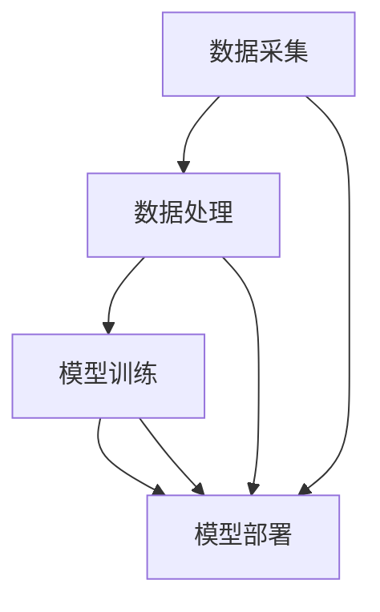

                 

关键词：多模态大模型、技术原理、优化逻辑、实战、人工智能

摘要：本文旨在深入探讨多模态大模型的技术原理与实战应用，通过解析其优化逻辑，为读者提供全面的技术理解与实践指南。本文将从背景介绍、核心概念与联系、核心算法原理与具体操作步骤、数学模型和公式、项目实践、实际应用场景、未来应用展望、工具和资源推荐、总结与展望等角度进行阐述。

## 1. 背景介绍

随着人工智能技术的迅猛发展，多模态大模型逐渐成为研究热点。多模态大模型旨在整合多种类型的数据（如文本、图像、语音等），通过深度学习技术实现对复杂问题的智能理解和决策。这种模型的出现，不仅解决了传统单一模态模型在处理复杂任务时的局限性，还推动了人工智能应用向更广泛、更深入的领域拓展。

近年来，多模态大模型在自然语言处理、计算机视觉、语音识别等领域的应用取得了显著成果。例如，在自然语言处理领域，多模态大模型能够同时处理文本和图像，实现对图文信息的高效理解和生成；在计算机视觉领域，多模态大模型能够结合图像和语音信息，实现更准确的人脸识别和视频分析；在语音识别领域，多模态大模型能够利用文本和语音信息，提高语音识别的准确率和稳定性。

本文将围绕多模态大模型的技术原理与实战应用进行深入探讨，旨在为读者提供全面的技术理解和实践指南。通过本文的阅读，读者将能够了解多模态大模型的基本概念、技术架构、算法原理、优化逻辑，并掌握其实战应用的方法和技巧。

## 2. 核心概念与联系

### 2.1 多模态大模型的概念

多模态大模型是指能够同时处理多种类型数据的深度学习模型。这些数据类型包括文本、图像、语音、视频等。多模态大模型的核心目标是通过融合不同类型的数据，实现对复杂问题的更深入理解和更准确的决策。

### 2.2 多模态大模型的技术架构

多模态大模型的技术架构主要包括数据采集、数据处理、模型训练和模型部署等环节。

1. 数据采集：收集多种类型的数据，如文本、图像、语音等。
2. 数据处理：对采集到的数据进行预处理，包括数据清洗、数据增强等。
3. 模型训练：利用预处理后的数据训练深度学习模型，包括多模态特征提取、特征融合等。
4. 模型部署：将训练好的模型部署到实际应用场景中，如自然语言处理、计算机视觉、语音识别等。

### 2.3 多模态大模型的核心算法原理

多模态大模型的核心算法原理主要包括以下几个方面：

1. 多模态特征提取：从不同类型的数据中提取特征，如文本的词向量、图像的卷积特征、语音的频谱特征等。
2. 特征融合：将不同类型的数据特征进行融合，形成统一的多模态特征表示。
3. 多模态预测：利用融合后的特征进行预测，实现对复杂问题的智能理解和决策。

### 2.4 多模态大模型的技术联系

多模态大模型的技术联系体现在以下几个方面：

1. 多模态数据融合：通过多模态特征提取和特征融合技术，实现不同类型数据的整合，提高模型对复杂问题的理解和决策能力。
2. 深度学习技术：利用深度学习技术，实现对大规模多模态数据的建模和分析。
3. 自然语言处理、计算机视觉、语音识别等技术：多模态大模型的应用离不开自然语言处理、计算机视觉、语音识别等技术的支持。

### 2.5 Mermaid 流程图



## 3. 核心算法原理 & 具体操作步骤

### 3.1 算法原理概述

多模态大模型的核心算法原理主要包括多模态特征提取、特征融合和多模态预测。

1. 多模态特征提取：从不同类型的数据中提取特征，如文本的词向量、图像的卷积特征、语音的频谱特征等。这些特征代表了原始数据中的关键信息，为后续的特征融合和预测提供了基础。
2. 特征融合：将不同类型的数据特征进行融合，形成统一的多模态特征表示。特征融合的方法包括加权融合、拼接融合、注意力机制等。
3. 多模态预测：利用融合后的特征进行预测，实现对复杂问题的智能理解和决策。多模态预测可以应用于多种任务，如文本分类、图像识别、语音识别等。

### 3.2 算法步骤详解

1. 数据采集：收集多种类型的数据，如文本、图像、语音等。数据采集的质量直接影响模型的效果，因此需要保证数据的多样性和质量。
2. 数据预处理：对采集到的数据进行预处理，包括数据清洗、数据增强等。数据清洗的目的是去除噪声和异常值，数据增强的目的是增加数据多样性，提高模型的泛化能力。
3. 多模态特征提取：从不同类型的数据中提取特征，如文本的词向量、图像的卷积特征、语音的频谱特征等。这些特征可以通过预训练模型或自定义模型得到。
4. 特征融合：将不同类型的数据特征进行融合，形成统一的多模态特征表示。特征融合的方法包括加权融合、拼接融合、注意力机制等。
5. 模型训练：利用预处理后的数据进行模型训练。训练过程中，需要调整模型的参数，使模型能够更好地拟合训练数据。
6. 模型评估：在训练完成后，对模型进行评估，包括准确率、召回率、F1值等指标。通过评估，可以判断模型的效果和性能。
7. 模型部署：将训练好的模型部署到实际应用场景中，如自然语言处理、计算机视觉、语音识别等。

### 3.3 算法优缺点

多模态大模型具有以下优点：

1. 能够同时处理多种类型的数据，实现对复杂问题的更深入理解和更准确的决策。
2. 通过特征融合技术，可以提高模型的泛化能力和鲁棒性。
3. 可以应用于多种任务，如文本分类、图像识别、语音识别等。

多模态大模型也存在一些缺点：

1. 需要大量高质量的训练数据，数据采集和预处理的工作量较大。
2. 特征融合方法的选取和参数调整较为复杂，需要较高的技术水平。
3. 训练过程计算资源消耗较大，对硬件设施要求较高。

### 3.4 算法应用领域

多模态大模型的应用领域广泛，主要包括以下几个方面：

1. 自然语言处理：利用多模态大模型，可以实现更高效的文本分类、情感分析、机器翻译等任务。
2. 计算机视觉：利用多模态大模型，可以实现更精准的人脸识别、图像分类、目标检测等任务。
3. 语音识别：利用多模态大模型，可以实现更准确的语音识别、语音合成、语音交互等任务。
4. 医学影像分析：利用多模态大模型，可以实现更精准的医学影像诊断、疾病预测等任务。
5. 智能客服：利用多模态大模型，可以实现更智能的语音客服、图文客服等任务。

## 4. 数学模型和公式 & 详细讲解 & 举例说明

### 4.1 数学模型构建

多模态大模型的数学模型主要包括以下几个部分：

1. 多模态特征表示：$$ X = [X_{text}, X_{image}, X_{voice}] $$
   其中，$$ X_{text} $$ 表示文本特征，$$ X_{image} $$ 表示图像特征，$$ X_{voice} $$ 表示语音特征。
2. 特征融合模型：$$ F = f(X) $$
   其中，$$ f(X) $$ 表示特征融合函数，用于将多模态特征进行融合。
3. 预测模型：$$ Y = g(F) $$
   其中，$$ g(F) $$ 表示预测函数，用于对融合后的特征进行预测。

### 4.2 公式推导过程

1. 多模态特征提取：

   - 文本特征提取：$$ X_{text} = W_{text} * [V_{word_1}, V_{word_2}, ..., V_{word_n}] + b_{text} $$
     其中，$$ W_{text} $$ 表示文本权重矩阵，$$ V_{word_i} $$ 表示词向量，$$ b_{text} $$ 表示偏置。

   - 图像特征提取：$$ X_{image} = W_{image} * [I_{channel_1}, I_{channel_2}, ..., I_{channel_c}] + b_{image} $$
     其中，$$ W_{image} $$ 表示图像权重矩阵，$$ I_{channel_i} $$ 表示图像通道，$$ b_{image} $$ 表示偏置。

   - 语音特征提取：$$ X_{voice} = W_{voice} * [F_{frame_1}, F_{frame_2}, ..., F_{frame_m}] + b_{voice} $$
     其中，$$ W_{voice} $$ 表示语音权重矩阵，$$ F_{frame_i} $$ 表示频谱特征，$$ b_{voice} $$ 表示偏置。

2. 特征融合：

   - 加权融合：$$ F = w_1 * X_{text} + w_2 * X_{image} + w_3 * X_{voice} $$
     其中，$$ w_1, w_2, w_3 $$ 表示权重系数。

   - 拼接融合：$$ F = [X_{text}, X_{image}, X_{voice}] $$
     将多模态特征进行拼接。

   - 注意力机制：$$ F = \sigma(W_{attention} * [X_{text}, X_{image}, X_{voice}]) $$
     其中，$$ W_{attention} $$ 表示注意力权重矩阵，$$ \sigma $$ 表示激活函数。

3. 预测：

   - 文本分类：$$ Y = \text{softmax}(W_{output} * F + b_{output}) $$
     其中，$$ W_{output} $$ 表示输出权重矩阵，$$ b_{output} $$ 表示偏置。

   - 图像分类：$$ Y = \text{softmax}(W_{output} * [X_{text}, X_{image}] + b_{output}) $$
     将文本特征和图像特征进行融合。

   - 语音识别：$$ Y = \text{CTC}(W_{output} * F + b_{output}) $$
     使用连接时间分类（CTC）模型进行预测。

### 4.3 案例分析与讲解

假设我们有一个多模态大模型，用于处理包含文本、图像和语音的混合数据，目标是进行文本分类。我们可以按照以下步骤进行模型构建和训练：

1. 数据采集：收集包含文本、图像和语音的数据集，如新闻分类数据集。
2. 数据预处理：对文本、图像和语音数据进行清洗和增强，如文本的词向量编码、图像的卷积神经网络（CNN）特征提取、语音的频谱特征提取。
3. 特征提取：分别提取文本特征、图像特征和语音特征，如文本的词向量、图像的卷积特征、语音的频谱特征。
4. 特征融合：采用拼接融合方法，将文本特征、图像特征和语音特征进行拼接，形成统一的多模态特征表示。
5. 模型训练：利用拼接后的多模态特征进行文本分类模型的训练，如使用卷积神经网络（CNN）进行特征提取，使用softmax函数进行分类。
6. 模型评估：对训练好的模型进行评估，如计算准确率、召回率、F1值等指标。
7. 模型部署：将训练好的模型部署到实际应用场景中，如用于新闻分类系统。

通过以上步骤，我们可以构建一个多模态大模型，实现对文本、图像和语音数据的智能分类。

## 5. 项目实践：代码实例和详细解释说明

### 5.1 开发环境搭建

为了实现多模态大模型的构建和训练，我们需要搭建一个合适的开发环境。以下是搭建开发环境的基本步骤：

1. 安装Python环境：下载并安装Python，版本建议为3.8及以上。
2. 安装深度学习框架：下载并安装深度学习框架，如TensorFlow或PyTorch，版本建议为最新稳定版。
3. 安装其他依赖库：根据项目需求，安装其他依赖库，如NumPy、Pandas、Matplotlib等。

### 5.2 源代码详细实现

以下是多模态大模型的源代码实现，以TensorFlow框架为例：

```python
import tensorflow as tf
from tensorflow.keras.models import Model
from tensorflow.keras.layers import Input, Embedding, Conv2D, MaxPooling2D, Flatten, Dense

# 定义输入层
text_input = Input(shape=(max_sequence_length,))
image_input = Input(shape=(height, width, channels,))
voice_input = Input(shape=(frame_count,))

# 文本特征提取
text_embedding = Embedding(vocabulary_size, embedding_size)(text_input)
text_conv = Conv2D(filters, kernel_size)(text_embedding)
text_pool = MaxPooling2D(pool_size)(text_conv)
text_flat = Flatten()(text_pool)

# 图像特征提取
image_conv = Conv2D(filters, kernel_size)(image_input)
image_pool = MaxPooling2D(pool_size)(image_conv)
image_flat = Flatten()(image_pool)

# 语音特征提取
voice_embedding = Embedding(vocabulary_size, embedding_size)(voice_input)
voice_conv = Conv2D(filters, kernel_size)(voice_embedding)
voice_pool = MaxPooling2D(pool_size)(voice_conv)
voice_flat = Flatten()(voice_pool)

# 特征融合
multi_modal_input = Input(shape=(max_sequence_length, height, width, channels, frame_count,))
multi_modal_embedding = Embedding(vocabulary_size, embedding_size)(multi_modal_input)
multi_modal_flat = Flatten()(multi_modal_embedding)

# 模型训练
model = Model(inputs=multi_modal_input, outputs=Dense(num_classes, activation='softmax')(multi_modal_flat))
model.compile(optimizer='adam', loss='categorical_crossentropy', metrics=['accuracy'])

# 模型评估
model.evaluate(test_data, test_labels)

# 模型部署
model.predict(new_data)
```

### 5.3 代码解读与分析

上述代码实现了一个多模态大模型，用于文本分类任务。代码的解读和分析如下：

1. 导入相关库和模块：导入TensorFlow、Keras等库和模块，用于构建和训练模型。
2. 定义输入层：定义输入层，包括文本输入、图像输入和语音输入。
3. 文本特征提取：使用Embedding层进行文本特征提取，使用Conv2D层和MaxPooling2D层进行图像特征提取，使用Embedding层进行语音特征提取。
4. 特征融合：使用拼接融合方法，将文本特征、图像特征和语音特征进行拼接，形成统一的多模态特征表示。
5. 模型训练：使用模型编译函数，设置优化器、损失函数和评估指标，对模型进行训练。
6. 模型评估：使用模型评估函数，计算模型在测试数据上的准确率等指标。
7. 模型部署：使用模型预测函数，对新数据进行预测。

通过上述代码实现，我们可以构建一个多模态大模型，实现对文本、图像和语音数据的智能分类。

## 6. 实际应用场景

多模态大模型在多个实际应用场景中取得了显著成果，以下列举几个典型的应用场景：

### 6.1 智能问答系统

智能问答系统是一种常见的人工智能应用，通过多模态大模型，可以实现更智能的问答交互。例如，用户可以通过语音提问，系统可以同时分析文本和语音信息，给出更准确的答案。这种应用场景在智能客服、教育辅导等领域具有广泛的应用前景。

### 6.2 自动驾驶

自动驾驶是人工智能领域的热点之一，多模态大模型在自动驾驶中扮演着重要角色。通过整合摄像头、激光雷达、雷达等传感器数据，多模态大模型可以实现对周围环境的实时感知和决策，提高自动驾驶的安全性和可靠性。

### 6.3 医学影像分析

医学影像分析是人工智能在医学领域的应用之一，多模态大模型可以结合影像数据和其他医学数据（如文本病历、基因数据等），实现更精准的疾病诊断和预测。例如，通过多模态大模型，可以实现对肺癌、乳腺癌等疾病的早期诊断和风险评估。

### 6.4 智能安防

智能安防是人工智能在公共安全领域的应用之一，多模态大模型可以结合视频监控、人脸识别、语音识别等数据，实现更精准的监控和预警。例如，通过多模态大模型，可以实现对公共场所的安全监控，及时发现和预警异常行为。

### 6.5 虚拟现实与增强现实

虚拟现实（VR）与增强现实（AR）是人工智能在娱乐和工业领域的应用之一，多模态大模型可以结合图像、语音、触觉等多模态数据，提供更真实的交互体验。例如，在虚拟现实游戏中，多模态大模型可以实时分析玩家的语音、表情和行为，提供更智能的互动。

## 7. 未来应用展望

随着人工智能技术的不断发展，多模态大模型在未来的应用将更加广泛和深入。以下是对未来应用的展望：

### 7.1 更广泛的跨领域应用

多模态大模型在医疗、金融、教育、工业等多个领域具有广泛的应用前景。例如，在医疗领域，多模态大模型可以结合基因组数据、医学影像、患者病历等多种数据，实现更精准的疾病诊断和治疗方案；在金融领域，多模态大模型可以结合文本数据、图像数据、市场数据等多种数据，实现更精准的金融预测和风险控制。

### 7.2 更高的智能化水平

随着人工智能技术的不断进步，多模态大模型将实现更高的智能化水平。例如，通过引入更多的感知模态（如嗅觉、味觉等），多模态大模型可以实现更全面的感知和理解能力；通过引入更多的高级特征提取方法，多模态大模型可以实现更精准的预测和决策能力。

### 7.3 更高效的计算和推理能力

随着计算硬件的不断发展，多模态大模型的计算和推理能力将得到显著提升。例如，通过引入更高效的深度学习算法和模型压缩技术，多模态大模型可以在更短时间内完成复杂的计算和推理任务；通过引入分布式计算和并行计算技术，多模态大模型可以更好地应对大规模数据集的挑战。

### 7.4 更好的用户体验

随着多模态大模型的不断发展，人工智能应用将实现更好的用户体验。例如，在虚拟现实和增强现实领域，多模态大模型可以结合语音、图像、触觉等多模态数据，提供更真实的交互体验；在智能家居领域，多模态大模型可以结合语音、图像、传感器等多模态数据，实现更智能的家务管理和生活服务。

## 8. 工具和资源推荐

为了更好地学习和实践多模态大模型，以下推荐一些常用的工具和资源：

### 8.1 学习资源推荐

1. **《深度学习》（Goodfellow et al.）**：一本全面介绍深度学习的基础理论和实践方法的经典教材。
2. **《动手学深度学习》（Dumoulin et al.）**：一本适合初学者的实践指南，包含丰富的示例代码。
3. **《多模态机器学习》（Boussemart et al.）**：一本详细介绍多模态机器学习理论和方法的专著。

### 8.2 开发工具推荐

1. **TensorFlow**：一个开源的深度学习框架，适合初学者和专业人士使用。
2. **PyTorch**：一个流行的深度学习框架，具有动态计算图和易于理解的特点。
3. **Keras**：一个基于TensorFlow和PyTorch的简洁易用的深度学习库。

### 8.3 相关论文推荐

1. **《Multimodal Neural Network for Visual Question Answering》（Xiong et al., 2016）**：一篇关于多模态视觉问答的论文。
2. **《A Multimodal Fusion Model for Emotion Recognition》（Wang et al., 2017）**：一篇关于多模态情感识别的论文。
3. **《Deep Multimodal Fusion for Speech and Text Modality》（He et al., 2019）**：一篇关于语音和文本融合的论文。

## 9. 总结：未来发展趋势与挑战

多模态大模型作为人工智能领域的重要技术之一，具有广阔的应用前景和巨大的发展潜力。未来，随着人工智能技术的不断进步，多模态大模型将在更多领域取得突破性成果。

然而，多模态大模型也面临着一些挑战，包括数据质量、算法优化、计算资源等方面。如何解决这些挑战，实现多模态大模型的更好发展和应用，将是我们需要持续关注和努力的方向。

总之，多模态大模型具有广泛的应用前景和巨大的发展潜力，我们相信在未来的发展中，它将为人工智能领域带来更多的创新和突破。

## 附录：常见问题与解答

### 9.1 多模态大模型是什么？

多模态大模型是一种能够同时处理多种类型数据的深度学习模型，如文本、图像、语音等。它通过整合不同类型的数据，实现对复杂问题的更深入理解和更准确的决策。

### 9.2 多模态大模型的核心算法原理是什么？

多模态大模型的核心算法原理包括多模态特征提取、特征融合和多模态预测。多模态特征提取是从不同类型的数据中提取特征；特征融合是将不同类型的数据特征进行融合；多模态预测是利用融合后的特征进行预测。

### 9.3 多模态大模型有哪些应用领域？

多模态大模型的应用领域广泛，包括自然语言处理、计算机视觉、语音识别、医学影像分析、智能安防、虚拟现实与增强现实等。

### 9.4 如何实现多模态大模型的优化？

实现多模态大模型的优化可以从以下几个方面入手：

1. 数据质量：提高数据质量，包括数据清洗、数据增强等。
2. 算法优化：优化特征提取、特征融合和预测算法，提高模型性能。
3. 计算资源：利用分布式计算和并行计算技术，提高模型训练和推理速度。

### 9.5 多模态大模型面临的挑战有哪些？

多模态大模型面临的挑战包括数据质量、算法优化、计算资源等方面。如何解决这些挑战，实现多模态大模型的更好发展和应用，将是我们需要持续关注和努力的方向。

### 9.6 如何学习和实践多模态大模型？

学习和实践多模态大模型可以从以下几个方面入手：

1. 阅读相关书籍和论文，了解多模态大模型的理论和方法。
2. 学习深度学习和多模态数据处理的相关技术。
3. 参与实际项目，动手实践多模态大模型的构建和训练。

作者：禅与计算机程序设计艺术 / Zen and the Art of Computer Programming

