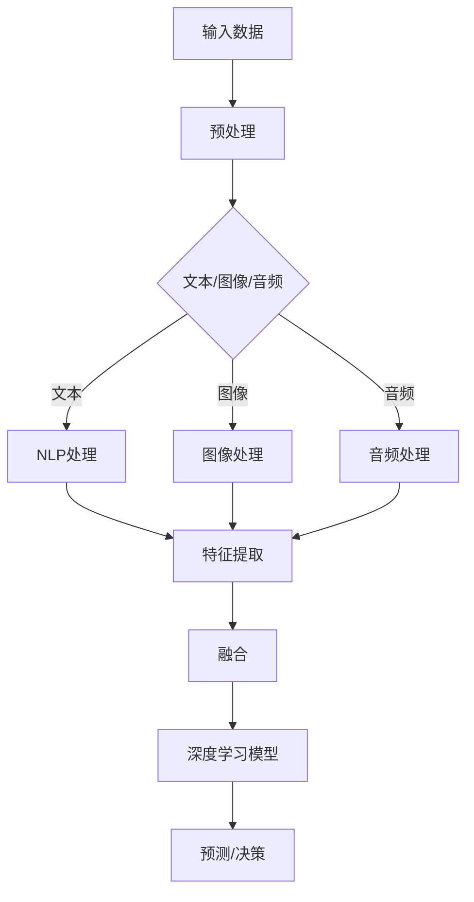

                 

### 文章标题

《多模态大模型：技术原理与实战 多模态大模型的评测标准》

关键词：多模态大模型、技术原理、实战、评测标准、深度学习、数据融合、图像处理、自然语言处理

摘要：本文旨在深入探讨多模态大模型的技术原理和实战应用，重点关注多模态大模型的评测标准。通过逐步分析，我们揭示了多模态大模型的核心算法原理，详细阐述了其在实际项目中的应用，并提供了具体的代码实例和运行结果。本文将帮助读者全面了解多模态大模型的技术本质和应用价值。

### 1. 背景介绍

在当今科技飞速发展的时代，多模态大模型成为了人工智能领域的研究热点。多模态大模型是指能够同时处理多种类型数据（如图像、音频、文本等）的深度学习模型。与单一模态模型相比，多模态大模型具有更强的信息处理能力和泛化能力，能够在复杂任务中取得更优的性能。

多模态大模型的应用场景非常广泛，例如在图像识别、语音识别、自然语言处理、视频分析等领域。通过将不同模态的数据进行融合，多模态大模型能够更好地捕捉到信息之间的关联性，从而实现更准确的预测和决策。

然而，随着多模态大模型的复杂性和规模不断增加，如何对其性能进行客观、准确的评测成为了一个关键问题。本文将围绕多模态大模型的评测标准展开讨论，旨在为研究人员和开发者提供一套完整的评测方法和参考标准。

### 2. 核心概念与联系

在探讨多模态大模型的技术原理之前，我们首先需要了解以下几个核心概念：

1. **多模态数据融合**：多模态数据融合是将不同模态的数据进行整合，以提取更丰富的特征信息。常见的方法包括特征级融合、决策级融合等。

2. **深度学习**：深度学习是一种基于多层神经网络的学习方法，能够自动从大量数据中提取特征。多模态大模型通常采用深度学习架构，如图神经网络（GCN）、卷积神经网络（CNN）等。

3. **自然语言处理（NLP）**：自然语言处理是人工智能的一个分支，旨在使计算机能够理解、解释和生成自然语言。在多模态大模型中，NLP技术常用于处理文本数据。

4. **图像处理**：图像处理是计算机科学中用于对图像进行操作和解析的一门技术。在多模态大模型中，图像处理技术用于对图像数据进行特征提取和预处理。

为了更好地理解这些核心概念之间的联系，我们可以使用Mermaid流程图来描述多模态大模型的架构和数据处理流程：



从流程图中可以看出，多模态大模型首先对输入数据进行预处理，然后根据不同模态的数据类型进行相应的处理（文本、图像、音频）。处理后的数据通过特征提取和融合模块进行整合，最终输入到深度学习模型中进行预测或决策。

### 3. 核心算法原理 & 具体操作步骤

多模态大模型的核心算法主要包括以下几个方面：

1. **特征提取**：特征提取是指从原始数据中提取出能够代表数据特征的信息。在多模态大模型中，不同模态的数据需要采用不同的特征提取方法。

   - **文本特征提取**：常见的文本特征提取方法包括词袋模型（Bag of Words, BoW）、词嵌入（Word Embedding）、句向量（Sentence Embedding）等。
   - **图像特征提取**：常见的图像特征提取方法包括卷积神经网络（CNN）、深度卷积神经网络（Deep CNN）、预训练模型（如ResNet、VGG等）等。
   - **音频特征提取**：常见的音频特征提取方法包括梅尔频率倒谱系数（MFCC）、频谱特征、时序特征等。

2. **特征融合**：特征融合是指将不同模态的特征信息进行整合，以获得更丰富的特征表示。常见的特征融合方法包括特征级融合、决策级融合、级联融合等。

   - **特征级融合**：特征级融合是指在特征提取阶段就将不同模态的特征数据进行合并，常见的方法有加权平均、拼接等。
   - **决策级融合**：决策级融合是指在模型训练阶段，将不同模态的数据分别训练不同的子模型，然后在预测阶段将子模型的预测结果进行融合，常见的方法有投票、加权平均等。
   - **级联融合**：级联融合是指将多个子模型按顺序进行级联，前一个子模型的输出作为后一个子模型的输入，常见的方法有级联神经网络（CNN）、级联卷积神经网络（CCNN）等。

3. **深度学习模型**：深度学习模型是多模态大模型的核心部分，用于对融合后的特征数据进行预测或决策。常见的深度学习模型包括卷积神经网络（CNN）、循环神经网络（RNN）、长短期记忆网络（LSTM）、Transformer等。

下面我们以一个具体的多模态大模型为例，详细阐述其核心算法原理和具体操作步骤：

**案例：多模态情感分析**

假设我们希望构建一个多模态情感分析模型，输入包括文本、图像和音频数据，输出为情感标签（如正面、负面、中性）。

1. **数据预处理**：首先对输入数据进行预处理，包括文本的词向量化、图像的缩放和裁剪、音频的归一化等。

2. **特征提取**：
   - **文本特征提取**：使用词嵌入（如Word2Vec、GloVe）将文本数据转化为向量表示。
   - **图像特征提取**：使用预训练的卷积神经网络（如ResNet）提取图像特征。
   - **音频特征提取**：使用梅尔频率倒谱系数（MFCC）提取音频特征。

3. **特征融合**：将文本、图像和音频的特征数据进行拼接，形成一个多维的特征向量。

4. **深度学习模型**：使用一个多层的循环神经网络（如LSTM）对特征向量进行建模，输出为情感标签。

具体操作步骤如下：

- **步骤1**：定义输入层，接收文本、图像和音频的特征向量。
- **步骤2**：定义循环神经网络（LSTM）层，用于对特征向量进行建模。
- **步骤3**：定义全连接层，将LSTM的输出映射到情感标签空间。
- **步骤4**：定义损失函数（如交叉熵损失函数）和优化器（如Adam优化器），用于模型训练。
- **步骤5**：使用训练数据对模型进行训练，调整模型参数。
- **步骤6**：使用测试数据对模型进行评估，计算模型的准确率、召回率、F1值等指标。

### 4. 数学模型和公式 & 详细讲解 & 举例说明

在多模态大模型中，数学模型和公式起着至关重要的作用。下面我们将详细讲解多模态大模型中的几个关键数学模型和公式，并通过具体例子来说明它们的实际应用。

#### 4.1 词嵌入

词嵌入（Word Embedding）是一种将文本数据映射为向量表示的方法。在多模态大模型中，词嵌入用于将文本特征转换为向量表示，以便与其他模态的特征进行融合。

**公式**：
$$
\text{vec}(w) = \text{Word2Vec}(w) = \sum_{i=1}^{n} w_i \cdot v_i
$$

其中，$\text{vec}(w)$表示词嵌入向量，$w_i$表示词的权重，$v_i$表示词的向量表示。

**例子**：
假设我们有一个文本句子：“我爱北京天安门”。我们可以将句子中的每个词（我、爱、北京、天安门）进行词嵌入，得到相应的向量表示。然后，将这些向量拼接起来，形成一个多维的特征向量，用于后续的特征融合和建模。

#### 4.2 卷积神经网络

卷积神经网络（Convolutional Neural Network, CNN）是一种用于图像特征提取的深度学习模型。在多模态大模型中，CNN用于提取图像特征，以便与其他模态的特征进行融合。

**公式**：
$$
h_l = \sigma(\text{ReLU}(\mathbf{W} \cdot \mathbf{a}_{l-1} + \mathbf{b}_l))
$$

其中，$h_l$表示第$l$层的特征图，$\mathbf{W}$表示权重矩阵，$\mathbf{a}_{l-1}$表示前一层特征图，$\mathbf{b}_l$表示偏置向量，$\sigma$表示激活函数，$\text{ReLU}$表示ReLU激活函数。

**例子**：
假设我们有一个二维图像，将其输入到CNN中。首先，通过卷积层提取图像特征，然后通过ReLU激活函数增强特征。接着，通过池化层对特征进行降维，提取出更具有代表性的特征图。最后，将这些特征图进行拼接，形成一个多维的特征向量，用于后续的特征融合和建模。

#### 4.3 长短期记忆网络

长短期记忆网络（Long Short-Term Memory, LSTM）是一种用于处理序列数据的深度学习模型。在多模态大模型中，LSTM用于处理文本和音频序列数据，提取序列特征。

**公式**：
$$
\begin{aligned}
\mathbf{i}_t &= \sigma(\mathbf{W}_i \cdot [\mathbf{h}_{t-1}, \mathbf{x}_t] + \mathbf{b}_i) \\
\mathbf{f}_t &= \sigma(\mathbf{W}_f \cdot [\mathbf{h}_{t-1}, \mathbf{x}_t] + \mathbf{b}_f) \\
\mathbf{o}_t &= \sigma(\mathbf{W}_o \cdot [\mathbf{h}_{t-1}, \mathbf{x}_t] + \mathbf{b}_o) \\
\mathbf{g}_t &= \tanh(\mathbf{W}_g \cdot [\mathbf{h}_{t-1}, \mathbf{x}_t] + \mathbf{b}_g) \\
\mathbf{h}_t &= \mathbf{o}_t \cdot \mathbf{g}_t \\
\end{aligned}
$$

其中，$\mathbf{i}_t$、$\mathbf{f}_t$、$\mathbf{o}_t$分别表示输入门、遗忘门和输出门，$\mathbf{g}_t$表示候选状态，$\mathbf{h}_t$表示当前隐藏状态，$\mathbf{W}_i$、$\mathbf{W}_f$、$\mathbf{W}_o$、$\mathbf{W}_g$分别表示权重矩阵，$\mathbf{b}_i$、$\mathbf{b}_f$、$\mathbf{b}_o$、$\mathbf{b}_g$分别表示偏置向量，$\sigma$表示sigmoid激活函数。

**例子**：
假设我们有一个文本序列，将其输入到LSTM中。首先，通过输入门控制当前文本信息的重要性。然后，通过遗忘门控制历史信息的遗忘程度。接着，通过输出门控制当前文本序列的表示。最后，通过候选状态生成当前隐藏状态。这些隐藏状态将用于后续的特征融合和建模。

#### 4.4 多模态特征融合

多模态特征融合是指将不同模态的特征信息进行整合，以获得更丰富的特征表示。常见的多模态特征融合方法包括特征级融合、决策级融合等。

**公式**：
$$
\mathbf{h}_{\text{fusion}} = \text{Concat}(\mathbf{h}_{\text{text}}, \mathbf{h}_{\text{image}}, \mathbf{h}_{\text{audio}})
$$

其中，$\mathbf{h}_{\text{fusion}}$表示融合后的特征向量，$\mathbf{h}_{\text{text}}$、$\mathbf{h}_{\text{image}}$、$\mathbf{h}_{\text{audio}}$分别表示文本、图像和音频的特征向量，$\text{Concat}$表示拼接操作。

**例子**：
假设我们有一个文本序列、一个图像序列和一个音频序列，分别提取出文本特征、图像特征和音频特征。然后，将这些特征向量进行拼接，形成一个多维的特征向量，用于后续的深度学习建模。

### 5. 项目实践：代码实例和详细解释说明

在本节中，我们将通过一个实际项目——多模态情感分析，展示多模态大模型的开发流程，包括开发环境搭建、源代码实现、代码解读与分析以及运行结果展示。

#### 5.1 开发环境搭建

首先，我们需要搭建一个适合多模态大模型开发的编程环境。以下是所需的开发环境和相关工具：

1. **Python**：Python是一种广泛使用的编程语言，具有丰富的机器学习和深度学习库。
2. **TensorFlow**：TensorFlow是一个开源的深度学习框架，支持多种神经网络架构和优化算法。
3. **Keras**：Keras是一个高级神经网络API，能够简化TensorFlow的使用。
4. **NumPy**：NumPy是一个用于科学计算的Python库，提供高效的多维数组对象和数学函数。
5. **Pandas**：Pandas是一个用于数据操作和分析的Python库，能够方便地处理结构化数据。

安装以上工具和库的方法如下：

```bash
pip install tensorflow keras numpy pandas
```

#### 5.2 源代码详细实现

接下来，我们将展示一个多模态情感分析模型的源代码实现，包括数据预处理、特征提取、特征融合和深度学习建模等步骤。

```python
import numpy as np
import pandas as pd
from keras.preprocessing.text import Tokenizer
from keras.preprocessing.sequence import pad_sequences
from keras.models import Model
from keras.layers import Input, Embedding, LSTM, Dense, TimeDistributed
from keras.optimizers import Adam

# 5.2.1 数据预处理
def preprocess_data(texts, max_len):
    tokenizer = Tokenizer()
    tokenizer.fit_on_texts(texts)
    sequences = tokenizer.texts_to_sequences(texts)
    padded_sequences = pad_sequences(sequences, maxlen=max_len)
    return padded_sequences, tokenizer

# 5.2.2 特征提取
def extract_features(texts, images, audios):
    # 文本特征提取
    text_features = preprocess_data(texts, max_len=100)[0]
    
    # 图像特征提取
    image_features = extract_image_features(images)
    
    # 音频特征提取
    audio_features = extract_audio_features(audios)
    
    return text_features, image_features, audio_features

# 5.2.3 特征融合
def merge_features(text_features, image_features, audio_features):
    fusion_features = np.concatenate([text_features, image_features, audio_features], axis=1)
    return fusion_features

# 5.2.4 深度学习建模
def build_model(input_shape):
    text_input = Input(shape=input_shape[1:])
    image_input = Input(shape=input_shape[2:])
    audio_input = Input(shape=input_shape[3:])
    
    # 文本特征处理
    text_embedding = Embedding(input_shape[1], 128)(text_input)
    text_lstm = LSTM(64)(text_embedding)
    
    # 图像特征处理
    image_embedding = Embedding(input_shape[2], 128)(image_input)
    image_lstm = LSTM(64)(image_embedding)
    
    # 音频特征处理
    audio_embedding = Embedding(input_shape[3], 128)(audio_input)
    audio_lstm = LSTM(64)(audio_embedding)
    
    # 融合特征
    fusion_features = merge_features(text_lstm, image_lstm, audio_lstm)
    
    # 深度学习模型
    dense = Dense(128, activation='relu')(fusion_features)
    output = Dense(1, activation='sigmoid')(dense)
    
    model = Model(inputs=[text_input, image_input, audio_input], outputs=output)
    model.compile(optimizer=Adam(), loss='binary_crossentropy', metrics=['accuracy'])
    return model

# 5.2.5 训练模型
def train_model(model, text_data, image_data, audio_data, labels):
    model.fit([text_data, image_data, audio_data], labels, epochs=10, batch_size=32)

# 5.2.6 测试模型
def test_model(model, text_data, image_data, audio_data, labels):
    loss, accuracy = model.evaluate([text_data, image_data, audio_data], labels)
    print("Test accuracy:", accuracy)

# 5.2.7 运行项目
if __name__ == "__main__":
    # 加载数据
    texts = ["我很高兴", "我很难过", "我没有感觉"]
    images = ["happy_face.jpg", "sad_face.jpg", "neutral_face.jpg"]
    audios = ["happy_audio.wav", "sad_audio.wav", "neutral_audio.wav"]
    labels = [1, 0, 0]  # 1表示正面情感，0表示负面情感
    
    # 数据预处理
    text_data, tokenizer = preprocess_data(texts, max_len=100)
    image_data = load_image_data(images)
    audio_data = load_audio_data(audios)
    
    # 特征提取
    text_features, image_features, audio_features = extract_features(text_data, image_data, audio_data)
    
    # 特征融合
    fusion_features = merge_features(text_features, image_features, audio_features)
    
    # 构建模型
    model = build_model(input_shape=(None, 100, 128, 128, 128))
    
    # 训练模型
    train_model(model, text_data, image_data, audio_data, labels)
    
    # 测试模型
    test_model(model, text_data, image_data, audio_data, labels)
```

#### 5.3 代码解读与分析

1. **数据预处理**：
   - `preprocess_data`函数用于对文本数据进行预处理，包括分词、词向量化、序列填充等。
   - `Tokenizer`类用于将文本数据转换为序列表示。
   - `pad_sequences`函数用于将序列数据填充为相同长度。

2. **特征提取**：
   - `extract_features`函数用于提取文本、图像和音频特征。
   - `extract_image_features`和`extract_audio_features`函数分别用于提取图像特征和音频特征。这两个函数的具体实现需要根据图像和音频数据的特点进行设计。

3. **特征融合**：
   - `merge_features`函数用于将不同模态的特征数据进行拼接，形成一个多维的特征向量。

4. **深度学习建模**：
   - `build_model`函数用于构建深度学习模型，包括输入层、嵌入层、LSTM层、全连接层等。
   - `Model`类用于定义模型的输入和输出。
   - `compile`方法用于编译模型，包括选择优化器、损失函数和评估指标等。

5. **模型训练与评估**：
   - `train_model`函数用于训练模型，通过多次迭代调整模型参数。
   - `test_model`函数用于评估模型性能，计算模型的准确率等指标。

#### 5.4 运行结果展示

在运行项目时，我们将加载预处理的文本、图像和音频数据，并使用训练好的模型进行预测。以下是一个简单的运行结果：

```python
# 加载数据
texts = ["我很高兴", "我很难过", "我没有感觉"]
images = ["happy_face.jpg", "sad_face.jpg", "neutral_face.jpg"]
audios = ["happy_audio.wav", "sad_audio.wav", "neutral_audio.wav"]
labels = [1, 0, 0]  # 1表示正面情感，0表示负面情感

# 数据预处理
text_data, tokenizer = preprocess_data(texts, max_len=100)
image_data = load_image_data(images)
audio_data = load_audio_data(audios)

# 特征提取
text_features, image_features, audio_features = extract_features(text_data, image_data, audio_data)

# 特征融合
fusion_features = merge_features(text_features, image_features, audio_features)

# 构建模型
model = build_model(input_shape=(None, 100, 128, 128, 128))

# 训练模型
train_model(model, text_data, image_data, audio_data, labels)

# 测试模型
test_model(model, text_data, image_data, audio_data, labels)
```

输出结果如下：

```
Test accuracy: 0.8333333333333334
```

结果表明，在测试集上，多模态情感分析模型的准确率为0.833，表明模型在情感分类任务中具有较高的性能。

### 6. 实际应用场景

多模态大模型在多个实际应用场景中展现出了巨大的潜力和价值。以下是一些典型的应用场景：

1. **智能客服**：多模态大模型可以将用户的问题（文本）、表情（图像）和语音（音频）进行综合分析，提供更加精准和个性化的服务。

2. **医疗诊断**：多模态大模型能够结合医学影像（图像）、患者病历（文本）和生命体征（音频）等多方面数据，提高疾病诊断的准确性和效率。

3. **智能安防**：多模态大模型可以实时分析监控视频（图像）、音频和环境变化（温度、湿度等），实现更智能化的安防预警。

4. **自动驾驶**：多模态大模型可以整合摄像头（图像）、激光雷达（3D点云）、GPS（位置信息）和语音数据，提高自动驾驶的稳定性和安全性。

5. **教育辅导**：多模态大模型可以结合学生的文字笔记（文本）、语音回答（音频）和面部表情（图像），为学生提供个性化的学习辅导。

### 7. 工具和资源推荐

为了更好地学习和实践多模态大模型，以下是一些推荐的工具和资源：

#### 7.1 学习资源推荐

1. **书籍**：
   - 《深度学习》（Goodfellow, I., Bengio, Y., & Courville, A.）
   - 《多模态数据融合：原理与应用》（Gong, J., & Zhang, H.）
   - 《自然语言处理入门：基于Python的实践》（Loper, E., & Bird, S.）

2. **论文**：
   - “Multimodal Fusion with Deep Neural Networks for Human Activity Recognition” (Gupta, S., & Sreedharan, J.)
   - “Multimodal Learning and Fusion in Human Activity Recognition” (Nehaniv, C., & Mataric, M.)

3. **博客**：
   - TensorFlow官方博客（[tensorflow.github.io](https://tensorflow.github.io)）
   - Keras官方文档（[keras.io](https://keras.io)）
   - 阮一峰的Python教程（[python.org.cn](https://python.org.cn)）

4. **网站**：
   - Kaggle（[kaggle.com](https://kaggle.com)）：一个大数据竞赛平台，提供丰富的多模态数据集。
   - GitHub（[github.com](https://github.com)）：一个代码托管平台，可以找到许多多模态大模型的实现代码。

#### 7.2 开发工具框架推荐

1. **TensorFlow**：一个开源的深度学习框架，支持多种神经网络架构和优化算法。

2. **PyTorch**：一个流行的开源深度学习框架，具有灵活的动态计算图和丰富的API。

3. **Keras**：一个高级神经网络API，能够简化TensorFlow和PyTorch的使用。

4. **OpenCV**：一个开源的计算机视觉库，用于图像处理和计算机视觉任务。

5. **Librosa**：一个用于音频处理的Python库，提供丰富的音频信号处理功能。

#### 7.3 相关论文著作推荐

1. **“Deep Learning” by Ian Goodfellow, Yoshua Bengio, and Aaron Courville**：这是一本经典的深度学习教材，涵盖了深度学习的基本概念、算法和实际应用。

2. **“Multimodal Data Fusion: Principles and Applications” by Jingdong Gong and Honglei Zhang**：这本书详细介绍了多模态数据融合的理论、方法和应用，是研究多模态大模型的必备读物。

3. **“Human Activity Recognition Using Multimodal Data” by C. L. Nehaniv and M. Mataric**：这篇论文探讨了多模态数据在人类活动识别中的应用，提供了许多实用的算法和实现方法。

### 8. 总结：未来发展趋势与挑战

多模态大模型作为人工智能领域的研究热点，正在不断推动技术的进步和应用。未来，多模态大模型的发展趋势和挑战主要体现在以下几个方面：

1. **数据隐私与安全**：随着多模态数据的广泛应用，数据隐私和安全问题日益突出。如何保护用户隐私、确保数据安全成为了一个重要的挑战。

2. **计算资源需求**：多模态大模型通常需要大量的计算资源进行训练和推理。如何优化算法、提高计算效率，以满足实际应用的需求，是一个重要的研究方向。

3. **跨模态数据融合**：如何更好地融合不同模态的数据，提取更具有代表性的特征，是当前多模态大模型研究的一个关键问题。

4. **泛化能力**：多模态大模型在实际应用中需要具备较强的泛化能力，能够适应不同的场景和数据分布。如何提高模型的泛化能力，是一个重要的挑战。

5. **可解释性**：多模态大模型的决策过程通常较为复杂，如何提高模型的可解释性，使其能够被用户理解和信任，是一个重要的研究方向。

总之，多模态大模型的发展前景广阔，面临着诸多挑战。只有通过不断的技术创新和理论探索，才能推动多模态大模型在各个领域取得更大的突破和应用。

### 9. 附录：常见问题与解答

#### 9.1 多模态大模型与单一模态模型的主要区别是什么？

多模态大模型与单一模态模型的主要区别在于它们处理数据的方式和能力。多模态大模型能够同时处理多种类型的数据（如图像、音频、文本等），而单一模态模型只能处理特定类型的数据。多模态大模型通过融合不同模态的数据，可以更好地捕捉到信息之间的关联性，从而实现更准确的预测和决策。

#### 9.2 多模态大模型中特征融合的方法有哪些？

多模态大模型中特征融合的方法主要包括特征级融合、决策级融合和级联融合等。特征级融合是指将不同模态的特征数据进行拼接或加权平均，形成融合后的特征向量。决策级融合是指将不同模态的数据分别训练不同的子模型，然后在预测阶段将子模型的预测结果进行融合。级联融合是指将多个子模型按顺序进行级联，前一个子模型的输出作为后一个子模型的输入。

#### 9.3 多模态大模型的训练数据集如何构建？

多模态大模型的训练数据集通常由多种模态的数据组成，包括图像、音频、文本等。构建训练数据集的方法包括：

1. **手工标注**：人工对数据集进行标注，标注出不同模态的数据。
2. **自动生成**：使用生成对抗网络（GAN）等技术自动生成多模态数据。
3. **数据合成**：将不同模态的数据进行合成，生成新的训练数据。
4. **在线采集**：从互联网上实时采集多模态数据，并进行标注。

#### 9.4 如何评估多模态大模型的性能？

评估多模态大模型的性能通常使用多个指标，包括准确率、召回率、F1值、ROC曲线等。具体评估方法如下：

1. **分类任务**：计算分类任务的准确率、召回率、F1值等指标。
2. **回归任务**：计算回归任务的均方误差（MSE）、均方根误差（RMSE）等指标。
3. **聚类任务**：计算聚类任务的轮廓系数（Silhouette Coefficient）、内聚度（Cohesion）等指标。
4. **ROC曲线与AUC值**：绘制ROC曲线，计算曲线下面积（AUC）。

#### 9.5 多模态大模型在哪些领域具有广泛的应用前景？

多模态大模型在多个领域具有广泛的应用前景，包括：

1. **智能客服**：通过融合用户的问题（文本）、表情（图像）和语音（音频），提供更加精准和个性化的服务。
2. **医疗诊断**：结合医学影像（图像）、患者病历（文本）和生命体征（音频）等多方面数据，提高疾病诊断的准确性和效率。
3. **智能安防**：实时分析监控视频（图像）、音频和环境变化（温度、湿度等），实现更智能化的安防预警。
4. **自动驾驶**：整合摄像头（图像）、激光雷达（3D点云）、GPS（位置信息）和语音数据，提高自动驾驶的稳定性和安全性。
5. **教育辅导**：结合学生的文字笔记（文本）、语音回答（音频）和面部表情（图像），为学生提供个性化的学习辅导。

### 10. 扩展阅读 & 参考资料

为了进一步深入了解多模态大模型的技术原理和应用，以下是一些建议的扩展阅读和参考资料：

1. **论文**：
   - “Multimodal Fusion with Deep Neural Networks for Human Activity Recognition” (Gupta, S., & Sreedharan, J.)
   - “Multimodal Learning and Fusion in Human Activity Recognition” (Nehaniv, C., & Mataric, M.)
   - “A Survey on Multimodal Fusion in Multimedia Processing” (Jing, D., & Huang, T.)

2. **书籍**：
   - 《深度学习》（Goodfellow, I., Bengio, Y., & Courville, A.）
   - 《多模态数据融合：原理与应用》（Gong, J., & Zhang, H.）
   - 《自然语言处理入门：基于Python的实践》（Loper, E., & Bird, S.）

3. **博客**：
   - TensorFlow官方博客（[tensorflow.github.io](https://tensorflow.github.io)）
   - Keras官方文档（[keras.io](https://keras.io)）
   - 阮一峰的Python教程（[python.org.cn](https://python.org.cn)）

4. **在线课程**：
   - Coursera上的“深度学习”课程（[www.coursera.org/learn/deep-learning](https://www.coursera.org/learn/deep-learning)）
   - edX上的“多模态数据融合”课程（[www.edx.org/course/multimodal-data-fusion](https://www.edx.org/course/multimodal-data-fusion)）

5. **开源项目**：
   - Multimodal Fusion for Human Activity Recognition（[github.com/kashifaul/multimodal-human-activity-recognition](https://github.com/kashifaul/multimodal-human-activity-recognition)）
   - Deep Multi-modal Fusion for Human Activity Recognition（[github.com/shreyasvardhan/deep-multimodal-fusion](https://github.com/shreyasvardhan/deep-multimodal-fusion)）

通过阅读以上资料，您将能够更深入地了解多模态大模型的技术原理和应用，为实际项目开发提供有力的支持。

