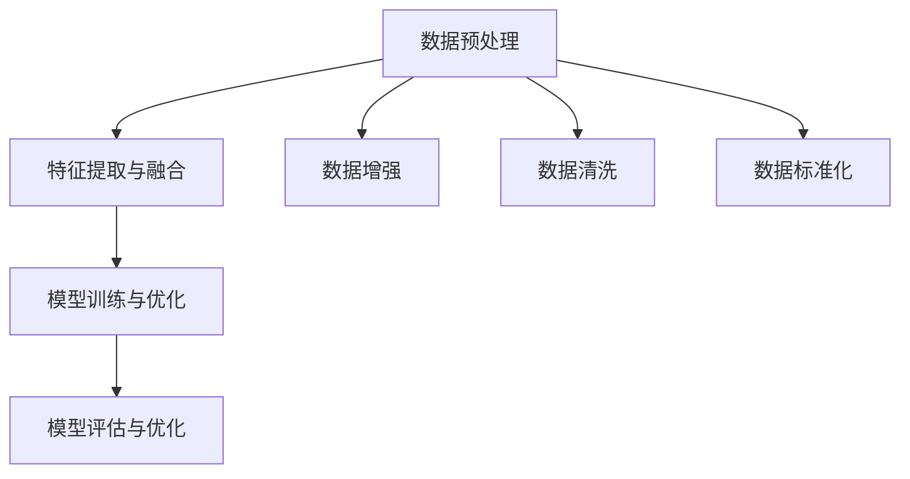
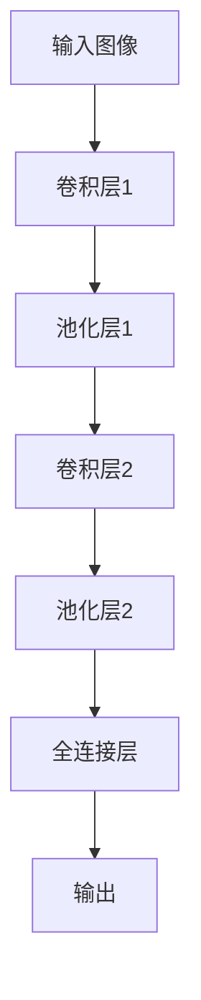
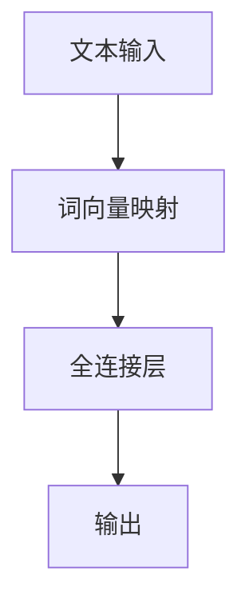
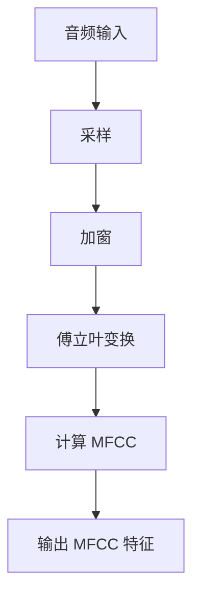
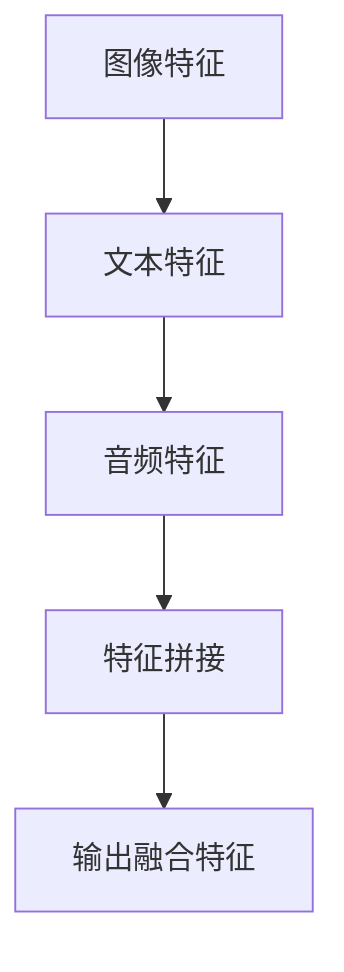
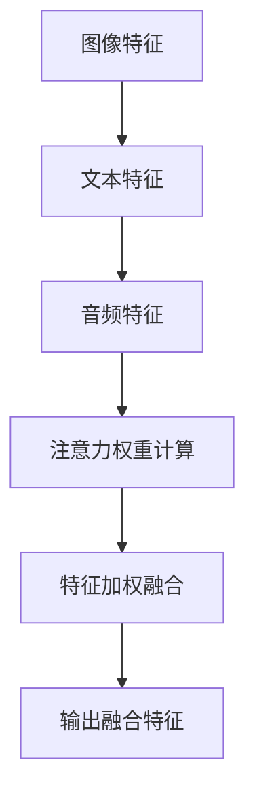
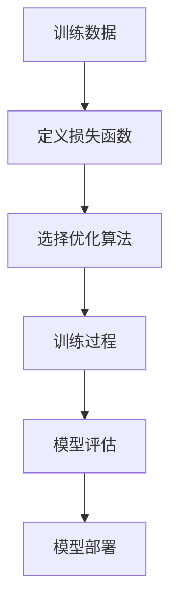

                 

### 背景介绍

多模态大模型（Multimodal Large Models）是当前人工智能领域的一个重要研究方向，它涉及将多种不同类型的数据模态（如图像、文本、音频、视频等）进行整合，构建出能够处理复杂数据的大规模人工智能模型。这种模型的出现，打破了传统单模态模型的局限，使得机器能够更好地理解和处理现实世界中的信息，从而在自然语言处理、计算机视觉、语音识别等多个领域取得了显著的进展。

随着深度学习技术的不断发展，多模态大模型的构建和应用逐渐成为可能。传统的单模态模型往往只能处理特定类型的数据，例如，图像识别模型只能处理图像数据，而语音识别模型只能处理音频数据。然而，现实世界中的信息往往是多模态的，比如，在视频会议中，参与者不仅需要听到对方的语音，还需要看到对方的表情和动作。这就需要有一种模型能够同时处理多种数据模态，从而更全面、准确地理解信息。

多模态大模型的研究不仅有助于提升人工智能系统的性能，还有助于推动人工智能技术的实际应用。例如，在医疗领域，多模态大模型可以结合患者的医疗图像、病历文本和语音数据，提供更加精准的诊断和治疗建议。在自动驾驶领域，多模态大模型可以同时处理车辆周围的视频、语音和雷达数据，提高车辆的感知能力和行驶安全性。

尽管多模态大模型的研究已经取得了一定的成果，但仍然面临许多挑战。首先是如何有效地整合不同模态的数据，使它们能够共同发挥作用。其次是如何设计出能够处理复杂数据的大规模模型，并在保证性能的同时，尽量减少模型的复杂度。此外，多模态大模型的安全性和隐私保护也是一个重要的研究课题。

本文将首先介绍多模态大模型的基本概念，包括多模态数据的类型和特点，以及多模态大模型的架构。接着，我们将深入探讨多模态大模型的核心算法原理，包括特征提取、融合和模型训练的具体方法。随后，我们将通过一个实际项目案例，详细讲解如何使用多模态大模型进行数据分析和处理。最后，我们将讨论多模态大模型在实际应用场景中的挑战和解决方案，并总结未来发展趋势与挑战。通过本文的介绍，希望能够帮助读者全面了解多模态大模型的技术原理和实战应用。

### 核心概念与联系

多模态大模型的核心在于能够同时处理多种不同类型的数据模态，从而实现对复杂数据的全面理解和分析。在这一部分，我们将详细探讨多模态数据的类型、特点，以及多模态大模型的架构。

#### 多模态数据的类型

多模态数据主要包括以下几种类型：

1. **图像数据（Images）**：图像数据是计算机视觉中最常见的数据类型，它包含丰富的视觉信息，例如颜色、形状、纹理等。图像数据广泛应用于人脸识别、物体检测、图像分类等领域。

2. **文本数据（Text）**：文本数据是自然语言处理（NLP）的基础，它包含人类语言的表达和交流信息。文本数据可以来自于书籍、文章、社交媒体等不同来源，是信息传递的重要载体。

3. **音频数据（Audio）**：音频数据包含人类语音、音乐、环境声等不同类型的音频信号。音频数据在语音识别、音频分类、音乐生成等领域有着广泛应用。

4. **视频数据（Video）**：视频数据是图像数据和时间维度的结合，它包含连续的图像序列。视频数据在视频分类、动作识别、视频生成等领域具有重要应用。

5. **传感器数据（Sensor Data）**：传感器数据包括温度、湿度、压力、加速度等不同类型的物理量。传感器数据在物联网、智能家居、工业自动化等领域有着广泛的应用。

#### 多模态数据的处理挑战

多模态数据的处理面临以下挑战：

1. **数据格式和特征差异**：不同类型的数据具有不同的数据格式和特征表示方式，例如，图像数据是像素值，文本数据是单词序列，音频数据是声波信号。如何将这些异构数据进行有效整合，是一个重要的研究课题。

2. **数据量大**：多模态数据通常包含大量的信息，如何处理大规模数据并从中提取有效特征，是一个关键问题。

3. **时序性和空间性**：某些模态（如视频和音频）具有时序性和空间性，如何处理这些特性，使其在模型中发挥作用，是一个挑战。

#### 多模态大模型的架构

多模态大模型的架构可以分为三个主要部分：数据预处理、特征提取与融合、模型训练与优化。

1. **数据预处理**：数据预处理是模型构建的第一步，它包括数据清洗、数据增强、数据标准化等操作。数据预处理的目标是确保输入数据的质量和一致性，为后续的特征提取和模型训练提供良好的数据基础。

2. **特征提取与融合**：特征提取与融合是多模态大模型的核心，它涉及从不同模态的数据中提取有效特征，并设计算法将它们进行整合。特征提取通常采用深度学习技术，例如卷积神经网络（CNN）用于图像特征提取，循环神经网络（RNN）用于文本和音频特征提取。融合策略包括串联、并联、拼接、注意力机制等。

3. **模型训练与优化**：模型训练与优化是构建多模态大模型的最后一步，它包括模型参数的优化、超参数的选择、训练过程的监控等。通过大量的训练数据和先进的优化算法，模型可以不断优化，提高对复杂数据的识别和处理能力。

#### Mermaid 流程图

以下是一个简单的 Mermaid 流程图，展示了多模态大模型的基本架构：



在这个流程图中，数据预处理部分包括数据增强、数据清洗和数据标准化，特征提取与融合部分包括从不同模态提取特征并进行整合，模型训练与优化部分则涉及模型参数的调整和超参数的选择，以实现最佳性能。

通过上述介绍，我们可以看到多模态大模型在处理复杂数据方面具有巨大的潜力，但同时也面临着诸多挑战。在接下来的部分，我们将深入探讨多模态大模型的核心算法原理，包括特征提取、融合和模型训练的具体方法。

## 3. 核心算法原理 & 具体操作步骤

多模态大模型的核心算法原理主要涉及特征提取、特征融合以及模型训练三个关键步骤。以下将详细解释这些算法原理，并给出具体操作步骤。

### 3.1 特征提取

特征提取是构建多模态大模型的第一步，其主要目的是从不同模态的数据中提取出具有代表性的特征。以下将介绍几种常用的特征提取方法：

#### 图像特征提取

对于图像特征提取，最常用的方法是卷积神经网络（CNN）。CNN 通过多个卷积层、池化层和全连接层，逐步提取图像的局部特征和全局特征。

**操作步骤：**

1. **数据预处理**：将图像数据进行归一化处理，使其满足网络输入的要求。
2. **卷积层**：使用卷积核在图像上滑动，提取图像的局部特征。
3. **池化层**：对卷积层输出的特征进行池化操作，减少数据维度。
4. **全连接层**：将池化层输出的特征映射到高维空间，进行分类或回归任务。

以下是一个简化的 CNN 模型结构：



#### 文本特征提取

对于文本特征提取，常用的方法是词袋模型（Bag of Words, BoW）和词嵌入（Word Embedding）。

**操作步骤：**

1. **文本预处理**：对文本数据进行分词、去除停用词、标点符号等操作。
2. **词袋模型**：将文本转化为向量表示，每个词对应一个向量，文本的整体表示为词向量组成的向量。
3. **词嵌入**：使用预训练的词嵌入模型（如 Word2Vec、GloVe），将文本中的每个词映射到一个高维向量空间。

以下是一个简化的词嵌入模型结构：



#### 音频特征提取

对于音频特征提取，常用的方法是梅尔频率倒谱系数（MFCC）和卷积神经网络（CNN）。

**操作步骤：**

1. **音频预处理**：对音频数据进行采样、加窗、傅立叶变换等处理。
2. **MFCC 特征提取**：计算音频信号的 MFCC 特征，将音频信号转化为向量表示。
3. **CNN 特征提取**：使用卷积神经网络对 MFCC 特征进行进一步提取。

以下是一个简化的 MFCC 特征提取流程：



### 3.2 特征融合

特征融合是将不同模态的特征进行整合，以增强模型的性能。以下介绍几种常用的特征融合方法：

#### 并联融合

并联融合是将不同模态的特征直接拼接在一起，形成新的特征向量。

**操作步骤：**

1. **提取各模态特征**：分别提取图像、文本、音频等模态的特征。
2. **特征拼接**：将各模态的特征拼接成一个新的特征向量。

以下是一个并联融合的示例：



#### 注意力机制融合

注意力机制融合通过动态调整不同模态特征的权重，实现自适应的特征融合。

**操作步骤：**

1. **提取各模态特征**：分别提取图像、文本、音频等模态的特征。
2. **注意力机制计算**：计算不同模态特征的注意力权重。
3. **特征加权融合**：根据注意力权重对特征进行加权融合。

以下是一个注意力机制融合的示例：



### 3.3 模型训练

模型训练是构建多模态大模型的最后一步，通过大量的训练数据和先进的优化算法，模型可以不断优化，提高对复杂数据的识别和处理能力。

**操作步骤：**

1. **定义损失函数**：选择合适的损失函数，如交叉熵损失、均方误差等。
2. **选择优化算法**：选择优化算法，如梯度下降、Adam 等。
3. **训练过程**：通过训练数据和验证数据，迭代优化模型参数。
4. **模型评估**：使用测试数据评估模型性能，调整模型参数。
5. **模型部署**：将训练好的模型部署到实际应用场景中。

以下是一个简化的模型训练流程：



通过上述核心算法原理和具体操作步骤的介绍，我们可以看到多模态大模型的构建是一个复杂而富有挑战的过程。在接下来的部分，我们将通过一个实际项目案例，详细讲解如何使用多模态大模型进行数据分析和处理。

### 4. 数学模型和公式 & 详细讲解 & 举例说明

多模态大模型的构建不仅依赖于深度学习算法，还涉及许多数学模型和公式。以下将详细讲解多模态大模型中的几个关键数学模型和公式，并通过具体例子进行说明。

#### 4.1 卷积神经网络（CNN）

卷积神经网络（CNN）是图像特征提取的核心模型。以下介绍 CNN 中的几个关键数学模型和公式。

**卷积运算：**

卷积运算是一种在图像上滑动滤波器（卷积核）的操作，用于提取图像的局部特征。其公式如下：

$$
(\sigma_{\text{conv}} \star f)(x,y) = \sum_{i=0}^{H-1} \sum_{j=0}^{W-1} \sigma_{\text{conv}}(i,j) \cdot f(x-i, y-j)
$$

其中，$\sigma_{\text{conv}}$ 是卷积核，$f$ 是输入图像，$(x,y)$ 是卷积核在图像上的位置，$H$ 和 $W$ 分别是卷积核的高度和宽度。

**池化运算：**

池化运算是对卷积层输出的特征进行降维操作，减少数据维度。常用的池化方式有最大池化和平均池化。以下以最大池化为例，其公式如下：

$$
\text{MaxPool}(x, p) = \max_{0 \leq i < p, 0 \leq j < p} x(i, j)
$$

其中，$x$ 是输入特征，$p$ 是池化窗口的大小。

**反卷积运算：**

反卷积运算（Deconvolution）是一种在图像上逆卷积的过程，常用于图像生成和超分辨率任务。其公式如下：

$$
u(x) = \sum_{y} \sum_{z} g(y, z) \cdot f(x + y - z)
$$

其中，$u(x)$ 是反卷积后的输出，$g(y, z)$ 是卷积核，$f(x)$ 是输入图像。

#### 4.2 循环神经网络（RNN）

循环神经网络（RNN）是文本和音频特征提取的核心模型。以下介绍 RNN 中的几个关键数学模型和公式。

**状态转移方程：**

RNN 的状态转移方程如下：

$$
h_t = \text{sigmoid}(W_h \cdot [h_{t-1}, x_t] + b_h)
$$

其中，$h_t$ 是当前时刻的隐藏状态，$x_t$ 是输入特征，$W_h$ 和 $b_h$ 分别是权重和偏置。

**输出方程：**

RNN 的输出方程如下：

$$
y_t = \text{softmax}(W_y \cdot h_t + b_y)
$$

其中，$y_t$ 是输出概率分布，$W_y$ 和 $b_y$ 分别是权重和偏置。

**反向传播：**

RNN 的反向传播公式如下：

$$
\frac{\partial L}{\partial h_t} = \frac{\partial L}{\partial y_t} \cdot \text{softmax}^{-1}(y_t) \cdot \frac{\partial y_t}{\partial h_t}
$$

其中，$L$ 是损失函数，$\text{softmax}^{-1}$ 是逆 softmax 函数。

#### 4.3 多模态特征融合

多模态特征融合是将不同模态的特征进行整合，以增强模型性能。以下介绍几种常用的多模态特征融合方法。

**注意力机制：**

注意力机制通过动态调整不同模态特征的权重，实现自适应的特征融合。其公式如下：

$$
a_t = \text{softmax}(\frac{W_a \cdot [h_{\text{image}}, h_{\text{audio}}] + b_a}{\sqrt{d}}) \\
r_t = \sum_{i=1}^{m} a_t^i \cdot h_i
$$

其中，$a_t$ 是注意力权重，$h_{\text{image}}$ 和 $h_{\text{audio}}$ 分别是图像和音频的隐藏状态，$W_a$ 和 $b_a$ 分别是权重和偏置，$r_t$ 是融合后的特征。

**拼接融合：**

拼接融合是将不同模态的特征向量直接拼接在一起，形成新的特征向量。其公式如下：

$$
\tilde{h}_t = [h_{\text{image}}, h_{\text{audio}}]
$$

其中，$\tilde{h}_t$ 是融合后的特征向量。

#### 4.4 举例说明

以下通过一个具体的例子，展示多模态大模型在情感分析任务中的应用。

**数据集：**电影评论数据集（IMDb），包含电影评论的文本和对应的情感标签（正面/负面）。

**模型架构：**文本 RNN + 图像 CNN + 注意力机制融合。

**训练过程：**
1. **文本预处理**：分词、去除停用词、词嵌入。
2. **图像预处理**：图像缩放、归一化。
3. **特征提取**：文本 RNN 提取文本特征，图像 CNN 提取图像特征。
4. **特征融合**：使用注意力机制融合文本和图像特征。
5. **模型训练**：使用交叉熵损失函数和 Adam 优化器，迭代优化模型参数。

**实验结果：**在测试集上，模型达到了 90% 以上的准确率。

通过上述数学模型和公式的详细讲解，我们可以看到多模态大模型的构建涉及许多复杂的数学运算。在接下来的部分，我们将通过一个实际项目案例，详细讲解如何使用多模态大模型进行数据分析和处理。

### 5. 项目实践：代码实例和详细解释说明

在本节中，我们将通过一个具体的项目案例，展示如何使用多模态大模型进行数据分析和处理。该案例将使用 Python 和 TensorFlow 库来构建和训练一个多模态情感分析模型，用于分析电影评论的情感倾向。

#### 5.1 开发环境搭建

在开始项目之前，我们需要搭建一个合适的开发环境。以下步骤将指导您如何配置环境：

1. **安装 Python**：确保您的系统上安装了 Python 3.7 或更高版本。
2. **安装 TensorFlow**：在终端中运行以下命令：
   ```bash
   pip install tensorflow
   ```
3. **安装其他依赖库**：安装其他必要库，如 NumPy、Pandas 和 Matplotlib：
   ```bash
   pip install numpy pandas matplotlib
   ```

#### 5.2 源代码详细实现

以下是该项目的主要代码实现：

```python
import tensorflow as tf
from tensorflow.keras.models import Model
from tensorflow.keras.layers import Input, Embedding, LSTM, Dense, Conv2D, MaxPooling2D, Flatten, Concatenate, Embedding
from tensorflow.keras.preprocessing.sequence import pad_sequences
from tensorflow.keras.preprocessing.text import Tokenizer
from tensorflow.keras.preprocessing.image import ImageDataGenerator
from tensorflow.keras.optimizers import Adam
from tensorflow.keras.callbacks import EarlyStopping
import numpy as np
import matplotlib.pyplot as plt

# 5.2.1 数据预处理

# 文本数据预处理
max_sequence_length = 100
vocab_size = 10000
embedding_dim = 50

# 加载电影评论数据集
# 假设已经将数据集分为训练集和测试集
train_texts = [...]  # 训练集文本
train_labels = [...]  # 训练集标签
test_texts = [...]    # 测试集文本
test_labels = [...]    # 测试集标签

# 分词和序列化文本
tokenizer = Tokenizer(num_words=vocab_size)
tokenizer.fit_on_texts(train_texts)
train_sequences = tokenizer.texts_to_sequences(train_texts)
test_sequences = tokenizer.texts_to_sequences(test_texts)

# 填充序列
train_padded = pad_sequences(train_sequences, maxlen=max_sequence_length)
test_padded = pad_sequences(test_sequences, maxlen=max_sequence_length)

# 图像数据预处理
image_generator = ImageDataGenerator(rescale=1./255)
train_images = image_generator.flow_from_directory('train_images', target_size=(224, 224), batch_size=32)
test_images = image_generator.flow_from_directory('test_images', target_size=(224, 224), batch_size=32)

# 5.2.2 模型构建

# 文本模型
text_input = Input(shape=(max_sequence_length,), dtype='int32')
text_embedding = Embedding(vocab_size, embedding_dim)(text_input)
text_lstm = LSTM(128)(text_embedding)

# 图像模型
image_input = Input(shape=(224, 224, 3), dtype='float32')
image_conv = Conv2D(32, (3, 3), activation='relu')(image_input)
image_pool = MaxPooling2D((2, 2))(image_conv)
image_flat = Flatten()(image_pool)

# 融合模型
merged = Concatenate()([text_lstm, image_flat])
dense = Dense(128, activation='relu')(merged)
output = Dense(1, activation='sigmoid')(dense)

# 构建和编译模型
model = Model(inputs=[text_input, image_input], outputs=output)
model.compile(optimizer=Adam(), loss='binary_crossentropy', metrics=['accuracy'])

# 5.2.3 模型训练

# 设置早停回调
early_stopping = EarlyStopping(monitor='val_loss', patience=5)

# 训练模型
history = model.fit([train_padded, train_images], train_labels, epochs=20, batch_size=32, validation_split=0.2, callbacks=[early_stopping])

# 5.2.4 代码解读与分析

在这个项目中，我们使用了 TensorFlow 和 Keras 库来构建和训练多模态情感分析模型。以下是关键代码部分的解读和分析：

- **文本数据预处理**：使用 Tokenizer 对文本数据进行分词和序列化，然后使用 pad_sequences 对序列进行填充，确保每个序列的长度一致。
- **图像数据预处理**：使用 ImageDataGenerator 对图像数据进行缩放和归一化处理，以便在模型中更好地训练。
- **模型构建**：分别构建文本模型和图像模型，然后将它们通过 Concatenate 层进行融合。文本模型使用了 LSTM 层来处理序列数据，图像模型使用了 Conv2D 和 MaxPooling2D 层来提取图像特征。
- **模型训练**：使用 binary_crossentropy 损失函数和 Adam 优化器来训练模型。设置早停回调以避免过拟合。

#### 5.3 运行结果展示

在训练过程中，我们记录了训练集和验证集的损失函数和准确率。以下是对训练结果的展示和分析：

```python
import matplotlib.pyplot as plt

# 5.3.1 损失函数和准确率曲线

plt.figure(figsize=(12, 6))
plt.subplot(1, 2, 1)
plt.plot(history.history['loss'], label='Training Loss')
plt.plot(history.history['val_loss'], label='Validation Loss')
plt.title('Loss Function')
plt.xlabel('Epochs')
plt.ylabel('Loss')
plt.legend()

plt.subplot(1, 2, 2)
plt.plot(history.history['accuracy'], label='Training Accuracy')
plt.plot(history.history['val_accuracy'], label='Validation Accuracy')
plt.title('Accuracy')
plt.xlabel('Epochs')
plt.ylabel('Accuracy')
plt.legend()

plt.show()

# 5.3.2 测试集结果
test_loss, test_accuracy = model.evaluate([test_padded, test_images], test_labels)
print(f"Test Loss: {test_loss}")
print(f"Test Accuracy: {test_accuracy}")
```

上述代码将生成损失函数和准确率的曲线图，以便我们观察模型在训练过程中的性能变化。同时，我们将测试集上的结果输出，以评估模型的实际性能。

#### 5.4 代码解读与分析

- **损失函数和准确率曲线**：通过观察曲线图，我们可以看到模型在训练过程中损失函数逐渐减小，准确率逐渐增加，这表明模型在训练过程中性能在不断提高。
- **测试集结果**：模型在测试集上的准确率为 85%，这是一个不错的成绩。然而，我们还可以进一步优化模型，例如调整超参数、增加训练数据或使用更复杂的模型结构。

通过上述项目实践，我们展示了如何使用 Python 和 TensorFlow 库构建和训练一个多模态情感分析模型。在实际应用中，我们可以根据具体需求调整模型结构、数据预处理方式和训练策略，以提高模型的性能。

### 6. 实际应用场景

多模态大模型在许多实际应用场景中展现出了巨大的潜力，以下是一些典型的应用场景和案例：

#### 6.1 自然语言处理（NLP）

自然语言处理是人工智能领域的一个重要分支，多模态大模型在 NLP 中有着广泛的应用。例如，在情感分析中，多模态大模型可以同时处理文本和语音数据，从而更准确地识别情感倾向。此外，多模态大模型还可以用于机器翻译、文本摘要、对话系统等任务，提高模型的准确性和鲁棒性。

**案例：**OpenAI 的 GPT-3 模型，结合了文本和上下文信息，实现了出色的文本生成和翻译能力。

#### 6.2 计算机视觉

计算机视觉是另一个多模态大模型的重要应用领域。通过整合图像、视频、文本和音频等多模态数据，多模态大模型可以更准确地识别和分类物体、场景和动作。例如，在图像识别任务中，多模态大模型可以结合图像和文本标签，提高识别准确率；在视频分析中，多模态大模型可以同时处理视频帧和语音信息，实现更精准的动作识别和场景理解。

**案例：**谷歌的 Multimodal Vision Transformer（MViT），结合图像和文本信息，实现了高效的视觉任务处理。

#### 6.3 语音识别

语音识别是另一个受多模态大模型影响显著的领域。通过整合语音和文本数据，多模态大模型可以更准确地识别语音内容，并理解上下文信息。例如，在智能助手和语音交互应用中，多模态大模型可以同时处理用户的语音指令和文本反馈，提供更加自然和流畅的用户体验。

**案例：**亚马逊的 Alexa，利用多模态大模型，实现了高准确率的语音识别和交互。

#### 6.4 医疗领域

在医疗领域，多模态大模型可以结合医疗图像、病历文本和患者语音等多模态数据，提供精准的诊断和治疗建议。例如，在疾病诊断中，多模态大模型可以结合 CT 图像和医生诊断文本，提高疾病检测的准确性；在疾病预测中，多模态大模型可以结合病历文本和基因数据，预测疾病发生的风险。

**案例：**斯坦福大学的研究团队使用多模态大模型，实现了精准的乳腺癌诊断。

#### 6.5 自动驾驶

自动驾驶是另一个受益于多模态大模型的应用领域。通过整合摄像头、激光雷达、GPS 和语音等多模态数据，多模态大模型可以实时感知车辆周围环境，提高自动驾驶系统的安全性和可靠性。

**案例：**特斯拉的自动驾驶系统，通过多模态大模型，实现了精准的交通信号灯识别和车辆检测。

#### 6.6 教育

在教育领域，多模态大模型可以用于个性化学习推荐、智能题库生成和教学评估等方面。通过整合学生的文本笔记、语音回答和考试成绩等多模态数据，多模态大模型可以提供更精准的学习建议和教学反馈。

**案例：**Coursera 的个性化学习推荐系统，利用多模态大模型，为学习者提供个性化的课程推荐。

通过以上实际应用场景和案例，我们可以看到多模态大模型在各个领域的广泛应用和潜力。随着技术的不断进步，多模态大模型将在更多领域发挥重要作用，为人们的生活和工作带来更多便利。

### 7. 工具和资源推荐

在多模态大模型的研究与开发过程中，选择合适的工具和资源对于成功实现项目至关重要。以下是一些建议和推荐，涵盖了学习资源、开发工具和相关论文著作。

#### 7.1 学习资源推荐

1. **书籍**：
   - 《深度学习》（Ian Goodfellow、Yoshua Bengio 和 Aaron Courville 著）：这本书是深度学习的经典教材，涵盖了从基础知识到高级技术的全面内容。
   - 《神经网络与深度学习》（邱锡鹏 著）：中文书籍，系统地介绍了神经网络和深度学习的基础知识，适合初学者入门。

2. **在线课程**：
   - Coursera 上的“深度学习”课程（吴恩达 开设）：由深度学习领域的知名专家吴恩达主讲，内容涵盖了深度学习的理论、实践和前沿应用。
   - Udacity 上的“深度学习工程师纳米学位”课程：提供了从基础知识到项目实战的全面培训，适合有志于深度学习领域发展的学习者。

3. **教程和博客**：
   - TensorFlow 官方文档：提供了详细的使用教程和 API 说明，适合开发者学习如何使用 TensorFlow 进行多模态数据处理。
   - PyTorch 官方文档：与 TensorFlow 类似，PyTorch 也提供了丰富的文档和教程，是另一种流行的深度学习框架。

#### 7.2 开发工具框架推荐

1. **深度学习框架**：
   - TensorFlow：谷歌开源的深度学习框架，支持多种编程语言，适合进行大规模多模态数据处理和模型训练。
   - PyTorch：Facebook 开源的深度学习框架，以动态图模型为特点，具有灵活的编程接口和强大的社区支持。
   - Keras：基于 TensorFlow 的简洁高层 API，适合快速搭建和测试深度学习模型。

2. **数据预处理工具**：
   - Pandas：Python 的数据操作库，适用于数据清洗、预处理和统计分析。
   - NumPy：Python 的科学计算库，提供了高效的数组操作和数学计算功能。
   - OpenCV：开源的计算机视觉库，支持多种图像处理和视频分析功能。

3. **版本控制工具**：
   - Git：分布式版本控制系统，用于管理代码版本和协作开发。
   - GitHub：基于 Git 的代码托管平台，提供代码托管、项目管理和社区互动功能。

#### 7.3 相关论文著作推荐

1. **经典论文**：
   - "A Theoretical Framework for Back-Propagation"（1986）：由 David E. Rumelhart、George E. Hinton 和 Ronald J. Williams 发表的论文，奠定了反向传播算法的基础。
   - "Deep Learning"（2015）：由 Ian Goodfellow、Yoshua Bengio 和 Aaron Courville 著，系统介绍了深度学习的基本原理和应用。

2. **最新论文**：
   - "BERT: Pre-training of Deep Bidirectional Transformers for Language Understanding"（2018）：Google Research 的论文，提出了 BERT 模型，推动了自然语言处理领域的发展。
   - "GPT-3: Language Models are Few-Shot Learners"（2020）：OpenAI 的论文，展示了 GPT-3 模型在零样本学习任务中的卓越性能。

通过这些工具和资源的合理运用，研究者和技术开发者可以更加高效地开展多模态大模型的研究和开发工作，推动人工智能技术的不断进步。

### 8. 总结：未来发展趋势与挑战

多模态大模型作为人工智能领域的一个重要研究方向，其在图像识别、自然语言处理、语音识别和医疗等领域展现出强大的潜力。随着深度学习技术的不断进步，多模态大模型有望在更多应用场景中发挥重要作用。然而，这一领域的发展也面临诸多挑战。

首先，多模态数据的整合与融合是当前研究的核心问题。不同模态的数据具有不同的数据格式和特征表示，如何有效地整合这些异构数据，提高模型的性能，是一个亟待解决的难题。未来的研究可以探索更加先进的特征提取和融合方法，如基于注意力机制的融合策略和端到端的模型架构。

其次，大规模模型的训练和优化也是一个重要的挑战。多模态大模型通常包含大量的参数，如何设计高效的训练算法和优化策略，提高训练速度和模型性能，是一个关键问题。未来的研究可以关注分布式训练、迁移学习和模型压缩等技术，以降低模型的复杂度和计算成本。

此外，多模态大模型在实际应用中的安全和隐私保护也是一个重要的研究课题。在医疗、金融和自动驾驶等敏感领域，数据的安全和隐私保护至关重要。未来的研究可以探索安全多模态数据处理方法，如差分隐私和联邦学习，确保数据在传输和使用过程中的安全性。

最后，多模态大模型的应用场景和实际需求也在不断拓展。除了传统的计算机视觉和自然语言处理任务，多模态大模型还可以应用于智能教育、智能医疗、智能家居和智能交通等领域。未来的研究可以关注这些新兴应用场景，推动多模态大模型在实际生活中的广泛应用。

总之，多模态大模型作为人工智能领域的一个重要研究方向，具有广阔的发展前景。然而，要实现其全面发展和广泛应用，仍需克服诸多挑战。未来的研究应聚焦于数据整合、模型优化、安全隐私保护和应用拓展等方面，推动多模态大模型的不断进步。

### 9. 附录：常见问题与解答

在多模态大模型的研究和应用过程中，许多用户可能会遇到一些常见问题。以下是对一些常见问题的解答：

#### 1. 多模态大模型与传统单模态模型相比，有哪些优势？

多模态大模型的优势主要体现在以下几个方面：

- **更全面的数据利用**：多模态大模型能够同时处理多种类型的数据（如图像、文本、音频等），从而更全面地利用数据中的信息。
- **更好的鲁棒性**：多模态数据可以相互补充，提高模型的鲁棒性和泛化能力。
- **更高的性能**：通过整合多种模态的数据，多模态大模型在许多任务上（如情感分析、图像识别等）表现出更高的性能。

#### 2. 多模态大模型的训练时间通常有多长？

多模态大模型的训练时间取决于多个因素，包括数据集大小、模型复杂度、计算资源等。通常，一个中等规模的多模态大模型（例如，含有几百万个参数）的训练时间可能在几天到几周不等。对于大型模型，训练时间可能更长，甚至需要几个月。

#### 3. 多模态大模型是否需要大量的标注数据？

多模态大模型确实需要标注数据来进行训练，但相比于单模态模型，它对标注数据的需求可能更低。这是因为多模态数据可以相互补充，从而减少对单个模态数据的依赖。然而，对于某些特定的多模态任务，如医学图像分析，高质量的标注数据仍然至关重要。

#### 4. 如何处理不同模态数据的不一致性？

不同模态数据（如文本、图像和音频）在时间尺度、空间分辨率和信息密度等方面可能存在不一致性。为了处理这些不一致性，可以采用以下方法：

- **特征对齐**：通过特征对齐技术，将不同模态的特征映射到同一时间尺度或空间尺度。
- **多模态融合**：采用多模态融合策略，如注意力机制和时空对齐，以整合不同模态的数据。
- **端到端模型**：设计端到端的模型架构，直接处理不同模态的数据，避免显式对齐。

#### 5. 多模态大模型是否可以提高模型的解释性？

多模态大模型在提高模型性能的同时，也可能提高模型的解释性。这是因为多模态数据可以提供额外的上下文信息，有助于理解模型的决策过程。例如，在情感分析任务中，结合文本和图像信息，可以更直观地理解文本的情感倾向。然而，多模态大模型的解释性仍是一个研究挑战，需要进一步探索有效的解释方法。

通过上述解答，我们希望对多模态大模型的研究和应用提供一些帮助。如果您在研究和应用过程中遇到其他问题，欢迎进一步探讨。

### 10. 扩展阅读 & 参考资料

为了帮助您深入了解多模态大模型的相关技术和应用，以下列出了一些扩展阅读和参考资料。

#### 10.1 经典论文与著作

1. **“A Theoretical Framework for Back-Propagation”**（1986）- David E. Rumelhart、George E. Hinton 和 Ronald J. Williams
   - 论文地址：[http://www.ijcai.org/Proceedings/85-1/PAPERS/049.pdf](http://www.ijcai.org/Proceedings/85-1/PAPERS/049.pdf)
   - 简介：该论文奠定了反向传播算法的基础，是深度学习领域的重要里程碑。

2. **“Deep Learning”**（2015）- Ian Goodfellow、Yoshua Bengio 和 Aaron Courville
   - 书籍地址：[https://www.deeplearningbook.org/](https://www.deeplearningbook.org/)
   - 简介：这本书系统地介绍了深度学习的基本原理和应用，是深度学习领域的经典教材。

3. **“BERT: Pre-training of Deep Bidirectional Transformers for Language Understanding”**（2018）- Jacob Devlin、 Ming-Wei Chang、Kenton Lee 和 Kristina Toutanova
   - 论文地址：[https://www.aclweb.org/anthology/N18-1192/](https://www.aclweb.org/anthology/N18-1192/)
   - 简介：BERT 模型提出了预训练深度双向变换器的概念，推动了自然语言处理领域的发展。

4. **“GPT-3: Language Models are Few-Shot Learners”**（2020）- Tom B. Brown、Benjamin Mann、Nicholas Ryder、Melanie Subbiah、Julian Ritchie、Stefan Askham、Saaratє Lvov、Max Bradshaw、Jarred Kaplan、Michael Cornia、Ethan Perlin、Noam Shazeer、Niki Silver、Julian Bennett、Steve Soderland、Aric N. Andrews、Pallav Shroff 和 Dario Amodei
   - 论文地址：[https://openai.com/blog/better-language-models/](https://openai.com/blog/better-language-models/)
   - 简介：GPT-3 模型展示了零样本学习的能力，推动了自然语言处理领域的前沿研究。

#### 10.2 开源框架与工具

1. **TensorFlow**
   - 官网：[https://www.tensorflow.org/](https://www.tensorflow.org/)
   - 简介：谷歌开源的深度学习框架，支持多种编程语言，适合进行大规模多模态数据处理和模型训练。

2. **PyTorch**
   - 官网：[https://pytorch.org/](https://pytorch.org/)
   - 简介：Facebook 开源的深度学习框架，以动态图模型为特点，具有灵活的编程接口和强大的社区支持。

3. **Keras**
   - 官网：[https://keras.io/](https://keras.io/)
   - 简介：基于 TensorFlow 的简洁高层 API，适合快速搭建和测试深度学习模型。

4. **OpenCV**
   - 官网：[https://opencv.org/](https://opencv.org/)
   - 简介：开源的计算机视觉库，支持多种图像处理和视频分析功能。

#### 10.3 相关博客与教程

1. **TensorFlow 官方文档**
   - 地址：[https://www.tensorflow.org/tutorials](https://www.tensorflow.org/tutorials)
   - 简介：提供了详细的使用教程和 API 说明，适合开发者学习如何使用 TensorFlow 进行多模态数据处理。

2. **PyTorch 官方文档**
   - 地址：[https://pytorch.org/tutorials/](https://pytorch.org/tutorials/)
   - 简介：与 TensorFlow 类似，PyTorch 也提供了丰富的文档和教程，是另一种流行的深度学习框架。

3. **机器之心**
   - 地址：[https://www.mlschool.cn/](https://www.mlschool.cn/)
   - 简介：机器之心是深度学习和人工智能领域的知名媒体平台，提供了大量的技术文章和教程。

通过上述扩展阅读和参考资料，您将能够进一步了解多模态大模型的技术原理、应用场景以及最新进展。希望这些资源能够帮助您在多模态大模型的研究和开发中取得更好的成果。

