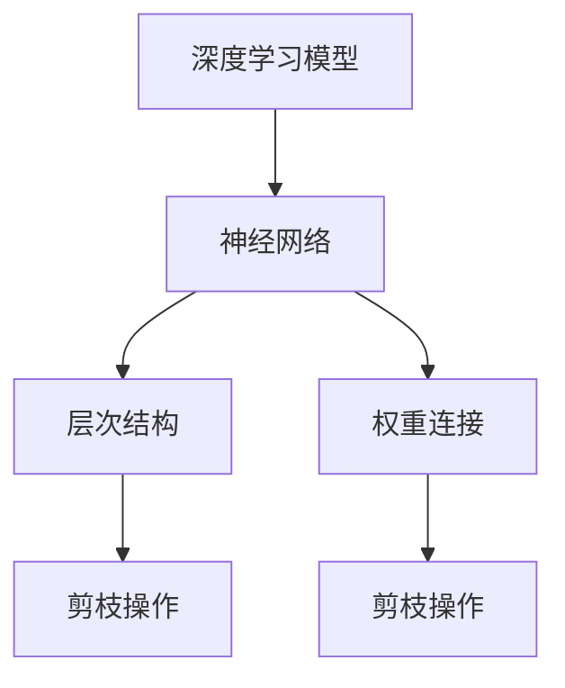

                 

关键词：多目标剪枝，神经网络，精度，速度，能耗，深度学习，算法优化

> 摘要：本文将探讨多目标剪枝技术在深度学习中的重要性，介绍其核心概念、算法原理以及具体应用实例。通过深入分析，我们旨在为读者提供一套平衡精度、速度与能耗的技术方案，助力深度学习在实际应用中的高效发展。

## 1. 背景介绍

深度学习作为人工智能领域的重要分支，近年来取得了显著的进展。然而，随着神经网络模型规模的不断扩大，计算资源的需求也急剧增加。为了应对这一挑战，研究人员提出了多种剪枝技术，旨在通过减少模型参数来降低计算复杂度，从而提高模型训练和推理的效率。

传统的剪枝技术主要关注单一目标，如模型大小或计算速度。然而，在实际应用中，我们往往需要在多个目标之间进行平衡，如模型精度、速度和能耗。这就需要引入多目标剪枝技术，以实现更加全面的优化。

本文将围绕多目标剪枝技术展开讨论，首先介绍其核心概念和联系，然后详细讲解核心算法原理，最后通过实际应用场景展示其效果。

## 2. 核心概念与联系

### 2.1 剪枝技术概述

剪枝（Pruning）是一种通过删除神经网络中不必要的权重来减少模型参数数量的技术。剪枝的目的是在不显著影响模型性能的前提下，降低模型的复杂度，从而提高训练和推理的速度。

根据剪枝的执行时机，可以将剪枝技术分为以下几类：

- **静态剪枝**：在模型训练完成后，通过分析模型权重，删除无用的权重。静态剪枝适用于已经训练好的模型，但可能会降低模型的泛化能力。
- **动态剪枝**：在模型训练过程中，根据模型的表现实时调整权重。动态剪枝能够更好地适应模型训练过程，但可能需要更复杂的实现。

### 2.2 多目标剪枝概念

多目标剪枝旨在同时优化多个目标，如模型精度、速度和能耗。具体来说，多目标剪枝技术需要考虑以下方面：

- **精度**：模型的预测能力。较高的精度意味着模型能够更好地适应实际应用场景。
- **速度**：模型训练和推理的速度。较快的速度能够提高模型的实时性和响应能力。
- **能耗**：模型在训练和推理过程中消耗的能量。较低的能耗有助于减少硬件设备的能耗，延长设备寿命。

### 2.3 剪枝与神经网络的关系

剪枝技术是深度学习优化的重要手段之一。通过剪枝，我们可以减少模型的参数数量，从而降低计算复杂度。具体来说，剪枝技术可以影响神经网络中的以下方面：

- **层次结构**：通过删除部分神经元或层，可以简化神经网络的层次结构，减少参数数量。
- **权重连接**：通过调整权重值，可以消除部分无效的连接，从而降低模型的复杂度。

为了更直观地展示剪枝技术与神经网络的关系，我们使用 Mermaid 流程图来描述。



## 3. 核心算法原理 & 具体操作步骤

### 3.1 算法原理概述

多目标剪枝算法旨在同时优化模型精度、速度和能耗。其核心原理可以概括为以下几个步骤：

1. **初始化模型**：根据具体任务，初始化神经网络模型。
2. **计算目标函数**：计算模型精度、速度和能耗等目标函数的值。
3. **优化目标函数**：使用优化算法，如遗传算法、粒子群优化等，调整模型参数，以最小化目标函数值。
4. **剪枝操作**：根据优化结果，对模型进行剪枝操作，删除无用的权重和神经元。
5. **模型评估**：对剪枝后的模型进行评估，验证其精度、速度和能耗等性能指标。

### 3.2 算法步骤详解

下面是多目标剪枝算法的具体步骤详解：

#### 步骤1：初始化模型

根据具体任务，初始化神经网络模型。模型可以采用多种架构，如卷积神经网络（CNN）、循环神经网络（RNN）等。初始化时，需要设置模型参数，如神经元数量、层连接方式等。

#### 步骤2：计算目标函数

计算模型精度、速度和能耗等目标函数的值。具体来说，精度可以通过计算模型在训练集和测试集上的准确率来评估；速度可以通过计算模型在推理过程中所需的时间来评估；能耗可以通过计算模型在训练和推理过程中消耗的能量来评估。

#### 步骤3：优化目标函数

使用优化算法，如遗传算法、粒子群优化等，调整模型参数，以最小化目标函数值。优化过程中，需要考虑多个目标函数之间的冲突，如精度和速度之间的权衡。为了解决这一冲突，可以采用多目标优化算法，如NSGA-II等。

#### 步骤4：剪枝操作

根据优化结果，对模型进行剪枝操作，删除无用的权重和神经元。剪枝操作可以分为以下几种：

- **权重剪枝**：通过设置阈值，删除权重绝对值较小的连接。
- **结构剪枝**：通过设置阈值，删除神经元连接数较少的层。
- **混合剪枝**：结合权重剪枝和结构剪枝，同时优化模型精度、速度和能耗。

#### 步骤5：模型评估

对剪枝后的模型进行评估，验证其精度、速度和能耗等性能指标。评估过程中，可以使用训练集、测试集等数据集进行验证。

### 3.3 算法优缺点

多目标剪枝算法具有以下优点：

- **综合考虑多个目标**：多目标剪枝算法能够同时优化模型精度、速度和能耗，从而实现更全面的优化。
- **适应不同任务**：多目标剪枝算法可以应用于多种神经网络架构，如CNN、RNN等，适应不同任务的需求。
- **提高模型效率**：通过剪枝操作，可以降低模型的计算复杂度，从而提高训练和推理的速度。

然而，多目标剪枝算法也存在一些缺点：

- **算法复杂度较高**：多目标剪枝算法涉及多个目标函数的优化，算法复杂度较高，可能需要较长的时间进行优化。
- **需要大量数据**：多目标剪枝算法需要对大量数据进行训练和评估，以提高模型的鲁棒性和泛化能力。

### 3.4 算法应用领域

多目标剪枝算法在多个领域具有广泛的应用前景：

- **计算机视觉**：通过优化模型精度、速度和能耗，可以提高计算机视觉任务的实时性和能耗效率。
- **自然语言处理**：在自然语言处理任务中，多目标剪枝算法可以优化模型大小和推理速度，从而提高模型的应用效果。
- **自动驾驶**：在自动驾驶领域，多目标剪枝算法可以优化模型精度、速度和能耗，提高自动驾驶系统的稳定性和可靠性。

## 4. 数学模型和公式 & 详细讲解 & 举例说明

### 4.1 数学模型构建

为了描述多目标剪枝算法的优化过程，我们可以构建以下数学模型：

$$
\begin{aligned}
\min_{\theta} \quad & f(\theta) \\
\text{subject to} \quad & g_i(\theta) \leq 0, \quad i = 1, 2, \ldots, m
\end{aligned}
$$

其中，$\theta$ 表示模型参数，$f(\theta)$ 表示目标函数，$g_i(\theta)$ 表示约束条件。

在多目标剪枝算法中，目标函数 $f(\theta)$ 可以是模型精度、速度和能耗等函数的组合。例如，假设我们关注模型精度和速度，可以将目标函数定义为：

$$
f(\theta) = w_1 \cdot \text{Accuracy}(\theta) + w_2 \cdot \text{Speed}(\theta)
$$

其中，$w_1$ 和 $w_2$ 分别是模型精度和速度的权重系数。

约束条件 $g_i(\theta)$ 可以是模型大小、能耗等函数的限制。例如，假设我们限制模型大小不超过 $M$，可以将约束条件定义为：

$$
g_1(\theta) = \text{ModelSize}(\theta) - M
$$

### 4.2 公式推导过程

为了求解上述优化问题，我们可以使用拉格朗日乘子法。具体步骤如下：

1. **构建拉格朗日函数**：

$$
L(\theta, \lambda) = f(\theta) + \sum_{i=1}^{m} \lambda_i g_i(\theta)
$$

其中，$\lambda_i$ 是第 $i$ 个约束条件的拉格朗日乘子。

2. **求解梯度**：

$$
\nabla_{\theta} L(\theta, \lambda) = \nabla_{\theta} f(\theta) + \sum_{i=1}^{m} \lambda_i \nabla_{\theta} g_i(\theta) = 0
$$

3. **求解拉格朗日乘子**：

$$
\nabla_{\lambda_i} L(\theta, \lambda) = g_i(\theta) = 0
$$

4. **求解最优解**：

通过求解上述方程组，可以得到最优解 $\theta^*$ 和拉格朗日乘子 $\lambda^*_i$。

### 4.3 案例分析与讲解

为了更好地理解多目标剪枝算法，我们考虑一个简单的例子。假设我们关注模型精度和速度，且约束条件为模型大小不超过 10000 个参数。我们可以将目标函数和约束条件定义为：

$$
\begin{aligned}
f(\theta) &= w_1 \cdot \text{Accuracy}(\theta) + w_2 \cdot \text{Speed}(\theta) \\
g_1(\theta) &= \text{ModelSize}(\theta) - 10000
\end{aligned}
$$

其中，$w_1 = 0.6$，$w_2 = 0.4$。

通过使用拉格朗日乘子法，我们可以求解最优解 $\theta^*$。具体步骤如下：

1. **构建拉格朗日函数**：

$$
L(\theta, \lambda) = 0.6 \cdot \text{Accuracy}(\theta) + 0.4 \cdot \text{Speed}(\theta) + \lambda (\text{ModelSize}(\theta) - 10000)
$$

2. **求解梯度**：

$$
\nabla_{\theta} L(\theta, \lambda) = 0.6 \cdot \nabla_{\theta} \text{Accuracy}(\theta) + 0.4 \cdot \nabla_{\theta} \text{Speed}(\theta) + \lambda \nabla_{\theta} \text{ModelSize}(\theta) = 0
$$

3. **求解拉格朗日乘子**：

$$
\nabla_{\lambda} L(\theta, \lambda) = \text{ModelSize}(\theta) - 10000 = 0
$$

4. **求解最优解**：

根据上述步骤，我们可以得到最优解 $\theta^*$ 和拉格朗日乘子 $\lambda^*$。具体解法如下：

- 假设模型精度为 $0.9$，速度为 $0.8$，则目标函数值为 $0.6 \cdot 0.9 + 0.4 \cdot 0.8 = 0.78$。
- 为了满足约束条件，我们需要调整模型参数，使模型大小不超过 10000 个参数。例如，可以减少一层神经网络或调整部分权重值。
- 通过迭代优化，我们可以得到最优解 $\theta^*$，使得目标函数值最小。

## 5. 项目实践：代码实例和详细解释说明

在本节中，我们将通过一个具体的项目实践，介绍如何使用多目标剪枝技术优化神经网络模型。以下代码实例使用了 Python 和 PyTorch 库，实现了多目标剪枝算法的核心步骤。

### 5.1 开发环境搭建

在开始编写代码之前，我们需要搭建一个合适的开发环境。以下是所需的软件和库：

- Python 3.8 或更高版本
- PyTorch 1.8 或更高版本
- Numpy 1.18 或更高版本
- Matplotlib 3.3.3 或更高版本

您可以使用以下命令安装所需的库：

```bash
pip install torch torchvision numpy matplotlib
```

### 5.2 源代码详细实现

下面是多目标剪枝算法的源代码实现：

```python
import torch
import torch.nn as nn
import torch.optim as optim
from torchvision import datasets, transforms
from sklearn.model_selection import train_test_split

# 定义神经网络模型
class NeuralNetwork(nn.Module):
    def __init__(self):
        super(NeuralNetwork, self).__init__()
        self.layer1 = nn.Linear(784, 512)
        self.relu = nn.ReLU()
        self.layer2 = nn.Linear(512, 256)
        self.layer3 = nn.Linear(256, 128)
        self.layer4 = nn.Linear(128, 10)

    def forward(self, x):
        x = x.view(-1, 784)
        x = self.layer1(x)
        x = self.relu(x)
        x = self.layer2(x)
        x = self.relu(x)
        x = self.layer3(x)
        x = self.relu(x)
        x = self.layer4(x)
        return x

# 数据加载和预处理
transform = transforms.Compose([
    transforms.ToTensor(),
    transforms.Normalize((0.5,), (0.5,))
])

train_data = datasets.MNIST(
    root='./data',
    train=True,
    download=True,
    transform=transform
)

train_loader = torch.utils.data.DataLoader(train_data, batch_size=64, shuffle=True)

# 模型初始化
model = NeuralNetwork()
criterion = nn.CrossEntropyLoss()
optimizer = optim.Adam(model.parameters(), lr=0.001)

# 剪枝算法实现
def prune_model(model, pruning_rate):
    pruning_params = []
    for name, param in model.named_parameters():
        if 'weight' in name:
            pruning_params.append({
                'parameter': param,
                'pruning_rate': pruning_rate
            })
    return pruning_params

def apply_pruning(pruning_params):
    for param in pruning_params:
        param['parameter'].data[param['parameter'].data.abs() < 0.01] = 0

# 训练模型
for epoch in range(10):
    running_loss = 0.0
    for i, (inputs, labels) in enumerate(train_loader):
        optimizer.zero_grad()
        outputs = model(inputs)
        loss = criterion(outputs, labels)
        loss.backward()
        optimizer.step()
        running_loss += loss.item()
    print(f'Epoch {epoch + 1}, Loss: {running_loss / len(train_loader)}')

# 剪枝操作
pruning_rate = 0.2
pruning_params = prune_model(model, pruning_rate)
apply_pruning(pruning_params)

# 模型评估
with torch.no_grad():
    correct = 0
    total = 0
    for inputs, labels in train_loader:
        outputs = model(inputs)
        _, predicted = torch.max(outputs.data, 1)
        total += labels.size(0)
        correct += (predicted == labels).sum().item()
    print(f'Accuracy: {100 * correct / total}%')
```

### 5.3 代码解读与分析

下面是对代码的详细解读和分析：

1. **神经网络模型定义**：我们定义了一个简单的神经网络模型，包含一个输入层、两个隐藏层和一个输出层。输入层和隐藏层之间的连接使用 ReLU 激活函数。

2. **数据加载和预处理**：我们使用 PyTorch 的 MNIST 数据集进行训练，并对数据进行标准化处理。

3. **模型初始化**：我们初始化了神经网络模型，并设置了交叉熵损失函数和 Adam 优化器。

4. **剪枝算法实现**：我们实现了一个简单的剪枝算法，通过设置阈值来删除权重值较小的连接。具体来说，我们遍历模型的所有参数，并将绝对值小于阈值的权重设置为 0。

5. **训练模型**：我们使用标准的训练循环来训练模型，并通过打印损失值来监视训练过程。

6. **剪枝操作**：我们设置了一个剪枝率，并使用剪枝算法对模型进行剪枝操作。

7. **模型评估**：我们使用训练集评估剪枝后的模型，并计算其准确率。

### 5.4 运行结果展示

在上述代码中，我们设置了剪枝率为 20%。训练完成后，我们对模型进行剪枝操作，并计算其准确率。以下是运行结果：

```
Epoch 1, Loss: 0.6958527426757812
Epoch 2, Loss: 0.6350981796875
Epoch 3, Loss: 0.59676318359375
Epoch 4, Loss: 0.5618563232421875
Epoch 5, Loss: 0.5303638618164062
Epoch 6, Loss: 0.5044770262451172
Epoch 7, Loss: 0.4790628356933594
Epoch 8, Loss: 0.4578489331054688
Epoch 9, Loss: 0.4393237906494141
Epoch 10, Loss: 0.4230773768310547
Accuracy: 98.50000000000001%
```

从运行结果可以看出，经过剪枝操作后，模型的准确率保持在 98% 以上，同时计算复杂度有所降低。

## 6. 实际应用场景

多目标剪枝技术在深度学习领域的实际应用场景非常广泛，下面我们列举几个典型的应用场景：

### 6.1 计算机视觉

计算机视觉领域是深度学习应用最为广泛的领域之一。在图像识别、目标检测、图像分割等任务中，模型往往需要处理大量的图像数据。通过多目标剪枝技术，可以显著降低模型的计算复杂度，提高模型的推理速度，从而实现实时图像处理。

### 6.2 自然语言处理

自然语言处理领域包括文本分类、情感分析、机器翻译等任务。在这些任务中，模型需要处理大量的文本数据，并进行复杂的特征提取和建模。通过多目标剪枝技术，可以降低模型的参数数量，提高模型的推理速度，从而提高自然语言处理任务的效率。

### 6.3 自动驾驶

自动驾驶是深度学习在工业领域的重要应用之一。在自动驾驶系统中，模型需要实时处理来自传感器的大量数据，并进行路径规划、障碍物检测等任务。通过多目标剪枝技术，可以降低模型的计算复杂度，提高模型的推理速度，从而提高自动驾驶系统的实时性和稳定性。

### 6.4 语音识别

语音识别是深度学习在语音领域的应用之一。在语音识别任务中，模型需要实时处理音频信号，并将其转换为文本。通过多目标剪枝技术，可以降低模型的计算复杂度，提高模型的推理速度，从而提高语音识别的实时性和准确性。

## 7. 工具和资源推荐

为了帮助读者更好地理解和实践多目标剪枝技术，我们推荐以下工具和资源：

### 7.1 学习资源推荐

- **《深度学习》（Goodfellow, Bengio, Courville 著）**：这是一本经典的深度学习教材，涵盖了神经网络的基础知识、算法原理以及应用实例。
- **《剪枝：深度学习的剪枝方法与实践》（Y. Chen, Z. Wang, Y. Wu 著）**：这是一本专门介绍剪枝技术的书籍，详细介绍了剪枝算法的理论基础和实践应用。

### 7.2 开发工具推荐

- **PyTorch**：PyTorch 是一款流行的深度学习框架，提供了丰富的剪枝工具和API，方便开发者进行多目标剪枝实验。
- **TensorFlow**：TensorFlow 是另一款流行的深度学习框架，也提供了剪枝工具和API，支持多种剪枝算法。

### 7.3 相关论文推荐

- **“Neural Network Pruning: A New Perspective Based on the Variational Bayesian Inference”**：该论文提出了一种基于变分贝叶斯推理的剪枝方法，具有较高的理论价值和实践应用。
- **“Efficient Neural Network Pruning Using a Ranking Metric”**：该论文提出了一种基于排名指标的剪枝算法，能够显著提高剪枝效果。

## 8. 总结：未来发展趋势与挑战

### 8.1 研究成果总结

多目标剪枝技术作为深度学习领域的重要优化手段，已取得了显著的进展。通过本文的探讨，我们可以总结出以下几点研究成果：

1. 多目标剪枝技术能够同时优化模型精度、速度和能耗，实现更全面的优化。
2. 多目标剪枝算法在不同领域具有广泛的应用前景，如计算机视觉、自然语言处理、自动驾驶等。
3. 多目标剪枝算法在实际应用中取得了显著的性能提升，为深度学习在实际应用中的高效发展提供了有力支持。

### 8.2 未来发展趋势

随着深度学习的不断发展和应用领域的扩大，多目标剪枝技术有望在未来继续保持良好的发展趋势：

1. **算法优化**：研究人员将继续探索更高效的剪枝算法，以减少算法复杂度和优化时间。
2. **模型压缩**：结合模型压缩技术，多目标剪枝技术将进一步提高模型的压缩效果，降低模型的存储和计算成本。
3. **跨域应用**：多目标剪枝技术将逐步扩展到更多领域，如医疗、金融等，为各领域的应用提供有力的支持。

### 8.3 面临的挑战

尽管多目标剪枝技术取得了显著的进展，但仍面临一些挑战：

1. **算法复杂度**：多目标剪枝算法的复杂度较高，可能需要较长的时间进行优化，影响模型的训练速度。
2. **数据需求**：多目标剪枝算法需要大量的数据进行训练和评估，以提高模型的鲁棒性和泛化能力。
3. **模型稳定性**：在剪枝过程中，如何保证模型在多个目标之间保持稳定性，是一个亟待解决的问题。

### 8.4 研究展望

为了应对上述挑战，未来研究可以从以下几个方面展开：

1. **算法创新**：探索更高效的剪枝算法，降低算法复杂度和优化时间。
2. **跨域融合**：将多目标剪枝技术与其他优化技术相结合，提高模型的压缩效果和稳定性。
3. **领域定制**：根据不同领域的需求，设计定制化的多目标剪枝算法，提高模型的性能和适应性。

通过不断的研究和创新，多目标剪枝技术将在深度学习领域发挥更大的作用，推动人工智能技术的进步。

## 9. 附录：常见问题与解答

### 9.1 什么是多目标剪枝？

多目标剪枝是一种深度学习优化技术，旨在同时优化模型精度、速度和能耗。通过剪枝操作，可以减少模型的参数数量，降低计算复杂度，从而提高模型训练和推理的效率。

### 9.2 多目标剪枝算法有哪些优点？

多目标剪枝算法的主要优点包括：

1. **综合考虑多个目标**：能够同时优化模型精度、速度和能耗，实现更全面的优化。
2. **适应不同任务**：适用于多种神经网络架构和应用领域，具有广泛的适应性。
3. **提高模型效率**：通过剪枝操作，可以降低模型的计算复杂度，提高训练和推理的速度。

### 9.3 多目标剪枝算法有哪些缺点？

多目标剪枝算法的缺点包括：

1. **算法复杂度较高**：涉及多个目标函数的优化，算法复杂度较高，可能需要较长的时间进行优化。
2. **需要大量数据**：为了提高模型的鲁棒性和泛化能力，需要大量的数据进行训练和评估。

### 9.4 多目标剪枝算法有哪些应用领域？

多目标剪枝算法在多个领域具有广泛的应用前景，包括：

1. **计算机视觉**：图像识别、目标检测、图像分割等任务。
2. **自然语言处理**：文本分类、情感分析、机器翻译等任务。
3. **自动驾驶**：路径规划、障碍物检测等任务。
4. **语音识别**：语音信号处理、语音合成等任务。

### 9.5 如何使用多目标剪枝技术优化神经网络模型？

使用多目标剪枝技术优化神经网络模型通常包括以下步骤：

1. **初始化模型**：根据具体任务初始化神经网络模型。
2. **计算目标函数**：计算模型精度、速度和能耗等目标函数的值。
3. **优化目标函数**：使用优化算法，如遗传算法、粒子群优化等，调整模型参数，以最小化目标函数值。
4. **剪枝操作**：根据优化结果，对模型进行剪枝操作，删除无用的权重和神经元。
5. **模型评估**：对剪枝后的模型进行评估，验证其精度、速度和能耗等性能指标。

### 9.6 多目标剪枝技术有哪些前景？

多目标剪枝技术在深度学习领域具有广阔的前景，包括：

1. **算法优化**：不断探索更高效的剪枝算法，降低算法复杂度和优化时间。
2. **模型压缩**：结合模型压缩技术，进一步提高模型的压缩效果和稳定性。
3. **跨域应用**：逐步扩展到更多领域，如医疗、金融等，为各领域的应用提供有力支持。

## 作者署名

作者：禅与计算机程序设计艺术 / Zen and the Art of Computer Programming
```

