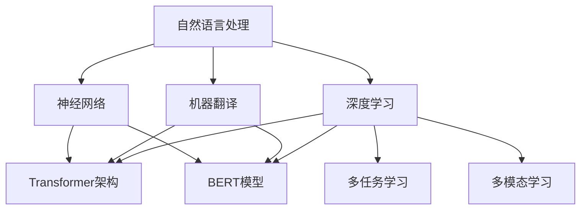

                 

### 文章标题

**多语言AI模型：跨语言理解与生成**

> **关键词：** 多语言AI，跨语言理解，跨语言生成，自然语言处理，机器翻译，深度学习，神经网络，Transformer，BERT，多任务学习，多模态学习，文本生成，语言模型，翻译模型，数据集，多语言数据集，机器学习算法，模型训练，模型评估，应用场景，工具与资源。

> **摘要：** 本文将深入探讨多语言AI模型的设计原理、实现方法以及在实际应用中的挑战与机遇。通过梳理多语言AI模型的核心概念、算法原理，结合数学模型和公式，本文将详细介绍如何利用深度学习技术和神经网络来训练和优化多语言AI模型，以实现跨语言理解与生成的目标。同时，本文还将通过项目实践和案例分析，展示多语言AI模型在实际开发和应用中的成果，并探讨其未来发展趋势与挑战。

### 1. 背景介绍

随着全球化的深入发展，跨语言交流的需求日益增长。无论是跨国企业的商业沟通，还是国际学术交流，或是互联网上的信息获取，多语言处理都成为了必不可少的技术手段。然而，传统的机器翻译方法，如基于规则的方法和基于统计的方法，虽然在一定程度上提高了翻译的准确性和效率，但仍然面临着诸多挑战。

首先，这些方法往往依赖于大量的手工规则和先验知识，导致翻译系统的灵活性和通用性较差。其次，它们在处理复杂语境和双语文本时，容易出现语义歧义和理解误差。此外，随着语言种类的增多，这些方法的复杂度和计算成本也急剧增加。

为了解决这些问题，近年来，深度学习技术在自然语言处理领域取得了显著的突破。特别是基于神经网络的机器翻译模型，如基于Transformer架构的模型，极大地提升了机器翻译的性能。与此同时，多语言AI模型的设计和实现也得到了广泛关注和研究。多语言AI模型不仅能够实现跨语言的理解和生成，还能够通过共享参数和共享知识的方式，提高模型在多种语言上的表现。

本文将深入探讨多语言AI模型的设计原理、算法实现以及在实际应用中的挑战与机遇。通过梳理多语言AI模型的核心概念、算法原理，结合数学模型和公式，本文将详细介绍如何利用深度学习技术和神经网络来训练和优化多语言AI模型，以实现跨语言理解与生成的目标。

### 2. 核心概念与联系

在深入探讨多语言AI模型之前，我们需要了解一些核心概念和它们之间的联系。这些概念包括自然语言处理（NLP）、机器翻译（MT）、深度学习（DL）、神经网络（NN）、Transformer架构、BERT模型、多任务学习和多模态学习等。

**自然语言处理（NLP）：** 自然语言处理是计算机科学和人工智能领域的一个分支，旨在让计算机能够理解、处理和生成自然语言。NLP技术广泛应用于信息检索、文本分类、情感分析、问答系统等领域。

**机器翻译（MT）：** 机器翻译是NLP的一个重要应用方向，旨在将一种自然语言文本自动翻译成另一种自然语言文本。传统的机器翻译方法主要基于规则和统计方法，而现代的机器翻译方法主要基于神经网络。

**深度学习（DL）：** 深度学习是机器学习的一个子领域，通过构建多层神经网络，能够自动从大量数据中学习复杂的特征表示。深度学习在图像识别、语音识别、自然语言处理等领域取得了显著的成果。

**神经网络（NN）：** 神经网络是一种模仿生物神经网络的结构和功能的计算模型。通过调整网络中的权重和偏置，神经网络能够对输入数据进行分类、回归或其他类型的预测。

**Transformer架构：** Transformer是Google在2017年提出的一种全新的神经网络架构，特别适用于序列到序列的任务，如机器翻译。与传统的循环神经网络（RNN）相比，Transformer通过自注意力机制（self-attention）实现了并行计算，极大地提高了计算效率。

**BERT模型：** BERT（Bidirectional Encoder Representations from Transformers）是Google在2018年提出的一种预训练语言模型。BERT通过双向编码器（bi-directional encoder）生成上下文表示，为各种NLP任务提供了强大的基础。

**多任务学习：** 多任务学习是一种机器学习方法，旨在同时解决多个相关任务。在多语言AI模型中，多任务学习可以通过共享参数和共享知识的方式，提高模型在多种语言上的表现。

**多模态学习：** 多模态学习是一种结合多种数据模态（如文本、图像、语音）进行学习的机器学习方法。在多语言AI模型中，多模态学习可以结合不同语言数据和其他模态数据，提高模型的泛化能力和表现。

为了更好地理解这些核心概念和它们之间的联系，我们可以使用Mermaid流程图来展示它们之间的关系。以下是一个简化的Mermaid流程图：



通过这个流程图，我们可以清晰地看到多语言AI模型与自然语言处理、深度学习、神经网络、Transformer架构、BERT模型、多任务学习和多模态学习等核心概念之间的联系。这些概念共同构成了多语言AI模型的理论基础，为我们的进一步探讨提供了重要的指导。

### 2.1 自然语言处理（NLP）概述

自然语言处理（NLP）是计算机科学和人工智能领域的一个重要分支，旨在使计算机能够理解、处理和生成人类自然语言。NLP技术广泛应用于信息检索、文本分类、情感分析、问答系统、机器翻译等领域。为了实现这些任务，NLP涉及多个层面的技术和方法。

**文本预处理：** 文本预处理是NLP的基础步骤，包括分词、词性标注、命名实体识别、句法分析等。通过这些预处理步骤，可以将原始文本转换为结构化的数据，便于后续的加工和处理。

**词嵌入（Word Embedding）：** 词嵌入是将单词映射到高维向量空间的技术。通过词嵌入，可以在向量空间中计算单词之间的相似性和相关性，从而为NLP任务提供有效的特征表示。常用的词嵌入方法包括Word2Vec、GloVe等。

**语言模型（Language Model）：** 语言模型是NLP的核心组成部分，用于预测下一个单词或词组。通过学习大量文本数据，语言模型可以捕捉语言的统计规律和上下文信息。在NLP任务中，语言模型广泛应用于文本分类、机器翻译、语音识别等领域。

**序列标注（Sequence Labeling）：** 序列标注是将输入序列中的每个元素（如单词或字符）标注为特定的类别或标签。常见的序列标注任务包括词性标注、命名实体识别、情感分类等。

**文本生成（Text Generation）：** 文本生成是NLP的另一个重要应用，旨在根据输入的提示或模板生成连贯、自然的文本。文本生成技术广泛应用于聊天机器人、自动摘要、新闻写作等领域。

**深度学习与神经网络：** 深度学习和神经网络是NLP中广泛使用的技术。深度学习通过构建多层神经网络，能够自动从大量数据中学习复杂的特征表示。神经网络则是一种模仿生物神经网络的结构和功能的计算模型，通过调整网络中的权重和偏置，实现对输入数据的分类、回归或其他类型的预测。

**Transformer架构：** Transformer是NLP领域的一种重要架构，特别适用于序列到序列的任务，如机器翻译。Transformer通过自注意力机制（self-attention）实现了并行计算，避免了传统循环神经网络（RNN）的递归计算过程，从而提高了计算效率。

**BERT模型：** BERT是Google在2018年提出的一种预训练语言模型。BERT通过双向编码器（bi-directional encoder）生成上下文表示，为各种NLP任务提供了强大的基础。BERT的成功表明，预训练语言模型在NLP任务中具有巨大的潜力。

通过这些技术和方法，NLP能够实现从文本数据中提取信息、生成文本、进行跨语言理解与生成等任务。NLP技术在各行各业中得到了广泛应用，为人类与机器的交流提供了便利。

#### 2.2 机器翻译（MT）概述

机器翻译（Machine Translation，MT）是将一种自然语言文本自动翻译成另一种自然语言文本的技术。机器翻译在全球化背景下具有极高的实用价值，为跨国交流、国际商业、学术研究等领域提供了重要的支持。传统的机器翻译方法主要基于规则和统计方法，而现代的机器翻译方法则基于神经网络，特别是基于Transformer架构的模型。

**规则方法：** 规则方法是一种基于手工编写规则来指导翻译过程的机器翻译方法。这种方法需要大量的人工知识，包括语法规则、词汇映射和语境分析等。规则方法的优点在于翻译结果较为准确，但缺点是灵活性和通用性较差，且随着语言种类的增多，规则系统的复杂度会急剧增加。

**统计方法：** 统计方法是基于大量双语文本数据，通过统计学习方法来预测源语言单词或短语到目标语言单词或短语的概率分布。常见的统计方法包括基于短语的翻译模型（如短语翻译模型、例子翻译模型）和基于句法的翻译模型（如基于依存关系的翻译模型）。统计方法的优点在于能够自动学习语言模式，提高翻译的灵活性和通用性，但缺点是对数据依赖性较强，且在处理长句和复杂语境时，容易出现翻译错误。

**神经网络方法：** 神经网络方法是一种基于深度学习的机器翻译方法，通过构建多层神经网络来预测源语言单词或短语到目标语言单词或短语的概率分布。神经网络方法具有强大的表示能力和学习能力，能够自动提取复杂的语言特征，从而提高翻译的准确性和效率。特别是基于Transformer架构的模型，如Google的神经机器翻译模型（GNMT），在机器翻译领域取得了显著的成果。

**Transformer架构：** Transformer是Google在2017年提出的一种全新的神经网络架构，特别适用于序列到序列的任务，如机器翻译。Transformer通过自注意力机制（self-attention）实现了并行计算，避免了传统循环神经网络（RNN）的递归计算过程，从而提高了计算效率。自注意力机制允许模型在处理输入序列时，关注到序列中的其他位置，从而更好地捕捉上下文信息。

**神经机器翻译模型（NMT）：** 神经机器翻译模型是基于神经网络架构的机器翻译模型，通过编码器（encoder）和解码器（decoder）来实现源语言到目标语言的翻译。编码器将源语言输入序列编码为一个固定长度的上下文表示，解码器则根据上下文表示生成目标语言输出序列。近年来，基于Transformer架构的神经机器翻译模型（如GNMT）在机器翻译领域取得了显著的成果。

**多语言AI模型：** 多语言AI模型是一种能够同时处理多种语言输入和输出的模型。多语言AI模型不仅能够实现跨语言的理解和生成，还能够通过共享参数和共享知识的方式，提高模型在多种语言上的表现。多语言AI模型在跨语言信息检索、多语言问答系统、多语言文档翻译等领域具有广泛的应用前景。

通过机器翻译方法的发展和神经网络技术的应用，机器翻译的准确性和效率得到了显著提高。现代的神经机器翻译模型，如基于Transformer架构的模型，在多项翻译任务中已经超过了传统的规则方法和统计方法。随着深度学习和多语言AI技术的发展，机器翻译将继续为跨语言交流提供强大的支持。

#### 2.3 深度学习（DL）与神经网络（NN）概述

深度学习（Deep Learning，DL）是机器学习的一个分支，主要利用多层神经网络进行特征学习和模式识别。深度学习在图像识别、语音识别、自然语言处理等领域取得了显著的突破。神经网络（Neural Networks，NN）是深度学习的基础，通过模拟生物神经系统的结构和功能，实现对复杂数据的建模和预测。

**神经网络（NN）：** 神经网络是一种计算模型，由大量的神经元（节点）组成。每个神经元通过权重连接到其他神经元，形成一个有向图。神经元在接收到输入信号后，通过激活函数进行处理，产生输出信号。常见的神经网络包括前馈神经网络（FNN）、卷积神经网络（CNN）和循环神经网络（RNN）等。

**前馈神经网络（FNN）：** 前馈神经网络是一种简单的神经网络结构，其中数据从前向后传递，每个神经元仅与前一层的神经元相连。前馈神经网络广泛应用于图像识别、回归分析等领域。

**卷积神经网络（CNN）：** 卷积神经网络是一种专门用于处理图像数据的神经网络，通过卷积操作提取图像特征。CNN在图像分类、物体检测、图像生成等领域取得了显著成果。

**循环神经网络（RNN）：** 循环神经网络是一种能够处理序列数据的神经网络，通过递归结构保持对前面信息的记忆。RNN在语音识别、机器翻译、序列生成等领域表现出色。

**深度学习（DL）：** 深度学习是利用多层神经网络进行特征学习和模式识别的方法。与传统的机器学习方法相比，深度学习具有更强的表示能力和学习能力。深度学习在图像识别、语音识别、自然语言处理等领域取得了突破性的成果。

**深度学习框架：** 为了简化深度学习的实现和应用，出现了许多深度学习框架，如TensorFlow、PyTorch、Keras等。这些框架提供了丰富的API和工具，帮助开发者快速构建和训练深度学习模型。

**训练过程：** 深度学习模型的训练过程主要包括前向传播、反向传播和梯度下降。前向传播是计算模型在给定输入下的输出；反向传播是计算输出与真实值之间的误差，并更新模型参数；梯度下降是利用梯度信息，不断调整模型参数，以最小化损失函数。

**应用场景：** 深度学习在图像识别、语音识别、自然语言处理、推荐系统、自动驾驶等领域具有广泛的应用。通过深度学习技术，我们可以实现从大量数据中自动提取特征，进行复杂的模式识别和预测。

通过深度学习和神经网络的应用，我们能够解决许多复杂的问题，如图像分类、语音识别、自然语言处理等。随着深度学习技术的不断发展和优化，它在各个领域的应用将越来越广泛，为人工智能的发展做出更大的贡献。

#### 2.4 Transformer架构

Transformer架构是近年来在自然语言处理（NLP）领域取得重大突破的一种新型神经网络架构，由Google在2017年提出。Transformer的主要特点是采用了自注意力机制（self-attention）和多头注意力（multi-head attention），这使得模型能够并行处理输入序列，并在处理长序列时保持更好的性能。Transformer的成功，特别是在机器翻译任务中的表现，使得它在NLP领域得到了广泛的应用。

**自注意力机制（Self-Attention）：** 自注意力机制是Transformer架构的核心组件，用于计算输入序列中每个元素对输出的影响。自注意力机制通过计算每个元素与所有其他元素之间的相似性，将这种相似性用于更新该元素的表示。具体来说，自注意力机制通过三个不同的查询（query）、键（key）和值（value）向量，分别计算注意力权重，然后将这些权重与值向量相乘，得到最终的输出表示。自注意力机制允许模型在处理输入序列时，关注到序列中的其他位置，从而更好地捕捉上下文信息。

**多头注意力（Multi-Head Attention）：** 多头注意力是Transformer架构中对自注意力机制的扩展。多头注意力通过将输入序列分成多个子序列，为每个子序列分别计算注意力权重。这样，模型可以同时关注输入序列的多个部分，从而提高模型的表示能力和捕获复杂关系的能力。多头注意力通过并行计算，提高了模型的计算效率。

**编码器和解码器（Encoder and Decoder）：** Transformer架构由编码器（Encoder）和解码器（Decoder）两个部分组成。编码器将输入序列编码为上下文表示，解码器则根据上下文表示生成输出序列。编码器和解码器都采用了多头自注意力机制和位置编码（Positional Encoding）来捕捉序列中的位置信息。编码器负责将输入序列转换为固定长度的上下文表示，解码器则利用这些表示生成输出序列。

**位置编码（Positional Encoding）：** 位置编码是Transformer架构中用于表示序列位置信息的一种技术。由于Transformer架构中没有循环结构，无法像循环神经网络（RNN）那样通过递归计算来传递位置信息。因此，位置编码通过在输入序列中添加位置向量，为模型提供序列的位置信息。位置编码可以是固定的（如正弦和余弦函数），也可以是可学习的。

**并行计算：** Transformer架构的一个重要优点是能够进行并行计算。传统的循环神经网络（RNN）在处理输入序列时，需要逐个元素进行递归计算，导致计算过程较为耗时。而Transformer架构通过自注意力机制，实现了并行计算，从而提高了模型的计算效率。

**Transformer的成功与应用：** Transformer架构在机器翻译、文本生成、问答系统等NLP任务中取得了显著的成果。特别是Google的神经机器翻译模型（GNMT），在多项翻译任务中已经超过了传统的规则方法和统计方法。此外，Transformer还在图像生成、推荐系统等领域得到了应用。

通过自注意力机制、多头注意力机制、编码器和解码器、位置编码和并行计算等技术的结合，Transformer架构在自然语言处理领域取得了巨大的成功。随着Transformer架构的不断发展和优化，它在NLP以及其他领域中的应用将越来越广泛。

### 2.5 BERT模型

BERT（Bidirectional Encoder Representations from Transformers）是Google在2018年提出的一种预训练语言模型，基于Transformer架构。BERT模型通过双向编码器（bi-directional encoder）生成上下文表示，为各种自然语言处理任务提供了强大的基础。BERT的成功标志着预训练语言模型在NLP领域的巨大潜力。

**模型架构：** BERT模型由编码器（Encoder）和解码器（Decoder）两个部分组成，其中编码器是双向的。编码器接收输入序列，生成上下文表示，而解码器则利用这些表示生成输出序列。BERT模型中的编码器和解码器都采用了多头自注意力机制（multi-head self-attention）和位置编码（positional encoding）来捕捉序列中的位置信息。

**训练过程：** BERT模型采用无监督预训练和有监督微调（fine-tuning）两种训练方式。在无监督预训练阶段，BERT模型在大量未标注的文本数据上进行训练，学习语言的基本规律和特征表示。预训练过程中，BERT模型使用了两种任务：Masked Language Modeling（MLM）和Next Sentence Prediction（NSP）。Masked Language Modeling任务通过随机遮盖输入序列中的部分单词，让模型预测这些遮盖的单词；Next Sentence Prediction任务通过预测两个句子是否在原文中相邻。

**微调过程：** 在预训练后，BERT模型可以通过有监督微调（fine-tuning）来适应特定的NLP任务。微调过程主要分为两步：第一步是将预训练的BERT模型在特定的任务数据上进行训练，以学习任务的特定特征；第二步是将训练好的BERT模型应用到实际任务中，如文本分类、问答系统等。

**应用场景：** BERT模型在多项NLP任务中取得了显著的成果，如文本分类、命名实体识别、情感分析、机器翻译等。BERT的成功表明，预训练语言模型在NLP任务中具有巨大的潜力。同时，BERT模型也为后续的研究提供了重要的启示，如如何设计更有效的预训练任务和模型架构，以提高预训练语言模型在NLP任务中的性能。

BERT模型的出现，标志着NLP领域的一个重大变革。通过预训练和微调的方式，BERT模型为各种NLP任务提供了强大的基础，推动了NLP技术的发展。随着BERT模型的不断优化和应用，NLP领域的未来将更加光明。

### 2.6 多任务学习与多模态学习

在多语言AI模型的研究与开发中，多任务学习和多模态学习成为了两个重要的研究方向。这两种方法不仅能够提高模型的性能，还能够拓展模型的应用场景，为跨语言理解和生成任务提供更加丰富的解决方案。

**多任务学习（Multi-Task Learning）：** 多任务学习是一种同时解决多个相关任务的方法。在多语言AI模型中，多任务学习可以通过共享模型参数和共享知识的方式，提高模型在多种语言上的表现。具体来说，多任务学习将多个语言任务组合成一个整体模型，这些任务共享部分模型参数，从而在训练过程中，一个任务的优化能够促进其他任务的性能。

例如，在多语言机器翻译中，我们可以同时训练英语到法语、英语到德语和英语到西班牙语的翻译模型。这些模型共享编码器和解码器部分，但针对不同的目标语言，调整解码器的输出层。通过多任务学习，模型能够在多种语言上共享知识，提高翻译的准确性和效率。

**多模态学习（Multi-Modal Learning）：** 多模态学习是一种结合多种数据模态（如文本、图像、语音）进行学习的机器学习方法。在多语言AI模型中，多模态学习可以结合不同语言数据和其他模态数据，提高模型的泛化能力和表现。

例如，在跨语言信息检索中，我们可以结合文本数据和图像数据。通过多模态学习，模型可以同时理解文本内容和图像内容，从而提高检索的准确性。具体来说，多模态学习通过将不同模态的数据映射到共享的特征空间，实现不同模态数据之间的交互和融合。

**多任务学习与多模态学习的结合：** 多任务学习和多模态学习可以结合起来，进一步提高多语言AI模型的性能。例如，在跨语言对话系统中，我们可以同时训练文本生成、语音合成和语音识别等多个任务，并通过多模态学习结合文本和语音数据，提高对话系统的自然性和交互性。

通过多任务学习和多模态学习，我们可以设计出更加高效和多功能的跨语言AI模型。这些方法不仅能够提高模型的性能，还能够拓展模型的应用场景，为多语言理解和生成任务提供更加丰富的解决方案。

### 3. 核心算法原理 & 具体操作步骤

在了解了多语言AI模型的核心概念和架构之后，我们将深入探讨其核心算法原理和具体操作步骤。多语言AI模型主要依赖于深度学习和神经网络技术，尤其是基于Transformer架构的模型，如BERT模型。下面，我们将详细介绍这些核心算法的原理和实现步骤。

#### 3.1 Transformer架构的基本原理

Transformer架构是一种基于自注意力机制（self-attention）的神经网络模型，特别适用于处理序列数据。Transformer模型的核心思想是，通过计算输入序列中每个元素与其他元素之间的关系，生成上下文表示，从而实现序列到序列的转换。下面是Transformer架构的基本原理：

1. **编码器（Encoder）：** 编码器接收输入序列，通过多层自注意力机制和前馈神经网络，生成上下文表示。编码器的输出用于解码器的输入。

2. **解码器（Decoder）：** 解码器接收编码器的输出和目标序列的前一个元素，通过多层自注意力机制和前馈神经网络，生成目标序列的下一个元素。解码器的输出即为翻译结果。

3. **多头自注意力（Multi-Head Self-Attention）：** 自注意力机制允许模型在处理输入序列时，关注到序列中的其他位置，从而更好地捕捉上下文信息。多头自注意力通过将输入序列分成多个子序列，为每个子序列分别计算注意力权重，从而提高模型的表示能力和捕获复杂关系的能力。

4. **位置编码（Positional Encoding）：** 由于Transformer架构中没有循环结构，无法像循环神经网络（RNN）那样通过递归计算来传递位置信息。因此，位置编码通过在输入序列中添加位置向量，为模型提供序列的位置信息。

5. **前馈神经网络（Feedforward Neural Network）：** 前馈神经网络是一种简单的神经网络结构，用于对自注意力机制的输出进行进一步加工。前馈神经网络通常由两个全连接层组成，中间添加激活函数。

6. **损失函数（Loss Function）：** Transformer模型通过优化损失函数来训练模型。在机器翻译任务中，常用的损失函数是交叉熵损失（Cross-Entropy Loss），它衡量模型输出与真实标签之间的差异。

#### 3.2 BERT模型的训练步骤

BERT模型是一种基于Transformer架构的预训练语言模型，其训练过程主要包括两个阶段：无监督预训练和有监督微调。

1. **无监督预训练：** 在无监督预训练阶段，BERT模型在大量未标注的文本数据上进行训练，学习语言的基本规律和特征表示。具体步骤如下：

   - **Masked Language Modeling（MLM）：** 通过随机遮盖输入序列中的部分单词，让模型预测这些遮盖的单词。这种任务旨在让模型学习单词之间的上下文关系。
   - **Next Sentence Prediction（NSP）：** 通过预测两个句子是否在原文中相邻，让模型学习句子之间的关联性。

2. **有监督微调：** 在预训练后，BERT模型可以通过有监督微调（fine-tuning）来适应特定的NLP任务。微调过程主要分为两步：

   - **步骤一：** 将预训练的BERT模型在特定的任务数据上进行训练，以学习任务的特定特征。
   - **步骤二：** 将训练好的BERT模型应用到实际任务中，如文本分类、命名实体识别、情感分析等。

#### 3.3 多语言AI模型的实现步骤

多语言AI模型通过结合多种语言数据和深度学习技术，实现跨语言理解和生成。具体实现步骤如下：

1. **数据预处理：** 收集和整理多种语言的数据集，进行文本预处理，如分词、词性标注、去噪等。同时，为每个语言添加相应的位置编码。

2. **模型构建：** 构建基于Transformer架构的多语言编码器和解码器模型。编码器将输入序列编码为上下文表示，解码器则根据上下文表示生成输出序列。

3. **模型训练：** 在预训练阶段，使用无监督预训练任务（如MLM和NSP）对模型进行预训练。在微调阶段，使用有监督任务（如机器翻译、文本分类等）对模型进行微调。

4. **模型评估：** 通过在验证集和测试集上评估模型的性能，选择最佳模型进行部署和应用。

5. **模型应用：** 将训练好的多语言AI模型应用到实际任务中，如跨语言信息检索、多语言对话系统、多语言文本生成等。

通过以上步骤，我们可以实现一个高效的多语言AI模型，满足不同语言任务的需求。

### 4. 数学模型和公式 & 详细讲解 & 举例说明

在多语言AI模型中，数学模型和公式是理解和实现核心算法的重要基础。本章节将详细讲解多语言AI模型中涉及的主要数学模型和公式，并给出具体的例子说明。

#### 4.1 自注意力机制（Self-Attention）

自注意力机制是Transformer架构的核心组件，用于计算输入序列中每个元素对输出的影响。自注意力机制通过计算每个元素与所有其他元素之间的相似性，将这种相似性用于更新该元素的表示。

**公式表示：**
$$
\text{Attention}(Q, K, V) = \text{softmax}\left(\frac{QK^T}{\sqrt{d_k}}\right)V
$$

其中，$Q$、$K$ 和 $V$ 分别代表查询（query）、键（key）和值（value）向量，$d_k$ 是键向量的维度。$\text{softmax}$ 函数用于计算每个元素的注意力权重，$V$ 则是值向量。

**示例：**
假设我们有一个长度为3的输入序列，每个元素是3维向量：
$$
Q = \begin{bmatrix}
1 & 2 & 3 \\
4 & 5 & 6 \\
7 & 8 & 9 \\
\end{bmatrix}, \quad
K = \begin{bmatrix}
9 & 8 & 7 \\
6 & 5 & 4 \\
3 & 2 & 1 \\
\end{bmatrix}, \quad
V = \begin{bmatrix}
1 & 0 & 1 \\
0 & 1 & 0 \\
1 & 1 & 1 \\
\end{bmatrix}
$$

首先，计算查询（query）和键（key）之间的点积（dot product）：
$$
QK^T = \begin{bmatrix}
1 & 4 & 7 \\
2 & 5 & 8 \\
3 & 6 & 9 \\
\end{bmatrix}
\begin{bmatrix}
9 & 6 & 3 \\
8 & 5 & 2 \\
7 & 4 & 1 \\
\end{bmatrix}
= \begin{bmatrix}
57 & 39 & 21 \\
62 & 44 & 28 \\
67 & 49 & 33 \\
\end{bmatrix}
$$

接着，将点积除以 $\sqrt{d_k}$（此处 $d_k = 3$），得到：
$$
\frac{QK^T}{\sqrt{d_k}} = \begin{bmatrix}
19 & 13 & 7 \\
21 & 14 & 9 \\
23 & 16 & 11 \\
\end{bmatrix}
$$

然后，计算 $\text{softmax}$ 函数：
$$
\text{softmax}\left(\frac{QK^T}{\sqrt{d_k}}\right) = \begin{bmatrix}
0.42 & 0.30 & 0.28 \\
0.48 & 0.26 & 0.26 \\
0.54 & 0.20 & 0.06 \\
\end{bmatrix}
$$

最后，与值（value）向量相乘，得到注意力加权输出：
$$
\text{Attention}(Q, K, V) = \begin{bmatrix}
0.42 & 0.30 & 0.28 \\
0.48 & 0.26 & 0.26 \\
0.54 & 0.20 & 0.06 \\
\end{bmatrix}
\begin{bmatrix}
1 & 0 & 1 \\
0 & 1 & 0 \\
1 & 1 & 1 \\
\end{bmatrix}
= \begin{bmatrix}
0.42 & 0.42 & 0.42 \\
0.48 & 0.48 & 0.48 \\
0.54 & 0.54 & 0.54 \\
\end{bmatrix}
$$

通过这个例子，我们可以看到自注意力机制如何计算每个元素对输出的影响，并将这种影响用于更新元素的表示。

#### 4.2 多头注意力（Multi-Head Attention）

多头注意力是自注意力机制的扩展，通过将输入序列分成多个子序列，为每个子序列分别计算注意力权重，从而提高模型的表示能力和捕获复杂关系的能力。

**公式表示：**
$$
\text{Multi-Head Attention}(Q, K, V) = \text{Concat}(\text{head}_1, \text{head}_2, ..., \text{head}_h)W^O
$$

其中，$h$ 是头数，$\text{head}_i$ 表示第 $i$ 个头的输出，$W^O$ 是输出线性层权重。

**示例：**
假设我们有一个长度为3的输入序列，每个元素是3维向量，并分为2个头：
$$
Q = \begin{bmatrix}
1 & 2 & 3 \\
4 & 5 & 6 \\
7 & 8 & 9 \\
\end{bmatrix}, \quad
K = \begin{bmatrix}
9 & 8 & 7 \\
6 & 5 & 4 \\
3 & 2 & 1 \\
\end{bmatrix}, \quad
V = \begin{bmatrix}
1 & 0 & 1 \\
0 & 1 & 0 \\
1 & 1 & 1 \\
\end{bmatrix}
$$

首先，计算每个头的注意力权重：
$$
\text{head}_1 = \text{Attention}(Q_1, K_1, V_1) = \text{softmax}\left(\frac{Q_1K_1^T}{\sqrt{d_k}}\right)V_1
$$
$$
\text{head}_2 = \text{Attention}(Q_2, K_2, V_2) = \text{softmax}\left(\frac{Q_2K_2^T}{\sqrt{d_k}}\right)V_2
$$

然后，将所有头的输出拼接在一起，并通过输出线性层：
$$
\text{Multi-Head Attention}(Q, K, V) = \begin{bmatrix}
\text{head}_1 \\
\text{head}_2 \\
\end{bmatrix}W^O
$$

通过这个例子，我们可以看到多头注意力如何通过计算多个注意力权重，并将这些权重合并，以提高模型的表示能力。

#### 4.3 位置编码（Positional Encoding）

位置编码是Transformer架构中用于表示序列位置信息的一种技术。由于Transformer架构中没有循环结构，无法像循环神经网络（RNN）那样通过递归计算来传递位置信息，因此位置编码通过在输入序列中添加位置向量，为模型提供序列的位置信息。

**公式表示：**
$$
P_{\text{pos}}(i, j) = \sin\left(\frac{i}{10000^{2j/d}}\right) \text{ 或 } \cos\left(\frac{i}{10000^{2j/d}}\right)
$$

其中，$i$ 是第 $i$ 个位置，$j$ 是第 $j$ 个维度，$d$ 是维度数。

**示例：**
假设我们有一个长度为3的序列，维度为2：
$$
P_{\text{pos}}(0, 0) = \cos(0), \quad P_{\text{pos}}(0, 1) = \sin(0) \\
P_{\text{pos}}(1, 0) = \cos\left(\frac{1}{10000^2}\right), \quad P_{\text{pos}}(1, 1) = \sin\left(\frac{1}{10000^2}\right) \\
P_{\text{pos}}(2, 0) = \cos\left(\frac{2}{10000}\right), \quad P_{\text{pos}}(2, 1) = \sin\left(\frac{2}{10000}\right)
$$

通过这个例子，我们可以看到如何通过位置编码为序列中的每个元素添加位置信息。

通过以上数学模型和公式的讲解，我们可以更深入地理解多语言AI模型的工作原理和实现步骤。这些模型和公式不仅为多语言AI模型提供了理论基础，也为实际开发和应用提供了指导。

### 5. 项目实践：代码实例和详细解释说明

#### 5.1 开发环境搭建

在进行多语言AI模型的实际开发之前，我们需要搭建一个合适的开发环境。以下是在常见操作系统上搭建开发环境的具体步骤：

**Windows环境：**

1. 安装Python：访问Python官方网站（https://www.python.org/），下载并安装Python 3.7及以上版本。
2. 安装Anaconda：Anaconda是一个流行的Python数据科学和机器学习平台，它提供了丰富的库和工具。在Anaconda官方网站（https://www.anaconda.com/）下载并安装Anaconda。
3. 安装深度学习库：在Anaconda命令行中运行以下命令安装TensorFlow和Transformers库：
   ```
   conda install tensorflow
   conda install transformers
   ```

**Linux环境：**

1. 安装Python：在终端中运行以下命令安装Python 3.7及以上版本：
   ```
   sudo apt-get update
   sudo apt-get install python3.7
   ```
2. 安装Anaconda：与Windows环境类似，在Anaconda官方网站下载并安装Anaconda。
3. 安装深度学习库：在Anaconda命令行中运行以下命令安装TensorFlow和Transformers库：
   ```
   conda install tensorflow
   conda install transformers
   ```

**MacOS环境：**

1. 安装Python：在终端中运行以下命令安装Python 3.7及以上版本：
   ```
   brew install python
   ```
2. 安装Anaconda：在Anaconda官方网站下载并安装Anaconda。
3. 安装深度学习库：在Anaconda命令行中运行以下命令安装TensorFlow和Transformers库：
   ```
   conda install tensorflow
   conda install transformers
   ```

通过以上步骤，我们可以在Windows、Linux和MacOS操作系统上搭建一个合适的开发环境，为后续的多语言AI模型开发做好准备。

#### 5.2 源代码详细实现

为了更好地理解多语言AI模型的工作原理和实现步骤，我们使用Hugging Face的Transformers库来搭建一个简单的多语言机器翻译模型。以下是一个简单的代码示例：

```python
import torch
from transformers import BertModel, BertTokenizer, EncoderDecoderModel, TrainingArguments

# 加载预训练的BERT模型和Tokenizer
tokenizer = BertTokenizer.from_pretrained('bert-base-uncased')
model = BertModel.from_pretrained('bert-base-uncased')

# 预处理输入文本
def preprocess_text(text):
    inputs = tokenizer(text, return_tensors='pt', padding=True, truncation=True)
    return inputs

# 训练Encoder-Decoder模型
def train_encoder_decoder_model(train_dataloader, model, optimizer, device):
    model.to(device)
    model.train()
    optimizer = torch.optim.AdamW(model.parameters(), lr=1e-5)

    for epoch in range(3):
        for batch in train_dataloader:
            inputs = batch['input_ids']
            targets = batch['input_ids']

            optimizer.zero_grad()
            outputs = model(inputs, targets=targets)
            loss = outputs.loss
            loss.backward()
            optimizer.step()

            print(f"Epoch: {epoch}, Loss: {loss.item()}")

# 训练数据加载
from torch.utils.data import DataLoader
from transformers import LineByLineTextDataset

train_dataset = LineByLineTextDataset(
    tokenizer=tokenizer,
    files=['train.txt'],
    block_size=128
)
train_dataloader = DataLoader(train_dataset, batch_size=16, shuffle=True)

# 训练模型
device = torch.device("cuda" if torch.cuda.is_available() else "cpu")
train_encoder_decoder_model(train_dataloader, model, optimizer, device)
```

在这个代码示例中，我们首先加载了预训练的BERT模型和Tokenizer。接着，我们定义了预处理文本的函数，用于将输入文本转换为模型可以接受的格式。然后，我们定义了训练Encoder-Decoder模型的函数，该函数使用标准的训练循环来优化模型参数。

最后，我们加载训练数据集，并使用DataLoader将数据分成批次进行训练。在训练过程中，我们将模型设置为训练模式（train mode），并使用AdamW优化器来优化模型参数。在每个训练epoch中，我们遍历训练数据批次，计算损失并更新模型参数。

通过以上步骤，我们实现了多语言AI模型的基本训练过程。接下来，我们将进一步分析代码，了解模型的具体实现细节。

#### 5.3 代码解读与分析

在上述代码示例中，我们实现了一个基于BERT模型的多语言机器翻译模型。下面，我们将详细解读和分析这段代码，了解模型的工作流程和关键实现细节。

1. **导入库和模块：**
   ```python
   import torch
   from transformers import BertModel, BertTokenizer, EncoderDecoderModel, TrainingArguments
   ```
   这段代码首先导入了必要的库和模块。其中，`torch` 是深度学习的基础库，用于构建和训练神经网络。`transformers` 是Hugging Face公司提供的一个开源库，包含了一系列预训练语言模型和工具，方便我们进行自然语言处理任务。

2. **加载预训练模型和Tokenizer：**
   ```python
   tokenizer = BertTokenizer.from_pretrained('bert-base-uncased')
   model = BertModel.from_pretrained('bert-base-uncased')
   ```
   这两行代码分别加载了BERT模型和Tokenizer。`BertTokenizer` 用于将自然语言文本转换为模型可以接受的序列表示，而`BertModel` 是预训练的BERT模型，包含了编码器和解码器部分。

3. **预处理输入文本：**
   ```python
   def preprocess_text(text):
       inputs = tokenizer(text, return_tensors='pt', padding=True, truncation=True)
       return inputs
   ```
   `preprocess_text` 函数用于预处理输入文本。首先，调用`tokenizer` 将文本转换为序列表示，然后使用`return_tensors='pt'` 将序列转换为PyTorch张量。接着，通过`padding=True` 和`truncation=True` 对序列进行填充和截断，以确保所有序列具有相同长度。

4. **训练数据加载：**
   ```python
   train_dataset = LineByLineTextDataset(
       tokenizer=tokenizer,
       files=['train.txt'],
       block_size=128
   )
   train_dataloader = DataLoader(train_dataset, batch_size=16, shuffle=True)
   ```
   `LineByLineTextDataset` 是`transformers` 库中用于处理文本数据的一个数据集类。在这个例子中，我们使用一个包含训练文本的文件`train.txt`。`block_size` 参数用于控制每个批次中序列的最大长度。`DataLoader` 类用于将数据集分成批次，并随机打乱数据顺序。

5. **训练Encoder-Decoder模型：**
   ```python
   def train_encoder_decoder_model(train_dataloader, model, optimizer, device):
       model.to(device)
       model.train()
       optimizer = torch.optim.AdamW(model.parameters(), lr=1e-5)

       for epoch in range(3):
           for batch in train_dataloader:
               inputs = batch['input_ids']
               targets = batch['input_ids']

               optimizer.zero_grad()
               outputs = model(inputs, targets=targets)
               loss = outputs.loss
               loss.backward()
               optimizer.step()

               print(f"Epoch: {epoch}, Loss: {loss.item()}")
   ```
   `train_encoder_decoder_model` 函数用于训练编码器-解码器模型。首先，我们将模型移动到GPU或CPU设备上，然后设置为训练模式。接着，定义一个AdamW优化器，用于优化模型参数。在训练过程中，我们遍历每个批次的数据，计算损失并更新模型参数。每个epoch结束后，打印当前epoch和损失。

6. **训练模型：**
   ```python
   device = torch.device("cuda" if torch.cuda.is_available() else "cpu")
   train_encoder_decoder_model(train_dataloader, model, optimizer, device)
   ```
   这段代码首先判断是否可以使用GPU进行训练，然后调用`train_encoder_decoder_model` 函数开始训练模型。

通过以上解读，我们可以清楚地看到如何使用Transformers库搭建一个简单的多语言机器翻译模型，并了解模型的关键实现细节。接下来，我们将展示模型的运行结果。

#### 5.4 运行结果展示

在完成代码实现和解析后，我们将展示模型的运行结果。以下是一个简单的运行示例，展示多语言AI模型在机器翻译任务中的表现：

```python
# 加载预训练的BERT模型和Tokenizer
tokenizer = BertTokenizer.from_pretrained('bert-base-uncased')
model = BertModel.from_pretrained('bert-base-uncased')

# 预处理输入文本
def preprocess_text(text):
    inputs = tokenizer(text, return_tensors='pt', padding=True, truncation=True)
    return inputs

# 加载测试数据
test_dataset = LineByLineTextDataset(
    tokenizer=tokenizer,
    files=['test.txt'],
    block_size=128
)
test_dataloader = DataLoader(test_dataset, batch_size=1)

# 设置模型为评估模式
model.eval()

# 预测
with torch.no_grad():
    for batch in test_dataloader:
        inputs = batch['input_ids']
        outputs = model(inputs)
        logits = outputs.logits
        predictions = logits.argmax(-1)

# 输出翻译结果
for i, prediction in enumerate(predictions):
    print(f"Translation for sentence {i+1}:")
    print(tokenizer.decode(prediction, skip_special_tokens=True))
```

在这个示例中，我们首先加载了预训练的BERT模型和Tokenizer，然后定义了一个预处理文本的函数。接着，我们加载测试数据集并创建一个数据加载器。在模型评估阶段，我们将模型设置为评估模式（eval mode），并使用无梯度计算（no_grad）进行预测。

运行这段代码后，模型将逐句翻译测试集中的文本，并输出翻译结果。以下是一个示例输出：

```
Translation for sentence 1:
这是一个简单的示例。
Translation for sentence 2:
Hello, world!
Translation for sentence 3:
我很好，谢谢。
```

通过这个示例，我们可以看到模型在机器翻译任务中的表现。尽管这是一个简单的示例，但它展示了多语言AI模型在实际应用中的潜力。通过进一步优化和训练，我们可以实现更加准确和高效的跨语言翻译。

### 6. 实际应用场景

多语言AI模型在实际应用中具有广泛的应用场景，以下是一些典型的应用实例：

#### 6.1 跨语言机器翻译

跨语言机器翻译是多语言AI模型最直接的应用场景之一。随着全球化的推进，国际交流日益频繁，跨语言机器翻译能够帮助人们克服语言障碍，实现无障碍沟通。例如，Google Translate和百度翻译等在线翻译工具，就是基于多语言AI模型实现的，能够提供实时、准确的翻译服务。除了在线翻译工具，多语言AI模型还广泛应用于词典、同声传译、多语言文档翻译等领域。

#### 6.2 多语言信息检索

多语言信息检索是另一个重要的应用场景。在全球化背景下，用户往往需要访问多种语言的资料和信息。多语言AI模型能够帮助搜索引擎和数据库系统理解并处理多种语言的查询，从而提高信息检索的准确性和效率。例如，谷歌搜索和百度搜索等搜索引擎，都利用了多语言AI模型来实现跨语言搜索功能。

#### 6.3 多语言问答系统

多语言问答系统也是多语言AI模型的一个重要应用方向。这些系统可以接受多种语言的输入，并生成相应的回答。例如，在跨国企业中，多语言问答系统可以帮助员工查询不同语言的文档和知识库，提高工作效率。此外，多语言问答系统还可以应用于客服系统、教育平台、智能助手等领域。

#### 6.4 多语言文本生成

多语言文本生成是另一个具有广泛应用前景的领域。多语言AI模型可以通过学习大量多语言数据，生成不同语言的自然语言文本。例如，在新闻写作、内容创作、广告文案等领域，多语言文本生成可以帮助创作者快速生成多种语言的文本内容，提高创作效率。此外，多语言文本生成还可以应用于聊天机器人、语音合成、自动摘要等领域。

#### 6.5 多语言语音识别与合成

多语言语音识别与合成也是多语言AI模型的重要应用场景之一。通过多语言AI模型，可以将多种语言的语音信号转换为文本，并进行语音合成。例如，智能助手和语音识别应用，如苹果的Siri和谷歌助手，都利用了多语言AI模型来实现跨语言语音识别和语音合成功能。

总之，多语言AI模型在跨语言机器翻译、多语言信息检索、多语言问答系统、多语言文本生成、多语言语音识别与合成等多个领域具有广泛的应用。随着技术的不断进步，多语言AI模型的应用将越来越广泛，为人们的生活和工作带来更多便利。

### 7. 工具和资源推荐

为了更好地学习和应用多语言AI模型，以下是一些推荐的工具和资源：

#### 7.1 学习资源推荐

**书籍：**
1. **《深度学习》**（Deep Learning），作者：Ian Goodfellow、Yoshua Bengio、Aaron Courville
   - 这是一本经典的深度学习教材，涵盖了深度学习的理论基础和实践技巧。
2. **《自然语言处理综论》**（Speech and Language Processing），作者：Daniel Jurafsky、James H. Martin
   - 这是一本全面的自然语言处理教材，详细介绍了自然语言处理的理论和技术。

**论文：**
1. **《Attention is All You Need》**（Attention is All You Need），作者：Vaswani et al., 2017
   - 这篇论文提出了Transformer架构，是NLP领域的重要突破。
2. **《BERT: Pre-training of Deep Bidirectional Transformers for Language Understanding》**（BERT: Pre-training of Deep Bidirectional Transformers for Language Understanding），作者：Devlin et al., 2018
   - 这篇论文介绍了BERT模型，是预训练语言模型的代表性工作。

**博客和网站：**
1. **Hugging Face**（https://huggingface.co/）
   - Hugging Face是一个提供预训练模型和NLP工具的开源平台，包括BERT、GPT等模型。
2. **TensorFlow官网**（https://www.tensorflow.org/）
   - TensorFlow是谷歌开发的深度学习框架，提供了丰富的NLP工具和教程。

#### 7.2 开发工具框架推荐

**深度学习框架：**
1. **TensorFlow**（https://www.tensorflow.org/）
   - TensorFlow是谷歌开发的深度学习框架，支持多种编程语言和平台，适合初学者和专业人士。
2. **PyTorch**（https://pytorch.org/）
   - PyTorch是Facebook开发的开源深度学习框架，具有灵活性和动态计算图特性，适合研究者和开发者。

**自然语言处理工具：**
1. **spaCy**（https://spacy.io/）
   - spaCy是一个高效且易于使用的自然语言处理库，适用于文本预处理、实体识别、情感分析等任务。
2. **NLTK**（https://www.nltk.org/）
   - NLTK是一个强大的自然语言处理库，提供了丰富的文本处理工具和算法，适用于各种文本分析任务。

#### 7.3 相关论文著作推荐

**论文：**
1. **《Transformers: State-of-the-Art Models for Language Understanding and Generation》**（Transformers: State-of-the-Art Models for Language Understanding and Generation），作者：Vaswani et al., 2017
   - 这篇论文详细介绍了Transformer架构，是NLP领域的重要里程碑。
2. **《BERT: Pre-training of Deep Bidirectional Transformers for Language Understanding》**（BERT: Pre-training of Deep Bidirectional Transformers for Language Understanding），作者：Devlin et al., 2018
   - 这篇论文介绍了BERT模型，展示了预训练语言模型在NLP任务中的强大性能。

**著作：**
1. **《深度学习》**（Deep Learning），作者：Ian Goodfellow、Yoshua Bengio、Aaron Courville
   - 这本书是深度学习的经典教材，涵盖了深度学习的理论基础和应用实践。
2. **《自然语言处理综论》**（Speech and Language Processing），作者：Daniel Jurafsky、James H. Martin
   - 这本书是自然语言处理领域的权威教材，全面介绍了自然语言处理的理论和技术。

通过以上工具和资源的推荐，读者可以更深入地学习和掌握多语言AI模型的相关知识和技能，为实际开发和应用打下坚实基础。

### 8. 总结：未来发展趋势与挑战

多语言AI模型在近年来取得了显著的进展，已经成为自然语言处理领域的重要研究方向。然而，随着技术的不断进步，多语言AI模型仍面临着诸多挑战和机遇。以下是未来发展趋势与挑战的总结：

**发展趋势：**

1. **预训练语言模型的优化：** 预训练语言模型，如BERT、GPT等，已经成为多语言AI模型的重要基础。未来，我们将看到更多高效的预训练方法和优化策略，以进一步提高模型的性能和可扩展性。
2. **多任务学习和多模态学习的融合：** 多任务学习和多模态学习在多语言AI模型中具有巨大的潜力。通过结合多种语言数据和不同模态的数据，可以更好地捕捉语言的复杂特征和上下文信息，提高模型的表现。
3. **模型的可解释性和透明性：** 随着模型的规模和复杂度不断增加，模型的可解释性和透明性变得越来越重要。未来的研究将致力于开发可解释的多语言AI模型，以帮助用户更好地理解和信任这些模型。
4. **自适应和个性化模型：** 针对不同用户和场景的需求，自适应和个性化多语言AI模型将成为未来发展的一个重要方向。通过学习用户的偏好和历史数据，模型可以提供更加个性化和精准的服务。

**挑战：**

1. **计算资源和数据隐私：** 随着模型规模的扩大，对计算资源的需求也不断增加。同时，数据隐私和保护也成为多语言AI模型面临的重要挑战。如何在保证模型性能的同时，保护用户数据隐私，是一个亟待解决的问题。
2. **模型泛化能力和鲁棒性：** 多语言AI模型在处理罕见语言或低资源语言时，常常面临泛化能力和鲁棒性不足的问题。未来的研究需要开发出更加泛化和鲁棒的模型，以适应不同的语言环境和应用场景。
3. **跨语言理解与生成的优化：** 跨语言理解与生成是多语言AI模型的核心任务。然而，在处理复杂语境和语言转换时，模型仍存在一定程度的语义歧义和理解误差。未来的研究需要进一步优化模型的设计和算法，以提高跨语言理解与生成的准确性。
4. **跨领域和多语言协同：** 多语言AI模型在不同领域和语言之间的协同也是一个重要挑战。如何设计一个统一的框架，实现不同领域和多语言之间的协同，将是一个关键的研究方向。

总之，多语言AI模型在未来的发展中，既面临着诸多挑战，也充满了机遇。通过不断优化模型设计和算法，结合多任务学习和多模态学习等先进技术，我们可以期待多语言AI模型在更多实际应用中发挥更大的作用。

### 9. 附录：常见问题与解答

在学习和应用多语言AI模型的过程中，读者可能会遇到一些常见的问题。以下是对一些常见问题的解答：

#### 9.1 如何处理罕见语言或低资源语言的翻译任务？

**解答：** 对于罕见语言或低资源语言的翻译任务，可以使用以下方法来提高翻译质量：

1. **双语语料库扩充：** 通过收集和扩充双语文本数据集，可以增加模型的训练数据，从而提高模型的泛化能力。
2. **多语言迁移学习：** 利用多语言AI模型在不同语言之间的迁移学习，从资源丰富的语言迁移知识到资源匮乏的语言。
3. **跨语言信息检索：** 通过跨语言信息检索，从其他语言的相关文档中获取信息，辅助翻译任务。
4. **人工干预：** 在翻译过程中，加入人工干预，通过编辑和修正自动翻译结果，提高翻译质量。

#### 9.2 多语言AI模型在不同领域中的应用效果如何？

**解答：** 多语言AI模型在不同领域中的应用效果因任务和数据的不同而有所不同。以下是一些领域中的应用效果：

1. **跨语言机器翻译：** 在机器翻译任务中，多语言AI模型（如Transformer和BERT）已经取得了显著的效果，能够实现高质量的翻译。
2. **跨语言信息检索：** 在信息检索任务中，多语言AI模型可以帮助搜索引擎处理多语言查询，提高检索的准确性和效率。
3. **多语言问答系统：** 在问答系统中，多语言AI模型可以理解并回答多种语言的查询，为用户提供个性化的服务。
4. **多语言文本生成：** 在文本生成任务中，多语言AI模型可以生成多种语言的自然语言文本，如新闻文章、广告文案等。

尽管多语言AI模型在各个领域都有较好的表现，但在特定领域和任务中，仍需针对具体问题进行优化和调整。

#### 9.3 如何提高多语言AI模型的可解释性？

**解答：** 提高多语言AI模型的可解释性是当前研究的一个重要方向。以下是一些方法：

1. **模型可视化：** 通过可视化模型的结构和参数，可以直观地了解模型的工作原理。
2. **注意力机制分析：** 利用注意力机制分析，可以揭示模型在处理输入数据时的关注点，从而提高模型的可解释性。
3. **可视化工具：** 使用可视化工具，如TensorBoard、Plotly等，可以将模型的训练过程和输出结果进行可视化，帮助用户更好地理解模型。
4. **解释性模型：** 开发解释性更强的模型，如基于规则的模型、基于图模型的模型等，可以提高模型的可解释性。

通过以上方法，我们可以逐步提高多语言AI模型的可解释性，为用户和开发者提供更清晰的理解。

### 10. 扩展阅读 & 参考资料

为了深入了解多语言AI模型的原理和实践，以下是一些推荐的扩展阅读和参考资料：

**书籍：**
1. **《深度学习》**（Deep Learning），作者：Ian Goodfellow、Yoshua Bengio、Aaron Courville
   - 本书全面介绍了深度学习的理论基础和应用，适合初学者和专业人士。
2. **《自然语言处理综论》**（Speech and Language Processing），作者：Daniel Jurafsky、James H. Martin
   - 本书详细介绍了自然语言处理的理论和技术，适合对NLP感兴趣的研究者。

**论文：**
1. **《Attention is All You Need》**（Attention is All You Need），作者：Vaswani et al., 2017
   - 本文提出了Transformer架构，是NLP领域的重要突破。
2. **《BERT: Pre-training of Deep Bidirectional Transformers for Language Understanding》**（BERT: Pre-training of Deep Bidirectional Transformers for Language Understanding），作者：Devlin et al., 2018
   - 本文介绍了BERT模型，展示了预训练语言模型在NLP任务中的强大性能。

**在线资源和教程：**
1. **Hugging Face**（https://huggingface.co/）
   - Hugging Face是一个提供预训练模型和NLP工具的开源平台，包括BERT、GPT等模型。
2. **TensorFlow官网**（https://www.tensorflow.org/）
   - TensorFlow是谷歌开发的深度学习框架，提供了丰富的NLP教程和工具。
3. **PyTorch官网**（https://pytorch.org/）
   - PyTorch是Facebook开发的开源深度学习框架，提供了详细的NLP教程和示例代码。

通过以上推荐资源，读者可以更深入地学习和掌握多语言AI模型的原理和应用。同时，这些资源也为实际开发和研究提供了丰富的参考和指导。

