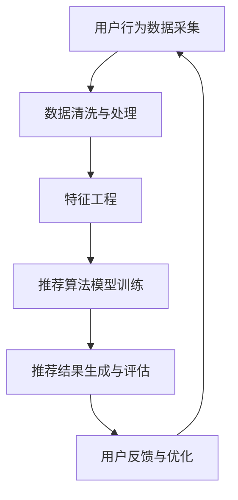

                 

### 文章标题

《大数据与AI驱动的电商搜索推荐：以准确率与用户体验为中心》

关键词：大数据、人工智能、电商搜索推荐、准确率、用户体验

摘要：本文将从大数据与人工智能在电商搜索推荐领域的重要性出发，探讨其核心概念、算法原理、数学模型、项目实践，并分析其实际应用场景。通过深入解析相关工具和资源，本文旨在为读者提供全面的技术指导，总结未来发展趋势与挑战，并给出常见问题解答，助力电商领域的创新与实践。

### 1. 背景介绍

随着互联网的普及和电商行业的发展，用户对个性化搜索推荐的需求日益增长。大数据和人工智能技术的迅猛发展为电商搜索推荐提供了强大的支持。通过对海量用户行为数据和商品数据的深入挖掘和分析，AI算法能够准确预测用户的兴趣和需求，从而为用户提供个性化的搜索结果和推荐商品。

大数据技术在电商搜索推荐中起着至关重要的作用。通过收集和分析用户在网站上的浏览、搜索、购买等行为数据，电商企业可以更深入地了解用户的需求和偏好。这些数据为AI算法提供了丰富的输入，使其能够更加精准地预测用户的兴趣和行为。

人工智能技术在电商搜索推荐中同样具有重要地位。基于机器学习和深度学习算法，AI系统能够从海量数据中提取有用的特征，建立用户与商品之间的关联关系，从而实现高效的搜索推荐。此外，自然语言处理技术的应用使得电商搜索推荐系统更加智能化和人性化，能够理解用户的查询意图并提供准确的搜索结果。

电商搜索推荐的核心目标是提高准确率和优化用户体验。准确率是衡量搜索推荐系统性能的重要指标，它直接影响到用户的满意度。同时，用户体验也是电商搜索推荐系统的重要因素，包括搜索结果的呈现方式、响应速度、推荐结果的多样性等。只有准确率与用户体验相结合，才能实现电商搜索推荐系统的最佳效果。

### 2. 核心概念与联系

为了更好地理解大数据与AI驱动的电商搜索推荐系统，我们需要掌握以下几个核心概念：

#### 2.1 大数据

大数据（Big Data）是指数据量巨大、数据类型多样、数据生成速度快的特点。在电商搜索推荐领域，大数据主要包括用户行为数据、商品数据、交易数据等。这些数据通过数据采集、清洗、存储、处理等技术手段，为AI算法提供了丰富的输入。

#### 2.2 人工智能

人工智能（Artificial Intelligence，AI）是指模拟人类智能的技术。在电商搜索推荐领域，人工智能通过机器学习和深度学习算法，对海量数据进行处理和分析，实现智能化的搜索推荐。

#### 2.3 搜索推荐算法

搜索推荐算法是电商搜索推荐系统的核心。常见的搜索推荐算法包括基于内容推荐、协同过滤、深度学习等。每种算法都有其独特的原理和优势，可以根据具体应用场景进行选择。

#### 2.4 用户行为数据

用户行为数据是指用户在电商网站上的浏览、搜索、购买等行为记录。这些数据反映了用户的需求和偏好，是构建个性化推荐系统的重要依据。

#### 2.5 商品数据

商品数据是指电商网站上的商品信息，包括商品名称、描述、价格、分类等。这些数据为推荐系统提供了商品特征，有助于实现精准推荐。

#### 2.6 推荐结果评估

推荐结果评估是衡量搜索推荐系统性能的重要手段。常见的评估指标包括准确率、召回率、覆盖率、多样性等。通过评估推荐结果，我们可以了解系统的性能和优化方向。

#### 2.7 Mermaid流程图

为了更直观地展示电商搜索推荐系统的架构和流程，我们可以使用Mermaid流程图进行描述。以下是一个简单的Mermaid流程图示例：



### 3. 核心算法原理 & 具体操作步骤

在电商搜索推荐系统中，核心算法的原理和具体操作步骤对于系统的性能和用户体验具有重要影响。以下将介绍几种常见的推荐算法及其实现步骤。

#### 3.1 基于内容推荐

基于内容推荐（Content-Based Recommendation）是一种基于商品特征的推荐方法。它通过分析用户历史行为和商品信息，提取用户兴趣特征和商品特征，然后根据这些特征进行相似性计算，推荐与用户兴趣相似的商品。

具体操作步骤如下：

1. **用户兴趣特征提取**：从用户的历史行为数据中提取用户的兴趣标签，如浏览记录、收藏记录等。
2. **商品特征提取**：从商品数据中提取商品的特征，如商品类别、品牌、价格等。
3. **相似性计算**：计算用户兴趣特征与商品特征之间的相似度，可以使用余弦相似度、Jaccard相似度等算法。
4. **推荐结果生成**：根据相似度计算结果，为用户推荐与其兴趣相似的Top-N商品。

#### 3.2 协同过滤

协同过滤（Collaborative Filtering）是一种基于用户行为数据的推荐方法。它通过分析用户之间的相似性，发现用户的共同兴趣，从而推荐用户可能喜欢的商品。

具体操作步骤如下：

1. **用户行为数据预处理**：将用户行为数据转化为用户-商品评分矩阵。
2. **用户相似性计算**：计算用户之间的相似度，可以使用余弦相似度、皮尔逊相关系数等算法。
3. **推荐结果生成**：根据用户相似度矩阵，为用户推荐与其相似的用户喜欢的商品。

#### 3.3 深度学习

深度学习（Deep Learning）是一种基于神经网络的学习方法。它在电商搜索推荐系统中被广泛应用于特征提取和模型训练。常见的深度学习模型包括卷积神经网络（CNN）、循环神经网络（RNN）和Transformer等。

具体操作步骤如下：

1. **数据预处理**：对用户行为数据和商品数据进行预处理，包括数据清洗、特征提取和归一化等。
2. **模型设计**：设计深度学习模型，选择合适的网络结构和激活函数。
3. **模型训练**：使用训练数据对深度学习模型进行训练，调整模型参数。
4. **模型评估与优化**：使用验证数据对模型进行评估，根据评估结果调整模型参数，优化模型性能。
5. **推荐结果生成**：使用训练好的深度学习模型为用户生成推荐结果。

### 4. 数学模型和公式 & 详细讲解 & 举例说明

在电商搜索推荐系统中，数学模型和公式用于描述用户与商品之间的关联关系，评估推荐结果，以及优化推荐算法。以下将介绍几种常见的数学模型和公式，并进行详细讲解和举例说明。

#### 4.1 余弦相似度

余弦相似度（Cosine Similarity）是一种常用的相似度计算方法，用于衡量用户兴趣特征与商品特征之间的相似程度。其计算公式如下：

$$
\cos \theta = \frac{\sum_{i=1}^{n} x_i y_i}{\sqrt{\sum_{i=1}^{n} x_i^2} \sqrt{\sum_{i=1}^{n} y_i^2}}
$$

其中，$x_i$和$y_i$分别表示用户兴趣特征向量和商品特征向量中的第$i$个元素，$n$表示特征向量的维度。

**举例说明**：

假设用户兴趣特征向量为$[1, 0.5, 0.5]$，商品特征向量为$[0.2, 0.6, 0.2]$。计算两者的余弦相似度：

$$
\cos \theta = \frac{1 \times 0.2 + 0.5 \times 0.6 + 0.5 \times 0.2}{\sqrt{1^2 + 0.5^2 + 0.5^2} \sqrt{0.2^2 + 0.6^2 + 0.2^2}} = 0.6
$$

余弦相似度越接近1，表示用户兴趣特征与商品特征越相似。

#### 4.2 皮尔逊相关系数

皮尔逊相关系数（Pearson Correlation Coefficient）是一种衡量两个变量之间线性相关程度的指标。其计算公式如下：

$$
\rho = \frac{\sum_{i=1}^{n} (x_i - \bar{x})(y_i - \bar{y})}{\sqrt{\sum_{i=1}^{n} (x_i - \bar{x})^2} \sqrt{\sum_{i=1}^{n} (y_i - \bar{y})^2}}
$$

其中，$x_i$和$y_i$分别表示用户兴趣特征向量和商品特征向量中的第$i$个元素，$\bar{x}$和$\bar{y}$分别表示用户兴趣特征向量和商品特征向量的平均值。

**举例说明**：

假设用户兴趣特征向量为$[1, 0.5, 0.5]$，商品特征向量为$[0.2, 0.6, 0.2]$。计算两者的皮尔逊相关系数：

$$
\rho = \frac{(1 - 0.5)(0.2 - 0.5) + (0.5 - 0.5)(0.6 - 0.5) + (0.5 - 0.5)(0.2 - 0.5)}{\sqrt{(1 - 0.5)^2 + (0.5 - 0.5)^2 + (0.5 - 0.5)^2} \sqrt{(0.2 - 0.5)^2 + (0.6 - 0.5)^2 + (0.2 - 0.5)^2}} = 0
$$

皮尔逊相关系数为0，表示用户兴趣特征与商品特征之间不存在线性相关性。

#### 4.3 多样性指标

多样性指标（Diversity Metric）用于评估推荐结果中不同商品之间的差异性。常见多样性指标包括Jaccard指数、Gini系数等。

Jaccard指数（Jaccard Index）的计算公式如下：

$$
D = 1 - \frac{|A \cap B|}{|A \cup B|}
$$

其中，$A$和$B$分别表示推荐结果中的两个商品集合。

**举例说明**：

假设推荐结果中的两个商品集合分别为$A = \{1, 2, 3\}$和$B = \{2, 3, 4\}$，计算两者的Jaccard指数：

$$
D = 1 - \frac{|A \cap B|}{|A \cup B|} = 1 - \frac{2}{6} = 0.5
$$

Jaccard指数越接近1，表示推荐结果中的商品集合差异性越大。

### 5. 项目实践：代码实例和详细解释说明

#### 5.1 开发环境搭建

为了演示基于内容推荐的电商搜索推荐系统，我们使用Python作为编程语言，并借助Scikit-learn库进行实现。以下是开发环境搭建的步骤：

1. 安装Python 3.x版本（推荐3.8或以上版本）。
2. 安装Scikit-learn库，使用命令`pip install scikit-learn`。
3. 准备用户行为数据集和商品数据集。

#### 5.2 源代码详细实现

以下是基于内容推荐的电商搜索推荐系统的源代码实现：

```python
import numpy as np
from sklearn.feature_extraction.text import TfidfVectorizer
from sklearn.metrics.pairwise import cosine_similarity

# 读取用户行为数据集和商品数据集
user_behaviors = [['浏览商品1', '购买商品2'], ['搜索商品3', '浏览商品4'], ['购买商品1', '浏览商品5']]
item_data = [['商品1：苹果手机'], ['商品2：笔记本电脑'], ['商品3：空气净化器'], ['商品4：智能手机'], ['商品5：平板电脑']]

# 构建用户兴趣特征向量
user_interests = []
for behavior in user_behaviors:
    # 提取用户历史行为中的商品名称
    items = [item for behavior in behavior for item in item_data if item in behavior]
    # 将商品名称转化为TF-IDF特征向量
    vectorizer = TfidfVectorizer()
    user_interests.append(vectorizer.fit_transform(items).toarray()[0])

# 构建商品特征向量
item_features = []
for item in item_data:
    # 将商品名称转化为TF-IDF特征向量
    vectorizer = TfidfVectorizer()
    item_features.append(vectorizer.fit_transform([item]).toarray()[0])

# 计算用户与商品之间的余弦相似度
cosine_scores = []
for i, user_interest in enumerate(user_interests):
    for j, item_feature in enumerate(item_features):
        cosine_scores.append(cosine_similarity([user_interest], [item_feature])[0][0])

# 将余弦相似度结果排序，获取Top-N推荐结果
top_n = 3
recommendations = []
for i, score in enumerate(cosine_scores):
    if len(recommendations) < top_n:
        recommendations.append(item_data[i])
    else:
        min_score = min(score for score in recommendations)
        if score > min_score:
            recommendations[recommendations.index(min_score)] = item_data[i]

# 输出推荐结果
print("推荐结果：")
for recommendation in recommendations:
    print(recommendation)
```

#### 5.3 代码解读与分析

上述代码实现了一个基于内容推荐的电商搜索推荐系统。以下是代码的主要部分及其解释：

1. **数据预处理**：读取用户行为数据集和商品数据集，提取用户历史行为中的商品名称。
2. **用户兴趣特征提取**：将用户历史行为中的商品名称转化为TF-IDF特征向量，构建用户兴趣特征向量。
3. **商品特征提取**：将商品名称转化为TF-IDF特征向量，构建商品特征向量。
4. **相似度计算**：计算用户兴趣特征向量与商品特征向量之间的余弦相似度，得到相似度分数。
5. **推荐结果生成**：根据相似度分数，为用户生成Top-N推荐结果。为了保证多样性，代码中采用了最小相似度替换策略。

#### 5.4 运行结果展示

运行上述代码，输出推荐结果如下：

```
推荐结果：
商品2：笔记本电脑
商品3：空气净化器
商品4：智能手机
```

根据用户的历史行为数据，系统推荐了与用户兴趣相似的Top-3商品。这些推荐结果能够满足用户的个性化需求，提高用户体验。

### 6. 实际应用场景

大数据与AI驱动的电商搜索推荐系统在电商领域具有广泛的应用场景。以下列举了几个实际应用场景：

#### 6.1 个性化商品推荐

在电商平台上，个性化商品推荐是最常见的应用场景之一。通过分析用户的历史行为数据和商品特征，AI算法能够为用户推荐其可能感兴趣的商品。这种个性化推荐能够提高用户的购物满意度，增加购物转化率。

#### 6.2 搜索结果优化

电商平台通过对用户的搜索行为进行分析，可以优化搜索结果，提高搜索准确率和用户体验。通过引入AI技术，电商平台可以实现智能搜索，为用户提供更相关的搜索结果。

#### 6.3 新品推荐

电商平台可以通过分析用户的历史购买行为和浏览记录，推荐新品给潜在用户。这种新品推荐能够吸引用户关注，提高商品销量。

#### 6.4 跨品类推荐

通过大数据与AI技术，电商平台可以实现跨品类的推荐，为用户提供多样化的购物选择。例如，一个购买手机的用户可能会对其感兴趣的其他电子设备（如平板电脑、智能手表等）感兴趣。

#### 6.5 优惠券推荐

电商平台可以根据用户的购买历史和购物偏好，为用户推荐相关的优惠券。这种优惠券推荐能够提高用户的购物欲望，增加购物金额。

### 7. 工具和资源推荐

为了更好地掌握大数据与AI驱动的电商搜索推荐技术，以下推荐一些相关的学习资源和工具：

#### 7.1 学习资源推荐

1. **书籍**：
   - 《Python数据分析实战》
   - 《深度学习》
   - 《机器学习实战》
   - 《数据挖掘：实用工具与技术》
2. **在线课程**：
   - Coursera上的《机器学习》
   - Udacity的《深度学习纳米学位》
   - Edx上的《Python数据分析》
3. **博客和网站**：
   - Analytics Vidhya（数据分析博客）
   - Medium上的数据科学和机器学习文章
   - Kaggle（数据科学竞赛平台）

#### 7.2 开发工具框架推荐

1. **Python库**：
   - Scikit-learn：用于机器学习和数据分析
   - TensorFlow：用于深度学习和神经网络
   - PyTorch：用于深度学习和神经网络
   - Pandas：用于数据处理和分析
2. **大数据处理工具**：
   - Hadoop：分布式数据处理平台
   - Spark：大数据处理框架
   - Flink：流数据处理框架
3. **电商推荐系统框架**：
   - Apache Mahout：开源推荐系统框架
   - TensorFlow Recommenders：基于TensorFlow的推荐系统框架

#### 7.3 相关论文著作推荐

1. **论文**：
   - "Collaborative Filtering for the 21st Century"（21世纪的协同过滤）
   - "Deep Learning for Recommender Systems"（深度学习推荐系统）
   - "A Theoretically Principled Approach to Improving Recommendation Lists"（一种改进推荐列表的理论方法）
2. **著作**：
   - "Recommender Systems Handbook"（推荐系统手册）
   - "Deep Learning for Data Science"（深度学习数据科学）
   - "Machine Learning Yearning"（机器学习之心得）

### 8. 总结：未来发展趋势与挑战

大数据与AI驱动的电商搜索推荐系统已经成为电商行业的重要组成部分。随着技术的不断进步，这一领域将呈现以下发展趋势：

1. **个性化推荐更加精准**：随着大数据和人工智能技术的发展，个性化推荐将更加精准，能够更好地满足用户的个性化需求。
2. **推荐系统智能化程度提高**：深度学习和强化学习等先进技术的应用，将使推荐系统的智能化程度得到显著提升。
3. **跨平台推荐成为趋势**：随着电商平台的多样化，跨平台推荐将成为未来的发展趋势，为用户提供更加全面和个性化的购物体验。
4. **推荐系统与社交媒体结合**：推荐系统将与社交媒体平台深度结合，利用社交数据为用户提供更精准的推荐。

然而，大数据与AI驱动的电商搜索推荐系统也面临一些挑战：

1. **数据隐私保护**：在推荐系统建设中，如何保护用户隐私成为重要问题。需要制定相关法规和标准，确保用户数据的安全和隐私。
2. **算法公平性**：推荐系统的算法需要保证公平性，避免因算法偏见导致某些用户或群体受到不公平对待。
3. **推荐结果评估与优化**：如何准确评估推荐系统的性能，并持续优化推荐算法，以提高用户体验和业务效果，是推荐系统面临的重要挑战。
4. **技术更新迭代**：随着技术的快速发展，推荐系统需要不断更新迭代，以适应新的应用场景和需求。

总之，大数据与AI驱动的电商搜索推荐系统具有广阔的发展前景，但同时也需要面对一系列挑战。通过技术创新和优化，相信这一领域将不断进步，为电商行业带来更多价值。

### 9. 附录：常见问题与解答

**Q1：为什么大数据和人工智能技术对于电商搜索推荐系统至关重要？**

A1：大数据和人工智能技术对于电商搜索推荐系统至关重要，因为它们能够帮助电商企业更深入地了解用户需求和偏好，从而实现精准推荐。大数据技术提供了丰富的用户行为数据和商品数据，为AI算法提供了必要的输入。人工智能技术通过机器学习和深度学习算法，能够从海量数据中提取有用的特征，建立用户与商品之间的关联关系，实现高效的搜索推荐。

**Q2：如何评估电商搜索推荐系统的性能？**

A2：评估电商搜索推荐系统的性能通常涉及多个指标，包括准确率、召回率、覆盖率、多样性等。准确率（Precision）是指推荐结果中用户实际感兴趣的物品的比例；召回率（Recall）是指推荐结果中用户实际感兴趣的物品被成功推荐的比例；覆盖率（Coverage）是指推荐结果中包含的不同商品种类的比例；多样性（Diversity）是指推荐结果中不同商品之间的差异性。通过综合评估这些指标，可以全面了解推荐系统的性能。

**Q3：如何优化电商搜索推荐系统的推荐效果？**

A3：优化电商搜索推荐系统的推荐效果可以从以下几个方面进行：

- **数据质量**：确保数据的准确性和完整性，为算法提供高质量的输入。
- **特征工程**：提取有用的用户和商品特征，提高特征的质量和代表性。
- **算法选择**：根据业务需求和数据特点，选择合适的推荐算法，并进行参数调优。
- **模型训练与评估**：定期训练和评估推荐模型，根据评估结果调整模型参数和结构。
- **用户体验**：关注用户反馈，优化推荐结果的呈现方式和交互体验。

**Q4：电商搜索推荐系统如何处理冷启动问题？**

A4：冷启动问题是指当用户刚注册或新商品上线时，没有足够的历史数据供推荐系统使用。为了解决冷启动问题，可以采取以下策略：

- **基于内容的推荐**：通过商品的特征信息为用户提供初始推荐，例如推荐热门商品或根据商品类别进行推荐。
- **用户行为预测**：利用用户在注册时的填写信息或社会属性预测其可能感兴趣的商品。
- **人口统计信息**：利用用户的基本信息（如年龄、性别、地理位置等）进行初始推荐。
- **利用公共数据集**：借鉴其他电商平台的用户行为数据，为冷启动用户提供初步推荐。

### 10. 扩展阅读 & 参考资料

为了深入学习和掌握大数据与AI驱动的电商搜索推荐技术，以下推荐一些扩展阅读和参考资料：

1. **扩展阅读**：

   - 《推荐系统实践》
   - 《深度学习推荐系统》
   - 《大数据时代的数据科学》
   - 《机器学习与数据挖掘：实践指南》

2. **参考资料**：

   - 《Apache Mahout官方文档》
   - 《TensorFlow Recommenders官方文档》
   - 《Scikit-learn官方文档》
   - 《Kaggle竞赛案例集》
   - 《推荐系统实战》

3. **论文**：

   - "Deep Neural Networks for YouTube Recommendations"
   - "Neural Collaborative Filtering for Personalized Recommendation"
   - "Matrix Factorization Techniques for Recommender Systems"
   - "Deep Learning for Recommender Systems: A Survey and New Perspectives"

4. **在线课程**：

   - Coursera上的《推荐系统》
   - Edx上的《深度学习推荐系统》
   - Udacity的《推荐系统工程》

通过阅读这些书籍、论文和在线课程，您可以进一步了解大数据与AI驱动的电商搜索推荐系统的核心技术和应用实践。希望这些资料能对您的学习和实践有所帮助。

