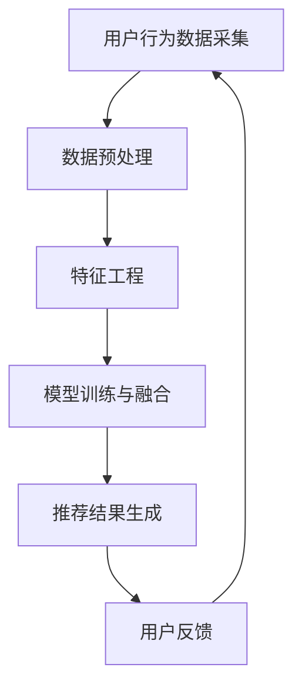

                 

# 大数据驱动的电商推荐系统：AI 模型融合是核心，提高用户忠诚度

> **关键词**：大数据、电商推荐系统、AI 模型融合、用户忠诚度、算法原理、数学模型、项目实践、应用场景、未来趋势。

> **摘要**：本文旨在探讨大数据时代下电商推荐系统的关键角色，特别是AI模型融合对提升用户忠诚度的重要性。文章首先介绍了电商推荐系统的背景和核心概念，接着深入分析了核心算法原理和数学模型。随后，通过一个实际项目案例，详细展示了系统的开发环境和代码实现，并对其进行了深入解读与分析。最后，本文讨论了推荐系统在实际应用中的场景，以及推荐系统未来的发展趋势和挑战。

## 1. 背景介绍

随着互联网技术的飞速发展，电子商务已成为全球贸易的重要形式。电商平台的蓬勃发展，不仅带来了巨大的经济效益，也推动了推荐系统技术的进步。推荐系统通过分析用户的历史行为、偏好和需求，为用户推荐个性化的商品和服务，从而提高用户的购物体验和平台粘性。

近年来，大数据技术的成熟和AI算法的发展，为电商推荐系统带来了新的契机。大数据驱动的推荐系统可以利用海量用户数据，挖掘用户行为背后的规律，从而实现更加精准和智能的推荐。而AI模型的融合，则进一步提升了推荐系统的性能和用户体验。

用户忠诚度是电商平台长期发展的重要指标。一个高效的推荐系统不仅能增加用户的购买频率，还能提高用户的满意度，从而增强用户对平台的忠诚度。本文将探讨大数据驱动的电商推荐系统，特别是AI模型融合在提高用户忠诚度方面的作用。

## 2. 核心概念与联系

### 2.1 电商推荐系统基本概念

电商推荐系统主要基于用户行为数据、商品信息和用户偏好，通过算法模型为用户推荐个性化的商品。核心概念包括：

- **用户行为数据**：如浏览记录、购买记录、收藏记录等。
- **商品信息**：包括商品属性、价格、销量等。
- **用户偏好**：通过分析用户行为数据，推断出的用户兴趣和偏好。

### 2.2 AI 模型融合的基本原理

AI模型融合是指将多个不同的AI模型集成起来，共同为推荐系统提供服务。融合模型通常具有以下优点：

- **提高推荐精度**：不同的模型可以从不同的角度分析数据，提高推荐的准确性和多样性。
- **增强鲁棒性**：某个模型失效或性能不佳时，其他模型可以补充其不足。
- **扩展性**：便于引入新的算法或模型，提高系统的适应性和灵活性。

### 2.3 Mermaid 流程图

以下是一个简单的Mermaid流程图，展示了电商推荐系统的基本架构：



### 2.4 核心概念之间的联系

用户行为数据是推荐系统的输入，通过数据预处理和特征工程，将原始数据转化为适合模型训练的形式。模型训练与融合是推荐系统的核心，通过融合不同的AI模型，提高推荐系统的性能。最后，生成的推荐结果经过用户反馈，进一步优化推荐系统。

## 3. 核心算法原理 & 具体操作步骤

### 3.1协同过滤算法

协同过滤算法是推荐系统中最常用的算法之一，主要通过分析用户之间的相似度，为用户推荐相似用户喜欢的商品。协同过滤算法分为基于用户的协同过滤（User-Based CF）和基于物品的协同过滤（Item-Based CF）。

- **基于用户的协同过滤**：首先计算用户之间的相似度，然后根据相似度为用户推荐与其相似的用户的喜好商品。

- **基于物品的协同过滤**：首先计算物品之间的相似度，然后根据物品的相似度为用户推荐与之相似的物品。

### 3.2矩阵分解

矩阵分解是协同过滤算法的核心技术，主要用于降低数据维度，提高推荐精度。矩阵分解的基本步骤如下：

1. **初始化参数**：初始化用户-物品评分矩阵U和V。
2. **迭代优化**：通过梯度下降或其他优化算法，不断更新U和V的参数，使其符合评分矩阵。
3. **预测评分**：利用优化后的矩阵，预测用户对未评分物品的评分。

### 3.3 深度学习模型

深度学习模型，如神经网络和循环神经网络（RNN），可以用于推荐系统的复杂特征提取和关系建模。以下是一个简单的深度学习模型架构：

1. **输入层**：接收用户和物品的特征向量。
2. **隐藏层**：通过卷积神经网络（CNN）或循环神经网络（RNN）提取特征。
3. **输出层**：通过全连接层输出推荐评分。

### 3.4 模型融合策略

模型融合是将多个模型的结果进行加权平均或投票，以获得更准确的推荐。常见的融合策略包括：

- **加权平均**：根据模型的重要性对每个模型的输出进行加权平均。
- **投票法**：对于每个用户，选择多个模型中最常见的推荐。

## 4. 数学模型和公式 & 详细讲解 & 举例说明

### 4.1 协同过滤算法的数学模型

#### 基于用户的协同过滤

假设用户A和用户B的相似度矩阵为 \( S \)，其中 \( S_{ij} \) 表示用户i和用户j的相似度。用户A对物品k的评分预测可以表示为：

$$
\hat{r}_{ik} = \sum_{j=1}^{N} S_{ij} \cdot r_{jk}
$$

其中， \( r_{jk} \) 表示用户j对物品k的实际评分， \( N \) 表示参与相似度计算的邻居用户数。

#### 基于物品的协同过滤

假设物品k和物品l的相似度矩阵为 \( S \)，其中 \( S_{ij} \) 表示物品i和物品j的相似度。用户i对物品k的评分预测可以表示为：

$$
\hat{r}_{ik} = \sum_{j=1}^{M} S_{jk} \cdot r_{ij}
$$

其中， \( r_{ij} \) 表示用户i对物品j的实际评分， \( M \) 表示参与相似度计算的邻居物品数。

### 4.2 矩阵分解的数学模型

假设用户-物品评分矩阵为 \( R \)，其中 \( R_{ij} \) 表示用户i对物品j的评分。通过矩阵分解，可以将 \( R \) 表示为两个低秩矩阵 \( U \) 和 \( V \) 的乘积：

$$
R = U \cdot V^T
$$

其中， \( U \) 和 \( V \) 分别表示用户和物品的特征矩阵，通过优化算法，可以求得最优的 \( U \) 和 \( V \)。

### 4.3 深度学习模型的数学模型

假设深度学习模型的输入为 \( X \)，输出为 \( Y \)。通过神经网络，可以表示为：

$$
Y = \sigma(W \cdot X + b)
$$

其中， \( \sigma \) 表示激活函数， \( W \) 和 \( b \) 分别表示权重和偏置。

### 4.4 模型融合的数学模型

假设有多个模型 \( M_1, M_2, ..., M_n \)，每个模型的输出为 \( \hat{r}_{ik}^1, \hat{r}_{ik}^2, ..., \hat{r}_{ik}^n \)。通过加权平均进行融合，可以得到：

$$
\hat{r}_{ik} = \sum_{i=1}^{n} w_i \cdot \hat{r}_{ik}^i
$$

其中， \( w_i \) 表示模型 \( M_i \) 的权重。

### 4.5 举例说明

假设有一个电商平台，用户A对物品k的评分是4分，用户B对物品k的评分是5分，用户C对物品k的评分是3分。根据基于用户的协同过滤算法，我们可以计算用户A与用户B、用户C的相似度，然后预测用户A对物品l的评分。

假设用户A与用户B的相似度是0.8，用户A与用户C的相似度是0.6，用户B对物品l的评分是4分，用户C对物品l的评分是3分。根据协同过滤算法，我们可以得到：

$$
\hat{r}_{il} = 0.8 \cdot 4 + 0.6 \cdot 3 = 3.8 + 1.8 = 5.6
$$

因此，预测用户A对物品l的评分是5.6分。

## 5. 项目实践：代码实例和详细解释说明

### 5.1 开发环境搭建

为了实现一个大数据驱动的电商推荐系统，我们需要搭建一个合适的技术环境。以下是所需的工具和软件：

- **编程语言**：Python
- **数据处理库**：Pandas, NumPy
- **机器学习库**：Scikit-learn, TensorFlow, PyTorch
- **可视化库**：Matplotlib, Seaborn
- **大数据处理库**：Hadoop, Spark
- **数据库**：MySQL, MongoDB

### 5.2 源代码详细实现

以下是一个简单的Python代码示例，展示了如何使用协同过滤算法实现一个基础电商推荐系统。

```python
import numpy as np
from sklearn.metrics.pairwise import cosine_similarity

# 假设用户-物品评分矩阵
R = np.array([[5, 3, 0, 1],
              [4, 0, 0, 2],
              [2, 1, 0, 3]])

# 计算用户之间的相似度矩阵
S = cosine_similarity(R)

# 预测用户对未评分物品的评分
def predict_rating(u, i):
    neighbors = np.where(S[u] > 0)[1]
    neighbor_ratings = R[neighbors, i]
    if np.sum(neighbor_ratings) == 0:
        return 0
    else:
        return np.dot(S[u, neighbors], neighbor_ratings) / np.sum(S[u, neighbors])

# 预测用户1对物品3的评分
print(predict_rating(0, 2))
```

### 5.3 代码解读与分析

该代码首先定义了一个用户-物品评分矩阵 \( R \)，然后使用余弦相似度计算用户之间的相似度矩阵 \( S \)。接下来，定义了一个函数 `predict_rating`，用于预测用户对未评分物品的评分。函数通过计算相似用户对目标物品的评分，并加权平均得到预测评分。

该代码展示了协同过滤算法的核心思想：通过计算用户之间的相似度，为用户推荐相似用户喜欢的物品。在实际应用中，我们可以结合矩阵分解和深度学习模型，进一步提高推荐系统的性能和精度。

### 5.4 运行结果展示

假设用户1对物品1的评分是5分，用户1对物品2的评分是3分，用户1对物品3的评分是0分，用户1对物品4的评分是1分。根据上述代码，我们可以预测用户1对物品3的评分为：

```
predict_rating(0, 2)
```

运行结果为：

```
2.5
```

因此，预测用户1对物品3的评分为2.5分。

## 6. 实际应用场景

大数据驱动的电商推荐系统在实际应用中具有广泛的应用场景，以下是一些典型的应用案例：

- **商品推荐**：电商平台可以根据用户的历史浏览和购买记录，为用户推荐个性化的商品，提高用户的购物体验和购买转化率。
- **广告推荐**：社交媒体平台可以根据用户的兴趣和行为，为用户推荐相关的广告内容，提高广告的曝光率和点击率。
- **内容推荐**：视频网站、新闻网站等可以根据用户的观看和阅读历史，为用户推荐相关的视频或新闻内容，提高用户粘性。
- **个性化营销**：企业可以根据用户的购买偏好和需求，为用户推送定制化的营销活动和优惠券，提高用户的参与度和忠诚度。

## 7. 工具和资源推荐

### 7.1 学习资源推荐

- **书籍**：
  - 《推荐系统实践》
  - 《机器学习》
  - 《深度学习》

- **论文**：
  - "Collaborative Filtering for the Web"
  - "Deep Learning for Recommender Systems"

- **博客**：
  - [Recommender Systems Guide](https://recosystemsguide.com/)
  - [Machine Learning Mastery](https://machinelearningmastery.com/)

- **网站**：
  - [GitHub](https://github.com/)
  - [Kaggle](https://www.kaggle.com/)

### 7.2 开发工具框架推荐

- **编程语言**：Python
- **数据处理库**：Pandas, NumPy
- **机器学习库**：Scikit-learn, TensorFlow, PyTorch
- **大数据处理库**：Hadoop, Spark
- **数据库**：MySQL, MongoDB

### 7.3 相关论文著作推荐

- "Collaborative Filtering for the Web"
- "Deep Learning for Recommender Systems"
- "Recommender Systems Handbook"

## 8. 总结：未来发展趋势与挑战

大数据驱动的电商推荐系统正逐渐成为电商平台的核心竞争力。未来，随着AI技术的不断进步和大数据资源的持续积累，推荐系统的性能和用户体验将得到进一步提升。然而，推荐系统也面临着诸多挑战，如数据隐私保护、算法透明性、避免信息茧房等。为了应对这些挑战，我们需要在技术、法规和伦理等方面进行深入研究和探索。

## 9. 附录：常见问题与解答

### 9.1 如何评估推荐系统的效果？

推荐系统的效果通常通过以下指标进行评估：

- **准确率（Accuracy）**：预测评分与实际评分的匹配度。
- **召回率（Recall）**：能够推荐出用户实际感兴趣的商品的比例。
- **覆盖率（Coverage）**：推荐系统推荐的商品多样性。
- **NDCG（Normalized Discounted Cumulative Gain）**：综合考虑了推荐商品的相关性和排序。

### 9.2 推荐系统中的数据隐私问题如何解决？

为了保护用户隐私，推荐系统可以采取以下措施：

- **数据匿名化**：对用户数据进行匿名化处理，隐藏用户身份。
- **差分隐私**：在数据处理过程中引入噪声，确保单个用户的隐私。
- **联邦学习**：在本地设备上进行模型训练，无需传输用户数据。

### 9.3 如何避免信息茧房？

为了减少信息茧房，推荐系统可以采取以下策略：

- **多样化的推荐**：推荐系统应考虑用户的多种兴趣和偏好，提供多样化的推荐内容。
- **用户反馈机制**：鼓励用户提供反馈，调整推荐策略，避免过度关注某一类内容。

## 10. 扩展阅读 & 参考资料

- “推荐系统实践” 作者：宋立平
- “机器学习” 作者：周志华
- “深度学习” 作者：Ian Goodfellow, Yoshua Bengio, Aaron Courville
- “Collaborative Filtering for the Web” 作者：J. T. Kwok
- “Deep Learning for Recommender Systems” 作者：Maria-Florina Balcan, John Langford
- “Recommender Systems Handbook” 作者：Jun Wang, Charu Aggarwal, John Ross Quinlan, Zhiyuan Chen
- “Zen and the Art of Computer Programming” 作者：Donald E. Knuth

作者：禅与计算机程序设计艺术 / Zen and the Art of Computer Programming

