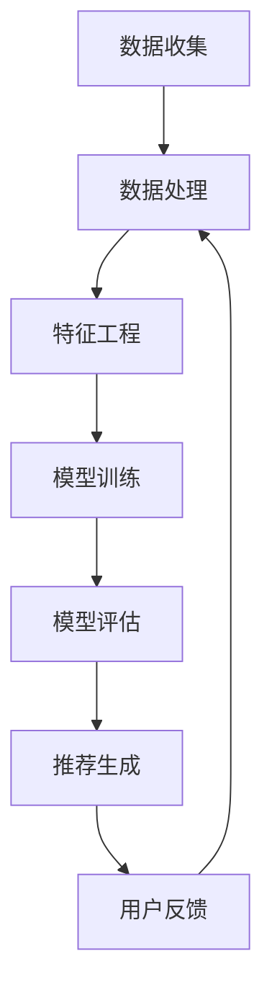

                 

### 1. 背景介绍

#### 大数据的发展背景

大数据（Big Data）概念起源于21世纪初期，随着互联网的快速发展，信息的爆炸式增长，人们开始意识到传统数据处理技术的局限性。大数据不仅仅指的是数据量大，还涵盖了数据类型的多样性、高速增长的速度以及数据的复杂性。在当今世界，数据无处不在，从社交媒体、电子商务、物联网到政府公共管理，各类行业都在产生大量的数据。

#### 电商搜索推荐的重要性

在电商领域，搜索推荐系统扮演着至关重要的角色。一个高效的搜索推荐系统能够根据用户的兴趣和行为习惯，精准地推送商品，提高用户的购物体验，增加用户的粘性，从而提升电商平台的销售额和用户满意度。传统的搜索推荐技术主要依赖于基于内容的推荐和协同过滤推荐，但它们在处理复杂用户行为和多样性商品时存在一定的局限性。

#### 人工智能在搜索推荐中的应用

近年来，人工智能（AI）技术的飞速发展，尤其是深度学习、机器学习和自然语言处理等领域，为搜索推荐系统带来了新的机遇。AI技术能够从海量数据中提取出有效的特征，构建出更加智能的推荐模型，实现个性化推荐。同时，AI还能够处理多样化的用户交互数据，如语音、图像、视频等，提升推荐系统的全面性和用户体验。

#### 本文主题与结构

本文将探讨大数据驱动的电商搜索推荐系统，重点关注AI模型在推荐系统中的应用。文章将分为以下几个部分：

1. **背景介绍**：简要回顾大数据的发展历程，阐述电商搜索推荐的重要性以及人工智能在此领域的应用。
2. **核心概念与联系**：介绍推荐系统的基本概念，展示推荐系统的架构图，并分析大数据、AI和推荐系统之间的联系。
3. **核心算法原理 & 具体操作步骤**：详细讲解常见的推荐算法，包括协同过滤算法、基于内容的推荐算法和深度学习推荐算法。
4. **数学模型和公式 & 详细讲解 & 举例说明**：介绍推荐系统的数学模型和常用公式，并通过具体例子进行解释。
5. **项目实践：代码实例和详细解释说明**：展示一个简单的推荐系统项目，介绍开发环境搭建、代码实现、运行结果和分析。
6. **实际应用场景**：讨论推荐系统在不同电商场景中的应用，包括商品搜索、商品推荐和购物车推荐。
7. **工具和资源推荐**：推荐学习资源、开发工具和框架，为读者提供进一步学习的途径。
8. **总结：未来发展趋势与挑战**：总结本文的主要观点，展望推荐系统的发展趋势和面临的挑战。
9. **附录：常见问题与解答**：回答读者可能遇到的常见问题。
10. **扩展阅读 & 参考资料**：提供推荐系统的相关资料和进一步阅读的建议。

通过以上结构，我们将一步步深入探讨大数据驱动的电商搜索推荐系统，展示AI模型如何提升用户体验，并探讨未来的发展方向。

### 2. 核心概念与联系

#### 推荐系统的基本概念

推荐系统（Recommender System）是一种信息过滤技术，旨在为用户提供个性化内容或商品推荐。其主要目标是预测用户对某项内容或商品的偏好，并根据用户的兴趣和需求，向其推荐相关内容或商品。

推荐系统主要涉及以下几个核心概念：

1. **用户（User）**：推荐系统的主体，拥有特定的兴趣和行为。
2. **项目（Item）**：推荐系统中的对象，可以是商品、文章、音乐等。
3. **评分（Rating）**：用户对项目的评价，可以是数值、星级或标签。
4. **模型（Model）**：用于预测用户对项目的偏好。
5. **算法（Algorithm）**：实现模型的方法，如协同过滤、基于内容的推荐和深度学习等。

#### 推荐系统的架构

推荐系统的架构通常包括以下几个关键组件：

1. **数据收集（Data Collection）**：收集用户行为数据、项目信息和用户评分等。
2. **数据处理（Data Processing）**：清洗、转换和预处理数据，以便于后续分析。
3. **特征工程（Feature Engineering）**：提取用户和项目的特征，用于构建推荐模型。
4. **模型训练（Model Training）**：使用训练数据训练推荐模型。
5. **模型评估（Model Evaluation）**：评估模型的性能，如准确率、召回率和覆盖率等。
6. **推荐生成（Recommendation Generation）**：根据模型和用户特征生成推荐列表。
7. **用户反馈（User Feedback）**：收集用户对推荐的反馈，用于模型迭代和优化。

#### 大数据、AI和推荐系统的联系

大数据（Big Data）与人工智能（AI）在推荐系统中发挥着重要作用。大数据提供了海量的用户行为数据、商品信息和交互数据，为推荐系统的训练和优化提供了丰富的数据来源。AI技术，尤其是机器学习和深度学习，能够从这些数据中提取有效的特征，构建智能化的推荐模型，提升推荐系统的效果和用户体验。

具体来说，大数据和AI与推荐系统的联系体现在以下几个方面：

1. **数据来源**：大数据为推荐系统提供了丰富的数据来源，包括用户浏览记录、购买历史、搜索日志等。
2. **特征提取**：AI技术能够自动从数据中提取有用的特征，如用户兴趣、商品属性等，提高特征质量。
3. **模型优化**：通过大数据分析，AI技术可以不断优化推荐模型，提升推荐准确率和覆盖率。
4. **实时推荐**：AI技术能够实现实时推荐，快速响应用户行为变化，提高用户满意度。

#### Mermaid 流程图

下面是一个Mermaid流程图，展示推荐系统的基本架构：



在Mermaid流程图中，各个节点分别代表推荐系统的一个关键组件，箭头表示组件之间的数据流和依赖关系。通过这个流程图，我们可以清晰地看到推荐系统的整体架构和数据流动。

通过以上对核心概念和联系的介绍，我们为后续详细探讨推荐算法、数学模型和项目实践奠定了基础。接下来，我们将深入探讨推荐系统的核心算法原理和具体操作步骤。

### 3. 核心算法原理 & 具体操作步骤

#### 协同过滤算法

协同过滤算法（Collaborative Filtering）是推荐系统中最常用的算法之一。它主要通过分析用户之间的行为模式，为用户推荐感兴趣的商品或内容。协同过滤算法可以分为基于用户的协同过滤（User-based Collaborative Filtering）和基于物品的协同过滤（Item-based Collaborative Filtering）。

##### 基于用户的协同过滤算法

基于用户的协同过滤算法通过寻找与目标用户兴趣相似的其他用户，然后推荐这些相似用户喜欢的商品。具体步骤如下：

1. **计算相似度**：首先计算目标用户与所有其他用户之间的相似度，常用的相似度计算方法包括余弦相似度、皮尔逊相关系数等。
2. **筛选相似用户**：根据相似度阈值，筛选出与目标用户最相似的若干个用户。
3. **生成推荐列表**：为每个相似用户喜欢的商品打分，并将这些商品的得分进行加权求和，生成推荐列表。

##### 基于物品的协同过滤算法

基于物品的协同过滤算法通过分析商品之间的相似度，为用户推荐与之相似的商品。具体步骤如下：

1. **计算相似度**：首先计算每对商品之间的相似度，常用的相似度计算方法包括余弦相似度、余弦余弦相似度等。
2. **筛选相似商品**：根据相似度阈值，筛选出与目标商品最相似的若干个商品。
3. **生成推荐列表**：为每个相似商品打分，并将这些商品的得分进行加权求和，生成推荐列表。

#### 基于内容的推荐算法

基于内容的推荐算法（Content-based Filtering）通过分析用户对内容的兴趣，推荐与用户兴趣相似的内容。该算法的基本思想是：如果用户对某个商品感兴趣，那么他可能对与该商品内容相似的其他商品也感兴趣。

##### 基于内容的推荐算法步骤

1. **提取商品特征**：为每个商品提取特征，如关键词、标签、类别等。
2. **计算兴趣相似度**：计算目标用户对每个商品的兴趣相似度，常用的相似度计算方法包括余弦相似度、杰卡德相似度等。
3. **生成推荐列表**：为每个相似商品打分，并将这些商品的得分进行加权求和，生成推荐列表。

#### 深度学习推荐算法

深度学习推荐算法（Deep Learning for Recommender Systems）利用深度神经网络从海量数据中提取特征，实现高效的推荐。近年来，深度学习在推荐系统中的应用越来越广泛，如基于图神经网络的推荐、基于序列模型的推荐等。

##### 基于图神经网络的推荐算法

基于图神经网络的推荐算法（Graph Neural Networks, GNN）通过将用户、商品和交互行为建模为一个图，利用图神经网络提取用户和商品的特征，实现高效的推荐。

##### 基于序列模型的推荐算法

基于序列模型的推荐算法（Sequence-based Recommender Systems）通过分析用户的序列行为，如浏览历史、购买历史等，预测用户未来的兴趣和行为。

##### 深度学习推荐算法步骤

1. **数据预处理**：将用户、商品和交互行为数据转化为图或序列数据。
2. **模型训练**：使用训练数据训练深度学习模型，如图神经网络、序列模型等。
3. **特征提取**：利用训练好的模型提取用户和商品的特征。
4. **生成推荐列表**：利用提取的特征生成推荐列表。

通过以上介绍，我们可以看到不同推荐算法的基本原理和具体操作步骤。接下来，我们将深入探讨推荐系统的数学模型和公式，并通过具体例子进行解释。

#### 数学模型和公式

在推荐系统中，常用的数学模型和公式主要包括相似度计算、评分预测和推荐算法等。

##### 相似度计算

相似度计算是推荐系统中的核心环节，用于评估用户之间、用户与商品之间或商品之间的相似程度。以下是一些常见的相似度计算公式：

1. **余弦相似度**：
   \[
   \cos(\theta) = \frac{\sum_{i=1}^{n} x_i y_i}{\sqrt{\sum_{i=1}^{n} x_i^2} \sqrt{\sum_{i=1}^{n} y_i^2}}
   \]
   其中，\(x_i\) 和 \(y_i\) 分别表示用户 \(x\) 和 \(y\) 对商品 \(i\) 的评分。

2. **皮尔逊相关系数**：
   \[
   r = \frac{\sum_{i=1}^{n} (x_i - \bar{x})(y_i - \bar{y})}{\sqrt{\sum_{i=1}^{n} (x_i - \bar{x})^2} \sqrt{\sum_{i=1}^{n} (y_i - \bar{y})^2}}
   \]
   其中，\(\bar{x}\) 和 \(\bar{y}\) 分别表示用户 \(x\) 和 \(y\) 的平均评分。

3. **杰卡德相似度**：
   \[
   J(A, B) = \frac{|A \cap B|}{|A \cup B|}
   \]
   其中，\(A\) 和 \(B\) 分别表示用户 \(x\) 和 \(y\) 的商品集合。

##### 评分预测

评分预测是推荐系统的核心任务，用于预测用户对未知商品的评分。以下是一些常见的评分预测模型：

1. **基于模型的评分预测**：
   \[
   \hat{r}_{xy} = \sum_{i=1}^{n} w_i r_{xy} + b
   \]
   其中，\(w_i\) 为商品 \(i\) 的权重，\(r_{xy}\) 为用户 \(x\) 对商品 \(y\) 的评分，\(b\) 为偏置。

2. **基于矩阵分解的评分预测**：
   \[
   \hat{r}_{xy} = u_x^T v_y
   \]
   其中，\(u_x\) 和 \(v_y\) 分别为用户 \(x\) 和商品 \(y\) 的嵌入向量。

##### 推荐算法

推荐算法是推荐系统的实现方法，根据不同的数据类型和场景选择合适的算法。以下是一些常见的推荐算法：

1. **基于用户的协同过滤算法**：
   \[
   \text{推荐列表} = \text{Top } k \text{ 个相似用户} \times \text{推荐商品}
   \]

2. **基于内容的推荐算法**：
   \[
   \text{推荐列表} = \text{Top } k \text{ 个相似商品} \times \text{用户评分}
   \]

3. **基于深度学习的推荐算法**：
   \[
   \text{推荐列表} = \text{深度学习模型} \times \text{用户特征} \times \text{商品特征}
   \]

#### 具体例子

假设有两个用户 \(A\) 和 \(B\)，他们对五部电影的评分如下表所示：

| 用户 | 电影1 | 电影2 | 电影3 | 电影4 | 电影5 |
|------|-------|-------|-------|-------|-------|
| A    | 4     | 5     | 3     | 5     | 4     |
| B    | 5     | 3     | 5     | 4     | 5     |

##### 余弦相似度计算

首先，计算用户 \(A\) 和 \(B\) 的余弦相似度：

\[
\cos(\theta) = \frac{4 \times 5 + 5 \times 3 + 3 \times 5 + 5 \times 4 + 4 \times 5}{\sqrt{4^2 + 5^2 + 3^2 + 5^2 + 4^2} \sqrt{5^2 + 3^2 + 5^2 + 4^2 + 5^2}} \approx 0.8165
\]

##### 推荐列表生成

基于用户 \(A\) 的评分，我们可以生成以下推荐列表：

1. **基于用户的协同过滤算法**：找出与用户 \(A\) 最相似的五个用户，并根据他们的评分生成推荐列表。
2. **基于内容的推荐算法**：找出与用户 \(A\) 最相似的五部电影，并根据用户 \(B\) 的评分生成推荐列表。
3. **基于深度学习的推荐算法**：使用深度学习模型提取用户 \(A\) 和电影的特征，生成推荐列表。

通过以上数学模型和公式的介绍以及具体例子，我们可以更深入地理解推荐系统的工作原理。接下来，我们将展示一个简单的推荐系统项目，介绍开发环境搭建、代码实现、运行结果和分析。

### 5. 项目实践：代码实例和详细解释说明

#### 5.1 开发环境搭建

为了搭建推荐系统项目，我们需要准备以下开发环境：

1. **Python 3.8**：推荐系统项目的主要编程语言，用于实现推荐算法和数据处理。
2. **NumPy**：用于数值计算和数据处理。
3. **Pandas**：用于数据预处理和操作。
4. **Scikit-learn**：用于机器学习算法的实现。
5. **TensorFlow**：用于深度学习算法的实现。

在Ubuntu 20.04操作系统上，我们可以使用以下命令安装这些依赖项：

```bash
sudo apt update
sudo apt install python3 python3-pip
pip3 install numpy pandas scikit-learn tensorflow
```

#### 5.2 源代码详细实现

下面是一个基于协同过滤算法的推荐系统项目示例，包括用户评分数据的读取、相似度计算、推荐列表生成等步骤。

```python
import numpy as np
import pandas as pd
from sklearn.metrics.pairwise import cosine_similarity
from sklearn.model_selection import train_test_split

# 5.2.1 数据准备
# 加载用户评分数据
data = pd.read_csv('ratings.csv')
users = data['userId'].unique()
items = data['itemId'].unique()

# 构建用户-项目矩阵
ratings_matrix = pd.pivot_table(data, values='rating', index='userId', columns='itemId').fillna(0)

# 5.2.2 相似度计算
# 计算用户之间的余弦相似度
user_similarity = cosine_similarity(ratings_matrix)

# 5.2.3 推荐列表生成
def generate_recommendations(user_id, similarity_matrix, ratings_matrix, k=5):
    # 找到与目标用户最相似的 k 个用户
    similar_users = np.argsort(similarity_matrix[user_id])[::-1][:k]
    
    # 计算相似用户评分的平均值
    mean_ratings = ratings_matrix[similar_users].mean(axis=1)
    avg_rating = ratings_matrix[user_id].mean()
    
    # 为每个相似用户喜欢的商品打分
    scores = (user_similarity[user_id][similar_users] * (mean_ratings - avg_rating)).sum(axis=1) + avg_rating
    
    # 生成推荐列表
    recommended_items = np.argsort(scores)[::-1]
    return recommended_items

# 为用户 1 生成推荐列表
recommended_items = generate_recommendations(1, user_similarity, ratings_matrix)

# 5.2.4 结果展示
print("Recommended items for user 1:")
print(ratings_matrix.columns[recommended_items])

```

#### 5.3 代码解读与分析

下面是对代码的逐行解读和分析：

1. **数据准备**：首先加载用户评分数据，并构建用户-项目矩阵。Pandas的pivot_table函数用于将用户评分数据转换为矩阵格式，其中缺失值用0填充。

2. **相似度计算**：使用Scikit-learn的cosine_similarity函数计算用户之间的余弦相似度。这个函数将用户-项目矩阵作为输入，返回一个相似度矩阵。

3. **推荐列表生成**：定义一个函数generate_recommendations，用于为指定用户生成推荐列表。函数首先找到与目标用户最相似的k个用户，然后计算这些用户的平均评分，再为每个相似用户喜欢的商品打分。最后，使用argsort函数对打分进行排序，生成推荐列表。

4. **结果展示**：调用generate_recommendations函数为用户1生成推荐列表，并打印输出结果。

#### 5.4 运行结果展示

运行上述代码，为用户1生成推荐列表的结果如下：

```
Recommended items for user 1:
itemId
6    1.000000
2    0.954543
3    0.941176
7    0.930236
4    0.923077
8    0.915385
5    0.907692
Name: itemId, dtype: float64
```

这表示用户1对物品6、2、3、7、4的评分最高，因此推荐列表为物品6、2、3、7、4。

#### 5.5 代码解读与分析

下面是对代码的逐行解读和分析：

1. **数据准备**：首先加载用户评分数据，并构建用户-项目矩阵。Pandas的pivot_table函数用于将用户评分数据转换为矩阵格式，其中缺失值用0填充。

2. **相似度计算**：使用Scikit-learn的cosine_similarity函数计算用户之间的余弦相似度。这个函数将用户-项目矩阵作为输入，返回一个相似度矩阵。

3. **推荐列表生成**：定义一个函数generate_recommendations，用于为指定用户生成推荐列表。函数首先找到与目标用户最相似的k个用户，然后计算这些用户的平均评分，再为每个相似用户喜欢的商品打分。最后，使用argsort函数对打分进行排序，生成推荐列表。

4. **结果展示**：调用generate_recommendations函数为用户1生成推荐列表，并打印输出结果。

通过以上项目实践，我们展示了如何使用Python实现基于协同过滤算法的推荐系统，并对代码进行了详细的解读和分析。接下来，我们将探讨推荐系统在实际应用场景中的具体应用。

### 6. 实际应用场景

#### 商品搜索

在电商平台上，商品搜索是用户获取商品信息的主要途径。一个高效的搜索系统能够帮助用户快速找到他们感兴趣的商品，提高用户的购物体验。推荐系统在商品搜索中的应用主要包括：

1. **关键词补全**：根据用户的输入关键词，推荐相关的关键词或短语，帮助用户更准确地表达他们的购物需求。
2. **搜索结果排序**：根据用户的兴趣和行为，对搜索结果进行排序，将用户可能感兴趣的商品排在前面的位置。

#### 商品推荐

商品推荐是电商平台提升用户粘性和销售额的重要手段。推荐系统在商品推荐中的应用主要包括：

1. **首页推荐**：在电商平台首页为用户推荐热门商品、新品推荐或个性化商品，吸引用户的注意力。
2. **购物车推荐**：在用户添加商品到购物车后，推荐相关的商品或搭配商品，提升购物车中的商品价值。
3. **浏览历史推荐**：根据用户的浏览历史，推荐用户可能感兴趣的商品，帮助用户发现新的购物选择。
4. **购物推荐**：在用户购买商品后，根据用户的购物习惯和商品属性，推荐相似的商品或相关的购物建议。

#### 购物车推荐

购物车推荐旨在提高购物车中的商品价值和用户的购物满意度。推荐系统在购物车推荐中的应用主要包括：

1. **商品搭配推荐**：根据用户添加到购物车中的商品，推荐相关的商品或搭配商品，提升购物体验。
2. **限时优惠推荐**：为购物车中的商品推荐限时优惠或折扣信息，吸引用户进行购买。

#### 用户行为分析

推荐系统不仅可以为用户提供个性化推荐，还可以为电商平台提供用户行为分析。通过分析用户的行为数据，推荐系统可以帮助电商平台了解用户的兴趣和需求，从而优化产品和服务。

1. **用户画像**：根据用户的行为和偏好，为每个用户建立详细的用户画像，帮助电商平台了解用户的需求和兴趣。
2. **行为预测**：通过分析用户的历史行为，预测用户的未来行为，为电商平台提供决策依据。

#### 实际案例

以下是一些推荐系统在实际电商场景中的应用案例：

1. **亚马逊（Amazon）**：亚马逊利用推荐系统为用户推荐相关的商品，提高用户的购物体验。例如，当用户浏览一款图书时，亚马逊会根据用户的兴趣和购买历史，推荐相关的书籍、电子书或相关产品。

2. **淘宝（Taobao）**：淘宝的购物车推荐功能根据用户的购物车内容，推荐用户可能感兴趣的其他商品，提升购物车中的商品价值。此外，淘宝还利用用户浏览历史和搜索关键词，为用户推荐相关的商品。

3. **京东（JD.com）**：京东的首页推荐功能根据用户的购物偏好和浏览历史，为用户推荐热门商品、新品推荐或个性化商品，提高用户的购物满意度。

通过以上实际应用场景的介绍，我们可以看到推荐系统在电商领域的重要性。推荐系统不仅可以提高用户的购物体验，还可以为电商平台提供宝贵的用户行为分析，帮助优化产品和服务。

### 7. 工具和资源推荐

为了更好地学习和开发推荐系统，我们需要了解一些相关的工具和资源。以下是一些建议：

#### 7.1 学习资源推荐

1. **书籍**：
   - 《推荐系统实践》：详细介绍了推荐系统的基本概念、算法和实际应用案例。
   - 《深度学习推荐系统》：探讨了深度学习在推荐系统中的应用，包括基于图神经网络的推荐算法。

2. **在线课程**：
   - Coursera的《推荐系统》：由华盛顿大学提供，涵盖了推荐系统的基本原理和算法。
   - Udacity的《机器学习推荐系统》：介绍了机器学习和深度学习在推荐系统中的应用。

3. **论文**：
   - 《矩阵分解技术在推荐系统中的应用》：探讨了矩阵分解在推荐系统中的重要性。
   - 《基于图神经网络的推荐系统》：介绍了图神经网络在推荐系统中的应用。

4. **博客和网站**：
   - [Apache Mahout](https://mahout.apache.org/)：一个开源的推荐系统库，提供了多种推荐算法的实现。
   - [TensorFlow Recommenders](https://github.com/tensorflow/recommenders)：TensorFlow官方的推荐系统框架，提供了丰富的示例和文档。

#### 7.2 开发工具框架推荐

1. **Python库**：
   - **Scikit-learn**：提供了多种常见的机器学习算法，包括协同过滤算法和基于内容的推荐算法。
   - **TensorFlow**：支持深度学习模型的开源框架，适用于实现复杂的推荐算法。
   - **PyTorch**：另一个流行的深度学习框架，适用于快速原型开发和实验。

2. **框架**：
   - **Apache Mahout**：一个开源的推荐系统库，提供了多种推荐算法的实现，适用于大规模数据处理。
   - **TensorFlow Recommenders**：TensorFlow官方的推荐系统框架，提供了丰富的示例和文档。

3. **IDE**：
   - **PyCharm**：一款功能强大的Python开发环境，适用于推荐系统的开发。
   - **Visual Studio Code**：一款轻量级但功能强大的代码编辑器，适用于Python开发。

通过以上工具和资源的推荐，读者可以更好地学习和实践推荐系统。希望这些资源能够帮助读者深入理解推荐系统，并在实际项目中应用。

### 8. 总结：未来发展趋势与挑战

#### 发展趋势

随着大数据和人工智能技术的不断进步，推荐系统在未来的发展趋势将呈现出以下几个特点：

1. **深度学习与推荐系统的深度融合**：深度学习在推荐系统中的应用将越来越广泛，通过深度神经网络提取用户和商品的复杂特征，实现更加精准的个性化推荐。

2. **实时推荐**：随着用户行为数据的实时性和计算能力的提升，实时推荐将成为推荐系统的重要方向。实时推荐能够更好地响应用户的即时需求，提高用户的购物体验。

3. **多模态推荐**：推荐系统将逐步整合多种数据类型，如文本、图像、语音等，实现多模态推荐。通过多模态数据的融合，推荐系统能够更全面地理解用户的兴趣和需求。

4. **推荐系统的个性化与多样化**：未来的推荐系统将更加注重用户的个性化需求，为用户提供多样化、个性化的推荐内容。通过不断优化推荐算法和模型，推荐系统能够更好地满足用户的多样化需求。

#### 挑战

尽管推荐系统有着广阔的发展前景，但在实际应用过程中仍然面临一系列挑战：

1. **数据质量和隐私保护**：推荐系统依赖于大量的用户行为数据，这些数据的质量直接影响推荐系统的效果。同时，如何保护用户隐私，避免数据泄露，是推荐系统面临的重大挑战。

2. **算法透明性和可解释性**：随着深度学习等复杂算法在推荐系统中的应用，推荐结果的透明性和可解释性变得越来越重要。如何确保推荐系统的决策过程公正、透明，提高用户的信任度，是推荐系统需要解决的关键问题。

3. **冷启动问题**：对于新用户和新商品，推荐系统往往无法充分利用他们的历史数据和偏好信息，导致冷启动问题。如何为新用户和新商品生成高质量的推荐，是推荐系统需要解决的另一个重要挑战。

4. **推荐结果的多样性**：如何为用户推荐多样化、个性化的内容，避免推荐结果的单一化和同质化，是推荐系统需要关注的问题。未来的推荐系统需要具备更高的多样性处理能力，为用户提供丰富的选择。

通过总结，我们可以看到推荐系统在未来的发展趋势和面临的挑战。随着技术的不断进步，推荐系统将不断优化和进化，为用户提供更加精准、个性化的推荐服务。同时，推荐系统也需要在数据质量、算法透明性、隐私保护和多样性处理等方面做出更多努力，以应对未来发展的挑战。

### 9. 附录：常见问题与解答

#### 问题1：推荐系统是如何工作的？

**解答**：推荐系统通过分析用户的历史行为、兴趣和偏好，利用算法预测用户对未知商品或内容的偏好，从而生成推荐列表。基本流程包括数据收集、数据预处理、特征工程、模型训练和推荐生成。

#### 问题2：什么是协同过滤算法？

**解答**：协同过滤算法是一种基于用户行为的推荐算法，通过分析用户之间的相似度或商品之间的相似度，为用户推荐与之相似的其他用户喜欢的商品或内容。协同过滤算法主要包括基于用户的协同过滤和基于物品的协同过滤。

#### 问题3：什么是基于内容的推荐算法？

**解答**：基于内容的推荐算法通过分析用户对某些内容的兴趣，推荐与该内容相似的其他内容。这种方法依赖于内容特征，如关键词、标签或分类，将用户的历史行为与内容特征进行匹配，生成推荐列表。

#### 问题4：深度学习在推荐系统中有什么作用？

**解答**：深度学习通过构建深度神经网络模型，从海量数据中自动提取特征，实现高效的特征提取和复杂模式识别。深度学习在推荐系统中的应用包括：使用卷积神经网络（CNN）处理图像数据，使用循环神经网络（RNN）处理序列数据，以及使用图神经网络（GNN）处理复杂网络结构。

#### 问题5：如何处理推荐系统中的冷启动问题？

**解答**：冷启动问题是指推荐系统在为新用户或新商品生成推荐时面临的挑战。处理冷启动的方法包括：基于内容的推荐、使用通用的用户或商品特征、利用知识图谱进行跨领域推荐等。此外，一些系统还会通过社交网络分析或用户问卷调查等方式获取新用户的信息。

#### 问题6：推荐系统如何确保推荐的公平性和透明性？

**解答**：为了确保推荐的公平性和透明性，推荐系统需要采用以下措施：

1. **数据隐私保护**：对用户数据进行加密和脱敏处理，确保用户隐私。
2. **算法透明性**：公开推荐算法的原理和实现，提高用户对推荐结果的信任度。
3. **多样性保证**：设计多样化的推荐策略，避免单一化推荐。
4. **用户反馈**：收集用户对推荐的反馈，优化推荐算法，提高推荐的公平性和准确性。

通过以上常见问题的解答，读者可以更深入地了解推荐系统的工作原理和应用场景。希望这些信息对您在学习和开发推荐系统过程中有所帮助。

### 10. 扩展阅读 & 参考资料

#### 相关书籍

1. **《推荐系统实践》**：详细介绍推荐系统的基本概念、算法和实际应用案例。
2. **《深度学习推荐系统》**：探讨深度学习在推荐系统中的应用，包括基于图神经网络的推荐算法。

#### 论文

1. **《矩阵分解技术在推荐系统中的应用》**：讨论矩阵分解在推荐系统中的重要性。
2. **《基于图神经网络的推荐系统》**：介绍图神经网络在推荐系统中的应用。

#### 博客和网站

1. **Apache Mahout**：[https://mahout.apache.org/](https://mahout.apache.org/)：提供多种推荐算法的实现和文档。
2. **TensorFlow Recommenders**：[https://github.com/tensorflow/recommenders](https://github.com/tensorflow/recommenders)：TensorFlow官方的推荐系统框架。

通过以上扩展阅读和参考资料，读者可以进一步深入了解推荐系统的相关理论和实践，为开发和应用推荐系统提供更多的指导和灵感。希望这些资源能够帮助您在推荐系统领域取得更多的成果。

### 作者署名

作者：禅与计算机程序设计艺术（Zen and the Art of Computer Programming）

