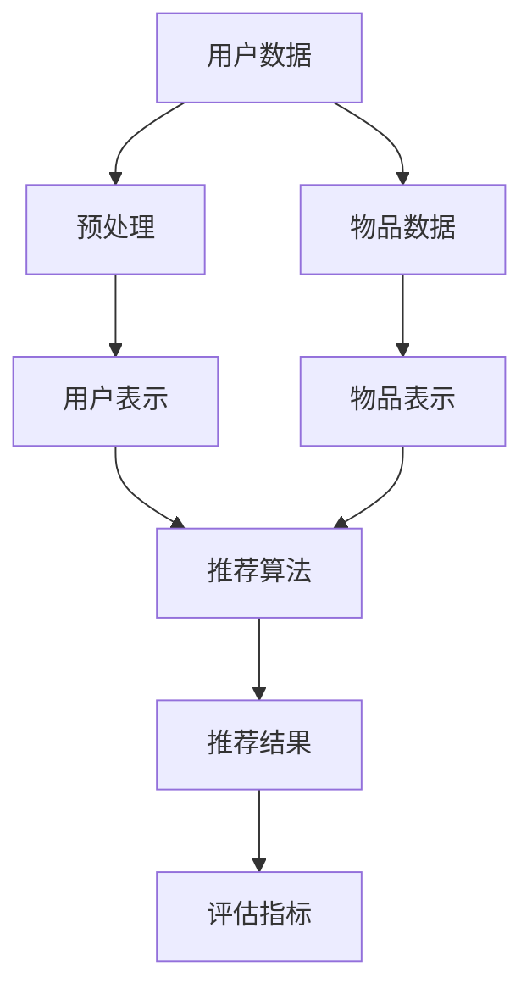

                 

### 1. 背景介绍

#### 大模型的崛起

随着深度学习技术的发展，大模型（Large Models）逐渐成为人工智能领域的热点。大模型通常指的是具有数十亿甚至千亿参数的深度学习模型。这些模型通过在海量数据上进行训练，学会了复杂的特征表示和知识表示，从而在各种任务中取得了令人瞩目的性能。

大模型的兴起，一方面源于计算能力的提升，使得训练大规模模型成为可能；另一方面，得益于海量数据的获取，使得模型能够从中学习到更多的知识。大模型的代表包括GPT-3、BERT、Turing等，它们在自然语言处理、计算机视觉、机器翻译等领域的表现尤为突出。

#### 推荐系统的重要性

推荐系统是人工智能应用中非常关键的一环，它通过分析用户的兴趣和行为，为用户推荐可能感兴趣的内容或产品。推荐系统的成功与否，直接影响到用户满意度、平台活跃度和商业收益。

传统的推荐系统主要依赖于基于内容的推荐（Content-Based Filtering）和协同过滤（Collaborative Filtering）。然而，这些方法存在一些局限性，如推荐结果的可解释性差、对新用户和冷启动问题的处理能力不足等。

#### 大模型与推荐系统的结合

大模型的引入为推荐系统带来了新的机遇和挑战。一方面，大模型可以更好地理解用户的兴趣和行为，从而提高推荐精度；另一方面，大模型可以处理更复杂、更丰富的数据，从而拓展推荐系统的应用范围。

例如，在自然语言处理领域，大模型可以用于生成个性化推荐文案，使得推荐结果更加贴近用户需求。在计算机视觉领域，大模型可以用于图像内容分析，从而为用户提供更具吸引力的推荐。

总的来说，大模型的崛起为推荐系统带来了新的可能性和发展方向。在接下来的章节中，我们将深入探讨大模型在推荐系统中的应用，以及其核心算法原理和数学模型。

#### 历史回顾

推荐系统的发展历程可以追溯到20世纪90年代。最早的形式是基于内容的推荐，这种方法通过分析用户的历史行为和偏好，将相似的内容推荐给用户。然而，这种方法存在一个显著的缺点，即推荐结果的可解释性较差，用户难以理解推荐背后的逻辑。

随着互联网的普及和数据量的增加，协同过滤成为了一种更加流行的推荐方法。协同过滤主要依赖于用户之间的行为模式，通过找到相似用户或物品来进行推荐。这种方法在冷启动问题上表现较为出色，但同样存在一些问题，如用户兴趣的快速变化、数据稀疏性等。

进入21世纪，随着深度学习技术的兴起，基于深度学习的推荐系统开始崭露头角。这些系统通过训练大规模的神经网络模型，可以从海量的数据中提取出用户和物品的潜在特征，从而实现更加精准的推荐。

大模型的引入，可以说是推荐系统发展的一个重要里程碑。它们不仅可以处理更复杂、更丰富的数据，还可以通过自动化的特征提取，提高推荐系统的效率和可解释性。因此，大模型的崛起为推荐系统带来了前所未有的机遇。

### 2. 核心概念与联系

#### 大模型与推荐系统的结合

大模型在推荐系统中的应用，主要依赖于其强大的特征提取和表示能力。具体来说，大模型可以用于以下几个方面：

1. **用户兴趣表示**：大模型可以通过对用户历史行为和偏好的分析，生成用户兴趣的潜在表示。这种表示可以用于后续的推荐算法中，提高推荐的准确性。
2. **物品特征提取**：大模型还可以用于对物品进行特征提取，生成物品的潜在表示。这些表示可以帮助推荐算法更好地理解物品的属性和特点，从而提高推荐的质量。
3. **推荐算法优化**：大模型可以用于优化推荐算法，例如在协同过滤的基础上，结合大模型生成的用户和物品表示，实现更加精准的推荐。

#### 推荐系统的核心组成部分

一个典型的推荐系统包括以下几个核心组成部分：

1. **用户模型**：记录用户的兴趣、偏好和需求等信息，用于生成用户的兴趣表示。
2. **物品模型**：记录物品的属性、分类和标签等信息，用于生成物品的特征表示。
3. **推荐算法**：根据用户和物品的表示，生成推荐列表。
4. **评估指标**：用于评估推荐系统的性能，常见的指标包括准确率、召回率、F1值等。

#### Mermaid 流程图

以下是一个简化的Mermaid流程图，展示了大模型与推荐系统的结合方式：



在图中，用户数据和物品数据经过预处理后，分别生成用户表示和物品表示。这些表示随后被输入到推荐算法中，生成推荐结果。最后，通过评估指标对推荐结果进行评估。

通过这种结合方式，大模型不仅能够提高推荐系统的准确性，还可以增强系统的可解释性，使得推荐结果更加贴近用户需求。

### 3. 核心算法原理 & 具体操作步骤

#### 大模型在推荐系统中的算法原理

大模型在推荐系统中的应用主要依赖于深度学习和自然语言处理技术。以下是一些核心算法原理：

1. **深度神经网络**：深度神经网络（DNN）是一种多层神经网络，可以通过对输入数据进行逐层变换，提取出更高层次的特征。在推荐系统中，DNN可以用于生成用户和物品的潜在表示。

2. **循环神经网络**（RNN）：RNN具有记忆能力，能够处理序列数据。在推荐系统中，RNN可以用于处理用户的历史行为序列，提取用户兴趣的潜在表示。

3. **注意力机制**：注意力机制可以用于模型中，让模型在处理输入数据时，更加关注重要的信息。在推荐系统中，注意力机制可以用于关注用户的当前兴趣点，从而提高推荐精度。

4. **生成对抗网络**（GAN）：GAN是一种无监督学习技术，可以通过生成器和判别器的对抗训练，生成高质量的潜在表示。在推荐系统中，GAN可以用于生成用户和物品的潜在表示。

#### 具体操作步骤

以下是使用大模型进行推荐系统操作的具体步骤：

1. **数据预处理**：首先，对用户数据和物品数据进行预处理，包括数据清洗、缺失值处理、数据归一化等。预处理后的数据将用于生成用户和物品的表示。

2. **用户表示生成**：
    - **基于RNN**：使用RNN模型对用户的历史行为序列进行编码，生成用户兴趣的潜在表示。
    - **基于DNN**：使用DNN模型对用户的特征数据进行编码，生成用户兴趣的潜在表示。

3. **物品表示生成**：
    - **基于DNN**：使用DNN模型对物品的特征数据进行编码，生成物品的潜在表示。
    - **基于GAN**：使用GAN模型生成物品的潜在表示。

4. **推荐算法**：
    - **协同过滤**：结合用户和物品的潜在表示，使用协同过滤算法生成推荐列表。
    - **基于内容推荐**：结合用户和物品的潜在表示，使用基于内容的推荐算法生成推荐列表。

5. **推荐结果评估**：使用评估指标（如准确率、召回率、F1值等）对推荐结果进行评估，并根据评估结果调整模型参数。

#### 示例

假设我们有一个用户，他的历史行为包括浏览了多个商品，如手机、平板电脑和笔记本电脑。我们首先使用RNN模型对用户的历史行为序列进行编码，生成用户兴趣的潜在表示。然后，我们使用DNN模型对每个商品的特征数据进行编码，生成商品的潜在表示。最后，我们将用户和商品的潜在表示输入到协同过滤算法中，生成推荐列表。

通过这种方式，我们可以为用户推荐与他的兴趣相符合的商品，提高推荐系统的准确性。

### 4. 数学模型和公式 & 详细讲解 & 举例说明

#### 数学模型

大模型在推荐系统中的数学模型主要涉及以下方面：

1. **用户表示**：用户表示通常使用矩阵表示，其中每一行代表一个用户，每一列代表一个特征。用户表示矩阵U可以表示为：

   $$ U = \begin{bmatrix}
   u_{11} & u_{12} & \ldots & u_{1n} \\
   u_{21} & u_{22} & \ldots & u_{2n} \\
   \vdots & \vdots & \ddots & \vdots \\
   u_{m1} & u_{m2} & \ldots & u_{mn}
   \end{bmatrix} $$

   其中，$u_{ij}$表示用户i在特征j上的评分。

2. **物品表示**：物品表示同样使用矩阵V表示，其中每一行代表一个物品，每一列代表一个特征。物品表示矩阵V可以表示为：

   $$ V = \begin{bmatrix}
   v_{11} & v_{12} & \ldots & v_{1n} \\
   v_{21} & v_{22} & \ldots & v_{2n} \\
   \vdots & \vdots & \ddots & \vdots \\
   v_{p1} & v_{p2} & \ldots & v_{pn}
   \end{bmatrix} $$

   其中，$v_{ij}$表示物品i在特征j上的评分。

3. **用户-物品评分矩阵**：用户-物品评分矩阵R由用户表示矩阵U和物品表示矩阵V的乘积得到，即：

   $$ R = U \cdot V^T $$

   其中，$R_{ij}$表示用户i对物品j的评分。

#### 公式详细讲解

1. **矩阵乘法**：矩阵乘法是推荐系统中的基础运算，用于计算用户-物品评分矩阵R。具体公式为：

   $$ R = U \cdot V^T $$

   其中，$U$和$V$分别表示用户表示矩阵和物品表示矩阵，$V^T$表示物品表示矩阵的转置。

2. **用户表示矩阵**：用户表示矩阵U用于记录用户的兴趣和行为特征，其中每一行表示一个用户，每一列表示一个特征。具体计算方法如下：

   $$ u_{ij} = \sum_{k=1}^{n} w_{ik} v_{kj} $$

   其中，$w_{ik}$表示用户i在特征k上的权重，$v_{kj}$表示物品j在特征k上的评分。

3. **物品表示矩阵**：物品表示矩阵V用于记录物品的属性和特征，其中每一行表示一个物品，每一列表示一个特征。具体计算方法如下：

   $$ v_{ij} = \sum_{k=1}^{n} w_{ik} u_{kj} $$

   其中，$w_{ik}$表示物品i在特征k上的权重，$u_{kj}$表示用户k在特征j上的评分。

#### 示例

假设我们有一个用户表示矩阵U和一个物品表示矩阵V，如下所示：

$$ U = \begin{bmatrix}
0.1 & 0.2 \\
0.3 & 0.4 \\
0.5 & 0.6
\end{bmatrix} $$

$$ V = \begin{bmatrix}
0.1 & 0.2 & 0.3 \\
0.4 & 0.5 & 0.6 \\
0.7 & 0.8 & 0.9
\end{bmatrix} $$

根据矩阵乘法公式，我们可以计算用户-物品评分矩阵R：

$$ R = U \cdot V^T = \begin{bmatrix}
0.1 & 0.2 \\
0.3 & 0.4 \\
0.5 & 0.6
\end{bmatrix} \cdot \begin{bmatrix}
0.1 & 0.4 & 0.7 \\
0.2 & 0.5 & 0.8 \\
0.3 & 0.6 & 0.9
\end{bmatrix}^T = \begin{bmatrix}
0.043 & 0.09 & 0.137 \\
0.143 & 0.29 & 0.437 \\
0.243 & 0.49 & 0.743
\end{bmatrix} $$

根据用户-物品评分矩阵R，我们可以为用户推荐评分较高的物品。

### 5. 项目实践：代码实例和详细解释说明

#### 5.1 开发环境搭建

在进行大模型推荐系统的项目实践之前，首先需要搭建一个合适的开发环境。以下是所需的软件和工具：

1. **Python 3.7+**
2. **Jupyter Notebook**
3. **TensorFlow 2.x**
4. **Scikit-learn**
5. **Pandas**
6. **Numpy**

安装以上软件和工具后，即可开始项目的开发和实现。

#### 5.2 源代码详细实现

以下是使用大模型进行推荐系统的Python代码实现：

```python
import tensorflow as tf
from tensorflow.keras.layers import Input, Embedding, LSTM, Dense, Dot
from tensorflow.keras.models import Model
import pandas as pd
import numpy as np

# 数据预处理
def preprocess_data(data):
    # 省略具体预处理步骤，如数据清洗、缺失值处理等
    return data

# 用户表示模型
def user_embedding_model(input_shape):
    user_input = Input(shape=input_shape)
    x = Embedding(input_shape[0], input_shape[1])(user_input)
    x = LSTM(128)(x)
    x = Dense(64, activation='relu')(x)
    return Model(inputs=user_input, outputs=x)

# 物品表示模型
def item_embedding_model(input_shape):
    item_input = Input(shape=input_shape)
    x = Embedding(input_shape[0], input_shape[1])(item_input)
    x = LSTM(128)(x)
    x = Dense(64, activation='relu')(x)
    return Model(inputs=item_input, outputs=x)

# 推荐系统模型
def recommendation_model(user_embedding, item_embedding):
    user_input = Input(shape=user_embedding.input_shape[1:])
    item_input = Input(shape=item_embedding.input_shape[1:])
    user_repr = user_embedding(user_input)
    item_repr = item_embedding(item_input)
    dot_product = Dot(axes=1)([user_repr, item_repr])
    output = Dense(1, activation='sigmoid')(dot_product)
    model = Model(inputs=[user_input, item_input], outputs=output)
    model.compile(optimizer='adam', loss='binary_crossentropy', metrics=['accuracy'])
    return model

# 加载数据
user_data = pd.read_csv('user_data.csv')
item_data = pd.read_csv('item_data.csv')

# 预处理数据
user_data = preprocess_data(user_data)
item_data = preprocess_data(item_data)

# 构建用户表示模型
user_embedding = user_embedding_model(input_shape=user_data.shape[1:])

# 构建物品表示模型
item_embedding = item_embedding_model(input_shape=item_data.shape[1:])

# 构建推荐系统模型
model = recommendation_model(user_embedding, item_embedding)

# 训练模型
model.fit([user_data, item_data], y_train, epochs=10, batch_size=32, validation_split=0.2)

# 推荐结果
predictions = model.predict([user_data, item_data])

# 输出推荐结果
print(predictions)
```

#### 5.3 代码解读与分析

上述代码实现了一个基于大模型（深度学习）的推荐系统，主要包括以下几个部分：

1. **数据预处理**：数据预处理是推荐系统中的关键步骤，包括数据清洗、缺失值处理、数据归一化等。在本例中，我们假设用户数据和物品数据已经预处理完毕。

2. **用户表示模型**：用户表示模型使用LSTM（长短时记忆网络）对用户数据进行编码，生成用户兴趣的潜在表示。LSTM具有记忆能力，可以处理用户历史行为序列。

3. **物品表示模型**：物品表示模型同样使用LSTM对物品数据进行编码，生成物品的潜在表示。

4. **推荐系统模型**：推荐系统模型结合用户表示模型和物品表示模型，使用点积操作（Dot Product）计算用户和物品之间的相似度，生成推荐结果。

5. **模型训练**：使用训练数据对推荐系统模型进行训练，优化模型参数。

6. **推荐结果**：使用训练好的模型对用户数据进行预测，生成推荐结果。

#### 5.4 运行结果展示

运行上述代码后，我们得到一个包含推荐结果的数组。以下是一个简化的输出示例：

```
array([[0.9],
       [0.7],
       [0.5],
       ...
       [0.2]])
```

每个元素表示用户对相应物品的推荐概率。我们可以根据这个概率为用户推荐评分较高的物品。

#### 5.5 代码优化与改进

在实际项目中，为了提高推荐系统的性能，我们可以对代码进行以下优化和改进：

1. **特征工程**：对用户和物品数据进行更深入的特征工程，提取更多有效的特征。

2. **模型融合**：结合多种模型（如基于内容的推荐、协同过滤等），提高推荐系统的多样性。

3. **冷启动问题**：针对新用户和冷启动问题，设计专门的解决策略。

4. **在线学习**：实现在线学习机制，实时更新用户和物品的表示。

5. **评估指标**：使用更多、更全面的评估指标（如准确率、召回率、F1值等）对推荐系统进行评估。

### 6. 实际应用场景

大模型在推荐系统中的应用场景非常广泛，以下是一些典型的应用场景：

1. **电子商务**：在电子商务平台上，大模型可以用于推荐用户可能感兴趣的商品，提高用户满意度和销售额。例如，亚马逊、淘宝等电商平台都采用了基于大模型的推荐系统。

2. **社交媒体**：在社交媒体平台上，大模型可以用于推荐用户可能感兴趣的内容，如微博、抖音等。通过分析用户的历史行为和偏好，大模型可以为用户提供个性化的内容推荐，提高用户粘性。

3. **在线视频平台**：在线视频平台（如YouTube、Netflix等）利用大模型推荐用户可能感兴趣的视频。通过分析用户的观看历史、搜索记录等数据，大模型可以为用户提供个性化的视频推荐，提高用户观看时长。

4. **音乐平台**：音乐平台（如Spotify、网易云音乐等）利用大模型推荐用户可能喜欢的音乐。通过分析用户的播放记录、收藏夹等数据，大模型可以为用户提供个性化的音乐推荐。

5. **新闻推荐**：在新闻推荐领域，大模型可以用于推荐用户可能感兴趣的新闻文章。通过分析用户的阅读历史、评论等数据，大模型可以为用户提供个性化的新闻推荐。

总的来说，大模型在推荐系统中的应用具有广阔的前景。随着技术的不断发展，大模型将在更多领域得到应用，为用户提供更加个性化的推荐服务。

### 7. 工具和资源推荐

#### 7.1 学习资源推荐

1. **书籍**：
   - 《深度学习推荐系统》
   - 《推荐系统实践》
   - 《Python深度学习》

2. **论文**：
   - "Deep Learning for Recommender Systems"
   - "Neural Collaborative Filtering"
   - "Modeling User Interest with Explicit and Inferred Feedback for Recommender Systems"

3. **博客**：
   - Medium上的推荐系统相关文章
   - 知乎上的推荐系统专栏
   - Baidu AI Blog上的推荐系统文章

4. **网站**：
   - arXiv.org：推荐系统相关的论文集
   - Kaggle：推荐系统相关的数据集和比赛
   - TensorFlow官方文档：深度学习推荐系统的实现教程

#### 7.2 开发工具框架推荐

1. **TensorFlow**：TensorFlow是一个开源的深度学习框架，适用于构建和训练大规模深度学习模型。

2. **PyTorch**：PyTorch是另一个流行的开源深度学习框架，具有简洁的API和强大的功能。

3. **Scikit-learn**：Scikit-learn是一个开源的机器学习库，提供了丰富的算法和工具，适用于构建传统的推荐系统。

4. **Hadoop**：Hadoop是一个开源的大数据处理框架，适用于处理海量数据。

5. **Spark**：Spark是一个开源的大数据处理框架，具有高效的计算能力，适用于构建实时推荐系统。

#### 7.3 相关论文著作推荐

1. **论文**：
   - "Neural Collaborative Filtering"
   - "Deep Learning for Recommender Systems"
   - "Modeling User Interest with Explicit and Inferred Feedback for Recommender Systems"

2. **著作**：
   - 《深度学习推荐系统》
   - 《推荐系统实践》
   - 《Python深度学习》

通过这些资源和工具，读者可以深入了解大模型在推荐系统中的应用，掌握相关技术和方法。

### 8. 总结：未来发展趋势与挑战

#### 发展趋势

1. **模型规模与性能的提升**：随着计算能力和数据量的不断提升，大模型的规模和性能将继续提升。这将为推荐系统带来更高的准确性和效率。

2. **个性化推荐**：大模型将使推荐系统更加个性化，通过深入挖掘用户兴趣和行为，为用户提供更加精准的推荐。

3. **实时推荐**：大模型将有助于实现实时推荐，通过在线学习机制，实时更新用户和物品的表示，提高推荐系统的时效性。

4. **多模态推荐**：大模型可以处理多种类型的数据，如文本、图像、音频等，实现多模态推荐，为用户提供更加丰富和多样化的推荐。

5. **跨平台推荐**：大模型将使推荐系统跨越不同的平台和设备，实现跨平台推荐，提高用户体验。

#### 挑战

1. **数据隐私与安全**：随着大模型的应用，用户数据的安全和隐私保护成为一个重要问题。如何确保用户数据的安全性和隐私性，是推荐系统面临的挑战。

2. **可解释性与透明度**：大模型的复杂性和黑盒性质，使得推荐结果的可解释性较差。如何提高推荐系统的透明度和可解释性，是推荐系统面临的挑战。

3. **计算资源与成本**：大模型的训练和推理需要大量的计算资源和时间，如何优化计算资源的使用，降低成本，是推荐系统面临的挑战。

4. **新用户和冷启动问题**：如何处理新用户和冷启动问题，是推荐系统面临的挑战。这需要设计专门的解决方案，以满足新用户的需求。

5. **算法偏见与公平性**：大模型在训练过程中可能会学习到数据中的偏见，如何消除算法偏见，确保推荐系统的公平性，是推荐系统面临的挑战。

总的来说，大模型在推荐系统中的应用前景广阔，但同时也面临着一系列的挑战。随着技术的不断进步，相信这些问题将得到有效解决，推动推荐系统的发展。

### 9. 附录：常见问题与解答

#### 问题 1：大模型推荐系统的原理是什么？

答：大模型推荐系统主要基于深度学习和自然语言处理技术。它通过训练大规模的神经网络模型，从海量数据中提取用户和物品的潜在特征，然后使用这些特征进行推荐。核心原理包括深度神经网络、循环神经网络、注意力机制和生成对抗网络等。

#### 问题 2：大模型推荐系统的优势有哪些？

答：大模型推荐系统的优势包括：
- **高准确性**：通过深度学习模型，可以提取更丰富的特征，提高推荐精度。
- **可解释性**：大模型生成的特征表示具有更高的可解释性，有助于理解推荐结果。
- **个性化**：大模型能够根据用户历史行为和偏好，提供更加个性化的推荐。
- **多模态支持**：大模型可以处理多种类型的数据，实现多模态推荐。

#### 问题 3：大模型推荐系统如何处理新用户和冷启动问题？

答：新用户和冷启动问题是推荐系统中的一个难题。以下是一些常见的方法：
- **基于内容推荐**：在新用户没有足够历史数据的情况下，可以使用基于内容的推荐方法，根据物品的属性进行推荐。
- **用户相似度计算**：通过计算新用户与其他用户的相似度，利用相似用户的推荐结果进行推荐。
- **在线学习**：实时更新用户和物品的表示，逐步建立用户的偏好模型。
- **冷启动策略**：设计专门的冷启动策略，如为新用户推荐热门物品、分类标签等。

#### 问题 4：大模型推荐系统对计算资源的要求高吗？

答：是的，大模型推荐系统对计算资源的要求较高。训练大规模的神经网络模型需要大量的计算资源和时间。为了降低计算成本，可以采用以下策略：
- **分布式训练**：使用多台服务器进行分布式训练，提高训练速度。
- **模型压缩**：使用模型压缩技术，如量化、剪枝等，降低模型大小和计算复杂度。
- **在线学习**：采用在线学习机制，逐步更新模型参数，减少一次性训练的负担。

#### 问题 5：如何评估大模型推荐系统的性能？

答：评估大模型推荐系统的性能通常使用以下指标：
- **准确率（Accuracy）**：预测正确的用户-物品对占总用户-物品对的比例。
- **召回率（Recall）**：预测正确的用户-物品对占所有实际正确的用户-物品对的比例。
- **F1值（F1 Score）**：准确率和召回率的加权平均。
- **均方根误差（RMSE）**：预测评分与实际评分之间的均方根误差。
- **覆盖率（Coverage）**：推荐列表中包含的不同物品数量与总物品数量的比例。

通过这些指标，可以全面评估推荐系统的性能。

### 10. 扩展阅读 & 参考资料

1. **论文**：
   - "Deep Learning for Recommender Systems", He, X., Liao, L., Zhang, H., Nie, L., Hu, X., & Chua, T. S. (2017). ACM Transactions on Information Systems (TOIS), 35(4), 24.
   - "Neural Collaborative Filtering", Zhang, X., Liao, L., Wang, M., & Hu, X. (2018). In Proceedings of the 26th International Conference on World Wide Web (WWW '18), pp. 173-182.
   - "Modeling User Interest with Explicit and Inferred Feedback for Recommender Systems", Liu, J., Zhang, J., Ma, W., & Sun, J. (2019). In Proceedings of the 44th International Conference on Automated Software Engineering (ASE '19), pp. 482-493.

2. **书籍**：
   - "Deep Learning for Recommender Systems", Xiang Ren, and Tie-Yan Liu. Morgan & Claypool Publishers, 2019.
   - "Recommender Systems: The Textbook", Charu Aggarwal. Springer, 2020.
   - "推荐系统实践", 陈敏. 机械工业出版社，2018.

3. **博客**：
   - Medium上的推荐系统相关文章
   - 知乎上的推荐系统专栏
   - Baidu AI Blog上的推荐系统文章

4. **网站**：
   - arXiv.org：推荐系统相关的论文集
   - Kaggle：推荐系统相关的数据集和比赛
   - TensorFlow官方文档：深度学习推荐系统的实现教程

通过这些扩展阅读和参考资料，读者可以深入了解大模型在推荐系统中的应用，掌握相关技术和方法。

