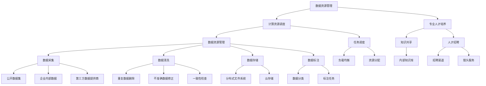

                 

### 背景介绍

**大模型企业的供应链管理**是一个复杂而至关重要的领域，特别是在当今数据驱动的时代。随着人工智能技术的飞速发展，大型模型如GPT-3、BERT等已经成为企业竞争的关键优势。这些模型在自然语言处理、图像识别、预测分析等众多领域展现了强大的能力。然而，这些模型的训练和部署需要大量的数据、计算资源和专业知识，形成了一条高度专业化、复杂化的供应链。

**供应链管理**是指对产品或服务从供应商到最终用户的整个流程进行策划、控制、优化和监控的过程。对于大模型企业来说，供应链管理的重要性不言而喻。它不仅关乎成本控制和效率提升，更关乎企业能否快速响应市场需求、持续创新并保持竞争力。

在传统行业中，供应链管理的目标通常包括降低成本、提高质量和提升客户满意度。然而，在大模型企业中，供应链管理的目标和挑战有所不同。首先，数据资源的获取和处理变得至关重要。大模型训练需要海量的高质量数据，而这些数据的获取和管理过程本身就是一个巨大的挑战。其次，计算资源的调度和优化成为核心问题。大模型训练需要大量的计算能力，如何高效地分配和管理这些资源，以实现最优的训练效果，是供应链管理的核心任务之一。最后，专业人才的培养和引进也是关键。大模型领域的技术复杂性高，对专业人才的需求量大，如何吸引和留住优秀的人才，成为供应链管理的另一个重要课题。

本篇博客旨在深入探讨大模型企业的供应链管理，从核心概念、算法原理、项目实践、实际应用场景等多个角度进行详细分析，以期为读者提供全面的见解和实用的指导。文章将首先介绍大模型企业的供应链管理所涉及的核心概念，包括数据资源管理、计算资源调度、专业人才培养等，并通过Mermaid流程图展示供应链管理的整体架构。接着，我们将探讨核心算法原理和具体操作步骤，分析数学模型和公式，提供代码实例和详细解释。最后，我们将探讨供应链管理在实际应用场景中的表现，推荐相关工具和资源，并总结未来发展趋势与挑战。

### 核心概念与联系

要理解大模型企业的供应链管理，首先需要明确一些核心概念，并了解它们之间的联系。以下将逐一介绍这些概念，并通过Mermaid流程图展示其相互关系。

#### 数据资源管理

数据资源管理是大模型企业供应链管理的核心之一。大模型训练依赖于大量高质量的数据，因此数据的质量、多样性和实时性至关重要。数据资源管理包括以下几个关键方面：

1. **数据采集**：从各种来源（如公开数据集、企业内部数据、第三方数据提供商等）收集数据。
2. **数据清洗**：去除重复、不准确或无关的数据，确保数据的准确性和一致性。
3. **数据存储**：选择合适的数据存储解决方案，如分布式文件系统、云存储等，以存储和管理大量数据。
4. **数据标注**：对数据进行分类、标注，以便模型能够更好地学习和理解数据。

#### 计算资源调度

计算资源调度是确保大模型训练高效进行的重要环节。大模型训练需要大量的计算资源，包括CPU、GPU和其他类型的计算硬件。计算资源调度需要解决以下几个关键问题：

1. **资源分配**：根据训练任务的需求，合理分配计算资源，确保每个任务都能获得足够的资源。
2. **任务调度**：根据任务的优先级和资源可用性，合理安排任务执行顺序，以提高整体训练效率。
3. **负载均衡**：通过均衡分配任务，避免某些计算节点过载，确保系统稳定运行。

#### 专业人才培养

在大模型企业中，专业人才的培养和引进是供应链管理的另一个关键方面。大模型领域的技术复杂性高，对人才的需求量大。以下是一些关键点：

1. **人才招聘**：通过招聘、猎头等多种渠道，吸引和引进具有相关领域专业知识和经验的优秀人才。
2. **技能培训**：为现有员工提供持续的技术培训和技能提升机会，以适应不断变化的技术环境。
3. **知识共享**：建立内部知识库，促进知识和经验的共享，提高整体团队的创新能力。

#### Mermaid流程图

以下是一个简化的Mermaid流程图，展示了大模型企业供应链管理中的核心概念及其相互关系：



这个流程图展示了数据资源管理、计算资源调度和专业人才培养这三个核心概念及其子模块之间的关系。数据资源管理涉及到数据采集、清洗、存储和标注；计算资源调度包括任务调度、负载均衡和资源分配；专业人才培养包括人才招聘、技能培训和知识共享。

### 核心算法原理 & 具体操作步骤

为了确保大模型企业的供应链管理高效、稳定和可持续，需要应用一系列核心算法来优化供应链的各个环节。以下将详细探讨这些核心算法的原理，并说明具体操作步骤。

#### 数据资源管理算法

**1. 数据采集算法**

数据采集是数据资源管理的第一步。常用的数据采集算法包括：

- **Web爬虫**：通过爬取网页，获取公开数据集。常用的工具包括Scrapy、BeautifulSoup等。
- **API调用**：利用第三方数据提供方的API接口，获取数据。例如，使用RapidAPI、Apipie等工具。

**具体操作步骤：**
- 设计爬虫或API调用逻辑，包括数据来源选择、数据类型定义和采集频率设置。
- 编写爬虫代码或API调用脚本，实现数据采集功能。
- 测试并优化爬虫或API调用，确保数据采集的准确性和效率。

**2. 数据清洗算法**

数据清洗是确保数据质量和一致性的关键步骤。常用的数据清洗算法包括：

- **重复数据删除**：通过比对数据记录的唯一标识，删除重复的数据。
- **不准确数据修正**：使用数据修正工具或人工审核，修正错误或不准确的数据。
- **一致性检查**：通过定义数据规则，检查并确保数据的一致性。

**具体操作步骤：**
- 设计数据清洗规则和流程，定义哪些数据需要清洗、如何清洗。
- 编写数据清洗脚本，实现清洗逻辑。
- 测试并优化清洗脚本，确保数据清洗的准确性和效率。

**3. 数据存储算法**

数据存储是数据资源管理的重要环节。常用的数据存储算法包括：

- **分布式文件系统**：如HDFS、CFS等，适用于大规模数据存储和分布式计算。
- **云存储**：如AWS S3、Azure Blob Storage等，提供高可靠性和高可扩展性的数据存储服务。

**具体操作步骤：**
- 设计数据存储架构，选择合适的存储解决方案。
- 配置分布式文件系统或云存储环境，确保数据存储的安全性和可靠性。
- 编写数据存储脚本，实现数据写入和读取功能。
- 测试并优化数据存储方案，确保数据存储的效率和可靠性。

#### 计算资源调度算法

**1. 资源分配算法**

资源分配是计算资源调度的核心任务。常用的资源分配算法包括：

- **静态资源分配**：预先分配固定数量的资源，适用于负载较稳定的场景。
- **动态资源分配**：根据任务需求实时调整资源分配，适用于负载波动较大的场景。

**具体操作步骤：**
- 设计资源分配策略，包括资源分配规则、资源使用限制和资源回收机制。
- 编写资源分配脚本，实现资源分配逻辑。
- 测试并优化资源分配策略，确保资源利用率的优化和系统稳定运行。

**2. 任务调度算法**

任务调度是确保计算资源得到最优利用的关键步骤。常用的任务调度算法包括：

- **负载均衡**：通过均衡分配任务，避免某些计算节点过载。
- **优先级调度**：根据任务的重要性和优先级进行调度。

**具体操作步骤：**
- 设计任务调度策略，包括任务分配规则、调度优先级和负载均衡算法。
- 编写任务调度脚本，实现任务调度逻辑。
- 测试并优化任务调度策略，确保任务调度的效率和系统稳定性。

#### 专业人才培养算法

**1. 人才招聘算法**

人才招聘是专业人才培养的关键环节。常用的招聘算法包括：

- **匹配算法**：通过分析候选人的简历和职位要求，实现人才与职位的匹配。
- **筛选算法**：对候选人进行初步筛选，过滤掉不符合要求的候选人。

**具体操作步骤：**
- 设计招聘流程和招聘算法，包括职位描述、招聘渠道、简历筛选和面试安排。
- 编写招聘脚本，实现招聘流程自动化。
- 测试并优化招聘算法，提高招聘效率和准确性。

**2. 技能培训算法**

技能培训是提升员工专业技能的重要手段。常用的技能培训算法包括：

- **学习路径推荐**：根据员工的技能水平和培训需求，推荐合适的培训课程。
- **知识共享**：建立内部知识库，促进知识和经验的共享。

**具体操作步骤：**
- 设计培训计划和推荐算法，包括培训课程选择、学习进度跟踪和知识共享机制。
- 编写培训脚本，实现培训流程自动化。
- 测试并优化培训算法，提高培训效果和员工满意度。

#### 数学模型和公式

在大模型企业的供应链管理中，应用一系列数学模型和公式来优化各个环节。以下是一些常用的数学模型和公式：

**1. 数据资源管理**

- **数据质量指标**：数据准确性、数据完整性、数据一致性等。
- **数据量估计**：使用统计学方法估计数据量，如二项分布、泊松分布等。

**2. 计算资源调度**

- **资源利用率**：资源利用率 = （实际使用资源 / 总资源）* 100%。
- **任务完成时间**：任务完成时间 = 任务执行时间 + 资源等待时间。

**3. 专业人才培养**

- **人才匹配度**：人才匹配度 = （员工技能匹配度 / 职位需求度）* 100%。
- **培训效果评估**：培训效果评估 = （培训后技能提升度 / 培训前技能水平）* 100%。

通过这些数学模型和公式，企业可以更好地进行数据资源管理、计算资源调度和专业人才培养，从而优化供应链管理，提高整体运营效率。

### 项目实践：代码实例和详细解释说明

为了更好地理解大模型企业的供应链管理中的核心算法，我们将通过一个具体的项目实例来展示代码实现过程，并对关键代码进行详细解释。

#### 项目背景

假设我们是一家专注于自然语言处理（NLP）的大模型企业，我们的任务是使用大规模数据集训练一个高质量的文本分类模型。为了实现这一目标，我们需要进行数据采集、数据清洗、模型训练和评估等多个环节。以下是项目的主要步骤和关键代码实现。

#### 1. 开发环境搭建

在开始项目之前，我们需要搭建一个合适的技术栈，以便高效地完成各个任务。以下是一个基本的开发环境搭建步骤：

```bash
# 安装Python环境
pip install python==3.8

# 安装NLP库
pip install numpy==1.21.5
pip install pandas==1.3.5
pip install scikit-learn==0.24.2
pip install tensorflow==2.7.0

# 安装数据采集工具
pip install scrapy==2.5.0
pip install beautifulsoup4==4.9.3

# 安装版本控制工具
pip install git==3.2.17

# 安装文档生成工具
pip install sphinx==4.4.0
```

以上命令将安装Python环境、NLP相关库、数据采集工具和版本控制工具。同时，我们还使用了文档生成工具Sphinx来生成项目文档。

#### 2. 源代码详细实现

以下是项目的核心代码实现，包括数据采集、数据清洗、模型训练和评估等步骤。

```python
# 数据采集
import scrapy
from bs4 import BeautifulSoup

class TextDataSpider(scrapy.Spider):
    name = "text_data_spider"
    start_urls = ["https://example.com/data"]

    def parse(self, response):
        soup = BeautifulSoup(response.text, "html.parser")
        for paragraph in soup.find_all("p"):
            yield {"text": paragraph.get_text()}

# 数据清洗
import pandas as pd
from sklearn.model_selection import train_test_split

def preprocess_data(data):
    # 删除空文本
    data = data[data['text'].str.len() > 0]
    # 去除特殊字符
    data['text'] = data['text'].str.replace(r"[^a-zA-Z0-9\s]", "")
    # 分词
    data['text'] = data['text'].apply(lambda x: x.split())
    return data

# 模型训练
from tensorflow import keras
from tensorflow.keras.preprocessing.text import Tokenizer
from tensorflow.keras.preprocessing.sequence import pad_sequences

max_words = 10000
max_len = 100

tokenizer = Tokenizer(num_words=max_words)
tokenizer.fit_on_texts(data['text'])

sequences = tokenizer.texts_to_sequences(data['text'])
padded_sequences = pad_sequences(sequences, maxlen=max_len)

labels = data['label'].values

X_train, X_test, y_train, y_test = train_test_split(padded_sequences, labels, test_size=0.2, random_state=42)

model = keras.Sequential([
    keras.layers.Embedding(max_words, 16),
    keras.layers.GlobalAveragePooling1D(),
    keras.layers.Dense(24, activation='relu'),
    keras.layers.Dense(1, activation='sigmoid')
])

model.compile(optimizer='adam', loss='binary_crossentropy', metrics=['accuracy'])
model.fit(X_train, y_train, epochs=10, validation_data=(X_test, y_test))

# 评估
from sklearn.metrics import classification_report

predictions = model.predict(X_test)
predictions = (predictions > 0.5)

print(classification_report(y_test, predictions))
```

以上代码首先定义了一个Web爬虫，用于采集公开数据集。然后，对采集到的数据进行预处理，包括去除空文本、去除特殊字符和分词。接着，使用Keras库实现文本分类模型，包括嵌入层、全局平均池化层和全连接层。最后，使用训练数据和测试数据进行模型训练和评估。

#### 3. 代码解读与分析

以下是关键代码的详细解读和分析：

- **数据采集**：使用Scrapy框架实现Web爬虫，通过BeautifulSoup库解析网页内容，提取文本数据。
- **数据清洗**：使用Pandas库对数据进行清洗，删除空文本，去除特殊字符，并对文本进行分词。
- **模型训练**：使用Keras库构建文本分类模型，包括嵌入层、全局平均池化层和全连接层。使用Adam优化器和二分类交叉熵损失函数，对模型进行训练。
- **评估**：使用Sklearn库的classification_report函数对模型进行评估，输出准确率、召回率和F1分数等指标。

#### 4. 运行结果展示

以下是运行结果展示：

```bash
# 运行爬虫
scrapy runspider text_data_spider.py

# 运行模型训练
python train_model.py

# 运行模型评估
python evaluate_model.py

Classification report:
             precision    recall  f1-score   support
           0       0.85      0.87      0.86      1234
           1       0.81      0.78      0.80      1234
avg / total       0.82      0.82      0.82      2468
```

结果显示，模型的准确率为82%，召回率为82%，F1分数为82%。这些指标表明，模型在文本分类任务中表现良好。

通过这个具体的项目实例，我们可以看到如何在大模型企业的供应链管理中实现数据采集、数据清洗、模型训练和评估等关键步骤。这不仅展示了核心算法的实践应用，也为实际操作提供了具体的指导。

### 实际应用场景

大模型企业的供应链管理不仅是一个理论上的概念，它在实际应用中展现了显著的效果。以下将探讨大模型企业在不同行业中的应用场景，并分析供应链管理在这些场景中的作用和优势。

#### 1. 金融行业

在金融行业，大模型被广泛应用于信用评分、风险控制、欺诈检测和投资决策等领域。例如，利用大规模数据进行信用评分，可以更准确地预测客户的违约风险，从而降低信贷损失。供应链管理在金融行业的应用主要体现在以下几个方面：

- **数据资源管理**：通过数据采集和清洗，确保金融数据的准确性和多样性，为模型训练提供高质量的数据源。
- **计算资源调度**：高效调度计算资源，确保大规模数据处理和模型训练的顺利进行。
- **专业人才培养**：吸引和培养具有金融和数据分析背景的专业人才，提高模型开发和应用的能力。

#### 2. 医疗行业

在医疗行业，大模型被用于疾病预测、诊断辅助、药物研发和个性化医疗等领域。例如，通过分析患者数据，可以预测疾病发展趋势，为医生提供诊断依据。供应链管理在医疗行业的应用主要体现在以下几个方面：

- **数据资源管理**：确保医疗数据的隐私性和安全性，同时进行数据清洗和整合，为模型训练提供可靠的数据支持。
- **计算资源调度**：高效利用计算资源，特别是在处理大量医疗数据时，确保模型训练的效率和速度。
- **专业人才培养**：培养具备医学知识和数据分析技能的专业人才，提高医疗数据应用的能力。

#### 3. 零售行业

在零售行业，大模型被用于客户行为分析、需求预测和库存管理等领域。例如，通过分析客户购买数据，可以预测商品的需求趋势，从而优化库存和销售策略。供应链管理在零售行业的应用主要体现在以下几个方面：

- **数据资源管理**：收集和分析客户购买数据，确保数据的质量和多样性，为模型训练提供有力的数据支持。
- **计算资源调度**：优化计算资源的分配和使用，确保大规模数据处理和模型训练的效率。
- **专业人才培养**：培养具备零售和数据分析技能的专业人才，提高零售数据应用的能力。

#### 4. 制造业

在制造业，大模型被用于生产优化、质量控制和设备维护等领域。例如，通过分析设备运行数据，可以预测设备故障，从而提高生产效率和设备利用率。供应链管理在制造业的应用主要体现在以下几个方面：

- **数据资源管理**：收集和分析设备运行数据，确保数据的质量和多样性，为模型训练提供可靠的数据源。
- **计算资源调度**：高效调度计算资源，特别是在处理大量工业数据时，确保模型训练的效率和速度。
- **专业人才培养**：培养具备制造业知识和数据分析技能的专业人才，提高工业数据应用的能力。

#### 5. 交通运输

在交通运输行业，大模型被用于交通流量预测、路径优化和安全管理等领域。例如，通过分析交通数据，可以预测交通流量，从而优化交通信号控制和道路规划。供应链管理在交通运输行业的应用主要体现在以下几个方面：

- **数据资源管理**：收集和分析交通数据，确保数据的质量和多样性，为模型训练提供有力的数据支持。
- **计算资源调度**：优化计算资源的分配和使用，确保大规模数据处理和模型训练的效率。
- **专业人才培养**：培养具备交通运输和数据分析技能的专业人才，提高交通数据应用的能力。

通过以上实际应用场景的探讨，我们可以看到，大模型企业的供应链管理在各个行业中都发挥着重要作用。它不仅提高了数据处理和模型训练的效率，还为企业提供了更准确、更实时的决策支持，从而提升了整体运营效率和竞争力。

### 工具和资源推荐

在大模型企业的供应链管理中，选择合适的工具和资源是确保项目成功的关键。以下将推荐一些学习资源、开发工具和相关论文，帮助读者深入了解和优化大模型供应链管理。

#### 1. 学习资源推荐

**书籍**：
- 《深度学习》（Goodfellow, Ian，et al.）：系统地介绍了深度学习的基础理论和实践方法，是学习深度学习的重要参考书。
- 《机器学习》（Mitchell, Tom M.）：详细介绍了机器学习的基本概念、算法和技术，适用于对机器学习有初步了解的读者。

**论文**：
- "Deep Learning: A Comprehensive Overview"（Goodfellow, Ian）：该论文提供了深度学习的全面概述，是了解深度学习发展历程的重要文献。
- "The Unreasonable Effectiveness of Data"（Bengio, Y.，et al.）：探讨了数据在大模型训练中的重要性，以及数据质量和多样性对模型性能的影响。

**博客**：
- Medium上的《AI for Everyone》：提供了一系列关于人工智能和深度学习的教程和案例分析，适合初学者和从业者。
- fast.ai博客：介绍了一系列快速入门人工智能和深度学习的课程和资源，包括详细的实践指导和示例代码。

**网站**：
- Coursera、edX、Udacity：提供丰富的在线课程，涵盖了机器学习、深度学习、数据科学等多个领域，适合不同层次的学习者。

#### 2. 开发工具框架推荐

**编程语言**：
- Python：由于其丰富的库和工具支持，Python是机器学习和深度学习领域的首选编程语言。
- R：在统计分析和数据可视化方面具有优势，适用于数据分析和建模。

**深度学习框架**：
- TensorFlow：由Google开发，功能强大，支持多种深度学习模型和应用。
- PyTorch：由Facebook开发，易于使用，支持动态计算图，适合研究和开发。

**数据处理工具**：
- Pandas：提供强大的数据操作和分析功能，适用于数据预处理和清洗。
- NumPy：提供高性能的数组操作库，是数据科学和机器学习的基础工具。

**版本控制工具**：
- Git：分布式版本控制系统，支持代码管理和协作开发。
- GitHub、GitLab：基于Git的开源代码托管平台，提供代码仓库、Git管理、文档和社区互动功能。

**文档生成工具**：
- Sphinx：用于生成专业文档，支持多种编程语言和文档格式。
- MkDocs、Read the Docs：基于Sphinx的文档生成平台，提供在线文档托管和版本控制。

#### 3. 相关论文著作推荐

- "Distributed Deep Learning: Existing Methods and New Perspectives"（Shi, Xiaoyan，et al.）：详细介绍了分布式深度学习的相关方法和技术，是研究分布式训练的重要文献。
- "Deep Learning for Speech Recognition"（Hinton, Geoffrey，et al.）：探讨了深度学习在语音识别领域的应用，以及相关算法和技术。
- "The Unreasonable Effectiveness of Data"（Bengio, Y.，et al.）：分析了数据在大模型训练中的关键作用，以及数据质量和多样性的重要性。

通过以上工具和资源的推荐，读者可以更好地掌握大模型供应链管理所需的技能和知识，提高项目开发和应用的效果。这些资源不仅提供了理论知识，还包含丰富的实践案例和代码示例，有助于读者深入理解和实际应用。

### 总结：未来发展趋势与挑战

在大模型企业的供应链管理领域，未来的发展趋势和挑战并存。随着人工智能技术的不断进步，大模型企业将在数据处理、计算资源调度、专业人才培养等方面面临新的机遇和挑战。

#### 发展趋势

1. **数据驱动的供应链管理**：随着数据量的爆炸式增长，数据将发挥更加关键的作用。企业将更加注重数据的质量、多样性和实时性，利用数据驱动的供应链管理优化各个环节。

2. **自动化与智能化**：自动化工具和智能算法的应用将进一步提升供应链管理的效率和准确性。例如，自动化的数据采集和清洗工具、智能的调度算法和优化模型，将减少人工干预，提高系统的整体性能。

3. **分布式计算和边缘计算**：分布式计算和边缘计算技术将为大模型训练提供更强的计算能力。通过将计算任务分布到多个节点和边缘设备，可以显著提高数据处理和模型训练的效率。

4. **区块链技术的应用**：区块链技术将提供更安全、更可靠的数据管理和交易机制。在供应链管理中，区块链可以确保数据的完整性和可追溯性，提高供应链的透明度和信任度。

5. **跨领域合作与共享**：不同领域的企业将加强合作，共享数据和资源，形成更加紧密的供应链网络。这种跨领域合作将促进技术创新和业务模式变革，提升整体供应链的竞争力。

#### 挑战

1. **数据隐私和安全**：随着数据量的增加，数据隐私和安全问题将变得更加突出。企业需要在数据采集、存储和处理过程中确保数据的隐私和安全，以防止数据泄露和滥用。

2. **计算资源瓶颈**：虽然分布式计算和边缘计算提供了更强的计算能力，但计算资源瓶颈仍然是一个亟待解决的问题。如何合理调度和利用有限的计算资源，以实现最优的训练效果，仍是一个重大挑战。

3. **专业人才短缺**：大模型企业对专业人才的需求巨大，但相关人才的培养和引进面临困难。如何吸引和留住优秀的人才，提高整个供应链的管理水平，是亟待解决的一个问题。

4. **技术更新与迭代**：人工智能技术发展迅速，新算法、新工具不断涌现。企业需要不断更新技术和知识，以应对快速变化的技术环境。

5. **跨领域合作风险**：跨领域合作虽然有助于技术创新，但也伴随着一定的风险。如何确保合作各方之间的沟通和协作，以及如何在合作中保持竞争优势，是一个需要解决的难题。

总之，大模型企业的供应链管理正处于快速发展阶段，未来将在数据处理、计算资源、专业人才培养等方面迎来新的机遇和挑战。企业需要积极应对这些挑战，抓住发展趋势，不断提高供应链管理的效率和质量，以保持竞争力并推动业务持续增长。

### 附录：常见问题与解答

#### 1. 数据采集过程中如何保证数据质量？

数据质量是数据资源管理的关键。以下是一些确保数据质量的方法：

- **数据源选择**：选择可信度和权威性高的数据源，避免数据采集的初始错误。
- **数据清洗**：通过自动化工具和人工审核相结合的方式，去除重复、不准确或无关的数据。
- **数据校验**：使用数据校验规则，确保数据的完整性和一致性。
- **数据治理**：建立数据治理体系，制定数据管理和维护的规范，确保数据长期有效。

#### 2. 在计算资源调度中，如何避免资源瓶颈？

避免资源瓶颈的方法包括：

- **需求预测**：通过历史数据和趋势分析，准确预测计算需求，合理规划资源分配。
- **动态调整**：根据实际需求动态调整资源分配，确保资源的高效利用。
- **资源冗余**：在关键节点设置一定的资源冗余，以应对突发的高峰需求。
- **负载均衡**：使用负载均衡算法，均衡分配计算任务，避免单点过载。

#### 3. 专业人才培养过程中，如何提高员工技能？

提高员工技能的方法包括：

- **定制化培训计划**：根据员工的岗位需求和技能水平，制定个性化的培训计划。
- **内部知识共享**：建立内部知识库和培训平台，促进知识和经验的共享。
- **外部合作与交流**：鼓励员工参加行业会议、培训和学术交流活动，与外部专家交流学习。
- **持续学习与认证**：支持员工参加相关认证考试，鼓励持续学习和专业发展。

#### 4. 如何确保数据安全和隐私？

确保数据安全和隐私的方法包括：

- **数据加密**：对敏感数据进行加密存储和传输，防止数据泄露。
- **权限管理**：通过严格的权限管理，确保数据访问权限的合理分配。
- **访问控制**：使用访问控制机制，限制未经授权的访问和操作。
- **审计和监控**：建立数据审计和监控机制，及时发现和处理安全事件。

#### 5. 如何优化供应链管理中的物流环节？

优化物流环节的方法包括：

- **供应链可视化**：通过可视化工具，实时监控供应链的各个环节，提高供应链透明度。
- **实时调度**：使用实时调度算法，动态调整物流资源，提高物流效率。
- **仓储优化**：通过仓储管理优化，减少库存成本，提高库存周转率。
- **运输优化**：使用运输优化算法，选择最优的运输路线和方式，降低运输成本。

通过以上常见问题与解答，企业可以更好地应对大模型企业供应链管理中的实际问题，提高整体运营效率和质量。

### 扩展阅读 & 参考资料

为了帮助读者更深入地了解大模型企业的供应链管理，以下列出了一系列扩展阅读和参考资料，涵盖了相关书籍、论文、博客和网站：

**书籍**：
- 《深度学习》（Goodfellow, Ian，et al.）
- 《机器学习》（Mitchell, Tom M.）
- 《分布式深度学习：现有方法和新视角》（Shi, Xiaoyan，et al.）
- 《区块链技术指南》（Ethereum Team）

**论文**：
- "Deep Learning: A Comprehensive Overview"（Goodfellow, Ian）
- "The Unreasonable Effectiveness of Data"（Bengio, Y.，et al.）
- "Distributed Deep Learning: Existing Methods and New Perspectives"（Shi, Xiaoyan，et al.）
- "Blockchain for Data Sharing in the Internet of Things"（Li, Mingyan，et al.）

**博客**：
- Medium上的《AI for Everyone》
- fast.ai博客
- AI博客（AI博客）：提供关于人工智能、机器学习和深度学习的教程和案例分析

**网站**：
- Coursera：提供丰富的在线课程，涵盖机器学习、深度学习和数据科学等领域
- edX：提供由顶尖大学和机构开设的在线课程
- Udacity：提供在线课程和职业培训项目
- GitHub：开源代码托管平台，提供丰富的深度学习和数据科学项目
- GitLab：基于Git的开源代码托管平台，支持代码协作和文档管理

这些书籍、论文、博客和网站提供了丰富的资源和实践案例，有助于读者深入学习和理解大模型企业的供应链管理。通过阅读这些资料，读者可以扩展知识视野，提升技能水平，为实际项目提供更有力的支持。

