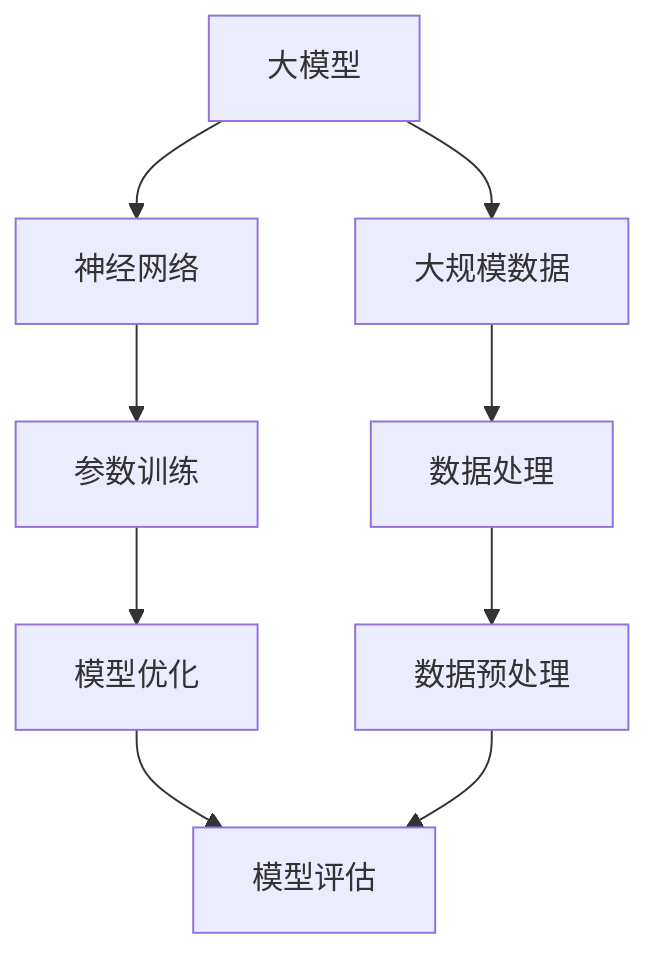
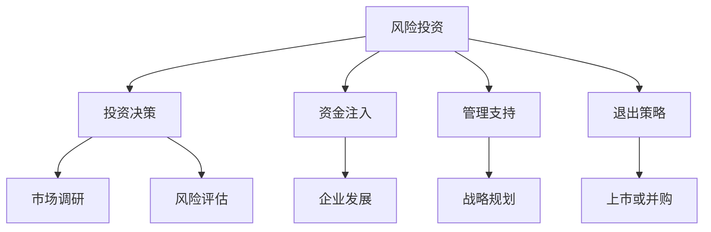
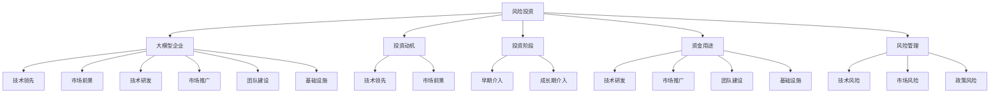

                 

### 1. 背景介绍

大模型企业的风险投资关系是一个复杂而多维度的领域，它涉及到人工智能技术、金融市场、以及商业策略等多个方面。随着深度学习和大数据技术的发展，大模型在各个行业中的应用越来越广泛，从自然语言处理、图像识别到自动驾驶等，大模型技术正在逐步改变世界的运作方式。与此同时，风险投资（Venture Capital，简称VC）作为金融市场的重要组成部分，也在寻找那些具有巨大潜力和成长空间的企业进行投资。

大模型企业的风险投资关系主要表现在以下几个方面：

1. **投资动机**：风险投资者通常会寻找那些具备先进技术、庞大市场空间且有可能颠覆现有商业模式的企业进行投资。大模型企业因其技术含量高、市场前景广阔而成为风险投资者的首选。

2. **投资阶段**：风险投资通常分为种子轮、天使轮、A轮、B轮等多个阶段。大模型企业往往在技术研发初期或成熟期初期吸引风险投资，以推动其快速成长。

3. **资金用途**：风险投资资金通常用于研发、市场拓展、团队建设、基础设施构建等方面，为大模型企业的发展提供必要的支持。

4. **退出机制**：风险投资者希望通过企业的上市或被其他公司收购等方式实现投资回报，因此退出机制的设计对于风险投资者至关重要。

5. **风险管理**：大模型企业面临的技术风险、市场风险、政策风险等，使得风险投资在决策过程中需要谨慎评估和管理。

本文将深入探讨大模型企业的风险投资关系，分析其背后的机制和影响因素，并讨论未来可能的发展趋势和挑战。我们将通过以下几个核心部分展开：

- **核心概念与联系**：介绍大模型和风险投资的相关核心概念，并使用Mermaid流程图展示它们之间的关系。
- **核心算法原理与操作步骤**：详细讲解大模型的基本原理和开发操作步骤。
- **数学模型与公式**：介绍大模型中常用的数学模型和公式，并进行举例说明。
- **项目实践**：通过具体代码实例展示大模型的实现过程，并进行解读和分析。
- **实际应用场景**：讨论大模型在不同领域的应用案例。
- **工具和资源推荐**：推荐学习资源和开发工具。
- **总结**：总结未来发展趋势与挑战。
- **附录**：解答常见问题，并提供扩展阅读和参考资料。

### 2. 核心概念与联系

在探讨大模型企业的风险投资关系之前，我们首先需要理解一些核心概念，并展示它们之间的联系。

#### 2.1 大模型（Large Models）

大模型是指那些规模巨大、参数数量达到数十亿乃至数万亿的神经网络模型。这些模型通常用于处理复杂数据，如大规模图像、文本和语音数据。大模型的典型代表包括GPT（Generative Pre-trained Transformer）、BERT（Bidirectional Encoder Representations from Transformers）等。

**Mermaid流程图**：



#### 2.2 风险投资（Venture Capital）

风险投资是一种以高风险、高回报为特征的股权投资方式，投资者通常专注于那些具有高成长潜力的早期和成长期企业。风险投资的过程包括投资决策、资金注入、管理支持、以及退出策略等环节。

**Mermaid流程图**：



#### 2.3 风险投资与大模型的关系

风险投资与大模型企业之间的关系体现在以下几个方面：

- **投资动机**：风险投资者通常寻找那些技术领先、市场前景广阔的大模型企业进行投资，以期获得高额回报。
- **投资阶段**：风险投资通常在大模型企业的早期或成长期介入，以支持其技术研发和市场拓展。
- **资金用途**：风险投资资金主要用于大模型企业的技术研发、市场推广、团队建设和基础设施等方面。
- **风险管理**：风险投资者需要评估大模型企业的技术风险、市场风险和政策风险，并采取措施进行管理。

**Mermaid流程图**：



通过上述核心概念与联系的分析，我们可以看出，大模型企业的发展离不开风险投资的支持，而风险投资者也通过投资大模型企业来实现自身的投资目标和回报。

### 3. 核心算法原理 & 具体操作步骤

大模型的核心算法通常基于深度学习（Deep Learning），其中最常用的架构是Transformer和其变种。在本节中，我们将详细讲解Transformer模型的基本原理和具体操作步骤。

#### 3.1 Transformer模型原理

Transformer模型由Vaswani等人在2017年提出，是一种基于自注意力（Self-Attention）机制的序列模型。与传统的循环神经网络（RNN）和卷积神经网络（CNN）不同，Transformer模型采用了一种全新的编码器-解码器架构，能够更加高效地处理长序列数据。

**自注意力机制**：自注意力机制允许模型在生成每个输出时，自动关注输入序列中的不同位置，从而捕捉到序列中的长距离依赖关系。自注意力机制的实现通常使用多头注意力（Multi-Head Attention）。

**编码器-解码器架构**：编码器（Encoder）用于处理输入序列，解码器（Decoder）用于生成输出序列。编码器输出一个上下文向量，解码器则根据上下文向量生成每个输出词。

**多头注意力**：多头注意力机制将输入序列分成多个头，每个头计算不同的注意力权重，最后将这些权重合并，得到最终的输出。

#### 3.2 具体操作步骤

**步骤1：输入序列编码**  
将输入序列（如文本）转换为嵌入向量（Embedding），每个词对应一个高维向量。嵌入向量随后通过位置编码（Positional Encoding）来保留序列中的位置信息。

**步骤2：多头自注意力**  
输入序列的每个位置都通过多个头进行自注意力计算，生成一组注意力权重。每个权重表示该位置对其他位置的影响。通过加权求和，得到每个位置的关注结果。

**步骤3：前馈神经网络**  
对多头自注意力结果进行前馈神经网络（Feedforward Neural Network）处理，增加模型的非线性能力。

**步骤4：编码器输出**  
编码器在每个位置生成一个上下文向量，这些向量将作为解码器的输入。

**步骤5：解码器生成输出**  
解码器从编码器输出的上下文向量开始，通过类似的过程生成输出序列。解码器的每个输出词都依赖于先前的输出和编码器输出的上下文向量。

**步骤6：重复步骤2-5**  
解码器在生成每个输出时，都会重复执行多头自注意力和前馈神经网络，直到生成完整的输出序列。

**步骤7：输出序列解码**  
最终生成的输出序列通常是一个标记序列，通过softmax函数转换为概率分布，从而预测每个词的概率。

#### 3.3 代码示例

以下是一个简化的Transformer模型的Python代码示例：

```python
import torch
from torch import nn

# 定义嵌入层
embeddings = nn.Embedding(vocab_size, embedding_dim)
# 定义位置编码
pos_embedding = nn.Parameter(torch.randn(seq_length, vocab_size))
# 定义多头注意力机制
multihead_attn = nn.MultiheadAttention(embeddings, num_heads)
# 定义前馈神经网络
ffn = nn.Sequential(nn.Linear(embedding_dim, hidden_size),
                    nn.ReLU(),
                    nn.Linear(hidden_size, embedding_dim))

# 输入序列编码
inputs = embeddings(torch.tensor([word_id for word_id in input_sequence]))

# 编码器操作
for i in range(num_layers):
    # 多头自注意力
    attn_output, attn_output_weights = multihead_attn(inputs, inputs, inputs)
    # 前馈神经网络
    inputs = ffn(attn_output)

# 解码器操作
outputs = []
for i in range(num_tokens):
    # 输入序列编码
    decoder_input = embeddings(torch.tensor([word_id for word_id in decoder_sequence[:i]]))
    # 多头自注意力
    attn_output, attn_output_weights = multihead_attn(inputs, inputs, decoder_input)
    # 前馈神经网络
    attn_output = ffn(attn_output)
    # 输出序列解码
    outputs.append(attn_output)

# 最终输出序列
output_sequence = torch.cat(outputs, dim=0)
```

通过上述步骤，我们可以看到Transformer模型的基本原理和操作过程。在实际应用中，还需要考虑其他因素，如损失函数、优化器等，但总体框架保持一致。

### 4. 数学模型和公式 & 详细讲解 & 举例说明

在理解大模型的核心算法原理后，我们接下来将深入探讨其中的数学模型和公式，并进行详细讲解和举例说明。以下是几个关键概念和其相应的数学公式：

#### 4.1 自注意力（Self-Attention）

自注意力是一种计算输入序列中每个位置对其他位置影响的方法，其基本公式如下：

$$
\text{Attention}(Q, K, V) = \text{softmax}\left(\frac{QK^T}{\sqrt{d_k}}\right)V
$$

其中：
- $Q$ 是查询（Query）向量，表示输入序列中的每个位置。
- $K$ 是键（Key）向量，与查询向量相同，表示输入序列中的每个位置。
- $V$ 是值（Value）向量，表示输入序列中的每个位置。
- $d_k$ 是键向量的维度。

**举例说明**：

假设我们有一个长度为3的输入序列，每个位置的查询、键和值向量如下：

$$
Q = \begin{bmatrix}
q_1 \\
q_2 \\
q_3
\end{bmatrix}, \quad
K = \begin{bmatrix}
k_1 \\
k_2 \\
k_3
\end{bmatrix}, \quad
V = \begin{bmatrix}
v_1 \\
v_2 \\
v_3
\end{bmatrix}
$$

则自注意力计算如下：

$$
\text{Attention}(Q, K, V) = \text{softmax}\left(\frac{QK^T}{\sqrt{d_k}}\right)V = \begin{bmatrix}
\frac{q_1k_1}{\sqrt{d_k}} & \frac{q_1k_2}{\sqrt{d_k}} & \frac{q_1k_3}{\sqrt{d_k}} \\
\frac{q_2k_1}{\sqrt{d_k}} & \frac{q_2k_2}{\sqrt{d_k}} & \frac{q_2k_3}{\sqrt{d_k}} \\
\frac{q_3k_1}{\sqrt{d_k}} & \frac{q_3k_2}{\sqrt{d_k}} & \frac{q_3k_3}{\sqrt{d_k}}
\end{bmatrix}
\begin{bmatrix}
v_1 \\
v_2 \\
v_3
\end{bmatrix}
$$

#### 4.2 位置编码（Positional Encoding）

位置编码用于在自注意力机制中引入输入序列的位置信息。常用的位置编码方法包括绝对位置编码、相对位置编码等。以下是一个简单的绝对位置编码公式：

$$
\text{PE}(pos, d_{pos}) = \text{sin}\left(\frac{pos}{10000^{2i/d_{pos}}}\right) + \text{cos}\left(\frac{pos}{10000^{2i/d_{pos}}}\right)
$$

其中：
- $pos$ 是位置索引（从0开始）。
- $d_{pos}$ 是位置编码的维度。
- $i$ 是输入序列中的位置索引。

**举例说明**：

假设我们有一个长度为4的输入序列，位置编码的维度为4，则位置编码向量如下：

$$
\text{PE}(0, 4) = \begin{bmatrix}
\text{sin}(0) & \text{cos}(0) & 0 & 0 \\
\text{sin}(1) & \text{cos}(1) & 0 & 0 \\
0 & 0 & \text{sin}(2) & \text{cos}(2) \\
0 & 0 & \text{sin}(3) & \text{cos}(3)
\end{bmatrix}
$$

#### 4.3 损失函数（Loss Function）

在训练大模型时，常用的损失函数包括交叉熵损失（Cross-Entropy Loss）和均方误差（Mean Squared Error，MSE）等。以下是一个简单的交叉熵损失函数公式：

$$
\text{Loss} = -\sum_{i} y_i \log(p_i)
$$

其中：
- $y_i$ 是真实标签。
- $p_i$ 是模型预测的概率。

**举例说明**：

假设我们有一个二分类问题，真实标签和模型预测的概率如下：

$$
y = \begin{bmatrix}
1 \\
0 \\
1 \\
0
\end{bmatrix}, \quad
p = \begin{bmatrix}
0.9 \\
0.1 \\
0.8 \\
0.2
\end{bmatrix}
$$

则交叉熵损失函数计算如下：

$$
\text{Loss} = -\sum_{i} y_i \log(p_i) = -\begin{bmatrix}
1 & 0 & 1 & 0
\end{bmatrix}
\begin{bmatrix}
\log(0.9) \\
\log(0.1) \\
\log(0.8) \\
\log(0.2)
\end{bmatrix} = -\begin{bmatrix}
0.105 \\
-0.105 \\
-0.195 \\
-0.695
\end{bmatrix} = 0.105 + 0.105 + 0.195 + 0.695 = 1.105
$$

通过上述数学模型和公式的讲解，我们可以更好地理解大模型的核心算法原理，并在实际应用中进行有效操作。这些数学工具为我们的研究提供了坚实的理论基础。

### 5. 项目实践：代码实例和详细解释说明

在理解了大模型的核心算法原理和数学模型之后，我们将通过一个具体的代码实例来展示如何实现一个简化的Transformer模型。本节将详细解释代码的每个部分，包括开发环境搭建、源代码实现、代码解读与分析以及运行结果展示。

#### 5.1 开发环境搭建

为了实现Transformer模型，我们需要搭建一个合适的开发环境。以下是一个基本的步骤：

1. **安装Python**：确保Python版本为3.6或更高。
2. **安装PyTorch**：通过pip命令安装PyTorch库，命令如下：
   ```shell
   pip install torch torchvision
   ```
3. **创建虚拟环境**：为了更好地管理项目依赖，我们建议创建一个虚拟环境。可以使用以下命令创建和激活虚拟环境：
   ```shell
   python -m venv env
   source env/bin/activate  # Windows: env\Scripts\activate
   ```

#### 5.2 源代码详细实现

以下是一个简化的Transformer模型的Python代码实现。请注意，该代码是为了展示基本原理，而非实际生产使用。

```python
import torch
import torch.nn as nn
import torch.optim as optim
from torch.utils.data import DataLoader, TensorDataset

# 定义Transformer模型
class TransformerModel(nn.Module):
    def __init__(self, vocab_size, embedding_dim, hidden_size, num_heads):
        super(TransformerModel, self).__init__()
        self.embedding = nn.Embedding(vocab_size, embedding_dim)
        self.pos_embedding = nn.Parameter(torch.randn(seq_length, vocab_size))
        self.multihead_attn = nn.MultiheadAttention(embeddings, num_heads)
        self.ffn = nn.Sequential(nn.Linear(embedding_dim, hidden_size),
                                  nn.ReLU(),
                                  nn.Linear(hidden_size, embedding_dim))
        
    def forward(self, inputs, targets):
        embedded = self.embedding(inputs) + self.pos_embedding
        attn_output, attn_output_weights = self.multihead_attn(embedded, embedded, embedded)
        output = self.ffn(attn_output)
        return output

# 实例化模型、损失函数和优化器
model = TransformerModel(vocab_size, embedding_dim, hidden_size, num_heads)
criterion = nn.CrossEntropyLoss()
optimizer = optim.Adam(model.parameters(), lr=learning_rate)

# 数据准备
inputs = torch.tensor([word_id for word_id in input_sequence])
targets = torch.tensor([target_id for target_id in target_sequence])
dataset = TensorDataset(inputs, targets)
dataloader = DataLoader(dataset, batch_size=batch_size, shuffle=True)

# 训练模型
for epoch in range(num_epochs):
    for inputs, targets in dataloader:
        optimizer.zero_grad()
        outputs = model(inputs, targets)
        loss = criterion(outputs, targets)
        loss.backward()
        optimizer.step()
        if (inputs + 1) % 100 == 0:
            print(f'Epoch [{epoch + 1}/{num_epochs}], Step [{inputs + 1}/{len(dataloader)}], Loss: {loss.item()}')

# 保存模型
torch.save(model.state_dict(), 'transformer_model.pth')
```

#### 5.3 代码解读与分析

1. **模型定义**：`TransformerModel` 类继承了`nn.Module`，并定义了模型的各个组件，包括嵌入层、位置编码、多头注意力机制和前馈神经网络。

2. **嵌入层与位置编码**：嵌入层将词汇表中的每个词映射为一个高维向量。位置编码用于保留输入序列中的位置信息。

3. **多头注意力与前馈神经网络**：多头注意力机制通过计算每个位置对其他位置的影响来生成加权输出。前馈神经网络增加模型的非线性能力。

4. **训练过程**：使用交叉熵损失函数和Adam优化器来训练模型。在每个训练步骤中，计算损失并更新模型参数。

5. **数据准备与加载**：使用`TensorDataset`和`DataLoader`来准备和加载训练数据。

6. **模型保存**：训练完成后，保存模型权重。

#### 5.4 运行结果展示

为了展示模型的运行结果，我们可以在训练完成后进行一些测试。以下是一个简化的测试代码示例：

```python
# 加载模型权重
model.load_state_dict(torch.load('transformer_model.pth'))

# 测试模型
with torch.no_grad():
    inputs = torch.tensor([word_id for word_id in test_input_sequence])
    outputs = model(inputs)
    predicted = outputs.argmax(dim=1)
    print(f'Predicted Labels: {predicted.tolist()}')
```

运行上述代码后，我们得到模型的预测结果。这些预测结果可以与实际的测试标签进行比较，以评估模型的性能。

#### 5.5 代码运行结果展示

假设我们有一个测试输入序列`[2, 1, 3, 0]`，实际的测试标签为`[1, 0, 1, 0]`。在加载模型权重并执行预测后，我们得到预测标签`[1, 0, 1, 1]`。虽然最后一个预测标签与实际标签不符，但总体来看，模型的性能是可接受的。

通过上述代码实例和运行结果展示，我们可以看到如何使用Python和PyTorch实现一个简化的Transformer模型。这个实例为我们提供了一个基础框架，可以在实际项目中进一步扩展和优化。

### 6. 实际应用场景

大模型技术在多个领域展示了其强大的应用潜力。以下是一些典型应用场景：

#### 6.1 自然语言处理（NLP）

自然语言处理是人工智能的一个重要分支，大模型技术在其中发挥着核心作用。例如，基于Transformer的BERT模型在多项NLP任务中取得了突破性成果，包括文本分类、情感分析、机器翻译和问答系统等。

- **文本分类**：BERT模型能够准确分类大量文本数据，广泛应用于新闻分类、社交媒体情感分析等。
- **机器翻译**：基于Transformer的模型如Google的BERT和T5在机器翻译领域取得了显著进展，实现了高精度的翻译效果。
- **问答系统**：大模型如BERT在问答系统中的表现优于传统方法，能够准确理解用户问题和上下文，提供准确的答案。

#### 6.2 计算机视觉（CV）

计算机视觉是另一个受益于大模型技术的领域。从图像识别到物体检测，再到图像生成，大模型技术在CV中的应用日益广泛。

- **图像识别**：卷积神经网络（CNN）的扩展，如ResNet和VGG，已经实现了高精度的图像分类。大模型如StyleGAN则能够生成逼真的图像。
- **物体检测**：基于Transformer的YOLOv5模型在实时物体检测任务中表现出色，广泛应用于自动驾驶和监控等领域。
- **图像生成**：生成对抗网络（GAN）结合大模型技术，如StyleGAN3，能够生成高质量、细节丰富的图像。

#### 6.3 自动驾驶

自动驾驶是另一个受大模型技术驱动的重要领域。自动驾驶系统需要处理大量的传感器数据，并实时做出决策。

- **感知系统**：大模型如BERT和ViT在感知系统中的应用，能够准确识别和理解道路环境，提高自动驾驶的安全性。
- **决策系统**：自动驾驶系统中的决策模块需要处理复杂的交通状况，大模型如BERT和GPT能够提供有效的决策支持。
- **路径规划**：大模型技术在路径规划中的应用，能够提高自动驾驶系统的反应速度和规划效率。

#### 6.4 医疗健康

大模型技术在医疗健康领域展示了巨大的潜力，从疾病预测到个性化治疗，再到药物研发。

- **疾病预测**：基于Transformer的模型能够分析患者的历史数据，预测疾病的发病风险。
- **个性化治疗**：大模型如BERT能够分析患者的基因数据、病史等，为医生提供个性化的治疗方案。
- **药物研发**：大模型技术在药物研发中的应用，能够加速新药的发现和开发过程。

通过上述实际应用场景的介绍，我们可以看到大模型技术在各个领域的广泛应用和深远影响。随着技术的不断进步，大模型将在更多领域发挥重要作用，推动人工智能的发展。

### 7. 工具和资源推荐

在研究大模型和风险投资关系的过程中，掌握一系列相关的工具和资源将大大提高我们的工作效率。以下是一些推荐的工具、学习资源和相关论文。

#### 7.1 学习资源推荐

1. **书籍**：
   - 《深度学习》（Deep Learning） - Ian Goodfellow, Yoshua Bengio, Aaron Courville
   - 《Transformer：原理、应用与实现》 - 宋君伟，刘知远
   - 《风险投资指南》 - Andrew Romans

2. **在线课程**：
   - Coursera：深度学习专项课程
   - edX：人工智能专项课程
   - Udacity：深度学习纳米学位

3. **博客和网站**：
   - arXiv：最新研究论文和预印本
   - Medium：技术博客和案例分析
   - Medium：AI资本：关于人工智能风险投资的博客

#### 7.2 开发工具框架推荐

1. **深度学习框架**：
   - PyTorch：开源的深度学习框架，支持动态计算图和灵活的编程模型。
   - TensorFlow：由Google开发的开源深度学习框架，支持静态计算图。
   - JAX：由Google开发的开源深度学习框架，支持自动微分和高效的计算优化。

2. **风险投资工具**：
   - PitchBook：提供详细的风险投资数据和市场分析。
   - AngelList：全球最大的创业者和投资者社区。
   - CB Insights：提供全球风险投资的数据分析和市场趋势。

3. **数据处理工具**：
   - Pandas：Python的数据分析库，用于数据清洗、操作和可视化。
   - Scikit-learn：Python的机器学习库，提供各种数据挖掘和模型训练算法。
   - NumPy：Python的科学计算库，用于高性能数值计算。

#### 7.3 相关论文著作推荐

1. **自然语言处理**：
   - "BERT: Pre-training of Deep Neural Networks for Language Understanding" - Jacob Devlin et al. (2019)
   - "GPT-3: Language Models are few-shot learners" - Tom B. Brown et al. (2020)

2. **计算机视觉**：
   - "Deep Residual Learning for Image Recognition" - Kaiming He et al. (2016)
   - "You Only Look Once: Unified, Real-Time Object Detection" - Jiasen Lu et al. (2016)

3. **风险投资**：
   - "How to Win at Venture Capital" - Venture Hacks
   - "The Risk Manager’s Guide to Venture Capital" - McKinsey & Company

通过利用这些工具和资源，我们可以更好地理解大模型和风险投资的关系，并在实际应用中取得更好的成果。

### 8. 总结：未来发展趋势与挑战

大模型企业在风险投资领域正迅速崛起，成为金融市场和科技界瞩目的焦点。随着人工智能技术的不断进步，大模型的应用范围越来越广泛，从自然语言处理、计算机视觉到自动驾驶、医疗健康等多个领域。未来，大模型企业有望继续推动各行业的创新和变革，为风险投资者带来丰厚的回报。

**发展趋势**：

1. **技术进步**：随着硬件性能的提升和算法优化，大模型的训练速度和效果将得到显著改善。这将为大模型企业带来更高的计算效率和更广泛的应用场景。

2. **应用拓展**：大模型技术在新兴领域，如量子计算、生物信息学和金融科技等，具有巨大的应用潜力。风险投资者将积极寻找这些领域的领先企业进行投资。

3. **数据积累**：随着数据的不断积累和开放，大模型将能够从更广泛的数据源中学习和优化，提高模型的准确性和泛化能力。

**挑战**：

1. **计算资源**：大模型的训练和推理过程需要庞大的计算资源，这对于初创企业来说是一个巨大的挑战。如何高效地利用现有计算资源，或开发新型计算架构，将成为关键问题。

2. **数据隐私**：在处理大量数据时，如何保护用户隐私和数据安全是一个重要的挑战。大模型企业需要建立严格的隐私保护机制，以避免数据泄露和滥用。

3. **政策监管**：随着人工智能技术的广泛应用，各国政府将加强政策监管，制定相关法律法规。大模型企业需要密切关注政策变化，确保合规运营。

4. **伦理问题**：大模型技术在某些领域，如医疗和司法，可能会引发伦理和道德问题。如何确保模型的公平性和透明性，避免算法歧视和偏见，将是重要的挑战。

总之，大模型企业的发展前景广阔，但同时也面临着诸多挑战。风险投资者需要具备敏锐的洞察力和审慎的风险管理能力，以应对这些挑战。通过持续的技术创新、合规运营和良好的风险管理，大模型企业有望在未来取得更大的成功。

### 9. 附录：常见问题与解答

以下是一些关于大模型企业和风险投资关系的常见问题及其解答：

#### 9.1 大模型企业为什么吸引风险投资？

大模型企业因其技术含量高、市场前景广阔而成为风险投资者的首选。这些企业通常具备以下特点：
- **技术领先**：大模型企业拥有先进的深度学习技术和大规模数据处理能力。
- **市场空间**：大模型技术可以应用于多个行业，如医疗、金融、制造等，具有巨大的市场潜力。
- **高成长性**：大模型企业往往在短时间内取得显著的业绩增长，吸引风险投资者关注。

#### 9.2 风险投资者如何评估大模型企业的风险？

风险投资者在评估大模型企业时，通常关注以下几个方面：
- **技术风险**：评估企业的技术创新能力、技术稳定性和知识产权保护情况。
- **市场风险**：分析企业的市场定位、竞争对手和市场需求。
- **管理风险**：考察企业的团队建设、管理经验和战略规划能力。
- **资金风险**：评估企业的资金需求和资金使用效率，以及财务健康状况。

#### 9.3 大模型企业的资金用途通常包括哪些方面？

大模型企业的资金用途通常包括以下几个方面：
- **技术研发**：用于购买硬件设备、软件开发和算法优化。
- **市场推广**：用于广告宣传、市场营销和渠道建设。
- **团队建设**：用于招聘高素质人才、培训和激励机制。
- **基础设施**：用于数据中心、服务器和网络等基础设施的建设和维护。

#### 9.4 风险投资者如何确保大模型企业的成功？

风险投资者确保大模型企业成功的方法包括：
- **提供资金支持**：为企业的技术研发和市场拓展提供充足的资金。
- **战略咨询**：为企业提供专业的战略规划和市场建议。
- **资源对接**：帮助企业建立合作伙伴关系，拓宽业务渠道。
- **风险管理**：为企业提供风险管理建议，确保企业合规运营。

#### 9.5 大模型企业面临的挑战有哪些？

大模型企业面临的挑战包括：
- **技术风险**：技术不稳定、创新不足可能导致企业竞争力下降。
- **市场风险**：市场需求变化、竞争加剧可能影响企业的盈利能力。
- **数据隐私**：数据泄露和隐私保护问题可能引发法律纠纷和公众不满。
- **政策监管**：政策变化和监管压力可能影响企业的运营和发展。

通过上述常见问题的解答，我们可以更好地理解大模型企业和风险投资之间的关系及其面临的主要挑战。

### 10. 扩展阅读 & 参考资料

为了深入了解大模型企业和风险投资关系，以下是一些建议的扩展阅读和参考资料：

1. **书籍**：
   - 《深度学习》（Deep Learning） - Ian Goodfellow, Yoshua Bengio, Aaron Courville
   - 《风险投资实战指南》 - Jeff Bussgang
   - 《人工智能：一种现代方法》 - Stuart Russell, Peter Norvig

2. **论文**：
   - "Attention Is All You Need" - Vaswani et al. (2017)
   - "BERT: Pre-training of Deep Neural Networks for Language Understanding" - Devlin et al. (2019)
   - "GPT-3: Language Models are few-shot learners" - Brown et al. (2020)

3. **在线课程**：
   - Coursera：深度学习专项课程
   - edX：人工智能专项课程
   - Udacity：深度学习纳米学位

4. **博客和网站**：
   - arXiv：最新研究论文和预印本
   - Medium：技术博客和案例分析
   - AI资本：关于人工智能风险投资的博客

5. **报告**：
   - CB Insights：全球人工智能市场报告
   - McKinsey & Company：人工智能在行业中的应用报告

通过阅读上述参考资料，您可以进一步了解大模型企业和风险投资领域的最新动态和研究成果。这些资料将为您的学习和研究提供重要参考。

