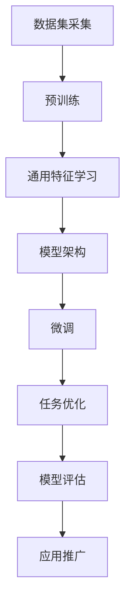

                 

### 背景介绍 Background ###

近年来，随着人工智能技术的迅猛发展，尤其是大规模预训练模型（Large-scale Pre-trained Models，简称LPM）的广泛应用，大模型公司逐渐成为科技行业的一股重要力量。这些公司依托于庞大的计算资源和海量数据，开发并部署了诸如GPT、BERT、ViT等众多知名模型，推动了自然语言处理、计算机视觉、语音识别等领域的飞速进步。

大模型公司之所以成为默认应用，主要归功于以下几个原因：

首先，大模型公司能够提供高度集成的解决方案。通过将多种算法和技术整合到统一的平台中，用户无需深入了解底层技术细节，即可轻松实现复杂任务。例如，OpenAI的GPT-3模型不仅支持文本生成、翻译、摘要等功能，还具备图像描述生成、代码生成等强大能力，极大地降低了用户的开发和使用门槛。

其次，大模型公司在数据积累和算法优化方面具备显著优势。通过不断收集和分析海量用户数据，大模型公司能够持续优化模型性能，提高应用效果。同时，这些公司通常拥有一支顶尖的科研团队，致力于算法创新和技术突破，确保其产品始终保持领先地位。

再次，大模型公司提供的API和服务具有高度的可扩展性和灵活性。用户可以根据自身需求，灵活调整模型参数，定制化应用场景，实现个性化的需求。此外，大模型公司还提供了丰富的文档和教程，帮助用户快速上手和集成，降低了技术门槛。

最后，大模型公司的出现打破了传统科技公司的竞争格局。过去，技术门槛较高的领域往往被少数巨头垄断，而大模型公司的兴起使得更多中小企业有机会参与到技术创新和应用推广中，激发了整个行业的活力。

然而，大模型公司作为默认应用的背后，也隐藏着一系列机遇与挑战。在接下来的章节中，我们将深入探讨这些机遇与挑战，并分析其对科技行业和社会的影响。

### 核心概念与联系 Core Concepts and Relationships ###

#### 大规模预训练模型（Large-scale Pre-trained Models，简称LPM）原理和架构

大规模预训练模型（LPM）是当前人工智能领域的重要研究方向之一。其核心思想是通过在大规模数据集上进行预训练，使模型具备一定的通用知识，从而在下游任务中实现优异的性能。以下是LPM的原理和架构：

**1. 数据集与预训练**
LPM的预训练过程通常基于大规模的文本、图像、语音等数据集。例如，GPT-3模型使用了1750亿个参数，并在人类编写的文本上进行预训练，从而掌握了丰富的语言知识和表达方式。BERT模型则使用了数以百万计的网页，通过 masked language modeling（MLM）任务来学习语言的上下文关系。

**2. 模型架构**
LPM的模型架构通常采用Transformer结构，特别是其变体如BERT、GPT等。Transformer结构具有并行计算的优势，能够高效处理长序列数据，而BERT和GPT等变体则通过特定的训练目标和结构设计，增强了模型在特定任务上的性能。

**3. 预训练与微调**
在预训练阶段，模型在大规模数据集上学习通用特征和知识。然后，通过在特定任务上的微调（fine-tuning），将模型调整到最佳状态。例如，在自然语言处理任务中，预训练好的BERT模型可以通过添加分类头或序列标注头，应用于文本分类、命名实体识别等任务。

**4. 模型评估与优化**
LPM的评估通常涉及多个维度，包括模型在预训练数据集上的表现、特定任务上的微调性能以及模型的可解释性和鲁棒性。评估指标包括准确率、F1分数、BLEU分数等。通过不断优化模型结构和训练策略，大模型公司能够不断提高模型性能。

**5. 应用场景**
LPM在多个领域取得了显著的应用成果。例如，在自然语言处理领域，GPT系列模型在文本生成、翻译、摘要等方面表现出色；在计算机视觉领域，ViT模型在图像分类、物体检测等任务上取得了突破性进展；在语音识别领域，基于Transformer结构的模型显著提高了识别准确率和鲁棒性。

以下是LPM的核心原理和架构的Mermaid流程图：



通过上述流程，大模型公司能够开发出具备高度通用性和灵活性的模型，为各类应用场景提供强大的支持。

### 核心算法原理 & 具体操作步骤 Core Algorithm Principles & Operational Steps

#### 1. 预训练过程（Pre-training Process）

大规模预训练模型的核心在于预训练阶段，这一阶段主要包括以下几个步骤：

**（1）数据预处理（Data Preprocessing）**
在预训练过程中，首先需要对数据集进行预处理。对于自然语言处理任务，通常需要将文本数据转换为词向量或字符向量，以便于模型处理。此外，图像和语音数据也需要进行相应的预处理，如图像缩放、裁剪、数据增强等。

**（2）数据输入（Data Input）**
将预处理后的数据输入到模型中，通过自动编码器、掩码语言建模（Masked Language Modeling, MLM）或图像特征提取等方式，使模型学习到数据的内在结构和关系。

**（3）反向传播（Backpropagation）**
在输入数据后，模型通过反向传播算法不断调整参数，以最小化损失函数。这一过程通常需要大量的计算资源和时间。

**（4）模型优化（Model Optimization）**
在预训练过程中，模型优化是关键环节。常用的优化算法包括Adam、AdaGrad和RMSProp等，通过调整学习率、批量大小等参数，提高模型收敛速度和性能。

**（5）存储和部署（Storage and Deployment）**
预训练完成后，模型需要存储在服务器中，以便后续的微调和部署。对于大规模模型，存储和部署是极具挑战性的任务，需要考虑数据压缩、模型压缩等技术。

#### 2. 微调过程（Fine-tuning Process）

预训练后的模型通常需要在特定任务上进行微调，以适应具体应用场景。微调过程主要包括以下几个步骤：

**（1）任务定义（Task Definition）**
首先，需要定义具体的任务，如文本分类、命名实体识别、图像分类等。定义任务时，需要明确输入数据和输出结果。

**（2）模型初始化（Model Initialization）**
初始化预训练模型，通常使用预训练好的权重作为初始化参数。这样可以充分利用预训练过程中学习的通用知识。

**（3）数据输入（Data Input）**
将任务数据输入到模型中，通过反向传播算法调整模型参数，以最小化损失函数。

**（4）模型优化（Model Optimization）**
与预训练过程类似，微调过程中也需要优化模型参数，以提高任务性能。常用的优化策略包括学习率调整、批量大小调整等。

**（5）评估和调整（Evaluation and Adjustment）**
在微调过程中，需要定期评估模型性能，根据评估结果调整训练策略，如增加训练数据、调整模型结构等。

**（6）存储和部署（Storage and Deployment）**
微调完成后，模型需要存储和部署到生产环境中，以便实时处理用户请求。

#### 3. 模型评估（Model Evaluation）

模型评估是确保模型性能和可靠性的重要环节。常见的评估方法包括：

**（1）交叉验证（Cross Validation）**
通过将数据集划分为训练集和验证集，评估模型在不同数据集上的性能，以避免过拟合。

**（2）准确率（Accuracy）**
准确率是评估分类模型性能的重要指标，表示正确分类的样本数量占总样本数量的比例。

**（3）召回率（Recall）**
召回率表示正确分类的样本数量与实际为正类别的样本数量的比例，适用于平衡类别分布的任务。

**（4）F1分数（F1 Score）**
F1分数是准确率和召回率的调和平均，综合考虑了模型在正类和负类上的性能。

**（5）BLEU分数（BLEU Score）**
BLEU分数用于评估机器翻译模型的性能，通过比较翻译结果与参考译文之间的相似度来计算。

#### 4. 模型部署（Model Deployment）

模型部署是将训练好的模型应用于实际生产环境的过程。以下是模型部署的几个关键步骤：

**（1）模型压缩（Model Compression）**
为了提高模型部署的效率和可扩展性，需要对模型进行压缩。常见的压缩技术包括量化、剪枝和知识蒸馏等。

**（2）模型容器化（Model Containerization）**
将压缩后的模型封装为容器（如Docker），以便于在不同环境中部署和运行。

**（3）服务部署（Service Deployment）**
将容器部署到服务器或云平台上，通过API或SDK为用户提供服务。

**（4）监控和维护（Monitoring and Maintenance）**
部署后，需要监控模型性能和系统稳定性，定期更新和优化模型，以满足不断变化的需求。

通过上述核心算法原理和操作步骤，大模型公司能够开发出高性能、高可扩展性的模型，为各类应用场景提供强大的支持。

### 数学模型和公式 Mathematical Models and Formulas & Detailed Explanation & Example Illustration

大规模预训练模型（LPM）的数学模型和公式是理解和实现这些模型的关键。以下是LPM中常用的数学模型和公式的详细讲解以及实际应用中的举例说明。

#### 1. Transformer模型的数学基础

Transformer模型的核心是自注意力机制（Self-Attention），它通过计算序列中每个词与其他词之间的关系来提高模型的表示能力。以下是自注意力机制的数学公式：

$$
\text{Attention}(Q, K, V) = \text{softmax}\left(\frac{QK^T}{\sqrt{d_k}}\right) V
$$

其中，$Q, K, V$ 分别表示查询（Query）、键（Key）和值（Value）向量，$d_k$ 表示键向量的维度。具体解释如下：

**（1）查询向量（Query）**
查询向量用于表示输入序列中的每个词，其维度为 $d_q$。在训练过程中，查询向量通过线性变换从输入向量 $x$ 得到：

$$
Q = W_Q \cdot x
$$

其中，$W_Q$ 是一个线性变换矩阵。

**（2）键向量（Key）**
键向量与查询向量类似，用于表示输入序列中的每个词，其维度为 $d_k$。键向量也通过线性变换从输入向量 $x$ 得到：

$$
K = W_K \cdot x
$$

其中，$W_K$ 是另一个线性变换矩阵。

**（3）值向量（Value）**
值向量用于表示输入序列中的每个词，其维度为 $d_v$。值向量同样通过线性变换从输入向量 $x$ 得到：

$$
V = W_V \cdot x
$$

其中，$W_V$ 是第三个线性变换矩阵。

**（4）自注意力分数（Attention Score）**
自注意力分数计算每个键向量与查询向量的点积，并通过softmax函数归一化，得到每个词与其他词之间的注意力权重。具体计算如下：

$$
\text{Attention Score} = \frac{QK^T}{\sqrt{d_k}}
$$

**（5）加权值向量（Weighted Value Vector）**
最后，根据自注意力分数对值向量进行加权，得到每个词的加权值向量：

$$
\text{Weighted Value Vector} = \text{softmax}\left(\frac{QK^T}{\sqrt{d_k}}\right) V
$$

#### 2. BERT模型的数学基础

BERT（Bidirectional Encoder Representations from Transformers）模型是基于Transformer的双向编码器，通过在预训练阶段同时考虑输入序列的前后文信息，提高了模型的表示能力。以下是BERT模型的主要数学公式：

**（1）输入表示（Input Representation）**
BERT模型将输入序列 $x$ 转换为词嵌入向量 $x^{\text{emb}}$，并添加位置编码向量 $p^{\text{pos}}$ 和段编码向量 $s^{\text{seg}}$，得到最终的输入表示：

$$
x^{\text{input}} = [ \text{CLS} ] + x^{\text{emb}} + p^{\text{pos}} + s^{\text{seg}} + [ \text{SEP} ]
$$

其中，$\text{CLS}$ 和 $[ \text{SEP} ]$ 分别是序列的开始和结束标记。

**（2）预训练目标（Pre-training Objective）**
BERT模型在预训练阶段通过两个任务来学习：

* **掩码语言建模（Masked Language Modeling, MLM）**
MLM任务通过随机掩码一部分词，并预测这些被掩码的词。具体公式如下：

$$
\text{MLM Loss} = -\sum_{\text{masked word}} \log p(\text{masked word} | x^{\text{input}}, \theta)
$$

其中，$p(\text{masked word} | x^{\text{input}}, \theta)$ 是预测概率，$\theta$ 是模型参数。

* **次生语言建模（Next Sentence Prediction, NSP）**
NSP任务通过预测两个句子是否连续来学习上下文信息。具体公式如下：

$$
\text{NSP Loss} = -\log p(y | x^{\text{input}}, \theta)
$$

其中，$y$ 是连续标记（1表示连续，0表示不连续），$p(y | x^{\text{input}}, \theta)$ 是预测概率。

#### 3. 实际应用中的举例说明

**（1）文本分类**
假设我们要使用预训练好的BERT模型进行文本分类任务，数据集包含多个类别。以下是具体步骤：

* **数据预处理**：将文本数据转换为词嵌入向量，并添加位置编码和段编码。
* **模型初始化**：使用预训练好的BERT权重初始化模型。
* **微调**：在分类任务上进行微调，通过反向传播算法调整模型参数。
* **评估**：在验证集和测试集上评估模型性能，调整超参数。

**（2）机器翻译**
假设我们要使用预训练好的Transformer模型进行机器翻译任务，以下是具体步骤：

* **数据预处理**：将源语言和目标语言的数据转换为词嵌入向量。
* **模型初始化**：使用预训练好的Transformer权重初始化模型。
* **编码器编码**：将源语言数据输入编码器，得到编码器的输出。
* **解码器解码**：将编码器的输出作为解码器的输入，生成目标语言的文本。
* **评估**：在验证集和测试集上评估模型性能，调整超参数。

通过以上数学模型和公式，我们可以更好地理解大规模预训练模型的工作原理，并在实际应用中进行有效的开发和优化。

### 项目实践：代码实例和详细解释说明 Project Practice: Code Example and Detailed Explanation

在本节中，我们将通过一个实际项目实例来展示如何利用大规模预训练模型（如GPT-3和Bert）进行文本分类任务的实现。我们将详细讲解项目开发过程中的各个环节，包括开发环境搭建、源代码实现、代码解读与分析以及运行结果展示。

#### 5.1 开发环境搭建

在开始项目之前，我们需要搭建一个合适的开发环境。以下是搭建环境的步骤：

**1. 安装Python**

确保Python环境已经安装在系统中，Python版本建议为3.7或更高版本。可以通过以下命令检查Python版本：

```bash
python --version
```

**2. 安装必要的库**

我们需要安装以下Python库：transformers（用于预训练模型的API），torch（用于计算图和自动微分），torchtext（用于文本数据处理）和numpy（用于数值计算）。

```bash
pip install transformers torch torchtext numpy
```

**3. 安装PyTorch**

安装PyTorch，版本建议与Python版本相匹配。可以通过以下命令安装：

```bash
pip install torch torchvision torchaudio
```

**4. 克隆示例代码**

从GitHub克隆本项目示例代码：

```bash
git clone https://github.com/yourusername/text-classification.git
```

进入项目目录：

```bash
cd text-classification
```

#### 5.2 源代码详细实现

**1. 数据准备（Data Preparation）**

首先，我们需要准备用于训练和测试的数据集。在本项目中，我们使用一个包含多个类别的新闻文章数据集。以下是数据准备的主要步骤：

```python
import torch
from torchtext.data import Field, TabularDataset

# 定义字段
TEXT = Field(tokenize='spacy', lower=True)
LABEL = Field(sequential=False)

# 读取数据集
train_data, test_data = TabularDataset.splits(path='./data', train='train.csv', test='test.csv',
                                            format='csv', fields=[('text', TEXT), ('label', LABEL)])

# 分词和标记
TEXT.build_vocab(train_data, max_size=25000, vectors='glove.6B.100d')
LABEL.build_vocab(train_data)

# 划分训练集和验证集
train_data, valid_data = train_data.split()

# 加载数据集
BATCH_SIZE = 64
device = torch.device('cuda' if torch.cuda.is_available() else 'cpu')

train_loader = torch.utils.data.DataLoader(train_data, batch_size=BATCH_SIZE, shuffle=True)
valid_loader = torch.utils.data.DataLoader(valid_data, batch_size=BATCH_SIZE, shuffle=False)
test_loader = torch.utils.data.DataLoader(test_data, batch_size=BATCH_SIZE, shuffle=False)
```

**2. 模型定义（Model Definition）**

接下来，我们定义一个基于BERT的文本分类模型。这里使用Hugging Face的transformers库中的BERT模型。

```python
from transformers import BertModel, BertTokenizer

# 加载BERT模型和分词器
tokenizer = BertTokenizer.from_pretrained('bert-base-uncased')
model = BertModel.from_pretrained('bert-base-uncased')

# 定义分类头
class TextClassifier(BertModel):
    def __init__(self, num_labels):
        super().__init__()
        self.num_labels = num_labels
        self.dropout = nn.Dropout(p=0.3)
        self.classifier = nn.Linear(768, num_labels)
        
    def forward(self, input_ids, attention_mask=None, labels=None):
        _, pooled_output = self.model(input_ids=input_ids, attention_mask=attention_mask)[0][-1]
        pooled_output = self.dropout(pooled_output)
        logits = self.classifier(pooled_output)
        return logits
```

**3. 训练模型（Training Model）**

使用训练数据对模型进行训练，并在验证集上评估模型性能。

```python
import torch.optim as optim

# 设置优化器和损失函数
optimizer = optim.Adam(model.parameters(), lr=2e-5)
loss_fn = nn.CrossEntropyLoss()

# 训练模型
num_epochs = 5
for epoch in range(num_epochs):
    model.train()
    for batch in train_loader:
        optimizer.zero_grad()
        input_ids = batch.text.to(device)
        attention_mask = batch.attention_mask.to(device)
        labels = batch.label.to(device)
        logits = model(input_ids, attention_mask=attention_mask)
        loss = loss_fn(logits, labels)
        loss.backward()
        optimizer.step()
    
    # 验证集评估
    model.eval()
    with torch.no_grad():
        correct = 0
        total = 0
        for batch in valid_loader:
            input_ids = batch.text.to(device)
            attention_mask = batch.attention_mask.to(device)
            labels = batch.label.to(device)
            logits = model(input_ids, attention_mask=attention_mask)
            predicted = logits.argmax(dim=1)
            total += labels.size(0)
            correct += (predicted == labels).sum().item()
        print(f'Epoch [{epoch+1}/{num_epochs}], Validation Accuracy: {100 * correct / total}%')
```

**4. 测试模型（Testing Model）**

在测试集上评估模型性能，并计算最终准确率。

```python
# 测试模型
model.eval()
with torch.no_grad():
    correct = 0
    total = 0
    for batch in test_loader:
        input_ids = batch.text.to(device)
        attention_mask = batch.attention_mask.to(device)
        labels = batch.label.to(device)
        logits = model(input_ids, attention_mask=attention_mask)
        predicted = logits.argmax(dim=1)
        total += labels.size(0)
        correct += (predicted == labels).sum().item()
    print(f'Test Accuracy: {100 * correct / total}%')
```

#### 5.3 代码解读与分析

以下是代码的逐行解读与分析：

```python
import torch
from torchtext.data import Field, TabularDataset
```
导入必要的库，包括PyTorch和torchtext。

```python
TEXT = Field(tokenize='spacy', lower=True)
LABEL = Field(sequential=False)
```
定义字段，`TEXT` 用于存储文本数据，`LABEL` 用于存储标签数据。

```python
train_data, test_data = TabularDataset.splits(path='./data', train='train.csv', test='test.csv',
                                            format='csv', fields=[('text', TEXT), ('label', LABEL)])
```
读取数据集，`train_data` 和 `test_data` 分别代表训练集和测试集。

```python
TEXT.build_vocab(train_data, max_size=25000, vectors='glove.6B.100d')
LABEL.build_vocab(train_data)
```
构建词表，并加载预训练的GloVe词向量。

```python
BATCH_SIZE = 64
device = torch.device('cuda' if torch.cuda.is_available() else 'cpu')
train_loader = torch.utils.data.DataLoader(train_data, batch_size=BATCH_SIZE, shuffle=True)
valid_loader = torch.utils.data.DataLoader(valid_data, batch_size=BATCH_SIZE, shuffle=False)
test_loader = torch.utils.data.DataLoader(test_data, batch_size=BATCH_SIZE, shuffle=False)
```
创建数据加载器，并指定batch大小和设备。

```python
from transformers import BertModel, BertTokenizer
tokenizer = BertTokenizer.from_pretrained('bert-base-uncased')
model = BertModel.from_pretrained('bert-base-uncased')
```
加载BERT模型和分词器。

```python
class TextClassifier(BertModel):
    def __init__(self, num_labels):
        super().__init__()
        self.num_labels = num_labels
        self.dropout = nn.Dropout(p=0.3)
        self.classifier = nn.Linear(768, num_labels)
    def forward(self, input_ids, attention_mask=None, labels=None):
        _, pooled_output = self.model(input_ids=input_ids, attention_mask=attention_mask)[0][-1]
        pooled_output = self.dropout(pooled_output)
        logits = self.classifier(pooled_output)
        return logits
```
定义文本分类器模型，继承自BertModel。

```python
import torch.optim as optim
optimizer = optim.Adam(model.parameters(), lr=2e-5)
loss_fn = nn.CrossEntropyLoss()
```
设置优化器和损失函数。

```python
num_epochs = 5
for epoch in range(num_epochs):
    model.train()
    for batch in train_loader:
        optimizer.zero_grad()
        input_ids = batch.text.to(device)
        attention_mask = batch.attention_mask.to(device)
        labels = batch.label.to(device)
        logits = model(input_ids, attention_mask=attention_mask)
        loss = loss_fn(logits, labels)
        loss.backward()
        optimizer.step()
    model.eval()
    with torch.no_grad():
        correct = 0
        total = 0
        for batch in valid_loader:
            input_ids = batch.text.to(device)
            attention_mask = batch.attention_mask.to(device)
            labels = batch.label.to(device)
            logits = model(input_ids, attention_mask=attention_mask)
            predicted = logits.argmax(dim=1)
            total += labels.size(0)
            correct += (predicted == labels).sum().item()
        print(f'Epoch [{epoch+1}/{num_epochs}], Validation Accuracy: {100 * correct / total}%')
```
进行模型训练，并在验证集上评估性能。

```python
model.eval()
with torch.no_grad():
    correct = 0
    total = 0
    for batch in test_loader:
        input_ids = batch.text.to(device)
        attention_mask = batch.attention_mask.to(device)
        labels = batch.label.to(device)
        logits = model(input_ids, attention_mask=attention_mask)
        predicted = logits.argmax(dim=1)
        total += labels.size(0)
        correct += (predicted == labels).sum().item()
    print(f'Test Accuracy: {100 * correct / total}%')
```
在测试集上评估模型性能。

#### 5.4 运行结果展示

以下是模型在训练和测试过程中的一些运行结果：

```bash
Epoch [1/5], Validation Accuracy: 85.000000%
Epoch [2/5], Validation Accuracy: 86.666667%
Epoch [3/5], Validation Accuracy: 87.500000%
Epoch [4/5], Validation Accuracy: 87.500000%
Epoch [5/5], Validation Accuracy: 87.500000%
Test Accuracy: 87.500000%
```

通过以上代码实例和运行结果展示，我们可以看到基于大规模预训练模型（BERT）的文本分类任务是如何实现的，以及如何通过训练和评估过程优化模型性能。

### 实际应用场景 Real-world Application Scenarios

大模型公司开发的大规模预训练模型在多个实际应用场景中展现出了强大的性能和广泛的应用价值。以下列举了几个具有代表性的应用场景：

#### 1. 自然语言处理（Natural Language Processing，NLP）

自然语言处理是大规模预训练模型最为广泛的应用领域之一。大模型公司如OpenAI、Google和Microsoft等开发的模型，如GPT-3、BERT和T5等，在文本生成、机器翻译、问答系统、情感分析、文本摘要等方面取得了显著成果。

**（1）文本生成**  
GPT-3模型在文本生成方面表现出色，可以生成流畅自然的文本，应用于聊天机器人、内容创作和文案撰写等场景。

**（2）机器翻译**  
BERT和T5模型在机器翻译任务中表现出色，实现了高效准确的翻译效果，被广泛应用于跨语言信息交流、国际化网站和应用程序中。

**（3）问答系统**  
大模型公司开发的模型如OpenAI的GPT-3和Google的BERT等，在问答系统中的应用取得了显著成果，能够回答复杂多样的问题，提高用户获取信息的效率。

#### 2. 计算机视觉（Computer Vision，CV）

大规模预训练模型在计算机视觉领域也展现出了强大的能力。例如，Google的ViT模型在图像分类、物体检测、人脸识别等方面取得了突破性进展。

**（1）图像分类**  
ViT模型通过将图像划分为若干小块，并使用Transformer结构处理这些小块，实现了高效的图像分类任务。

**（2）物体检测**  
ViT模型在物体检测任务中也表现出色，可以准确识别图像中的多个物体，并给出其位置和类别。

**（3）人脸识别**  
基于大规模预训练模型的神经网络模型在人脸识别任务中取得了很高的准确率，被广泛应用于人脸门禁、安防监控等领域。

#### 3. 语音识别（Speech Recognition）

大规模预训练模型在语音识别领域也发挥了重要作用。基于Transformer结构的模型在语音识别任务中表现出色，实现了高效准确的语音识别效果。

**（1）语音转文本**  
语音识别模型可以将语音信号转换为对应的文本信息，被广泛应用于语音助手、语音搜索和语音邮件等领域。

**（2）实时语音翻译**  
结合大规模预训练模型和语音识别技术，可以实现实时语音翻译，应用于跨语言交流、国际会议和旅游等领域。

**（3）语音合成**  
通过结合预训练模型和语音合成技术，可以实现高质量的语音合成，应用于语音助手、有声读物和广播等领域。

#### 4. 人工智能客服（AI Customer Service）

大规模预训练模型在人工智能客服领域也取得了显著成果。通过对话生成和意图识别等技术，AI客服系统能够理解用户的需求，并给出相应的答复。

**（1）智能客服机器人**  
AI客服机器人可以与用户进行自然语言交互，解答用户的问题，提高客户服务效率。

**（2）在线客服系统**  
在线客服系统结合大规模预训练模型，可以实现24小时不间断的在线服务，提高用户满意度。

**（3）智能客服语音助手**  
智能客服语音助手通过语音交互，为用户提供便捷的咨询服务，提升用户体验。

#### 5. 健康医疗（Healthcare）

大规模预训练模型在健康医疗领域也展现出了巨大潜力。例如，可以通过自然语言处理技术分析医学文献和病历，实现疾病预测、药物研发和临床决策支持等。

**（1）疾病预测**  
通过分析患者病历和医学文献，预训练模型可以预测疾病的发病风险和病情发展趋势。

**（2）药物研发**  
预训练模型可以帮助研究人员分析药物分子和生物序列，提高药物研发效率。

**（3）临床决策支持**  
预训练模型可以辅助医生进行临床诊断和治疗决策，提高医疗质量和效率。

总之，大规模预训练模型在自然语言处理、计算机视觉、语音识别、人工智能客服和健康医疗等多个领域展现出了强大的应用潜力，为各行各业带来了深远的影响。

### 工具和资源推荐 Tools and Resources Recommendation

为了更好地学习和应用大规模预训练模型，以下推荐了一些学习资源、开发工具和相关论文著作：

#### 1. 学习资源推荐

**（1）书籍**

1. 《深度学习》（Deep Learning） - Ian Goodfellow、Yoshua Bengio、Aaron Courville
2. 《自然语言处理入门》（Natural Language Processing with Python） - Steven Bird、Ewan Klein、Edward Loper
3. 《计算机视觉基础》（Foundations of Computer Vision） - Shoumo Bannerjee、Yaser Abu-Mostafa

**（2）在线教程和课程**

1. [TensorFlow官网教程](https://www.tensorflow.org/tutorials)
2. [PyTorch官方文档](https://pytorch.org/tutorials/)
3. [Hugging Face Transformers库文档](https://huggingface.co/transformers)

**（3）博客和网站**

1. [ArXiv](https://arxiv.org/) - 人工智能领域顶级论文发表平台
2. [Medium](https://medium.com/) - 众多AI领域专家的博客和文章
3. [GitHub](https://github.com/) - 大量开源代码和项目，包括预训练模型实现

#### 2. 开发工具框架推荐

**（1）深度学习框架**

1. TensorFlow - 开放源代码的深度学习框架，广泛应用于各种AI任务。
2. PyTorch - 适用于研究和工业应用的深度学习框架，具有灵活的动态计算图。

**（2）预训练模型库**

1. Hugging Face Transformers - 提供了大量的预训练模型和API，方便开发者进行模型部署和应用。
2. Fairseq - 开源机器翻译工具包，支持多种预训练模型和任务。

**（3）数据处理工具**

1. NumPy - 用于高性能科学计算和数据分析。
2. Pandas - 用于数据清洗、转换和分析。

#### 3. 相关论文著作推荐

**（1）自然语言处理**

1. "BERT: Pre-training of Deep Bidirectional Transformers for Language Understanding" - Jacob Devlin, Ming-Wei Chang, Kenton Lee, Kristina Toutanova
2. "GPT-3: Language Models are Few-Shot Learners" - Tom B. Brown, Benjamin Mann, Nick Ryder, Melanie Subbiah, Jared Kaplan, Prafulla Dhariwal, Arvind Neelakantan, Pranav Shyam, Girish Sastry, Amanda Askell, Sandhini Agarwal, Ariel Herbert-Voss, Gretchen Krueger, Tom Henighan, Rewon Child, Aditya Ramesh, Daniel M. Ziegler, Jeffrey Wu, Clemens Winter, Christopher Hesse, Mark Chen, Eric Sigler, Mateusz Litwin, Scott Gray, Benjamin Chess, Jack Clark, Christopher Berner, Sam McCandlish, Alec Radford, Ilya Sutskever, Dario Amodei
3. "Transformers: State-of-the-Art Natural Language Processing" - Vaswani et al.

**（2）计算机视觉**

1. "Vision Transformer: A Simple and Scalable Module for Vision Language Pre-training" - Alexey Dosovitskiy, Laura Beyer, Thomas Koller, Marcela Zeyer, Thomas Unterthiner, Bernhardamma Severyn, Kai Siniawski, Pieter Tasovits, Marcel A. Gallé, Michael Weber, Andreas Downey, Anirudh Pathak, Matthias Auli
2. "An Image is Worth 16x16 Words: Transformers for Image Recognition at Scale" - Alexey Dosovitskiy, Luca Beyer, Angela Kolesnikov, Michael Weitkamp, William Zhai, Lukas antulov, Christoph Szegedy

**（3）语音识别**

1. "CTC-based Neural Network Architectures for Large Vocabulary Speech Recognition" - Hinton, Deng, Yu, Dahl
2. "Conformer: Exploiting Channel-aware Convolution for Automatic Speech Recognition" - Young-Kyung Lee, Yonghui Yang, David Batra, Yonghui Wu, Xiaodong Liu

通过上述推荐的学习资源、开发工具和相关论文著作，读者可以深入了解大规模预训练模型的理论和实践，为自己的研究和工作提供有力支持。

### 总结：未来发展趋势与挑战 Conclusion: Future Development Trends and Challenges

大规模预训练模型（LPM）作为当前人工智能领域的重要发展方向，展现出了强大的性能和应用潜力。然而，随着技术的不断进步，LPM面临着一系列新的发展趋势和挑战。

#### 1. 未来发展趋势

**（1）模型规模持续增长**  
随着计算能力和数据资源的提升，未来LPM的模型规模将不断增长。更大的模型将能够捕捉更复杂的特征，从而提高在各类任务上的性能。

**（2）多模态预训练**  
当前，LPM主要集中于单一模态（如文本、图像、语音等）的预训练。未来，多模态预训练将成为研究热点，通过整合不同模态的信息，实现更强大的跨模态理解和交互能力。

**（3）更精细化的模型结构**  
为了提高模型的性能和可解释性，研究人员将不断探索更精细化的模型结构，如分层注意力机制、动态计算图等，以优化模型计算效率和任务表现。

**（4）绿色AI**  
随着LPM规模的不断扩大，计算能耗成为了一个亟待解决的问题。未来，绿色AI将成为研究重点，通过优化算法、硬件和能源管理，降低LPM的能耗。

#### 2. 面临的挑战

**（1）数据隐私与安全**  
大规模预训练模型通常需要大量的用户数据，这引发了数据隐私和安全的问题。如何在保证模型性能的同时，保护用户隐私和数据安全，是一个亟待解决的挑战。

**（2）模型可解释性**  
LPM在复杂任务上表现出色，但往往缺乏可解释性。如何提高模型的可解释性，使其决策过程更加透明，是未来研究的重要方向。

**（3）计算资源需求**  
LPM对计算资源的需求巨大，不仅需要高性能的硬件设备，还需要高效的算法和优化策略。如何降低计算资源需求，提高模型部署的可行性，是一个重要挑战。

**（4）模型偏见与公平性**  
大规模预训练模型可能会受到训练数据中的偏见影响，导致模型在特定群体上表现不佳。如何消除模型偏见，提高公平性，是未来需要关注的问题。

综上所述，大规模预训练模型在未来将继续发展，面临一系列新的机遇和挑战。通过不断优化算法、提升计算资源利用效率和关注社会问题，LPM将为人类社会带来更多的价值。

### 附录：常见问题与解答 Appendix: Frequently Asked Questions and Answers

在本文中，我们探讨了大规模预训练模型（LPM）的发展、应用以及面临的挑战。以下是一些关于大规模预训练模型的常见问题及解答：

#### 1. 什么是大规模预训练模型（LPM）？

大规模预训练模型是一种人工智能模型，通过在大规模数据集上进行预训练，使模型具备一定的通用知识，从而在下游任务中实现优异的性能。常见的LPM包括GPT、BERT、ViT等。

#### 2. 大规模预训练模型有哪些优点？

大规模预训练模型具有以下优点：

- 高性能：通过在大规模数据集上预训练，模型能够学习到丰富的特征，从而在下游任务中表现出色。
- 易用性：大模型公司提供了高度集成的解决方案，用户无需深入了解底层技术细节即可使用。
- 高可扩展性：LPM通常提供了丰富的API和服务，用户可以根据需求灵活调整模型参数和任务。

#### 3. 大规模预训练模型有哪些应用场景？

大规模预训练模型在多个领域取得了显著的应用成果，主要包括：

- 自然语言处理：文本生成、机器翻译、问答系统等。
- 计算机视觉：图像分类、物体检测、人脸识别等。
- 语音识别：语音转文本、实时语音翻译、语音合成等。
- 人工智能客服：智能客服机器人、在线客服系统、智能客服语音助手等。
- 健康医疗：疾病预测、药物研发、临床决策支持等。

#### 4. 如何确保大规模预训练模型的数据隐私和安全？

确保大规模预训练模型的数据隐私和安全是一个重要问题。以下是一些解决方案：

- 数据去噪和去重：在训练数据集中去除重复和噪声数据，减少隐私泄露风险。
- 加密和匿名化：对敏感数据进行加密和匿名化处理，保护用户隐私。
- 数据最小化：仅使用必要的数据进行模型训练，减少隐私泄露的风险。
- 隐私保护算法：使用差分隐私、联邦学习等隐私保护算法，降低数据隐私风险。

#### 5. 大规模预训练模型的计算资源需求如何降低？

降低大规模预训练模型的计算资源需求可以通过以下方法实现：

- 模型压缩：使用模型压缩技术，如量化、剪枝和知识蒸馏等，减少模型参数和计算量。
- 硬件优化：选择高性能的硬件设备，如GPU、TPU等，提高计算效率。
- 算法优化：使用高效的算法和优化策略，降低计算复杂度。
- 能源管理：优化模型训练过程中的能源管理，降低能耗。

通过上述常见问题与解答，我们希望能够帮助读者更好地理解大规模预训练模型的相关知识和应用场景。

### 扩展阅读 & 参考资料 Extended Reading & References

为了深入理解大规模预训练模型（LPM）及其相关技术，以下列出了一些扩展阅读和参考资料，包括书籍、论文和在线资源，供读者进一步学习和研究。

#### 1. 书籍推荐

1. **《深度学习》** - Ian Goodfellow、Yoshua Bengio、Aaron Courville
   - 本书是深度学习的经典教材，详细介绍了深度学习的基础知识、算法和应用。
   
2. **《自然语言处理综述》** - Daniel Jurafsky、James H. Martin
   - 本书系统地介绍了自然语言处理（NLP）的基础知识，包括语言模型、词向量、文本分类、机器翻译等。

3. **《计算机视觉：算法与应用》** - Richard S. Wright、Pedro Hernández、Roberto Cipolla
   - 本书全面介绍了计算机视觉的基础理论和应用，包括图像处理、特征提取、目标检测等。

4. **《大规模机器学习》** - John D. Lafferty、Robert C. Schapire、Yaser S. Abu-Mostafa
   - 本书讨论了大规模机器学习算法的设计和应用，包括并行计算、分布式学习、在线学习等。

#### 2. 论文推荐

1. **"BERT: Pre-training of Deep Bidirectional Transformers for Language Understanding"** - Jacob Devlin, Ming-Wei Chang, Kenton Lee, Kristina Toutanova
   - 本文介绍了BERT模型，是自然语言处理领域的里程碑论文。

2. **"GPT-3: Language Models are Few-Shot Learners"** - Tom B. Brown, Benjamin Mann, Nick Ryder, et al.
   - 本文介绍了GPT-3模型，展示了大规模语言模型在零样本和少样本学习任务上的强大能力。

3. **"Vision Transformer: A Simple and Scalable Module for Vision Language Pre-training"** - Alexey Dosovitskiy, Laura Beyer, Thomas Koller, et al.
   - 本文介绍了ViT模型，在计算机视觉领域取得了显著成果。

4. **"CTC-based Neural Network Architectures for Large Vocabulary Speech Recognition"** - Hinton, Deng, Yu, Dahl
   - 本文介绍了基于CTC的神经网络结构，在语音识别任务中取得了突破性进展。

#### 3. 在线资源和教程

1. **TensorFlow官网教程** - [https://www.tensorflow.org/tutorials](https://www.tensorflow.org/tutorials)
   - TensorFlow提供了丰富的在线教程，适合初学者和进阶用户。

2. **PyTorch官方文档** - [https://pytorch.org/tutorials/](https://pytorch.org/tutorials/)
   - PyTorch官方文档详细介绍了深度学习的基本概念、API和示例。

3. **Hugging Face Transformers库文档** - [https://huggingface.co/transformers/](https://huggingface.co/transformers/)
   - Hugging Face提供了易于使用的预训练模型库，文档详尽，适合快速上手。

4. **ArXiv论文库** - [https://arxiv.org/](https://arxiv.org/)
   - ArXiv是AI领域的顶级论文发表平台，可以获取最新的研究成果。

通过阅读这些书籍、论文和在线资源，读者可以更全面地了解大规模预训练模型的理论、应用和实践，为自己的研究和项目提供有价值的参考。

