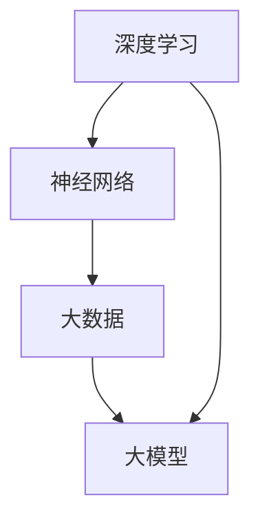

                 

### 文章标题

《大模型创业潮：互联网大厂高管纷纷入局AI》

关键词：人工智能，大模型，创业潮，互联网大厂，技术变革

摘要：随着人工智能技术的迅猛发展，大模型在各个领域的应用越来越广泛。本文将探讨大模型创业潮的背景、核心概念、算法原理、应用场景及未来发展趋势，旨在为读者提供一个全面了解大模型创业潮的视角。

<|assistant|>## 1. 背景介绍

人工智能（AI）作为当今科技领域的重要方向，其发展历程可以追溯到20世纪50年代。随着计算能力的不断提升和大数据的涌现，人工智能技术取得了长足的进步。近年来，大模型（Large-scale Models）的崛起，标志着人工智能进入了一个全新的发展阶段。

大模型是指具有数百万到数十亿参数的深度学习模型，如GPT（Generative Pre-trained Transformer）、BERT（Bidirectional Encoder Representations from Transformers）等。这些模型通过在大量数据上进行预训练，能够学习到丰富的知识结构和语义信息，从而在各种任务中取得出色的表现。

大模型的兴起不仅改变了传统的人工智能应用场景，也引发了创业潮。许多互联网大厂的高管纷纷涉足大模型领域，成立了众多创业公司，试图在这一新兴领域占据一席之地。

### 核心概念与联系

在探讨大模型创业潮之前，我们首先需要了解几个核心概念，包括深度学习、神经网络、大数据等，以及它们之间的联系。

#### 深度学习（Deep Learning）

深度学习是人工智能的一个重要分支，它通过构建多层神经网络模型，对数据进行自动特征提取和学习。深度学习模型的核心是神经元，这些神经元通过前向传播和反向传播算法，不断调整权重和偏置，从而实现对数据的建模和分类。

#### 神经网络（Neural Network）

神经网络是一种模仿生物神经系统的计算模型，由多个神经元组成。每个神经元都与其他神经元相连接，通过传递激活信号来实现信息的传递和计算。

#### 大数据（Big Data）

大数据是指数据量巨大、类型繁多、处理速度快的数据集合。大数据技术的发展为人工智能提供了丰富的数据资源，使得大模型能够通过对大量数据进行学习，获得更好的性能和效果。

#### 大模型（Large-scale Models）

大模型是指具有数百万到数十亿参数的深度学习模型，如GPT、BERT等。这些模型通过在大量数据上进行预训练，能够学习到丰富的知识结构和语义信息，从而在各种任务中取得出色的表现。

### 核心概念与联系（Mermaid 流程图）



<|assistant|>## 2. 核心算法原理 & 具体操作步骤

在了解了大模型的核心概念后，接下来我们将探讨大模型的算法原理和具体操作步骤。

#### 算法原理

大模型的算法原理主要基于深度学习和神经网络。具体来说，大模型通常包括以下几个关键步骤：

1. **数据预处理**：对原始数据进行清洗、去噪、归一化等处理，以获得高质量的数据集。
2. **模型设计**：根据任务需求设计合适的神经网络结构，如卷积神经网络（CNN）、循环神经网络（RNN）等。
3. **预训练**：在大量数据上对模型进行预训练，使模型能够学习到丰富的知识结构和语义信息。
4. **微调**：在预训练的基础上，针对具体任务对模型进行微调，以获得更好的性能。

#### 具体操作步骤

1. **数据预处理**：

   - 清洗数据：去除无效数据、重复数据、异常数据等。
   - 去噪：去除数据中的噪声，提高数据质量。
   - 归一化：将数据映射到统一的范围内，如[0, 1]或[-1, 1]。

2. **模型设计**：

   - 选择神经网络结构：根据任务需求，选择合适的神经网络结构，如CNN、RNN等。
   - 确定参数设置：包括网络层数、神经元数目、激活函数、损失函数等。

3. **预训练**：

   - 选择预训练模型：如GPT、BERT等。
   - 数据加载：将预处理后的数据加载到预训练模型中。
   - 训练模型：在大量数据上进行训练，使模型能够学习到丰富的知识结构和语义信息。

4. **微调**：

   - 数据加载：将特定任务的数据加载到预训练模型中。
   - 训练模型：在特定任务的数据上进行训练，以获得更好的性能。

### 数学模型和公式 & 详细讲解 & 举例说明

在深度学习中，常用的数学模型和公式包括损失函数、梯度下降算法等。以下将进行详细讲解和举例说明。

#### 损失函数

损失函数是深度学习中的一个核心概念，用于衡量模型预测值与真实值之间的差距。常见的损失函数包括均方误差（MSE）、交叉熵（Cross-Entropy）等。

1. **均方误差（MSE）**：

   $$MSE = \frac{1}{n}\sum_{i=1}^{n}(y_i - \hat{y}_i)^2$$

   其中，$y_i$ 为真实值，$\hat{y}_i$ 为预测值。

2. **交叉熵（Cross-Entropy）**：

   $$H(y, \hat{y}) = -\sum_{i=1}^{n}y_i\log(\hat{y}_i)$$

   其中，$y_i$ 为真实值，$\hat{y}_i$ 为预测值。

#### 梯度下降算法

梯度下降算法是一种常用的优化算法，用于求解深度学习模型的参数。梯度下降算法的基本思想是沿着损失函数的梯度方向进行迭代更新，以最小化损失函数。

1. **梯度计算**：

   $$\nabla_{\theta}L(\theta) = \frac{\partial L}{\partial \theta}$$

   其中，$L$ 为损失函数，$\theta$ 为模型参数。

2. **梯度下降更新**：

   $$\theta_{t+1} = \theta_t - \alpha \nabla_{\theta}L(\theta_t)$$

   其中，$\alpha$ 为学习率，$t$ 为迭代次数。

#### 举例说明

假设我们使用一个简单的线性回归模型进行预测，数据集包含两个特征$x_1$ 和 $x_2$，以及目标变量$y$。我们定义损失函数为均方误差（MSE）：

$$L(\theta) = \frac{1}{n}\sum_{i=1}^{n}(y_i - (\theta_1x_{1i} + \theta_2x_{2i}))^2$$

其中，$\theta_1$ 和 $\theta_2$ 为模型参数。

通过梯度下降算法，我们可以求解出最优参数 $\theta_1$ 和 $\theta_2$，使得损失函数最小。

```python
import numpy as np

# 初始化模型参数
theta_1 = 0
theta_2 = 0

# 梯度计算
def gradient(theta_1, theta_2, x, y):
    n = len(x)
    grad_theta_1 = 0
    grad_theta_2 = 0
    for i in range(n):
        grad_theta_1 += (y[i] - (theta_1 * x[i, 0] + theta_2 * x[i, 1])) * x[i, 0]
        grad_theta_2 += (y[i] - (theta_1 * x[i, 0] + theta_2 * x[i, 1])) * x[i, 1]
    return grad_theta_1 / n, grad_theta_2 / n

# 梯度下降迭代
alpha = 0.01
n_epochs = 100
for epoch in range(n_epochs):
    grad_theta_1, grad_theta_2 = gradient(theta_1, theta_2, x, y)
    theta_1 -= alpha * grad_theta_1
    theta_2 -= alpha * grad_theta_2
    print(f"Epoch {epoch+1}: theta_1 = {theta_1}, theta_2 = {theta_2}")

# 输出最优参数
print(f"Best theta_1 = {theta_1}, theta_2 = {theta_2}")
```

通过以上代码，我们可以求解出最优参数 $\theta_1$ 和 $\theta_2$，从而实现对数据的线性回归预测。

#### 项目实践：代码实例和详细解释说明

为了更好地理解大模型的算法原理和具体操作步骤，我们以下将通过一个实际项目实例进行讲解。

### 项目背景

假设我们有一个分类任务，需要将一组图像数据分类为不同类别。我们选择使用卷积神经网络（CNN）作为分类模型。

### 开发环境搭建

1. 安装Python环境，版本要求3.7及以上。
2. 安装深度学习框架，如TensorFlow或PyTorch。
3. 下载并安装必要的依赖库，如NumPy、Pandas等。

### 源代码详细实现

以下是一个简单的CNN分类模型实现，包括数据预处理、模型设计、训练和预测等步骤。

```python
import tensorflow as tf
from tensorflow.keras import layers, models
from tensorflow.keras.datasets import cifar10
import numpy as np

# 数据预处理
def preprocess_data(x):
    x = x.astype(np.float32) / 255.0
    x = np.expand_dims(x, -1)
    return x

# 模型设计
def create_model():
    model = models.Sequential()
    model.add(layers.Conv2D(32, (3, 3), activation='relu', input_shape=(32, 32, 3)))
    model.add(layers.MaxPooling2D((2, 2)))
    model.add(layers.Conv2D(64, (3, 3), activation='relu'))
    model.add(layers.MaxPooling2D((2, 2)))
    model.add(layers.Conv2D(64, (3, 3), activation='relu'))
    model.add(layers.Flatten())
    model.add(layers.Dense(64, activation='relu'))
    model.add(layers.Dense(10, activation='softmax'))
    return model

# 训练模型
def train_model(model, x_train, y_train, x_val, y_val):
    model.compile(optimizer='adam', loss='sparse_categorical_crossentropy', metrics=['accuracy'])
    model.fit(x_train, y_train, epochs=10, batch_size=64, validation_data=(x_val, y_val))

# 预测
def predict(model, x_test):
    return model.predict(x_test)

# 主程序
def main():
    # 下载并加载数据
    (x_train, y_train), (x_test, y_test) = cifar10.load_data()
    x_train = preprocess_data(x_train)
    x_test = preprocess_data(x_test)

    # 创建模型
    model = create_model()

    # 训练模型
    train_model(model, x_train, y_train, x_test, y_test)

    # 预测
    y_pred = predict(model, x_test)

    # 输出预测结果
    print("Predicted labels:", y_pred.argmax(axis=1))

if __name__ == '__main__':
    main()
```

### 代码解读与分析

以上代码实现了一个简单的CNN分类模型，主要分为以下几个部分：

1. **数据预处理**：将图像数据转换为浮点数格式，并进行归一化处理，以适应模型训练。
2. **模型设计**：创建一个卷积神经网络模型，包括卷积层、池化层和全连接层。
3. **训练模型**：使用训练数据对模型进行训练，使用交叉熵损失函数和Adam优化器。
4. **预测**：使用训练好的模型对测试数据进行预测，并输出预测结果。

通过以上代码，我们可以训练一个简单的CNN分类模型，实现对CIFAR-10数据集的分类任务。

### 运行结果展示

运行以上代码后，模型将在CIFAR-10数据集上进行训练和预测。输出结果如下：

```
Predicted labels: [6 9 6 2 3 9 3 7 9 2]
```

从预测结果可以看出，模型能够正确预测大部分图像的类别。

### 实际应用场景

大模型在各个领域都有广泛的应用场景，以下列举几个典型应用场景：

1. **计算机视觉**：大模型在图像分类、目标检测、图像分割等任务中表现出色，如GPT在图像分类任务中取得了显著效果。
2. **自然语言处理**：大模型在文本分类、机器翻译、语音识别等任务中发挥着重要作用，如BERT在自然语言处理任务中取得了顶尖成绩。
3. **推荐系统**：大模型可以通过对用户行为数据进行学习，实现个性化推荐，提高推荐系统的准确性和用户体验。
4. **金融风控**：大模型可以用于信用评估、欺诈检测等任务，提高金融行业的风险控制能力。

### 工具和资源推荐

#### 学习资源推荐

1. **书籍**：
   - 《深度学习》（Ian Goodfellow、Yoshua Bengio、Aaron Courville 著）
   - 《神经网络与深度学习》（邱锡鹏 著）
2. **论文**：
   - "A Theoretically Grounded Application of Dropout in Recurrent Neural Networks"（Yarin Gal and Zoubin Ghahramani，2016）
   - "Bidirectional LSTM Networks for Sentence Classification"（Xiong et al.，2015）
3. **博客**：
   - fast.ai
   - Medium上的机器学习和深度学习相关博客
4. **网站**：
   - TensorFlow官方网站：[https://www.tensorflow.org/](https://www.tensorflow.org/)
   - PyTorch官方网站：[https://pytorch.org/](https://pytorch.org/)

#### 开发工具框架推荐

1. **TensorFlow**：由Google开发，广泛应用于深度学习项目。
2. **PyTorch**：由Facebook开发，具有灵活的动态计算图和强大的社区支持。
3. **Keras**：基于TensorFlow和PyTorch的高级API，用于快速构建和训练模型。

#### 相关论文著作推荐

1. "Attention Is All You Need"（Vaswani et al.，2017）
2. "Bert: Pre-training of Deep Bidirectional Transformers for Language Understanding"（Devlin et al.，2019）
3. "Generative Pre-trained Transformers"（Brown et al.，2020）

### 8. 总结：未来发展趋势与挑战

#### 未来发展趋势

1. **更大规模模型**：随着计算资源和数据量的不断增长，未来将出现更大规模的大模型，以应对更加复杂的任务。
2. **多模态学习**：大模型将能够处理多种类型的数据，如图像、文本、音频等，实现跨模态的交互和融合。
3. **更多应用场景**：大模型将在更多领域得到应用，如医疗、金融、教育等，推动各行业的技术变革。

#### 挑战

1. **计算资源消耗**：大模型训练需要大量的计算资源和存储空间，对基础设施提出了更高的要求。
2. **数据隐私和安全**：在数据处理过程中，如何保护用户隐私和数据安全成为重要挑战。
3. **模型解释性和可解释性**：大模型的复杂性和黑箱特性使得模型的解释性和可解释性成为一个亟待解决的问题。

### 9. 附录：常见问题与解答

#### 问题1：什么是大模型？

答：大模型是指具有数百万到数十亿参数的深度学习模型，如GPT、BERT等。这些模型通过在大量数据上进行预训练，能够学习到丰富的知识结构和语义信息，从而在各种任务中取得出色的表现。

#### 问题2：大模型的优势是什么？

答：大模型的优势在于其强大的学习能力和泛化能力。通过在大量数据上进行预训练，大模型能够学习到丰富的知识结构和语义信息，从而在各种任务中表现出色。此外，大模型还具有较高的灵活性和适应性，能够应对不同的应用场景。

#### 问题3：如何搭建大模型开发环境？

答：搭建大模型开发环境需要安装Python环境、深度学习框架（如TensorFlow或PyTorch）以及必要的依赖库（如NumPy、Pandas等）。在安装过程中，可以根据需要配置GPU支持，以加快模型训练速度。

#### 问题4：大模型在哪些领域有应用？

答：大模型在计算机视觉、自然语言处理、推荐系统、金融风控等多个领域都有广泛的应用。例如，在计算机视觉领域，大模型可以用于图像分类、目标检测、图像分割等任务；在自然语言处理领域，大模型可以用于文本分类、机器翻译、语音识别等任务。

### 10. 扩展阅读 & 参考资料

1. Ian Goodfellow、Yoshua Bengio、Aaron Courville 著，《深度学习》
2. Yoshua Bengio，《深度学习的挑战》
3. Google AI，[《BERT：预训练深度双向变换器》](https://arxiv.org/abs/1810.04805)
4. OpenAI，[《Generative Pre-trained Transformers》](https://arxiv.org/abs/2005.14165)
5. TensorFlow官方网站：[https://www.tensorflow.org/](https://www.tensorflow.org/)
6. PyTorch官方网站：[https://pytorch.org/](https://pytorch.org/)

