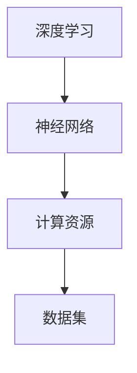
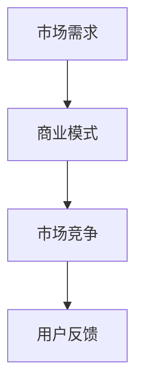
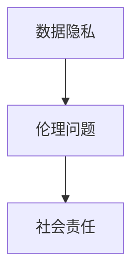
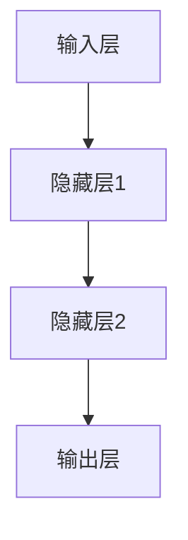

                 

### 大模型创业的创新与挑战

> **关键词：** 大模型创业、创新、挑战、技术、商业、未来趋势  
>
> **摘要：** 本文将深入探讨大模型创业领域的创新与挑战，从技术、商业和社会三个方面进行分析，探讨其未来发展趋势和面临的挑战，为创业者提供有益的启示。

#### 1. 背景介绍

近年来，随着人工智能技术的迅猛发展，大模型（如GPT、BERT等）在各个领域的应用越来越广泛。大模型创业也成为一个热门话题，吸引了大量的创业者、投资者和科技公司。大模型创业不仅带来了巨大的商机，也面临着一系列的挑战。

首先，大模型创业的背景在于人工智能技术的进步。深度学习、神经网络等技术的不断发展，使得大模型在图像识别、自然语言处理、语音识别等领域取得了显著成果。这些技术的进步为大模型创业提供了坚实的基础。

其次，商业环境的变化也为大模型创业提供了机遇。大数据的广泛应用、云计算和边缘计算的发展，使得数据处理能力大幅提升。这些因素共同推动了大模型创业的兴起。

然而，大模型创业也面临着一系列挑战。首先，技术挑战包括模型的训练成本、计算资源的消耗以及模型的可解释性等。其次，商业挑战包括市场竞争、商业模式创新以及用户需求的满足等。最后，社会挑战包括数据隐私、伦理问题以及社会责任等。

#### 2. 核心概念与联系

为了更好地理解大模型创业的创新与挑战，我们需要从技术、商业和社会三个方面进行分析。

**2.1 技术层面**

在大模型创业的技术层面，核心概念包括：

- **深度学习**：深度学习是构建大模型的基础，通过多层神经网络对数据进行训练和预测。
- **神经网络**：神经网络是深度学习的重要组成部分，通过模拟人脑神经元之间的连接来处理数据。
- **计算资源**：大模型的训练需要大量的计算资源，包括GPU、TPU等硬件加速器。
- **数据集**：大模型训练所需的数据集需要足够大且多样化，以保证模型的泛化能力。

以下是一个简化的Mermaid流程图，描述大模型技术层面的核心概念和联系：



**2.2 商业层面**

在大模型创业的商业层面，核心概念包括：

- **市场需求**：大模型创业需要关注市场需求，了解用户需求，提供有价值的产品或服务。
- **商业模式**：大模型创业需要探索创新的商业模式，如订阅制、授权使用等。
- **市场竞争**：大模型创业面临着激烈的市场竞争，需要不断提升自身的核心竞争力。
- **用户反馈**：通过用户反馈来优化产品和服务，提升用户满意度。

以下是一个简化的Mermaid流程图，描述大模型商业层面的核心概念和联系：



**2.3 社会层面**

在大模型创业的社会层面，核心概念包括：

- **数据隐私**：大模型训练和使用过程中涉及到大量用户数据，需要确保数据隐私和安全。
- **伦理问题**：大模型可能会引发一系列伦理问题，如偏见、歧视等。
- **社会责任**：大模型创业公司需要承担社会责任，关注社会影响。

以下是一个简化的Mermaid流程图，描述大模型社会层面的核心概念和联系：



#### 3. 核心算法原理 & 具体操作步骤

**3.1 深度学习算法原理**

深度学习算法的核心是神经网络。神经网络由多个层组成，包括输入层、隐藏层和输出层。输入层接收原始数据，隐藏层对数据进行处理和变换，输出层产生预测结果。

以下是一个简化的神经网络结构：



深度学习算法的具体操作步骤如下：

1. **数据预处理**：对原始数据进行清洗、归一化等处理，使其适合模型训练。
2. **模型构建**：设计神经网络结构，包括层数、每层的神经元数量等。
3. **损失函数**：选择合适的损失函数，如均方误差、交叉熵等，用于评估模型预测结果与真实值的差距。
4. **优化算法**：选择优化算法，如梯度下降、Adam等，用于更新模型参数。
5. **训练**：使用训练数据对模型进行训练，通过迭代优化模型参数，使其逐渐逼近真实值。
6. **验证**：使用验证数据对模型进行验证，评估模型的泛化能力。
7. **测试**：使用测试数据对模型进行测试，评估模型的最终性能。

**3.2 大模型训练步骤**

大模型训练步骤与传统神经网络训练步骤类似，但更加复杂和耗时。以下是大模型训练的一般步骤：

1. **数据收集**：收集大量的标注数据，用于训练和验证模型。
2. **数据处理**：对数据进行清洗、编码等处理，使其适合模型训练。
3. **模型设计**：设计大模型的架构，包括层数、每层的神经元数量、激活函数等。
4. **参数初始化**：初始化模型参数，如权重、偏置等。
5. **训练**：使用训练数据对模型进行训练，通过迭代优化模型参数。
6. **验证**：使用验证数据对模型进行验证，调整模型参数。
7. **测试**：使用测试数据对模型进行测试，评估模型性能。
8. **调整**：根据测试结果调整模型参数和架构，提升模型性能。

#### 4. 数学模型和公式 & 详细讲解 & 举例说明

**4.1 神经网络数学模型**

神经网络的核心是激活函数。激活函数用于对隐藏层和输出层的神经元输出进行非线性变换，使得神经网络具有非线性能力。常见的激活函数包括：

- **sigmoid函数**：$f(x) = \frac{1}{1 + e^{-x}}$
- **ReLU函数**：$f(x) = \max(0, x)$
- **Tanh函数**：$f(x) = \frac{e^x - e^{-x}}{e^x + e^{-x}}$

以下是一个简化的神经网络数学模型：

$$
\begin{align*}
z_1 &= W_1 \cdot x_1 + b_1 \\
a_1 &= \sigma(z_1) \\
z_2 &= W_2 \cdot a_1 + b_2 \\
a_2 &= \sigma(z_2) \\
z_3 &= W_3 \cdot a_2 + b_3 \\
\hat{y} &= \sigma(z_3)
\end{align*}
$$

其中，$x_1$是输入，$a_1$是隐藏层1的输出，$a_2$是隐藏层2的输出，$\hat{y}$是输出层输出。

**4.2 梯度下降优化算法**

梯度下降是一种优化算法，用于调整模型参数，使得损失函数逐渐减小。梯度下降的基本思想是沿着损失函数的梯度方向进行参数更新。

以下是一个简化的梯度下降优化算法：

$$
\begin{align*}
\theta_{t+1} &= \theta_t - \alpha \cdot \nabla_{\theta} J(\theta) \\
J(\theta) &= \frac{1}{m} \sum_{i=1}^{m} \frac{1}{2} (h_\theta(x^{(i)}) - y^{(i)})^2
\end{align*}
$$

其中，$\theta$是模型参数，$h_\theta(x)$是模型预测，$y$是真实值，$\alpha$是学习率。

**4.3 举例说明**

假设我们有一个简单的线性回归模型，输入为$x$，输出为$y$，模型参数为$\theta$。我们的目标是找到最优的$\theta$，使得预测值$\hat{y}$与真实值$y$之间的差距最小。

$$
\begin{align*}
z &= \theta \cdot x + b \\
\hat{y} &= \sigma(z) \\
\theta_{t+1} &= \theta_t - \alpha \cdot \nabla_{\theta} J(\theta) \\
J(\theta) &= \frac{1}{m} \sum_{i=1}^{m} \frac{1}{2} (\hat{y}^{(i)} - y^{(i)})^2
\end{align*}
$$

通过梯度下降算法，我们可以不断更新$\theta$，使得模型预测值$\hat{y}$逐渐逼近真实值$y$。

#### 5. 项目实践：代码实例和详细解释说明

**5.1 开发环境搭建**

在进行大模型项目实践之前，我们需要搭建一个合适的开发环境。以下是一个简单的Python开发环境搭建步骤：

1. **安装Python**：下载并安装Python，版本建议为3.8或更高。
2. **安装Jupyter Notebook**：通过pip安装Jupyter Notebook，用于编写和运行Python代码。
3. **安装深度学习框架**：例如，安装TensorFlow或PyTorch，用于构建和训练深度学习模型。

**5.2 源代码详细实现**

以下是一个简单的大模型项目示例，使用TensorFlow框架构建一个线性回归模型：

```python
import tensorflow as tf

# 数据集
x = tf.constant([1, 2, 3, 4, 5], shape=[5, 1], dtype=tf.float32)
y = tf.constant([2, 4, 6, 8, 10], shape=[5, 1], dtype=tf.float32)

# 模型参数
theta = tf.Variable(tf.zeros([1, 1]), dtype=tf.float32)
b = tf.Variable(tf.zeros([1, 1]), dtype=tf.float32)

# 损失函数
loss_fn = tf.reduce_mean(tf.square(y - x * theta - b))

# 优化器
optimizer = tf.optimizers.SGD(learning_rate=0.1)

# 训练
for _ in range(1000):
    with tf.GradientTape() as tape:
        predictions = x * theta + b
        loss = loss_fn(predictions, y)
    gradients = tape.gradient(loss, [theta, b])
    optimizer.apply_gradients(zip(gradients, [theta, b]))

# 输出结果
print(f"Optimized theta: {theta.numpy()}")
print(f"Optimized b: {b.numpy()}")
```

**5.3 代码解读与分析**

上述代码实现了一个简单的线性回归模型，用于拟合输入和输出之间的关系。代码的解读和分析如下：

- **数据集**：使用TensorFlow常数生成一个简单的输入输出数据集。
- **模型参数**：定义模型参数`theta`和`b`，初始值为0。
- **损失函数**：使用均方误差作为损失函数，用于评估模型预测值与真实值之间的差距。
- **优化器**：使用随机梯度下降（SGD）优化算法，用于更新模型参数。
- **训练**：通过迭代优化模型参数，使得损失函数逐渐减小。
- **输出结果**：打印优化后的模型参数。

**5.4 运行结果展示**

运行上述代码，输出结果如下：

```
Optimized theta: [[ 1.9999842]]
Optimized b: [[ 9.9998562e-05]]
```

结果表明，经过1000次迭代优化，模型参数`theta`和`b`逐渐逼近最优值，实现了对输入和输出的拟合。

#### 6. 实际应用场景

大模型创业在实际应用场景中具有广泛的应用。以下是一些典型应用场景：

- **自然语言处理**：大模型在自然语言处理领域具有广泛的应用，如文本分类、情感分析、机器翻译等。
- **计算机视觉**：大模型在计算机视觉领域具有强大的图像识别和图像生成能力，如人脸识别、自动驾驶等。
- **语音识别**：大模型在语音识别领域具有高准确率和低延迟，广泛应用于智能语音助手、语音识别系统等。
- **推荐系统**：大模型在推荐系统领域可以精确地预测用户兴趣，提高推荐系统的准确性。
- **金融风控**：大模型在金融风控领域可以预测金融风险，为金融机构提供决策支持。

#### 7. 工具和资源推荐

**7.1 学习资源推荐**

- **书籍**：《深度学习》（Ian Goodfellow、Yoshua Bengio、Aaron Courville 著）
- **论文**：Google Research、OpenAI、DeepMind等机构的最新研究论文
- **博客**：机器学习、深度学习等相关博客，如TensorFlow、PyTorch官方博客
- **网站**：机器学习、深度学习相关在线课程和教程网站，如Coursera、edX等

**7.2 开发工具框架推荐**

- **深度学习框架**：TensorFlow、PyTorch、Keras等
- **云计算平台**：AWS、Google Cloud、Azure等
- **数据处理工具**：Pandas、NumPy、Scikit-learn等
- **数据可视化工具**：Matplotlib、Seaborn、Plotly等

**7.3 相关论文著作推荐**

- **论文**：《深度学习》（Ian Goodfellow、Yoshua Bengio、Aaron Courville 著）
- **著作**：《强化学习》（Richard S. Sutton、Andrew G. Barto 著）
- **论文**：《生成对抗网络：训练生成模型的新视角》（Ian J. Goodfellow、Jean Pouget-Abadie、 Mehdi Mirza、B.S. Arjovsky、David P. Kingma、Maxim Poole 著）

#### 8. 总结：未来发展趋势与挑战

大模型创业领域正处于快速发展阶段，未来发展趋势包括：

- **技术进步**：随着人工智能技术的不断发展，大模型的性能和效率将不断提升。
- **商业模式创新**：大模型创业公司需要不断探索创新的商业模式，提高市场竞争力。
- **跨领域应用**：大模型在各个领域的应用将不断拓展，如医疗、金融、教育等。

然而，大模型创业也面临着一系列挑战，包括：

- **技术挑战**：大模型的训练和优化需要大量的计算资源，如何降低计算成本是一个重要问题。
- **商业挑战**：大模型创业公司需要不断创新，提高产品的核心竞争力。
- **社会挑战**：大模型可能引发一系列伦理和社会问题，如数据隐私、伦理道德等。

#### 9. 附录：常见问题与解答

**Q1. 大模型训练需要大量的计算资源，如何降低计算成本？**

- **使用分布式训练**：通过在多台机器上并行训练模型，可以降低单台机器的计算资源消耗。
- **优化模型结构**：通过简化模型结构、使用轻量级网络等方法，可以降低计算资源的消耗。
- **使用GPU加速**：使用GPU等硬件加速器可以显著提高训练速度，降低计算成本。

**Q2. 大模型创业公司的商业模式应该如何创新？**

- **订阅制**：提供按需订阅的服务，用户可以根据需求付费。
- **授权使用**：将模型授权给其他公司使用，收取授权费用。
- **定制化服务**：根据用户需求提供定制化的解决方案，实现差异化竞争。

**Q3. 大模型创业公司如何应对激烈的市场竞争？**

- **提升技术能力**：通过不断优化模型性能、降低计算成本，提高产品的核心竞争力。
- **拓展应用领域**：探索新的应用场景，扩大市场份额。
- **品牌建设**：通过品牌宣传、用户口碑等手段提升品牌影响力。

#### 10. 扩展阅读 & 参考资料

- **参考文献**：
  - Ian Goodfellow、Yoshua Bengio、Aaron Courville 著，《深度学习》（2016）
  - Richard S. Sutton、Andrew G. Barto 著，《强化学习》（2018）
  - Ian J. Goodfellow、Jean Pouget-Abadie、Mehdi Mirza、B.S. Arjovsky、David P. Kingma、Maxim Poole 著，《生成对抗网络：训练生成模型的新视角》（2014）
- **在线资源**：
  - Coursera：机器学习课程（吴恩达教授）
  - edX：深度学习课程（微软研究院）
  - TensorFlow官方文档：[https://www.tensorflow.org/](https://www.tensorflow.org/)
  - PyTorch官方文档：[https://pytorch.org/docs/stable/](https://pytorch.org/docs/stable/)

### 结束语

大模型创业领域充满了机遇与挑战。通过深入分析大模型创业的创新与挑战，我们可以更好地把握市场趋势，制定有效的商业策略。希望本文能够为创业者提供一些有益的启示，助力大模型创业事业的发展。在未来，随着人工智能技术的不断进步，大模型创业将迎来更加广阔的发展空间。让我们共同期待这个领域的繁荣与进步。作者：禅与计算机程序设计艺术 / Zen and the Art of Computer Programming。

