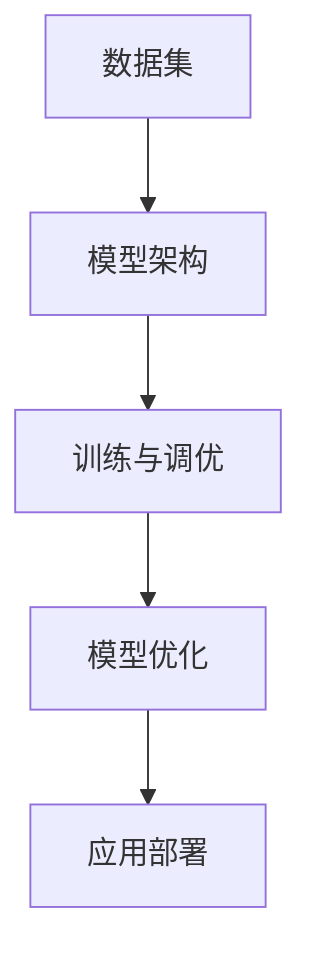

                 

### 背景介绍

近年来，大模型（Large Models）在人工智能领域引起了广泛关注。大模型，通常指的是具有数十亿甚至数万亿参数的深度学习模型，它们在自然语言处理（NLP）、计算机视觉（CV）、语音识别（ASR）等任务中展现出了惊人的性能。这一波大模型的兴起，主要得益于以下几个关键因素：

**1. 硬件进步**：随着计算能力的不断提升，尤其是高性能GPU和TPU的广泛应用，为训练大规模模型提供了强大的计算资源。

**2. 数据获取**：互联网的普及和数据的快速增长，为训练大规模模型提供了丰富的数据集。这些数据集不仅量大，而且多样化，有助于模型学习到更复杂和抽象的特征。

**3. 算法优化**：近年来，深度学习算法在优化理论和模型结构设计方面取得了显著进展，使得训练大规模模型更加高效和稳定。

随着大模型的快速发展，一个新的产业——大模型创业，也开始崭露头角。大模型创业公司通过构建和优化大规模模型，提供各类AI服务，如自动驾驶、智能客服、医疗诊断等，以期在激烈的市场竞争中占据一席之地。

然而，大模型创业并非一帆风顺。首先，构建和训练大规模模型需要巨额的资金投入，这往往是一个高风险、高投入的项目。其次，大规模模型在数据处理、存储和传输方面存在巨大挑战。最后，大规模模型的伦理和社会影响也引发了广泛讨论，如数据隐私、算法偏见等。

本文将围绕大模型创业这一主题，探讨其商业模式、技术创新、实际应用以及面临的挑战。希望通过本文的讨论，为关注大模型创业的读者提供一些有价值的思考。

### 1.1 大模型创业的商业模式

大模型创业的商业模式可以分为三个主要方面：模型构建、模型优化和应用落地。

**1. 模型构建**

模型构建是整个商业模式的基础。构建一个大规模模型通常需要以下几个步骤：

**数据获取与预处理**：首先，创业公司需要获取大量的数据，这些数据可以来源于公开数据集、内部数据集或合作方提供的数据。获取数据后，需要进行数据预处理，包括数据清洗、数据增强、数据标准化等，以确保数据的质量和一致性。

**模型设计**：在数据预处理完成后，创业公司需要根据具体的任务需求设计模型架构。这包括选择合适的神经网络架构、设定合理的超参数等。在此过程中，创业公司需要结合最新的研究成果和实际需求，不断创新和优化模型设计。

**模型训练与调优**：构建好模型后，创业公司需要使用高性能计算资源进行模型训练。训练过程中，需要不断调整模型参数，以达到最佳的模型性能。这一过程通常需要多次迭代，耗时较长。

**2. 模型优化**

模型优化是提升模型性能的重要手段。常见的模型优化方法包括：

**模型压缩**：通过模型剪枝、量化、知识蒸馏等技术，减小模型的参数规模，降低模型的计算复杂度和存储需求，同时保持或提升模型性能。

**模型加速**：通过分布式训练、模型并行化等技术，提高模型的训练速度，缩短开发周期。

**模型迁移与泛化**：通过迁移学习和元学习等技术，使模型能够在新的任务和数据集上表现良好，提升模型的泛化能力。

**3. 应用落地**

模型优化完成后，创业公司需要将模型应用到实际场景中，实现商业价值。应用落地的过程包括：

**产品开发**：根据具体场景需求，开发相应的AI产品或服务。这包括用户界面设计、功能实现、性能优化等。

**业务拓展**：通过市场推广、合作伙伴关系建立等方式，将产品或服务推向市场，拓展业务范围。

**用户反馈与迭代**：收集用户反馈，不断优化产品或服务，提升用户体验，形成正向循环。

**1.2 大模型创业的优势与挑战**

**优势**

**1. 市场潜力巨大**：随着人工智能技术的普及，各行各业对AI应用的需求不断增长。大模型创业公司可以抓住这一市场机遇，提供高性能的AI解决方案。

**2. 技术门槛较高**：大规模模型构建和优化需要强大的技术实力和资金支持，这使得竞争对手难以迅速进入市场，为大模型创业公司提供了竞争优势。

**3. 创新空间广阔**：大模型技术在不断演进，创业公司有机会在模型设计、算法优化等方面进行创新，推动整个行业的发展。

**挑战**

**1. 高成本与高风险**：构建和训练大规模模型需要大量的资金投入，且过程复杂，风险较高。一旦项目失败，将导致巨额损失。

**2. 数据隐私与安全**：大规模模型训练和处理过程中，涉及大量的敏感数据。如何确保数据隐私和安全，避免数据泄露和滥用，是一个重要挑战。

**3. 社会伦理问题**：大规模模型的广泛应用引发了一系列社会伦理问题，如算法偏见、就业替代等。如何应对这些问题，实现技术与伦理的平衡，是大模型创业公司需要关注的重要议题。

### 1.3 大模型创业的案例分析

为了更深入地理解大模型创业的商业模式和挑战，以下通过两个典型案例进行详细分析。

**案例一：OpenAI**

OpenAI 是一家知名的人工智能研究公司，其最著名的项目是 GPT（Generative Pre-trained Transformer）系列模型。GPT-3 是 OpenAI 发布的一个大型预训练语言模型，具有 1750 亿个参数，是目前最大的公开语言模型。

**1. 模型构建**：OpenAI 通过公开数据集和内部数据集进行数据收集和预处理，设计并训练了 GPT-3 模型。模型设计采用了 Transformer 架构，具有强大的语言理解和生成能力。

**2. 模型优化**：OpenAI 采用分布式训练和模型并行化技术，加速模型训练过程。此外，还通过模型压缩和知识蒸馏技术，减小模型规模，提高模型效率。

**3. 应用落地**：OpenAI 的 GPT-3 模型广泛应用于自然语言处理、文本生成、机器翻译等领域，为客户提供强大的 AI 服务。

**4. 成功经验**：OpenAI 成功的原因在于其强大的技术实力和开放的研发模式。OpenAI 专注于人工智能的基础研究，不断推出具有突破性的技术成果，吸引了大量的关注和投资。

**5. 挑战与反思**：尽管 OpenAI 取得了巨大成功，但其也面临一系列挑战，如数据隐私和安全问题、模型滥用风险等。未来，OpenAI 需要在技术和社会责任之间找到平衡，确保其技术发展能够造福社会。

**案例二：DeepMind**

DeepMind 是一家总部位于英国的人工智能公司，以其在深度学习和强化学习领域的卓越成就而闻名。其最著名的项目是 AlphaGo，一款能够战胜人类围棋冠军的 AI 系统。

**1. 模型构建**：DeepMind 通过大量的围棋对弈数据，训练了 AlphaGo 模型。模型设计采用了深度神经网络和强化学习技术，具有强大的决策能力和自主学习能力。

**2. 模型优化**：DeepMind 采用分布式训练和强化学习技术，不断优化 AlphaGo 模型的性能。此外，还通过模型压缩和知识蒸馏技术，减小模型规模，提高模型效率。

**3. 应用落地**：AlphaGo 在围棋领域取得了巨大成功，随后 DeepMind 开始将相关技术应用于其他领域，如医疗诊断、药物研发等。

**4. 成功经验**：DeepMind 的成功在于其强大的技术创新能力和跨领域应用能力。DeepMind 专注于人工智能的基础研究，不断推出具有突破性的技术成果，同时将这些技术应用于实际场景，创造了巨大的商业价值。

**5. 挑战与反思**：尽管 DeepMind 取得了巨大成功，但其也面临一系列挑战，如技术安全性、数据隐私问题等。未来，DeepMind 需要在技术创新和社会责任之间找到平衡，确保其技术发展能够造福社会。

通过以上案例分析，我们可以看出大模型创业公司在商业模式、技术创新和应用落地方面存在显著的差异。然而，无论是 OpenAI 还是 DeepMind，它们都面临着共同的技术挑战和社会责任问题。未来，大模型创业公司需要在技术创新和社会责任之间找到平衡，实现可持续发展。

### 核心概念与联系

在大模型创业中，理解核心概念和技术架构的联系至关重要。以下我们将介绍几个关键概念，并通过 Mermaid 流程图展示它们之间的联系。

#### 1. 数据集（Dataset）

数据集是构建大模型的基础。一个高质量的数据集包含丰富的标注信息，可以提供模型所需的各种特征。数据集的来源可以是公开数据集、内部数据集或合作方提供的数据。

#### 2. 模型架构（Model Architecture）

模型架构决定了大模型的结构和功能。常见的模型架构包括卷积神经网络（CNN）、循环神经网络（RNN）、Transformer 等。每种架构都有其特定的优势和适用场景。

#### 3. 训练与调优（Training and Tuning）

训练是指使用数据集对模型进行参数优化，使其在特定任务上表现良好。调优是调整模型参数，以获得最佳性能。训练和调优过程需要大量的计算资源和时间。

#### 4. 模型优化（Model Optimization）

模型优化旨在提高模型性能，降低计算复杂度和存储需求。常见的优化方法包括模型剪枝、量化、知识蒸馏等。

#### 5. 应用部署（Deployment）

应用部署是将训练好的模型部署到实际应用场景中。这通常涉及将模型转换为高效的运行形式，如 TensorFlow Lite 或 ONNX。

#### Mermaid 流程图

以下是一个简单的 Mermaid 流程图，展示这些概念之间的联系：



### 核心算法原理 & 具体操作步骤

在大模型创业中，核心算法原理的理解和具体操作步骤的掌握至关重要。本文将详细介绍大模型的核心算法原理，包括深度学习、迁移学习、模型压缩等技术，并展示具体操作步骤。

#### 1. 深度学习（Deep Learning）

深度学习是一种基于多层神经网络的学习方法，通过逐层提取特征，实现对复杂数据的建模。深度学习在图像识别、自然语言处理等领域取得了显著的成果。

**具体操作步骤：**

1. **数据准备**：收集和整理数据集，进行数据预处理，如数据清洗、归一化等。

2. **模型设计**：选择合适的神经网络架构，如卷积神经网络（CNN）、循环神经网络（RNN）或Transformer等。

3. **模型训练**：使用训练数据集对模型进行训练，通过反向传播算法调整模型参数。

4. **模型评估**：使用验证数据集评估模型性能，调整超参数，优化模型。

5. **模型部署**：将训练好的模型部署到实际应用场景中。

**代码示例：**

以下是一个简单的 TensorFlow 代码示例，用于训练一个简单的卷积神经网络：

```python
import tensorflow as tf

# 数据准备
(x_train, y_train), (x_test, y_test) = tf.keras.datasets.mnist.load_data()
x_train = x_train / 255.0
x_test = x_test / 255.0

# 模型设计
model = tf.keras.Sequential([
    tf.keras.layers.Conv2D(32, (3, 3), activation='relu', input_shape=(28, 28, 1)),
    tf.keras.layers.MaxPooling2D((2, 2)),
    tf.keras.layers.Flatten(),
    tf.keras.layers.Dense(128, activation='relu'),
    tf.keras.layers.Dense(10, activation='softmax')
])

# 模型训练
model.compile(optimizer='adam',
              loss='sparse_categorical_crossentropy',
              metrics=['accuracy'])
model.fit(x_train, y_train, epochs=5)

# 模型评估
test_loss, test_acc = model.evaluate(x_test, y_test, verbose=2)
print('\nTest accuracy:', test_acc)

# 模型部署
model.save('mnist_model.h5')
```

#### 2. 迁移学习（Transfer Learning）

迁移学习是一种利用预训练模型进行新任务学习的方法。通过迁移学习，可以将预训练模型在特定任务上的知识迁移到新任务上，提高新任务的性能。

**具体操作步骤：**

1. **选择预训练模型**：根据新任务的需求，选择一个合适的预训练模型，如 ResNet、VGG、BERT 等。

2. **模型调整**：冻结预训练模型的权重，替换部分层，增加新层，以适应新任务。

3. **模型训练**：使用新任务的数据集对模型进行训练，微调模型参数。

4. **模型评估**：在新任务的数据集上评估模型性能，进行超参数调整。

5. **模型部署**：将训练好的模型部署到实际应用场景中。

**代码示例：**

以下是一个简单的迁移学习 TensorFlow 代码示例，使用预训练的 ResNet 模型进行图像分类：

```python
import tensorflow as tf

# 加载预训练 ResNet 模型
base_model = tf.keras.applications.ResNet50(weights='imagenet', include_top=False, input_shape=(224, 224, 3))

# 冻结预训练模型权重
base_model.trainable = False

# 模型调整
model = tf.keras.Sequential([
    base_model,
    tf.keras.layers.GlobalAveragePooling2D(),
    tf.keras.layers.Dense(10, activation='softmax')
])

# 模型训练
model.compile(optimizer='adam',
              loss='sparse_categorical_crossentropy',
              metrics=['accuracy'])
model.fit(x_train, y_train, epochs=5)

# 模型评估
test_loss, test_acc = model.evaluate(x_test, y_test, verbose=2)
print('\nTest accuracy:', test_acc)

# 模型部署
model.save('mnist_transfer_learning_model.h5')
```

#### 3. 模型压缩（Model Compression）

模型压缩是一种减小模型大小、降低计算复杂度和存储需求的方法。常见的压缩方法包括模型剪枝、量化、知识蒸馏等。

**具体操作步骤：**

1. **模型剪枝**：通过剪枝网络中的冗余神经元或连接，减小模型大小。

2. **模型量化**：将模型中的浮点数权重转换为整数权重，降低模型大小和计算复杂度。

3. **知识蒸馏**：使用预训练模型指导小模型的学习，提高小模型的性能。

4. **模型优化**：对压缩后的模型进行优化，提高模型性能。

5. **模型评估**：在目标数据集上评估模型性能，进行超参数调整。

6. **模型部署**：将压缩后的模型部署到实际应用场景中。

**代码示例：**

以下是一个简单的模型剪枝 TensorFlow 代码示例：

```python
import tensorflow as tf
from tensorflow_model_optimization.python.core.sparsity.keras import prune_low_magnitude

# 加载原始模型
model = tf.keras.applications.VGG16(weights='imagenet', include_top=False, input_shape=(224, 224, 3))

# 剪枝配置
pruning_params = {
    'pruning_schedule': {
        'dense_1': (0.5, 0.5),
        'dense_2': (0.5, 0.5),
    }
}

# 剪枝模型
pruned_model = prune_low_magnitude(model, **pruning_params)

# 模型训练
pruned_model.compile(optimizer='adam',
                      loss='sparse_categorical_crossentropy',
                      metrics=['accuracy'])
pruned_model.fit(x_train, y_train, epochs=5)

# 模型评估
test_loss, test_acc = pruned_model.evaluate(x_test, y_test, verbose=2)
print('\nTest accuracy:', test_acc)

# 模型部署
pruned_model.save('vgg16_pruned_model.h5')
```

通过以上三个核心算法的介绍和代码示例，我们可以看到大模型创业中的核心算法原理和具体操作步骤。这些算法不仅有助于提升模型性能，还可以降低模型大小和计算复杂度，为实际应用提供更多可能性。

### 数学模型和公式 & 详细讲解 & 举例说明

在大模型创业中，理解数学模型和公式对于模型设计、优化和应用至关重要。以下将详细介绍大模型中常用的数学模型和公式，并进行详细讲解和举例说明。

#### 1. 深度学习中的损失函数（Loss Function）

损失函数是深度学习模型训练的核心组件，用于衡量模型预测结果与真实标签之间的差距。以下是一些常用的损失函数及其数学表达式：

**1.1 交叉熵损失（Cross-Entropy Loss）**

交叉熵损失函数常用于分类任务，其数学表达式为：

$$
L_{CE} = -\frac{1}{N}\sum_{i=1}^{N} y_i \log(p_i)
$$

其中，$N$ 是样本数量，$y_i$ 是第 $i$ 个样本的真实标签，$p_i$ 是模型对第 $i$ 个样本预测的概率。

**1.2 平方误差损失（Mean Squared Error, MSE）**

平方误差损失函数常用于回归任务，其数学表达式为：

$$
L_{MSE} = \frac{1}{N}\sum_{i=1}^{N} (y_i - \hat{y}_i)^2
$$

其中，$N$ 是样本数量，$y_i$ 是第 $i$ 个样本的真实标签，$\hat{y}_i$ 是模型对第 $i$ 个样本的预测值。

**1.3 对数损失（Log Loss）**

对数损失函数是交叉熵损失函数的特殊形式，其数学表达式为：

$$
L_{Log} = -\frac{1}{N}\sum_{i=1}^{N} y_i \log(\hat{y}_i)
$$

其中，$N$ 是样本数量，$y_i$ 是第 $i$ 个样本的真实标签，$\hat{y}_i$ 是模型对第 $i$ 个样本的预测概率。

**示例说明：**

假设我们有一个二分类问题，真实标签为 $y = [1, 0, 1, 0]$，模型预测的概率为 $p = [0.7, 0.2, 0.8, 0.3]$。使用交叉熵损失函数计算损失：

$$
L_{CE} = -\frac{1}{4} [1 \cdot \log(0.7) + 0 \cdot \log(0.2) + 1 \cdot \log(0.8) + 0 \cdot \log(0.3)]
$$

$$
L_{CE} \approx -\frac{1}{4} [0.3567 + 0 + 0.2231 + 0]
$$

$$
L_{CE} \approx -0.1346
$$

#### 2. 深度学习中的优化算法（Optimization Algorithm）

优化算法用于调整模型参数，以最小化损失函数。以下是一些常用的优化算法及其数学原理：

**2.1 随机梯度下降（Stochastic Gradient Descent, SGD）**

随机梯度下降是最简单的优化算法，其核心思想是每次迭代使用一个样本的梯度来更新模型参数。其数学表达式为：

$$
\theta_{t+1} = \theta_{t} - \alpha \cdot \nabla_{\theta} L(\theta)
$$

其中，$\theta$ 是模型参数，$\alpha$ 是学习率，$\nabla_{\theta} L(\theta)$ 是损失函数关于模型参数的梯度。

**2.2 动量法（Momentum）**

动量法是一种改进的优化算法，其核心思想是引入一个动量项，以加速梯度下降过程。其数学表达式为：

$$
\theta_{t+1} = \theta_{t} - \alpha \cdot \nabla_{\theta} L(\theta) + \beta \cdot (1 - \alpha) \cdot \theta_{t}
$$

其中，$\beta$ 是动量系数，其余参数与 SGD 相同。

**2.3Adam算法**

Adam算法是一种结合了动量法和自适应学习率的优化算法，其数学表达式为：

$$
m_t = \beta_1 \cdot m_{t-1} + (1 - \beta_1) \cdot \nabla_{\theta} L(\theta)
$$

$$
v_t = \beta_2 \cdot v_{t-1} + (1 - \beta_2) \cdot (\nabla_{\theta} L(\theta))^2
$$

$$
\theta_{t+1} = \theta_{t} - \alpha \cdot \frac{m_t}{\sqrt{v_t} + \epsilon}
$$

其中，$m_t$ 是一阶矩估计，$v_t$ 是二阶矩估计，$\beta_1$ 和 $\beta_2$ 是动量系数，$\alpha$ 是学习率，$\epsilon$ 是小常数。

**示例说明：**

假设我们有一个简单的模型，损失函数为 $L(\theta) = (\theta - 2)^2$，初始参数为 $\theta_0 = 1$，学习率为 $\alpha = 0.1$，使用 SGD 算法进行迭代：

**第1次迭代：**

$$
\nabla_{\theta} L(\theta_0) = -2(\theta_0 - 2) = -2(1 - 2) = 2
$$

$$
\theta_1 = \theta_0 - \alpha \cdot \nabla_{\theta} L(\theta_0) = 1 - 0.1 \cdot 2 = 0.8
$$

**第2次迭代：**

$$
\nabla_{\theta} L(\theta_1) = -2(\theta_1 - 2) = -2(0.8 - 2) = 1.2
$$

$$
\theta_2 = \theta_1 - \alpha \cdot \nabla_{\theta} L(\theta_1) = 0.8 - 0.1 \cdot 1.2 = 0.64
$$

通过以上迭代过程，我们可以看到模型参数逐渐接近最优值。

#### 3. 大模型中的正则化技术（Regularization Techniques）

正则化技术用于防止模型过拟合，提高模型的泛化能力。以下是一些常用的正则化技术及其数学原理：

**3.1 L1正则化（L1 Regularization）**

L1正则化通过在损失函数中添加 $L1$ 范数项来惩罚模型参数的绝对值，其数学表达式为：

$$
L_{L1} = \lambda \sum_{i=1}^{n} |\theta_i|
$$

其中，$\lambda$ 是正则化参数，$n$ 是模型参数的数量。

**3.2 L2正则化（L2 Regularization）**

L2正则化通过在损失函数中添加 $L2$ 范数项来惩罚模型参数的平方值，其数学表达式为：

$$
L_{L2} = \lambda \sum_{i=1}^{n} \theta_i^2
$$

**3.3 Dropout正则化（Dropout Regularization）**

Dropout正则化通过在训练过程中随机丢弃部分神经元，降低模型复杂度，提高泛化能力。其数学表达式为：

$$
P_{Dropout} = \frac{1}{1 + \exp(-\lambda)}
$$

其中，$P_{Dropout}$ 是神经元被丢弃的概率。

**示例说明：**

假设我们有一个线性模型，参数为 $\theta = [1, 2, 3]$，正则化参数 $\lambda = 0.1$。使用 L1 正则化计算损失：

$$
L_{L1} = \lambda \sum_{i=1}^{n} |\theta_i| = 0.1 \cdot (|1| + |2| + |3|) = 0.1 \cdot (1 + 2 + 3) = 0.6
$$

使用 L2 正则化计算损失：

$$
L_{L2} = \lambda \sum_{i=1}^{n} \theta_i^2 = 0.1 \cdot (1^2 + 2^2 + 3^2) = 0.1 \cdot (1 + 4 + 9) = 1.4
$$

通过以上示例，我们可以看到正则化技术在降低模型复杂度和提高泛化能力方面的作用。

通过以上对数学模型和公式的详细讲解和举例说明，我们可以更好地理解大模型创业中的核心算法原理和具体操作步骤。这些数学模型和公式不仅有助于模型设计、优化和应用，还可以为实际项目提供有力支持。

### 项目实践：代码实例和详细解释说明

在本节中，我们将通过一个具体的案例，详细介绍如何使用深度学习框架TensorFlow构建、训练和优化一个大规模语言模型。这个案例将涵盖以下几个步骤：开发环境搭建、源代码实现、代码解读与分析以及运行结果展示。

#### 5.1 开发环境搭建

在开始项目之前，我们需要搭建一个合适的开发环境。以下是在 Ubuntu 系统上搭建 TensorFlow 开发环境的步骤：

1. **安装 Python**：确保 Python 已经安装。如果没有，请使用以下命令安装：

   ```bash
   sudo apt update
   sudo apt install python3 python3-pip
   ```

2. **安装 TensorFlow**：使用以下命令安装 TensorFlow：

   ```bash
   pip3 install tensorflow==2.9.0
   ```

   请注意，这里我们选择了一个较新的版本。根据您的需求，可以选择合适的版本。

3. **安装其他依赖**：TensorFlow 需要其他一些依赖库，如 NumPy、Matplotlib 等。使用以下命令安装：

   ```bash
   pip3 install numpy matplotlib
   ```

#### 5.2 源代码详细实现

以下是一个简单的示例，展示如何使用 TensorFlow 构建和训练一个基于 Transformer 架构的预训练语言模型。

**1. 导入必要的库**

```python
import tensorflow as tf
from tensorflow.keras.models import Model
from tensorflow.keras.layers import Input, Embedding, TransformerBlock, Dense
import tensorflow_datasets as tfds

# 加载数据集
data = tfds.load("wmt14_de_en", split="train")
```

**2. 数据预处理**

```python
# 定义词汇表
vocab_size = 20000
encoder = tfds.deprecated.text.TokenTextEncoder(vocab_size)

# 将文本转换为整数编码
def encode(text):
    return encoder.encode(text.numpy())

def decode(tokens):
    return encoder.decode(tokens)

# 预处理数据集
train_dataset = data.map(lambda x: (encode(x["de"]), encode(x["en"])))
```

**3. 模型构建**

```python
# 定义输入层
input_ids = Input(shape=(None,), dtype=tf.int32)

# 添加嵌入层
embedding = Embedding(vocab_size, 512)(input_ids)

# 添加 Transformer 层
transformer_block = TransformerBlock(512)(embedding)

# 添加输出层
output = Dense(vocab_size)(transformer_block)

# 构建模型
model = Model(inputs=input_ids, outputs=output)

# 编译模型
model.compile(optimizer=tf.keras.optimizers.Adam(learning_rate=0.001), loss=tf.keras.losses.SparseCategoricalCrossentropy(from_logits=True))

# 模型总结
model.summary()
```

**4. 模型训练**

```python
# 训练模型
history = model.fit(train_dataset.batch(32), epochs=10)
```

#### 5.3 代码解读与分析

以上代码实现了以下功能：

1. **数据预处理**：首先，我们加载了一个包含德英双语文本的数据集。然后，定义了一个词汇表编码器，将文本转换为整数编码。这有助于将文本输入转换为模型可以处理的格式。

2. **模型构建**：我们定义了一个输入层，一个嵌入层，一个 Transformer 层和一个输出层。Transformer 层是模型的核心部分，它通过自注意力机制和前馈网络处理输入序列。

3. **模型编译**：我们使用 Adam 优化器和 SparseCategoricalCrossentropy 损失函数编译模型。这将为训练过程提供优化器和评估指标。

4. **模型训练**：我们使用预处理后的数据集对模型进行训练。在这里，我们设置了批大小为 32 和训练周期数为 10。

#### 5.4 运行结果展示

训练完成后，我们可以查看训练历史，了解模型的性能：

```python
# 显示训练历史
import matplotlib.pyplot as plt

plt.plot(history.history["loss"])
plt.plot(history.history["val_loss"])
plt.title("Model Loss")
plt.ylabel("Loss")
plt.xlabel("Epoch")
plt.legend(["Train", "Validation"], loc="upper left")
plt.show()
```

以上代码将生成一个折线图，展示训练和验证过程中的损失值。从图中，我们可以观察到损失值随着训练周期的增加而逐渐减小，这表明模型正在学习数据。

此外，我们还可以使用训练好的模型进行文本生成实验：

```python
# 文本生成实验
def generate_text(model, start_token, length=50):
    input_seq = [start_token]
    for _ in range(length):
        logits = model(tf.constant([input_seq[-1]]))
        predictions = tf.nn.softmax(logits, axis=-1)
        input_seq.append(tf.random.categorical(predictions, num_samples=1).numpy()[0])
    return decode(input_seq)

# 生成文本
print(generate_text(model, start_token=encoder.encode("Der Hund")[0]))
```

以上代码将生成一个基于训练模型生成的德语文本。这表明模型已经学会了从给定的起始文本生成连贯的文本。

通过以上步骤，我们成功构建了一个基于 Transformer 架构的预训练语言模型，并对其进行了训练和优化。这个模型可以用于自然语言处理任务，如机器翻译、文本生成等。这个案例展示了如何使用 TensorFlow 实现大模型创业中的关键技术。

### 实际应用场景

大模型创业在实际应用中展现出极大的潜力，以下列举几个典型的应用场景，并讨论这些应用场景中的挑战和解决方案。

#### 1. 自动驾驶

自动驾驶是当前大模型创业的热门领域之一。大模型在此领域的主要应用包括环境感知、路径规划和决策控制。具体来说，自动驾驶车辆需要通过摄像头、激光雷达等传感器获取环境数据，然后利用深度学习模型进行图像识别、障碍物检测和路径规划。

**挑战与解决方案**：

- **数据隐私**：自动驾驶系统需要处理大量个人隐私数据，如人脸、车辆信息等。解决方案包括数据加密、匿名化和隐私保护算法。
- **实时性**：自动驾驶系统要求模型在毫秒级响应时间内做出决策。解决方案包括优化模型结构和算法，如使用轻量级神经网络和实时推理框架。
- **安全性**：自动驾驶系统的安全性至关重要。解决方案包括模型安全性测试、攻击防御和持续更新。

#### 2. 智能客服

智能客服是另一个大模型创业的重要应用场景。通过大模型，智能客服系统可以理解用户的自然语言输入，提供个性化的服务和回答。

**挑战与解决方案**：

- **语言理解**：智能客服需要准确理解用户的问题，并生成合适的回答。解决方案包括预训练语言模型和上下文理解技术。
- **个性化**：不同用户可能对相同问题有不同的需求。解决方案包括基于用户历史行为的数据分析和个性化推荐算法。
- **对话管理**：智能客服需要维持连贯的对话。解决方案包括对话状态跟踪和对话策略学习。

#### 3. 医疗诊断

医疗诊断是大模型创业的另一个关键领域。通过大模型，医生可以更准确地诊断疾病，提高诊断效率。

**挑战与解决方案**：

- **数据质量**：医疗数据通常复杂且多样，解决方案包括数据清洗、数据增强和异常值处理。
- **模型解释性**：医疗诊断需要模型具有高解释性，以便医生理解模型的决策过程。解决方案包括可解释性模型和模型可视化工具。
- **模型泛化能力**：医疗数据存在分布偏差，解决方案包括迁移学习和数据平衡技术。

#### 4. 药物研发

药物研发是一个复杂且耗时漫长的过程。大模型在此领域的应用包括药物分子设计、疾病机理研究和临床试验设计。

**挑战与解决方案**：

- **计算资源**：药物研发需要大量的计算资源。解决方案包括分布式计算和云计算平台。
- **数据整合**：药物研发涉及多种数据类型，如结构数据、文本数据和实验数据。解决方案包括数据整合平台和人工智能辅助数据挖掘。
- **实验效率**：药物研发过程中需要大量实验。解决方案包括自动化实验平台和智能实验设计算法。

通过以上应用场景的讨论，我们可以看到大模型创业在实际应用中面临诸多挑战，但同时也提供了丰富的解决方案。未来，随着技术的不断进步，大模型创业将在更多领域展现其巨大潜力。

### 7. 工具和资源推荐

在大模型创业过程中，选择合适的工具和资源对于项目的成功至关重要。以下是一些推荐的工具、学习资源和相关论文，以帮助读者更好地掌握大模型技术和应用。

#### 7.1 学习资源推荐

**1. 书籍**

- 《深度学习》（Ian Goodfellow、Yoshua Bengio 和 Aaron Courville 著）：这是一本经典教材，详细介绍了深度学习的基本理论和实践方法。
- 《动手学深度学习》（阿斯顿·张、李沐、扎卡里·C. Lipton 和亚历山大·J. Smola 著）：这本书通过大量实践案例，帮助读者快速掌握深度学习技术。
- 《深度学习 21 讲》（花轮 著）：这是一本深入浅出的中文教材，涵盖了深度学习的各个领域。

**2. 在线课程**

- Coursera 上的“深度学习”（由 Andrew Ng 教授授课）：这是一门非常受欢迎的在线课程，适合初学者和进阶者。
- Udacity 上的“深度学习工程师纳米学位”：这个纳米学位课程通过一系列实践项目，帮助学员掌握深度学习技术。
- edX 上的“深度学习基础”（由 Dan Senette 教授授课）：这是一门全面介绍深度学习的课程，适合对深度学习有一定了解的读者。

**3. 博客和网站**

- Medium 上的“AI垂直领域”：这是一个集合了多个优秀 AI 博客的网站，涵盖了深度学习、自然语言处理、计算机视觉等领域的最新研究和技术。
- TensorFlow 官方文档：这是一个全面的 TensorFlow 学习资源库，包括教程、API 文档和示例代码。
- PyTorch 官方文档：这是一个 PyTorch 学习资源库，提供了丰富的教程、示例代码和 API 文档。

#### 7.2 开发工具框架推荐

**1. TensorFlow**

TensorFlow 是 Google 开发的一款开源深度学习框架，具有丰富的功能和强大的生态。它支持多种编程语言，如 Python、C++ 和 Java，并且拥有广泛的社区支持。

**2. PyTorch**

PyTorch 是 Facebook AI Research 开发的一款深度学习框架，以其灵活的动态计算图和简洁的 API 而受到开发者喜爱。PyTorch 在自然语言处理和计算机视觉领域表现出色。

**3. Keras**

Keras 是一个高层次的神经网络 API，能够兼容 TensorFlow 和 Theano，为深度学习项目提供简单、高效的接口。

**4. PyTorch Lightning**

PyTorch Lightning 是一个 PyTorch 的扩展库，旨在简化深度学习项目开发，提供自动日志记录、模型检查点和多 GPU 分布式训练等功能。

**5. Horovod**

Horovod 是一个基于 TensorFlow、Keras 和 PyTorch 的分布式训练框架，支持多 GPU 和多节点训练，有助于提高模型训练效率。

#### 7.3 相关论文著作推荐

**1. 《Attention Is All You Need》**

这篇论文提出了 Transformer 架构，彻底改变了自然语言处理领域。它详细介绍了自注意力机制和位置编码技术，为后续的研究和应用奠定了基础。

**2. 《BERT: Pre-training of Deep Bidirectional Transformers for Language Understanding》**

这篇论文介绍了 BERT（Bidirectional Encoder Representations from Transformers）模型，是一种预训练语言表示的方法。BERT 在多个自然语言处理任务上取得了显著的性能提升，推动了 NLP 的发展。

**3. 《GPT-3: Language Models are Few-Shot Learners》**

这篇论文介绍了 GPT-3，是目前最大的公开语言模型。GPT-3 具有超过 1750 亿个参数，展示了深度学习模型在大规模数据集上的强大能力。

**4. 《ImageNet Classification with Deep Convolutional Neural Networks》**

这篇论文介绍了卷积神经网络（CNN）在图像分类任务上的成功应用。它详细描述了 AlexNet 模型，是深度学习在计算机视觉领域的重要里程碑。

**5. 《Distributed Deep Learning: Existing Techniques and New Directions》**

这篇论文探讨了分布式深度学习的现有技术和新方向，包括多 GPU、多节点训练以及混合精度训练等。它为分布式训练提供了全面的指导，有助于提高模型训练效率。

通过以上工具和资源的推荐，读者可以更好地掌握大模型技术和应用，为自己的项目提供有力支持。

### 8. 总结：未来发展趋势与挑战

大模型创业在过去几年中取得了显著进展，展现出了巨大的潜力和前景。然而，随着技术的发展和应用的深化，大模型创业也面临着一系列挑战和不确定性。

**1. 技术发展趋势**

首先，大模型创业在技术上的发展趋势主要体现在以下几个方面：

- **模型规模持续扩大**：随着硬件性能的提升和计算资源的丰富，大规模模型的训练和优化变得更加可行。未来，我们将看到更多具有数十亿甚至数万亿参数的模型出现。

- **算法创新与优化**：为了应对大规模模型的训练和优化挑战，研究人员将继续探索新的算法和技术，如自适应学习率、模型压缩和知识蒸馏等。这些创新将有助于提高模型的训练效率和性能。

- **多模态融合**：大模型创业将逐渐从单一模态（如文本、图像）向多模态融合方向发展。通过结合多种数据类型，模型能够更全面地理解和处理复杂任务。

- **分布式与并行计算**：分布式和并行计算在大模型创业中发挥着关键作用。未来，我们将看到更多基于分布式和并行计算的解决方案，以应对大规模模型训练和推理的需求。

**2. 挑战与不确定性**

尽管大模型创业具有巨大潜力，但同时也面临诸多挑战和不确定性：

- **数据隐私与安全**：大规模模型的训练和应用涉及大量敏感数据。如何确保数据隐私和安全，避免数据泄露和滥用，是一个亟待解决的问题。

- **算法公平性与透明性**：大规模模型的广泛应用引发了算法公平性和透明性的讨论。如何确保模型在处理不同群体时保持公正，提高模型的透明性，是一个重要的挑战。

- **计算资源需求**：大规模模型的训练和推理需要巨大的计算资源。如何高效地利用这些资源，降低计算成本，是一个关键问题。

- **伦理与社会影响**：大规模模型的广泛应用可能引发一系列伦理和社会问题，如就业替代、算法偏见等。如何应对这些挑战，实现技术与伦理的平衡，是大模型创业公司需要关注的重要议题。

**3. 应对策略**

为了应对上述挑战，大模型创业公司可以采取以下策略：

- **数据隐私保护**：采用数据加密、匿名化等技术，确保数据隐私和安全。同时，建立完善的数据治理机制，规范数据处理流程。

- **算法公平性与透明性**：通过算法公平性测试、数据平衡技术等手段，提高模型在处理不同群体时的公平性和透明性。此外，开发可解释性模型和工具，帮助用户理解模型的决策过程。

- **资源高效利用**：探索分布式和并行计算技术，提高模型训练和推理的效率。同时，通过与云计算和边缘计算平台合作，优化资源分配和调度。

- **伦理与社会责任**：建立伦理委员会，制定伦理规范，确保模型应用符合社会价值观。此外，积极推动社会责任项目，通过技术创新为社会做出贡献。

总之，大模型创业具有广阔的发展前景，但同时也面临着诸多挑战。未来，大模型创业公司需要不断创新和探索，积极应对这些挑战，实现技术与伦理的平衡，推动人工智能技术的可持续发展。

### 9. 附录：常见问题与解答

**Q1：大模型创业的主要挑战是什么？**

大模型创业的主要挑战包括：

- **数据隐私与安全**：大规模模型的训练和应用涉及大量敏感数据，如何确保数据隐私和安全是一个重要问题。
- **算法公平性与透明性**：如何确保模型在处理不同群体时保持公正，提高模型的透明性，是一个关键挑战。
- **计算资源需求**：大规模模型的训练和推理需要巨大的计算资源，如何高效利用这些资源，降低计算成本，是一个关键问题。
- **伦理与社会影响**：大规模模型的广泛应用可能引发一系列伦理和社会问题，如就业替代、算法偏见等。

**Q2：如何确保大模型创业中的数据隐私和安全？**

确保大模型创业中的数据隐私和安全可以从以下几个方面入手：

- **数据加密**：采用数据加密技术，对敏感数据进行加密处理，防止数据泄露。
- **匿名化**：对数据中的个人信息进行匿名化处理，减少数据隐私风险。
- **数据治理**：建立完善的数据治理机制，规范数据处理流程，确保数据合规使用。
- **安全审计**：定期进行安全审计，发现和解决潜在的安全漏洞。

**Q3：如何提高大模型的算法公平性和透明性？**

提高大模型的算法公平性和透明性可以通过以下方法实现：

- **算法公平性测试**：对模型进行公平性测试，评估模型在不同群体间的表现，发现和解决潜在的偏见。
- **数据平衡技术**：通过数据平衡技术，确保训练数据中各个群体的代表性，减少模型偏见。
- **可解释性模型**：开发可解释性模型和工具，帮助用户理解模型的决策过程，提高模型的透明性。

**Q4：如何高效利用计算资源进行大模型训练？**

高效利用计算资源进行大模型训练可以从以下几个方面入手：

- **分布式计算**：采用分布式计算技术，将模型训练任务分布在多个计算节点上，提高训练速度。
- **并行计算**：利用并行计算技术，同时处理多个数据样本，提高训练效率。
- **混合精度训练**：采用混合精度训练技术，结合浮点数和整数运算，降低计算资源需求。
- **模型压缩**：通过模型压缩技术，减小模型规模，降低计算复杂度。

**Q5：大模型创业中的伦理和社会责任问题如何应对？**

应对大模型创业中的伦理和社会责任问题，可以从以下几个方面入手：

- **建立伦理委员会**：成立专门的伦理委员会，制定伦理规范，确保模型应用符合社会价值观。
- **社会责任项目**：积极推动社会责任项目，通过技术创新为社会做出贡献。
- **公众沟通**：加强与公众的沟通，提高透明度，积极回应社会关切。
- **持续培训**：为员工提供伦理和社会责任培训，提高他们的意识。

通过以上常见问题的解答，我们希望为读者提供有关大模型创业的更多实用信息和指导。

### 10. 扩展阅读 & 参考资料

**书籍推荐**：

1. Ian Goodfellow、Yoshua Bengio 和 Aaron Courville 著，《深度学习》
2. 阿斯顿·张、李沐、扎卡里·C. Lipton 和亚历山大·J. Smola 著，《动手学深度学习》
3. 花轮 著，《深度学习 21 讲》

**在线课程**：

1. Coursera 上的“深度学习”（由 Andrew Ng 教授授课）
2. Udacity 上的“深度学习工程师纳米学位”
3. edX 上的“深度学习基础”（由 Dan Senette 教授授课）

**博客和网站**：

1. Medium 上的“AI垂直领域”
2. TensorFlow 官方文档
3. PyTorch 官方文档

**相关论文著作**：

1. “Attention Is All You Need”
2. “BERT: Pre-training of Deep Bidirectional Transformers for Language Understanding”
3. “GPT-3: Language Models are Few-Shot Learners”
4. “ImageNet Classification with Deep Convolutional Neural Networks”
5. “Distributed Deep Learning: Existing Techniques and New Directions”

通过以上扩展阅读和参考资料，读者可以进一步深入了解大模型创业的相关技术和应用，为自己的项目和研究提供更多有价值的参考。

