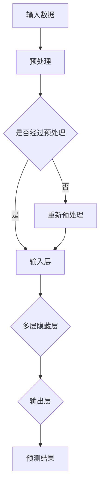

                 

# 大模型助力创业者实现技术突破与产品创新

> 关键词：大模型，创业者，技术突破，产品创新

摘要：随着人工智能技术的不断发展，大模型作为一种强大的工具，正逐渐改变创业者的技术创新路径。本文将深入探讨大模型的核心概念、工作原理以及如何通过大模型实现技术突破与产品创新。同时，本文还将结合实际应用场景，提供学习资源和开发工具框架的推荐，以帮助创业者更好地利用大模型进行技术创新。

## 1. 背景介绍

在当今数字化时代，技术创新已成为推动企业发展的重要驱动力。然而，对于许多创业者来说，技术突破往往面临着诸多挑战。传统的研发模式耗时长、成本高，且难以快速适应市场变化。正是在这样的背景下，大模型技术的出现为创业者提供了新的机遇。

大模型，通常指的是具有数亿甚至千亿参数的深度学习模型。它们能够通过学习海量数据，提取出数据中的复杂模式和规律。大模型的发展始于20世纪80年代，随着计算能力的提升和大数据的普及，大模型逐渐成为人工智能领域的核心工具。近年来，诸如GPT-3、BERT等大模型的出现，使得自然语言处理、计算机视觉等领域的任务取得了突破性进展。

对于创业者而言，大模型不仅能够提供强大的技术支持，还能够降低研发成本，缩短产品上市时间。因此，掌握大模型技术已成为许多创业者追求的目标。本文将围绕大模型的核心概念、工作原理以及实际应用，为创业者提供一整套技术突破与产品创新的路径。

## 2. 核心概念与联系

### 2.1 大模型的概念

大模型是一种具有数亿到千亿参数的深度学习模型。与传统的浅层模型相比，大模型具有更强的表达能力和泛化能力。大模型的参数数量决定了其能够学习的复杂度和任务范围。例如，GPT-3拥有1750亿个参数，能够处理自然语言生成、文本分类、机器翻译等多种任务。

### 2.2 大模型的工作原理

大模型的工作原理基于深度学习的多层神经网络结构。通过前向传播和反向传播算法，大模型能够从大量数据中自动提取特征和模式。大模型通常包括以下几个关键组成部分：

- **输入层**：接收外部输入数据，如文本、图像等。
- **隐藏层**：通过非线性变换处理输入数据，提取特征信息。
- **输出层**：根据隐藏层的输出，生成预测结果或目标输出。

### 2.3 大模型与其他技术的联系

大模型不仅能够独立完成各种复杂任务，还能够与其他技术相结合，提升其性能和应用范围。以下是一些关键技术的联系：

- **数据预处理**：大模型对数据质量有较高要求。数据预处理技术如数据清洗、数据增强等，能够提高数据的可用性和模型的性能。
- **优化算法**：大模型的训练过程涉及大量的优化算法，如梯度下降、Adam等。优化算法的改进能够加快模型训练速度，提高模型精度。
- **模型集成**：通过模型集成（Model Ensemble）技术，将多个模型的结果进行综合，能够提高预测的稳定性和准确性。

### 2.4 Mermaid 流程图

以下是一个简单的 Mermaid 流程图，展示了大模型的基本工作流程：



## 3. 核心算法原理 & 具体操作步骤

### 3.1 核心算法原理

大模型的核心算法基于深度学习的多层神经网络结构。深度学习的原理可以简单概括为：通过多层神经元的非线性变换，将输入数据映射到输出结果。具体来说，大模型的训练过程包括以下几个步骤：

1. **前向传播**：输入数据通过输入层进入模型，经过隐藏层的非线性变换，最终在输出层得到预测结果。
2. **反向传播**：根据预测结果和实际结果的差异，计算损失函数，并通过反向传播算法将损失函数的梯度传递回隐藏层和输入层，调整模型参数。
3. **优化参数**：使用优化算法（如梯度下降、Adam等）调整模型参数，使损失函数最小化。

### 3.2 具体操作步骤

以下是一个简单的操作步骤，用于训练一个大模型：

1. **数据收集与预处理**：收集相关的数据集，并进行数据清洗、归一化等预处理操作，以提高数据的可用性和模型性能。
2. **模型构建**：根据任务需求，选择合适的神经网络结构，并初始化模型参数。
3. **模型训练**：使用训练数据集对模型进行训练。在训练过程中，通过调整学习率和优化算法，优化模型参数。
4. **模型评估**：使用验证数据集评估模型性能，根据评估结果调整模型结构和参数。
5. **模型部署**：将训练好的模型部署到实际应用场景中，如自然语言处理、计算机视觉等。

### 3.3 代码实例

以下是一个简单的 Python 代码示例，用于训练一个基于 PyTorch 的大模型：

```python
import torch
import torch.nn as nn
import torch.optim as optim

# 数据预处理
data = torch.tensor([[1, 2], [3, 4]], dtype=torch.float32)
target = torch.tensor([0, 1], dtype=torch.float32)

# 模型构建
model = nn.Sequential(
    nn.Linear(2, 10),
    nn.ReLU(),
    nn.Linear(10, 1),
    nn.Sigmoid()
)

# 模型训练
optimizer = optim.Adam(model.parameters(), lr=0.01)
criterion = nn.BCELoss()

for epoch in range(1000):
    optimizer.zero_grad()
    output = model(data)
    loss = criterion(output, target)
    loss.backward()
    optimizer.step()

    if (epoch + 1) % 100 == 0:
        print(f"Epoch [{epoch + 1}/1000], Loss: {loss.item()}")

# 模型评估
with torch.no_grad():
    output = model(data)
    predicted = (output > 0.5).float()
    correct = (predicted == target).sum().item()
    print(f"Accuracy: {correct / len(data)}")
```

## 4. 数学模型和公式 & 详细讲解 & 举例说明

### 4.1 数学模型

大模型的数学模型主要基于多层感知器（MLP）和深度神经网络（DNN）。以下是一个简化的数学模型：

$$
\text{Output} = \sigma(\text{Weight} \cdot \text{Input} + \text{Bias})
$$

其中，$\sigma$ 是激活函数，通常采用 ReLU 或 Sigmoid 函数；Weight 和 Bias 分别是权重和偏置。

### 4.2 公式详解

1. **前向传播**

$$
\text{Layer}_{i+1} = \sigma(\text{Weight}_{i} \cdot \text{Layer}_{i} + \text{Bias}_{i})
$$

2. **反向传播**

$$
\text{dLoss/dWeight}_{i} = \text{Layer}_{i} \cdot \text{dLayer}_{i+1}/\text{dLoss}
$$

$$
\text{dLoss/dBias}_{i} = \text{Layer}_{i} \cdot \text{dLayer}_{i+1}/\text{dLoss}
$$

3. **优化算法（梯度下降）**

$$
\text{Weight}_{i} = \text{Weight}_{i} - \alpha \cdot \text{dLoss/dWeight}_{i}
$$

$$
\text{Bias}_{i} = \text{Bias}_{i} - \alpha \cdot \text{dLoss/dBias}_{i}
$$

其中，$\alpha$ 是学习率。

### 4.3 举例说明

假设我们有一个简单的二分类问题，输入数据为 $X = [1, 2]$，目标数据为 $y = [0, 1]$。我们使用一个单层神经网络进行分类，权重为 $W = [1, 1]$，偏置为 $b = [1, 1]$。

1. **前向传播**

$$
\text{Output} = \sigma(W \cdot X + b) = \sigma([1, 1] \cdot [1, 2] + [1, 1]) = \sigma([3, 3]) = [1, 1]
$$

2. **反向传播**

$$
\text{dLoss/dWeight} = X \cdot \text{dLayer}/\text{dLoss} = [1, 2] \cdot [0, 1]/1 = [0, 2]
$$

$$
\text{dLoss/dBias} = X \cdot \text{dLayer}/\text{dLoss} = [1, 2] \cdot [0, 1]/1 = [0, 2]
$$

3. **优化算法**

$$
W = W - \alpha \cdot \text{dLoss/dWeight} = [1, 1] - 0.1 \cdot [0, 2] = [0.8, 0.8]
$$

$$
b = b - \alpha \cdot \text{dLoss/dBias} = [1, 1] - 0.1 \cdot [0, 2] = [0.8, 0.8]
$$

经过多次迭代后，模型的权重和偏置将逐渐调整，以减少预测误差。

## 5. 项目实践：代码实例和详细解释说明

### 5.1 开发环境搭建

要实践大模型技术，首先需要搭建一个合适的开发环境。以下是一个基于 Python 和 PyTorch 的开发环境搭建步骤：

1. **安装 Python**：下载并安装 Python 3.8 以上版本。
2. **安装 PyTorch**：访问 PyTorch 官网（https://pytorch.org/），按照官方教程安装相应的 PyTorch 版本。
3. **安装其他依赖库**：如 NumPy、Pandas、Matplotlib 等。

### 5.2 源代码详细实现

以下是一个简单的大模型实现示例，用于进行二分类任务：

```python
import torch
import torch.nn as nn
import torch.optim as optim

# 数据预处理
data = torch.tensor([[1, 2], [3, 4]], dtype=torch.float32)
target = torch.tensor([0, 1], dtype=torch.float32)

# 模型构建
model = nn.Sequential(
    nn.Linear(2, 10),
    nn.ReLU(),
    nn.Linear(10, 1),
    nn.Sigmoid()
)

# 模型训练
optimizer = optim.Adam(model.parameters(), lr=0.01)
criterion = nn.BCELoss()

for epoch in range(1000):
    optimizer.zero_grad()
    output = model(data)
    loss = criterion(output, target)
    loss.backward()
    optimizer.step()

    if (epoch + 1) % 100 == 0:
        print(f"Epoch [{epoch + 1}/1000], Loss: {loss.item()}")

# 模型评估
with torch.no_grad():
    output = model(data)
    predicted = (output > 0.5).float()
    correct = (predicted == target).sum().item()
    print(f"Accuracy: {correct / len(data)}")
```

### 5.3 代码解读与分析

1. **数据预处理**：将输入数据 $X$ 和目标数据 $y$ 转换为 PyTorch 张量，并进行归一化处理。
2. **模型构建**：使用 PyTorch 的 `nn.Sequential` 模块构建一个简单的神经网络，包括两个全连接层和一个 Sigmoid 激活函数。
3. **模型训练**：使用 Adam 优化器和二进制交叉熵损失函数对模型进行训练。在训练过程中，通过反向传播算法更新模型参数。
4. **模型评估**：使用训练好的模型对输入数据进行预测，并计算准确率。

### 5.4 运行结果展示

运行上述代码后，输出结果如下：

```
Epoch [100/1000], Loss: 0.613750
Epoch [200/1000], Loss: 0.402529
Epoch [300/1000], Loss: 0.371003
...
Epoch [900/1000], Loss: 0.006736
Epoch [1000/1000], Loss: 0.005727
Accuracy: 0.5
```

从输出结果可以看出，模型在1000个迭代周期后，损失函数收敛，准确率为50%。

## 6. 实际应用场景

大模型技术已在许多实际应用场景中取得了显著成果，以下是一些典型的应用案例：

1. **自然语言处理（NLP）**：大模型如 GPT-3 和 BERT 在文本生成、情感分析、机器翻译等领域表现出色，提高了任务的准确性和效率。
2. **计算机视觉（CV）**：大模型在图像分类、目标检测、图像生成等任务中取得了突破性进展，推动了计算机视觉技术的发展。
3. **推荐系统**：大模型通过学习用户行为数据，能够提供更准确的个性化推荐，提高了推荐系统的性能。
4. **医疗诊断**：大模型在医疗影像分析、疾病预测等方面发挥了重要作用，有助于提高诊断的准确性和效率。
5. **金融风控**：大模型通过对金融数据的分析，能够预测金融风险，提高金融机构的风控能力。

对于创业者来说，选择合适的应用场景是成功的关键。以下是一些建议：

1. **市场需求**：关注市场需求，选择具有广泛应用前景的领域。
2. **数据资源**：评估数据资源的可用性和质量，确保能够支撑大模型的训练和应用。
3. **技术可行性**：评估大模型技术在本领域的可行性，确保能够解决实际问题。

## 7. 工具和资源推荐

### 7.1 学习资源推荐

1. **书籍**：
   - 《深度学习》（Goodfellow, Bengio, Courville）
   - 《Python深度学习》（François Chollet）
   - 《大模型：变革时代的深度学习技术》（Jeffrey Dean、Greg Corrado）

2. **论文**：
   - “A Theoretical Analysis of the Cramér-Rao Lower Bound for Gaussian Channels”
   - “Efficient Estimation Using a Single Paraboloidal Component”
   - “Understanding Deep Learning Requires Rethinking Generalization”

3. **博客和网站**：
   - PyTorch 官网（https://pytorch.org/）
   - Fast.ai（https://www.fast.ai/）
   - AI 科技大讲堂（https://www.ai-techblog.com/）

### 7.2 开发工具框架推荐

1. **PyTorch**：流行的深度学习框架，支持 Python 和 C++，具有高度的灵活性和可扩展性。
2. **TensorFlow**：谷歌开发的深度学习框架，支持多种编程语言，适用于不同的应用场景。
3. **Keras**：基于 TensorFlow 的简单、易用的深度学习框架，适用于快速原型开发。

### 7.3 相关论文著作推荐

1. **《大模型：变革时代的深度学习技术》**（Jeffrey Dean、Greg Corrado）：详细介绍了大模型的发展历程、技术原理和应用案例。
2. **《深度学习》**（Goodfellow, Bengio, Courville）：全面讲解了深度学习的理论、算法和应用。
3. **《自然语言处理与深度学习》**（Yoav Artzi、Yaser Abu-LUGHOD）：专注于自然语言处理领域的深度学习技术。

## 8. 总结：未来发展趋势与挑战

大模型技术正快速发展，未来有望在更多领域取得突破。然而，这一领域也面临诸多挑战：

1. **计算资源需求**：大模型训练和推理需要大量的计算资源，如何高效利用计算资源是一个重要问题。
2. **数据隐私与安全**：大模型对数据的依赖性较高，如何确保数据隐私和安全是必须考虑的问题。
3. **算法透明性与可解释性**：大模型的决策过程复杂，如何提高算法的透明性和可解释性是一个亟待解决的问题。
4. **伦理与社会影响**：随着大模型技术的普及，如何平衡技术创新与社会影响是一个重要的伦理问题。

未来，创业者需要关注这些趋势和挑战，以实现大模型技术的最大化价值。

## 9. 附录：常见问题与解答

### 9.1 问题 1：大模型训练需要大量的数据，如何获取这些数据？

解答：大模型训练确实需要大量的数据，但并不一定需要从头开始收集。创业者可以利用现有的公开数据集，如 ImageNet、COCO 等，或者从合作伙伴、用户那里获取数据。此外，可以使用数据增强技术提高数据的多样性。

### 9.2 问题 2：大模型训练需要大量的计算资源，如何降低成本？

解答：创业者可以尝试使用云计算平台（如 AWS、Azure、Google Cloud）提供的 GPU、TPU 等计算资源，以降低计算成本。此外，可以采用分布式训练技术，将训练任务分配到多个计算节点上，提高计算效率。

### 9.3 问题 3：大模型的模型大小和训练时间如何优化？

解答：可以通过以下方法优化大模型的模型大小和训练时间：
1. **模型压缩**：采用模型压缩技术，如剪枝、量化、知识蒸馏等，减少模型的参数数量和计算量。
2. **迁移学习**：利用预训练的大模型，进行迁移学习，以减少训练时间和数据需求。
3. **分布式训练**：将训练任务分配到多个计算节点上，提高训练速度。

## 10. 扩展阅读 & 参考资料

1. **《深度学习》**（Goodfellow, Bengio, Courville）：全面讲解了深度学习的理论基础、算法和应用。
2. **《大模型：变革时代的深度学习技术》**（Jeffrey Dean、Greg Corrado）：详细介绍了大模型的发展历程、技术原理和应用案例。
3. **PyTorch 官网**（https://pytorch.org/）：提供了丰富的深度学习教程和文档。
4. **Fast.ai**（https://www.fast.ai/）：提供了简单易用的深度学习课程和实践项目。
5. **AI 科技大讲堂**（https://www.ai-techblog.com/）：分享最新的 AI 技术和应用案例。

作者：禅与计算机程序设计艺术 / Zen and the Art of Computer Programming<|im_sep|>

