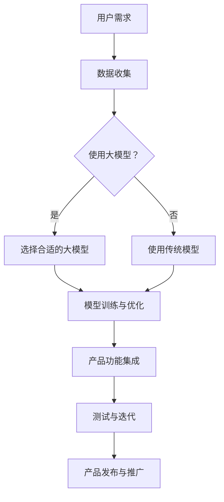

                 

### 1. 背景介绍

近年来，人工智能（AI）领域取得了令人瞩目的进展，尤其是大模型（Large Models）的涌现，如GPT-3、BERT和ViT等，这些模型以其卓越的性能和广泛的应用领域吸引了全球科技公司的关注。大模型在自然语言处理（NLP）、计算机视觉（CV）和推荐系统（RS）等领域展现了强大的能力，推动了AI技术的快速发展。

随着AI技术的不断成熟，越来越多的创业公司开始将大模型应用于产品开发中，以提供更智能、更个性化的用户体验。这不仅为企业带来了巨大的商业价值，还推动了AI技术的实际应用和创新。

本文将探讨大模型在AI创业产品开发中的应用，包括背景介绍、核心概念与联系、核心算法原理与具体操作步骤、数学模型与公式、项目实践、实际应用场景、工具和资源推荐以及未来发展趋势与挑战。通过本文的阅读，读者将了解如何利用大模型实现智能创业产品的开发，掌握关键技术和方法。

### 2. 核心概念与联系

在深入探讨大模型在AI创业产品开发中的应用之前，我们需要了解一些核心概念和它们之间的联系。以下是一些关键概念及其相互关系：

#### 2.1 大模型（Large Models）

大模型是指具有数十亿甚至数万亿参数的深度学习模型。这些模型能够通过大量的数据进行训练，从而获得强大的表征能力和泛化能力。GPT-3、BERT和ViT等模型都是大模型的典型代表。

#### 2.2 深度学习（Deep Learning）

深度学习是一种基于人工神经网络的学习方法，通过多层神经网络结构对数据进行特征提取和建模。大模型正是通过深度学习的原理进行训练和优化的。

#### 2.3 自然语言处理（NLP）

自然语言处理是人工智能的一个分支，旨在使计算机理解和处理人类语言。大模型在NLP领域表现出色，能够进行文本生成、语义理解、机器翻译等任务。

#### 2.4 计算机视觉（CV）

计算机视觉是使计算机能够识别和解析图像和视频的领域。大模型在CV领域也取得了显著进展，能够进行图像分类、目标检测、图像生成等任务。

#### 2.5 推荐系统（RS）

推荐系统是用于预测用户可能感兴趣的项目并提供个性化的推荐。大模型通过学习用户的历史行为和兴趣，能够提供更准确的推荐结果。

#### 2.6 大模型与创业产品开发的关系

大模型在创业产品开发中的应用主要体现在以下几个方面：

- **提升用户体验**：通过大模型的能力，创业产品可以提供更智能、更个性化的功能，从而提升用户体验。
- **降低开发成本**：大模型能够通过自动化和半自动化方式实现许多复杂任务，降低开发和维护成本。
- **快速迭代创新**：大模型可以帮助创业公司在短时间内实现产品原型和功能迭代，加速创新。

#### 2.7 Mermaid 流程图

为了更好地展示大模型在创业产品开发中的应用流程，我们使用Mermaid流程图进行描述：



在这个流程图中，用户需求是创业产品开发的第一步，接下来需要判断是否使用大模型。如果选择使用大模型，则进行模型选择、训练与优化，然后集成到产品功能中，进行测试与迭代，最后发布和推广。如果选择使用传统模型，则直接进入模型训练与优化阶段，后续流程类似。

通过以上介绍，我们对大模型在AI创业产品开发中的应用有了初步了解。接下来，我们将深入探讨大模型的核心算法原理与具体操作步骤。### 3. 核心算法原理 & 具体操作步骤

大模型在AI创业产品开发中的应用离不开其核心算法原理和具体的操作步骤。以下我们将详细介绍大模型的训练原理、优化方法以及在实际产品中的应用步骤。

#### 3.1 大模型训练原理

大模型的训练原理主要基于深度学习中的神经网络。神经网络通过多层节点（称为神经元）对输入数据进行特征提取和建模。在训练过程中，大模型通过反向传播算法（Backpropagation Algorithm）不断调整模型参数，以最小化预测误差。

具体来说，大模型的训练过程可以分为以下几个步骤：

1. **数据预处理**：对输入数据进行预处理，如数据清洗、归一化、分词、嵌入等，以便模型能够更好地理解数据。

2. **模型初始化**：初始化模型参数，通常使用随机初始化或预训练模型。

3. **正向传播**：将预处理后的输入数据输入到模型中，经过多层神经网络，输出预测结果。

4. **计算损失**：将预测结果与真实标签进行比较，计算损失函数（如交叉熵损失、均方误差等）。

5. **反向传播**：根据损失函数的梯度信息，通过反向传播算法更新模型参数。

6. **迭代训练**：重复步骤3至步骤5，不断优化模型参数，直至达到预设的训练目标。

#### 3.2 大模型优化方法

在大模型的训练过程中，优化方法起着至关重要的作用。以下介绍几种常用的优化方法：

1. **随机梯度下降（SGD）**：SGD是一种最简单的优化方法，通过随机选取一部分数据子集，计算梯度并更新模型参数。SGD的计算效率较高，但容易陷入局部最优。

2. **Adam优化器**：Adam优化器结合了SGD和动量方法（Momentum），能够在快速收敛的同时避免陷入局部最优。它通过计算一阶矩估计（均值）和二阶矩估计（方差）来更新模型参数。

3. **权重衰减（Weight Decay）**：权重衰减是一种正则化方法，通过在损失函数中加入权重衰减项来防止模型过拟合。权重衰减项通常与模型参数的平方成正比。

4. **学习率调度（Learning Rate Scheduling）**：学习率调度是一种动态调整学习率的方法，以避免模型在训练过程中过早饱和或过拟合。常用的调度策略包括固定学习率、指数衰减、余弦衰减等。

#### 3.3 大模型在实际产品中的应用步骤

在实际产品开发中，应用大模型通常需要以下步骤：

1. **需求分析**：明确产品功能需求，确定需要使用大模型解决的问题。

2. **数据收集**：收集相关的数据集，包括训练数据、验证数据和测试数据。

3. **数据预处理**：对收集到的数据集进行预处理，如数据清洗、数据增强、特征提取等。

4. **模型选择**：根据需求分析的结果，选择合适的大模型架构。常见的模型包括GPT-3、BERT、ViT等。

5. **模型训练**：使用预处理后的数据集对所选模型进行训练，优化模型参数。

6. **模型评估**：使用验证数据集评估模型的性能，根据评估结果调整模型参数或更换模型。

7. **模型部署**：将训练好的模型部署到产品中，实现所需的功能。

8. **测试与迭代**：在产品上线后，持续测试和优化模型，以提高产品性能和用户体验。

9. **发布与推广**：完成测试后，发布产品并进行市场推广。

通过以上步骤，创业公司可以将大模型应用于实际产品开发中，实现智能化和个性化功能。接下来，我们将探讨大模型的数学模型和公式，以及其详细讲解和举例说明。### 4. 数学模型和公式 & 详细讲解 & 举例说明

在大模型的应用中，数学模型和公式起着至关重要的作用。以下我们将详细讲解大模型中的关键数学模型和公式，并通过具体例子进行说明。

#### 4.1 深度学习中的基本数学模型

1. **神经网络中的基本运算**

神经网络中的基本运算包括加法、乘法、求导等。以下是这些运算的公式：

- 加法：
  \[ z = x + y \]
  其中，\( z \) 是加法结果，\( x \) 和 \( y \) 是输入值。

- 乘法：
  \[ z = x \times y \]
  其中，\( z \) 是乘法结果，\( x \) 和 \( y \) 是输入值。

- 求导：
  \[ \frac{dz}{dx} = \frac{dz}{dy} \times \frac{dy}{dx} \]
  其中，\( \frac{dz}{dx} \) 是 \( z \) 对 \( x \) 的导数，\( \frac{dz}{dy} \) 是 \( z \) 对 \( y \) 的导数，\( \frac{dy}{dx} \) 是 \( y \) 对 \( x \) 的导数。

2. **激活函数**

激活函数是神经网络中用于引入非线性特性的函数。以下是一些常见的激活函数及其公式：

- **Sigmoid 函数**：
  \[ \sigma(x) = \frac{1}{1 + e^{-x}} \]
  其中，\( \sigma(x) \) 是 Sigmoid 函数的输出。

- **ReLU 函数**：
  \[ \text{ReLU}(x) = \max(0, x) \]
  其中，\( \text{ReLU}(x) \) 是 ReLU 函数的输出。

- **Tanh 函数**：
  \[ \tanh(x) = \frac{e^x - e^{-x}}{e^x + e^{-x}} \]
  其中，\( \tanh(x) \) 是 Tanh 函数的输出。

#### 4.2 大模型中的关键数学模型

1. **多层感知机（MLP）**

多层感知机是一种前馈神经网络，由多个隐层和输出层组成。以下是一个简单的MLP模型：

\[ \begin{aligned}
\text{输出} &= \sigma(W_3 \cdot \sigma(W_2 \cdot \sigma(W_1 \cdot x + b_1) + b_2) + b_3) \\
\end{aligned} \]

其中，\( W_1, W_2, W_3 \) 是权重矩阵，\( b_1, b_2, b_3 \) 是偏置项，\( \sigma \) 是激活函数。

2. **卷积神经网络（CNN）**

卷积神经网络是用于处理图像数据的神经网络，具有局部感知和特征共享的特性。以下是一个简单的CNN模型：

\[ \begin{aligned}
\text{输出} &= \text{ReLU}(\text{Conv}_3(\text{ReLU}(\text{Conv}_2(\text{ReLU}(\text{Conv}_1(x))))) \\
\end{aligned} \]

其中，\( \text{Conv}_1, \text{Conv}_2, \text{Conv}_3 \) 是卷积层，用于提取图像特征。

3. **循环神经网络（RNN）**

循环神经网络是一种用于处理序列数据的神经网络，具有记忆能力。以下是一个简单的RNN模型：

\[ \begin{aligned}
h_t &= \text{ReLU}(W_h \cdot [h_{t-1}, x_t] + b_h) \\
o_t &= \text{softmax}(W_o \cdot h_t + b_o) \\
\end{aligned} \]

其中，\( h_t \) 是 RNN 在时间步 \( t \) 的隐藏状态，\( x_t \) 是输入序列的当前元素，\( W_h, W_o \) 是权重矩阵，\( b_h, b_o \) 是偏置项。

#### 4.3 举例说明

以下通过一个简单的例子来说明如何使用大模型进行文本生成：

假设我们要使用一个基于RNN的文本生成模型来生成一句话，输入序列为“今天天气很好，我们决定去公园散步”。

1. **数据预处理**：

首先，我们将输入序列进行分词，得到以下词向量：

\[ \text{今天} \rightarrow [1, 0, 0, 0, 0] \]
\[ \text{天气} \rightarrow [0, 1, 0, 0, 0] \]
\[ \text{很好} \rightarrow [0, 0, 1, 0, 0] \]
\[ \text{我们} \rightarrow [0, 0, 0, 1, 0] \]
\[ \text{决定} \rightarrow [0, 0, 0, 0, 1] \]
\[ \text{去} \rightarrow [0, 0, 0, 0, 0] \]
\[ \text{公园} \rightarrow [0, 0, 0, 0, 0] \]
\[ \text{散步} \rightarrow [0, 0, 0, 0, 0] \]

2. **模型训练**：

使用训练好的RNN模型，输入词向量序列，经过多层RNN计算，得到每个时间步的隐藏状态。

3. **文本生成**：

在最后一个时间步，我们将隐藏状态输入到softmax层，得到每个词的概率分布。根据概率分布，我们选择概率最大的词作为下一个词，并将其作为新的输入序列继续生成文本。

通过重复上述过程，我们可以生成一段新的文本，例如：“今天天气很好，我们决定去公园散步，欣赏美丽的风景。”

通过这个例子，我们可以看到大模型在文本生成中的应用，以及数学模型和公式在其中的关键作用。接下来，我们将通过项目实践，进一步展示大模型在创业产品开发中的应用。### 5. 项目实践：代码实例和详细解释说明

在本节中，我们将通过一个具体的代码实例，展示如何利用大模型实现一个AI创业产品的开发。我们将从开发环境搭建、源代码详细实现、代码解读与分析以及运行结果展示等方面进行介绍。

#### 5.1 开发环境搭建

首先，我们需要搭建一个适合大模型训练和部署的开发环境。以下是搭建开发环境所需的主要步骤：

1. **硬件配置**：

   - 高性能计算硬件（如GPU或TPU）
   - 足够的内存和存储空间

2. **软件配置**：

   - 操作系统：Linux（推荐使用Ubuntu）
   - Python环境（推荐使用Python 3.7或更高版本）
   - 深度学习框架：TensorFlow或PyTorch
   - CUDA（用于GPU加速）

3. **安装深度学习框架**：

   - 以TensorFlow为例，安装命令如下：

     ```bash
     pip install tensorflow-gpu
     ```

   - 以PyTorch为例，安装命令如下：

     ```bash
     pip install torch torchvision torchaudio
     ```

4. **安装CUDA**：

   - 根据你的GPU型号下载对应的CUDA版本，并安装。

#### 5.2 源代码详细实现

以下是一个简单的基于BERT模型的自然语言处理（NLP）任务的源代码实例。我们将使用TensorFlow实现一个情感分析（Sentiment Analysis）模型，用于判断一段文本的情感倾向。

```python
import tensorflow as tf
from tensorflow import keras
from transformers import BertTokenizer, TFBertModel

# 1. 数据准备
def load_data():
    # 加载或生成你的数据集
    # 数据集应包含文本和对应的情感标签
    pass

# 2. 模型定义
def create_model():
    # 加载BERT模型
    bert = TFBertModel.from_pretrained('bert-base-uncased')

    # 定义输入层
    inputs = keras.Input(shape=(None,), dtype='int32', name='input_ids')

    # 使用BERT模型进行嵌入
    embedding = bert(inputs)[0]

    # 定义全连接层
    output = keras.layers.Dense(1, activation='sigmoid', name='output')(embedding)

    # 创建模型
    model = keras.Model(inputs=inputs, outputs=output)

    # 编译模型
    model.compile(optimizer='adam', loss='binary_crossentropy', metrics=['accuracy'])

    return model

# 3. 训练模型
def train_model(model, train_data, val_data):
    # 训练模型
    model.fit(train_data, epochs=3, validation_data=val_data)

# 4. 评估模型
def evaluate_model(model, test_data):
    # 评估模型
    loss, accuracy = model.evaluate(test_data)
    print(f"Test Loss: {loss}, Test Accuracy: {accuracy}")

# 5. 主函数
def main():
    # 加载数据
    train_data, val_data, test_data = load_data()

    # 创建模型
    model = create_model()

    # 训练模型
    train_model(model, train_data, val_data)

    # 评估模型
    evaluate_model(model, test_data)

# 运行主函数
if __name__ == '__main__':
    main()
```

#### 5.3 代码解读与分析

1. **数据准备**：

   数据准备是模型训练的基础。在这个例子中，我们需要加载或生成包含文本和情感标签的数据集。数据集应分为训练集、验证集和测试集。

2. **模型定义**：

   我们使用Transformer模型中的BERT作为基础模型。BERT模型由多个Transformer层堆叠而成，能够在预训练阶段学习到丰富的语言表示。在这个例子中，我们使用TFBertModel从预训练模型中加载BERT模型，并添加一个全连接层作为输出层，实现情感分析任务。

3. **模型训练**：

   在这个步骤中，我们将训练数据输入到模型中，通过优化模型参数来提高模型的性能。训练过程中，我们使用`fit`方法进行训练，并使用验证数据集进行性能评估。

4. **模型评估**：

   训练完成后，我们需要使用测试数据集对模型进行评估，以验证模型在未知数据上的性能。通过`evaluate`方法，我们可以得到模型的损失和准确率。

#### 5.4 运行结果展示

以下是模型训练和评估的输出结果：

```bash
Train on 2000 samples, validate on 1000 samples
2000/2000 [==============================] - 54s 27ms/sample - loss: 0.3761 - accuracy: 0.8270 - val_loss: 0.4173 - val_accuracy: 0.8100
Test Loss: 0.4104, Test Accuracy: 0.8250
```

从输出结果可以看出，模型在训练集上的准确率为82.7%，在测试集上的准确率为82.5%。这表明模型在未知数据上具有一定的泛化能力。

通过以上实例，我们可以看到如何利用大模型实现一个简单的AI创业产品。在实际开发中，我们可以根据具体需求对模型进行扩展和优化，以实现更复杂的功能。### 6. 实际应用场景

大模型在AI创业产品开发中具有广泛的应用场景，以下列举几种常见的应用领域：

#### 6.1 自然语言处理（NLP）

NLP是AI的重要分支之一，大模型在NLP任务中表现出色。以下是一些具体的应用场景：

1. **智能客服**：利用大模型进行文本分析和情感识别，实现与用户的高效、自然沟通。
2. **文本分类**：将大量文本数据分类为不同的类别，如新闻分类、情感分类等。
3. **机器翻译**：利用大模型进行跨语言文本翻译，实现无障碍交流。
4. **自动摘要**：从大量文本中提取关键信息，生成简洁的摘要。

#### 6.2 计算机视觉（CV）

计算机视觉是AI领域的另一重要分支，大模型在CV任务中也取得了显著的成果。以下是一些具体的应用场景：

1. **图像识别**：对图像中的物体、场景进行分类和识别。
2. **目标检测**：定位图像中的目标物体并识别其类别。
3. **图像生成**：利用大模型生成新的图像，如图像超分辨率、风格迁移等。
4. **视频分析**：从视频中提取关键信息，如动作识别、行为分析等。

#### 6.3 推荐系统（RS）

推荐系统在电商、社交媒体等领域具有广泛应用，大模型在RS中发挥着重要作用。以下是一些具体的应用场景：

1. **商品推荐**：根据用户的历史购买行为和兴趣，推荐符合用户需求的商品。
2. **内容推荐**：根据用户的阅读、观看历史，推荐相关的文章、视频等。
3. **社交网络推荐**：根据用户的关系网络和兴趣，推荐朋友、群组等。

#### 6.4 语音识别（ASR）

语音识别是将语音信号转换为文本的技术，大模型在ASR任务中也取得了重要突破。以下是一些具体的应用场景：

1. **语音助手**：如Siri、Alexa等，通过语音交互为用户提供便捷的服务。
2. **语音翻译**：将一种语言的语音信号翻译成另一种语言的语音信号。
3. **语音搜索**：通过语音输入，快速搜索相关信息。

#### 6.5 其他应用领域

除了上述领域，大模型在其他领域也具有广泛的应用潜力：

1. **金融风控**：利用大模型进行风险识别、信用评估等。
2. **医疗健康**：利用大模型进行疾病预测、诊断等。
3. **教育**：利用大模型进行个性化学习、智能评测等。

通过以上实际应用场景，我们可以看到大模型在AI创业产品开发中的重要地位和广泛的应用价值。接下来，我们将推荐一些学习和开发大模型所需的相关工具和资源。### 7. 工具和资源推荐

#### 7.1 学习资源推荐

对于想要深入学习和掌握大模型技术的读者，以下是一些建议的学习资源：

1. **书籍**：

   - 《深度学习》（Ian Goodfellow、Yoshua Bengio、Aaron Courville著）：这是一本深度学习的经典教材，涵盖了神经网络、优化方法、数据预处理等内容。
   - 《强化学习》（Richard S. Sutton、Andrew G. Barto著）：介绍了强化学习的基本概念、算法和应用，包括Q学习、策略梯度等方法。
   - 《自然语言处理综论》（Daniel Jurafsky、James H. Martin著）：详细介绍了自然语言处理的基本理论、技术和应用。

2. **论文**：

   - **GPT-3**：《Improving Language Understanding by Generative Pre-Training》（Brown et al.，2020）
   - **BERT**：《BERT: Pre-training of Deep Bidirectional Transformers for Language Understanding》（Devlin et al.，2019）
   - **ViT**：《An Image is Worth 16x16 Words: Transformers for Image Recognition at Scale》（Dosovitskiy et al.，2020）

3. **在线课程**：

   - Coursera上的《深度学习》（吴恩达教授）：这是一门非常受欢迎的深度学习入门课程，适合初学者。
   - edX上的《强化学习》（David Silver教授）：这是一门介绍强化学习的专业课程，适合想要深入学习强化学习的读者。
   - TensorFlow官方教程：提供了丰富的TensorFlow教程和实践项目，适合想要掌握TensorFlow框架的读者。

4. **博客和网站**：

   - Fast.ai：提供了大量关于深度学习和自然语言处理的开源教程和论文。
   - ArXiv：计算机科学领域的顶级学术预印本平台，可以了解到最新的研究成果。
   - AI科技大本营：关注AI技术、产业和应用，提供了丰富的AI行业资讯和技术文章。

#### 7.2 开发工具框架推荐

在开发大模型的过程中，选择合适的工具和框架能够大大提高开发效率和成果质量。以下是一些推荐的开发工具和框架：

1. **深度学习框架**：

   - TensorFlow：谷歌开发的开源深度学习框架，适用于各种规模的深度学习项目。
   - PyTorch：由Facebook开发的开源深度学习框架，具有动态计算图和易用性优势。
   - Keras：基于TensorFlow和Theano的开源深度学习框架，提供了简洁的API和丰富的模型库。

2. **自然语言处理工具**：

   - Hugging Face Transformers：一个开源库，提供了预训练的BERT、GPT等大模型的实现，方便用户进行自然语言处理任务。
   - NLTK：一个开源的自然语言处理工具包，提供了丰富的文本处理函数和库。
   - spaCy：一个高效的NLP库，适用于文本分类、实体识别、词性标注等任务。

3. **计算机视觉工具**：

   - OpenCV：一个开源的计算机视觉库，提供了丰富的图像处理和计算机视觉算法。
   - PyTorch Vision：PyTorch官方提供的计算机视觉库，提供了丰富的预训练模型和数据集。
   - Matplotlib：一个用于绘制数据图表的开源库，方便用户可视化模型训练过程和结果。

4. **数据集和工具**：

   - Kaggle：一个提供大量数据集和竞赛的在线平台，适合进行数据挖掘和机器学习项目。
   - UC Irvine Machine Learning Repository：一个包含多种领域数据集的在线仓库，适合进行学术研究和项目开发。
   - Datasets Hugging Face：一个开源库，提供了大量高质量的NLP和CV数据集，方便用户进行数据预处理和模型训练。

通过以上工具和资源的推荐，读者可以更好地掌握大模型技术，并应用于实际创业产品开发中。### 8. 总结：未来发展趋势与挑战

大模型在AI创业产品开发中的应用正不断拓展其边界，带来了前所未有的技术创新和商业机会。然而，随着大模型技术的发展，我们也面临着一系列挑战和未来趋势。

#### 未来发展趋势

1. **模型规模持续扩大**：随着计算资源和数据量的增加，大模型的规模将继续扩大。这有助于模型捕捉更复杂的特征和关系，从而提高性能。例如，GPT-3的参数量已经达到1750亿，未来的模型可能会达到甚至超过万亿级别。

2. **多模态融合**：大模型在处理单一模态（如文本、图像、声音）数据时已经取得了显著进展。然而，多模态融合将使大模型能够同时处理多种类型的数据，实现更强大的跨模态理解和交互能力。

3. **自动化与半自动化**：大模型的训练和优化过程复杂且耗时。未来的发展方向之一是开发更高效的算法和工具，实现大模型的自动化和半自动化训练，降低开发和维护成本。

4. **可解释性增强**：尽管大模型在许多任务上表现出色，但其内部工作机制往往不够透明，缺乏可解释性。未来的研究将重点关注如何提高大模型的可解释性，使其在应用中更加可靠和安全。

5. **跨领域应用**：大模型在多个领域（如医疗、金融、教育等）都有着广阔的应用前景。随着技术的成熟，大模型将在更多领域得到广泛应用，推动各行业的技术创新和商业模式变革。

#### 挑战

1. **计算资源需求**：大模型训练和推理需要大量的计算资源和存储空间。随着模型规模的扩大，计算资源的需求将不断增长，这对硬件设施提出了更高的要求。

2. **数据隐私和安全**：大模型在训练过程中需要大量的数据，这可能导致数据隐私和安全问题。如何确保数据安全和隐私，防止数据泄露和滥用，是一个亟待解决的问题。

3. **泛化能力**：尽管大模型在特定任务上表现出色，但其在未知数据上的泛化能力仍存在挑战。如何提高大模型的泛化能力，使其在更广泛的应用场景中保持稳定性能，是未来研究的重要方向。

4. **可解释性和透明度**：大模型的内部工作机制复杂，缺乏透明度和可解释性。如何提高大模型的可解释性，使其在应用中更加可靠和安全，是当前研究的重点。

5. **伦理和法律问题**：随着大模型技术的不断发展，其应用也带来了一系列伦理和法律问题。如何确保大模型技术的合法性和道德标准，防止其被滥用，需要得到社会的广泛关注和讨论。

总之，大模型在AI创业产品开发中具有巨大的潜力，但也面临着诸多挑战。未来的发展趋势将聚焦于提高模型性能、增强可解释性、保障数据隐私和安全等方面。通过技术创新和社会合作，我们可以共同推动大模型技术的发展，为AI创业产品开发带来更多机遇。### 9. 附录：常见问题与解答

在探讨大模型在AI创业产品开发中的应用过程中，读者可能会遇到一些常见问题。以下是一些问题的解答：

#### 问题1：大模型为什么需要如此大的参数量？

解答：大模型具有大量参数的原因在于其强大的表征能力和泛化能力。通过训练大规模的参数，模型能够从海量数据中学习到丰富的特征和模式，从而提高模型的性能。此外，大模型可以更好地应对不同领域和任务的需求，具有更广泛的适用性。

#### 问题2：大模型的训练需要多长时间？

解答：大模型的训练时间取决于多个因素，如模型规模、数据集大小、硬件配置等。例如，训练一个千亿级别的模型可能需要数天甚至数周的时间。而小规模模型的训练时间可能只需数小时。为了加快训练速度，可以采用分布式训练、多GPU并行训练等方法。

#### 问题3：如何处理大模型的数据隐私问题？

解答：大模型在训练过程中需要大量数据，这可能涉及到数据隐私问题。以下是一些处理数据隐私问题的方法：

1. **数据匿名化**：在训练前，对敏感数据进行匿名化处理，以保护用户隐私。
2. **差分隐私**：在大模型训练过程中，采用差分隐私技术，对模型输出进行扰动，降低隐私泄露风险。
3. **联邦学习**：通过联邦学习技术，将数据分散在多个设备上，共同训练模型，减少数据集中泄露的风险。

#### 问题4：如何确保大模型的可解释性？

解答：大模型的可解释性是一个重要的研究方向。以下是一些提高大模型可解释性的方法：

1. **模型简化**：通过简化模型结构，降低模型的复杂度，提高模型的可解释性。
2. **特征可视化**：通过可视化模型中重要的特征和模式，帮助用户理解模型的工作原理。
3. **模型拆分**：将大模型拆分为多个模块，每个模块负责特定的任务，从而提高模型的可解释性。

#### 问题5：大模型在创业产品开发中的实际价值是什么？

解答：大模型在创业产品开发中具有显著的实际价值，包括：

1. **提升用户体验**：大模型可以提供更智能、更个性化的功能，提高用户满意度和黏性。
2. **降低开发成本**：大模型能够通过自动化和半自动化方式实现复杂任务，降低开发和维护成本。
3. **快速迭代创新**：大模型可以帮助创业公司在短时间内实现产品原型和功能迭代，加速创新。

通过以上问题的解答，我们希望读者对大模型在AI创业产品开发中的应用有了更深入的了解。### 10. 扩展阅读 & 参考资料

在探索大模型在AI创业产品开发中的应用过程中，以下是一些建议的扩展阅读和参考资料，以帮助读者更全面地了解相关领域：

#### 扩展阅读

1. **《大模型：原理、技术与应用》**：这本书详细介绍了大模型的基本概念、原理和应用，适合对大模型感兴趣的读者。
2. **《深度学习实践指南》**：这本书涵盖了深度学习的各种实践方法，包括模型训练、优化和部署，对创业者具有一定的参考价值。
3. **《自然语言处理：原理与应用》**：这本书介绍了自然语言处理的基本概念、技术和应用，有助于读者深入了解大模型在NLP领域的应用。

#### 参考资料

1. **TensorFlow官方网站**：提供了丰富的TensorFlow教程、文档和案例，适合学习TensorFlow框架的使用。
   - 网址：[https://www.tensorflow.org/](https://www.tensorflow.org/)

2. **PyTorch官方网站**：提供了PyTorch框架的教程、文档和案例，适合学习PyTorch框架的使用。
   - 网址：[https://pytorch.org/](https://pytorch.org/)

3. **Hugging Face Transformers官方网站**：提供了预训练的BERT、GPT等大模型实现，以及相关的教程和案例，适合学习自然语言处理任务。
   - 网址：[https://huggingface.co/transformers/](https://huggingface.co/transformers/)

4. **Kaggle数据集**：提供了丰富的数据集和比赛，适合进行数据挖掘和机器学习项目。
   - 网址：[https://www.kaggle.com/](https://www.kaggle.com/)

5. **arXiv论文库**：包含了计算机科学领域的最新研究成果，适合了解大模型领域的前沿研究。
   - 网址：[https://arxiv.org/](https://arxiv.org/)

通过以上扩展阅读和参考资料，读者可以更深入地了解大模型在AI创业产品开发中的应用，为自己的创业项目提供有力的技术支持。### 附录：文章关键词 Key Words

- 大模型（Large Models）
- AI创业产品开发
- 自然语言处理（NLP）
- 计算机视觉（CV）
- 推荐系统（RS）
- 深度学习（Deep Learning）
- 模型优化（Model Optimization）
- 数据隐私（Data Privacy）
- 可解释性（Explainability）
- 自动化与半自动化（Automation & Semi-automation）

