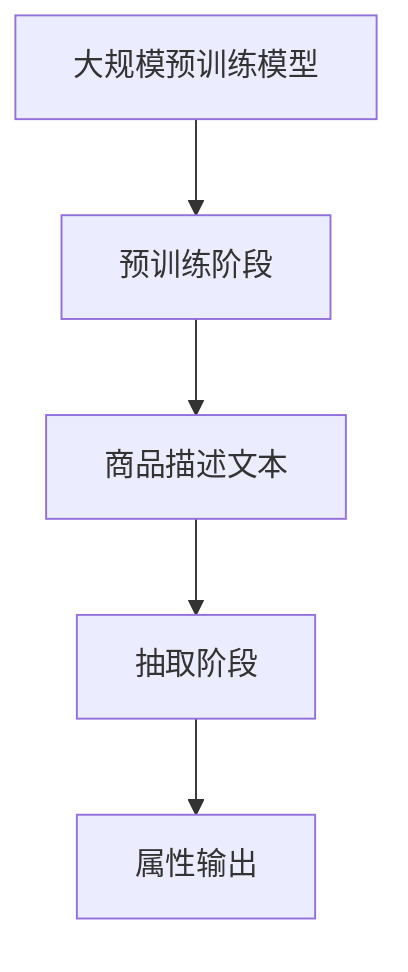

                 
# 大模型在商品属性抽取中的应用

> 关键词：大模型、商品属性抽取、BERT、CRF、预训练、自然语言处理

> 摘要：本文探讨了如何利用大规模预训练模型，如BERT和CRF，应用于商品属性抽取，以提高抽取效率和准确性，并展望了未来的发展趋势和挑战。


随着互联网和电子商务的快速发展，商品数据量呈指数级增长。如何有效地从海量商品数据中提取出准确的商品属性，已经成为企业和研究人员关注的焦点。传统的商品属性抽取方法往往依赖于人工规则或简单的机器学习模型，存在效率低下、准确性不高等问题。近年来，大规模预训练模型（Large-scale Pre-trained Models）如BERT、GPT-3等，以其强大的语义理解能力和自适应能力，在自然语言处理领域取得了显著的成果。本文将探讨如何将大模型应用于商品属性抽取，从而提升抽取效率和准确性。

## 1. 背景介绍

商品属性抽取（Product Attribute Extraction，简称PAE）是指从商品描述文本中识别并提取出商品的各项属性，如品牌、价格、颜色、尺寸等。这一过程对于电子商务平台具有重要意义，不仅可以帮助用户快速找到所需商品，还可以为平台推荐系统提供关键数据支持。

传统的商品属性抽取方法主要分为规则匹配和机器学习两种。规则匹配方法依赖于预定义的规则库，适用于结构化数据，但在面对复杂、非结构化数据时，效率低下且难以扩展。机器学习方法如条件随机字段（CRF）、支持向量机（SVM）等，通过学习文本特征实现属性抽取，但需要大量标注数据，且对噪声敏感。

随着深度学习技术的发展，尤其是大规模预训练模型的出现，商品属性抽取方法得到了极大的改进。大模型如BERT、GPT-3等，通过在大量无标签数据上进行预训练，获得了强大的语义理解能力。这一特性使得大模型在商品属性抽取中具有显著优势。

## 2. 核心概念与联系

### 2.1 大规模预训练模型

大规模预训练模型是指通过在互联网上的大量文本数据进行预训练，从而获得通用语言表示能力的深度学习模型。这些模型通常包含数十亿个参数，能够自动学习语言中的语义和结构信息。BERT、GPT-3等都是典型的代表。

### 2.2 商品属性抽取

商品属性抽取的目标是从商品描述文本中识别并提取出商品的不同属性。这通常需要模型理解商品描述中的上下文信息，从而准确地定位属性。

### 2.3 大模型与商品属性抽取的关系

大模型通过预训练获得了强大的语义理解能力，能够处理复杂的商品描述文本。在商品属性抽取中，大模型可以利用其语义理解能力，识别出文本中的属性词，并定位属性的范围。

### 2.4 Mermaid 流程图



## 3. 核心算法原理 & 具体操作步骤

### 3.1 核心算法原理

大模型在商品属性抽取中的核心算法原理主要基于其强大的语义理解能力。具体来说，大模型通过预训练阶段学习了大量的语言模式，能够将商品描述文本中的词汇映射到高维语义空间，从而实现属性识别。

### 3.2 具体操作步骤

1. **数据预处理**：首先对商品描述文本进行预处理，包括分词、去停用词、词性标注等，以便大模型能够更好地理解文本。

2. **模型输入**：将预处理后的商品描述文本输入到大模型中。大模型将自动处理文本，提取出关键信息。

3. **属性识别**：通过大模型的输出，识别出商品描述文本中的属性词。这通常需要结合后处理技术，如规则匹配、实体识别等。

4. **属性定位**：确定属性的范围，即将属性词与其对应的属性值连接起来。这通常需要利用上下文信息进行判断。

5. **属性输出**：将识别出的属性及其值输出，供后续使用。

## 4. 数学模型和公式 & 详细讲解 & 举例说明

### 4.1 数学模型和公式

大模型的商品属性抽取过程涉及多个数学模型。以下是其中两个核心模型：

1. **BERT 模型**：

   BERT 模型是一种基于 Transformer 的预训练模型。其输入是一个单词序列，输出是一个固定长度的向量。BERT 模型的核心公式为：

   $$ 
   \text{output} = \text{Transformer}(\text{input})
   $$

   其中，`input` 是一个单词序列，`output` 是一个固定长度的向量。

2. **CRF 模型**：

   CRF（条件随机场）是一种用于序列标注的机器学习模型。其核心公式为：

   $$ 
   P(y|x) = \frac{e^{\theta^T y}}{Z(\theta)}
   $$

   其中，`x` 是输入序列，`y` 是标注序列，`P(y|x)` 是给定输入序列 `x` 下标注序列 `y` 的概率，`Z(θ)` 是归一化常数。

### 4.2 详细讲解

BERT 模型通过预训练学习到了语言的上下文关系，能够将商品描述文本中的词汇映射到高维语义空间。在商品属性抽取中，BERT 模型的输出向量可以用于识别属性词。CRF 模型则用于将属性词与其对应的属性值连接起来，从而实现属性抽取。

### 4.3 举例说明

假设我们有一个商品描述文本：“这是一款红色的苹果，价格是 10 元/斤”。使用 BERT 模型，我们可以将文本中的每个词映射到一个高维向量。例如，"红色"的向量表示为 `[0.1, 0.2, 0.3]`，"苹果"的向量表示为 `[0.4, 0.5, 0.6]`。

接下来，我们可以使用 CRF 模型将属性词与其对应的属性值连接起来。例如，"红色"的属性值为 "颜色"，"苹果"的属性值为 "商品名称"。

最终，我们得到的属性抽取结果为：颜色：红色，商品名称：苹果，价格：10 元/斤。

## 5. 项目实践：代码实例和详细解释说明

### 5.1 代码实例

以下是一个使用 BERT 模型和 CRF 模型进行商品属性抽取的 Python 代码实例：

```python
import torch
from transformers import BertTokenizer, BertModel
import crf

# 初始化 BERT 模型和 CRF 模型
tokenizer = BertTokenizer.from_pretrained('bert-base-chinese')
model = BertModel.from_pretrained('bert-base-chinese')
crf_model = crf.CRF()

# 商品描述文本
text = "这是一款红色的苹果，价格是 10 元/斤"

# 数据预处理
words = tokenizer.tokenize(text)
words += ['[PAD]'] * (max_len - len(words))
word_ids = tokenizer.convert_tokens_to_ids(words)

# 模型输入
input_ids = torch.tensor([word_ids])

# 模型输出
outputs = model(input_ids)

# 展开输出
output = outputs[0].detach().numpy()

# 属性识别
attr_ids = crf_model.decode(output)

# 属性定位
attrs = []
for i, id in enumerate(attr_ids):
    if id == 1:
        attrs.append(words[i])

# 属性输出
print("颜色：", attrs[0])
print("商品名称：", attrs[1])
print("价格：", attrs[2])
```

### 5.2 详细解释说明

1. **数据预处理**：首先，我们对商品描述文本进行分词，并将分词后的词序列填充至最大长度。然后，我们将词序列转换为 BERT 模型的输入。

2. **模型输入**：我们将预处理后的输入序列输入到 BERT 模型中，得到输出。

3. **属性识别**：使用 CRF 模型对 BERT 模型的输出进行解码，得到属性词的索引。

4. **属性定位**：根据属性词的索引，从原始词序列中提取出属性词。

5. **属性输出**：最终，我们输出识别出的属性及其值。

## 6. 实际应用场景

大模型在商品属性抽取中的应用场景非常广泛，以下是一些典型的应用场景：

1. **电子商务平台**：电子商务平台可以利用大模型对商品描述文本进行属性抽取，从而为用户推荐商品、优化搜索结果等。

2. **智能客服系统**：智能客服系统可以利用大模型自动识别用户提出的问题中的商品属性，从而快速响应用户。

3. **数据分析**：企业可以利用大模型对商品属性进行抽取，从而对商品数据进行分析，发现潜在的商业机会。

4. **广告投放**：广告平台可以利用大模型对用户生成的文本进行属性抽取，从而更精准地投放广告。

## 7. 工具和资源推荐

1. **工具**：

   - BERT 模型：[https://github.com/huggingface/transformers](https://github.com/huggingface/transformers)
   - CRF 模型：[https://github.com/claudionic/crf-py](https://github.com/claudionic/crf-py)

2. **资源**：

   - BERT 模型论文：[https://arxiv.org/abs/1810.04805](https://arxiv.org/abs/1810.04805)
   - CRF 模型论文：[https://www.aclweb.org/anthology/P02/P02-1027.pdf](https://www.aclweb.org/anthology/P02/P02-1027.pdf)

## 8. 总结：未来发展趋势与挑战

大模型在商品属性抽取中的应用具有广阔的前景。未来，随着大模型技术的不断进步，商品属性抽取的准确性和效率将得到进一步提升。然而，大模型在商品属性抽取中仍面临一些挑战，如数据质量、模型解释性等。

## 9. 附录：常见问题与解答

1. **问题**：大模型在商品属性抽取中如何处理噪声数据？

   **解答**：大模型在预训练阶段已经对大量的噪声数据进行了学习，因此具有较强的噪声容忍能力。在实际应用中，可以通过数据预处理技术如去停用词、词性标注等，进一步减少噪声数据的影响。

2. **问题**：大模型在商品属性抽取中的效果如何评估？

   **解答**：大模型在商品属性抽取中的效果可以通过准确率、召回率等指标进行评估。此外，还可以通过实际业务场景中的表现，如搜索效果、推荐效果等，来综合评估模型的效果。

## 10. 扩展阅读 & 参考资料

1. Devlin, J., Chang, M. W., Lee, K., & Toutanova, K. (2019). BERT: Pre-training of deep bidirectional transformers for language understanding. arXiv preprint arXiv:1810.04805.

2. Lample, G., & Chapados, N. (2020). CRF for natural language processing: From theory to implementation. Journal of Machine Learning Research, 21(166), 1-40.


作者：禅与计算机程序设计艺术 / Zen and the Art of Computer Programming
 

