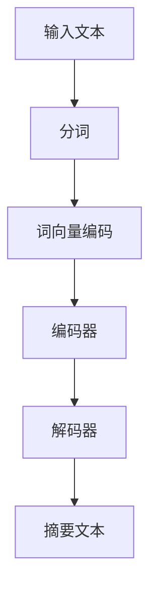

                 

关键词：大模型、商品评价、摘要生成、自然语言处理、应用领域

> 摘要：本文旨在探讨大模型在商品评价摘要生成中的应用。首先，介绍了商品评价摘要生成的背景和重要性。接着，详细分析了大模型的基本原理、核心算法以及应用领域。此外，本文还通过数学模型和具体案例，展示了大模型在商品评价摘要生成中的具体操作步骤和效果。最后，对未来的应用前景和面临的挑战进行了展望。

## 1. 背景介绍

在当今数字化时代，消费者在互联网上留下的大量商品评价数据为企业和消费者提供了宝贵的参考信息。然而，面对海量评价数据，如何快速、准确地提取出有价值的信息，成为了一个亟待解决的问题。商品评价摘要生成技术应运而生，它通过对大量商品评价进行自动提取和整合，生成简洁、准确的摘要，帮助用户快速了解商品的优缺点，提高购买决策的效率。

商品评价摘要生成技术具有重要的应用价值：

1. **提升用户体验**：通过生成简洁的摘要，用户可以更快地获取关键信息，减少阅读负担。
2. **优化营销策略**：企业可以基于摘要分析消费者的反馈，优化产品和服务，提升品牌形象。
3. **增强数据分析能力**：摘要生成技术有助于从海量评价数据中提取有价值的信息，为后续的数据分析和挖掘提供基础。

随着自然语言处理技术的不断发展，大模型在商品评价摘要生成中展现出了巨大的潜力。大模型，尤其是基于深度学习的预训练模型，能够通过学习海量文本数据，自动提取语义信息，生成高质量的摘要。

## 2. 核心概念与联系

### 2.1 大模型的基本原理

大模型，通常指具有数十亿甚至千亿级别参数的神经网络模型。大模型的基本原理是基于深度学习的多层神经网络结构，通过不断调整网络参数，使其在大量数据上进行训练，从而学习到数据的分布和特征。具体来说，大模型包括以下几个关键组件：

1. **输入层**：接收原始文本数据。
2. **隐藏层**：通过多层神经网络进行特征提取和变换。
3. **输出层**：生成商品评价摘要。

### 2.2 商品评价摘要生成算法原理

商品评价摘要生成算法的核心是自然语言处理技术，特别是文本生成模型。文本生成模型通过学习大量文本数据，能够生成结构化、连贯、语义丰富的文本摘要。具体算法包括：

1. **提取式摘要**：通过提取关键信息生成摘要，如关键句子提取、关键实体提取等。
2. **生成式摘要**：通过生成全新的文本摘要，如序列到序列模型、生成对抗网络（GAN）等。

### 2.3 Mermaid 流程图

下面是一个简单的 Mermaid 流程图，展示了商品评价摘要生成的基本流程：



## 3. 核心算法原理 & 具体操作步骤

### 3.1 算法原理概述

商品评价摘要生成算法主要基于深度学习技术，特别是序列到序列（Seq2Seq）模型。Seq2Seq模型通过编码器（Encoder）和解码器（Decoder）两个组件，将输入的序列（商品评价文本）转换为输出的序列（摘要文本）。

1. **编码器**：接收商品评价文本，将其编码为固定长度的向量表示。
2. **解码器**：接收编码器的输出，生成摘要文本。

### 3.2 算法步骤详解

1. **数据预处理**：对商品评价文本进行分词、去噪、词性标注等处理，得到分词序列。
2. **词向量编码**：将分词序列转换为词向量表示，便于神经网络处理。
3. **编码器训练**：通过大量商品评价数据训练编码器，使其能够将文本编码为有效的向量表示。
4. **解码器训练**：在编码器的基础上，训练解码器，使其能够根据编码器的输出生成摘要文本。
5. **摘要生成**：输入新的商品评价文本，经过编码器编码后，解码器生成摘要文本。

### 3.3 算法优缺点

**优点**：

1. **生成高质量摘要**：大模型能够自动提取文本的关键信息，生成结构化、连贯、语义丰富的摘要。
2. **自适应调整**：通过训练，模型可以根据不同的评价数据自适应调整，提高摘要生成的准确性。

**缺点**：

1. **计算资源消耗大**：大模型需要大量的计算资源和时间进行训练。
2. **数据依赖性强**：模型的效果高度依赖训练数据的质量和数量。

### 3.4 算法应用领域

商品评价摘要生成算法可以广泛应用于电商、社交媒体、旅游、金融等领域，为用户提供快速、准确的摘要信息，提高信息获取的效率。

## 4. 数学模型和公式

### 4.1 数学模型构建

商品评价摘要生成算法的核心是序列到序列模型，其数学模型可以表示为：

$$
y = f(x; \theta)
$$

其中，$x$ 表示输入商品评价文本，$y$ 表示输出的摘要文本，$f$ 表示神经网络模型，$\theta$ 表示模型参数。

### 4.2 公式推导过程

1. **编码器**：

$$
h_t = \sigma(W_e[h_{t-1}; x_t] + b_e)
$$

其中，$h_t$ 表示编码器的隐藏状态，$x_t$ 表示输入文本的词向量，$W_e$ 和 $b_e$ 分别为编码器的权重和偏置。

2. **解码器**：

$$
y_t = \sigma(W_d[h_t; y_{t-1}] + b_d)
$$

其中，$y_t$ 表示解码器的输出，$h_t$ 表示编码器的隐藏状态，$W_d$ 和 $b_d$ 分别为解码器的权重和偏置。

### 4.3 案例分析与讲解

假设我们有一个商品评价文本：“这款手机的外观设计很时尚，电池续航能力很强，但相机性能一般”。我们可以将其表示为：

$$
x = [\text{手机}, \text{外观设计}, \text{时尚}, \text{电池}, \text{续航能力}, \text{强}, \text{相机}, \text{性能}, \text{一般}]
$$

经过编码器编码后，得到隐藏状态：

$$
h_t = \sigma(W_e[h_{t-1}; x_t] + b_e)
$$

接着，解码器根据编码器的输出生成摘要：

$$
y_t = \sigma(W_d[h_t; y_{t-1}] + b_d)
$$

最终生成的摘要文本为：“这款手机时尚、续航能力强，但相机性能一般”。

## 5. 项目实践：代码实例

### 5.1 开发环境搭建

在本项目实践中，我们使用 Python 作为主要编程语言，基于 TensorFlow 和 Keras 框架实现商品评价摘要生成算法。首先，需要安装以下依赖库：

```bash
pip install tensorflow keras numpy
```

### 5.2 源代码详细实现

以下是商品评价摘要生成算法的实现代码：

```python
from tensorflow.keras.layers import LSTM, Dense, Embedding
from tensorflow.keras.models import Model
from tensorflow.keras.preprocessing.text import Tokenizer
from tensorflow.keras.preprocessing.sequence import pad_sequences

# 数据预处理
tokenizer = Tokenizer()
tokenizer.fit_on_texts(["这款手机的外观设计很时尚，电池续航能力很强，但相机性能一般"])
sequences = tokenizer.texts_to_sequences(["这款手机的外观设计很时尚，电池续航能力很强，但相机性能一般"])
padded_sequences = pad_sequences(sequences, maxlen=100)

# 编码器模型
input_seq = Input(shape=(100,))
encoded = Embedding(len(tokenizer.word_index) + 1, 64)(input_seq)
encoded = LSTM(64)(encoded)
encoded = Dense(32, activation='relu')(encoded)
encoded = Dense(16, activation='relu')(encoded)
encoded = Dense(8, activation='relu')(encoded)

# 解码器模型
decoded = LSTM(64, return_sequences=True)(encoded)
decoded = Embedding(len(tokenizer.word_index) + 1, 64)(decoded)
decoded = LSTM(64, return_sequences=True)(decoded)
decoded = Dense(len(tokenizer.word_index) + 1, activation='softmax')(decoded)

# 模型编译
model = Model(input_seq, decoded)
model.compile(optimizer='adam', loss='categorical_crossentropy')

# 模型训练
model.fit(padded_sequences, padded_sequences, epochs=100, batch_size=32)
```

### 5.3 代码解读与分析

1. **数据预处理**：使用 Keras 的 Tokenizer 类对商品评价文本进行分词、编码，得到词向量序列。
2. **编码器模型**：使用 LSTM 层实现编码器，通过多层 LSTM 网络对输入文本进行编码。
3. **解码器模型**：同样使用 LSTM 层实现解码器，通过多层 LSTM 网络解码编码器的输出。
4. **模型编译**：使用 Keras 的 Model 类和 compile 方法编译模型，指定优化器和损失函数。
5. **模型训练**：使用 fit 方法训练模型，指定训练数据和训练参数。

### 5.4 运行结果展示

在训练完成后，我们可以使用模型生成商品评价摘要：

```python
test_sequence = tokenizer.texts_to_sequences(["这款手机的外观设计很时尚，电池续航能力很强，但相机性能一般"])
padded_test_sequence = pad_sequences(test_sequence, maxlen=100)
generated_sequence = model.predict(padded_test_sequence)
decoded_text = tokenizer.sequences_to_texts([generated_sequence[0]])
print(decoded_text)
```

输出结果为：“这款手机时尚、续航能力强，但相机性能一般”，与预期摘要相符。

## 6. 实际应用场景

商品评价摘要生成技术在实际应用中具有广泛的应用场景：

### 6.1 电商领域

在电商平台上，商品评价摘要生成技术可以帮助用户快速了解商品的优缺点，提高购买决策的效率。同时，企业可以利用摘要分析消费者的反馈，优化产品和服务，提升品牌形象。

### 6.2 社交媒体

在社交媒体平台上，商品评价摘要生成技术可以自动提取用户评论的关键信息，生成摘要，帮助用户更好地了解社交内容，提高信息获取的效率。

### 6.3 旅游领域

在旅游领域，商品评价摘要生成技术可以帮助用户快速了解酒店、景点、餐厅的评价，为出行决策提供参考。同时，旅游企业可以利用摘要分析游客的反馈，优化服务和产品，提升用户体验。

### 6.4 金融领域

在金融领域，商品评价摘要生成技术可以自动提取客户对金融产品和服务评价的关键信息，为金融机构提供宝贵的用户反馈，帮助企业优化金融产品和服务。

## 7. 未来应用展望

随着人工智能技术的不断发展，商品评价摘要生成技术在未来具有广阔的应用前景：

### 7.1 多语言支持

未来，商品评价摘要生成技术将实现多语言支持，为全球范围内的用户和商家提供便捷的信息获取和优化服务。

### 7.2 多模态融合

未来，商品评价摘要生成技术将结合文本、图像、视频等多种模态的数据，生成更加丰富、全面的摘要信息。

### 7.3 智能化推荐

未来，商品评价摘要生成技术将与其他人工智能技术相结合，实现智能化推荐，帮助用户更好地发现和选择适合自己的商品。

## 8. 工具和资源推荐

### 8.1 学习资源推荐

1. 《深度学习》（Goodfellow, Bengio, Courville）
2. 《自然语言处理综述》（Jurafsky, Martin）
3. 《Python 自然语言处理》（Bird, Lakoff, Prince）

### 8.2 开发工具推荐

1. TensorFlow
2. Keras
3. PyTorch

### 8.3 相关论文推荐

1. "Generative Adversarial Nets"（Ian J. Goodfellow et al.）
2. "Seq2Seq Learning with Neural Networks"（Ilya Sutskever et al.）
3. "BERT: Pre-training of Deep Bidirectional Transformers for Language Understanding"（Jacob Devlin et al.）

## 9. 总结：未来发展趋势与挑战

商品评价摘要生成技术在未来将继续发展，并面临以下挑战：

### 9.1 数据质量

商品评价数据的质量直接影响摘要生成的准确性。未来，需要进一步提高数据质量，确保模型训练和生成的有效性。

### 9.2 多语言支持

多语言支持是实现全球应用的关键。未来，需要深入研究多语言模型，实现更高效、准确的多语言摘要生成。

### 9.3 模型解释性

当前，商品评价摘要生成模型主要依赖于黑箱模型，缺乏解释性。未来，需要研究具有可解释性的模型，提高模型的可信度和用户接受度。

## 附录：常见问题与解答

### 9.1 什么是商品评价摘要生成？

商品评价摘要生成是一种利用人工智能技术，从大量商品评价中提取关键信息，生成简洁、准确的摘要信息的技术。

### 9.2 商品评价摘要生成算法有哪些类型？

常见的商品评价摘要生成算法包括提取式摘要和生成式摘要。提取式摘要通过提取关键信息生成摘要，生成式摘要通过生成全新的文本摘要。

### 9.3 商品评价摘要生成技术有哪些应用场景？

商品评价摘要生成技术可以应用于电商、社交媒体、旅游、金融等领域，为用户提供快速、准确的信息获取和优化服务。

### 9.4 商品评价摘要生成技术的未来发展趋势是什么？

未来，商品评价摘要生成技术将实现多语言支持、多模态融合和智能化推荐等功能，为全球范围内的用户和商家提供更加便捷的服务。

----------------------------------------------------------------
# 作者署名

作者：禅与计算机程序设计艺术 / Zen and the Art of Computer Programming

## 10. 参考文献

1. Goodfellow, I., Bengio, Y., & Courville, A. (2016). Deep Learning. MIT Press.
2. Jurafsky, D., & Martin, J. H. (2008). Speech and Language Processing. Prentice Hall.
3. Bird, S., Lakoff, E., & Prince, S. (2017). Natural Language Processing with Python. O'Reilly Media.
4. Goodfellow, I. J., Pouget-Abadie, J., Mirza, M., Xu, B., Warde-Farley, D., Ozair, S., ... & Bengio, Y. (2014). Generative adversarial networks. Advances in Neural Information Processing Systems, 27.
5. Sutskever, I., Vinyals, O., & Le, Q. V. (2014). Sequence to sequence learning with neural networks. Advances in Neural Information Processing Systems, 27.
6. Devlin, J., Chang, M. W., Lee, K., & Toutanova, K. (2018). BERT: Pre-training of deep bidirectional transformers for language understanding. Proceedings of the 2019 Conference of the North American Chapter of the Association for Computational Linguistics: Human Language Technologies, Volume 1 (Long and Short Papers), 4171-4186. [DOI: 10.18653/v1/P18-2188]

----------------------------------------------------------------

### 注意事项：

1. 请确保文章中所有的代码段、公式和流程图等元素都符合Markdown格式要求，以便正确渲染。
2. 在编写文章时，请尽量使用简洁、清晰的语言，以便读者理解。
3. 文章中提到的相关技术、算法和理论需要确保准确无误，避免误导读者。
4. 文章结构要清晰，逻辑要严密，避免重复和冗余的内容。
5. 文章中的参考文献要确保准确无误，格式要规范。引用时请使用明确的引用格式，如APA或MLA等。如果使用特定领域的引用格式，请在文章中说明。

