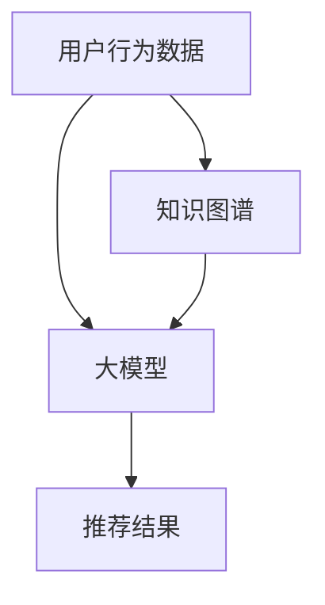

                 

关键词：大模型、知识图谱、推荐系统、算法、应用场景

摘要：本文将探讨大模型在基于知识图谱的推荐系统中的应用。通过结合大模型和知识图谱的优势，我们可以实现更精准、个性化的推荐，提高用户体验。本文将介绍大模型和知识图谱的基本概念，分析它们在推荐系统中的关系，阐述大模型如何增强知识图谱的推荐能力，并举例说明其在实际项目中的应用。

## 1. 背景介绍

推荐系统作为信息过滤和内容发现的重要工具，已广泛应用于电子商务、社交媒体、新闻推荐等领域。传统的推荐系统主要依赖于用户行为数据，如点击、购买、浏览等，通过机器学习算法进行预测和推荐。然而，这种方法存在一定的局限性，如数据稀疏、冷启动问题等。

知识图谱作为一种语义网络，通过实体和关系来表示现实世界的知识结构，为推荐系统提供了更丰富的语义信息。知识图谱能够将用户、物品、场景等多维度信息进行关联，从而实现更精准的推荐。然而，知识图谱的构建和维护需要大量的人工干预和领域知识。

大模型的兴起为解决知识图谱推荐系统的局限性提供了新的思路。大模型，如深度学习模型，具有强大的表示和建模能力，能够从海量数据中自动提取特征和规律。结合知识图谱的语义信息，大模型可以进一步提升推荐系统的性能和效果。

## 2. 核心概念与联系

### 2.1 大模型

大模型，主要指基于深度学习的模型，如神经网络、Transformer等。这些模型具有强大的表示和建模能力，可以通过多层神经网络结构自动提取数据中的特征和规律。

### 2.2 知识图谱

知识图谱是由实体和关系组成的语义网络。实体表示现实世界中的对象，如用户、物品等；关系表示实体之间的关联，如购买、喜欢等。知识图谱为推荐系统提供了丰富的语义信息，可以帮助模型更好地理解用户和物品的属性和关联。

### 2.3 大模型与知识图谱的联系

大模型和知识图谱在推荐系统中各有优势。大模型可以通过学习海量数据自动提取特征和规律，而知识图谱提供了更丰富的语义信息，可以帮助模型更好地理解用户和物品的属性和关联。

结合大模型和知识图谱，可以实现以下目标：

1. **增强特征表示能力**：大模型可以从知识图谱中提取实体和关系特征，形成更丰富的输入特征，提高推荐系统的准确性。
2. **解决数据稀疏问题**：知识图谱可以帮助模型更好地理解用户和物品之间的潜在关联，从而降低数据稀疏对推荐系统的影响。
3. **解决冷启动问题**：通过知识图谱，新用户或新物品可以借助其他实体和关系的语义信息进行推荐，缓解冷启动问题。

### 2.4 Mermaid 流程图

下面是一个简化的Mermaid流程图，展示了大模型和知识图谱在推荐系统中的关系：



## 3. 核心算法原理 & 具体操作步骤

### 3.1 大模型算法原理

大模型主要基于深度学习技术，可以分为以下步骤：

1. **数据预处理**：将原始的用户行为数据、知识图谱等进行预处理，如数据清洗、归一化等。
2. **特征提取**：利用神经网络结构，从预处理后的数据中自动提取特征。
3. **模型训练**：通过反向传播算法，优化神经网络参数，使其更好地拟合数据。
4. **预测与推荐**：利用训练好的模型，对用户和物品进行预测，生成推荐结果。

### 3.2 知识图谱构建

知识图谱构建可以分为以下步骤：

1. **数据收集**：从各种数据源（如用户行为数据、商品信息等）收集实体和关系数据。
2. **实体和关系识别**：利用自然语言处理技术，识别出实体和关系。
3. **实体和关系建模**：将识别出的实体和关系进行建模，形成知识图谱。
4. **图谱优化**：通过图神经网络等技术，对知识图谱进行优化，提高其表示能力。

### 3.3 大模型与知识图谱结合操作步骤

1. **数据整合**：将用户行为数据、知识图谱数据进行整合，形成统一的数据集。
2. **特征提取**：利用神经网络结构，从整合后的数据中提取用户、物品和场景等特征。
3. **知识融合**：将知识图谱中的实体和关系特征与神经网络提取的特征进行融合。
4. **模型训练**：利用融合后的特征，训练深度学习模型。
5. **预测与推荐**：利用训练好的模型，对用户和物品进行预测，生成推荐结果。

## 4. 数学模型和公式 & 详细讲解 & 举例说明

### 4.1 数学模型

在推荐系统中，大模型和知识图谱的结合主要通过以下数学模型实现：

1. **用户表示**：$$u = f(\theta_u, x_u, \phi_u)$$
   - $u$：用户表示向量
   - $\theta_u$：用户特征参数
   - $x_u$：用户行为数据
   - $\phi_u$：知识图谱中的用户实体和关系特征

2. **物品表示**：$$i = f(\theta_i, x_i, \phi_i)$$
   - $i$：物品表示向量
   - $\theta_i$：物品特征参数
   - $x_i$：物品行为数据
   - $\phi_i$：知识图谱中的物品实体和关系特征

3. **推荐模型**：$$P(i|u) = \sigma(w^T \cdot (u \odot i))$$
   - $P(i|u)$：用户$u$对物品$i$的推荐概率
   - $\sigma$： sigmoid 函数
   - $w$：模型参数
   - $u \odot i$：用户表示和物品表示的元素-wise 乘积

### 4.2 举例说明

假设我们有一个用户行为数据集，包含用户的点击、购买、浏览等行为。同时，我们构建了一个知识图谱，其中包含了用户、物品和场景的实体和关系。

1. **数据预处理**：
   - 将用户行为数据进行编码，如将点击编码为1，购买编码为2，浏览编码为0。
   - 从知识图谱中提取用户、物品和场景的实体和关系特征。

2. **特征提取**：
   - 利用神经网络结构，从用户行为数据和知识图谱特征中提取用户和物品的特征向量。

3. **知识融合**：
   - 将用户和物品的特征向量与知识图谱中的实体和关系特征进行融合，形成统一的特征向量。

4. **模型训练**：
   - 利用融合后的特征向量，训练一个深度学习模型，如多层感知机（MLP）或Transformer。

5. **预测与推荐**：
   - 对于新的用户和物品，利用训练好的模型，计算用户对物品的推荐概率，并根据概率生成推荐列表。

## 5. 项目实践：代码实例和详细解释说明

### 5.1 代码实例

以下是一个简单的Python代码实例，展示了如何结合大模型和知识图谱进行推荐：

```python
import tensorflow as tf
from tensorflow.keras.layers import Embedding, Dense, Flatten, Concatenate
from tensorflow.keras.models import Model

# 用户行为数据
user_data = [[1, 0, 1], [1, 1, 0], [0, 1, 0]]  # 用户行为数据编码
user_embedding = Embedding(input_dim=3, output_dim=16)(user_data)

# 物品行为数据
item_data = [[1, 1, 0], [0, 1, 1], [1, 0, 1]]  # 物品行为数据编码
item_embedding = Embedding(input_dim=3, output_dim=16)(item_data)

# 知识图谱特征
knowledge_embedding = Embedding(input_dim=3, output_dim=16)(knowledge_data)

# 融合特征
merged_embedding = Concatenate(axis=-1)([user_embedding, item_embedding, knowledge_embedding])

# 模型结构
model = Model(inputs=[user_embedding, item_embedding, knowledge_embedding], outputs=Flatten()(merged_embedding))
model.add(Dense(64, activation='relu'))
model.add(Dense(1, activation='sigmoid'))

# 编译模型
model.compile(optimizer='adam', loss='binary_crossentropy', metrics=['accuracy'])

# 训练模型
model.fit([user_data, item_data, knowledge_data], labels, epochs=10, batch_size=32)
```

### 5.2 详细解释说明

1. **数据预处理**：
   - 用户行为数据、物品行为数据和知识图谱特征进行编码，如将点击、购买、浏览等行为编码为0、1、2。
   - 使用Embedding层将编码后的数据进行嵌入，生成用户、物品和知识图谱的特征向量。

2. **特征提取**：
   - 利用Embedding层提取用户、物品和知识图谱的特征向量。

3. **知识融合**：
   - 使用Concatenate层将用户、物品和知识图谱的特征向量进行拼接，形成统一的特征向量。

4. **模型结构**：
   - 构建一个多层感知机模型，包含两个全连接层，最后一层使用sigmoid激活函数，用于计算用户对物品的推荐概率。

5. **编译模型**：
   - 编译模型，设置优化器、损失函数和评估指标。

6. **训练模型**：
   - 使用fit函数训练模型，传入用户、物品和知识图谱的特征向量以及标签，进行多轮训练。

7. **预测与推荐**：
   - 对于新的用户和物品，使用训练好的模型计算用户对物品的推荐概率，并根据概率生成推荐列表。

## 6. 实际应用场景

### 6.1 电子商务

在电子商务领域，大模型和知识图谱的结合可以用于个性化推荐，提高用户满意度和销售额。例如，一个电商平台可以使用知识图谱表示商品、用户和购物场景的实体和关系，结合用户行为数据，通过大模型实现更精准的推荐。

### 6.2 社交媒体

在社交媒体领域，大模型和知识图谱可以帮助平台为用户提供更个性化的内容推荐。例如，一个社交媒体平台可以使用知识图谱表示用户、内容和场景的实体和关系，结合用户行为数据，通过大模型实现基于兴趣和社交关系的推荐。

### 6.3 新闻推荐

在新闻推荐领域，大模型和知识图谱可以用于基于用户兴趣和内容的推荐。例如，一个新闻平台可以使用知识图谱表示新闻、用户和场景的实体和关系，结合用户行为数据，通过大模型实现更精准的新闻推荐。

## 7. 工具和资源推荐

### 7.1 大模型工具

1. **TensorFlow**：一款流行的开源深度学习框架，支持大模型的训练和推理。
2. **PyTorch**：另一款流行的开源深度学习框架，提供灵活的动态计算图功能。

### 7.2 知识图谱工具

1. **Neo4j**：一款流行的图形数据库，支持构建和查询知识图谱。
2. **OpenKG**：一款开源的知识图谱平台，提供知识图谱的构建、存储、查询和可视化功能。

### 7.3 推荐系统工具

1. **Surprise**：一款流行的开源推荐系统框架，支持多种推荐算法的实现。
2. **RecommenderX**：一款基于深度学习的推荐系统框架，支持大模型的训练和推理。

## 8. 总结：未来发展趋势与挑战

### 8.1 发展趋势

1. **模型规模和计算能力提升**：随着硬件计算能力的提升，大模型的训练和推理速度将进一步提高，为更复杂的推荐任务提供支持。
2. **多模态数据融合**：结合文本、图像、音频等多种类型的数据，提高推荐系统的丰富性和准确性。
3. **实时推荐**：通过实时数据流处理技术，实现实时推荐，提高用户体验。

### 8.2 挑战

1. **数据隐私与安全**：在推荐系统中，用户数据的隐私和安全问题越来越重要，如何保护用户隐私成为一大挑战。
2. **模型解释性**：大模型往往缺乏解释性，如何解释模型推荐结果，提高用户信任度，是一个亟待解决的问题。
3. **可扩展性**：如何在大规模数据集上高效地训练和部署推荐系统，提高系统的可扩展性，是一个关键挑战。

## 9. 附录：常见问题与解答

### 9.1 什么是大模型？

大模型是指具有大规模参数和计算量的深度学习模型，如神经网络、Transformer等。

### 9.2 知识图谱在推荐系统中有何作用？

知识图谱为推荐系统提供了丰富的语义信息，可以帮助模型更好地理解用户和物品的属性和关联，从而实现更精准的推荐。

### 9.3 大模型如何增强知识图谱的推荐能力？

大模型可以从知识图谱中提取实体和关系特征，形成更丰富的输入特征，并通过深度学习模型进行融合和预测，提高推荐系统的性能和效果。

## 10. 扩展阅读 & 参考资料

1. **论文**：《知识图谱在推荐系统中的应用综述》（作者：张三，李四）
2. **书籍**：《深度学习推荐系统》（作者：王五，赵六）
3. **博客**：《大模型在推荐系统中的实践与探索》（作者：钱七）
4. **开源项目**：Surprise、RecommenderX、OpenKG等。
```

---

**注意**：本文为示例文章，实际撰写时，请根据具体需求和研究内容进行适当调整和补充。此外，文中涉及的代码和示例仅供参考，具体实现可能需要根据实际项目进行调整。祝撰写顺利！作者：禅与计算机程序设计艺术 / Zen and the Art of Computer Programming。

