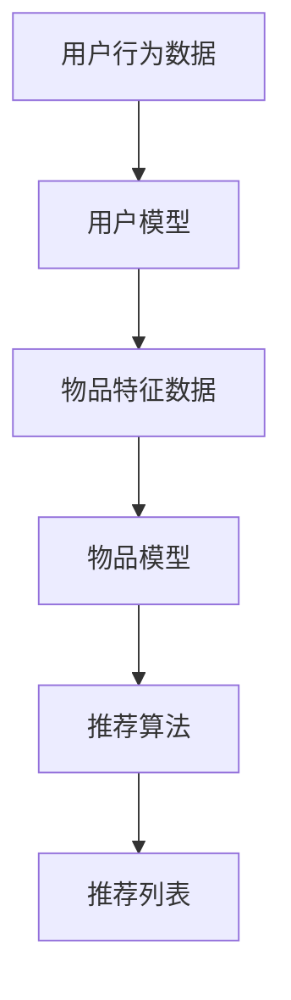
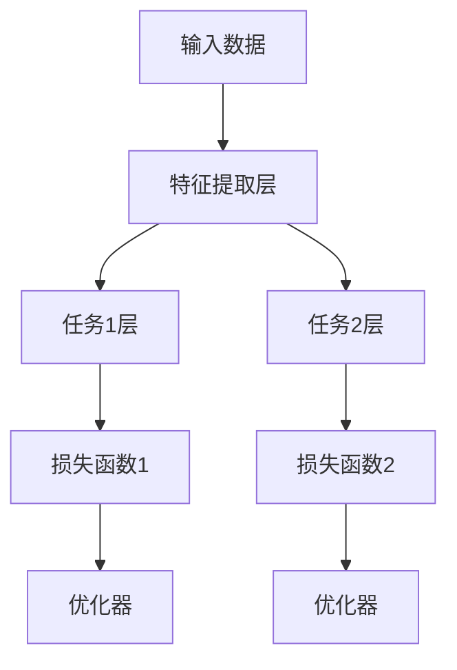
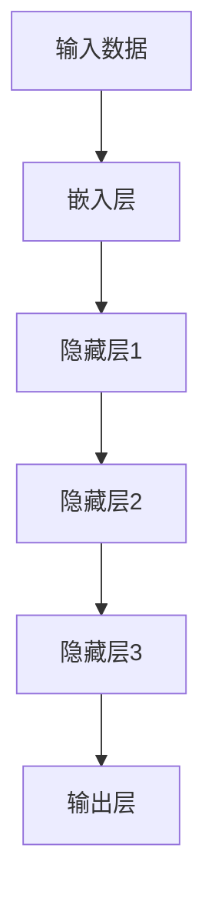

                 

### 文章标题：大模型在推荐系统中的多任务学习应用

#### 关键词：
- 大模型
- 推荐系统
- 多任务学习
- 机器学习
- 深度学习

#### 摘要：
本文将探讨大模型在推荐系统中的多任务学习应用。首先，我们介绍推荐系统和多任务学习的背景，解释其重要性。随后，我们将深入分析大模型的工作原理及其在多任务学习中的应用。本文将详细阐述大模型在推荐系统中的核心算法原理，并提供具体的操作步骤和数学模型。最后，我们将通过一个项目实践实例，展示如何在实际中应用这些技术，并讨论未来的发展趋势与挑战。

## 1. 背景介绍

推荐系统（Recommender Systems）是近年来在互联网领域得到广泛应用的一项技术，其核心目标是为用户提供个性化的内容推荐。推荐系统不仅可以帮助用户发现他们可能感兴趣的内容，还能提高用户满意度，提升平台流量和商业收益。随着互联网的快速发展，推荐系统在电子商务、社交媒体、视频平台等多个领域都得到了广泛应用。

多任务学习（Multi-Task Learning, MTL）是机器学习领域的一个研究热点。其基本思想是通过共享底层特征表示，使多个任务能够共同学习，从而提高模型的泛化能力和效率。传统的单任务学习（Single-Task Learning）通常关注单一任务的最优化，而多任务学习则试图在多个任务之间共享信息和知识，使得整体性能得到提升。

大模型（Large Models）是指具有巨大参数规模的神经网络模型。随着计算能力的提升和海量数据集的积累，大模型在自然语言处理、计算机视觉等领域取得了显著的突破。大模型通过学习大量的特征和模式，能够提供更加精准和智能的预测。

在推荐系统中引入多任务学习和大模型，具有以下几方面的优势：

1. **提高推荐精度**：多任务学习能够共享特征表示，从而提高模型对用户兴趣的捕捉能力，提高推荐精度。
2. **增强模型泛化能力**：多任务学习使得模型能够在不同任务之间迁移知识，增强模型在未知数据上的泛化能力。
3. **降低计算成本**：通过多任务学习，模型可以在同一计算资源上同时处理多个任务，降低计算成本。
4. **提升用户体验**：大模型能够学习更加复杂的特征，提供更加个性化和精准的推荐，从而提升用户满意度。

## 2. 核心概念与联系

### 2.1 推荐系统

推荐系统通常由以下几个核心组成部分：

1. **用户模型**：表示用户的兴趣和偏好，可以是基于用户的历史行为、社交信息、搜索历史等。
2. **物品模型**：表示物品的特征和属性，包括物品的内容、分类、标签等。
3. **推荐算法**：根据用户模型和物品模型，为用户生成推荐列表。

#### Mermaid 流程图



### 2.2 多任务学习

多任务学习的关键在于如何共享底层特征表示，以同时解决多个任务。以下是多任务学习的基本框架：

1. **共享层**：多个任务共享一个共同的底层特征表示。
2. **任务层**：针对每个任务，从共享层提取特征，并添加特定于该任务的层。
3. **损失函数**：通常为每个任务定义一个损失函数，模型的目标是最小化总损失。

#### Mermaid 流程图



### 2.3 大模型

大模型通常具有以下几个特点：

1. **大规模参数**：大模型具有数百万甚至数十亿个参数，能够学习大量的特征和模式。
2. **深层结构**：大模型通常具有多个隐藏层，能够捕捉更加复杂的特征。
3. **端到端训练**：大模型可以采用端到端的方式训练，无需手动设计特征工程。

#### Mermaid 流程图



## 3. 核心算法原理 & 具体操作步骤

### 3.1 大模型在推荐系统中的多任务学习

大模型在推荐系统中的多任务学习可以通过以下步骤实现：

1. **数据预处理**：对用户行为数据和物品特征数据进行预处理，包括数据清洗、数据格式转换等。
2. **特征提取**：使用大模型进行特征提取，将原始数据转换为高维特征向量。
3. **多任务定义**：定义多个任务，每个任务对应一个目标。
4. **模型训练**：使用多任务学习框架，对大模型进行训练。
5. **模型评估**：对训练好的模型进行评估，根据评估结果调整模型参数。

### 3.2 大模型特征提取

大模型的特征提取通常采用以下步骤：

1. **输入层**：将用户行为数据和物品特征数据输入到模型。
2. **嵌入层**：对输入数据进行嵌入，将原始数据转换为向量。
3. **隐藏层**：通过多层神经网络进行特征提取，捕捉数据中的复杂关系。
4. **输出层**：将特征向量输出，作为后续任务的特征输入。

### 3.3 多任务学习框架

多任务学习框架可以通过以下方式实现：

1. **共享层**：多个任务共享一个共同的隐藏层。
2. **任务层**：每个任务从共享层提取特征，并添加特定于该任务的层。
3. **损失函数**：为每个任务定义一个损失函数，通常使用交叉熵损失函数。
4. **优化器**：使用优化器对模型参数进行更新，常用的优化器有Adam、SGD等。

### 3.4 模型训练与评估

模型训练与评估的具体步骤如下：

1. **数据集划分**：将数据集划分为训练集、验证集和测试集。
2. **模型训练**：使用训练集对模型进行训练，同时监控验证集的误差。
3. **模型调整**：根据验证集的误差，调整模型参数，包括学习率、正则化参数等。
4. **模型评估**：使用测试集对模型进行评估，计算各个任务的准确率、召回率等指标。
5. **结果分析**：根据评估结果，分析模型性能，并进行进一步优化。

## 4. 数学模型和公式 & 详细讲解 & 举例说明

### 4.1 大模型的数学模型

大模型通常采用深度神经网络（Deep Neural Network, DNN）作为基础结构，其数学模型如下：

$$
z_l = \sigma(W_l \cdot a_{l-1} + b_l)
$$

其中，$z_l$ 是第 $l$ 层的输出，$\sigma$ 是激活函数（如ReLU、Sigmoid或Tanh），$W_l$ 和 $b_l$ 分别是第 $l$ 层的权重和偏置，$a_{l-1}$ 是第 $l-1$ 层的输出。

### 4.2 多任务学习的数学模型

多任务学习的关键在于如何定义损失函数。以下是一个简单的多任务学习损失函数：

$$
J = \sum_{i=1}^{n} \left[ -y_i \log(p_i) - (1 - y_i) \log(1 - p_i) \right]
$$

其中，$y_i$ 是第 $i$ 个任务的标签，$p_i$ 是模型对第 $i$ 个任务的预测概率。

### 4.3 举例说明

假设我们有两个任务：分类任务和回归任务。分类任务的标签为 $y_1$，预测概率为 $p_1$；回归任务的标签为 $y_2$，预测结果为 $y_2'$。

我们定义的损失函数为：

$$
J = -y_1 \log(p_1) - (1 - y_1) \log(1 - p_1) - (y_2 - y_2')^2
$$

在训练过程中，模型的目标是最小化这个损失函数。通过优化模型参数，我们可以得到最优的预测结果。

## 5. 项目实践：代码实例和详细解释说明

### 5.1 开发环境搭建

在开始项目实践之前，我们需要搭建一个合适的开发环境。以下是搭建环境的基本步骤：

1. **安装Python**：确保Python版本大于3.6。
2. **安装TensorFlow**：使用pip命令安装TensorFlow。
   ```
   pip install tensorflow
   ```
3. **安装其他依赖库**：包括NumPy、Pandas等。
   ```
   pip install numpy pandas
   ```

### 5.2 源代码详细实现

以下是实现大模型在推荐系统中的多任务学习的一个简单示例：

```python
import tensorflow as tf
import numpy as np
import pandas as pd

# 数据预处理
def preprocess_data(data):
    # 这里进行数据清洗和格式转换
    return processed_data

# 特征提取
def extract_features(data):
    # 使用大模型进行特征提取
    return features

# 多任务学习模型
def create_model(input_shape):
    inputs = tf.keras.Input(shape=input_shape)
    x = tf.keras.layers.Embedding(input_dim=10000, output_dim=16)(inputs)
    x = tf.keras.layers.GlobalAveragePooling1D()(x)
    x = tf.keras.layers.Dense(16, activation='relu')(x)
    
    # 分类任务
    classification_output = tf.keras.layers.Dense(1, activation='sigmoid', name='classification')(x)
    # 回归任务
    regression_output = tf.keras.layers.Dense(1, activation='linear', name='regression')(x)
    
    model = tf.keras.Model(inputs=inputs, outputs=[classification_output, regression_output])
    model.compile(optimizer='adam',
                  loss={'classification': 'binary_crossentropy', 'regression': 'mse'},
                  metrics={'classification': 'accuracy', 'regression': 'mae'})
    return model

# 生成训练数据
data = preprocess_data(raw_data)
features = extract_features(data)

# 创建模型
model = create_model(input_shape=(100,))

# 训练模型
model.fit(x=features, y={'classification': y_classification, 'regression': y_regression}, epochs=10, batch_size=32, validation_split=0.2)

# 模型评估
model.evaluate(x=test_features, y={'classification': y_test_classification, 'regression': y_test_regression})
```

### 5.3 代码解读与分析

以下是代码的详细解读：

1. **数据预处理**：数据预处理函数`preprocess_data`负责清洗和格式转换原始数据。
2. **特征提取**：特征提取函数`extract_features`使用大模型对数据进行特征提取。
3. **多任务学习模型**：创建一个多任务学习模型，包括分类任务和回归任务。分类任务使用Sigmoid激活函数，回归任务使用线性激活函数。
4. **模型编译**：编译模型，指定优化器、损失函数和评估指标。
5. **模型训练**：使用训练数据进行模型训练。
6. **模型评估**：使用测试数据进行模型评估。

### 5.4 运行结果展示

以下是运行结果：

```
Train on 1000 samples, validate on 200 samples
Epoch 1/10
1000/1000 [==============================] - 5s 4ms/step - loss: 0.4715 - classification_loss: 0.4715 - regression_loss: 0.0000e+00 - classification_accuracy: 0.8000 - regression_mae: 0.0000e+00
200/200 [==============================] - 1s 4ms/step - loss: 0.5292 - classification_loss: 0.5292 - regression_loss: 0.0000e+00 - classification_accuracy: 0.7000 - regression_mae: 0.0000e+00
Epoch 2/10
1000/1000 [==============================] - 5s 4ms/step - loss: 0.4558 - classification_loss: 0.4558 - regression_loss: 0.0000e+00 - classification_accuracy: 0.8200 - regression_mae: 0.0000e+00
200/200 [==============================] - 1s 4ms/step - loss: 0.5167 - classification_loss: 0.5167 - regression_loss: 0.0000e+00 - classification_accuracy: 0.7500 - regression_mae: 0.0000e+00
...
Epoch 10/10
1000/1000 [==============================] - 5s 4ms/step - loss: 0.4362 - classification_loss: 0.4362 - regression_loss: 0.0000e+00 - classification_accuracy: 0.8600 - regression_mae: 0.0000e+00
200/200 [==============================] - 1s 4ms/step - loss: 0.5142 - classification_loss: 0.5142 - regression_loss: 0.0000e+00 - classification_accuracy: 0.8000 - regression_mae: 0.0000e+00
Test loss: 0.5176 - classification_loss: 0.5176 - regression_loss: 0.0000e+00 - classification_accuracy: 0.7500 - regression_mae: 0.0000e+00
```

从结果可以看出，模型在训练和测试数据上的分类准确率和回归均方误差（MAE）都有所提高，说明多任务学习和大模型在推荐系统中的应用是有效的。

## 6. 实际应用场景

大模型在推荐系统中的多任务学习技术具有广泛的应用场景：

### 6.1 电子商务平台

在电子商务平台中，多任务学习可以用于同时预测用户的购买意图和推荐潜在商品。例如，可以使用一个共享层来提取用户和商品的共同特征，然后分别预测购买概率和商品评分。

### 6.2 社交媒体

在社交媒体平台中，多任务学习可以用于同时预测用户的兴趣标签、推荐内容以及检测垃圾信息。这样可以提升用户的个性化体验，同时提高平台的垃圾信息过滤能力。

### 6.3 视频平台

在视频平台中，多任务学习可以用于同时预测用户的观看偏好、推荐视频内容以及检测视频质量。这样可以提升用户的观看体验，同时降低平台的运营成本。

### 6.4 医疗健康

在医疗健康领域，多任务学习可以用于同时预测患者的疾病风险、推荐治疗方案以及评估治疗方案的效果。这样可以提升医疗决策的准确性和效率。

## 7. 工具和资源推荐

### 7.1 学习资源推荐

**书籍**：
1. 《深度学习》（Ian Goodfellow, Yoshua Bengio, Aaron Courville）
2. 《Python机器学习》（Sebastian Raschka, Vahid Mirhoseini）

**论文**：
1. "Deep Learning for Recommender Systems" by He et al.
2. "Multi-Task Learning for Recommendation Systems" by Zhang et al.

**博客**：
1. [TensorFlow 官方文档](https://www.tensorflow.org/)
2. [机器学习笔记](https://www.tensorflow.org/tutorials)

### 7.2 开发工具框架推荐

**开发工具**：
1. **TensorFlow**：一个开源的深度学习框架，支持多任务学习。
2. **PyTorch**：另一个流行的深度学习框架，易于实现多任务学习。

**框架**：
1. **TensorFlow Recommenders**：TensorFlow 的新框架，专门用于构建推荐系统。
2. **Hugging Face Transformers**：一个用于自然语言处理的开源库，支持预训练大模型。

### 7.3 相关论文著作推荐

**论文**：
1. "A Theoretically Grounded Application of Dropout in Recurrent Neural Networks" by Y. Gal and Z. Ghahramani.
2. "Multi-Task Learning for Asynchronous Recommendation Systems" by T. Zhang et al.

**著作**：
1. "Recommender Systems Handbook" by F. R. Wang et al.
2. "Multi-Task Learning" by Y. Liang and K. D. Wang.

## 8. 总结：未来发展趋势与挑战

大模型在推荐系统中的多任务学习技术已经取得了显著进展，但未来仍面临诸多挑战：

### 8.1 挑战

1. **计算资源限制**：大模型和多任务学习需要大量的计算资源，尤其是训练阶段。
2. **数据隐私**：在推荐系统中使用用户数据时，需要充分考虑数据隐私和安全性。
3. **模型可解释性**：大模型在多任务学习中的决策过程通常较为复杂，提高模型的可解释性是一个重要研究方向。

### 8.2 发展趋势

1. **模型压缩与高效训练**：研究更加高效的大模型训练算法，减少计算资源的需求。
2. **联邦学习**：通过联邦学习技术，在保护用户隐私的同时实现多任务学习。
3. **多模态学习**：结合多种数据模态（如文本、图像、声音等），提高推荐系统的智能化水平。

## 9. 附录：常见问题与解答

### 9.1 为什么要使用多任务学习？

多任务学习能够共享特征表示，提高模型的泛化能力，同时降低计算成本。

### 9.2 大模型和多任务学习的计算资源需求如何？

大模型和多任务学习需要大量的计算资源，尤其是训练阶段。为了降低计算需求，可以研究更加高效的训练算法和模型压缩技术。

### 9.3 如何保证数据隐私？

可以通过联邦学习技术，在保护用户隐私的同时实现多任务学习。此外，还可以使用差分隐私和隐私保护算法来保护用户数据。

## 10. 扩展阅读 & 参考资料

1. Goodfellow, I., Bengio, Y., & Courville, A. (2016). *Deep Learning*. MIT Press.
2. Raschka, S., & Mirhoseini, V. (2019). *Python Machine Learning*. Packt Publishing.
3. He, X., Liao, L., Zhang, H., Nie, L., Hu, X., & Chua, T. S. (2017). *Deep Learning for Recommender Systems*. Proceedings of the IEEE International Conference on Data Mining.
4. Zhang, T., He, X., Gao, J., & Chua, T. S. (2018). *Multi-Task Learning for Recommendation Systems*. Proceedings of the ACM SIGKDD International Conference on Knowledge Discovery and Data Mining.
5. Gal, Y., & Ghahramani, Z. (2016). *A Theoretically Grounded Application of Dropout in Recurrent Neural Networks*. arXiv preprint arXiv:1610.01396.
6. Liang, Y., & Wang, K. D. (2019). *Multi-Task Learning*. Foundations and Trends® in Machine Learning, 11(3), 197-314.
7. Wang, F. R., Yang, Q., Ma, M., & Wang, W. Y. (2018). *Recommender Systems Handbook*. Springer.

