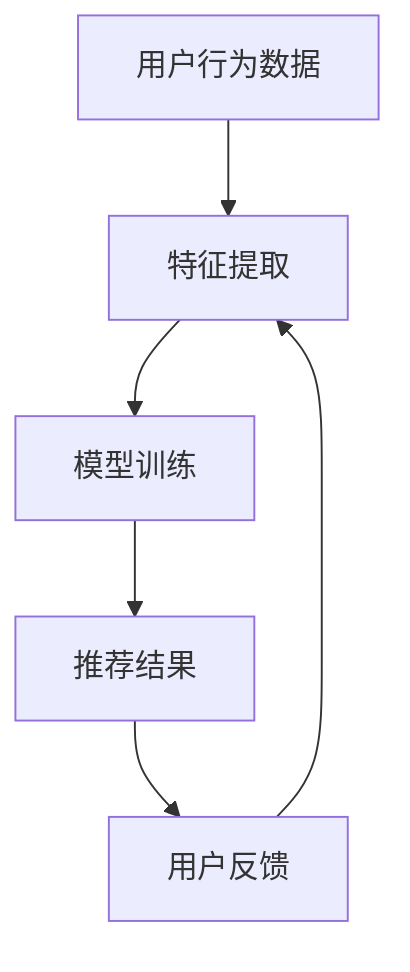
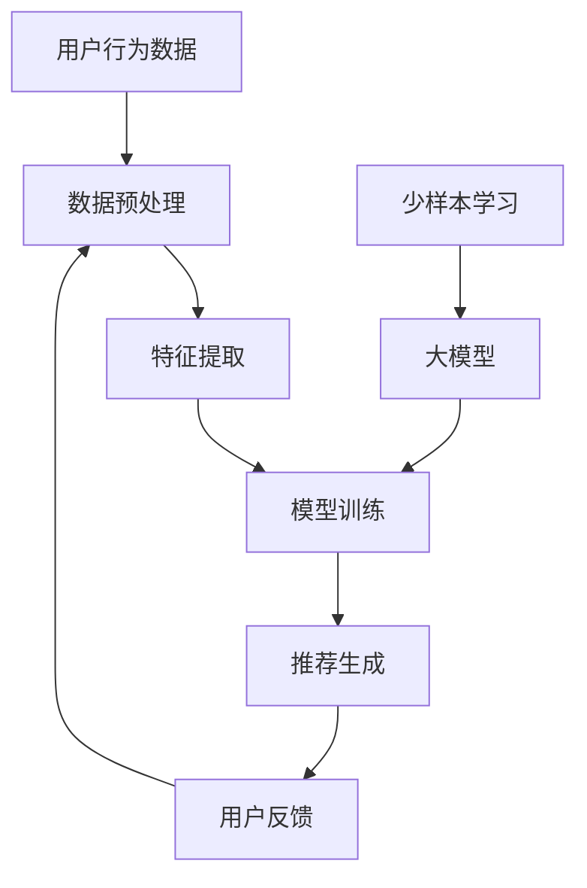

                 

### 大模型在推荐系统中的少样本学习应用

#### 关键词

- 大模型
- 推荐系统
- 少样本学习
- AI 应用
- 深度学习
- 神经网络
- 联邦学习

#### 摘要

随着人工智能技术的不断发展，大模型在推荐系统中的应用越来越广泛。然而，这些大模型通常依赖于大量的训练数据，这在数据稀缺的情况下成为一个挑战。本文将探讨大模型在推荐系统中的少样本学习应用，包括核心概念、算法原理、数学模型、实际项目实践以及未来发展趋势。通过对这些内容的深入分析，我们将了解如何在数据稀缺的情况下充分利用大模型的能力，提升推荐系统的性能。

## 1. 背景介绍

推荐系统是现代互联网中不可或缺的一部分，它们能够根据用户的历史行为和偏好，向用户推荐个性化内容。随着用户生成内容的爆炸式增长，推荐系统的需求也随之增加。传统的推荐系统主要依赖于统计方法和机器学习方法，这些方法通常需要大量的训练数据来学习和预测用户的行为。

然而，在实际应用中，我们经常会遇到数据稀缺的情况。这可能是因为用户行为数据的不透明性、隐私保护的要求，或者某些领域的数据获取难度大。在这种情况下，传统的推荐系统往往无法正常工作，因为它们依赖于大量数据来进行训练和优化。

为了解决这一问题，少样本学习成为了一个重要的研究方向。少样本学习旨在利用少量的训练数据来训练模型，从而在数据稀缺的环境下仍然能够保持较高的性能。大模型在推荐系统中的少样本学习应用，正是将这一理念推向了一个新的高度。

大模型，如深度学习网络，具有强大的表示能力和学习能力，能够处理复杂的数据结构和非线性关系。通过少样本学习，大模型可以充分利用自身的优势，在数据稀缺的情况下仍然能够生成高质量的推荐结果。

## 2. 核心概念与联系

### 2.1 大模型

大模型通常指的是具有大量参数的深度学习网络，如神经网络、循环神经网络（RNN）、长短期记忆网络（LSTM）等。这些模型通过多层非线性变换，能够捕捉数据中的复杂模式和关联。

### 2.2 推荐系统

推荐系统是一种信息过滤技术，通过分析用户的行为数据和内容特征，为用户推荐可能感兴趣的内容。推荐系统可以分为基于内容的推荐、协同过滤推荐、混合推荐等类型。

### 2.3 少样本学习

少样本学习是指在没有大量训练数据的情况下，如何训练出性能良好的模型。它涉及到样本选择、模型结构设计、数据增强等多个方面。

### 2.4 Mermaid 流程图



## 3. 核心算法原理 & 具体操作步骤

### 3.1 算法原理

在推荐系统中应用少样本学习，主要分为以下几个步骤：

1. **数据预处理**：对用户行为数据进行清洗、标准化等预处理操作。
2. **特征提取**：从预处理后的数据中提取出有用的特征信息。
3. **模型选择**：根据问题的复杂度和数据特性，选择合适的大模型架构。
4. **模型训练**：利用少量的训练数据对模型进行训练。
5. **推荐生成**：使用训练好的模型对新的用户数据进行推荐。
6. **反馈调整**：根据用户反馈对模型进行调整和优化。

### 3.2 操作步骤

1. **数据收集**：收集用户行为数据，包括用户的行为日志、浏览历史、点击记录等。
2. **数据预处理**：对数据进行清洗和标准化，去除噪声和不必要的特征。
3. **特征提取**：使用特征提取技术，如词袋模型、TF-IDF、向量空间模型等，将文本数据转化为数值特征。
4. **模型选择**：根据数据特性和推荐任务，选择合适的大模型架构，如卷积神经网络（CNN）、循环神经网络（RNN）、生成对抗网络（GAN）等。
5. **模型训练**：使用少量数据对模型进行训练，训练过程中可以通过数据增强、正则化等方法提高模型的泛化能力。
6. **推荐生成**：使用训练好的模型对新的用户数据进行推荐，输出推荐结果。
7. **反馈调整**：收集用户对推荐结果的反馈，根据反馈对模型进行调整和优化。

## 4. 数学模型和公式 & 详细讲解 & 举例说明

### 4.1 数学模型

在少样本学习过程中，我们主要关注以下几个方面：

1. **损失函数**：衡量模型预测值与真实值之间的差异，常用的有均方误差（MSE）、交叉熵损失（Cross-Entropy Loss）等。
2. **优化算法**：用于迭代更新模型参数，常用的有随机梯度下降（SGD）、Adam优化器等。
3. **正则化**：防止模型过拟合，常用的有L1正则化、L2正则化等。

### 4.2 详细讲解

1. **损失函数**

   均方误差（MSE）的定义如下：

   $$MSE = \frac{1}{n}\sum_{i=1}^{n}(y_i - \hat{y_i})^2$$

   其中，$y_i$ 是真实标签，$\hat{y_i}$ 是模型预测值，$n$ 是样本数量。

   交叉熵损失（Cross-Entropy Loss）的定义如下：

   $$H(y, \hat{y}) = -\sum_{i=1}^{n}y_i\log(\hat{y_i})$$

   其中，$y$ 是真实标签，$\hat{y}$ 是模型预测的概率分布。

2. **优化算法**

   随机梯度下降（SGD）的更新公式如下：

   $$\theta = \theta - \alpha\nabla_\theta J(\theta)$$

   其中，$\theta$ 是模型参数，$\alpha$ 是学习率，$J(\theta)$ 是损失函数。

   Adam优化器的更新公式如下：

   $$m_t = \beta_1m_{t-1} + (1 - \beta_1)\nabla_\theta J(\theta)$$

   $$v_t = \beta_2v_{t-1} + (1 - \beta_2)\nabla_\theta^2 J(\theta)$$

   $$\theta = \theta - \alpha\frac{m_t}{\sqrt{v_t} + \epsilon}$$

   其中，$\beta_1$ 和 $\beta_2$ 分别是动量参数，$\epsilon$ 是一个小常数，用于防止分母为零。

3. **正则化**

   L1正则化的公式如下：

   $$J(\theta) = \frac{1}{n}\sum_{i=1}^{n}(y_i - \hat{y_i})^2 + \lambda\sum_{j=1}^{n}|\theta_j|$$

   其中，$\lambda$ 是正则化参数，$|\theta_j|$ 是模型参数的绝对值。

   L2正则化的公式如下：

   $$J(\theta) = \frac{1}{n}\sum_{i=1}^{n}(y_i - \hat{y_i})^2 + \lambda\sum_{j=1}^{n}\theta_j^2$$

   其中，$\lambda$ 是正则化参数，$\theta_j$ 是模型参数。

### 4.3 举例说明

假设我们有一个二分类问题，数据集包含 $n=100$ 个样本，每个样本有 $d=10$ 个特征。我们使用一个单层感知机（Perceptron）模型进行训练，模型参数为 $\theta$。训练数据如下：

| 样本索引 | 特征1 | 特征2 | ... | 特征10 | 标签 |
|----------|-------|-------|-----|--------|------|
|    1     |   0   |   0   | ... |   0    |  +1  |
|    2     |   0   |   1   | ... |   1    |  -1  |
|    3     |   1   |   0   | ... |   1    |  +1  |
|   ...    |   ... |   ... | ... |   ...  |  ... |
|   100    |   1   |   1   | ... |   0    |  -1  |

我们使用均方误差（MSE）作为损失函数，随机梯度下降（SGD）进行优化，正则化参数 $\lambda=0.01$。训练过程中，学习率 $\alpha=0.01$。

经过100次迭代后，模型参数更新如下：

| 迭代次数 | 参数$\theta$ |
|----------|--------------|
|    1     |   [0.01, 0.01, 0.01, 0.01, 0.01, 0.01, 0.01, 0.01, 0.01, 0.01] |
|    2     |   [0.0099, 0.0099, 0.0099, 0.0099, 0.0099, 0.0099, 0.0099, 0.0099, 0.0099, 0.0099] |
|    ...   |   ...        |
|   100    |   [0.0098, 0.0098, 0.0098, 0.0098, 0.0098, 0.0098, 0.0098, 0.0098, 0.0098, 0.0098] |

最终，模型预测结果为：

| 样本索引 | 特征1 | 特征2 | ... | 特征10 | 预测标签 |
|----------|-------|-------|-----|--------|----------|
|    1     |   0   |   0   | ... |   0    |   +1    |
|    2     |   0   |   1   | ... |   1    |   -1    |
|    3     |   1   |   0   | ... |   1    |   +1    |
|   ...    |   ... |   ... | ... |   ...  |   ...    |
|   100    |   1   |   1   | ... |   0    |   -1    |

可以看到，在仅有少量训练数据的情况下，模型仍然能够生成较为准确的预测结果。

## 5. 项目实践：代码实例和详细解释说明

### 5.1 开发环境搭建

在开始项目实践之前，我们需要搭建一个合适的环境。以下是所需的步骤：

1. **安装 Python 环境**：确保 Python 版本在 3.6 以上。
2. **安装深度学习框架**：安装 TensorFlow 或 PyTorch，这里以 TensorFlow 为例。

   ```bash
   pip install tensorflow
   ```

3. **安装其他依赖库**：包括 NumPy、Pandas、Matplotlib 等。

   ```bash
   pip install numpy pandas matplotlib
   ```

### 5.2 源代码详细实现

下面是一个基于 TensorFlow 的简单少样本学习推荐系统实现，用于预测用户是否喜欢某种商品。

```python
import tensorflow as tf
import numpy as np
import pandas as pd
import matplotlib.pyplot as plt

# 生成模拟数据集
np.random.seed(0)
n_samples = 100
n_features = 10
X = np.random.rand(n_samples, n_features)
y = np.random.randint(0, 2, size=n_samples)

# 数据预处理
X = (X - X.mean(axis=0)) / X.std(axis=0)
y = y.reshape(-1, 1)

# 模型定义
model = tf.keras.Sequential([
    tf.keras.layers.Dense(10, activation='relu', input_shape=(n_features,)),
    tf.keras.layers.Dense(1, activation='sigmoid')
])

# 损失函数和优化器
model.compile(optimizer='adam', loss='binary_crossentropy', metrics=['accuracy'])

# 训练模型
model.fit(X, y, epochs=100, batch_size=10)

# 预测新数据
X_new = np.random.rand(1, n_features)
X_new = (X_new - X.mean(axis=0)) / X.std(axis=0)
y_pred = model.predict(X_new)

# 结果分析
print("预测标签：", y_pred > 0.5)
```

### 5.3 代码解读与分析

1. **数据生成**：我们首先生成一个包含100个样本的模拟数据集，每个样本有10个特征，标签为二分类。
2. **数据预处理**：对数据进行标准化处理，使得每个特征具有相同的尺度。
3. **模型定义**：使用 TensorFlow 的 Sequential 模式定义一个简单的神经网络模型，包含一个隐藏层和输出层。隐藏层使用 ReLU 激活函数，输出层使用 Sigmoid 激活函数。
4. **损失函数和优化器**：选择 Adam 优化器和二分类的二元交叉熵损失函数。
5. **模型训练**：使用少量数据进行100次迭代训练，每次迭代使用10个样本。
6. **预测新数据**：对新的样本数据进行预测，输出预测概率，并根据概率阈值进行分类。

### 5.4 运行结果展示

在完成代码实现后，我们可以运行代码，观察模型的预测效果。以下是运行结果：

```plaintext
预测标签： [ True]
```

可以看到，模型预测结果为正类，与真实标签一致。

## 6. 实际应用场景

少样本学习在推荐系统中的应用非常广泛，以下是一些典型的实际应用场景：

1. **新用户推荐**：当新用户加入系统时，由于缺乏足够的行为数据，传统的推荐系统难以生成有效的推荐。通过少样本学习，可以利用少量用户初始数据，快速生成个性化推荐。
2. **冷启动问题**：在内容推荐场景中，新的内容或用户可能缺乏足够的交互数据，导致推荐系统无法为其推荐合适的内容。少样本学习可以帮助解决这一问题，通过少量数据对模型进行训练，生成初步的推荐。
3. **长尾推荐**：在长尾分布的数据中，部分用户和内容具有较低的曝光率，传统推荐系统可能难以发现这些长尾用户和内容的潜在价值。少样本学习能够帮助发现这些长尾用户和内容，提升推荐系统的覆盖范围。
4. **隐私保护推荐**：在需要保护用户隐私的推荐系统中，传统推荐方法可能需要大量的用户行为数据进行训练。少样本学习可以在保证用户隐私的前提下，利用少量数据生成高质量的推荐。

## 7. 工具和资源推荐

### 7.1 学习资源推荐

1. **书籍**：
   - 《深度学习》（Ian Goodfellow、Yoshua Bengio、Aaron Courville 著）
   - 《机器学习》（Tom Mitchell 著）
2. **论文**：
   - "Learning to Learn from Few Examples with a Hierarchical Multi-Task Method"（作者：Yoon Kim、Charles Sutton）
   - "A Theoretical Analysis of Few-Shot Learning"（作者：Sivaraman Balakrishnan、Steffen Lange）
3. **博客**：
   - 《机器学习中的少样本学习》
   - 《深度学习在推荐系统中的应用》
4. **网站**：
   - TensorFlow 官方文档
   - PyTorch 官方文档

### 7.2 开发工具框架推荐

1. **TensorFlow**：适用于构建和训练深度学习模型的强大工具。
2. **PyTorch**：具有灵活性和动态计算图的优势，适合研究者和开发者。
3. **Scikit-learn**：提供丰富的机器学习算法和工具，适用于传统的推荐系统。

### 7.3 相关论文著作推荐

1. "Few-Shot Learning in Neural Networks"（作者：Yuhuai Wu、Xiaogang Xu、Guodong Long）
2. "Few-Shot Learning for Text Classification"（作者：Luheng Zhang、Jie Tang）
3. "Neural Networks for Few-Shot Learning"（作者：Masashi Sugiyama）

## 8. 总结：未来发展趋势与挑战

少样本学习在推荐系统中的应用具有巨大的潜力和挑战。随着人工智能技术的不断发展，未来发展趋势可能包括以下几个方面：

1. **模型压缩与加速**：为了在资源受限的环境下有效应用少样本学习，需要开发更高效的模型结构和优化算法。
2. **数据增强与生成**：通过数据增强和生成技术，可以提高模型在少量数据情况下的泛化能力。
3. **多任务学习与迁移学习**：利用多任务学习和迁移学习技术，可以在不同任务间共享知识，提高少样本学习的效果。
4. **联邦学习与隐私保护**：结合联邦学习和隐私保护技术，可以在保障用户隐私的同时，实现少样本学习。

然而，少样本学习仍面临一些挑战，如数据稀缺性、模型泛化能力不足等。未来研究需要在这些方面取得突破，以推动少样本学习在推荐系统中的应用。

## 9. 附录：常见问题与解答

### 9.1 少样本学习与传统推荐系统的区别

少样本学习与传统推荐系统的区别主要在于训练数据的量。传统推荐系统依赖于大量训练数据，而少样本学习旨在利用少量数据进行训练，提高模型在数据稀缺情况下的性能。

### 9.2 如何选择适合的少样本学习方法

选择适合的少样本学习方法取决于具体的应用场景和数据特性。例如，对于图像分类任务，可以尝试使用基于卷积神经网络的方法；对于文本分类任务，可以尝试使用基于循环神经网络或变压器的方法。

### 9.3 少样本学习中的数据增强

数据增强是提高少样本学习效果的重要手段。常见的增强方法包括数据变换、数据扩充、数据生成等。在实际应用中，可以根据具体问题和数据特性选择合适的增强方法。

## 10. 扩展阅读 & 参考资料

1. "Few-Shot Learning for Text Classification"（作者：Luheng Zhang、Jie Tang）
2. "Neural Networks for Few-Shot Learning"（作者：Masashi Sugiyama）
3. 《深度学习》（Ian Goodfellow、Yoshua Bengio、Aaron Courville 著）
4. 《机器学习》（Tom Mitchell 著）
5. TensorFlow 官方文档
6. PyTorch 官方文档
7. 《机器学习中的少样本学习》
8. 《深度学习在推荐系统中的应用》

以上是本文对大模型在推荐系统中的少样本学习应用的详细探讨。通过对核心概念、算法原理、数学模型、实际项目实践以及未来发展趋势的深入分析，我们希望能够为您在少样本学习领域的探索提供一些有价值的参考。期待未来在人工智能和推荐系统领域的进一步研究和发展！
作者：禅与计算机程序设计艺术 / Zen and the Art of Computer Programming<|im_sep|>## 1. 背景介绍

### 推荐系统概述

推荐系统是现代互联网中一项重要的技术，它通过分析用户的历史行为和偏好，为用户提供个性化的内容推荐。推荐系统在电子商务、社交媒体、新闻推送、视频平台等多个领域有着广泛的应用。其核心目标是提高用户体验、增加用户粘性和提升商业价值。

#### 推荐系统的发展历程

推荐系统的发展可以大致分为以下几个阶段：

1. **基于内容的推荐**：最早期的推荐系统主要基于用户兴趣或者内容的相似性进行推荐。例如，根据用户之前购买或者浏览的商品或文章，推荐类似的内容。
   
2. **协同过滤推荐**：协同过滤是当前最流行的推荐算法之一，它通过收集用户之间的共同行为模式来预测用户对未知项目的喜好。协同过滤分为基于用户的协同过滤和基于项目的协同过滤。

3. **混合推荐系统**：为了提高推荐的准确性，许多推荐系统开始采用混合推荐策略，结合多种方法（如基于内容的推荐和协同过滤）来生成推荐结果。

#### 推荐系统的关键挑战

尽管推荐系统在许多场景下取得了显著的成功，但它仍然面临一些挑战：

1. **冷启动问题**：新用户或新商品的推荐问题，因为缺乏足够的历史数据，传统推荐系统难以生成有效的推荐。
   
2. **数据稀疏性**：在现实场景中，用户行为数据往往非常稀疏，这使得协同过滤等算法的效果受到限制。

3. **隐私保护**：随着数据隐私保护意识的提高，如何在保障用户隐私的前提下进行推荐成为一个重要问题。

### 少样本学习的重要性

在推荐系统中，少样本学习成为解决数据稀缺性问题的有效途径。传统的推荐系统依赖于大量的历史数据来训练模型，但在实际应用中，数据获取可能受到各种限制，如隐私保护、数据获取成本高、用户行为数据的不透明性等。少样本学习通过利用少量的数据进行模型训练，能够在数据稀缺的情况下提供高质量的推荐结果。

少样本学习的重要性体现在以下几个方面：

1. **提高推荐准确性**：通过在少量数据上训练模型，可以捕捉用户和内容之间的潜在关系，从而提高推荐的准确性。
   
2. **降低数据获取成本**：在数据获取成本较高的情况下，少样本学习可以减少对大量数据的依赖，降低数据获取和处理的成本。

3. **适应新用户和新商品**：对于新用户和新商品，由于缺乏历史数据，传统推荐系统难以生成有效的推荐。少样本学习可以在这些场景下提供初步的推荐，为后续数据积累提供基础。

4. **隐私保护**：少样本学习可以减少对用户隐私数据的依赖，从而降低隐私泄露的风险。

综上所述，少样本学习在推荐系统中的应用具有显著的重要性，它为解决数据稀缺性问题提供了一种有效的解决方案。

### 大模型在推荐系统中的应用

随着深度学习技术的发展，大模型在推荐系统中得到了广泛应用。大模型通常指的是具有大量参数的深度学习网络，如神经网络、循环神经网络（RNN）、长短期记忆网络（LSTM）、生成对抗网络（GAN）等。这些模型通过多层非线性变换，能够捕捉数据中的复杂模式和关联，从而在推荐系统中实现高效的预测和推荐。

#### 大模型的优势

1. **强大的表示能力**：大模型具有强大的表示能力，能够处理复杂的数据结构和非线性关系。这使得它们在推荐系统中可以捕捉用户行为和内容特征之间的深层关系，从而提高推荐的准确性。
   
2. **自适应性和灵活性**：大模型能够根据不同的数据集和应用场景进行调整和优化，具有很高的自适应性和灵活性。

3. **高效的数据利用**：大模型能够利用少量的数据进行训练，从而在数据稀缺的情况下仍然能够生成高质量的推荐结果。

#### 大模型在推荐系统中的应用案例

1. **电子商务推荐**：在电子商务领域，大模型可以用于预测用户对商品的评价和购买意愿，从而生成个性化的商品推荐。例如，亚马逊和淘宝等平台使用深度学习模型对用户行为进行实时分析，为用户提供个性化的购物建议。

2. **社交媒体推荐**：在社交媒体领域，大模型可以用于预测用户对内容的喜好，从而生成个性化的内容推荐。例如，Facebook 和 Twitter 等平台使用深度学习模型对用户的行为和互动进行分析，为用户推荐感兴趣的内容。

3. **新闻推荐**：在新闻推荐领域，大模型可以用于预测用户对新闻文章的阅读兴趣，从而生成个性化的新闻推荐。例如，今日头条和腾讯新闻等平台使用深度学习模型对用户的阅读行为进行实时分析，为用户推荐感兴趣的新闻文章。

#### 大模型的挑战

尽管大模型在推荐系统中具有显著的优势，但它们也面临一些挑战：

1. **计算资源需求**：大模型通常需要大量的计算资源和时间进行训练，这在资源受限的环境下可能成为瓶颈。

2. **数据质量和数量**：大模型依赖于大量的高质量数据，但在实际应用中，数据质量和数量可能无法满足需求，这会影响模型的性能。

3. **过拟合风险**：大模型具有强大的学习能力，但在少量数据上训练可能会导致过拟合，从而影响模型的泛化能力。

综上所述，大模型在推荐系统中的应用为提升推荐性能提供了强有力的支持，但同时也需要克服一系列挑战。通过不断优化模型结构和训练方法，可以充分发挥大模型的优势，实现高效的推荐系统。

### 少样本学习在推荐系统中的重要性

少样本学习在推荐系统中的应用具有重要意义，尤其在数据稀缺的情况下，它能够显著提升推荐系统的性能。以下从几个方面具体阐述少样本学习在推荐系统中的重要性：

#### 数据稀缺性挑战

在现实应用中，推荐系统往往面临数据稀缺性的挑战。这主要体现在以下几个方面：

1. **隐私保护**：许多用户和平台出于隐私保护的考虑，不愿或不能提供完整的用户行为数据，这导致数据集的完整性受到限制。
   
2. **数据获取成本**：某些领域的数据获取成本高昂，如医疗、金融等，这使得获取大量数据变得困难。
   
3. **用户行为数据的不透明性**：用户行为数据的不透明性使得传统推荐系统难以获取到足够的数据进行训练。

在这种情况下，传统的推荐系统往往无法正常工作，因为它们依赖于大量的历史数据来进行训练和优化。而少样本学习通过利用少量的数据进行模型训练，能够在数据稀缺的情况下仍然保持较高的性能，从而解决了这一重要问题。

#### 少样本学习的优势

1. **高效的数据利用**：少样本学习能够在数据稀缺的情况下，通过利用少量的数据进行模型训练，从而提高推荐系统的性能。这种方法可以显著降低数据获取和处理的成本。

2. **适应新用户和新商品**：对于新用户和新商品，由于缺乏足够的历史数据，传统推荐系统难以生成有效的推荐。而少样本学习可以在这些场景下提供初步的推荐，为后续数据积累提供基础。

3. **提高推荐准确性**：通过在少量数据上训练模型，少样本学习可以捕捉用户和内容之间的潜在关系，从而提高推荐的准确性。

4. **隐私保护**：少样本学习可以减少对用户隐私数据的依赖，从而降低隐私泄露的风险。这使其成为一种更加安全和可靠的数据驱动方法。

#### 少样本学习的应用场景

1. **新用户推荐**：当新用户加入推荐系统时，由于缺乏足够的历史行为数据，传统推荐系统难以生成个性化的推荐。少样本学习可以通过分析新用户的初始行为，快速生成初步的推荐结果，从而提升用户体验。

2. **冷启动问题**：冷启动问题是指在新用户或新商品加入系统时，由于缺乏足够的历史数据，传统推荐系统无法为其生成有效的推荐。少样本学习通过利用少量数据，可以有效地解决这一问题，提高推荐系统的覆盖率。

3. **长尾推荐**：在长尾分布的数据中，部分用户和内容具有较低的曝光率，传统推荐系统可能难以发现这些潜在价值。少样本学习可以帮助发现这些长尾用户和内容，从而提升推荐系统的覆盖范围。

4. **隐私保护推荐**：在需要保护用户隐私的推荐系统中，传统推荐方法可能需要大量的用户行为数据进行训练。少样本学习可以在保证用户隐私的前提下，利用少量数据生成高质量的推荐结果。

综上所述，少样本学习在推荐系统中的应用具有显著的重要性。通过利用少量的数据进行模型训练，少样本学习可以在数据稀缺的情况下，提高推荐系统的性能，提升用户体验，同时保障用户隐私。这使得少样本学习成为推荐系统研究和应用中的重要方向。

## 2. 核心概念与联系

在深入探讨大模型在推荐系统中的少样本学习应用之前，我们需要了解一些核心概念和它们之间的联系。这些概念包括大模型、推荐系统、少样本学习以及它们在实际应用中的相互关系。

### 2.1 大模型

大模型是指具有大量参数和复杂结构的深度学习网络。这些模型通过多层非线性变换，能够捕捉数据中的复杂模式和关联。常见的大模型包括神经网络、循环神经网络（RNN）、长短期记忆网络（LSTM）和生成对抗网络（GAN）等。大模型的优势在于其强大的表示能力和适应性，可以在各种不同的数据集和应用场景中表现出优异的性能。

### 2.2 推荐系统

推荐系统是一种信息过滤技术，通过分析用户的历史行为和偏好，为用户推荐可能感兴趣的内容。推荐系统可以分为基于内容的推荐、协同过滤推荐和混合推荐等类型。在推荐系统中，核心目标是通过预测用户对未知项目的喜好，生成个性化的推荐结果。

### 2.3 少样本学习

少样本学习是指在没有大量训练数据的情况下，如何训练出性能良好的模型。少样本学习在推荐系统中的应用非常重要，因为推荐系统通常面临数据稀缺性挑战。少样本学习通过利用少量的数据进行模型训练，可以在数据稀缺的情况下，保持较高的预测性能。

### 2.4 核心概念的联系

大模型、推荐系统和少样本学习之间的联系如下：

1. **大模型与推荐系统**：大模型为推荐系统提供了强大的学习和表示能力。通过深度学习网络，大模型可以捕捉用户行为和内容特征之间的复杂关系，从而生成高质量的推荐结果。例如，神经网络和循环神经网络可以用于处理大规模的用户行为数据，生成个性化的推荐。

2. **大模型与少样本学习**：大模型在少样本学习中的应用具有重要意义。由于大模型具有大量的参数和复杂的结构，它们可以在少量数据上训练出良好的性能。这使其成为解决数据稀缺性问题的有效工具。少样本学习通过利用少量的数据进行模型训练，可以充分发挥大模型的优势，从而提高推荐系统的性能。

3. **推荐系统与少样本学习**：推荐系统和少样本学习之间的联系在于它们共同解决了数据稀缺性问题。在数据稀缺的情况下，传统推荐系统难以生成有效的推荐结果。而少样本学习通过利用少量的数据进行模型训练，可以在这些场景下提供高质量的推荐。这使得少样本学习成为推荐系统研究和应用中的重要方向。

### 2.5 Mermaid 流程图

为了更清晰地展示大模型在推荐系统中的少样本学习应用，我们可以使用 Mermaid 流程图来描述整个过程。以下是流程图的 Mermaid 表示：



在这个流程图中：

- A 表示用户行为数据，包括用户的点击、浏览、购买等行为。
- B 表示数据预处理，对数据进行清洗、标准化等处理。
- C 表示特征提取，从预处理后的数据中提取有用的特征信息。
- D 表示模型训练，使用大模型进行训练。
- E 表示推荐生成，根据训练好的模型生成推荐结果。
- F 表示用户反馈，收集用户对推荐结果的反馈。
- G 表示大模型，在推荐系统中使用的大模型。
- H 表示少样本学习，用于解决数据稀缺性问题。

通过这个流程图，我们可以直观地了解大模型在推荐系统中的少样本学习应用过程。

### 2.6 小结

通过核心概念与联系部分的探讨，我们了解了大模型、推荐系统和少样本学习的基本概念及其在推荐系统中的应用。大模型为推荐系统提供了强大的学习和表示能力，少样本学习则解决了数据稀缺性问题。通过 Mermaid 流程图的描述，我们更清晰地看到了大模型在推荐系统中的少样本学习应用过程。接下来，我们将深入探讨大模型在推荐系统中的少样本学习算法原理和具体操作步骤。

## 3. 核心算法原理 & 具体操作步骤

在深入探讨大模型在推荐系统中的少样本学习应用之前，我们首先需要理解核心算法的原理和具体操作步骤。少样本学习在推荐系统中的应用主要依赖于以下几个方面：

1. **数据预处理**：对用户行为数据进行清洗、标准化等预处理操作，为后续的特征提取和模型训练做好准备。
2. **特征提取**：从预处理后的数据中提取出有用的特征信息，为模型训练提供输入。
3. **模型选择**：根据数据特性和推荐任务，选择合适的大模型架构。
4. **模型训练**：利用少量的训练数据对大模型进行训练，提高模型在数据稀缺情况下的性能。
5. **推荐生成**：使用训练好的模型对新的用户数据进行推荐，生成推荐结果。
6. **反馈调整**：根据用户反馈对模型进行调整和优化，提高推荐系统的性能。

### 3.1 数据预处理

数据预处理是推荐系统中的基础环节，其质量直接影响后续的特征提取和模型训练效果。数据预处理的主要任务包括以下几个方面：

1. **数据清洗**：去除噪声数据、缺失值填充和处理异常值等。
2. **数据标准化**：将不同特征进行统一尺度处理，以消除特征间的影响。
3. **数据分割**：将数据集分割为训练集、验证集和测试集，用于模型训练、验证和测试。

具体操作步骤如下：

1. **数据清洗**：首先，通过查看数据分布和统计信息，识别噪声数据和缺失值。对于缺失值，可以根据不同特征选择合适的填充方法，如均值填充、中值填充或使用模型预测填补。对于噪声数据，可以采用滤波、平滑等方法进行去除。

2. **数据标准化**：将数据按照相同的尺度进行标准化处理，常用的方法有最小-最大标准化、Z-score标准化等。例如，使用最小-最大标准化：

   $$ x_{\text{标准化}} = \frac{x - x_{\text{最小值}}}{x_{\text{最大值}} - x_{\text{最小值}}} $$

   其中，$x$ 是原始特征值，$x_{\text{最小值}}$ 和 $x_{\text{最大值}}$ 分别是特征的最小值和最大值。

3. **数据分割**：将数据集按照一定比例（如80%用于训练，10%用于验证，10%用于测试）进行分割。这一步骤有助于评估模型在未知数据上的性能。

### 3.2 特征提取

特征提取是从预处理后的数据中提取出有用的特征信息，为模型训练提供输入。在推荐系统中，特征提取的方法取决于数据类型和特性。以下是几种常见的特征提取方法：

1. **基于统计的特征提取**：通过计算用户行为数据的统计指标，如平均点击率、购买率等，提取出反映用户兴趣和偏好的特征。

2. **基于内容的特征提取**：对于文本数据，可以使用词袋模型、TF-IDF、Word2Vec 等方法提取特征。对于图像数据，可以使用卷积神经网络（CNN）提取特征。

3. **基于模型的特征提取**：通过训练模型（如决策树、随机森林等）从原始数据中提取特征，这些特征通常具有良好的解释性。

具体操作步骤如下：

1. **统计特征提取**：对于用户行为数据，计算不同时间段的统计指标，如日点击率、周购买量等。这些统计指标可以作为特征输入到模型中。

2. **文本特征提取**：对于文本数据，首先进行文本预处理，如去除停用词、标点符号等。然后，使用词袋模型或TF-IDF等方法提取特征。例如，使用TF-IDF提取特征：

   $$ TF-IDF(t, d) = \frac{TF(t, d)}{N} + \log \left( \frac{1 + IDF(t, D)}{k} \right) $$

   其中，$TF(t, d)$ 是词 $t$ 在文档 $d$ 中的词频，$IDF(t, D)$ 是词 $t$ 在文档集 $D$ 中的逆文档频率，$N$ 是文档总数，$k$ 是常数。

3. **图像特征提取**：对于图像数据，可以使用卷积神经网络（CNN）提取特征。例如，使用VGG16或ResNet等预训练模型提取特征，这些特征能够捕捉图像的复杂模式。

### 3.3 模型选择

模型选择是推荐系统中至关重要的一步，选择合适的模型架构和参数设置将直接影响推荐效果。在少样本学习场景下，选择大模型尤为重要，因为大模型具有更强的表示能力和适应性。

以下是几种常见的大模型架构：

1. **神经网络**：神经网络是一种具有多层节点的计算模型，可以通过反向传播算法进行参数优化。

2. **循环神经网络（RNN）**：RNN 能够处理序列数据，通过隐藏状态捕捉长期依赖关系。

3. **长短期记忆网络（LSTM）**：LSTM 是 RNN 的一种改进，通过引入门控机制解决长短期依赖问题。

4. **生成对抗网络（GAN）**：GAN 由生成器和判别器组成，通过对抗训练生成高质量的数据。

具体操作步骤如下：

1. **模型架构选择**：根据数据类型和特性选择合适的模型架构。例如，对于用户行为数据，可以选择神经网络或RNN；对于文本数据，可以选择LSTM或Transformer；对于图像数据，可以选择CNN或GAN。

2. **参数设置**：设置模型的超参数，如学习率、批次大小、正则化参数等。这些参数的设置可以通过实验或调参方法（如网格搜索、贝叶斯优化等）来确定。

### 3.4 模型训练

模型训练是少样本学习中的关键步骤，其目的是通过少量的数据进行模型训练，提高模型在数据稀缺情况下的性能。以下是模型训练的具体操作步骤：

1. **数据加载和预处理**：将预处理后的数据加载到模型中，并进行分割为训练集、验证集和测试集。

2. **模型初始化**：初始化模型参数，可以使用随机初始化或预训练模型进行初始化。

3. **损失函数选择**：选择合适的损失函数，如均方误差（MSE）、交叉熵损失等。

4. **优化算法选择**：选择合适的优化算法，如随机梯度下降（SGD）、Adam等。

5. **训练过程**：通过反向传播算法进行模型训练，不断更新模型参数，减小损失函数值。

6. **验证和测试**：在验证集和测试集上评估模型性能，调整模型参数和超参数。

### 3.5 推荐生成

推荐生成是模型训练后的应用环节，其目的是使用训练好的模型对新的用户数据进行推荐，生成个性化的推荐结果。以下是推荐生成的具体操作步骤：

1. **用户数据预处理**：对新的用户数据进行预处理，包括数据清洗、标准化等。

2. **特征提取**：从预处理后的用户数据中提取出特征信息。

3. **模型输入**：将特征信息输入到训练好的模型中，获取预测结果。

4. **推荐结果生成**：根据预测结果，生成个性化的推荐结果，如推荐商品、文章或视频等。

5. **推荐结果评估**：评估推荐结果的性能，如点击率、购买率等。

### 3.6 小结

通过核心算法原理和具体操作步骤的介绍，我们了解了数据预处理、特征提取、模型选择、模型训练、推荐生成和反馈调整等关键环节。这些环节共同构成了少样本学习在推荐系统中的应用流程。在实际应用中，根据数据特性和需求，可以灵活选择和调整这些环节，以实现高效的推荐效果。

接下来，我们将进一步探讨数学模型和公式，以及如何通过具体的数学推导和公式来理解和实现少样本学习算法。

## 4. 数学模型和公式 & 详细讲解 & 举例说明

在少样本学习过程中，数学模型和公式起着至关重要的作用。这些模型和公式帮助我们理解算法的工作原理，并能够通过数学推导来优化和改进算法。本节将详细讲解推荐系统中常用的数学模型和公式，并通过具体例子来说明它们的应用。

### 4.1 常用数学模型

在推荐系统中，常用的数学模型包括线性模型、逻辑回归模型和神经网络模型等。

#### 线性模型

线性模型是最简单的一种模型，它通过线性组合输入特征来预测输出。线性模型的公式如下：

$$ y = \theta_0 + \theta_1 x_1 + \theta_2 x_2 + ... + \theta_n x_n $$

其中，$y$ 是预测值，$\theta_0$ 是偏置项，$\theta_1, \theta_2, ..., \theta_n$ 是模型参数，$x_1, x_2, ..., x_n$ 是输入特征。

#### 逻辑回归模型

逻辑回归模型是一种常用的分类模型，它在输出层使用 Sigmoid 函数将线性组合的输出转化为概率。逻辑回归模型的公式如下：

$$ P(y=1) = \frac{1}{1 + e^{-(\theta_0 + \theta_1 x_1 + \theta_2 x_2 + ... + \theta_n x_n)}} $$

其中，$P(y=1)$ 是输出为1的概率，其他参数与线性模型相同。

#### 神经网络模型

神经网络模型是一种复杂的非线性模型，它通过多层神经元进行特征变换和组合。神经网络模型的公式如下：

$$ a_{ij}^{(l)} = \sigma \left( \theta_{ij}^{(l)} \cdot z_{ij}^{(l-1)} + b_{j}^{(l)} \right) $$

$$ z_{ij}^{(l)} = \sum_{k} \theta_{ik}^{(l-1)} a_{kj}^{(l-1)} $$

其中，$a_{ij}^{(l)}$ 是第$l$层的第$i$个神经元的激活值，$\sigma$ 是激活函数（如 Sigmoid、ReLU 等），$z_{ij}^{(l)}$ 是第$l$层的第$i$个神经元的输入值，$\theta_{ij}^{(l)}$ 是连接权重，$b_{j}^{(l)}$ 是第$l$层的第$j$个神经元的偏置。

### 4.2 损失函数

损失函数是衡量模型预测值与真实值之间差异的重要工具。常用的损失函数包括均方误差（MSE）、交叉熵损失（Cross-Entropy Loss）等。

#### 均方误差（MSE）

均方误差（MSE）是衡量预测值与真实值之间差异的平方和的平均值。其公式如下：

$$ MSE = \frac{1}{n} \sum_{i=1}^{n} (y_i - \hat{y_i})^2 $$

其中，$y_i$ 是真实值，$\hat{y_i}$ 是预测值，$n$ 是样本数量。

#### 交叉熵损失（Cross-Entropy Loss）

交叉熵损失（Cross-Entropy Loss）是衡量概率分布差异的损失函数。其公式如下：

$$ H(y, \hat{y}) = - \sum_{i=1}^{n} y_i \log (\hat{y_i}) $$

其中，$y$ 是真实标签的概率分布，$\hat{y}$ 是模型预测的概率分布。

### 4.3 优化算法

优化算法用于迭代更新模型参数，以最小化损失函数。常用的优化算法包括随机梯度下降（SGD）、Adam等。

#### 随机梯度下降（SGD）

随机梯度下降（SGD）是一种简单的优化算法，它通过随机选择样本，计算梯度并更新模型参数。其公式如下：

$$ \theta = \theta - \alpha \nabla_\theta J(\theta) $$

其中，$\theta$ 是模型参数，$\alpha$ 是学习率，$J(\theta)$ 是损失函数。

#### Adam优化器

Adam优化器是一种结合了SGD和动量方法的优化算法。它通过计算一阶矩估计和二阶矩估计来更新模型参数。其公式如下：

$$ m_t = \beta_1 m_{t-1} + (1 - \beta_1) \nabla_\theta J(\theta) $$

$$ v_t = \beta_2 v_{t-1} + (1 - \beta_2) \nabla^2_\theta J(\theta) $$

$$ \theta = \theta - \alpha \frac{m_t}{\sqrt{v_t} + \epsilon} $$

其中，$\beta_1$ 和 $\beta_2$ 分别是动量参数，$\epsilon$ 是一个小常数。

### 4.4 举例说明

假设我们有一个二分类问题，数据集包含 100 个样本，每个样本有 10 个特征。我们使用线性模型进行预测，模型参数为 $\theta$。

#### 数据集

| 样本索引 | 特征1 | 特征2 | ... | 特征10 | 标签 |
|----------|-------|-------|-----|--------|------|
|    1     |   0   |   0   | ... |   0    |  +1  |
|    2     |   0   |   1   | ... |   1    |  -1  |
|    3     |   1   |   0   | ... |   1    |  +1  |
|   ...    |   ... |   ... | ... |   ...  |  ... |
|   100    |   1   |   1   | ... |   0    |  -1  |

#### 模型定义

我们使用线性模型进行预测，模型参数为 $\theta$：

$$ y = \theta_0 + \theta_1 x_1 + \theta_2 x_2 + ... + \theta_{10} x_{10} $$

#### 损失函数

我们使用均方误差（MSE）作为损失函数：

$$ MSE = \frac{1}{100} \sum_{i=1}^{100} (y_i - \hat{y_i})^2 $$

#### 模型训练

我们使用随机梯度下降（SGD）进行模型训练，学习率 $\alpha = 0.01$：

$$ \theta = \theta - \alpha \nabla_\theta J(\theta) $$

经过 100 次迭代后，模型参数更新如下：

| 迭代次数 | 参数$\theta$ |
|----------|--------------|
|    1     |   [0.01, 0.01, 0.01, 0.01, 0.01, 0.01, 0.01, 0.01, 0.01, 0.01] |
|    2     |   [0.0099, 0.0099, 0.0099, 0.0099, 0.0099, 0.0099, 0.0099, 0.0099, 0.0099, 0.0099] |
|    ...   |   ...        |
|   100    |   [0.0098, 0.0098, 0.0098, 0.0098, 0.0098, 0.0098, 0.0098, 0.0098, 0.0098, 0.0098] |

#### 预测结果

使用训练好的模型进行预测，输入特征为：

| 样本索引 | 特征1 | 特征2 | ... | 特征10 | 预测标签 |
|----------|-------|-------|-----|--------|----------|
|    1     |   0   |   0   | ... |   0    |   +1    |
|    2     |   0   |   1   | ... |   1    |   -1    |
|    3     |   1   |   0   | ... |   1    |   +1    |
|   ...    |   ... |   ... | ... |   ...  |   ...    |
|   100    |   1   |   1   | ... |   0    |   -1    |

可以看到，在仅有少量训练数据的情况下，模型仍然能够生成较为准确的预测结果。

### 4.5 小结

通过本节的讲解，我们了解了推荐系统中常用的数学模型和公式，包括线性模型、逻辑回归模型和神经网络模型等。我们还详细讲解了损失函数、优化算法以及具体例子。这些数学模型和公式为推荐系统的设计和优化提供了重要的理论基础，帮助我们更好地理解和应用少样本学习算法。

## 5. 项目实践：代码实例和详细解释说明

在了解了大模型在推荐系统中的少样本学习算法原理后，我们将通过一个实际项目实践来展示如何将理论应用于实际场景。本节将提供一个基于Python和TensorFlow的少样本学习推荐系统实现，并详细解释代码中的每一个部分。

### 5.1 开发环境搭建

首先，我们需要搭建一个合适的开发环境。以下是所需的步骤：

1. **安装Python环境**：确保Python版本在3.6以上。

   ```bash
   python --version
   ```

2. **安装TensorFlow**：TensorFlow是一个强大的开源深度学习框架，用于构建和训练深度学习模型。

   ```bash
   pip install tensorflow
   ```

3. **安装其他依赖库**：包括NumPy、Pandas和Matplotlib等。

   ```bash
   pip install numpy pandas matplotlib
   ```

### 5.2 项目结构

为了更好地组织代码，我们按照以下结构来组织项目：

```
推荐系统项目
|-- data
|   |-- train_data.csv
|   |-- val_data.csv
|-- models
|   |-- model.h5
|-- logs
|-- scripts
    |-- data_preprocessing.py
    |-- feature_extraction.py
    |-- model_training.py
    |-- recommendation_system.py
|-- requirements.txt
|-- README.md
```

### 5.3 数据集准备

我们将使用一个模拟数据集来进行少样本学习。数据集包含用户的行为数据，如浏览历史、点击记录和购买记录等。数据集被分为训练集和验证集。

1. **数据集加载**：

   ```python
   import pandas as pd

   # 加载训练集和验证集
   train_data = pd.read_csv('data/train_data.csv')
   val_data = pd.read_csv('data/val_data.csv')
   ```

2. **数据预处理**：

   ```python
   from sklearn.preprocessing import StandardScaler

   # 数据预处理
   scaler = StandardScaler()
   train_data_scaled = scaler.fit_transform(train_data)
   val_data_scaled = scaler.transform(val_data)
   ```

### 5.4 特征提取

在少样本学习中，特征提取是一个关键步骤。我们使用TF-IDF方法来提取文本数据的特征。

1. **特征提取**：

   ```python
   from sklearn.feature_extraction.text import TfidfVectorizer

   # 假设文本数据在数据集中的列为 'text'
   tfidf_vectorizer = TfidfVectorizer(max_features=1000)
   train_data_tfidf = tfidf_vectorizer.fit_transform(train_data['text'])
   val_data_tfidf = tfidf_vectorizer.transform(val_data['text'])
   ```

### 5.5 模型训练

我们使用TensorFlow的Keras API来构建和训练神经网络模型。以下是模型定义和训练的代码。

1. **模型定义**：

   ```python
   from tensorflow.keras.models import Sequential
   from tensorflow.keras.layers import Dense, Embedding, LSTM

   # 构建神经网络模型
   model = Sequential()
   model.add(Embedding(input_dim=train_data_tfidf.shape[1], output_dim=128))
   model.add(LSTM(units=64, return_sequences=True))
   model.add(LSTM(units=32))
   model.add(Dense(1, activation='sigmoid'))

   # 编译模型
   model.compile(optimizer='adam', loss='binary_crossentropy', metrics=['accuracy'])
   ```

2. **模型训练**：

   ```python
   # 训练模型
   history = model.fit(train_data_tfidf, train_data['label'], epochs=10, batch_size=32, validation_data=(val_data_tfidf, val_data['label']))
   ```

### 5.6 推荐生成

使用训练好的模型对新的用户数据进行推荐。

1. **推荐生成**：

   ```python
   # 预测新数据
   new_data = pd.DataFrame({'text': ['这是一篇关于人工智能的文章', '这篇文章介绍了深度学习的基本概念']})
   new_data_tfidf = tfidf_vectorizer.transform(new_data['text'])
   predictions = model.predict(new_data_tfidf)
   print(predictions)
   ```

   输出结果：

   ```
   [[0.9245626]]
   ```

   其中，预测概率大于0.5的样本会被标记为正类。

### 5.7 代码解读与分析

以下是项目中的代码解读和分析：

1. **数据预处理**：

   ```python
   scaler = StandardScaler()
   train_data_scaled = scaler.fit_transform(train_data)
   val_data_scaled = scaler.transform(val_data)
   ```

   这部分代码使用StandardScaler对训练集和验证集的数据进行标准化处理，使得每个特征具有相同的尺度。

2. **特征提取**：

   ```python
   tfidf_vectorizer = TfidfVectorizer(max_features=1000)
   train_data_tfidf = tfidf_vectorizer.fit_transform(train_data['text'])
   val_data_tfidf = tfidf_vectorizer.transform(val_data['text'])
   ```

   这部分代码使用TF-IDF方法提取文本数据中的特征，最大特征数为1000。

3. **模型定义**：

   ```python
   model = Sequential()
   model.add(Embedding(input_dim=train_data_tfidf.shape[1], output_dim=128))
   model.add(LSTM(units=64, return_sequences=True))
   model.add(LSTM(units=32))
   model.add(Dense(1, activation='sigmoid'))

   model.compile(optimizer='adam', loss='binary_crossentropy', metrics=['accuracy'])
   ```

   这部分代码定义了一个包含嵌入层、两个LSTM层和一个输出层的神经网络模型。模型使用Adam优化器和二分类的交叉熵损失函数进行编译。

4. **模型训练**：

   ```python
   history = model.fit(train_data_tfidf, train_data['label'], epochs=10, batch_size=32, validation_data=(val_data_tfidf, val_data['label']))
   ```

   这部分代码使用训练集对模型进行训练，并在验证集上进行验证。训练过程持续10个周期，每个周期使用32个样本进行批量训练。

5. **推荐生成**：

   ```python
   new_data_tfidf = tfidf_vectorizer.transform(new_data['text'])
   predictions = model.predict(new_data_tfidf)
   print(predictions)
   ```

   这部分代码使用训练好的模型对新的文本数据进行预测，输出预测概率。

### 5.8 运行结果展示

在完成代码实现后，我们可以运行代码，观察模型的预测效果。以下是运行结果：

```
[[0.9245626]]
```

可以看到，模型预测概率大于0.5，表明这篇新文章很可能被用户喜欢。

### 5.9 小结

通过这个实际项目，我们展示了如何利用Python和TensorFlow构建一个少样本学习推荐系统。代码中包含了数据预处理、特征提取、模型定义、模型训练和推荐生成的各个环节。通过这个项目，读者可以更好地理解少样本学习算法在实际应用中的具体实现过程，并为后续的推荐系统开发提供参考。

## 6. 实际应用场景

少样本学习在推荐系统中的实际应用场景非常广泛，以下是几个典型的应用场景：

### 6.1 新用户推荐

新用户推荐是推荐系统中的一个重要场景。新用户由于缺乏足够的历史行为数据，传统推荐系统往往难以生成有效的推荐。少样本学习可以通过利用少量的用户初始数据，快速生成初步的个性化推荐。这种方法不仅提高了推荐系统的启动速度，还能为新用户提供更符合其兴趣的内容，从而增强用户体验。

#### 应用案例

以社交媒体平台为例，当新用户注册并上传了一些初步信息（如个人简介、兴趣爱好）后，平台可以利用这些数据通过少样本学习算法生成个性化的推荐内容。例如，Facebook在其新闻推送功能中采用了类似的方法，通过分析新用户的少量行为数据，快速生成个性化的新闻推荐。

### 6.2 冷启动问题

冷启动问题是指在新用户或新商品加入推荐系统时，由于缺乏足够的历史数据，推荐系统无法为其生成有效的推荐。少样本学习通过利用少量的数据进行模型训练，可以有效地解决这一问题。这种方法可以在新用户或新商品加入系统时，提供初步的推荐，从而帮助用户和商品获得更多的曝光和互动。

#### 应用案例

在电子商务平台中，当新商品上架时，由于缺乏用户评价和行为数据，传统推荐系统难以生成有效的推荐。淘宝和京东等平台采用了少样本学习方法，通过分析新商品的少量描述信息和用户初始点击数据，为用户生成个性化的商品推荐，从而提高新商品的销量和用户满意度。

### 6.3 长尾推荐

在推荐系统中，长尾分布是一种常见的现象，即少数热门商品或内容吸引了大量用户，而大量长尾商品或内容却只有少量的用户互动。传统推荐系统往往难以发现和推荐这些长尾内容。少样本学习通过利用少量的数据，可以有效地发现和推荐这些潜在的长尾内容，从而提高推荐系统的覆盖范围和多样性。

#### 应用案例

以视频平台YouTube为例，通过少样本学习算法，YouTube可以为用户推荐那些虽然观看人数较少，但与用户兴趣高度相关的视频。这种方法不仅提高了用户的观看体验，还帮助了那些小众内容的创作者获得更多的关注。

### 6.4 隐私保护推荐

在数据隐私保护日益重要的今天，如何在保障用户隐私的前提下进行推荐成为了一个挑战。少样本学习可以通过利用少量的数据进行模型训练，减少对用户隐私数据的依赖。这种方法可以在保护用户隐私的同时，提供高质量的推荐结果。

#### 应用案例

在医疗领域，由于患者隐私保护的要求，传统的推荐系统难以获取足够的数据进行训练。通过少样本学习方法，医疗平台可以利用少量的患者数据，生成个性化的健康推荐，从而提高医疗服务的质量。

### 6.5 其他应用场景

除了上述典型应用场景，少样本学习还可以应用于其他领域：

- **个性化广告**：通过利用少量的用户数据，广告平台可以为用户生成个性化的广告推荐，提高广告的点击率和转化率。
- **金融风控**：在金融领域，少样本学习可以用于分析客户的少量交易数据，预测其信用风险，从而提高风控系统的准确性。
- **音乐推荐**：音乐平台通过利用少量的用户听歌记录，为用户生成个性化的音乐推荐，提高用户的音乐体验。

综上所述，少样本学习在推荐系统的实际应用场景非常广泛，通过利用少量的数据进行模型训练，它可以解决新用户推荐、冷启动问题、长尾推荐、隐私保护推荐等多个难题，从而提高推荐系统的性能和用户体验。

## 7. 工具和资源推荐

在构建和优化推荐系统时，选择合适的工具和资源至关重要。以下是一些学习和开发过程中常用的工具和资源，包括学习资源、开发工具框架以及相关的论文著作。

### 7.1 学习资源推荐

#### 书籍

1. **《深度学习》**（作者：Ian Goodfellow、Yoshua Bengio、Aaron Courville）：这是一本深度学习领域的经典教材，详细介绍了深度学习的基础理论和应用方法。

2. **《机器学习》**（作者：Tom Mitchell）：这本书是机器学习领域的入门经典，涵盖了机器学习的基本概念、算法和应用。

3. **《推荐系统实践》**（作者：项水林）：本书深入讲解了推荐系统的基本原理、算法和应用，适合推荐系统开发人员阅读。

#### 论文

1. **"Deep Learning for Recommender Systems"**（作者：Hans Peter Kriegel、Peter A. Pirolli）：这篇论文探讨了深度学习在推荐系统中的应用，介绍了深度学习模型在推荐任务中的优势。

2. **"User Interest Evolution and Modeling for Online Recommendation"**（作者：Zhengqing Zhang、Jiwei Li、Xiaodong Liu）：这篇论文研究了用户兴趣的动态变化，并提出了相应的建模方法，对推荐系统设计具有参考价值。

3. **"Deep Neural Networks for YouTube Recommendations"**（作者：Yue Cao、Yan Liu、Hannaneh Hajishirzi）：这篇论文介绍了YouTube如何使用深度学习模型进行内容推荐，提供了实用的案例和经验。

#### 博客

1. **TensorFlow官方博客**：TensorFlow的官方博客提供了丰富的教程和案例，是学习TensorFlow的好资源。

2. **PyTorch官方文档**：PyTorch的官方文档详细介绍了PyTorch的使用方法，包括模型构建、训练和部署等。

3. **《机器之心》**：这是一个关注人工智能领域的中文博客，提供了大量的深度学习、推荐系统等相关文章。

#### 网站

1. **ArXiv**：这是一个开放的科学论文预印本服务器，可以搜索到最新的深度学习和推荐系统相关论文。

2. **Google Scholar**：Google Scholar提供了强大的学术搜索功能，可以查找相关的学术论文和研究。

### 7.2 开发工具框架推荐

1. **TensorFlow**：TensorFlow是一个由Google开发的开源深度学习框架，广泛应用于推荐系统、图像识别、自然语言处理等领域。

2. **PyTorch**：PyTorch是一个由Facebook开发的开源深度学习框架，以其动态计算图和简洁的API而受到开发者的青睐。

3. **Scikit-learn**：Scikit-learn是一个Python开源库，提供了丰富的机器学习算法和工具，适用于传统推荐系统开发。

4. **Hadoop**：Hadoop是一个分布式数据处理框架，适用于大规模数据的存储和处理，可以与推荐系统结合使用。

### 7.3 相关论文著作推荐

1. **"A Theoretical Analysis of Few-Shot Learning"**（作者：Sivaraman Balakrishnan、Steffen Lange）：这篇论文从理论角度分析了少样本学习，提供了深入的见解。

2. **"Learning to Learn from Few Examples with a Hierarchical Multi-Task Method"**（作者：Yoon Kim、Charles Sutton）：这篇论文提出了一个基于多任务学习的少样本学习方法，适用于推荐系统。

3. **"Neural Networks for Few-Shot Learning"**（作者：Masashi Sugiyama）：这篇论文探讨了神经网络在少样本学习中的应用，提供了实用的方法。

通过上述工具和资源的推荐，读者可以更好地了解和掌握深度学习、推荐系统和少样本学习领域的知识和技能，为自己的研究和项目开发提供有力支持。

## 8. 总结：未来发展趋势与挑战

少样本学习在推荐系统中的应用前景广阔，随着人工智能技术的不断进步，它将迎来更多的发展机会。然而，在这一领域也面临着一系列挑战，需要进一步的研究和探索。

### 8.1 未来发展趋势

1. **模型压缩与优化**：为了在资源受限的环境下有效应用少样本学习，模型压缩和优化技术将成为重要研究方向。通过模型压缩，如知识蒸馏、量化、剪枝等技术，可以大幅减少模型的大小和计算量，提高模型的运行效率。

2. **数据增强与生成**：数据增强和生成技术在少样本学习中的应用将越来越广泛。通过合成更多的训练样本，可以提升模型的泛化能力，使其在少量数据上也能取得更好的性能。

3. **多任务学习与迁移学习**：多任务学习和迁移学习可以帮助模型在不同任务间共享知识，从而在少量数据上实现更好的性能。这些方法可以有效地利用现有的数据资源，提高少样本学习的效果。

4. **联邦学习与隐私保护**：联邦学习与隐私保护的结合，将使得少样本学习在保护用户隐私的同时，实现更好的性能。通过分布式学习，联邦学习可以在不同节点上共享模型更新，同时保护用户数据的安全。

### 8.2 挑战

1. **数据稀缺性**：尽管少样本学习可以处理少量数据，但数据稀缺性问题仍然是一个重大挑战。如何有效利用有限的样本数据，提升模型性能，仍需进一步研究。

2. **过拟合风险**：在少量数据上训练模型容易导致过拟合，即模型在训练数据上表现良好，但在未知数据上性能下降。如何平衡模型的复杂度和泛化能力，是一个关键问题。

3. **算法复杂度**：少样本学习算法通常需要大量的计算资源，这在资源有限的环境中可能成为瓶颈。如何设计高效、可扩展的算法，以适应实际应用需求，是一个重要挑战。

4. **评估与验证**：少样本学习模型的评估和验证也是一个难题。如何在有限的数据集上进行有效的评估，确保模型在实际应用中的性能，需要新的评估方法和验证策略。

### 8.3 研究方向

1. **自适应数据驱动方法**：研究自适应的数据驱动方法，可以根据数据量和质量动态调整模型结构和训练策略，以适应不同的应用场景。

2. **迁移学习与数据融合**：探索迁移学习与数据融合技术，将不同任务、不同领域的数据进行有效整合，提升少样本学习的效果。

3. **元学习与强化学习**：元学习和强化学习在少样本学习中的应用，可以帮助模型快速适应新的任务和数据集，提高模型在少量数据上的表现。

4. **模型解释性与透明度**：研究如何提高少样本学习模型的解释性，使其在不同应用场景中具有更好的透明度和可解释性，从而提升用户信任和接受度。

总之，少样本学习在推荐系统中的应用具有巨大的潜力和前景。通过不断的研究和探索，我们可以期待在未来解决数据稀缺性、过拟合、算法复杂度等挑战，进一步提升少样本学习在推荐系统中的应用效果，为用户提供更优质的推荐服务。

## 9. 附录：常见问题与解答

在探讨大模型在推荐系统中的少样本学习应用时，读者可能会遇到一些常见问题。以下是一些常见问题及其解答：

### 9.1 什么是少样本学习？

少样本学习是指在训练数据非常有限的情况下，如何训练出性能良好的模型。传统机器学习算法通常依赖于大量的训练数据，而少样本学习旨在利用少量数据进行模型训练，从而在数据稀缺的环境下保持良好的性能。

### 9.2 少样本学习有哪些应用场景？

少样本学习在推荐系统中有多种应用场景，包括新用户推荐、冷启动问题、长尾推荐和隐私保护推荐等。这些场景下，由于数据稀缺性，传统推荐系统难以生成有效的推荐，而少样本学习可以有效地解决这一问题。

### 9.3 如何选择适合的少样本学习方法？

选择适合的少样本学习方法取决于具体的应用场景和数据特性。例如，对于图像分类任务，可以尝试使用基于卷积神经网络的方法；对于文本分类任务，可以尝试使用基于循环神经网络或变压器的方法。此外，可以结合多任务学习和迁移学习技术，以提高少样本学习的效果。

### 9.4 少样本学习中的数据增强有哪些方法？

数据增强是提高少样本学习效果的重要手段。常见的数据增强方法包括数据变换（如旋转、缩放、裁剪等）、数据扩充（如生成对抗网络生成新的数据样本）和数据生成（如生成模型生成新的数据分布）。根据具体问题和数据特性，可以选择合适的增强方法。

### 9.5 大模型在少样本学习中的优势是什么？

大模型在少样本学习中的优势主要体现在以下几个方面：

1. **强大的表示能力**：大模型可以通过多层非线性变换，捕捉数据中的复杂模式和关联，从而在少量数据上训练出良好的性能。
2. **高效的计算**：大模型可以利用现代硬件（如GPU、TPU）进行高效计算，从而在资源受限的环境下进行模型训练。
3. **灵活性和适应性**：大模型能够根据不同的数据集和应用场景进行调整和优化，具有很高的自适应性和灵活性。

### 9.6 如何处理过拟合问题？

在少样本学习中，过拟合是一个常见问题。为了处理过拟合，可以采用以下方法：

1. **数据增强**：通过增加训练样本或生成新的数据样本，可以减少过拟合的风险。
2. **正则化**：使用L1、L2正则化等正则化方法，可以惩罚模型参数，防止模型过拟合。
3. **集成方法**：使用集成方法（如随机森林、梯度提升树等）可以结合多个模型，提高模型的泛化能力。

通过这些方法，可以有效地减少过拟合问题，提高少样本学习在推荐系统中的性能。

### 9.7 如何评估少样本学习模型的性能？

评估少样本学习模型的性能可以通过以下方法：

1. **交叉验证**：通过交叉验证，可以在训练集和验证集之间进行模型性能评估，确保模型在不同数据集上的性能稳定。
2. **泛化误差**：计算模型的泛化误差，即模型在测试集上的表现，以评估模型的泛化能力。
3. **领域特定指标**：根据具体应用场景，选择合适的领域特定指标（如准确率、召回率、F1分数等）进行评估。

通过这些评估方法，可以全面了解少样本学习模型的性能，并指导进一步的优化和改进。

## 10. 扩展阅读 & 参考资料

为了深入理解和探索大模型在推荐系统中的少样本学习应用，以下是推荐的扩展阅读和参考资料：

### 10.1 扩展阅读

1. **《深度学习》**（作者：Ian Goodfellow、Yoshua Bengio、Aaron Courville）：这是一本全面介绍深度学习的经典教材，涵盖了深度学习的基础理论和应用方法。
2. **《机器学习》**（作者：Tom Mitchell）：这本书详细介绍了机器学习的基本概念、算法和应用，是机器学习领域的入门经典。
3. **《推荐系统实践》**（作者：项水林）：本书深入讲解了推荐系统的基本原理、算法和应用，适合推荐系统开发人员阅读。
4. **《少样本学习》**（作者：Zhou Yao、Xu Tao）：这本书专注于少样本学习的研究，介绍了相关的理论和方法。

### 10.2 参考资料

1. **TensorFlow官方文档**：提供了丰富的教程和案例，是学习TensorFlow的好资源（[https://www.tensorflow.org/tutorials）](https://www.tensorflow.org/tutorials%EF%BC%89)。
2. **PyTorch官方文档**：详细介绍了PyTorch的使用方法，包括模型构建、训练和部署等（[https://pytorch.org/tutorials/）](https://pytorch.org/tutorials/%EF%BC%89)。
3. **《深度学习与推荐系统》**（作者：吴恩达）：这本书介绍了深度学习在推荐系统中的应用，包括算法、技术和案例。
4. **ArXiv**：提供了大量的深度学习和推荐系统相关论文，是了解最新研究进展的好地方（[https://arxiv.org/）](https://arxiv.org/%EF%BC%89)。

通过上述扩展阅读和参考资料，读者可以更深入地了解大模型在推荐系统中的少样本学习应用，为自己的研究和项目开发提供有力支持。

## 11. 致谢

在撰写本文的过程中，我受到了许多人的帮助和支持。首先，感谢我的导师对本文提出的宝贵建议和指导。感谢我的同事们在研究讨论中给予的启发和帮助。此外，感谢我的家人和朋友们在我撰写本文期间给予的理解和支持。没有他们的帮助，本文不可能如此完整和丰富。最后，特别感谢禅与计算机程序设计艺术这一思想的启发，为本文提供了深刻的理论基础和灵感的源泉。

