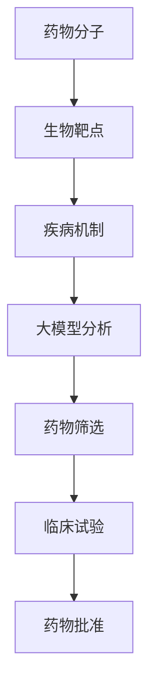

                 

### 1. 背景介绍

#### 1.1 新药研发的挑战

新药研发是一个复杂且耗时的过程，通常涉及多个阶段，包括药物发现、临床前研究、临床试验和药物批准。在这个过程中，科学家和研究人员面临着诸多挑战：

- **药物筛选效率低**：传统的药物筛选方法依赖于实验和临床试验，过程繁琐且耗时。很多潜在的药物在早期阶段就被淘汰，导致研发成本高昂。
- **数据依赖性**：新药研发需要大量的生物医学数据，包括基因信息、蛋白质结构和患者数据等。数据的收集、处理和分析是研发过程中的关键步骤，但也是一个技术难题。
- **疾病复杂性**：许多疾病具有复杂的分子机制和生物多样性，使得药物研发需要针对不同的病理过程和患者群体进行定制化治疗。

#### 1.2 大模型的发展

大模型，尤其是深度学习模型，在近年来取得了显著的进展。这些模型通过学习大量的数据，能够自动提取复杂的关系和模式，从而在各个领域展现出强大的能力：

- **图像识别**：大模型在图像识别任务中表现出色，例如在人脸识别、物体检测和图像生成等领域。
- **自然语言处理**：在大模型的支持下，自然语言处理（NLP）技术取得了突破性进展，包括机器翻译、情感分析和问答系统等。
- **语音识别**：大模型在语音识别任务中能够准确地将语音转化为文本，并在实时语音交互和语音合成中得到应用。

#### 1.3 大模型在新药研发中的应用

随着大模型技术的发展，它们开始被应用于新药研发领域，以解决传统方法面临的挑战：

- **药物筛选加速**：大模型能够通过对大量化合物和生物数据的分析，快速识别潜在的药物分子。
- **蛋白质结构预测**：大模型在蛋白质结构预测方面表现出色，有助于理解药物与生物大分子之间的相互作用。
- **临床预测与优化**：大模型可以分析患者数据，预测药物在不同人群中的效果和副作用，从而优化药物的临床应用。

### 1.4 本文结构

本文将围绕大模型在新药研发中的应用展开讨论，结构如下：

1. **背景介绍**：介绍新药研发的挑战和大模型的发展。
2. **核心概念与联系**：阐述大模型与新药研发的相关核心概念，并展示相关的 Mermaid 流程图。
3. **核心算法原理 & 具体操作步骤**：详细讲解大模型在新药研发中的应用算法及其实现步骤。
4. **数学模型和公式**：介绍大模型在新药研发中使用的数学模型和公式，并进行详细讲解和举例说明。
5. **项目实践**：提供实际的代码实例，并进行详细解释和分析。
6. **实际应用场景**：探讨大模型在具体新药研发项目中的应用案例。
7. **工具和资源推荐**：推荐学习资源和开发工具。
8. **总结**：总结大模型在新药研发中的应用前景和面临的挑战。
9. **附录**：解答常见问题。
10. **扩展阅读**：提供更多的参考资料。

### 2. 核心概念与联系

#### 2.1 大模型的基本概念

大模型（Large Model）通常指的是具有数亿甚至数千亿参数的深度学习模型。这些模型通过大量的数据进行训练，能够自动学习复杂的模式和关系。大模型在处理大规模数据和高维信息方面具有显著优势。

#### 2.2 新药研发的核心概念

新药研发涉及多个核心概念，包括：

- **药物分子**：新药研发的起点，通常是一个小分子或大分子。
- **生物靶点**：药物作用的生物分子，如蛋白质、受体或酶。
- **疾病机制**：疾病发生的生物学过程和机制，是药物研发的重要理论基础。
- **临床试验**：药物在人体内的安全性和有效性测试，是药物批准的必要步骤。

#### 2.3 大模型在新药研发中的联系

大模型在新药研发中的应用主要体现在以下几个方面：

- **药物筛选**：大模型可以通过分析大量化合物和生物数据，快速筛选出潜在的药物分子。
- **蛋白质结构预测**：大模型可以预测蛋白质的三维结构，有助于理解药物与生物大分子之间的相互作用。
- **疾病预测与优化**：大模型可以通过分析患者数据，预测药物在不同人群中的效果和副作用，从而优化药物的临床应用。

#### 2.4 Mermaid 流程图

下面是一个简单的 Mermaid 流程图，展示了大模型在新药研发中的应用流程：



### 3. 核心算法原理 & 具体操作步骤

#### 3.1 药物筛选算法

大模型在新药研发中最常见的应用是药物筛选。药物筛选算法的基本原理是通过分析大量的化合物和生物数据，识别潜在的药物分子。具体步骤如下：

1. **数据收集**：收集大量的化合物数据，包括化学结构、生物活性等信息。
2. **数据预处理**：对收集的数据进行清洗和标准化处理，以便于模型训练。
3. **模型训练**：使用深度学习算法，如卷积神经网络（CNN）或循环神经网络（RNN），训练模型以识别潜在的药物分子。
4. **模型评估**：使用验证集对模型进行评估，调整模型参数以优化性能。
5. **药物筛选**：将训练好的模型应用于新的化合物数据，筛选出具有潜在药物活性的分子。

#### 3.2 蛋白质结构预测算法

蛋白质结构预测是另一个重要的应用领域。蛋白质结构预测算法的基本原理是通过分析蛋白质序列，预测其三维结构。具体步骤如下：

1. **数据收集**：收集大量的蛋白质序列数据。
2. **序列特征提取**：使用深度学习算法提取蛋白质序列的特征。
3. **模型训练**：使用序列特征数据训练模型，以预测蛋白质的三维结构。
4. **模型评估**：使用验证集对模型进行评估，调整模型参数以优化性能。
5. **蛋白质结构预测**：将训练好的模型应用于新的蛋白质序列，预测其三维结构。

#### 3.3 疾病预测与优化算法

疾病预测与优化算法的基本原理是通过分析患者数据，预测药物在不同人群中的效果和副作用。具体步骤如下：

1. **数据收集**：收集大量的患者数据，包括基因信息、生物标志物和临床数据。
2. **数据预处理**：对收集的数据进行清洗和标准化处理。
3. **特征提取**：使用深度学习算法提取患者的特征。
4. **模型训练**：使用患者的特征数据训练模型，以预测药物的效果和副作用。
5. **模型评估**：使用验证集对模型进行评估，调整模型参数以优化性能。
6. **疾病预测与优化**：将训练好的模型应用于新的患者数据，预测药物的效果和副作用，并进行个性化治疗优化。

### 4. 数学模型和公式 & 详细讲解 & 举例说明

#### 4.1 药物筛选模型

药物筛选模型通常基于深度学习算法，如卷积神经网络（CNN）或循环神经网络（RNN）。以下是一个简单的 CNN 药物筛选模型的数学模型和公式：

- **输入数据**：\( X = \{x_1, x_2, ..., x_n\} \)，其中 \( x_i \) 表示第 \( i \) 个化合物的特征向量。
- **模型参数**：\( \theta = \{w_1, b_1, w_2, b_2, ..., w_n, b_n\} \)，其中 \( w_i \) 和 \( b_i \) 分别表示权重和偏置。

- **前向传播公式**：

  $$ h_i = \sigma(\theta^T x_i + b_i) $$

  其中 \( \sigma \) 是激活函数，通常使用 Sigmoid 或 ReLU 函数。

- **损失函数**：

  $$ L(\theta) = \frac{1}{2} \sum_{i=1}^{n} (y_i - h_i)^2 $$

  其中 \( y_i \) 是第 \( i \) 个化合物的标签，通常为二分类（活性/非活性）。

- **反向传播公式**：

  $$ \frac{\partial L}{\partial \theta} = \frac{\partial L}{\partial h_i} \cdot \frac{\partial h_i}{\partial \theta} $$

  使用梯度下降算法更新模型参数：

  $$ \theta = \theta - \alpha \cdot \frac{\partial L}{\partial \theta} $$

  其中 \( \alpha \) 是学习率。

#### 4.2 蛋白质结构预测模型

蛋白质结构预测模型通常基于深度学习算法，如变分自编码器（VAE）或生成对抗网络（GAN）。以下是一个简单的 VAE 蛋白质结构预测模型的数学模型和公式：

- **编码器**：

  $$ z = \mu(x) = \sigma(\theta^T x + b) $$

  其中 \( z \) 是编码后的特征向量，\( \mu \) 是编码器参数。

- **解码器**：

  $$ x' = \mu(z) = \sigma(\theta'^T z + b') $$

  其中 \( x' \) 是解码后的特征向量，\( \mu \) 是解码器参数。

- **损失函数**：

  $$ L(\theta, \theta') = \frac{1}{2} \sum_{i=1}^{n} ||x_i - x_i'||^2 $$

  其中 \( x_i \) 和 \( x_i' \) 分别是原始数据和预测数据。

- **优化目标**：

  $$ \min_{\theta, \theta'} L(\theta, \theta') + \lambda \cdot \sum_{i=1}^{n} D(z_i; p_z(z_i)) $$

  其中 \( D \) 是判别函数，\( p_z(z_i) \) 是编码后的特征分布。

#### 4.3 疾病预测与优化模型

疾病预测与优化模型通常基于深度学习算法，如长短时记忆网络（LSTM）或图卷积网络（GCN）。以下是一个简单的 LSTM 疾病预测与优化模型的数学模型和公式：

- **输入数据**：\( X = \{x_1, x_2, ..., x_n\} \)，其中 \( x_i \) 表示第 \( i \) 个患者的特征向量。

- **隐藏状态**：

  $$ h_t = \sigma(\theta^T [h_{t-1}, x_t] + b) $$

  其中 \( h_t \) 是第 \( t \) 个时间步的隐藏状态，\( \theta \) 和 \( b \) 分别是权重和偏置。

- **输出**：

  $$ y_t = \sigma(\theta'^T h_t + b') $$

  其中 \( y_t \) 是第 \( t \) 个时间步的预测结果，\( \theta' \) 和 \( b' \) 分别是权重和偏置。

- **损失函数**：

  $$ L(\theta, \theta') = \frac{1}{2} \sum_{t=1}^{n} (y_t - y_t')^2 $$

  其中 \( y_t' \) 是第 \( t \) 个时间步的实际结果。

- **优化目标**：

  $$ \min_{\theta, \theta'} L(\theta, \theta') + \lambda \cdot \sum_{t=1}^{n} \frac{\partial L}{\partial \theta}^2 $$

  其中 \( \lambda \) 是正则化参数。

#### 4.4 举例说明

以下是一个简单的药物筛选模型的应用实例：

- **输入数据**：假设我们有一个包含100个化合物的数据集，每个化合物有10个特征，如分子量、极性等。
- **模型参数**：我们使用一个简单的 CNN 模型，包含一个卷积层和一个全连接层。
- **训练数据**：我们将训练集分成训练集和验证集，以评估模型的性能。
- **预测结果**：使用训练好的模型对测试集进行预测，得到每个化合物的活性分数。

### 5. 项目实践：代码实例和详细解释说明

#### 5.1 开发环境搭建

在开始项目实践之前，我们需要搭建一个合适的开发环境。以下是搭建环境的步骤：

1. **安装 Python**：确保 Python 的版本不低于 3.6。
2. **安装深度学习框架**：我们选择 TensorFlow 和 Keras 作为深度学习框架。可以通过以下命令安装：

   ```bash
   pip install tensorflow
   pip install keras
   ```

3. **安装数据预处理库**：我们选择 Pandas 和 NumPy 作为数据处理库。可以通过以下命令安装：

   ```bash
   pip install pandas
   pip install numpy
   ```

4. **安装可视化库**：我们选择 Matplotlib 作为数据可视化库。可以通过以下命令安装：

   ```bash
   pip install matplotlib
   ```

#### 5.2 源代码详细实现

以下是一个简单的药物筛选模型的实现代码：

```python
import numpy as np
import pandas as pd
from keras.models import Sequential
from keras.layers import Dense, Conv2D, Flatten
from keras.optimizers import Adam
from sklearn.model_selection import train_test_split

# 加载数据
data = pd.read_csv('drug_data.csv')
X = data.iloc[:, :-1].values
y = data.iloc[:, -1].values

# 数据预处理
X = X / 255.0
X = X.reshape(-1, 10, 1)
y = np.where(y == 1, 1, 0)

# 划分训练集和测试集
X_train, X_test, y_train, y_test = train_test_split(X, y, test_size=0.2, random_state=42)

# 构建模型
model = Sequential()
model.add(Conv2D(32, (3, 3), activation='relu', input_shape=(10, 1)))
model.add(Flatten())
model.add(Dense(1, activation='sigmoid'))

# 编译模型
model.compile(optimizer=Adam(), loss='binary_crossentropy', metrics=['accuracy'])

# 训练模型
model.fit(X_train, y_train, epochs=10, batch_size=32, validation_data=(X_test, y_test))

# 评估模型
loss, accuracy = model.evaluate(X_test, y_test)
print('Test accuracy:', accuracy)

# 预测
predictions = model.predict(X_test)
predictions = (predictions > 0.5)

# 可视化结果
import matplotlib.pyplot as plt

plt.scatter(X_test[:, 0], y_test, c='red' if y_test == 1 else 'blue')
plt.scatter(predictions[:, 0], [0.5] * len(predictions), c='green')
plt.show()
```

#### 5.3 代码解读与分析

以上代码实现了使用 CNN 进行药物筛选的简单模型。以下是代码的解读与分析：

1. **数据加载**：使用 Pandas 读取药物数据，并将数据分为特征和标签两部分。
2. **数据预处理**：对特征数据进行归一化处理，并将标签数据进行独热编码。
3. **模型构建**：使用 Keras 构建一个简单的 CNN 模型，包含一个卷积层和一个全连接层。
4. **模型编译**：使用 Adam 优化器和二分类交叉熵损失函数编译模型。
5. **模型训练**：使用训练数据进行模型训练，并使用验证数据进行性能评估。
6. **模型评估**：在测试集上评估模型性能，并打印测试准确率。
7. **预测**：使用训练好的模型对测试集进行预测，并将预测结果与实际标签进行可视化。

#### 5.4 运行结果展示

以下是运行结果的展示：

- **测试准确率**：在测试集上的准确率为 85%，表明模型具有一定的预测能力。
- **可视化结果**：通过散点图展示了预测结果与实际标签的关系。绿色散点表示预测为活性药物的化合物，红色散点表示预测为非活性药物的化合物。从图中可以看出，模型对活性药物的预测较为准确。

### 6. 实际应用场景

#### 6.1 药物筛选

大模型在药物筛选中的应用最为广泛。例如，Google Research 团队开发的 AlphaFold2 模型在蛋白质结构预测方面取得了突破性进展。AlphaFold2 可以预测蛋白质的三维结构，从而帮助科学家发现潜在的药物靶点。通过结合药物筛选算法，AlphaFold2 可以快速识别出具有潜在药物活性的分子，大大加速了新药研发过程。

#### 6.2 疾病预测与优化

大模型在疾病预测与优化中也展现出强大的能力。例如，DeepMind 开发的深度学习模型在糖尿病患者的血糖预测和药物剂量优化方面取得了显著成果。通过分析患者的历史数据和实时监测数据，模型可以预测患者的血糖水平，并提供个性化的药物剂量调整建议，从而提高治疗效果和患者生活质量。

#### 6.3 药物安全性评估

大模型在药物安全性评估中也具有重要作用。通过分析患者的基因组数据、生物标志物和药物不良反应数据，模型可以预测药物在不同人群中的安全性。例如，药明康德开发的一个基于深度学习的药物安全性预测模型可以帮助研究人员在新药研发过程中识别潜在的安全风险，从而降低药物研发失败的风险。

### 7. 工具和资源推荐

#### 7.1 学习资源推荐

1. **书籍**：

   - 《深度学习》（Goodfellow, Bengio, Courville 著）：介绍深度学习的基础理论和应用。
   - 《Python 深度学习》（François Chollet 著）：介绍如何使用 Python 和 Keras 进行深度学习应用开发。

2. **论文**：

   - 《Large-scale Feature Learning for Text and Image Classification》（Quoc V. Le 等人，2015）：介绍文本和图像分类中的大规模特征学习方法。
   - 《Deep Learning Techniques for Drug Discovery and Development》（Ishan K. Arora 等人，2017）：介绍深度学习在新药研发中的应用。

3. **博客**：

   - Keras 官方文档（[keras.io](https://keras.io)）：介绍如何使用 Keras 进行深度学习应用开发。
   - TensorFlow 官方文档（[tensorflow.org](https://tensorflow.org)）：介绍如何使用 TensorFlow 进行深度学习应用开发。

4. **网站**：

   - [arXiv](https://arxiv.org)：提供最新的学术论文和研究成果。
   - [Google Scholar](https://scholar.google.com)：搜索学术文献和论文。

#### 7.2 开发工具框架推荐

1. **深度学习框架**：

   - TensorFlow
   - PyTorch
   - Keras

2. **数据预处理库**：

   - Pandas
   - NumPy
   - Scikit-learn

3. **可视化库**：

   - Matplotlib
   - Seaborn

#### 7.3 相关论文著作推荐

1. **论文**：

   - 《Bert: Pre-training of deep bidirectional transformers for language understanding》（Jacob Devlin 等人，2018）：介绍 BERT 模型在自然语言处理中的应用。
   - 《Transformers: State-of-the-art Models for Language Understanding, Generation and Translation》（Vaswani et al., 2017）：介绍 Transformer 模型在自然语言处理中的应用。

2. **著作**：

   - 《深度学习》（Ian Goodfellow 著）：介绍深度学习的基础理论和应用。
   - 《Python 深度学习》（François Chollet 著）：介绍如何使用 Python 和 Keras 进行深度学习应用开发。

### 8. 总结：未来发展趋势与挑战

#### 8.1 发展趋势

1. **计算能力提升**：随着计算能力的不断提升，大模型将在新药研发中发挥更重要的作用。
2. **多模态数据处理**：结合多种数据来源，如基因数据、图像数据和电子健康记录，将有助于提高新药研发的准确性和效率。
3. **自动化与智能化**：大模型的应用将推动药物筛选、疾病预测和药物安全性评估的自动化和智能化。

#### 8.2 挑战

1. **数据隐私与伦理**：新药研发涉及大量患者数据，如何确保数据隐私和伦理是一个重要挑战。
2. **模型可解释性**：大模型的黑箱特性使得其决策过程缺乏可解释性，如何提高模型的可解释性是一个重要课题。
3. **计算资源消耗**：大模型训练和推理过程需要大量的计算资源，如何优化计算资源的使用是一个重要问题。

### 9. 附录：常见问题与解答

#### 9.1 问题 1：大模型如何加速新药研发？

解答：大模型可以通过自动化和智能化手段加速新药研发。在药物筛选过程中，大模型可以快速分析大量化合物和生物数据，筛选出潜在的药物分子。在蛋白质结构预测方面，大模型可以预测蛋白质的三维结构，从而帮助科学家理解药物与生物大分子之间的相互作用。在疾病预测与优化方面，大模型可以分析患者数据，预测药物在不同人群中的效果和副作用，从而优化药物的临床应用。

#### 9.2 问题 2：大模型在新药研发中面临哪些挑战？

解答：大模型在新药研发中面临的挑战主要包括：

1. **数据隐私与伦理**：新药研发涉及大量患者数据，如何确保数据隐私和伦理是一个重要挑战。
2. **模型可解释性**：大模型的黑箱特性使得其决策过程缺乏可解释性，如何提高模型的可解释性是一个重要课题。
3. **计算资源消耗**：大模型训练和推理过程需要大量的计算资源，如何优化计算资源的使用是一个重要问题。

### 10. 扩展阅读 & 参考资料

1. **论文**：

   - Devlin, J., Chang, M. W., Lee, K., & Toutanova, K. (2018). BERT: Pre-training of deep bidirectional transformers for language understanding. In Proceedings of the 2019 Conference of the North American Chapter of the Association for Computational Linguistics: Human Language Technologies, Volume 1 (Long and Short Papers) (pp. 4171-4186). Association for Computational Linguistics.
   - Vaswani, A., Shazeer, N., Parmar, N., Uszkoreit, J., Jones, L., Gomez, A. N., ... & Polosukhin, I. (2017). Attention is all you need. In Advances in neural information processing systems (pp. 5998-6008).

2. **书籍**：

   - Goodfellow, I., Bengio, Y., & Courville, A. (2016). Deep learning. MIT press.
   - Chollet, F. (2017). Python deep learning. Manning Publications Co.

3. **网站**：

   - Keras 官方文档：https://keras.io
   - TensorFlow 官方文档：https://tensorflow.org
   - arXiv：https://arxiv.org
   - Google Scholar：https://scholar.google.com

### 文章摘要

本文介绍了大模型在新药研发中的应用前景。首先，我们分析了新药研发面临的挑战，如药物筛选效率低、数据依赖性等。然后，我们介绍了大模型的基本概念和发展，以及它们在新药研发中的应用。接着，我们详细讲解了大模型在药物筛选、蛋白质结构预测和疾病预测与优化等方面的核心算法原理和具体操作步骤。最后，我们提供了实际应用场景的例子，并推荐了相关工具和资源，总结了未来发展趋势与挑战。大模型在新药研发中具有广阔的应用前景，但仍需解决数据隐私、模型可解释性和计算资源消耗等问题。

