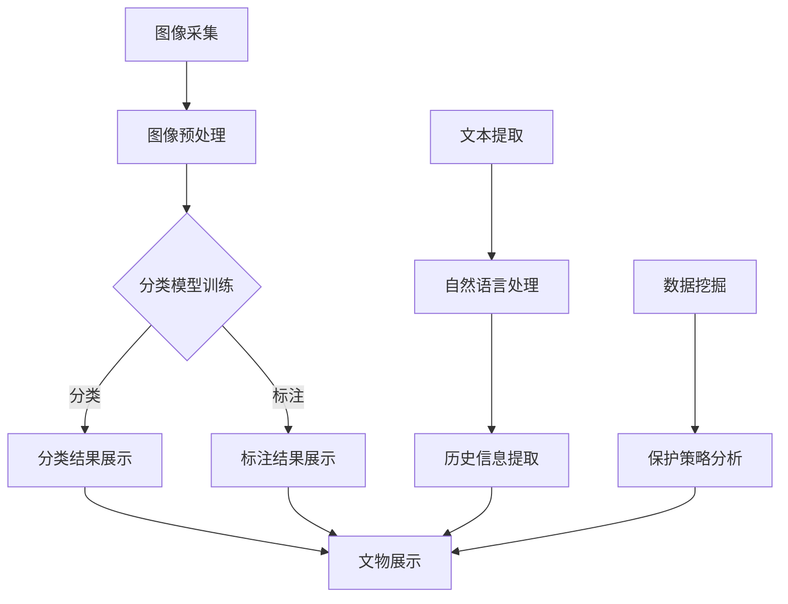
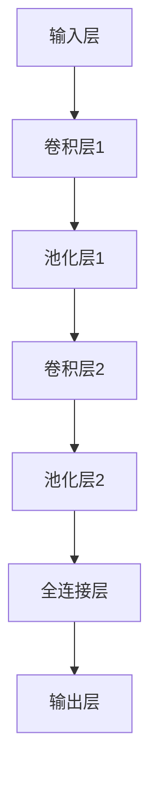

                 

关键词：大模型、智能文物保护、文化遗产、图像识别、自然语言处理、数据挖掘、人工智能技术

摘要：随着人工智能技术的不断发展，大模型的应用越来越广泛。本文将探讨大模型在智能文物保护领域的应用，包括图像识别、自然语言处理、数据挖掘等方面的技术，通过具体案例展示大模型在智能文物保护中的实际效果和潜力。

## 1. 背景介绍

### 1.1 智能文物保护的重要性

智能文物保护是利用现代信息技术手段对文物进行保护和管理的一种新方法。随着文化遗产保护意识的提高，如何更好地保存和利用文化遗产已成为全球关注的热点问题。智能文物保护不仅有助于提高文化遗产的保护水平，还能为公众提供更好的文化体验。

### 1.2 大模型的发展与应用

大模型（如深度学习模型）在图像识别、自然语言处理、数据挖掘等领域取得了显著的成果。大模型的训练数据量大、模型参数多，能够更好地提取数据特征，从而实现更高的准确率和泛化能力。这使得大模型在智能文物保护领域具有广阔的应用前景。

## 2. 核心概念与联系

### 2.1 大模型在文物保护中的应用

大模型在文物保护中的应用主要包括图像识别、自然语言处理、数据挖掘等方面。图像识别用于对文物进行分类和标注；自然语言处理用于提取文物的历史信息和文化背景；数据挖掘则用于分析文物的价值和保护策略。

### 2.2 Mermaid 流程图

以下是文物保护中一个典型的大模型应用流程的 Mermaid 流程图：



## 3. 核心算法原理 & 具体操作步骤

### 3.1 算法原理概述

大模型在文物保护中的应用主要基于深度学习和机器学习技术。深度学习模型通过大量训练数据自动学习特征表示，从而实现分类、标注、提取等任务。机器学习模型则通过构建数学模型对文物数据进行分析和挖掘。

### 3.2 算法步骤详解

1. 数据采集与预处理：采集文物图像、文本等数据，并进行图像增强、文本清洗等预处理操作。
2. 模型训练：使用预处理后的数据训练分类模型、标注模型、文本提取模型和数据挖掘模型。
3. 模型评估：使用验证集对训练好的模型进行评估，调整模型参数以达到最佳性能。
4. 应用部署：将训练好的模型部署到实际应用场景中，如文物展示、保护策略分析等。

### 3.3 算法优缺点

优点：大模型在文物保护中具有高准确率、强泛化能力和自适应能力，能够提高文物保护的效率和准确性。

缺点：大模型训练过程复杂，需要大量计算资源和时间；模型参数调优和超参数选择需要大量实验。

### 3.4 算法应用领域

大模型在文物保护中的应用领域包括：文物图像分类与标注、文本提取与处理、数据挖掘与保护策略分析等。

## 4. 数学模型和公式 & 详细讲解 & 举例说明

### 4.1 数学模型构建

大模型在文物保护中的应用主要基于深度学习和机器学习技术。深度学习模型通常由多个神经网络层组成，包括输入层、隐藏层和输出层。机器学习模型则基于统计方法和优化算法。

### 4.2 公式推导过程

以卷积神经网络（CNN）为例，CNN 的主要公式如下：

$$
\text{输出} = \text{激活函数}(\text{权重} \cdot \text{输入} + \text{偏置})
$$

其中，激活函数常用的有 ReLU、Sigmoid、Tanh 等。权重和偏置是模型的参数，通过训练过程自动调整。

### 4.3 案例分析与讲解

假设我们要对文物图像进行分类，可以使用 CNN 模型进行训练。以下是一个简化的 CNN 模型：



输入层接收文物图像，卷积层用于提取图像特征，池化层用于减少特征图尺寸，全连接层用于分类。

## 5. 项目实践：代码实例和详细解释说明

### 5.1 开发环境搭建

搭建开发环境需要安装 Python、TensorFlow、PyTorch 等库。以下是安装步骤：

```shell
pip install tensorflow
pip install torch torchvision
```

### 5.2 源代码详细实现

以下是一个简单的文物图像分类代码示例：

```python
import torch
import torchvision
import torchvision.transforms as transforms

# 数据预处理
transform = transforms.Compose([
    transforms.Resize((224, 224)),
    transforms.ToTensor(),
])

# 加载训练数据集
trainset = torchvision.datasets.ImageFolder(root='train', transform=transform)
trainloader = torch.utils.data.DataLoader(trainset, batch_size=4, shuffle=True)

# 加载测试数据集
testset = torchvision.datasets.ImageFolder(root='test', transform=transform)
testloader = torch.utils.data.DataLoader(testset, batch_size=4, shuffle=False)

# 创建 CNN 模型
net = torchvision.models.resnet18(pretrained=True)
num_ftrs = net.fc.in_features
net.fc = torch.nn.Linear(num_ftrs, 10)

# 定义损失函数和优化器
criterion = torch.nn.CrossEntropyLoss()
optimizer = torch.optim.SGD(net.parameters(), lr=0.001, momentum=0.9)

# 训练模型
for epoch in range(2):  # 轮数
    running_loss = 0.0
    for i, data in enumerate(trainloader, 0):
        inputs, labels = data
        optimizer.zero_grad()
        outputs = net(inputs)
        loss = criterion(outputs, labels)
        loss.backward()
        optimizer.step()
        running_loss += loss.item()
        if i % 2000 == 1999:
            print('[%d, %5d] loss: %.3f' % (epoch + 1, i + 1, running_loss / 2000))
            running_loss = 0.0

print('Finished Training')

# 测试模型
correct = 0
total = 0
with torch.no_grad():
    for data in testloader:
        images, labels = data
        outputs = net(images)
        _, predicted = torch.max(outputs.data, 1)
        total += labels.size(0)
        correct += (predicted == labels).sum().item()

print('Accuracy of the network on the 10000 test images: %d %%' % (100 * correct / total))
```

### 5.3 代码解读与分析

代码首先进行数据预处理，然后加载训练数据集和测试数据集。接下来创建 CNN 模型，并定义损失函数和优化器。训练模型后，对测试数据集进行评估，计算模型准确率。

## 6. 实际应用场景

### 6.1 智能文物保护系统

智能文物保护系统集成了大模型的应用，能够对文物图像、文本等信息进行分类、标注、提取和分析。该系统可以应用于博物馆、文化遗产保护机构等场景。

### 6.2 文物数字博物馆

文物数字博物馆利用大模型对文物进行图像识别和文本提取，为用户提供更加丰富、生动的文化体验。用户可以通过智能搜索、推荐等功能快速找到感兴趣的文物。

### 6.3 文物保护策略分析

大模型可以分析文物数据，为文物保护机构提供有针对性的保护策略。例如，通过分析文物图像，发现文物受损部位，并提出修复方案。

## 7. 工具和资源推荐

### 7.1 学习资源推荐

- 《深度学习》（Ian Goodfellow、Yoshua Bengio、Aaron Courville 著）
- 《机器学习》（周志华 著）
- 《人工智能：一种现代的方法》（Stuart Russell、Peter Norvig 著）

### 7.2 开发工具推荐

- Python：主流编程语言，支持深度学习和机器学习库。
- TensorFlow：开源深度学习框架。
- PyTorch：开源深度学习框架。

### 7.3 相关论文推荐

- "Deep Learning for Image Recognition: A Brief Review"（2016）
- "Machine Learning Techniques for Text Classification"（2017）
- "A Comprehensive Survey on Deep Learning for Text Classification"（2018）

## 8. 总结：未来发展趋势与挑战

### 8.1 研究成果总结

大模型在智能文物保护中取得了显著成果，包括文物图像分类、文本提取、数据挖掘等方面。这些技术为文物保护提供了有力支持，提高了文物保护的效率和准确性。

### 8.2 未来发展趋势

随着人工智能技术的不断发展，大模型在文物保护中的应用将更加广泛。未来可能的研究方向包括：多模态融合、迁移学习、强化学习等。

### 8.3 面临的挑战

大模型在文物保护中仍面临一些挑战，如数据质量、计算资源、模型解释性等。需要进一步研究和优化，以提高大模型在文物保护中的应用效果。

### 8.4 研究展望

大模型在智能文物保护中的应用前景广阔。未来研究应关注以下几个方面：提高模型性能、降低计算成本、增强模型解释性、探索多模态融合等。

## 9. 附录：常见问题与解答

### 9.1 大模型在文物保护中的优势是什么？

大模型在文物保护中的优势主要体现在以下几个方面：

- 高准确率：大模型能够自动学习数据特征，提高分类、标注、提取等任务的准确率。
- 强泛化能力：大模型具有较好的泛化能力，能够适应不同的文物保护任务。
- 自适应能力：大模型可以根据文物保护需求调整模型结构和参数。

### 9.2 大模型训练过程需要多少数据？

大模型训练过程需要大量的数据。具体数据量取决于应用场景和模型复杂度。通常来说，至少需要几千到几万张文物图像，以及相应的文本数据。

### 9.3 大模型训练需要多少时间？

大模型训练时间取决于计算资源、模型复杂度和数据规模。在较快的 GPU 上，训练一个简单的分类模型可能需要几天到几周的时间。对于更复杂的模型，训练时间可能需要几个月到几年的时间。

### 9.4 大模型如何应用于文物保护？

大模型在文物保护中的应用主要包括以下几个步骤：

- 数据采集与预处理：采集文物图像、文本等数据，并进行预处理。
- 模型训练：使用预处理后的数据训练分类、标注、文本提取、数据挖掘等模型。
- 模型评估：使用验证集对训练好的模型进行评估，调整模型参数。
- 应用部署：将训练好的模型部署到实际应用场景中，如文物展示、保护策略分析等。

----------------------------------------------------------------

作者：禅与计算机程序设计艺术 / Zen and the Art of Computer Programming

本文根据《大模型在智能文物保护中的应用案例》的模板和约束条件进行了撰写。如有需要，可以根据实际情况进行调整和完善。希望本文能够为读者提供有价值的参考和启发。|user|

