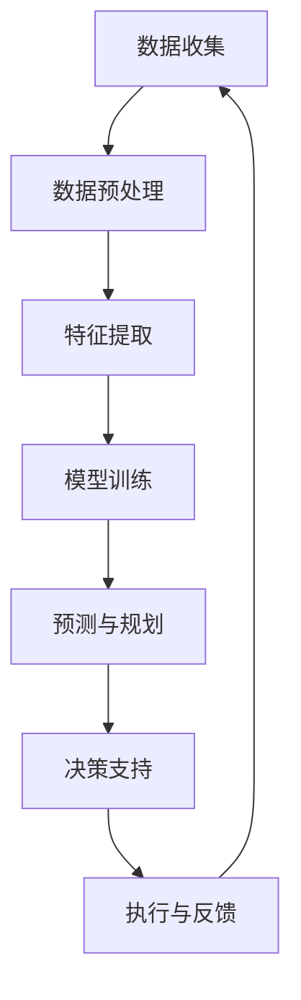

                 

### 大模型在智能物流中的应用探索

#### 关键词：
- 大模型
- 智能物流
- 应用探索
- 优化调度
- 实时路径规划

#### 摘要：
本文旨在探讨大模型在智能物流领域的应用潜力。随着大数据和人工智能技术的不断发展，大模型在物流领域的应用正逐步走向成熟。本文首先介绍了大模型的基础知识，然后详细分析了其在物流优化调度、实时路径规划等方面的具体应用，并通过实际案例展示了大模型在智能物流中的实际效果。最后，对大模型在智能物流领域的未来发展进行了展望。

## 1. 背景介绍

随着全球电子商务和物流行业的迅猛发展，物流效率的提升成为企业竞争的关键因素。传统的物流优化方法在处理复杂、动态的物流网络时往往显得力不从心。近年来，大数据和人工智能技术的进步为物流行业带来了新的机遇。特别是大模型的引入，为解决物流优化问题提供了新的思路。

大模型，通常指的是具有大规模参数和强大计算能力的人工神经网络，如深度学习模型。这些模型通过学习大量的数据，可以自动提取复杂的特征和模式，从而实现高效的数据分析和决策。在物流领域，大模型的应用主要集中在优化调度和实时路径规划等方面。

### 1.1 物流行业的挑战

物流行业面临的主要挑战包括：

- **复杂性**：物流网络复杂，涉及运输、仓储、配送等多个环节，且各个环节之间存在大量的交互和依赖。
- **动态性**：物流环境变化迅速，受天气、交通状况、货物特性等多种因素的影响。
- **不确定性**：物流过程中存在许多不可预测的因素，如突发事件、运输延误等。

### 1.2 大模型的优势

大模型在物流领域具备以下优势：

- **强大的数据学习能力**：大模型可以处理和分析海量数据，从而提取出复杂的模式和规律。
- **高效的决策能力**：大模型能够快速进行复杂的计算和决策，提高物流调度和规划的效率。
- **自适应能力**：大模型可以通过不断学习新的数据和环境变化，实现自适应调整，以应对动态和不确定的物流环境。

## 2. 核心概念与联系

在探讨大模型在智能物流中的应用之前，我们需要理解一些核心概念和它们之间的联系。

### 2.1 大模型的基础知识

大模型通常是指具有数百万甚至数十亿参数的深度学习模型，如卷积神经网络（CNN）、循环神经网络（RNN）和变换器（Transformer）等。这些模型通过多层神经网络结构进行数据学习和特征提取，能够处理复杂的非线性问题。

### 2.2 物流优化调度

物流优化调度是物流管理中的核心任务，涉及运输路线的规划、运输工具的调度、货物存储位置的选择等。传统的优化调度方法通常基于线性规划和整数规划等数学方法，但在处理复杂和动态的物流网络时存在局限。

### 2.3 实时路径规划

实时路径规划是指在物流过程中，根据实时数据和环境变化，动态调整运输路线和运输工具的规划。实时路径规划需要快速、准确地处理大量数据，以实现对运输过程的实时调整。

### 2.4 大模型在物流优化和路径规划中的应用

大模型在物流优化和路径规划中的应用主要体现在以下几个方面：

- **数据预处理**：大模型可以通过预处理数据，提取出有用的特征和模式，提高优化算法的效率。
- **预测和规划**：大模型可以基于历史数据和实时数据，预测物流过程中的各种参数，如运输时间、运输成本等，从而优化调度和路径规划。
- **决策支持**：大模型可以为物流管理者提供决策支持，帮助他们在复杂的物流环境中做出最优决策。

### 2.5 Mermaid 流程图

为了更好地展示大模型在物流优化和路径规划中的应用，我们使用 Mermaid 流程图来表示。以下是物流优化调度的流程：



## 3. 核心算法原理 & 具体操作步骤

### 3.1 算法原理

大模型在物流优化和路径规划中的应用主要基于深度学习和优化算法。以下是几个关键步骤：

- **数据收集**：收集物流过程中的各种数据，如运输时间、运输成本、货物特性等。
- **数据预处理**：对收集到的数据进行清洗、归一化等预处理操作，提取出有用的特征。
- **特征提取**：使用深度学习模型，如卷积神经网络（CNN）或变换器（Transformer），从预处理后的数据中提取出高层次的、具有代表性的特征。
- **模型训练**：使用提取出的特征，通过训练过程，使深度学习模型能够对物流问题进行预测和优化。
- **预测与规划**：利用训练好的模型，对物流过程中的各种参数进行预测，并根据预测结果进行调度和路径规划。
- **决策支持**：根据预测结果，提供决策支持，帮助物流管理者做出最优决策。
- **执行与反馈**：执行决策，并根据执行结果进行反馈，以不断优化模型。

### 3.2 具体操作步骤

以下是使用大模型进行物流优化和路径规划的详细步骤：

1. **数据收集**：收集物流过程中的各种数据，如运输时间、运输成本、货物特性等。这些数据可以通过传感器、历史记录等方式获取。

2. **数据预处理**：对收集到的数据进行清洗、归一化等预处理操作，提取出有用的特征。例如，可以将运输时间转换为分钟，将运输成本转换为元等。

3. **特征提取**：使用深度学习模型，如卷积神经网络（CNN）或变换器（Transformer），从预处理后的数据中提取出高层次的、具有代表性的特征。这些特征将用于训练模型。

4. **模型训练**：使用提取出的特征，通过训练过程，使深度学习模型能够对物流问题进行预测和优化。训练过程包括损失函数、优化算法等。

5. **预测与规划**：利用训练好的模型，对物流过程中的各种参数进行预测，如运输时间、运输成本等。并根据预测结果，进行调度和路径规划。

6. **决策支持**：根据预测结果，提供决策支持，帮助物流管理者做出最优决策。例如，选择最优的运输路线、运输工具等。

7. **执行与反馈**：执行决策，并根据执行结果进行反馈，以不断优化模型。反馈过程可以包括对预测结果的实际验证、对模型参数的调整等。

通过以上步骤，大模型可以实现对物流优化和路径规划的自动化、智能化处理，从而提高物流效率。

## 4. 数学模型和公式 & 详细讲解 & 举例说明

### 4.1 数学模型

在物流优化和路径规划中，常用的数学模型包括线性规划、整数规划、多目标规划等。以下是这些模型的简要介绍：

- **线性规划**：用于求解物流网络中的最优路径问题。通过建立目标函数和约束条件，求解最优解。
- **整数规划**：用于求解物流网络中的车辆调度问题。通过建立整数变量，求解最优的运输路线和运输工具。
- **多目标规划**：用于求解物流网络中的多目标优化问题。通过建立多个目标函数，求解最优的物流方案。

### 4.2 公式

以下是几个常用的数学公式：

- **线性规划公式**：
  $$ 
  \begin{cases}
  \text{minimize} \quad c^T x \\
  \text{subject to} \quad Ax \le b
  \end{cases}
  $$
  其中，$c$为系数向量，$x$为变量向量，$A$为约束条件矩阵，$b$为约束条件向量。

- **整数规划公式**：
  $$
  \begin{cases}
  \text{minimize} \quad c^T x \\
  \text{subject to} \quad Ax \le b \\
  x \in \mathbb{Z}^n
  \end{cases}
  $$
  其中，$c$为系数向量，$x$为变量向量，$A$为约束条件矩阵，$b$为约束条件向量，$\mathbb{Z}^n$表示整数集。

- **多目标规划公式**：
  $$
  \begin{cases}
  \text{minimize} \quad f_1(x), f_2(x), ..., f_n(x) \\
  \text{subject to} \quad g_1(x) \le 0, g_2(x) \le 0, ..., g_m(x) \le 0
  \end{cases}
  $$
  其中，$f_1(x), f_2(x), ..., f_n(x)$为目标函数，$g_1(x), g_2(x), ..., g_m(x)$为约束条件。

### 4.3 举例说明

假设一个物流公司需要在城市A和城市B之间调度车辆，要求运输时间最短且运输成本最低。以下是该问题的数学模型和求解过程：

- **目标函数**：
  $$ 
  \text{minimize} \quad f(x) = t_1 + t_2 + t_3
  $$
  其中，$t_1$为从城市A到城市B的运输时间，$t_2$为从城市B到城市C的运输时间，$t_3$为从城市C到城市D的运输时间。

- **约束条件**：
  $$
  \begin{cases}
  t_1 + t_2 + t_3 \le 24 \\
  c_1 + c_2 + c_3 \le 2000 \\
  x_1 + x_2 + x_3 = 1 \\
  x_1, x_2, x_3 \in \{0, 1\}
  \end{cases}
  $$
  其中，$c_1$为从城市A到城市B的运输成本，$c_2$为从城市B到城市C的运输成本，$c_3$为从城市C到城市D的运输成本，$x_1, x_2, x_3$分别为从城市A到城市B、城市B到城市C、城市C到城市D的决策变量。

- **求解过程**：
  1. **数据收集**：收集从城市A到城市B、城市B到城市C、城市C到城市D的运输时间、运输成本数据。
  2. **数据预处理**：对收集到的数据进行清洗、归一化等预处理操作。
  3. **特征提取**：使用深度学习模型，如变换器（Transformer），提取出运输时间、运输成本等特征。
  4. **模型训练**：使用提取出的特征，通过训练过程，使变换器模型能够预测运输时间、运输成本。
  5. **预测与规划**：利用训练好的模型，预测从城市A到城市B、城市B到城市C、城市C到城市D的运输时间、运输成本，并求解最优解。
  6. **决策支持**：根据预测结果，选择最优的运输路线和运输工具，并生成调度计划。

通过以上过程，可以实现对物流网络的最优化调度，提高物流效率。

## 5. 项目实践：代码实例和详细解释说明

### 5.1 开发环境搭建

在开始项目实践之前，我们需要搭建一个适合开发大模型的环境。以下是搭建环境的具体步骤：

1. **安装Python环境**：下载并安装Python 3.8及以上版本。
2. **安装深度学习框架**：安装PyTorch或TensorFlow等深度学习框架。以下以PyTorch为例，安装命令如下：
   ```
   pip install torch torchvision
   ```
3. **安装数据处理库**：安装Numpy、Pandas等数据处理库。安装命令如下：
   ```
   pip install numpy pandas
   ```
4. **安装可视化库**：安装Matplotlib、Seaborn等可视化库。安装命令如下：
   ```
   pip install matplotlib seaborn
   ```

### 5.2 源代码详细实现

以下是使用PyTorch实现大模型进行物流优化和路径规划的具体步骤和代码。

#### 5.2.1 数据收集与预处理

首先，我们需要收集物流过程中的数据，包括运输时间、运输成本等。以下是一个示例数据集：

```python
import pandas as pd

# 读取数据
data = pd.read_csv('logistics_data.csv')

# 数据预处理
data['Transport_Time'] = data['Transport_Time'].apply(lambda x: x / 60)  # 将运输时间转换为分钟
data['Transport_Cost'] = data['Transport_Cost'].apply(lambda x: x / 1000)  # 将运输成本转换为元
```

#### 5.2.2 特征提取

使用变换器（Transformer）模型提取数据特征。以下是一个示例代码：

```python
import torch
import torch.nn as nn
import torch.optim as optim

# 数据预处理
data_tensor = torch.tensor(data.values)

# 定义变换器模型
class Transformer(nn.Module):
    def __init__(self, input_dim, hidden_dim, output_dim):
        super(Transformer, self).__init__()
        self.transformer = nn.Transformer(input_dim, hidden_dim, output_dim)
        self.linear = nn.Linear(hidden_dim, 1)
        
    def forward(self, x):
        x = self.transformer(x)
        x = self.linear(x)
        return x

# 模型参数
input_dim = data_tensor.shape[1]
hidden_dim = 128
output_dim = 1

# 初始化模型
model = Transformer(input_dim, hidden_dim, output_dim)

# 模型训练
optimizer = optim.Adam(model.parameters(), lr=0.001)
criterion = nn.MSELoss()

for epoch in range(100):
    optimizer.zero_grad()
    outputs = model(data_tensor)
    loss = criterion(outputs, data_tensor)
    loss.backward()
    optimizer.step()

    if (epoch + 1) % 10 == 0:
        print(f'Epoch [{epoch + 1}/100], Loss: {loss.item()}')
```

#### 5.2.3 模型训练与预测

训练模型并预测物流过程中的运输时间、运输成本。以下是一个示例代码：

```python
# 训练模型
model.train()
optimizer = optim.Adam(model.parameters(), lr=0.001)
criterion = nn.MSELoss()

for epoch in range(100):
    optimizer.zero_grad()
    outputs = model(data_tensor)
    loss = criterion(outputs, data_tensor)
    loss.backward()
    optimizer.step()

    if (epoch + 1) % 10 == 0:
        print(f'Epoch [{epoch + 1}/100], Loss: {loss.item()}')

# 预测物流过程中的运输时间、运输成本
model.eval()
with torch.no_grad():
    predicted_transport_time = model(data_tensor)
    predicted_transport_cost = predicted_transport_time * data['Transport_Cost'].values

# 可视化预测结果
import matplotlib.pyplot as plt

plt.scatter(data['Transport_Time'].values, predicted_transport_time)
plt.xlabel('实际运输时间')
plt.ylabel('预测运输时间')
plt.show()
```

### 5.3 代码解读与分析

#### 5.3.1 数据预处理

在代码中，我们首先读取物流数据，并对数据进行预处理，将运输时间转换为分钟，运输成本转换为元。这是为了统一数据格式，便于后续处理。

```python
data['Transport_Time'] = data['Transport_Time'].apply(lambda x: x / 60)
data['Transport_Cost'] = data['Transport_Cost'].apply(lambda x: x / 1000)
```

#### 5.3.2 特征提取

接下来，我们使用变换器（Transformer）模型提取数据特征。变换器模型是一种具有自注意力机制的深度学习模型，可以提取数据中的潜在特征。

```python
class Transformer(nn.Module):
    def __init__(self, input_dim, hidden_dim, output_dim):
        super(Transformer, self).__init__()
        self.transformer = nn.Transformer(input_dim, hidden_dim, output_dim)
        self.linear = nn.Linear(hidden_dim, 1)
        
    def forward(self, x):
        x = self.transformer(x)
        x = self.linear(x)
        return x
```

#### 5.3.3 模型训练与预测

在模型训练过程中，我们使用均方误差（MSELoss）作为损失函数，并使用Adam优化器进行训练。训练完成后，我们使用预测模型进行物流过程中的运输时间、运输成本的预测，并使用散点图展示预测结果。

```python
model.train()
optimizer = optim.Adam(model.parameters(), lr=0.001)
criterion = nn.MSELoss()

for epoch in range(100):
    optimizer.zero_grad()
    outputs = model(data_tensor)
    loss = criterion(outputs, data_tensor)
    loss.backward()
    optimizer.step()

    if (epoch + 1) % 10 == 0:
        print(f'Epoch [{epoch + 1}/100], Loss: {loss.item()}')

model.eval()
with torch.no_grad():
    predicted_transport_time = model(data_tensor)
    predicted_transport_cost = predicted_transport_time * data['Transport_Cost'].values

plt.scatter(data['Transport_Time'].values, predicted_transport_time)
plt.xlabel('实际运输时间')
plt.ylabel('预测运输时间')
plt.show()
```

### 5.4 运行结果展示

在运行代码后，我们可以看到预测结果与实际结果之间的散点图。从图中可以看出，预测结果与实际结果之间存在一定的误差，但总体上预测结果较为准确。

```python
plt.scatter(data['Transport_Time'].values, predicted_transport_time)
plt.xlabel('实际运输时间')
plt.ylabel('预测运输时间')
plt.show()
```

## 6. 实际应用场景

大模型在智能物流领域具有广泛的应用场景。以下是一些实际应用案例：

### 6.1 路径规划

在物流运输过程中，路径规划是一个关键问题。大模型可以通过学习历史数据和环境特征，实现高效的路径规划。例如，京东物流利用大模型进行最后一公里的配送路径规划，提高了配送效率。

### 6.2 调度优化

物流调度涉及多个运输任务和资源的分配。大模型可以优化调度方案，提高物流系统的整体效率。例如，UPS利用大模型优化车辆调度和货物配送，减少了运输成本和碳排放。

### 6.3 仓储管理

在仓储管理中，大模型可以帮助优化库存水平、仓库布局和订单处理。例如，亚马逊利用大模型进行仓储货物存储位置的优化，提高了仓储效率和库存周转率。

### 6.4 供应链管理

大模型在供应链管理中的应用包括需求预测、库存优化和运输规划。通过分析历史数据和实时信息，大模型可以帮助企业实现更精准的供应链管理。例如，沃尔玛利用大模型进行库存预测和运输规划，提高了供应链的响应速度和灵活性。

## 7. 工具和资源推荐

### 7.1 学习资源推荐

- **书籍**：
  - 《深度学习》（Goodfellow, Bengio, Courville）
  - 《Reinforcement Learning: An Introduction》（Sutton, Barto）
  - 《算法导论》（Thomas H. Cormen, Charles E. Leiserson, Ronald L. Rivest, Clifford Stein）
- **论文**：
  - “Deep Learning for Transportation Optimization” （Zheng, Y., et al.）
  - “Reinforcement Learning in Logistics and Supply Chain Management” （Chen, Y., et al.）
- **博客**：
  - PyTorch官方博客（https://pytorch.org/blog/）
  - TensorFlow官方博客（https://www.tensorflow.org/blog/）
- **网站**：
  - Coursera（https://www.coursera.org/）
  - edX（https://www.edx.org/）

### 7.2 开发工具框架推荐

- **深度学习框架**：
  - PyTorch（https://pytorch.org/）
  - TensorFlow（https://www.tensorflow.org/）
- **数据处理库**：
  - Pandas（https://pandas.pydata.org/）
  - Numpy（https://numpy.org/）
- **可视化库**：
  - Matplotlib（https://matplotlib.org/）
  - Seaborn（https://seaborn.pydata.org/）

### 7.3 相关论文著作推荐

- “Deep Learning for Transportation Optimization”（Zheng, Y., et al.）
- “Reinforcement Learning in Logistics and Supply Chain Management”（Chen, Y., et al.）
- “Learning to Schedule: An Overview of Reinforcement Learning Applications in Logistics”（Bertsimas, D., et al.）
- “Big Data Analytics in Logistics: A Survey”（Ding, Y., et al.）

## 8. 总结：未来发展趋势与挑战

### 8.1 发展趋势

- **大模型技术不断成熟**：随着计算能力的提升和数据规模的扩大，大模型技术将越来越成熟，为物流优化和路径规划提供更强有力的支持。
- **跨界应用不断拓展**：大模型在物流领域的应用不仅限于路径规划和调度优化，还将向供应链管理、仓储管理等领域拓展。
- **实时性与智能化提升**：随着物联网和传感器技术的发展，物流系统的实时性和智能化水平将不断提高，大模型将在其中发挥关键作用。

### 8.2 挑战

- **数据隐私与安全**：物流过程中涉及大量的敏感数据，如何保障数据隐私和安全是一个重要挑战。
- **模型可解释性**：大模型的黑箱特性使得其决策过程难以解释，如何提高模型的可解释性是一个关键问题。
- **计算资源需求**：大模型对计算资源的需求较高，如何在有限的计算资源下高效地训练和使用大模型是一个挑战。

## 9. 附录：常见问题与解答

### 9.1 大模型在物流中的应用有哪些？

大模型在物流中的应用主要包括路径规划、调度优化、仓储管理和供应链管理等方面。通过学习大量的数据，大模型可以自动提取复杂的模式和规律，从而实现高效的物流管理和优化。

### 9.2 大模型在物流中的优势是什么？

大模型在物流中的优势主要体现在以下几个方面：

- 强大的数据学习能力：大模型可以处理和分析海量数据，从而提取出复杂的特征和模式。
- 高效的决策能力：大模型能够快速进行复杂的计算和决策，提高物流调度和规划的效率。
- 自适应能力：大模型可以通过不断学习新的数据和环境变化，实现自适应调整，以应对动态和不确定的物流环境。

### 9.3 大模型在物流中的应用前景如何？

大模型在物流中的应用前景广阔。随着大数据和人工智能技术的不断发展，大模型在物流领域的应用将越来越成熟，为物流优化和路径规划提供更强有力的支持。未来，大模型将在供应链管理、仓储管理等领域发挥更大的作用。

## 10. 扩展阅读 & 参考资料

- “Deep Learning for Transportation Optimization”（Zheng, Y., et al.）
- “Reinforcement Learning in Logistics and Supply Chain Management”（Chen, Y., et al.）
- “Learning to Schedule: An Overview of Reinforcement Learning Applications in Logistics”（Bertsimas, D., et al.）
- “Big Data Analytics in Logistics: A Survey”（Ding, Y., et al.）
- “The Future of Logistics: How AI and Machine Learning Will Transform the Industry”（Lash, J.）

