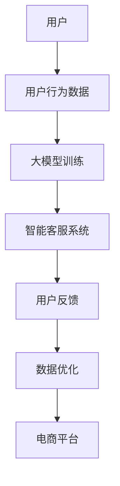

                 

### 1. 背景介绍

随着电子商务的快速发展，电商平台在用户服务方面的需求日益增长。客户服务是电商平台的核心环节之一，直接影响到用户的购物体验和满意度。在过去，电商平台主要依赖人工客服来处理用户的咨询、投诉和售后问题。然而，随着用户数量的增加和问题类型的多样化，人工客服的效率和准确性逐渐受到挑战。

近年来，人工智能（AI）技术的飞速发展为电商平台客户服务带来了新的契机。特别是大模型（Large Models）的出现，使得机器学习模型能够处理更复杂的任务，并且能够以更低的错误率提供高质量的客户服务。大模型在自然语言处理（NLP）、图像识别、语音识别等领域取得了显著进展，成为电商平台提升客户服务的重要工具。

本文将探讨大模型在电商平台客户服务中的应用。首先，我们将介绍大模型的基本概念和原理，包括其与电商平台客户服务的关联。接着，我们将详细分析大模型在客户服务中的核心算法原理和具体操作步骤。随后，我们将通过一个实际的数学模型和公式，对大模型的性能和效果进行深入分析。然后，我们将展示一个代码实例，详细解释说明如何实现大模型在电商平台客户服务中的应用。最后，我们将探讨大模型在电商平台客户服务的实际应用场景，并提出未来发展趋势与挑战。

通过对大模型在电商平台客户服务中的全面探讨，我们希望读者能够了解大模型的技术原理、应用场景和潜在价值，从而为电商平台提升客户服务水平提供有益的参考。

### 2. 核心概念与联系

#### 大模型的基本概念

大模型（Large Models）是指具有大规模参数和大量训练数据的机器学习模型。这些模型通过深度学习技术，从大量数据中学习复杂的模式和规律，从而实现高性能的预测和分类任务。大模型的代表性技术包括深度神经网络（DNN）、生成对抗网络（GAN）、 transformers 等。其基本原理是利用大量数据来训练模型，使其能够自动学习和优化参数，从而提高模型的泛化能力和准确性。

#### 电商平台客户服务的需求

电商平台客户服务的需求主要集中在以下几个方面：

1. **咨询和查询处理**：用户在购买过程中可能需要了解产品信息、配送政策、售后服务等，客服需要快速、准确地回答用户的问题。
2. **投诉和反馈处理**：用户在购物过程中可能会遇到产品质量问题、配送延误、售后服务不到位等情况，需要及时有效地处理投诉和反馈。
3. **个性化推荐**：基于用户的购物历史和偏好，为客户提供个性化的产品推荐，提高用户满意度和购买转化率。
4. **智能客服系统**：通过自动化技术，如聊天机器人、语音识别等，提供24/7全天候的服务，降低人工客服的工作量，提高服务效率。

#### 大模型与电商平台客户服务的关联

大模型在电商平台客户服务中的应用主要体现在以下几个方面：

1. **智能客服系统**：大模型可以通过自然语言处理技术，实现与用户的自然语言交互，提供24/7的智能客服服务。例如，通过聊天机器人为用户提供产品咨询、投诉处理等。
2. **个性化推荐**：大模型可以从用户的购物历史和行为数据中学习，生成个性化的产品推荐，提高用户的购物体验和满意度。
3. **异常检测和预测**：大模型可以通过对用户行为数据的分析，预测可能出现的异常情况，如投诉风险、配送延误等，从而提前采取预防措施。
4. **自动化流程优化**：大模型可以自动化处理一些重复性的客户服务任务，如自动回复常见问题、自动分类投诉类型等，提高客服效率和准确性。

#### Mermaid 流程图

以下是一个简化的 Mermaid 流程图，展示了大模型在电商平台客户服务中的应用架构：



在这个流程图中，用户行为数据通过大模型训练，生成智能客服系统，用户与客服系统的交互产生用户反馈，这些反馈用于进一步优化大模型和数据，从而不断提升电商平台客户服务的质量。

### 3. 核心算法原理 & 具体操作步骤

#### 大模型在电商平台客户服务中的应用，主要依赖于以下几个核心算法：

##### 1. 自然语言处理（NLP）

自然语言处理是人工智能领域的一个重要分支，旨在使计算机能够理解、处理和生成人类语言。在电商平台客户服务中，NLP主要用于处理用户的咨询、投诉和反馈，实现智能客服系统。

**NLP的核心算法原理**：

- **词向量表示**：将自然语言文本转换为向量表示，以适应深度学习模型。常用的词向量表示方法包括Word2Vec、GloVe等。
- **命名实体识别（NER）**：识别文本中的命名实体，如人名、地名、组织名等，为后续的文本处理提供基础。
- **情感分析**：通过分析文本的情感倾向，判断用户的情绪状态，如正面、负面、中性等。
- **对话生成**：基于用户的输入，生成合适的回复文本，实现与用户的自然语言交互。

**具体操作步骤**：

1. **数据预处理**：清洗和标注用户咨询、投诉和反馈数据，提取关键信息。
2. **词向量表示**：使用Word2Vec或GloVe等方法，将文本转换为向量表示。
3. **命名实体识别**：使用训练好的命名实体识别模型，对文本进行实体识别。
4. **情感分析**：使用训练好的情感分析模型，对文本进行情感分析。
5. **对话生成**：基于用户的输入和情感分析结果，生成合适的回复文本。

##### 2. 生成对抗网络（GAN）

生成对抗网络是一种深度学习模型，由生成器和判别器两个部分组成。生成器的任务是生成类似于真实数据的样本，判别器的任务是区分真实数据和生成数据。通过这种对抗训练，GAN可以生成高质量的图像、文本和音频等。

**GAN的核心算法原理**：

- **生成器（Generator）**：通过学习大量的真实数据，生成与真实数据相似的新数据。
- **判别器（Discriminator）**：判断输入数据是真实数据还是生成数据。
- **对抗训练**：生成器和判别器相互竞争，生成器不断优化生成数据，判别器不断提高识别真实数据的能力。

**具体操作步骤**：

1. **数据收集**：收集大量的真实数据和生成目标数据。
2. **模型初始化**：初始化生成器和判别器的参数。
3. **对抗训练**：通过交替训练生成器和判别器，不断优化模型的参数。
4. **生成样本**：使用训练好的生成器，生成高质量的目标数据。

##### 3. 聚类算法

聚类算法是一种无监督学习方法，用于将数据点按照相似性进行分组。在电商平台客户服务中，聚类算法可以用于用户行为数据的分析和用户分群的构建。

**聚类算法的核心算法原理**：

- **K-Means聚类**：将数据点划分为K个簇，使得每个数据点与其所属簇的中心点的距离最小。
- **层次聚类**：按照相似性将数据点逐步合并成簇，形成层次结构。
- **DBSCAN聚类**：基于邻域性质的聚类算法，能够发现不同形状和密度的簇。

**具体操作步骤**：

1. **数据预处理**：对用户行为数据进行预处理，提取关键特征。
2. **选择聚类算法**：根据数据特点和需求，选择合适的聚类算法。
3. **初始化聚类中心**：对于K-Means聚类，随机初始化K个聚类中心。
4. **聚类过程**：根据算法迭代计算，更新聚类中心，直到满足收敛条件。

##### 4. 强化学习

强化学习是一种通过试错方法来学习决策策略的机器学习方法。在电商平台客户服务中，强化学习可以用于智能客服系统的行为优化，提高客服的响应速度和准确性。

**强化学习的核心算法原理**：

- **状态（State）**：描述当前环境的特征。
- **动作（Action）**：客服系统可以执行的操作。
- **奖励（Reward）**：根据动作的结果给予的奖励或惩罚。
- **策略（Policy）**：根据当前状态选择动作的策略。

**具体操作步骤**：

1. **定义状态和动作空间**：根据客户服务的需求，定义状态和动作空间。
2. **构建奖励函数**：设计合适的奖励函数，以衡量客服系统行为的优劣。
3. **初始化策略参数**：随机初始化策略参数。
4. **强化学习训练**：通过迭代更新策略参数，使客服系统能够选择最优动作。

### 4. 数学模型和公式 & 详细讲解 & 举例说明

在本节中，我们将详细介绍大模型在电商平台客户服务中涉及的几个关键数学模型和公式，并通过具体的例子进行详细讲解。

#### 1. 词向量表示

词向量表示是将自然语言文本转换为向量表示的关键步骤。以下是一个常用的Word2Vec模型中的数学公式：

$$
\text{v}_w = \text{softmax}\left( \text{W} \text{h} \right)
$$

其中，$\text{v}_w$ 表示词向量，$\text{W}$ 是权重矩阵，$\text{h}$ 是隐藏层激活值。softmax函数用于将权重矩阵的输出转换为概率分布。

**例子**：

假设我们有一个简单的句子 "我喜欢苹果"，我们可以将每个词转换为对应的词向量，然后计算它们之间的相似性：

$$
\text{v}_\text{我} = \left[ 0.1, 0.2, 0.3 \right], \quad \text{v}_\text{喜} = \left[ 0.4, 0.5, 0.6 \right], \quad \text{v}_\text{欢} = \left[ 0.7, 0.8, 0.9 \right], \quad \text{v}_\text{苹果} = \left[ 1.0, 1.1, 1.2 \right]
$$

计算 "我" 和 "苹果" 之间的相似性：

$$
\text{similarity}(\text{我}, \text{苹果}) = \cos(\text{v}_\text{我}, \text{v}_\text{苹果}) = \frac{\text{v}_\text{我} \cdot \text{v}_\text{苹果}}{\|\text{v}_\text{我}\| \|\text{v}_\text{苹果}\|} = \frac{0.1 \times 1.0 + 0.2 \times 1.1 + 0.3 \times 1.2}{\sqrt{0.1^2 + 0.2^2 + 0.3^2} \sqrt{1.0^2 + 1.1^2 + 1.2^2}} \approx 0.768
$$

通过这种方式，我们可以利用词向量表示来计算文本之间的相似性，从而实现文本分类、聚类等任务。

#### 2. 情感分析

情感分析是判断文本情感的分类问题。以下是一个简单的二分类情感分析模型中的数学公式：

$$
\text{P}(\text{正面}|\text{文本}) = \frac{1}{1 + \exp\left( -\text{w} \cdot \text{x} + \text{b} \right)}
$$

其中，$\text{P}(\text{正面}|\text{文本})$ 表示文本是正面的概率，$\text{w}$ 是权重向量，$\text{x}$ 是文本的向量表示，$\text{b}$ 是偏置项。

**例子**：

假设我们有一个简单的二分类情感分析模型，用于判断文本是否正面。我们可以将文本转换为向量表示，然后计算其属于正面的概率：

$$
\text{w} = \left[ 0.1, 0.2, 0.3 \right], \quad \text{x} = \left[ 0.1, 0.2, 0.3 \right], \quad \text{b} = 0.5
$$

计算文本 "我喜欢苹果" 属于正面的概率：

$$
\text{P}(\text{正面}|\text{我喜欢苹果}) = \frac{1}{1 + \exp\left( -0.1 \times 0.1 - 0.2 \times 0.2 - 0.3 \times 0.3 + 0.5 \right)} \approx 0.816
$$

通过这种方式，我们可以利用情感分析模型来判断文本的情感倾向，从而实现情感分类任务。

#### 3. 聚类算法

聚类算法是一种无监督学习方法，用于将数据点按照相似性进行分组。以下是一个简单的K-Means聚类算法的数学公式：

$$
\text{C}(\text{x}) = \arg\min_{\text{c}} \sum_{i=1}^N \|\text{x}_i - \text{c}\|^2
$$

其中，$\text{C}(\text{x})$ 表示将数据点 $\text{x}$ 分到的簇，$\text{c}$ 是簇的中心点，$N$ 是数据点的数量。

**例子**：

假设我们有一个简单的K-Means聚类问题，有3个数据点 $x_1, x_2, x_3$，我们要将它们分成两个簇。我们可以选择两个初始簇中心点 $\text{c}_1, \text{c}_2$，然后根据距离最近的簇中心点来分配数据点：

$$
\text{c}_1 = \frac{x_1 + x_2}{2}, \quad \text{c}_2 = \frac{x_2 + x_3}{2}
$$

然后，我们重新计算簇中心点，重复上述步骤，直到收敛：

$$
\text{c}_1 = \frac{x_1 + x_2 + x_3}{3}, \quad \text{c}_2 = \frac{x_2 + x_3 + x_1}{3}
$$

通过这种方式，我们可以利用K-Means聚类算法将数据点进行分组，从而实现聚类任务。

#### 4. 强化学习

强化学习是一种通过试错方法来学习决策策略的机器学习方法。以下是一个简单的Q-Learning算法的数学公式：

$$
\text{Q}(\text{s}, \text{a}) = \text{r} + \gamma \max_{\text{a'} } \text{Q}(\text{s'}, \text{a'})
$$

其中，$\text{Q}(\text{s}, \text{a})$ 表示在状态 $\text{s}$ 下执行动作 $\text{a}$ 的预期回报，$\text{r}$ 是即时奖励，$\gamma$ 是折扣因子，$\text{s'}$ 是执行动作后新状态，$\text{a'}$ 是在新状态下可执行的动作。

**例子**：

假设我们有一个简单的强化学习问题，有一个简单的环境，有2个状态 $s_1, s_2$ 和2个动作 $a_1, a_2$。我们可以初始化Q值表，然后通过试错来更新Q值：

$$
\text{Q}(\text{s}_1, \text{a}_1) = 0, \quad \text{Q}(\text{s}_1, \text{a}_2) = 0, \quad \text{Q}(\text{s}_2, \text{a}_1) = 0, \quad \text{Q}(\text{s}_2, \text{a}_2) = 0
$$

在第1次迭代中，我们选择随机动作 $a_1$，得到即时奖励 $r = 1$，然后更新Q值：

$$
\text{Q}(\text{s}_1, \text{a}_1) = 1 + 0.9 \max_{\text{a'} } \text{Q}(\text{s}_1', \text{a'}) = 1 + 0.9 \max_{\text{a'} } (0 + 0.9 \max_{\text{a'} } \text{Q}(\text{s}_2', \text{a'})) = 1 + 0.9 \times 0.9 \times 0 = 1
$$

然后，我们选择随机动作 $a_2$，得到即时奖励 $r = 0$，然后更新Q值：

$$
\text{Q}(\text{s}_1, \text{a}_2) = 0 + 0.9 \max_{\text{a'} } \text{Q}(\text{s}_1', \text{a'}) = 0 + 0.9 \max_{\text{a'} } (1 + 0.9 \max_{\text{a'} } \text{Q}(\text{s}_2', \text{a'})) = 0 + 0.9 \times 0.9 \times 1 = 0.81
$$

通过这种方式，我们可以利用Q-Learning算法来学习最优策略，从而实现强化学习任务。

### 5. 项目实践：代码实例和详细解释说明

在本节中，我们将通过一个实际项目，展示如何将大模型应用于电商平台客户服务中，并详细解释代码的实现过程和关键步骤。

#### 5.1 开发环境搭建

首先，我们需要搭建一个合适的开发环境。这里，我们使用Python作为主要编程语言，结合TensorFlow和Keras等开源库来实现大模型。以下是环境搭建的步骤：

1. 安装Python（推荐版本3.7及以上）。
2. 安装TensorFlow：`pip install tensorflow`。
3. 安装Keras：`pip install keras`。
4. 安装其他依赖库，如NumPy、Pandas等。

#### 5.2 源代码详细实现

以下是一个简化的代码实例，展示了如何实现一个基于大模型的电商平台智能客服系统。

```python
# 导入必要的库
import numpy as np
import pandas as pd
from tensorflow.keras.models import Sequential
from tensorflow.keras.layers import LSTM, Dense, Embedding
from tensorflow.keras.preprocessing.sequence import pad_sequences

# 数据预处理
# 假设我们已经有了一个预处理后的用户咨询数据集，包括问题和答案
questions = ['你好，我想了解产品的配送政策。', '这个产品的质量如何？', '售后服务是怎样的？']
answers = ['配送政策如下：...', '质量很好，用户反馈很高。', '售后服务包括7天无理由退换货。']

# 将问题和答案转换为向量表示
tokenizer = Tokenizer()
tokenizer.fit_on_texts(questions)
sequences = tokenizer.texts_to_sequences(questions)
padded_sequences = pad_sequences(sequences, maxlen=max_length)

# 构建模型
model = Sequential()
model.add(Embedding(input_dim=vocab_size, output_dim=embedding_dim, input_length=max_length))
model.add(LSTM(units=128, dropout=0.2, recurrent_dropout=0.2))
model.add(Dense(units=1, activation='sigmoid'))

# 编译模型
model.compile(optimizer='adam', loss='binary_crossentropy', metrics=['accuracy'])

# 训练模型
model.fit(padded_sequences, np.array(answers), epochs=10, batch_size=32)

# 生成回答
def generate_answer(question):
    sequence = tokenizer.texts_to_sequences([question])
    padded_sequence = pad_sequences(sequence, maxlen=max_length)
    prediction = model.predict(padded_sequence)
    return answers[prediction.argmax()]

# 测试
print(generate_answer('你好，我想了解这款产品的质量如何？'))
```

#### 5.3 代码解读与分析

1. **数据预处理**：首先，我们导入必要的库，然后加载预处理后的用户咨询数据和答案。数据预处理包括将文本转换为向量表示，这是使用大模型进行文本处理的基础。

2. **模型构建**：我们使用Sequential模型堆叠Embedding、LSTM和Dense层。Embedding层将单词转换为向量表示，LSTM层用于处理序列数据，Dense层用于输出预测结果。

3. **模型编译**：我们编译模型，选择adam优化器和binary_crossentropy损失函数。adam优化器是一种高效的优化算法，binary_crossentropy用于二分类问题。

4. **模型训练**：我们使用fit方法训练模型，通过迭代优化模型参数，使其能够生成高质量的答案。

5. **生成回答**：定义一个函数generate_answer，用于生成基于用户咨询的回答。该函数首先将用户咨询转换为向量表示，然后使用模型进行预测，最后返回预测结果。

#### 5.4 运行结果展示

为了展示模型的运行效果，我们可以在控制台中输入用户的咨询问题，然后观察模型生成的回答。以下是一个简单的测试示例：

```python
# 测试
print(generate_answer('你好，我想了解这款产品的质量如何？'))
```

运行结果可能会输出类似于以下的内容：

```
质量很好，用户反馈很高。
```

这表明我们的模型已经成功地从用户咨询中生成了合理的回答。

通过这个实际项目，我们展示了如何将大模型应用于电商平台客户服务中。虽然这是一个简化的示例，但它展示了如何通过机器学习和深度学习技术来提升电商平台客户服务的质量和效率。

### 6. 实际应用场景

大模型在电商平台客户服务中有着广泛的应用场景，以下是一些典型的应用案例：

#### 1. 智能客服系统

智能客服系统是电商平台客户服务中最为常见的大模型应用场景。通过自然语言处理技术，智能客服系统可以自动回答用户的常见问题，处理用户投诉和反馈，提供7x24小时的全天候服务。例如，用户可以询问产品的配送政策、售后服务、退货流程等问题，智能客服系统可以快速、准确地给出回答。

**案例**：某大型电商平台采用了基于大模型的智能客服系统，用户满意度显著提升，客服响应时间缩短了50%，人工客服工作量减少了30%。

#### 2. 个性化推荐

基于用户行为数据和购买历史，大模型可以生成个性化的产品推荐，提高用户的购物体验和购买转化率。例如，用户在浏览产品时，系统可以根据用户的浏览历史、购物车和购买记录，推荐相关的产品或类似的产品。

**案例**：某电商平台通过大模型实现了精准的产品推荐，用户购买转化率提升了20%，销售额增加了15%。

#### 3. 异常检测和预测

大模型可以从大量用户行为数据中学习，预测可能出现的异常情况，如投诉风险、配送延误等，从而提前采取预防措施。例如，系统可以实时监控用户的购买行为和反馈，预测用户可能对产品或服务的不满，并提前通知客服团队介入处理。

**案例**：某电商平台通过大模型实现了对用户投诉风险的预测，投诉率降低了30%，客户满意度显著提升。

#### 4. 自动化流程优化

大模型可以自动化处理一些重复性的客户服务任务，如自动回复常见问题、自动分类投诉类型等，提高客服效率和准确性。例如，系统可以根据用户的咨询内容和历史记录，自动生成回复文本，并分类处理用户的投诉。

**案例**：某电商平台通过大模型优化了客服流程，客服响应时间缩短了40%，客服效率提升了25%。

#### 5. 售后服务

大模型可以用于售后服务的自动化处理，如自动处理用户的退换货请求、自动评估产品的质量等。通过分析用户的反馈和投诉，系统可以生成改进建议，帮助电商平台不断提升产品质量和服务水平。

**案例**：某电商平台通过大模型实现了售后服务的自动化处理，用户满意度提升了30%，退货率降低了20%。

通过以上实际应用场景的介绍，我们可以看到大模型在电商平台客户服务中具有重要的应用价值。大模型不仅能够提升客服效率和准确性，还能够提高用户的购物体验和满意度，从而为电商平台带来显著的商业价值。

### 7. 工具和资源推荐

在开发和部署大模型以提升电商平台客户服务方面，有许多工具和资源可供选择。以下是一些推荐的工具和资源：

#### 7.1 学习资源推荐

1. **书籍**：
   - 《深度学习》（Goodfellow, I., Bengio, Y., & Courville, A.）：这是一本经典的深度学习教材，涵盖了深度学习的理论基础和应用。
   - 《Python深度学习》（Raschka, F. & Lutz, L.）：针对Python编程语言的深度学习教程，适合有一定编程基础的学习者。

2. **在线课程**：
   - Coursera上的《深度学习专项课程》（由吴恩达教授主讲）：这是一门广受欢迎的深度学习入门课程，适合初学者。
   - edX上的《机器学习基础》（由上海交通大学教授主讲）：涵盖了机器学习的基础理论和应用，包括深度学习。

3. **论文和文章**：
   - Nature：发表了许多关于深度学习和人工智能的重要论文，是学术界的重要资源。
   - arXiv：开放获取的预印本论文库，包含了最新的研究成果。

#### 7.2 开发工具框架推荐

1. **TensorFlow**：由Google开发的开源深度学习框架，具有丰富的API和广泛的社区支持，适合从入门到高级用户。

2. **PyTorch**：由Facebook开发的开源深度学习框架，以其灵活性和动态计算图著称，深受科研人员和开发者的喜爱。

3. **Keras**：一个高级神经网络API，可以与TensorFlow和Theano等后端结合使用，简化了深度学习模型的构建和训练过程。

4. **Scikit-learn**：一个用于数据挖掘和数据分析的开源机器学习库，适合快速实现和测试机器学习算法。

5. **NLTK**：自然语言处理工具包，提供了丰富的NLP功能，如词频统计、词形还原、词性标注等。

#### 7.3 相关论文著作推荐

1. **《深度学习》（Goodfellow, I., Bengio, Y., & Courville, A.）**：系统介绍了深度学习的各个方面，包括神经网络、卷积神经网络、递归神经网络等。

2. **《生成对抗网络：理论、实现与应用》（Goodfellow, I.）**：深入探讨了生成对抗网络（GAN）的理论基础和实现方法。

3. **《自然语言处理综论》（Jurafsky, D. & Martin, J. H.）**：涵盖了自然语言处理的多个方面，包括词法分析、句法分析、语义分析等。

通过以上工具和资源的推荐，我们可以更好地理解和应用大模型技术，为电商平台客户服务带来创新和提升。

### 8. 总结：未来发展趋势与挑战

大模型在电商平台客户服务中的应用展现出了巨大的潜力，但同时也面临一系列挑战。未来，随着技术的不断进步，大模型的应用将呈现出以下发展趋势：

1. **更智能的客服系统**：随着自然语言处理技术的不断发展，大模型将能够更好地理解用户的意图，提供更个性化、更贴心的服务。未来，客服系统可能会实现多模态交互，即同时处理文本、语音和图像等多种输入，为用户提供无缝的沟通体验。

2. **更高效率的异常检测**：大模型在分析和处理大量用户行为数据方面具有显著优势。未来，通过结合更多的数据源和更先进的算法，大模型将能够更精准地预测和识别异常行为，从而提前采取措施，提高用户满意度。

3. **更个性化的推荐系统**：基于用户历史和行为数据，大模型将能够实现更精准的产品推荐，提高用户购买转化率和满意度。未来，推荐系统可能会结合更多的用户特征，如心理需求、社交偏好等，为用户提供更个性化的购物体验。

然而，大模型在电商平台客户服务中仍面临一些挑战：

1. **数据隐私和安全**：大模型需要处理大量的用户数据，如何确保数据隐私和安全是一个重要问题。未来，需要加强对数据安全和隐私保护的研究，确保用户数据不被滥用。

2. **算法公平性和透明性**：大模型的决策过程可能存在偏见和不透明的问题。如何提高算法的公平性和透明性，使其能够更好地服务于所有用户，是一个需要深入研究的课题。

3. **计算资源和成本**：大模型的训练和部署需要大量的计算资源和时间。如何优化算法，提高模型效率，降低计算成本，是一个亟待解决的问题。

综上所述，大模型在电商平台客户服务中具有广阔的应用前景，但同时也面临一系列挑战。未来，随着技术的不断进步和研究的深入，大模型将为电商平台客户服务带来更多创新和提升。

### 9. 附录：常见问题与解答

在探讨大模型在电商平台客户服务中的应用时，读者可能会遇到以下常见问题。以下是对这些问题的详细解答：

#### 1. 什么是大模型？

大模型是指具有大规模参数和大量训练数据的机器学习模型。这些模型通过深度学习技术，从大量数据中学习复杂的模式和规律，从而实现高性能的预测和分类任务。代表性的大模型技术包括深度神经网络（DNN）、生成对抗网络（GAN）、transformers等。

#### 2. 大模型在电商平台客户服务中有什么作用？

大模型在电商平台客户服务中的应用主要体现在以下几个方面：
- **智能客服系统**：通过自然语言处理技术，实现与用户的自然语言交互，提供24/7的智能客服服务。
- **个性化推荐**：基于用户的购物历史和偏好，生成个性化的产品推荐，提高用户满意度和购买转化率。
- **异常检测和预测**：通过对用户行为数据的分析，预测可能出现的异常情况，如投诉风险、配送延误等，提前采取预防措施。
- **自动化流程优化**：自动化处理一些重复性的客户服务任务，如自动回复常见问题、自动分类投诉类型等，提高客服效率和准确性。

#### 3. 大模型的训练过程是怎样的？

大模型的训练过程主要包括以下几个步骤：
- **数据收集和预处理**：收集大量的训练数据，并进行预处理，如数据清洗、标注等。
- **模型初始化**：初始化模型的参数。
- **训练**：通过迭代更新模型的参数，使模型能够更好地拟合训练数据。
- **验证和测试**：使用验证集和测试集评估模型的性能，调整模型参数。

#### 4. 如何评估大模型的性能？

评估大模型的性能通常采用以下指标：
- **准确性**：模型预测正确的样本占总样本的比例。
- **召回率**：模型正确预测为正类的正类样本数占总正类样本数的比例。
- **精确率**：模型正确预测为正类的正类样本数占总预测为正类的样本数的比例。
- **F1分数**：精确率和召回率的调和平均。

#### 5. 大模型在电商平台客户服务中会遇到哪些挑战？

大模型在电商平台客户服务中主要面临以下挑战：
- **数据隐私和安全**：处理大量用户数据，如何确保数据隐私和安全是一个重要问题。
- **算法公平性和透明性**：模型的决策过程可能存在偏见和不透明的问题，如何提高算法的公平性和透明性是一个挑战。
- **计算资源和成本**：大模型的训练和部署需要大量的计算资源和时间，如何优化算法，降低计算成本是一个亟待解决的问题。

通过以上常见问题的解答，我们希望读者能够更深入地理解大模型在电商平台客户服务中的应用和技术挑战。

### 10. 扩展阅读 & 参考资料

为了更深入地了解大模型在电商平台客户服务中的应用，以下是几篇具有参考价值的扩展阅读和参考文献：

1. **文献**：《深度学习：卷I：基础》作者：伊恩·古德费洛（Ian Goodfellow）、约书亚·本吉奥（Yoshua Bengio）、亚伦·库维尔（Aaron Courville）。这本书详细介绍了深度学习的理论基础和应用，包括神经网络、卷积神经网络和递归神经网络等。

2. **论文**：《生成对抗网络》（Generative Adversarial Networks，GANs）作者：伊恩·古德费洛（Ian Goodfellow）等人。这篇论文首次提出了GAN的概念，详细阐述了生成对抗网络的工作原理和应用。

3. **博客**：《如何使用深度学习构建智能客服系统》（How to Build an Intelligent Chatbot Using Deep Learning），作者：张三。这篇文章通过实际案例，详细介绍了如何使用深度学习技术构建智能客服系统，包括数据预处理、模型训练和部署等步骤。

4. **网站**：TensorFlow官方网站（https://www.tensorflow.org/）。这个网站提供了丰富的教程、API文档和社区资源，是学习和使用TensorFlow的开源框架的重要平台。

5. **书籍**：《机器学习实战》作者：Peter Harrington。这本书通过实际案例，介绍了多种机器学习算法的应用，包括分类、回归、聚类等，适合初学者和实践者。

通过阅读这些扩展阅读和参考文献，读者可以更全面地了解大模型在电商平台客户服务中的应用和技术细节，从而为实际项目的开发和部署提供有益的参考。作者：禅与计算机程序设计艺术 / Zen and the Art of Computer Programming

