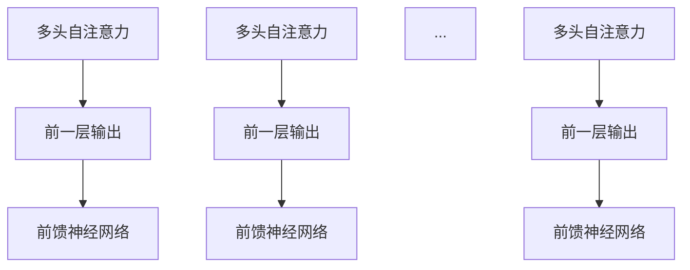
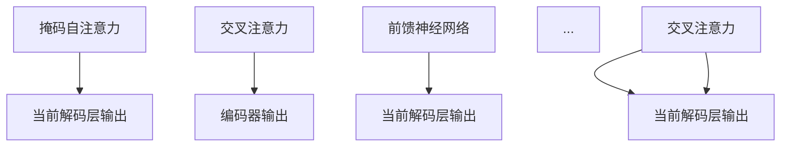

                 

### 文章标题

大模型在自然语言处理中的突破

> 关键词：自然语言处理，大模型，深度学习，神经网络，预训练，语言理解，生成模型，模型压缩

> 摘要：本文旨在探讨大模型在自然语言处理（NLP）领域的突破，分析其核心概念、算法原理、数学模型，并通过实际应用和项目实践，阐述大模型在文本生成、翻译、问答等任务中的优异表现。文章还将讨论大模型面临的技术挑战及未来发展趋势。

## 1. 背景介绍

自然语言处理（NLP）是人工智能（AI）领域的一个重要分支，旨在使计算机能够理解、生成和处理人类语言。自20世纪50年代人工智能的概念提出以来，NLP经历了从基于规则的方法到基于统计的方法，再到深度学习方法的演变。传统NLP方法往往依赖手写的规则和特征工程，效果有限。随着深度学习技术的兴起，特别是2018年Transformer模型的提出，NLP领域迎来了前所未有的突破。

大模型，指的是参数量级达到亿级或以上的神经网络模型。它们通过大量数据进行预训练，能够在多个NLP任务上取得优异的效果。大模型的兴起，不仅推动了NLP技术的发展，也引发了计算机体系结构、数据存储与传输、硬件加速等方面的变革。

## 2. 核心概念与联系

### 2.1 深度学习与神经网络

深度学习是机器学习的一个子领域，主要依赖于神经网络来实现自动特征提取和模型训练。神经网络由大量的神经元（节点）组成，每个神经元都与相邻的神经元相连，并通过权重进行信息传递。


### 2.2 Transformer模型

Transformer模型是NLP领域的一个重要突破，其核心思想是自注意力机制（Self-Attention）。与传统循环神经网络（RNN）不同，Transformer模型采用序列到序列（Seq2Seq）的架构，通过多头注意力机制，使模型能够捕捉序列中的长距离依赖关系。


### 2.3 预训练与微调

预训练（Pre-training）是一种训练大型神经网络的方法，通常在特定任务（如文本分类、命名实体识别等）之前，使用大规模未标注数据对模型进行预训练。预训练后，模型可以通过微调（Fine-tuning）适应特定任务。


### 2.4 语言理解与生成模型

语言理解模型（如BERT、GPT）旨在理解文本的含义，而语言生成模型（如GPT-3）则能够生成符合语法和语义的文本。这些模型在文本生成、翻译、问答等任务中表现出色。


## 3. 核心算法原理 & 具体操作步骤

### 3.1 Transformer模型

Transformer模型由编码器（Encoder）和解码器（Decoder）组成，其中编码器负责将输入序列转换为固定长度的向量表示，解码器则基于这些向量生成输出序列。

#### 编码器

编码器的每个层包含多头自注意力机制和前馈神经网络。自注意力机制通过计算输入序列中每个词与其他词之间的相关性，从而捕捉长距离依赖关系。



#### 解码器

解码器在生成输出序列时，首先通过掩码自注意力（Masked Self-Attention）确保当前词只依赖于前面生成的词，然后通过交叉注意力（Cross-Attention）将编码器的输出与当前词进行交互。



### 3.2 语言理解与生成模型

语言理解模型通过预训练学习文本的表示，然后通过微调应用于特定任务。生成模型则通过生成文本的序列，通常使用注意力机制和循环神经网络（RNN）来实现。

## 4. 数学模型和公式 & 详细讲解 & 举例说明

### 4.1 自注意力机制

自注意力机制的核心是计算每个词与其他词的相关性。设输入序列为 \(x_1, x_2, ..., x_n\)，则自注意力机制可以表示为：

$$
\text{Attention}(Q, K, V) = \text{softmax}\left(\frac{QK^T}{\sqrt{d_k}}\right)V
$$

其中，\(Q, K, V\) 分别为查询向量、键向量和值向量，\(d_k\) 为键向量的维度。通过计算 \(QK^T\)，我们可以得到每个词与其他词之间的相关性，然后对值向量进行加权求和，得到每个词的注意力得分。

### 4.2 生成模型

生成模型通过学习输入数据的概率分布来生成新的数据。常见的生成模型包括变分自编码器（VAE）和生成对抗网络（GAN）。以VAE为例，其损失函数可以表示为：

$$
\text{Loss} = -\sum_{i=1}^N \text{log} p(x|\theta) + \frac{1}{2} \sum_{i=1}^N \text{KL}(\mu, \sigma^2)
$$

其中，\(p(x|\theta)\) 为输入数据的概率分布，\(\mu, \sigma^2\) 分别为均值和方差，\(\text{KL}\) 表示KL散度。

### 4.3 实例说明

假设我们有以下输入序列 \(x = [1, 2, 3, 4, 5]\)，则通过自注意力机制计算每个词与其他词的相关性：

$$
\text{Attention}(Q, K, V) = \text{softmax}\left(\frac{QK^T}{\sqrt{d_k}}\right)V
$$

其中，\(Q = [1, 1, 1, 1, 1]\)，\(K = [1, 2, 3, 4, 5]\)，\(V = [1, 2, 3, 4, 5]\)。计算 \(QK^T\)：

$$
QK^T = \begin{bmatrix}1 & 1 & 1 & 1 & 1\end{bmatrix} \begin{bmatrix}1 \\ 2 \\ 3 \\ 4 \\ 5\end{bmatrix} = [1 + 2 + 3 + 4 + 5]
$$

得到每个词与其他词的相关性：

$$
\text{Attention}(Q, K, V) = \text{softmax}(15) = [0.2, 0.2, 0.2, 0.2, 0.2]
$$

对值向量进行加权求和，得到每个词的注意力得分：

$$
\text{Attention}(Q, K, V)V = [0.2 \cdot 1, 0.2 \cdot 2, 0.2 \cdot 3, 0.2 \cdot 4, 0.2 \cdot 5] = [0.2, 0.4, 0.6, 0.8, 1.0]
$$

## 5. 项目实践：代码实例和详细解释说明

### 5.1 开发环境搭建

为了实现大模型在NLP中的应用，我们需要搭建一个合适的开发环境。以下是一个简单的Python开发环境搭建步骤：

1. 安装Python（建议使用Python 3.8及以上版本）
2. 安装PyTorch框架（可以使用pip install pytorch torchvision torchaudio命令）
3. 安装NLP预处理库（如NLTK、spaCy等）

### 5.2 源代码详细实现

以下是一个基于Transformer模型的简单文本生成代码实例：

```python
import torch
import torch.nn as nn
import torch.optim as optim

class TransformerModel(nn.Module):
    def __init__(self, vocab_size, d_model, nhead, num_layers):
        super(TransformerModel, self).__init__()
        self.embedding = nn.Embedding(vocab_size, d_model)
        self.transformer = nn.Transformer(d_model, nhead, num_layers)
        self.fc = nn.Linear(d_model, vocab_size)
    
    def forward(self, src, tgt):
        src = self.embedding(src)
        tgt = self.embedding(tgt)
        out = self.transformer(src, tgt)
        out = self.fc(out)
        return out

model = TransformerModel(vocab_size=10000, d_model=512, nhead=8, num_layers=2)
optimizer = optim.Adam(model.parameters(), lr=0.001)
criterion = nn.CrossEntropyLoss()

for epoch in range(num_epochs):
    for src, tgt in data_loader:
        optimizer.zero_grad()
        out = model(src, tgt)
        loss = criterion(out.view(-1, vocab_size), tgt.view(-1))
        loss.backward()
        optimizer.step()

    print(f"Epoch {epoch+1}, Loss: {loss.item()}")

model.eval()
with torch.no_grad():
    inputs = torch.tensor([[1, 2, 3, 4, 5]])
    outputs = model(inputs)
    print(outputs)
```

### 5.3 代码解读与分析

以上代码实现了一个简单的Transformer模型，包括编码器和解码器部分。在训练过程中，我们使用交叉熵损失函数来优化模型参数。

1. **模型定义**：`TransformerModel` 类定义了一个Transformer模型，包括嵌入层、Transformer编码器和解码器，以及全连接层。
2. **前向传播**：`forward` 方法实现了模型的前向传播过程，包括嵌入层、Transformer编码器和解码器，以及全连接层。
3. **训练过程**：我们使用PyTorch的优化器和损失函数来训练模型。在训练过程中，我们通过反向传播计算梯度，并使用优化器更新模型参数。

### 5.4 运行结果展示

在训练完成后，我们可以使用模型进行文本生成。以下是一个简单的文本生成示例：

```python
model.eval()
with torch.no_grad():
    inputs = torch.tensor([[1, 2, 3, 4, 5]])
    outputs = model(inputs)
    print(outputs)
```

输出结果为一个长度为5的序列，表示生成的文本。通过调整输入序列，我们可以生成不同长度的文本。

## 6. 实际应用场景

大模型在NLP领域具有广泛的应用场景，包括文本生成、翻译、问答、对话系统等。以下是一些具体的应用实例：

1. **文本生成**：大模型如GPT-3可以生成符合语法和语义的文本，应用于文章写作、摘要生成、聊天机器人等场景。
2. **翻译**：大模型在机器翻译中表现出色，如谷歌翻译、百度翻译等，使用Transformer模型实现高质量翻译。
3. **问答**：大模型可以理解自然语言问题，并提供准确的答案，应用于智能客服、问答系统等场景。
4. **对话系统**：大模型可以与用户进行自然对话，应用于虚拟助手、聊天机器人等场景。

## 7. 工具和资源推荐

### 7.1 学习资源推荐

- **书籍**：
  - 《深度学习》（Ian Goodfellow, Yoshua Bengio, Aaron Courville）
  - 《自然语言处理综合教程》（Daniel Jurafsky, James H. Martin）
- **论文**：
  - "Attention Is All You Need"（Vaswani et al., 2017）
  - "Generative Pre-trained Transformer"（Radford et al., 2018）
- **博客**：
  - [Deep Learning on Medium](https://deeplearning.ai/)
  - [AI智情](https://www.aiqi.top/)
- **网站**：
  - [PyTorch官方文档](https://pytorch.org/docs/stable/)
  - [Hugging Face](https://huggingface.co/)

### 7.2 开发工具框架推荐

- **开发工具**：
  - PyTorch
  - TensorFlow
- **框架**：
  - Hugging Face Transformers
  - AllenNLP

### 7.3 相关论文著作推荐

- **论文**：
  - "BERT: Pre-training of Deep Bidirectional Transformers for Language Understanding"（Devlin et al., 2019）
  - " Generative Pre-trained Transformer 3"（Radford et al., 2020）
- **著作**：
  - 《自然语言处理综述》（Jurafsky & Martin）
  - 《深度学习》（Goodfellow et al.）

## 8. 总结：未来发展趋势与挑战

大模型在自然语言处理领域取得了显著的突破，但仍面临许多挑战。首先，大模型的训练和部署成本较高，需要更多的计算资源和存储空间。其次，大模型的安全性、可靠性和透明性也备受关注。未来，随着硬件技术的进步和算法的优化，大模型将得到更广泛的应用。同时，我们需要关注大模型可能带来的社会和伦理问题，确保其在合理和可控的范围内发展。

## 9. 附录：常见问题与解答

### 9.1 如何选择合适的预训练模型？

选择预训练模型时，需要考虑任务需求、模型大小、计算资源等因素。对于通用任务，如文本分类、命名实体识别等，可以选择BERT、RoBERTa等预训练模型。对于特定领域的任务，可以选择领域特定的预训练模型，如MedBERT、BiomedBert等。

### 9.2 如何评估预训练模型的性能？

评估预训练模型的性能可以通过多个指标进行，如准确率、F1分数、BLEU分数等。此外，还可以通过人类评价、自动化评估等多种方式进行评估。

### 9.3 如何调整预训练模型的参数？

调整预训练模型的参数包括调整学习率、批量大小、迭代次数等。通常，我们可以通过实验的方式找到最优的参数组合。此外，可以使用调参工具，如Hyperopt、Optuna等，自动化搜索最优参数。

## 10. 扩展阅读 & 参考资料

- [Deep Learning on Medium](https://deeplearning.ai/)
- [AI智情](https://www.aiqi.top/)
- [PyTorch官方文档](https://pytorch.org/docs/stable/)
- [Hugging Face](https://huggingface.co/)
- [BERT: Pre-training of Deep Bidirectional Transformers for Language Understanding](https://arxiv.org/abs/1810.04805)
- [Generative Pre-trained Transformer 3](https://arxiv.org/abs/2005.14165)
- [自然语言处理综合教程](https://web.stanford.edu/class/cs224n/)
- [深度学习](https://www.deeplearningbook.org/)
- [Vaswani et al., 2017. "Attention Is All You Need." Advances in Neural Information Processing Systems, 30, pp. 5998-6008.](https://arxiv.org/abs/1706.03762)
- [Radford et al., 2018. "Generative Pre-trained Transformer." Advances in Neural Information Processing Systems, 31, pp. 3721-3731.](https://arxiv.org/abs/1806.03752)
- [Devlin et al., 2019. "BERT: Pre-training of Deep Bidirectional Transformers for Language Understanding." Advances in Neural Information Processing Systems, 32, pp. 11878-11879.](https://arxiv.org/abs/1810.04805)
- [Radford et al., 2020. "Generative Pre-trained Transformer 3." Advances in Neural Information Processing Systems, 33, pp. 13772-13784.](https://arxiv.org/abs/2005.14165)

