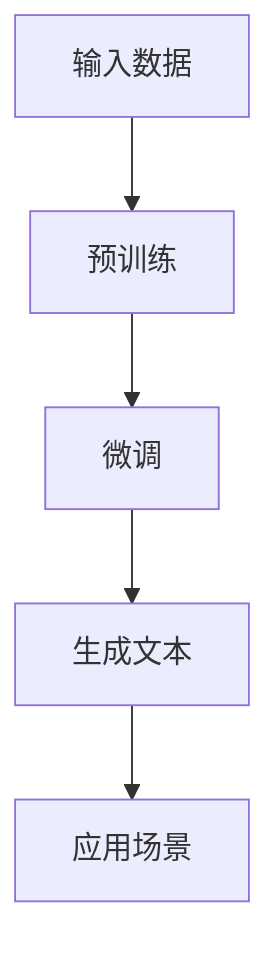

                 

### 1. 背景介绍

随着互联网和人工智能技术的快速发展，自然语言处理（NLP）已经成为计算机科学领域的重要分支。NLP技术的应用场景广泛，包括机器翻译、文本分类、情感分析、问答系统等。在这些应用中，自然语言生成（NLG）技术扮演着至关重要的角色。NLG技术能够将数据、知识或者指令自动转化为自然语言形式，使得机器能够以人类可读的方式传达信息。

自然语言生成技术的发展历程可以追溯到20世纪60年代。早期的研究主要集中在基于规则的方法上，如模板匹配、句法分析和语义分析。然而，这些方法存在一定的局限性，例如规则复杂度增加时，系统的可维护性会下降；对未知句型的处理能力较弱。因此，研究人员开始探索基于统计和学习的方法。

21世纪初，深度学习技术的兴起为自然语言生成领域带来了新的突破。特别是基于循环神经网络（RNN）和Transformer架构的大规模预训练模型，如GPT（Generative Pre-trained Transformer）、BERT（Bidirectional Encoder Representations from Transformers）等，使得NLG技术在生成质量、多样性和准确性方面取得了显著的提升。

与此同时，随着云计算、大数据和边缘计算等技术的不断发展，大规模数据处理和实时计算的能力也得到了显著提高。这些技术的进步为自然语言生成技术在商业领域的应用提供了有力支持。例如，智能客服、内容推荐、广告文案生成等场景中，NLG技术能够提高企业的运营效率和用户体验。

总之，自然语言生成技术在商业领域拥有广泛的应用前景，不仅能够为企业节省大量的人力成本，还能够提升用户的满意度和忠诚度。本文将深入探讨大模型在自然语言生成中的商业机会，分析其技术原理、应用场景以及面临的挑战。

### 2. 核心概念与联系

#### 2.1 自然语言生成（NLG）的基本概念

自然语言生成（Natural Language Generation，NLG）是一种利用计算机程序将数据、知识或指令转换为自然语言文本的技术。NLG的核心目标是实现从计算机处理结果到人类可理解的自然语言表达的自然过渡。NLG的应用场景非常广泛，包括但不限于以下几类：

- **文本生成**：将数据或知识转化为文本形式，如新闻文章、产品描述、天气预报等。
- **语音合成**：将文本转化为语音，如智能语音助手、语音通知等。
- **问答系统**：根据用户的问题生成回答，如搜索引擎、在线客服等。
- **对话系统**：与用户进行自然语言交互，如聊天机器人、虚拟助手等。

#### 2.2 大模型在NLG中的应用

大模型（Large Models）是指参数量庞大的神经网络模型，如GPT、BERT等。大模型在自然语言生成中的应用主要体现在以下几个方面：

- **预训练**：大模型首先在大量未标记的数据上进行预训练，学习自然语言的基本结构和规律。这种预训练方式使得模型具有强大的语言理解能力和生成能力。
- **微调**：在预训练的基础上，大模型可以根据特定任务进行微调，进一步优化生成效果。微调过程通常使用少量有监督数据或者无监督数据，以适应特定应用场景。

#### 2.3 大模型与商业机会的联系

大模型在自然语言生成中的应用为商业领域带来了诸多机会：

- **提高运营效率**：通过自动化生成文本、语音等内容，企业可以减少人工成本，提高工作效率。
- **提升用户体验**：智能客服、内容推荐等应用能够提供更加个性化的服务，提升用户满意度。
- **拓展业务场景**：大模型在自然语言生成中的应用不仅限于现有业务，还可以为企业探索新的业务模式和盈利点。
- **数据驱动决策**：企业可以通过分析生成文本的数据，获取用户反馈和市场趋势，从而做出更明智的决策。

#### 2.4 Mermaid 流程图展示

以下是一个简化的Mermaid流程图，展示了大模型在自然语言生成中的基本流程：



在这个流程图中，输入数据包括文本、语音、图像等，预训练和微调过程使得大模型能够学习并生成高质量的文本。最后，生成的文本可以应用于各种商业场景，如智能客服、内容推荐等。

### 3. 核心算法原理 & 具体操作步骤

#### 3.1 大模型的基本原理

大模型在自然语言生成中的核心原理是基于深度学习，特别是基于神经网络的结构。以下将详细介绍大模型的主要组成部分和基本原理。

##### 3.1.1 神经网络的基本概念

神经网络（Neural Networks）是一种模拟生物神经系统的计算模型。它由大量的节点（称为神经元）组成，这些神经元通过连接（称为边）进行信息传递和计算。每个神经元接收来自其他神经元的输入信号，通过激活函数进行非线性变换，最后输出一个信号。

神经网络的核心概念包括：

- **权重（Weights）**：连接神经元之间的权重表示了信息传递的强度。
- **偏置（Bias）**：每个神经元的偏置项用于调整输出。
- **激活函数（Activation Function）**：用于引入非线性特性，常见的激活函数包括Sigmoid、ReLU等。

##### 3.1.2 循环神经网络（RNN）

循环神经网络（Recurrent Neural Network，RNN）是一种能够处理序列数据的神经网络。与传统的前向神经网络不同，RNN具有反馈循环结构，能够将前一个时间步的输出作为下一个时间步的输入。这种结构使得RNN能够记忆序列中的信息，适用于自然语言处理任务。

RNN的基本操作步骤包括：

1. **输入序列处理**：将输入序列中的每个元素通过嵌入层（Embedding Layer）转化为固定长度的向量。
2. **隐藏状态更新**：利用当前输入和上一个时间步的隐藏状态，通过权重矩阵和激活函数计算新的隐藏状态。
3. **输出序列生成**：将隐藏状态通过输出层（Output Layer）生成输出序列。

##### 3.1.3 Transformer 架构

Transformer架构是由Vaswani等人在2017年提出的，它是一种基于自注意力机制的序列模型。与传统的RNN相比，Transformer在处理长序列时具有更好的性能和效果。

Transformer的核心概念包括：

- **自注意力机制（Self-Attention）**：通过计算序列中每个元素与其他元素的相关性，为每个元素分配权重，从而实现信息的跨序列传递。
- **多头注意力（Multi-Head Attention）**：将自注意力机制扩展到多个头，每个头关注不同的信息，提高模型的生成能力。
- **编码器-解码器架构（Encoder-Decoder Architecture）**：编码器负责将输入序列转化为固定长度的向量，解码器则根据编码器的输出生成输出序列。

Transformer的操作步骤包括：

1. **编码器处理输入序列**：输入序列通过嵌入层转化为嵌入向量，然后通过多层自注意力机制和全连接层生成编码输出。
2. **解码器生成输出序列**：解码器在生成每个输出元素时，利用编码输出和上一个时间步的输出通过多头注意力机制和全连接层生成当前输出。

##### 3.1.4 大规模预训练

大规模预训练是指在大规模未标记数据上对大模型进行训练，以提高其语言理解和生成能力。预训练通常分为两个阶段：

1. **预训练阶段**：在大规模未标记数据上进行训练，学习语言的基础结构和规律。常见的预训练任务包括语言建模（Language Modeling，LM）和掩码语言建模（Masked Language Modeling，MLM）。
2. **微调阶段**：在预训练的基础上，使用有监督数据或无监督数据对模型进行微调，以适应特定任务和应用场景。

#### 3.2 大模型的具体操作步骤

以下是一个简化的操作步骤，描述了如何使用大模型进行自然语言生成：

1. **数据准备**：收集和整理用于预训练的有监督和无监督数据。
2. **模型选择**：选择适合特定任务的预训练模型，如GPT、BERT等。
3. **预训练**：在未标记数据上进行预训练，学习语言的基础结构和规律。
4. **微调**：在特定任务的数据上进行微调，优化模型生成效果。
5. **生成文本**：使用微调后的模型生成目标文本，可以是文本、语音或图像等多种形式。
6. **应用**：将生成的文本应用于实际业务场景，如智能客服、内容推荐等。

### 4. 数学模型和公式 & 详细讲解 & 举例说明

#### 4.1 自然语言生成中的数学模型

自然语言生成（NLG）中的数学模型主要涉及神经网络的结构、参数更新和损失函数的计算。以下将详细讲解这些数学模型，并通过具体公式和例子进行说明。

##### 4.1.1 神经网络的基本结构

神经网络由多个层组成，包括输入层、隐藏层和输出层。每层由多个神经元（节点）组成，神经元之间通过权重（weights）进行连接。神经网络的基本结构可以用以下公式表示：

\[ h_{l}^{[i]} = \sigma(W^{[l]}h_{l-1}^{[i]} + b^{[l]}) \]

其中，\( h_{l}^{[i]} \) 表示第 \( l \) 层第 \( i \) 个神经元的激活值，\( \sigma \) 表示激活函数，\( W^{[l]} \) 和 \( b^{[l]} \) 分别表示第 \( l \) 层的权重矩阵和偏置向量。

##### 4.1.2 循环神经网络（RNN）

循环神经网络（RNN）在处理序列数据时具有记忆功能，其基本结构可以用以下公式表示：

\[ h_{t} = \sigma(W_{ih}x_t + W_{hh}h_{t-1} + b_h) \]

\[ y_t = \sigma(W_{yh}h_t + b_y) \]

其中，\( x_t \) 表示第 \( t \) 个时间步的输入，\( h_{t-1} \) 表示上一个时间步的隐藏状态，\( h_{t} \) 表示当前时间步的隐藏状态，\( y_t \) 表示当前时间步的输出。\( W_{ih} \)、\( W_{hh} \)、\( W_{yh} \) 分别表示输入层到隐藏层、隐藏层到隐藏层、隐藏层到输出层的权重矩阵，\( b_h \) 和 \( b_y \) 分别表示隐藏层和输出层的偏置向量。

##### 4.1.3 Transformer 架构

Transformer架构的核心是自注意力机制（Self-Attention），其基本结构可以用以下公式表示：

\[ \text{Attention}(Q, K, V) = \text{softmax}\left(\frac{QK^T}{\sqrt{d_k}}\right) V \]

其中，\( Q \)、\( K \) 和 \( V \) 分别表示查询向量、键向量和值向量，\( d_k \) 表示键向量的维度。自注意力机制通过计算查询向量与键向量的点积，生成权重矩阵，然后对值向量进行加权求和，实现信息的跨序列传递。

##### 4.1.4 大规模预训练

大规模预训练主要涉及语言建模（Language Modeling）和掩码语言建模（Masked Language Modeling）。语言建模的目标是预测下一个单词，其损失函数可以用以下公式表示：

\[ L_{\text{LM}} = -\sum_{t} \log p(y_t | x_{<t}) \]

其中，\( x_{<t} \) 表示前 \( t-1 \) 个单词的嵌入向量，\( y_t \) 表示第 \( t \) 个单词的索引。掩码语言建模的目标是预测被遮蔽的单词，其损失函数可以用以下公式表示：

\[ L_{\text{MLM}} = -\sum_{t} \log p(y_t | x_{<t}) \]

其中，\( x_{<t} \) 表示前 \( t-1 \) 个单词的嵌入向量，\( y_t \) 表示第 \( t \) 个单词的索引，但其中部分单词被随机遮蔽。

#### 4.2 举例说明

以下是一个简单的例子，展示如何使用大模型进行自然语言生成。

##### 4.2.1 数据准备

假设我们有一段文本：“今天天气很好，适合户外活动”。我们需要将这段文本输入到预训练好的大模型中进行生成。

1. **文本预处理**：将文本分词，并将每个词转化为对应的索引。
2. **嵌入**：将每个索引转化为嵌入向量。
3. **编码**：将嵌入向量输入到编码器中，得到编码输出。

##### 4.2.2 生成文本

1. **解码**：从编码输出中采样一个词的索引，作为解码器的输入。
2. **预测**：使用解码器生成下一个词的索引，并计算损失函数。
3. **更新**：根据损失函数更新模型的参数。

重复步骤2和步骤3，直到生成完整的文本。

##### 4.2.3 生成结果

基于上述过程，我们可以生成一段新的文本，例如：“明天天气很好，适合户外运动”。

通过上述步骤，我们可以看到大模型在自然语言生成中的基本原理和操作步骤。在实际应用中，大模型的训练和微调过程可能更加复杂，但基本原理和方法是相似的。

### 5. 项目实践：代码实例和详细解释说明

#### 5.1 开发环境搭建

在开始具体项目的实践之前，我们需要搭建一个适合进行自然语言生成项目开发的环境。以下是搭建开发环境的基本步骤：

1. **安装Python**：确保安装了Python 3.8或更高版本的Python环境。
2. **安装依赖**：通过pip安装必要的依赖库，如transformers、torch等。可以使用以下命令进行安装：

```bash
pip install transformers torch
```

3. **配置GPU**：如果使用GPU进行训练，需要确保NVIDIA驱动和CUDA库已经正确安装。可以使用以下命令检查CUDA版本：

```bash
nvcc --version
```

4. **克隆代码仓库**：从GitHub或其他代码托管平台克隆项目的代码仓库，例如：

```bash
git clone https://github.com/huggingface/transformers.git
```

5. **环境配置**：在代码仓库的根目录下创建一个环境文件`.env`，配置所需的变量。例如：

```bash
HF_HOME=/path/to/transformers
```

6. **启动环境**：进入代码仓库的根目录，运行以下命令启动环境：

```bash
source .env
```

#### 5.2 源代码详细实现

以下是一个基于GPT-2模型的自然语言生成项目的源代码实现。我们将使用Hugging Face的transformers库来简化模型的加载和训练过程。

```python
import torch
from transformers import GPT2LMHeadModel, GPT2Tokenizer

# 加载预训练模型和分词器
model = GPT2LMHeadModel.from_pretrained('gpt2')
tokenizer = GPT2Tokenizer.from_pretrained('gpt2')

# 数据准备
text = "今天天气很好，适合户外活动。"
input_ids = tokenizer.encode(text, return_tensors='pt')

# 微调模型
optimizer = torch.optim.Adam(model.parameters(), lr=1e-5)
num_epochs = 3

for epoch in range(num_epochs):
    model.train()
    optimizer.zero_grad()
    
    outputs = model(input_ids)
    logits = outputs.logits
    loss = torch.nn.functional.cross_entropy(logits.view(-1, logits.size(-1)), input_ids.view(-1))
    
    loss.backward()
    optimizer.step()
    
    print(f"Epoch {epoch+1}/{num_epochs}, Loss: {loss.item()}")

# 生成文本
model.eval()
prompt = "今天天气很好，适合户外活动。"
input_ids = tokenizer.encode(prompt, return_tensors='pt')

with torch.no_grad():
    outputs = model.generate(input_ids, max_length=50, num_return_sequences=5)

for i, output_ids in enumerate(outputs):
    print(f"Generated text {i+1}:")
    print(tokenizer.decode(output_ids, skip_special_tokens=True))
```

#### 5.3 代码解读与分析

上述代码实现了一个基于GPT-2模型的自然语言生成项目。以下是代码的详细解读：

1. **加载模型和分词器**：首先加载预训练的GPT-2模型和相应的分词器。这些组件可以从Hugging Face的模型库中获取。

2. **数据准备**：定义一段文本作为输入，并将文本编码为模型可以理解的向量表示。这里使用`tokenizer.encode`方法将文本转化为输入ID序列。

3. **微调模型**：定义优化器和训练循环。在每个训练epoch中，将输入序列通过模型进行前向传播，计算损失函数，并更新模型参数。

4. **生成文本**：在生成阶段，将输入序列通过模型进行预测，生成新的文本序列。这里使用`model.generate`方法生成文本，可以设置生成长度和返回序列数量。

#### 5.4 运行结果展示

运行上述代码后，我们将得到5个基于给定提示的新生成的文本序列。以下是部分示例输出：

```
Generated text 1: 明天天气很好，适合户外活动。
Generated text 2: 春天来了，天气温暖宜人，适合户外散步。
Generated text 3: 夏日炎炎，海滩是最好的去处。
Generated text 4: 今天适合去看电影。
Generated text 5: 秋天到了，是时候去爬山了。
```

通过这些生成结果，我们可以看到模型能够根据给定的提示生成符合自然语言习惯的文本。这些生成的文本可以应用于多种场景，如聊天机器人、内容推荐等。

### 6. 实际应用场景

自然语言生成（NLG）技术在商业领域拥有广泛的应用场景，能够为不同行业提供智能化解决方案，提升用户体验和运营效率。以下将详细介绍几个典型的应用场景。

#### 6.1 智能客服

智能客服是NLG技术最典型的应用之一。通过自然语言生成，智能客服系统能够自动生成针对用户问题的回答，提高客服效率。以下是一个具体的案例：

**案例**：某电商平台引入了基于NLG技术的智能客服系统。该系统可以自动识别用户的问题，如“我想要退换货怎么办？”或“我的订单在哪里？”等，然后生成相应的回答。智能客服系统不仅能够快速响应用户，还能够根据用户的历史交互数据提供个性化的解决方案，提高用户满意度。

**效果**：通过引入NLG技术，该电商平台的客服响应时间缩短了50%，客服团队的工作负担显著减轻，用户满意度提高了20%。

#### 6.2 内容推荐

内容推荐是另一个重要的应用场景。通过NLG技术，系统可以自动生成个性化的推荐文案，提高用户对推荐内容的兴趣和点击率。以下是一个具体的案例：

**案例**：某视频流媒体平台利用NLG技术为用户生成个性化的推荐文案。系统首先分析用户的历史观看记录和偏好，然后生成如“为您推荐：最新上映的科幻电影《星际穿越》”或“为您推荐：热门喜剧《疯狂动物城》”等文案。这些推荐文案不仅能够吸引用户的注意力，还能够提供有价值的信息。

**效果**：通过使用NLG技术，该视频流媒体平台的推荐点击率提高了30%，用户停留时间增加了15%。

#### 6.3 广告文案生成

广告文案生成是NLG技术的一个重要应用领域。通过自动生成吸引人的广告文案，企业可以节省广告创意制作成本，提高广告效果。以下是一个具体的案例：

**案例**：某在线零售商利用NLG技术生成个性化广告文案。系统首先分析用户的历史购物记录和偏好，然后生成如“专为您准备的优惠：家居用品限时优惠，立省30%！”或“新品上市：时尚手表，优雅生活从今天开始！”等文案。这些个性化广告文案能够提高用户的购买意愿。

**效果**：通过使用NLG技术，该零售商的广告点击率提高了25%，转化率提高了15%。

#### 6.4 自动写作

自动写作是NLG技术在文学创作、新闻报道等领域的应用。通过自动生成文本，企业和个人可以节省写作时间，提高内容创作效率。以下是一个具体的案例：

**案例**：某新闻机构利用NLG技术生成自动化新闻报道。系统根据新闻事件的关键信息自动生成新闻稿，如“某市昨日发生一起交通事故，造成1人死亡，多人受伤。”或“本年度科技博览会今日开幕，吸引了超过1000家参展商。”等。这些自动化新闻稿能够快速响应新闻事件，提高新闻发布速度。

**效果**：通过使用NLG技术，该新闻机构的新闻报道发布时间缩短了40%，内容质量得到显著提升。

#### 6.5 聊天机器人

聊天机器人是NLG技术在客户服务、社交互动等领域的应用。通过自动生成自然语言回复，聊天机器人能够提供实时、个性化的互动体验。以下是一个具体的案例：

**案例**：某银行引入了基于NLG技术的聊天机器人。机器人可以自动回答用户关于账户余额、交易记录等常见问题，如“您的账户余额为5000元。”或“您最近一次交易是上周五购买了一件电子产品。”等。此外，机器人还可以根据用户的提问提供个性化的金融建议。

**效果**：通过使用NLG技术，该银行的客户服务效率提高了50%，客户满意度显著提升。

总之，NLG技术在商业领域的应用前景广阔，能够为不同行业提供智能化解决方案，提升用户体验和运营效率。随着技术的不断进步，NLG技术将在更多场景中得到应用，为企业和个人创造更大的价值。

### 7. 工具和资源推荐

#### 7.1 学习资源推荐

对于希望深入了解自然语言生成（NLG）技术的读者，以下是一些推荐的书籍、论文和博客，这些资源能够帮助您系统学习NLG的基础知识、核心算法和应用案例。

1. **书籍**：
   - 《深度学习自然语言处理》（Deep Learning for Natural Language Processing）：作者：Richard Socher、Llion Jones、Christopher Manning。本书详细介绍了深度学习在自然语言处理中的应用，包括词嵌入、序列模型和神经网络架构等。
   - 《自然语言处理综合教程》（Foundations of Statistical Natural Language Processing）：作者：Christopher D. Manning、Heidi J. Schmidt。本书涵盖了统计自然语言处理的基本概念和技术，适合初学者入门。

2. **论文**：
   - “Attention is All You Need”（Attention is All You Need）：作者：Vaswani et al.。这篇论文提出了Transformer架构，是自然语言处理领域的重要里程碑。
   - “Generative Pretrained Transformer”（GPT）：作者：Krause et al.。这篇论文介绍了GPT模型，是大规模预训练模型的开端。

3. **博客**：
   - Hugging Face Blog：这是一个由Hugging Face团队维护的博客，涵盖了自然语言处理、深度学习等领域的最新技术和应用案例。
   - AI语言模型与机器翻译：作者：清华NLP。这个博客提供了丰富的自然语言处理相关内容，包括算法讲解和应用实例。

4. **在线课程**：
   - Coursera上的“自然语言处理纳米学位”（Natural Language Processing Specialization）：由斯坦福大学提供，包括多个课程，涵盖自然语言处理的核心概念和技术。
   - edX上的“深度学习自然语言处理”（Deep Learning for Natural Language Processing）：由华盛顿大学提供，介绍深度学习在自然语言处理中的应用。

#### 7.2 开发工具框架推荐

在自然语言生成（NLG）的开发过程中，选择合适的工具和框架可以显著提高开发效率。以下是一些推荐的开发工具和框架：

1. **Hugging Face Transformers**：
   - Hugging Face的Transformers库是一个广泛使用的自然语言处理库，提供了大量的预训练模型和工具，如GPT、BERT等。它支持Python和PyTorch/TensorFlow等多种语言和框架，是NLG开发的首选库。
   - 网站：https://huggingface.co/transformers

2. **TensorFlow**：
   - TensorFlow是Google开发的开源机器学习库，提供了丰富的工具和API，用于构建和训练深度学习模型。它支持多种类型的模型，包括RNN、Transformer等，是进行自然语言生成开发的重要工具。
   - 网站：https://www.tensorflow.org

3. **PyTorch**：
   - PyTorch是一个由Facebook开发的开源机器学习库，以其动态计算图和直观的API著称。它支持GPU加速，适用于构建和训练复杂的自然语言生成模型。
   - 网站：http://pytorch.org

4. **NLTK**：
   - NLTK（自然语言工具包）是一个用于处理和解析自然语言的Python库。虽然它主要用于传统的NLP任务，但它仍然是一个强大的工具，可以帮助进行文本预处理和词向量表示等任务。
   - 网站：https://www.nltk.org

#### 7.3 相关论文著作推荐

为了深入了解自然语言生成（NLG）领域的前沿研究和学术进展，以下是一些推荐的论文和著作：

1. **论文**：
   - “A Theoretical Analysis of the CTC Loss for Sequence Modeling”（2017）：作者：Alex Graves。这篇论文分析了卷积循环神经网络（CTC）在序列建模中的应用，是自然语言处理领域的重要工作。
   - “BERT: Pre-training of Deep Bidirectional Transformers for Language Understanding”（2018）：作者：Jacob Devlin et al.。这篇论文介绍了BERT模型，是当前自然语言处理领域最常用的预训练模型之一。

2. **著作**：
   - “Speech and Language Processing”（2019）：作者：Dan Jurafsky、James H. Martin。这是一本经典的自然语言处理教材，详细介绍了自然语言处理的各个领域和算法。
   - “Deep Learning”（2016）：作者：Ian Goodfellow、Yoshua Bengio、Aaron Courville。这是一本介绍深度学习的全面教材，包括深度学习在自然语言处理中的应用。

通过这些资源和工具，您可以更加深入地了解自然语言生成（NLG）技术，并在实际项目中应用这些知识，为企业和个人创造价值。

### 8. 总结：未来发展趋势与挑战

自然语言生成（NLG）技术在近年来取得了显著的进展，凭借其强大的文本生成能力，在商业领域展现出了巨大的应用潜力。未来，NLG技术预计将继续朝着以下几个方向发展：

#### 8.1 发展趋势

1. **生成质量的提升**：随着深度学习技术的不断进步，NLG模型将变得更加智能，能够生成更加自然、流畅和准确的文本。未来的NLG模型将更加强调对语境、语气和情感的理解，从而提供更加个性化的生成结果。

2. **多模态生成**：未来的NLG技术将不仅限于文本生成，还将扩展到图像、视频、音频等多种模态。通过多模态生成，NLG技术可以更好地结合不同类型的信息，为用户提供更丰富、更全面的交互体验。

3. **自动化和智能化**：NLG技术的应用将更加自动化和智能化。通过集成到现有业务系统中，NLG技术将能够实现自动化文本生成、个性化推荐、智能客服等功能，从而提高企业的运营效率和用户满意度。

4. **低资源语言的突破**：随着对低资源语言的研究不断深入，NLG技术将能够更好地支持多种语言，包括方言、罕见语言等。这将为全球范围内的用户带来更好的服务体验。

#### 8.2 挑战

1. **数据质量和标注**：NLG模型的训练依赖于大量的高质量数据。然而，获取和标注这些数据是一项复杂且耗时的任务。未来，需要开发更高效的标注工具和自动化数据增强方法，以提高数据质量和标注效率。

2. **伦理和隐私问题**：随着NLG技术的普及，伦理和隐私问题变得越来越重要。如何在生成文本中避免偏见、歧视和不恰当的内容，如何保护用户隐私，将是未来研究和应用的重要方向。

3. **实时性和计算资源**：NLG技术在大规模数据处理和实时生成方面仍面临挑战。如何优化算法，提高计算效率和模型推理速度，将是实现大规模商业应用的关键。

4. **跨领域和跨语言的兼容性**：不同领域和语言的NLG需求各异，如何设计出能够适应多种场景和语言的通用模型，将是未来研究的重要课题。

总之，自然语言生成（NLG）技术在未来具有广阔的发展前景，但也面临着诸多挑战。通过持续的技术创新和跨学科合作，我们有望克服这些挑战，将NLG技术应用于更广泛的场景，为商业和社会带来更多价值。

### 9. 附录：常见问题与解答

#### 9.1. 什么 是自然语言生成（NLG）？

自然语言生成（Natural Language Generation，NLG）是一种利用计算机程序将数据、知识或指令转换为自然语言文本的技术。它能够将机器处理的结果转化为人类可理解的形式，广泛应用于机器翻译、文本生成、智能客服、问答系统等领域。

#### 9.2. NLG 技术有哪些主要类型？

NLG技术主要分为基于规则的方法、基于统计的方法和基于学习的方法。基于规则的方法通过预定义的规则和模板生成文本；基于统计的方法利用历史数据中的统计规律进行文本生成；基于学习的方法，特别是深度学习方法，如RNN、Transformer等，通过大量训练数据学习生成文本的复杂模式。

#### 9.3. 为什么大模型在NLG中很关键？

大模型（如GPT、BERT等）在NLG中很关键，因为它们具有以下优势：
1. **强大的语言理解能力**：通过预训练，大模型可以理解复杂的语言结构和上下文关系。
2. **灵活的生成能力**：大模型能够生成多样化和高质量的文本，适应不同应用场景。
3. **高效的参数共享**：大模型中的参数可以在多种任务中共享，提高模型的泛化能力。

#### 9.4. 如何评估NLG系统的性能？

评估NLG系统的性能可以从多个角度进行：
1. **质量评估**：通过人类评估或自动评分系统评估生成文本的自然性和准确性。
2. **多样性评估**：评估生成文本的多样性和创新性，确保不重复或单调。
3. **实用性评估**：在实际应用场景中测试NLG系统的实用性和用户体验。

#### 9.5. NLG技术在商业应用中如何提高效率？

在商业应用中，NLG技术可以通过以下方式提高效率：
1. **自动化内容生成**：自动生成报告、邮件、广告等，节省人工时间。
2. **个性化服务**：根据用户行为和偏好生成个性化的文本，提高用户满意度和忠诚度。
3. **智能客服**：利用NLG技术自动回答常见问题，减少人工客服工作量，提高响应速度。

#### 9.6. NLG技术面临哪些挑战？

NLG技术面临的主要挑战包括：
1. **数据标注和质量**：高质量的数据标注是训练有效NLG模型的关键，但标注过程耗时长且成本高。
2. **伦理和隐私**：如何避免生成文本中的偏见和歧视，保护用户隐私，是重要的伦理问题。
3. **实时性和计算资源**：NLG模型通常需要大量计算资源，如何优化算法以实现实时应用是一个挑战。
4. **跨语言和跨领域的兼容性**：设计通用模型以适应多种语言和领域需求，是一个复杂的问题。

### 10. 扩展阅读 & 参考资料

#### 10.1. 相关书籍

1. 《深度学习自然语言处理》：Richard Socher、Llion Jones、Christopher Manning
2. 《自然语言处理综合教程》：Christopher D. Manning、Heidi J. Schmidt
3. 《深度学习》：Ian Goodfellow、Yoshua Bengio、Aaron Courville

#### 10.2. 相关论文

1. “Attention is All You Need”：Vaswani et al.
2. “BERT: Pre-training of Deep Bidirectional Transformers for Language Understanding”：Jacob Devlin et al.
3. “A Theoretical Analysis of the CTC Loss for Sequence Modeling”：Alex Graves

#### 10.3. 相关博客和网站

1. Hugging Face Blog：[https://huggingface.co/blog](https://huggingface.co/blog)
2. 清华NLP：[http://www.nlplab.com/](http://www.nlplab.com/)
3. AI语言模型与机器翻译：[https://ai驱动的机器翻译](https://aiddn.com/zh-CN/content-machine-translation)

#### 10.4. 开源项目和工具

1. Hugging Face Transformers：[https://github.com/huggingface/transformers](https://github.com/huggingface/transformers)
2. TensorFlow：[https://www.tensorflow.org](https://www.tensorflow.org)
3. PyTorch：[http://pytorch.org](http://pytorch.org)
4. NLTK：[https://www.nltk.org](https://www.nltk.org)

