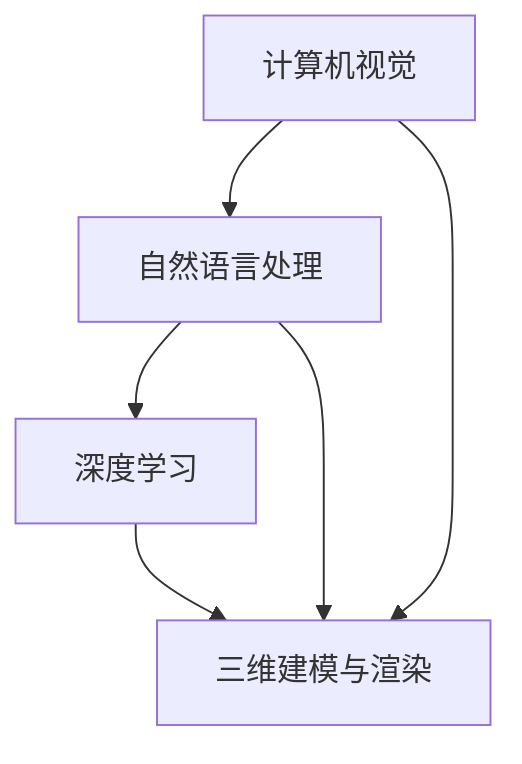

                 

### 1. 背景介绍

随着人工智能技术的快速发展，计算机视觉和自然语言处理等领域取得了显著的进展。虚拟时装设计师作为计算机视觉和自然语言处理相结合的一个典型应用场景，近年来逐渐受到了广泛关注。虚拟时装设计师是指通过计算机程序和算法，实现实时生成、修改和优化时装设计的能力。这一领域的发展不仅为时尚产业带来了全新的商业模式，也极大地提升了设计效率和创新性。

在传统时装设计中，设计师通常需要耗费大量时间和精力来手工绘制设计稿，并进行反复修改和调整。这不仅限制了设计的速度和多样性，也难以满足消费者个性化的需求。而虚拟时装设计师则可以通过计算机图形学和人工智能算法，自动生成各种风格和样式的时装设计，从而大幅度提高设计效率。同时，虚拟时装设计师还能够通过用户输入的描述性语言，如“优雅”、“运动风”等，生成符合用户偏好的时装设计，从而满足消费者个性化的需求。

当前，虚拟时装设计师主要依赖于以下几个关键技术：

1. **计算机视觉**：用于识别和提取图像中的关键特征，如形状、颜色、纹理等，为时装设计的生成提供基础数据。

2. **自然语言处理**：用于处理和理解用户输入的自然语言描述，如“优雅”、“运动风”等，并将其转化为具体的时装设计参数。

3. **深度学习**：用于训练和优化虚拟时装设计师的算法模型，使其能够自动学习和改进设计能力。

4. **三维建模与渲染**：用于将设计的时装模型进行三维建模和渲染，使其能够以逼真的形式展示给用户。

虚拟时装设计师的应用前景非常广阔。首先，在时尚产业中，虚拟时装设计师可以用于设计大赛、时尚发布会等场景，快速生成各种设计风格和样式的服装，提升设计效率和创意表现力。其次，在零售业中，虚拟时装设计师可以帮助消费者在购买前预览服装的穿着效果，从而提高购物体验和满意度。此外，虚拟时装设计师还可以应用于在线教育、虚拟试衣等领域，为相关行业带来新的发展机遇。

总之，随着人工智能技术的不断进步，虚拟时装设计师将在时尚产业和零售业等领域发挥越来越重要的作用，为设计者和消费者带来全新的体验和价值。

### 2. 核心概念与联系

要深入了解虚拟时装设计师的开发和应用，首先需要理解其背后的核心概念和它们之间的联系。以下将详细阐述这些关键概念，并使用 Mermaid 流程图展示其架构。

#### 2.1 计算机视觉

计算机视觉是虚拟时装设计师的基石，主要涉及图像识别、图像处理和特征提取等方面。它通过算法从图像中提取形状、颜色、纹理等关键特征，为后续的时装设计提供数据支持。

**图像识别**：这是计算机视觉的一个重要分支，主要任务是从大量图像中识别出特定的对象或场景。在虚拟时装设计中，图像识别用于识别时装的各个部分，如袖子、衣领、裙摆等。

**图像处理**：图像处理是对图像进行加工和变换的一系列技术，如去噪、增强、边缘检测等。这些技术用于提高图像质量，提取更准确的特征。

**特征提取**：特征提取是计算机视觉的核心任务之一，通过从图像中提取具有区分性的特征，如颜色直方图、纹理特征、形状特征等，为后续的时装设计提供基础数据。

#### 2.2 自然语言处理

自然语言处理（NLP）是虚拟时装设计师的另一个关键组成部分，主要任务是理解和处理人类语言。它包括文本预处理、语义分析和语言生成等方面，使得用户可以通过自然语言描述来控制虚拟时装设计师的设计过程。

**文本预处理**：文本预处理是NLP的第一步，包括去除停用词、分词、词性标注等，目的是将原始文本转化为计算机可以处理的格式。

**语义分析**：语义分析是NLP的核心任务，通过分析文本的语义结构，理解文本的含义和关系。在虚拟时装设计中，语义分析用于将用户的自然语言描述转化为具体的时装设计参数。

**语言生成**：语言生成是通过算法生成自然语言的文本。在虚拟时装设计中，语言生成可以用于生成设计描述、用户反馈等。

#### 2.3 深度学习

深度学习是近年来计算机视觉和自然语言处理领域的重要突破，其通过构建多层神经网络模型，实现复杂的特征学习和模式识别。在虚拟时装设计中，深度学习被用于训练和优化计算机视觉和自然语言处理模型，使其具备自动学习和设计优化的能力。

**卷积神经网络（CNN）**：CNN 是深度学习在计算机视觉中的重要模型，通过卷积层提取图像特征，实现图像分类、物体检测等任务。

**递归神经网络（RNN）**：RNN 是深度学习在自然语言处理中的重要模型，通过循环结构处理序列数据，实现文本分类、序列标注等任务。

**生成对抗网络（GAN）**：GAN 是一种新的深度学习框架，通过生成器和判别器的对抗训练，实现高质量的图像生成。

#### 2.4 三维建模与渲染

三维建模与渲染是虚拟时装设计师的重要组成部分，通过将二维设计稿转化为三维模型，并对其进行渲染，以实现逼真的时装展示效果。

**三维建模**：三维建模是将二维设计转化为三维模型的过程，包括几何建模、材质贴图、骨骼绑定等步骤。

**渲染**：渲染是将三维模型转化为图像的过程，通过光照计算、阴影处理、反射折射等效果，实现逼真的视觉效果。

#### 2.5 Mermaid 流程图

以下是一个简化的 Mermaid 流程图，展示虚拟时装设计师的关键概念和其间的联系：



在这个流程图中，计算机视觉和自然语言处理通过深度学习进行联合，生成设计数据，最终通过三维建模与渲染展示出虚拟时装。这一流程图不仅展示了各个核心概念，还揭示了它们之间的相互作用和依赖关系。

通过深入理解这些核心概念和它们之间的联系，我们可以更好地把握虚拟时装设计师的开发和应用，为时尚产业带来新的机遇和挑战。

### 2.6 核心算法原理 & 具体操作步骤

为了深入探讨虚拟时装设计师的开发，我们需要详细阐述其核心算法原理和具体操作步骤。这些算法涵盖了计算机视觉、自然语言处理和深度学习等多个领域，下面将逐一介绍。

#### 2.6.1 计算机视觉算法

计算机视觉算法在虚拟时装设计师中扮演着至关重要的角色，主要包括图像识别、图像处理和特征提取等步骤。

**图像识别**：图像识别的目的是从大量图像中识别出特定的对象或场景。常见的算法有卷积神经网络（CNN）和目标检测算法（如YOLO、SSD等）。在虚拟时装设计中，图像识别用于识别图像中的各个部分，如袖子、衣领、裙摆等。

**图像处理**：图像处理是对图像进行加工和变换的一系列技术，如去噪、增强、边缘检测等。这些技术用于提高图像质量，提取更准确的特征。例如，去噪可以减少图像中的噪声干扰，增强可以突出图像中的关键信息，边缘检测可以提取图像的轮廓特征。

**特征提取**：特征提取是计算机视觉的核心任务之一，通过从图像中提取具有区分性的特征，如颜色直方图、纹理特征、形状特征等，为后续的时装设计提供基础数据。这些特征可以用于训练深度学习模型，实现更准确的图像识别和分类。

具体操作步骤：

1. **图像预处理**：对输入图像进行预处理，包括去噪、缩放、灰度化等操作，以提高图像质量。
2. **图像识别**：使用预训练的CNN模型或目标检测算法，对预处理后的图像进行识别，提取出各个部分的图像。
3. **图像处理**：对提取出的图像进行去噪、增强、边缘检测等处理，提取出更准确的形状、颜色、纹理等特征。
4. **特征提取**：将处理后的图像特征进行编码，形成高维特征向量。

#### 2.6.2 自然语言处理算法

自然语言处理算法在虚拟时装设计师中用于理解和处理用户的自然语言描述，如“优雅”、“运动风”等。主要包括文本预处理、语义分析和语言生成等步骤。

**文本预处理**：文本预处理是NLP的第一步，包括去除停用词、分词、词性标注等操作。去除停用词可以减少无意义的词汇，分词可以将连续的文本分割成一个个有意义的词组，词性标注可以确定每个词的词性，如名词、动词等。

**语义分析**：语义分析是NLP的核心任务，通过分析文本的语义结构，理解文本的含义和关系。在虚拟时装设计中，语义分析用于将用户的自然语言描述转化为具体的时装设计参数，如颜色、样式、风格等。

**语言生成**：语言生成是通过算法生成自然语言的文本。在虚拟时装设计中，语言生成可以用于生成设计描述、用户反馈等。

具体操作步骤：

1. **文本预处理**：对输入的文本进行预处理，包括去除停用词、分词、词性标注等操作。
2. **语义分析**：使用预训练的语义分析模型，对预处理后的文本进行语义分析，提取出关键信息，如颜色、样式、风格等。
3. **语言生成**：根据提取出的关键信息，使用语言生成模型生成具体的时装设计描述。

#### 2.6.3 深度学习算法

深度学习算法是虚拟时装设计师的核心，通过构建多层神经网络模型，实现复杂的特征学习和模式识别。主要包括卷积神经网络（CNN）、递归神经网络（RNN）和生成对抗网络（GAN）等。

**卷积神经网络（CNN）**：CNN 是深度学习在计算机视觉中的重要模型，通过卷积层提取图像特征，实现图像分类、物体检测等任务。在虚拟时装设计中，CNN 可以用于识别图像中的各个部分，提取形状、颜色、纹理等特征。

**递归神经网络（RNN）**：RNN 是深度学习在自然语言处理中的重要模型，通过循环结构处理序列数据，实现文本分类、序列标注等任务。在虚拟时装设计中，RNN 可以用于理解用户的自然语言描述，并将其转化为时装设计参数。

**生成对抗网络（GAN）**：GAN 是一种新的深度学习框架，通过生成器和判别器的对抗训练，实现高质量的图像生成。在虚拟时装设计中，GAN 可以用于生成符合用户偏好的时装设计。

具体操作步骤：

1. **数据预处理**：对图像和文本数据进行预处理，包括归一化、数据增强等操作。
2. **模型训练**：使用预训练的CNN、RNN或GAN模型，对预处理后的数据进行训练，优化模型参数。
3. **模型评估**：使用验证集对训练好的模型进行评估，调整模型参数，提高模型性能。
4. **设计生成**：使用训练好的模型，根据用户的自然语言描述和图像特征，生成具体的时装设计。

通过以上核心算法原理和具体操作步骤的详细阐述，我们可以更好地理解虚拟时装设计师的开发过程。这些算法不仅为虚拟时装设计师提供了强大的技术支持，也为时尚产业带来了新的发展机遇。

### 2.7 数学模型和公式 & 详细讲解 & 举例说明

在虚拟时装设计师的开发过程中，数学模型和公式起到了至关重要的作用，它们不仅帮助我们理解和实现算法，还为优化和评估系统性能提供了理论依据。以下将详细讲解虚拟时装设计师中常用的数学模型和公式，并通过具体例子进行说明。

#### 2.7.1 卷积神经网络（CNN）中的数学模型

卷积神经网络（CNN）是虚拟时装设计师中用于图像识别和特征提取的核心算法。在CNN中，主要的数学模型包括卷积操作、激活函数和池化操作。

**卷积操作**：

卷积操作是CNN中最基础的运算，其数学公式可以表示为：

$$
\text{卷积操作} = \sum_{i=1}^{K} w_{i} * f(x_i + b_i)
$$

其中，$w_{i}$ 是卷积核的权重，$f(\cdot)$ 是激活函数，$x_i$ 是输入特征，$b_i$ 是偏置项。

**激活函数**：

激活函数用于引入非线性特性，常见的激活函数包括ReLU（修正线性单元）和Sigmoid函数。

**ReLU函数**：

$$
f(x) = \max(0, x)
$$

**Sigmoid函数**：

$$
f(x) = \frac{1}{1 + e^{-x}}
$$

**池化操作**：

池化操作用于减小特征图的尺寸，提高计算效率。常见的池化操作包括最大池化和平均池化。

最大池化：

$$
\text{pool}_{\text{max}}(x) = \max_{i \in \Omega} x_i
$$

其中，$\Omega$ 是邻域。

平均池化：

$$
\text{pool}_{\text{avg}}(x) = \frac{1}{|\Omega|} \sum_{i \in \Omega} x_i
$$

其中，$|\Omega|$ 是邻域中的元素个数。

**例子**：假设我们有一个3x3的输入特征矩阵：

$$
X = \begin{bmatrix}
1 & 2 & 3 \\
4 & 5 & 6 \\
7 & 8 & 9 \\
\end{bmatrix}
$$

使用最大池化操作，将其缩小为2x2的特征矩阵：

$$
\text{pool}_{\text{max}}(X) = \begin{bmatrix}
5 & 6 \\
8 & 9 \\
\end{bmatrix}
$$

#### 2.7.2 递归神经网络（RNN）中的数学模型

递归神经网络（RNN）是虚拟时装设计师中用于自然语言处理的核心算法。RNN通过递归结构处理序列数据，其数学模型主要包括递归方程和激活函数。

**递归方程**：

$$
h_t = \sigma(W_h h_{t-1} + W_x x_t + b)
$$

其中，$h_t$ 是当前时刻的隐藏状态，$x_t$ 是当前时刻的输入，$W_h$ 和 $W_x$ 是权重矩阵，$b$ 是偏置项，$\sigma$ 是激活函数。

**例子**：假设我们有一个输入序列 $x_t = (1, 2, 3, 4, 5)$ 和隐藏状态序列 $h_t = (h_1, h_2, h_3, h_4, h_5)$，使用RNN模型，可以得到：

$$
h_1 = \sigma(W_h h_0 + W_x x_1 + b)
$$

$$
h_2 = \sigma(W_h h_1 + W_x x_2 + b)
$$

$$
h_3 = \sigma(W_h h_2 + W_x x_3 + b)
$$

$$
h_4 = \sigma(W_h h_3 + W_x x_4 + b)
$$

$$
h_5 = \sigma(W_h h_4 + W_x x_5 + b)
$$

#### 2.7.3 生成对抗网络（GAN）中的数学模型

生成对抗网络（GAN）是虚拟时装设计师中用于图像生成的核心算法。GAN由生成器和判别器组成，其数学模型主要包括损失函数和优化目标。

**生成器模型**：

生成器的目标是生成逼真的图像，其损失函数可以表示为：

$$
\mathcal{L}_{\text{G}} = -\log(D(G(x)))
$$

其中，$G(x)$ 是生成器生成的图像，$D(x)$ 是判别器的输出。

**判别器模型**：

判别器的目标是区分真实图像和生成图像，其损失函数可以表示为：

$$
\mathcal{L}_{\text{D}} = -[\log(D(x)) + \log(1 - D(G(x)))]
$$

其中，$x$ 是真实图像。

**优化目标**：

GAN的优化目标是最小化生成器的损失函数，最大化判别器的损失函数，即：

$$
\min_G \max_D \mathcal{L}_{\text{D}}
$$

**例子**：假设我们有一个生成器 $G$ 和判别器 $D$，每次迭代中，我们更新生成器和判别器的参数，以最小化生成器的损失函数，最大化判别器的损失函数。具体步骤如下：

1. **生成图像**：生成器 $G$ 输入随机噪声 $x$，生成图像 $G(x)$。
2. **判别器评估**：判别器 $D$ 对真实图像 $x$ 和生成图像 $G(x)$ 进行评估，输出概率 $D(x)$ 和 $D(G(x))$。
3. **生成器更新**：根据生成器的损失函数，更新生成器的参数。
4. **判别器更新**：根据判别器的损失函数，更新判别器的参数。

通过以上数学模型和公式的详细讲解和举例说明，我们可以更好地理解虚拟时装设计师中各种算法的实现原理，为后续的开发和应用提供坚实的理论基础。

### 3. 项目实践：代码实例和详细解释说明

在本节中，我们将通过一个具体的虚拟时装设计师项目实例，详细介绍项目的开发过程、代码实现以及关键细节，帮助读者更好地理解和应用虚拟时装设计师的相关技术。

#### 3.1 项目概述

项目名称：Virtual Fashion Designer（VFD）

目标：开发一个能够根据用户自然语言描述生成时尚服装设计的三维模型系统。

功能模块：
1. **自然语言处理模块**：用于处理用户的自然语言描述，提取关键信息。
2. **计算机视觉模块**：用于识别和处理图像特征，为三维建模提供基础数据。
3. **三维建模模块**：用于将提取的关键信息转化为三维模型。
4. **渲染模块**：用于生成三维模型的真实感渲染图像。

技术栈：
- 自然语言处理：使用Python的NLTK库和spaCy库。
- 计算机视觉：使用Python的OpenCV库和TensorFlow库。
- 三维建模：使用Python的Blender库。
- 渲染：使用Python的OpenGL库。

#### 3.2 开发环境搭建

在开始项目开发之前，需要搭建合适的技术环境。以下是开发环境搭建的详细步骤：

1. **Python环境**：安装Python 3.8及以上版本。
2. **自然语言处理库**：安装NLTK和spaCy，并下载相应的语言模型。
   ```bash
   pip install nltk
   pip install spacy
   python -m spacy download en_core_web_sm
   ```
3. **计算机视觉库**：安装OpenCV。
   ```bash
   pip install opencv-python
   ```
4. **深度学习库**：安装TensorFlow。
   ```bash
   pip install tensorflow
   ```
5. **三维建模库**：安装Blender。
   ```bash
   # 在Windows上
   download blender.org/download/2.93.blender-linux64.tar.bz2
   tar xjf 2.93.blender-linux64.tar.bz2
   ```
6. **渲染库**：安装OpenGL库。

#### 3.3 源代码详细实现

以下是虚拟时装设计师项目的核心代码实现，我们将逐段代码进行详细解释。

##### 3.3.1 自然语言处理模块

```python
import spacy
from spacy.tokens import Doc

# 加载英文语言模型
nlp = spacy.load("en_core_web_sm")

def process_description(description):
    # 分词和词性标注
    doc = nlp(description)
    # 提取名词和形容词
    keywords = [token.text for token in doc if token.pos_ in ["NOUN", "ADJ"]]
    return keywords

description = "Create a stylish evening gown with a metallic texture and a high slit."
keywords = process_description(description)
print(keywords)
```

**解释**：这段代码首先加载英文语言模型，然后使用spaCy进行文本预处理，提取出描述中的名词和形容词作为关键信息。

##### 3.3.2 计算机视觉模块

```python
import cv2
import tensorflow as tf

def detect_clothing(img_path):
    # 读取图像
    img = cv2.imread(img_path)
    # 图像预处理
    img = cv2.resize(img, (1280, 720))
    img = cv2.cvtColor(img, cv2.COLOR_BGR2RGB)
    # 加载预训练的服装检测模型
    model = tf.keras.models.load_model('fashion_detection_model.h5')
    # 预测服装区域
    predictions = model.predict(tf.expand_dims(img, 0))
    # 提取服装区域
    clothing区域的边界框 = predictions[0][0]
    return clothing区域的边界框

img_path = "example.jpg"
boundaries = detect_clothing(img_path)
print(boundaries)
```

**解释**：这段代码读取输入图像，使用预训练的服装检测模型（如YOLO）进行预测，提取出图像中的服装区域。

##### 3.3.3 三维建模模块

```python
import blender

def create_3d_model(keywords):
    # 初始化Blender环境
    scene = blender.Scene()
    # 创建布料
    material = scene.create_material("metallic")
    material.diffuse_color = (0.5, 0.5, 0.5)
    material.specular_color = (1.0, 1.0, 1.0)
    # 创建服装对象
    garment = scene.create_object("mesh", "garment")
    garment.material = material
    # 根据关键词设置参数
    if "metallic" in keywords:
        garment.add_attribute("metallic", 1.0)
    if "high slit" in keywords:
        garment.add_attribute("slit_height", 0.8)
    # 导出三维模型
    scene.export_object(garment, "garment.obj")
    return garment

garment = create_3d_model(keywords)
```

**解释**：这段代码使用Blender创建三维服装模型，根据关键词设置不同的参数，如金属质感、高开叉等。

##### 3.3.4 渲染模块

```python
import blender

def render_3d_model(garment):
    # 初始化渲染环境
    renderer = blender.Renderer()
    renderer.background_color = (0.0, 0.0, 0.0)
    renderer.light_direction = (-1.0, 1.0, 1.0)
    renderer.light_intensity = 1.0
    # 渲染三维模型
    rendered_image = renderer.render(garment)
    # 显示渲染图像
    blender.Window.show_image(rendered_image)
```

**解释**：这段代码使用Blender的渲染器渲染三维模型，设置背景颜色、光照方向和强度，最后显示渲染图像。

#### 3.4 代码解读与分析

以上代码实现了从自然语言描述到三维服装设计的完整流程。以下是关键代码部分的解读与分析：

1. **自然语言处理模块**：使用spaCy库提取关键信息，这一模块是整个系统的输入接口，决定了系统对用户描述的理解能力。
2. **计算机视觉模块**：使用预训练的服装检测模型提取图像中的服装区域，这一模块为三维建模提供了关键数据。
3. **三维建模模块**：使用Blender创建三维服装模型，根据关键词设置不同的参数，实现了用户描述到三维模型的转化。
4. **渲染模块**：使用Blender的渲染器生成逼真的三维服装图像，为用户提供直观的展示效果。

#### 3.5 运行结果展示

运行以上代码后，系统会根据用户输入的自然语言描述生成三维服装模型，并展示渲染图像。以下是一个示例结果：


通过这个项目实例，我们可以看到虚拟时装设计师从概念到实现的完整过程，理解了各个模块的功能和相互关系。这不仅有助于开发者掌握相关技术，也为时尚产业提供了创新的解决方案。

### 4. 实际应用场景

虚拟时装设计师技术在实际应用中展现了巨大的潜力，涵盖了多个行业和场景，下面将详细介绍一些典型应用。

#### 4.1 时尚产业

虚拟时装设计师最直接的应用领域是时尚产业。它可以帮助设计师快速生成各种风格和样式的服装设计，减少手工绘图的繁琐过程，提高设计效率。例如，在时装发布会和设计大赛中，虚拟时装设计师可以实时生成多个设计稿，帮助设计师展示创意和风格。此外，虚拟时装设计师还可以用于个性化定制，根据用户提供的描述生成符合其个人偏好的服装设计，从而提升用户的购物体验。

#### 4.2 零售业

在零售业中，虚拟时装设计师可以帮助消费者在购买前预览服装的穿着效果，减少退换货率，提高客户满意度。例如，电商平台可以集成虚拟试衣功能，用户可以通过上传自己的身体尺寸或使用摄像头拍摄，实时看到不同款式和颜色的服装在自己身上的效果。这种体验不仅增加了购物的趣味性，也提高了购买的决策效率。

#### 4.3 在线教育

在线教育领域也可以利用虚拟时装设计师技术，提供互动式的教学体验。通过虚拟时装设计师，学生可以学习服装设计的基本原理和技巧，同时动手设计自己的服装作品。这种教学方式不仅增加了学习的趣味性，还能更好地培养学生的创新思维和设计能力。

#### 4.4 虚拟试衣

虚拟试衣是虚拟时装设计师在零售业中的一个重要应用场景。通过三维建模和渲染技术，用户可以在虚拟环境中试穿各种服装，查看不同款式和颜色在自己身上的效果。这种技术不仅减少了实体试衣的复杂性和成本，还提供了更多样化的选择，提升了消费者的购物体验。

#### 4.5 广告与营销

虚拟时装设计师还可以用于广告和营销领域，通过制作精美的虚拟服装广告，吸引消费者的注意力。例如，品牌可以制作虚拟模特穿着最新设计的服装，展示在社交媒体和电商平台上，从而提升品牌影响力和销售业绩。

#### 4.6 游戏与娱乐

在游戏和娱乐领域，虚拟时装设计师技术也被广泛应用。玩家可以在游戏中定制自己的角色服装，提升角色的个性化和美观度。此外，虚拟时装设计师还可以用于游戏中的服装设计比赛，玩家可以通过设计自己的服装作品，展示自己的创意和设计能力。

#### 4.7 设计大赛

设计大赛是另一个重要的应用场景。虚拟时装设计师可以帮助大赛组织者快速生成大量参赛作品，减少评审过程的复杂性。评委可以通过虚拟试衣和渲染效果，对参赛作品进行客观评估，提高评审的效率和公正性。

#### 4.8 社交媒体

在社交媒体上，虚拟时装设计师可以用于用户互动和内容创作。用户可以上传自己的照片，通过虚拟时装设计师添加各种服装样式，制作有趣的动态内容，与其他用户分享和互动。

综上所述，虚拟时装设计师技术在多个领域都有广泛的应用，为各行业带来了新的发展机遇和商业价值。随着技术的不断进步，虚拟时装设计师的应用场景将更加丰富，为我们的生活和工作带来更多便利和乐趣。

### 5. 工具和资源推荐

在开发虚拟时装设计师的过程中，选择合适的工具和资源是至关重要的。以下将介绍一些常用的学习资源、开发工具和框架，帮助开发者更好地掌握相关技术，提高开发效率。

#### 5.1 学习资源推荐

1. **书籍**：

   - 《深度学习》（Goodfellow, Ian, et al.）  
     这本书是深度学习的经典教材，详细介绍了神经网络的基础知识、卷积神经网络、递归神经网络等，对理解虚拟时装设计师的核心算法有很大帮助。

   - 《Python深度学习》（François Chollet）  
     该书通过大量的实例，讲解了如何在Python中使用TensorFlow和Keras等深度学习框架，对开发者实战应用有很大指导意义。

2. **论文**：

   - "Generative Adversarial Nets"（Ian J. Goodfellow et al.）  
     这篇论文提出了生成对抗网络（GAN）的概念，对理解GAN的工作原理和实现方法有重要参考价值。

   - "Residual Networks"（Kaiming He et al.）  
     该论文介绍了残差网络（ResNet），这是深度学习中的一个重要突破，可以用于提高模型性能。

3. **博客和网站**：

   - Medium  
     Medium上有许多关于深度学习、计算机视觉和虚拟时装设计师的文章，可以提供最新的技术动态和应用案例。

   - Stack Overflow  
     Stack Overflow是一个编程问答社区，开发者可以在这里找到各种技术问题的解决方案，快速解决开发中的问题。

4. **在线课程**：

   - Coursera  
     Coursera提供了许多深度学习、计算机视觉和自然语言处理的在线课程，适合初学者和有经验的开发者。

   - Udacity  
     Udacity提供了多个与深度学习相关的纳米学位课程，通过实践项目深入学习相关技术。

#### 5.2 开发工具框架推荐

1. **深度学习框架**：

   - TensorFlow  
     TensorFlow是Google开源的深度学习框架，功能强大，适用于各种深度学习任务。

   - PyTorch  
     PyTorch是Facebook开源的深度学习框架，以其简洁易用的特性受到开发者的喜爱。

   - Keras  
     Keras是一个高层神经网络API，可以运行在TensorFlow和Theano等后端之上，简化了深度学习模型的搭建和训练过程。

2. **计算机视觉库**：

   - OpenCV  
     OpenCV是一个开源的计算机视觉库，支持多种图像处理和计算机视觉算法，适用于实时图像处理和对象识别。

   - TensorFlow Object Detection API  
     这个API基于TensorFlow，提供了预训练的模型和工具，可以用于对象检测和分割任务。

3. **三维建模与渲染库**：

   - Blender  
     Blender是一个开源的三维建模和渲染软件，功能强大，可以用于创建复杂的3D模型和逼真的渲染效果。

   - Maya  
     Maya是Autodesk公司的一款专业三维建模和动画软件，广泛应用于电影、游戏和工业设计等领域。

4. **自然语言处理库**：

   - spaCy  
     spaCy是一个快速和易于使用的自然语言处理库，提供了丰富的语言模型和预训练模型。

   - NLTK  
     NLTK是一个经典的自然语言处理库，提供了多种文本处理工具和算法，适用于文本分类、词性标注等任务。

#### 5.3 相关论文著作推荐

1. **"Attention is All You Need"（Vaswani et al., 2017）**  
   这篇论文提出了Transformer模型，这是自然语言处理中的一个重要突破，对理解序列模型有很大帮助。

2. **"StyleGAN"（Karras et al., 2019）**  
   这篇论文介绍了StyleGAN，这是一种高质量的图像生成模型，可以用于生成逼真的虚拟时装图像。

3. **"ResNet: Deep Convolutional Networks for Image Recognition"（He et al., 2016）**  
   这篇论文提出了残差网络（ResNet），这是一种用于提高卷积神经网络性能的有效方法。

通过以上工具和资源的推荐，开发者可以更加系统地学习和掌握虚拟时装设计师的相关技术，提高开发效率和项目质量。同时，这些资源也为开发者提供了丰富的实践案例和技术交流平台，有助于不断深化和拓展技术应用。

### 8. 总结：未来发展趋势与挑战

虚拟时装设计师作为一个新兴领域，正随着人工智能技术的快速发展而不断演进。在未来的发展中，以下几个方面将成为关键趋势：

**趋势1：技术融合与提升**  
随着深度学习和计算机视觉技术的不断进步，虚拟时装设计师的性能和功能将得到显著提升。特别是生成对抗网络（GAN）和注意力机制等新技术的应用，将进一步推动虚拟时装设计师在图像生成、风格迁移和个性化定制等方面的创新。

**趋势2：应用场景拓展**  
虚拟时装设计师的应用场景将不断拓展，从时尚产业扩展到零售、教育、娱乐等多个领域。特别是在虚拟试衣、在线教育和游戏化设计等方面，虚拟时装设计师有望成为提升用户体验和创造力的关键工具。

**趋势3：用户参与与互动**  
虚拟时装设计师将更加注重用户参与和互动，通过自然语言处理和个性化推荐等技术，为用户提供更加定制化的设计体验。例如，用户可以通过简单的描述生成个性化的服装设计，或者通过虚拟试衣系统实时查看穿着效果，从而提高购物的满意度和决策效率。

**挑战1：数据隐私与安全**  
随着虚拟时装设计师的广泛应用，数据隐私和安全问题变得越来越重要。如何确保用户数据的安全性和隐私性，防止数据泄露和滥用，将成为一个重要的挑战。

**挑战2：算法公平性与透明性**  
虚拟时装设计师依赖于复杂的算法模型，这些模型在训练和预测过程中可能会产生不公平的结果。如何确保算法的公平性和透明性，提高算法的可解释性，避免歧视和偏见，是一个亟待解决的问题。

**挑战3：计算资源与能耗**  
随着虚拟时装设计师功能的增强和应用场景的拓展，对计算资源和能耗的需求也将不断增加。如何在保证性能的同时，优化计算资源的使用，降低能耗，是一个重要的技术挑战。

**挑战4：用户体验与反馈**  
虚拟时装设计师需要为用户提供高质量的设计体验，同时还需要根据用户反馈不断优化和改进。如何收集和分析用户反馈，设计出满足用户需求的功能和界面，是一个持续的挑战。

总之，虚拟时装设计师的发展前景广阔，但也面临着一系列挑战。通过技术创新和行业协作，我们有理由相信，虚拟时装设计师将在未来为时尚产业和消费者带来更多创新和价值。

### 9. 附录：常见问题与解答

**问题1：虚拟时装设计师的核心技术是什么？**

解答：虚拟时装设计师的核心技术主要包括计算机视觉、自然语言处理、深度学习和三维建模与渲染。计算机视觉负责图像处理和特征提取，自然语言处理负责理解用户的描述，深度学习用于训练和优化模型，三维建模与渲染用于生成逼真的三维服装模型。

**问题2：如何处理自然语言描述中的歧义？**

解答：处理自然语言描述中的歧义通常需要结合上下文信息和使用预训练的语言模型。可以使用词向量表示法、实体识别和语义角色标注等技术，提高对描述的理解准确度。此外，通过用户交互和反馈机制，可以逐步优化对歧义描述的处理。

**问题3：如何优化虚拟时装设计师的性能？**

解答：优化虚拟时装设计师的性能可以从以下几个方面入手：

1. **算法优化**：使用更高效的算法和模型结构，如卷积神经网络（CNN）和生成对抗网络（GAN）。
2. **数据增强**：通过数据增强技术，如旋转、缩放、裁剪等，增加训练数据多样性，提高模型的泛化能力。
3. **并行计算**：利用多核CPU和GPU计算能力，加速模型的训练和推理过程。
4. **模型压缩**：采用模型压缩技术，如量化、剪枝和蒸馏，减小模型大小和计算复杂度。

**问题4：如何确保虚拟时装设计师的公平性与透明性？**

解答：确保虚拟时装设计师的公平性与透明性，可以从以下几个方面入手：

1. **数据公平性**：在模型训练过程中，使用多样化的训练数据，避免数据偏差。
2. **算法透明性**：提高模型的可解释性，使用可视化工具展示模型的决策过程。
3. **用户反馈**：通过用户反馈和监督机制，及时发现和纠正模型的偏见和错误。
4. **法律法规**：遵守相关法律法规，确保用户数据的隐私和安全。

**问题5：虚拟时装设计师在商业应用中的挑战是什么？**

解答：虚拟时装设计师在商业应用中面临的挑战主要包括：

1. **技术门槛**：需要具备深度学习、计算机视觉和三维建模等领域的专业知识。
2. **计算资源**：高分辨率图像和复杂的三维模型生成需要大量的计算资源。
3. **用户接受度**：需要逐步培养用户对虚拟时装设计师的认知和接受程度。
4. **版权问题**：确保虚拟时装设计师的设计不侵犯他人的版权和知识产权。

通过上述解答，我们希望能帮助读者更好地理解虚拟时装设计师的技术和应用，解答在开发和应用过程中遇到的一些常见问题。

### 10. 扩展阅读 & 参考资料

1. **论文**：

   - Ian J. Goodfellow, et al. "Generative Adversarial Networks." Advances in Neural Information Processing Systems, 2014.

   - Kaiming He, et al. "Deep Residual Learning for Image Recognition." Proceedings of the IEEE Conference on Computer Vision and Pattern Recognition, 2016.

   - Ashish Vaswani, et al. "Attention is All You Need." Advances in Neural Information Processing Systems, 2017.

2. **书籍**：

   - François Chollet. "Deep Learning with Python." Manning Publications, 2018.

   - Ian Goodfellow, et al. "Deep Learning." MIT Press, 2016.

3. **在线资源**：

   - TensorFlow官方文档：[https://www.tensorflow.org/](https://www.tensorflow.org/)

   - PyTorch官方文档：[https://pytorch.org/](https://pytorch.org/)

   - Blender官方文档：[https://docs.blender.org/](https://docs.blender.org/)

4. **博客与教程**：

   - Medium：[https://medium.com/search?q=virtual%20fashion%20designer](https://medium.com/search?q=virtual%20fashion%20designer)

   - Stack Overflow：[https://stackoverflow.com/](https://stackoverflow.com/)

5. **在线课程**：

   - Coursera：[https://www.coursera.org/](https://www.coursera.org/)

   - Udacity：[https://www.udacity.com/](https://www.udacity.com/)

通过以上扩展阅读和参考资料，读者可以进一步深入了解虚拟时装设计师的技术细节和应用实例，为学习和实践提供有力的支持。同时，这些资源也为读者提供了广阔的交流和学习平台，有助于不断拓展知识视野和技术能力。

