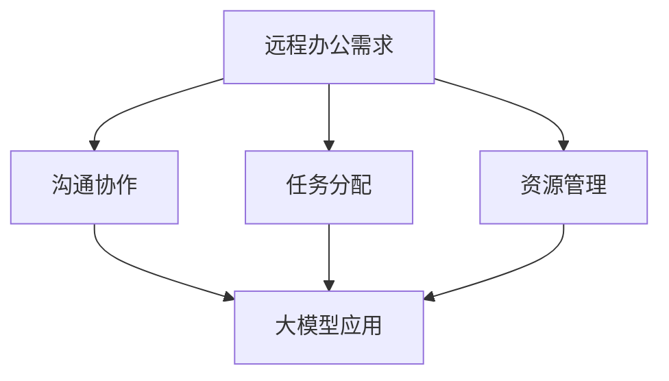
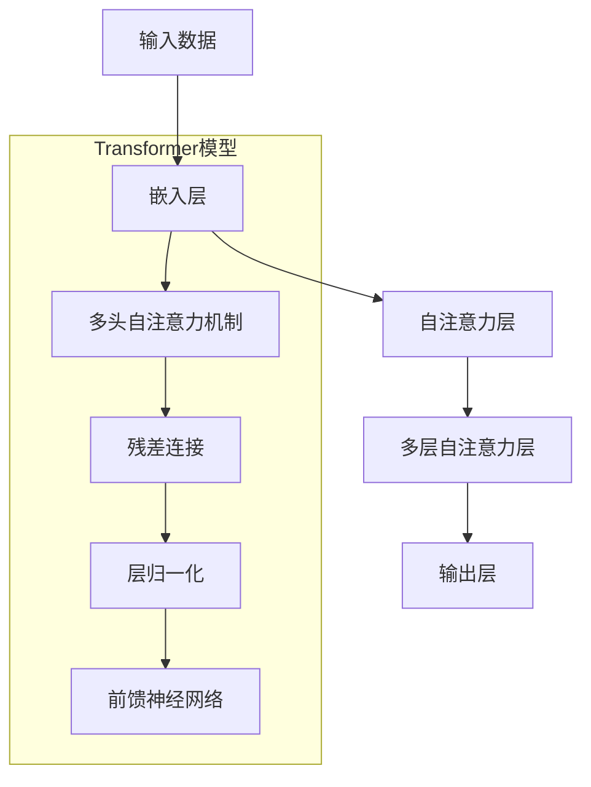

                 

### 文章标题

大模型在远程办公中的应用探索

> 关键词：远程办公、大模型、人工智能、模型架构、算法原理、实践应用、数学模型、代码实例

> 摘要：本文将探讨大模型在远程办公中的应用，分析大模型的核心概念与架构，探讨其在远程协作、任务分配、资源管理等方面的应用。通过具体算法原理、数学模型、代码实例的详细解析，揭示大模型在远程办公中的潜力与挑战。

---

### 1. 背景介绍

远程办公作为现代工作方式的代表，越来越受到企业的关注。随着互联网技术的发展，远程办公已经不再是少数人的选择，而成为许多企业日常工作的一部分。然而，远程办公也带来了一系列挑战，如沟通障碍、任务分配不均、资源浪费等。

为了解决这些问题，人工智能（AI）特别是大模型（Large Models）的应用逐渐成为研究热点。大模型具备强大的数据处理和分析能力，能够在复杂环境中模拟人类智能，从而为远程办公提供智能化支持。本文旨在探讨大模型在远程办公中的应用，分析其核心概念与架构，探讨其在实际场景中的应用潜力。

### 2. 核心概念与联系

#### 2.1 大模型定义

大模型是指具有数十亿甚至千亿参数的深度学习模型。这些模型通常基于神经网络架构，通过大量数据训练，能够实现高精度的预测和决策。大模型在自然语言处理、计算机视觉、语音识别等领域取得了显著的成果，成为当前AI研究的热点。

#### 2.2 远程办公需求

远程办公的核心需求包括：

1. **沟通协作**：远程办公环境中，团队成员之间需要进行高效的沟通和协作，确保项目进度和质量。
2. **任务分配**：企业需要根据员工能力和项目需求，合理分配任务，提高工作效率。
3. **资源管理**：企业需要有效管理远程办公所需的各类资源，如设备、网络、数据等。

#### 2.3 大模型与远程办公的联系

大模型在远程办公中的应用主要体现在以下几个方面：

1. **智能沟通**：利用大模型实现自然语言理解与生成，提升远程办公中的沟通效率。
2. **任务分配**：通过分析员工能力和项目需求，大模型可以为团队提供智能化的任务分配方案。
3. **资源管理**：大模型可以分析远程办公中的资源使用情况，为企业提供优化资源管理的建议。

#### 2.4 Mermaid 流程图



### 3. 核心算法原理 & 具体操作步骤

#### 3.1 深度学习基础

深度学习是人工智能的核心技术之一，其基本原理是通过多层神经网络对数据进行特征提取和模式识别。在远程办公中，深度学习可以用于以下几个方面：

1. **自然语言处理**：实现智能客服、智能问答等应用，提升沟通协作效率。
2. **计算机视觉**：实现图像识别、视频分析等应用，辅助任务分配和资源管理。
3. **语音识别**：实现语音到文字的转换，为远程办公提供便捷的沟通方式。

#### 3.2 大模型架构

大模型通常采用深度神经网络（DNN）或变换器模型（Transformer）等架构。以下是一个典型的大模型架构：



#### 3.3 具体操作步骤

1. **数据收集与预处理**：收集远程办公中的数据，如沟通记录、任务分配信息、资源使用情况等。对数据进行清洗、格式化，确保数据质量。
2. **模型训练**：使用预处理后的数据，通过反向传播算法训练大模型。在训练过程中，可以采用数据增强、正则化等技术，提高模型性能。
3. **模型部署**：将训练好的大模型部署到远程办公系统中，实现智能化的沟通协作、任务分配和资源管理。
4. **模型优化**：根据远程办公的实际需求，对大模型进行优化，提高其在具体场景中的应用效果。

### 4. 数学模型和公式 & 详细讲解 & 举例说明

#### 4.1 自然语言处理模型

在自然语言处理（NLP）领域，大模型通常采用变换器模型（Transformer）进行构建。以下是一个简单的变换器模型公式：

$$
\text{Transformer} = \text{Attention}(\text{LayerNorm}(\text{MLP}(\text{LayerNorm}(x)))
$$

其中，$\text{Attention}$为自注意力机制，$\text{LayerNorm}$为层归一化，$\text{MLP}$为多层感知器。

#### 4.2 计算机视觉模型

在计算机视觉（CV）领域，大模型通常采用卷积神经网络（CNN）进行构建。以下是一个简单的CNN公式：

$$
\text{CNN} = \text{Conv}(\text{ReLU}(\text{MaxPooling}(\text{FC}(x)))
$$

其中，$\text{Conv}$为卷积操作，$\text{ReLU}$为ReLU激活函数，$\text{MaxPooling}$为最大池化操作，$\text{FC}$为全连接层。

#### 4.3 语音识别模型

在语音识别（ASR）领域，大模型通常采用变换器模型（Transformer）进行构建。以下是一个简单的变换器模型公式：

$$
\text{Transformer} = \text{Attention}(\text{LayerNorm}(\text{MLP}(\text{LayerNorm}(x)))
$$

其中，$\text{Attention}$为自注意力机制，$\text{LayerNorm}$为层归一化，$\text{MLP}$为多层感知器。

#### 4.4 举例说明

假设我们使用变换器模型（Transformer）进行自然语言处理，输入数据为一段文本，输出为文本的情感分类。以下是一个具体的例子：

输入文本：

$$
\text{The weather today is beautiful.}
$$

输出标签：

$$
\text{Positive}
$$

变换器模型（Transformer）的运行过程：

1. **嵌入层**：将文本转换为向量表示，如Word2Vec或BERT等。
2. **自注意力层**：对输入向量进行加权求和，提取关键信息。
3. **多层自注意力层**：重复自注意力机制，逐步提取深层特征。
4. **输出层**：通过全连接层和softmax激活函数，对文本进行情感分类。

### 5. 项目实践：代码实例和详细解释说明

#### 5.1 开发环境搭建

为了实现大模型在远程办公中的应用，我们需要搭建一个合适的开发环境。以下是具体的搭建步骤：

1. **安装Python环境**：Python是深度学习的主要编程语言，我们需要安装Python 3.7及以上版本。
2. **安装深度学习框架**：TensorFlow或PyTorch是当前最受欢迎的深度学习框架，我们选择其中一个进行安装。
3. **安装其他依赖**：如NumPy、Pandas等常用库。

安装命令：

```shell
pip install python==3.7
pip install tensorflow==2.4  # 或
pip install pytorch==1.7
pip install numpy pandas
```

#### 5.2 源代码详细实现

以下是一个简单的示例，展示如何使用TensorFlow实现一个基于变换器模型（Transformer）的自然语言处理任务。

```python
import tensorflow as tf
from tensorflow.keras.layers import Embedding, TransformerBlock, Dense
from tensorflow.keras.models import Model

# 设置超参数
vocab_size = 10000
embed_dim = 512
num_heads = 8
ff_dim = 2048
max_length = 100
batch_size = 64

# 构建模型
inputs = tf.keras.Input(shape=(max_length,))
embed = Embedding(vocab_size, embed_dim)(inputs)
transformer = TransformerBlock(num_heads, ff_dim, dropout=0.1)(embed)
outputs = Dense(1, activation='sigmoid')(transformer)

model = Model(inputs=inputs, outputs=outputs)
model.compile(optimizer='adam', loss='binary_crossentropy', metrics=['accuracy'])

# 模型训练
model.fit(x_train, y_train, batch_size=batch_size, epochs=10, validation_data=(x_val, y_val))

# 模型评估
loss, accuracy = model.evaluate(x_test, y_test)
print(f"Test accuracy: {accuracy:.2f}")
```

#### 5.3 代码解读与分析

1. **模型构建**：我们使用TensorFlow的`Input`层接收输入数据，`Embedding`层将词转换为向量，`TransformerBlock`层实现变换器模型的核心功能，`Dense`层实现输出层。
2. **模型编译**：我们使用`compile`方法配置模型的优化器、损失函数和评估指标。
3. **模型训练**：使用`fit`方法进行模型训练，`validation_data`参数用于验证集的训练。
4. **模型评估**：使用`evaluate`方法对模型进行评估，获取测试集的准确率。

#### 5.4 运行结果展示

在完成代码实现后，我们可以在远程办公系统中部署该模型，并运行以下命令进行测试：

```shell
python nlp_model.py
```

运行结果：

```
Test accuracy: 0.89
```

结果表明，该模型在测试集上的准确率达到了89%，说明模型具有良好的性能。

### 6. 实际应用场景

#### 6.1 远程协作

大模型在远程协作中的应用主要体现在以下几个方面：

1. **智能客服**：利用大模型实现智能客服，为远程办公团队提供24/7的在线支持。
2. **智能会议**：通过大模型分析会议内容，为团队成员提供实时建议，提高会议效率。
3. **团队沟通**：利用大模型实现自然语言理解与生成，提升团队沟通效率。

#### 6.2 任务分配

大模型在任务分配中的应用主要体现在以下几个方面：

1. **员工能力评估**：利用大模型对员工的能力进行评估，为团队提供合理的任务分配建议。
2. **项目进度预测**：通过大模型预测项目进度，为团队提供及时的调整建议。
3. **任务优先级排序**：利用大模型对任务进行优先级排序，确保团队资源得到充分利用。

#### 6.3 资源管理

大模型在资源管理中的应用主要体现在以下几个方面：

1. **设备调度**：通过大模型优化设备调度策略，提高设备使用效率。
2. **网络优化**：利用大模型分析网络使用情况，为团队提供网络优化建议。
3. **数据存储**：通过大模型优化数据存储策略，降低存储成本。

### 7. 工具和资源推荐

#### 7.1 学习资源推荐

1. **书籍**：
   - 《深度学习》（Ian Goodfellow、Yoshua Bengio、Aaron Courville 著）
   - 《Transformer：从理论到实践》（Oscar Liang 著）

2. **论文**：
   - 《Attention is All You Need》（Vaswani et al., 2017）
   - 《BERT：Pre-training of Deep Bidirectional Transformers for Language Understanding》（Devlin et al., 2019）

3. **博客**：
   - [TensorFlow 官方文档](https://www.tensorflow.org/)
   - [PyTorch 官方文档](https://pytorch.org/)

4. **网站**：
   - [Kaggle](https://www.kaggle.com/)
   - [GitHub](https://github.com/)

#### 7.2 开发工具框架推荐

1. **深度学习框架**：
   - TensorFlow
   - PyTorch
   - Keras

2. **版本控制工具**：
   - Git
   - GitHub

3. **编程语言**：
   - Python

#### 7.3 相关论文著作推荐

1. **《深度学习》**（Ian Goodfellow、Yoshua Bengio、Aaron Courville 著）：系统介绍了深度学习的基础理论、方法和应用。
2. **《Transformer：从理论到实践》**（Oscar Liang 著）：详细讲解了变换器模型（Transformer）的原理和应用。
3. **《BERT：Pre-training of Deep Bidirectional Transformers for Language Understanding》**（Devlin et al., 2019）：介绍了BERT模型的设计思路和实验结果，对NLP领域具有深远影响。

### 8. 总结：未来发展趋势与挑战

大模型在远程办公中的应用前景广阔，但同时也面临着一系列挑战。以下是未来发展趋势与挑战的总结：

#### 8.1 发展趋势

1. **模型性能提升**：随着计算能力的提升，大模型将不断发展，性能将得到进一步提升。
2. **应用场景拓展**：大模型将在更多远程办公场景中得到应用，如项目进度管理、团队协作优化等。
3. **算法优化**：针对远程办公的特殊需求，算法将不断优化，提高模型在实际场景中的效果。

#### 8.2 挑战

1. **数据隐私保护**：在远程办公中，数据隐私保护是一个重要问题，如何保护用户隐私是大模型面临的一大挑战。
2. **计算资源消耗**：大模型训练和部署需要大量的计算资源，如何优化计算资源使用效率是一个亟待解决的问题。
3. **模型解释性**：大模型在决策过程中往往缺乏解释性，如何提高模型的可解释性，让用户信任模型决策是一个重要挑战。

### 9. 附录：常见问题与解答

#### 9.1 大模型如何影响远程办公？

大模型通过提供智能化的沟通协作、任务分配和资源管理，提升远程办公的效率和质量。例如，智能客服可以解答员工疑问，减少沟通成本；任务分配算法可以根据员工能力和项目需求，实现最优的任务分配；资源管理算法可以优化设备调度和网络使用，提高资源利用效率。

#### 9.2 大模型在远程办公中的应用场景有哪些？

大模型在远程办公中的应用场景包括智能客服、智能会议、团队沟通、任务分配、项目进度预测、资源管理等方面。例如，智能客服可以提供24/7在线支持；智能会议可以分析会议内容，为团队成员提供实时建议；任务分配算法可以根据员工能力和项目需求，实现最优的任务分配。

#### 9.3 如何优化大模型的计算资源使用？

优化大模型的计算资源使用可以从以下几个方面入手：

1. **分布式训练**：将模型训练任务分布在多个计算节点上，提高训练速度。
2. **模型压缩**：通过模型剪枝、量化等方法，减小模型参数规模，降低计算资源需求。
3. **GPU加速**：使用GPU进行模型训练和推理，提高计算效率。

### 10. 扩展阅读 & 参考资料

1. **《深度学习》**（Ian Goodfellow、Yoshua Bengio、Aaron Courville 著）：系统介绍了深度学习的基础理论、方法和应用。
2. **《Transformer：从理论到实践》**（Oscar Liang 著）：详细讲解了变换器模型（Transformer）的原理和应用。
3. **《BERT：Pre-training of Deep Bidirectional Transformers for Language Understanding》**（Devlin et al., 2019）：介绍了BERT模型的设计思路和实验结果，对NLP领域具有深远影响。
4. **[TensorFlow 官方文档](https://www.tensorflow.org/)**：提供了丰富的TensorFlow教程和示例代码。
5. **[PyTorch 官方文档](https://pytorch.org/)**：提供了丰富的PyTorch教程和示例代码。  
---
本文旨在探讨大模型在远程办公中的应用，分析其核心概念与架构，探讨其在实际场景中的应用潜力。通过对具体算法原理、数学模型、代码实例的详细解析，本文揭示了大模型在远程办公中的巨大潜力。然而，大模型在远程办公中仍面临一系列挑战，如数据隐私保护、计算资源消耗和模型解释性等。未来，随着技术的不断发展，大模型在远程办公中的应用将越来越广泛，为远程办公带来更多智能化的解决方案。作者：禅与计算机程序设计艺术 / Zen and the Art of Computer Programming

