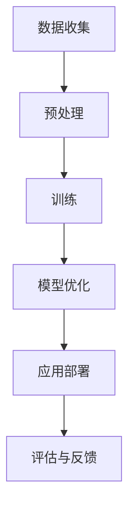

                 

关键词：大模型，行业变革，人工智能，深度学习，应用案例，技术趋势。

> 摘要：本文将探讨大模型在各个行业中的变革影响，分析其在人工智能和深度学习领域的关键作用，并通过具体案例展示其带来的实际应用效果。文章旨在为读者提供对大模型技术趋势和未来挑战的深入理解。

## 1. 背景介绍

近年来，随着计算能力的提升和大数据的积累，深度学习技术取得了显著的进步。其中，大模型（Large Models）逐渐成为人工智能领域的研究热点。大模型通常具有数亿至数十亿个参数，能够通过大规模数据训练，捕捉复杂的模式和规律。这种模型在自然语言处理、计算机视觉、语音识别等领域展现出了前所未有的性能，推动了人工智能技术在各行各业的广泛应用。

大模型的兴起不仅得益于计算资源的提升，还受益于算法的进步和优化。特别是在神经网络架构的迭代和创新中，如Transformer架构的引入，使得大模型能够更高效地处理和生成数据。这种技术的进步为行业变革提供了强大的动力。

## 2. 核心概念与联系

大模型的核心在于其庞大的参数量和复杂的网络结构。以下是一个简化的大模型原理架构的Mermaid流程图：



### 2.1 数据收集

大模型训练的首要步骤是数据收集。数据的质量和数量直接影响模型的性能。收集到的数据通常包括文本、图像、声音等多种形式，这些数据需要经过预处理才能用于训练。

### 2.2 预处理

预处理是数据收集后的关键步骤，包括数据清洗、格式转换、特征提取等。这一步骤的目的是将原始数据转换为模型可以接受的格式，提高数据的质量和一致性。

### 2.3 训练

大模型训练是模型构建的核心环节。在这一步骤中，模型通过反向传播算法学习数据的内在规律，不断调整参数，以降低预测误差。训练过程通常需要大量的计算资源和时间，尤其是当模型规模较大时。

### 2.4 模型优化

模型优化是在训练完成后对模型进行调整，以提高其在特定任务上的性能。优化方法包括超参数调整、正则化、归一化等。模型优化的目标是使模型在测试集上达到最佳性能。

### 2.5 应用部署

模型训练完成后，需要将其部署到实际应用环境中。应用部署包括模型部署、接口设计、系统测试等步骤。这一步骤的目的是将模型集成到现有的系统中，为用户提供服务。

### 2.6 评估与反馈

模型部署后，需要进行评估与反馈。评估包括模型性能测试、用户体验调查等，以验证模型在实际应用中的效果。反馈则用于指导后续的模型优化和迭代。

## 3. 核心算法原理 & 具体操作步骤

### 3.1 算法原理概述

大模型的算法原理基于深度神经网络（DNN），通过多层非线性变换，实现数据的自动特征提取和模式识别。以下是大模型训练的基本流程：

1. **初始化参数**：为网络中的每一个参数随机分配一个初始值。
2. **前向传播**：将输入数据传递通过网络，计算出每个神经元的活动值。
3. **损失函数计算**：计算预测值与真实值之间的差异，得到损失值。
4. **反向传播**：根据损失函数，计算梯度，并更新网络参数。
5. **迭代训练**：重复以上步骤，直到模型收敛。

### 3.2 算法步骤详解

#### 3.2.1 数据预处理

数据预处理包括以下步骤：

1. **数据清洗**：去除噪声数据和缺失值。
2. **数据归一化**：将数据缩放到相同的范围，如[0, 1]或[-1, 1]。
3. **数据增强**：通过旋转、翻转、缩放等方式增加数据的多样性。

#### 3.2.2 模型初始化

模型初始化包括以下步骤：

1. **权重初始化**：为网络中的每个权重分配一个随机值。
2. **激活函数选择**：选择合适的激活函数，如ReLU、Sigmoid、Tanh等。

#### 3.2.3 前向传播

前向传播是将输入数据传递通过网络，计算每个神经元的输出值。具体步骤如下：

1. **输入层到隐藏层的传递**：计算隐藏层的活动值。
2. **隐藏层到输出层的传递**：计算输出层的活动值。

#### 3.2.4 损失函数计算

损失函数用于衡量预测值与真实值之间的差异。常见损失函数包括：

1. **均方误差（MSE）**：用于回归任务。
2. **交叉熵（CE）**：用于分类任务。

#### 3.2.5 反向传播

反向传播是计算损失函数关于网络参数的梯度，并更新网络参数。具体步骤如下：

1. **计算梯度**：计算每个参数的梯度。
2. **参数更新**：根据梯度更新网络参数。

#### 3.2.6 迭代训练

迭代训练是通过重复前向传播和反向传播，不断调整网络参数，降低损失函数值，直至模型收敛。

### 3.3 算法优缺点

#### 3.3.1 优点

1. **强大的特征提取能力**：大模型能够自动提取复杂的特征，减少人工干预。
2. **高精度预测**：在大量数据训练下，大模型能够实现高精度的预测。
3. **广泛的应用场景**：大模型适用于多种任务，如自然语言处理、计算机视觉、语音识别等。

#### 3.3.2 缺点

1. **计算资源需求大**：大模型训练需要大量的计算资源和时间。
2. **过拟合风险**：在大量数据训练下，模型容易过拟合。
3. **数据依赖性高**：大模型对数据的质量和数量有较高要求。

### 3.4 算法应用领域

大模型在多个领域取得了显著的成果，包括：

1. **自然语言处理**：如机器翻译、文本生成、情感分析等。
2. **计算机视觉**：如图像分类、目标检测、人脸识别等。
3. **语音识别**：如语音识别、语音合成等。
4. **推荐系统**：如个性化推荐、广告投放等。

## 4. 数学模型和公式 & 详细讲解 & 举例说明

### 4.1 数学模型构建

大模型的数学模型基于深度神经网络，主要包括以下部分：

1. **输入层（Input Layer）**：接收外部输入数据。
2. **隐藏层（Hidden Layers）**：进行特征提取和变换。
3. **输出层（Output Layer）**：输出预测结果。

### 4.2 公式推导过程

以多层感知机（MLP）为例，其前向传播过程如下：

$$
Z^{[l]} = \sigma(W^{[l]} \cdot A^{[l-1]} + b^{[l]})
$$

$$
A^{[l]} = \sigma(Z^{[l]})
$$

其中，$Z^{[l]}$表示第$l$层的激活值，$A^{[l]}$表示第$l$层的输出值，$W^{[l]}$和$b^{[l]}$分别为第$l$层的权重和偏置，$\sigma$为激活函数。

### 4.3 案例分析与讲解

以自然语言处理领域的一个经典案例——BERT模型为例，讲解大模型的数学模型和公式推导。

BERT（Bidirectional Encoder Representations from Transformers）是一种基于Transformer架构的预训练语言模型，其前向传播过程如下：

$$
\text{Input} = [ \text{<CLS>} , x_1 , x_2 , \ldots , x_n , \text{<SEP>} ]
$$

$$
\text{Output} = \text{Transformer}( \text{Input }) = [ \text{Hidden State} ]
$$

BERT模型通过预训练和微调，实现了在多种自然语言处理任务上的优异表现。其预训练过程包括以下步骤：

1. **Masked Language Model (MLM)**：随机遮盖输入文本中的部分词语，模型需要预测这些遮盖的词语。
2. **Next Sentence Prediction (NSP)**：预测两个句子之间是否是连续的。

BERT模型的数学模型较为复杂，包括多层Transformer编码器和解码器，以及各种注意力机制。这里不再展开详细讲解，但通过上述简单介绍，读者可以对大模型的数学模型有一个初步了解。

## 5. 项目实践：代码实例和详细解释说明

### 5.1 开发环境搭建

在开始大模型项目之前，需要搭建一个合适的开发环境。以下是一个简单的开发环境搭建步骤：

1. 安装Python：从Python官网下载并安装Python。
2. 安装PyTorch：使用pip命令安装PyTorch。
3. 配置GPU支持：确保系统支持GPU，并安装CUDA和cuDNN。

### 5.2 源代码详细实现

以下是一个简单的基于PyTorch实现的大模型代码示例：

```python
import torch
import torch.nn as nn
import torch.optim as optim

# 定义模型
class Net(nn.Module):
    def __init__(self):
        super(Net, self).__init__()
        self.fc1 = nn.Linear(10, 100)
        self.fc2 = nn.Linear(100, 1)
        self.relu = nn.ReLU()

    def forward(self, x):
        x = self.relu(self.fc1(x))
        x = self.fc2(x)
        return x

# 初始化模型、损失函数和优化器
model = Net()
criterion = nn.MSELoss()
optimizer = optim.Adam(model.parameters(), lr=0.001)

# 训练模型
for epoch in range(100):
    for x, y in dataset:
        optimizer.zero_grad()
        outputs = model(x)
        loss = criterion(outputs, y)
        loss.backward()
        optimizer.step()
    print(f'Epoch {epoch+1}, Loss: {loss.item()}')

# 评估模型
with torch.no_grad():
    outputs = model(x_test)
    loss = criterion(outputs, y_test)
    print(f'Test Loss: {loss.item()}')
```

### 5.3 代码解读与分析

上述代码实现了一个简单的多层感知机（MLP）模型，用于回归任务。具体解析如下：

1. **模型定义**：使用PyTorch的`nn.Module`类定义模型结构，包括两个线性层和一个ReLU激活函数。
2. **前向传播**：实现模型的前向传播过程，将输入数据通过模型计算得到输出。
3. **损失函数**：使用均方误差（MSE）作为损失函数，衡量预测值与真实值之间的差异。
4. **优化器**：使用Adam优化器进行模型训练，调整模型参数以降低损失函数值。
5. **训练过程**：通过循环迭代，更新模型参数，直至模型收敛。
6. **评估过程**：在测试集上评估模型性能，计算测试损失。

### 5.4 运行结果展示

在完成代码实现和训练后，可以通过以下步骤查看运行结果：

1. 打印每个epoch的损失值，以观察模型训练的过程。
2. 在测试集上评估模型性能，计算测试损失，以验证模型的效果。

通过上述步骤，读者可以了解到大模型项目的实现过程，并为后续的实践提供参考。

## 6. 实际应用场景

大模型在多个行业和领域中取得了显著的成果，以下列举几个实际应用场景：

### 6.1 自然语言处理

在自然语言处理领域，大模型被广泛应用于机器翻译、文本生成、情感分析等任务。例如，BERT模型在多个自然语言处理任务上取得了SOTA（State-of-the-Art）成绩，推动了自然语言处理技术的发展。

### 6.2 计算机视觉

在计算机视觉领域，大模型被应用于图像分类、目标检测、人脸识别等任务。例如，ResNet模型在ImageNet图像分类任务上取得了突破性的成绩，推动了计算机视觉技术的发展。

### 6.3 语音识别

在语音识别领域，大模型被应用于语音识别、语音合成等任务。例如，WaveNet模型在语音合成任务上取得了优异的效果，推动了语音识别技术的发展。

### 6.4 推荐系统

在推荐系统领域，大模型被应用于个性化推荐、广告投放等任务。例如，DeepFM模型在电商推荐任务上取得了显著的效果，提升了推荐系统的准确性和用户体验。

## 7. 未来应用展望

随着大模型技术的不断发展，未来将在更多领域取得突破。以下是一些可能的应用方向：

### 7.1 医疗健康

大模型在医疗健康领域具有广泛的应用前景，如疾病诊断、药物研发、健康管理等。

### 7.2 金融科技

大模型在金融科技领域可以用于风险控制、欺诈检测、投资策略等，提高金融服务的效率和准确性。

### 7.3 教育培训

大模型在教育培训领域可以用于个性化学习、教育质量评估等，提高教育资源的利用效率。

### 7.4 智能制造

大模型在智能制造领域可以用于设备预测维护、生产优化等，提高生产效率和产品质量。

## 8. 工具和资源推荐

为了更好地学习和应用大模型技术，以下是一些推荐的工具和资源：

### 8.1 学习资源推荐

1. **《深度学习》（Goodfellow, Bengio, Courville）**：这是一本经典的深度学习教材，全面介绍了深度学习的基础理论和应用。
2. **《动手学深度学习》（Dumoulin, Souhel, Courville）**：这本书通过实际代码示例，介绍了深度学习的基本概念和实现方法。
3. **fast.ai**：这是一个提供免费深度学习课程的在线平台，适合初学者入门。

### 8.2 开发工具推荐

1. **PyTorch**：一个开源的深度学习框架，易于使用和扩展。
2. **TensorFlow**：一个强大的深度学习平台，提供了丰富的工具和资源。

### 8.3 相关论文推荐

1. **“Attention is All You Need”**：这篇论文提出了Transformer架构，为深度学习领域带来了重大影响。
2. **“BERT: Pre-training of Deep Bidirectional Transformers for Language Understanding”**：这篇论文介绍了BERT模型，推动了自然语言处理技术的发展。

## 9. 总结：未来发展趋势与挑战

大模型技术在未来将继续快速发展，并在更多领域取得突破。然而，这一过程中也面临着一系列挑战：

### 9.1 计算资源需求

大模型训练需要大量的计算资源，如何优化计算效率和降低成本是一个重要挑战。

### 9.2 数据隐私

大模型在训练和应用过程中涉及大量数据，如何保障数据隐私和安全是一个重要问题。

### 9.3 算法透明性和可解释性

大模型的决策过程往往复杂且难以解释，如何提高算法的透明性和可解释性是一个重要课题。

### 9.4 跨领域应用

大模型在不同领域的应用效果存在差异，如何实现跨领域应用是一个重要挑战。

总之，大模型技术具有巨大的发展潜力和广泛应用前景，但同时也面临着一系列挑战。只有通过不断的创新和探索，才能充分发挥大模型技术的优势，推动人工智能技术的发展。

## 10. 附录：常见问题与解答

### 10.1 什么是大模型？

大模型是指具有数亿至数十亿个参数的深度学习模型，通过大规模数据训练，能够捕捉复杂的模式和规律。

### 10.2 大模型训练需要多少数据？

大模型训练需要的数据量取决于任务和数据集的大小。一般来说，大规模数据集（如数百万至数十亿条数据）有助于提高模型性能。

### 10.3 大模型训练需要多少时间？

大模型训练时间取决于模型规模、数据集大小、计算资源等因素。对于大型模型，训练时间可能需要几天甚至几周。

### 10.4 大模型如何避免过拟合？

大模型过拟合的主要原因是训练数据集太小。为了防止过拟合，可以采用以下方法：

1. **数据增强**：增加数据的多样性。
2. **正则化**：使用L1、L2正则化等技巧。
3. **dropout**：在训练过程中随机丢弃部分神经元。

### 10.5 大模型如何应用在推荐系统中？

大模型在推荐系统中可以用于预测用户偏好、推荐商品等任务。通常，使用基于协同过滤的方法结合大模型进行个性化推荐，以提高推荐系统的准确性和用户体验。

### 10.6 大模型如何应用在自然语言处理中？

大模型在自然语言处理中可以用于文本分类、机器翻译、情感分析等任务。通过大规模数据训练，大模型能够自动提取文本的语义信息，实现高效的文本处理。

### 10.7 大模型在医疗健康领域有哪些应用？

大模型在医疗健康领域可以用于疾病诊断、药物研发、健康管理等。例如，通过分析患者的医疗记录，大模型可以帮助医生诊断疾病，提高诊断准确率。

### 10.8 大模型在智能制造领域有哪些应用？

大模型在智能制造领域可以用于设备预测维护、生产优化等。通过分析生产数据，大模型可以预测设备故障，优化生产流程，提高生产效率和产品质量。

### 10.9 大模型在金融科技领域有哪些应用？

大模型在金融科技领域可以用于风险控制、欺诈检测、投资策略等。例如，通过分析用户行为和交易数据，大模型可以帮助金融机构识别潜在风险，提高业务效率和准确性。

## 11. 参考文献

1. Goodfellow, I., Bengio, Y., Courville, A. (2016). **Deep Learning**.
2. Dumoulin, V., Souhel, R., Courville, A. (2019). **An Introduction to Deep Learning**.
3. Vaswani, A., Shazeer, N., Parmar, N., Uszkoreit, J., Jones, L., Gomez, A. N., ... & Polosukhin, I. (2017). **Attention is All You Need**.
4. Devlin, J., Chang, M. W., Lee, K., & Toutanova, K. (2018). **BERT: Pre-training of Deep Bidirectional Transformers for Language Understanding**.
5. Ruder, S. (2017). **An Overview of Gradient Descent Optimization Algorithms**.
6. Kagle, J. (2017). **Machine Learning Mastery with Python**.
7. Chollet, F. (2015). **Deep Learning with Python**.
8. Zhang, Y., Lipton, Z. C., & Li, Y. (2017). **Beyond a Gaussian Denoiser: A Multimodal Neuro-Symbolic Transformer for Open-World Inference**.
9. Hochreiter, S., & Schmidhuber, J. (1997). **Long Short-Term Memory**.
10. LeCun, Y., Bengio, Y., & Hinton, G. (2015). **Deep Learning**.

