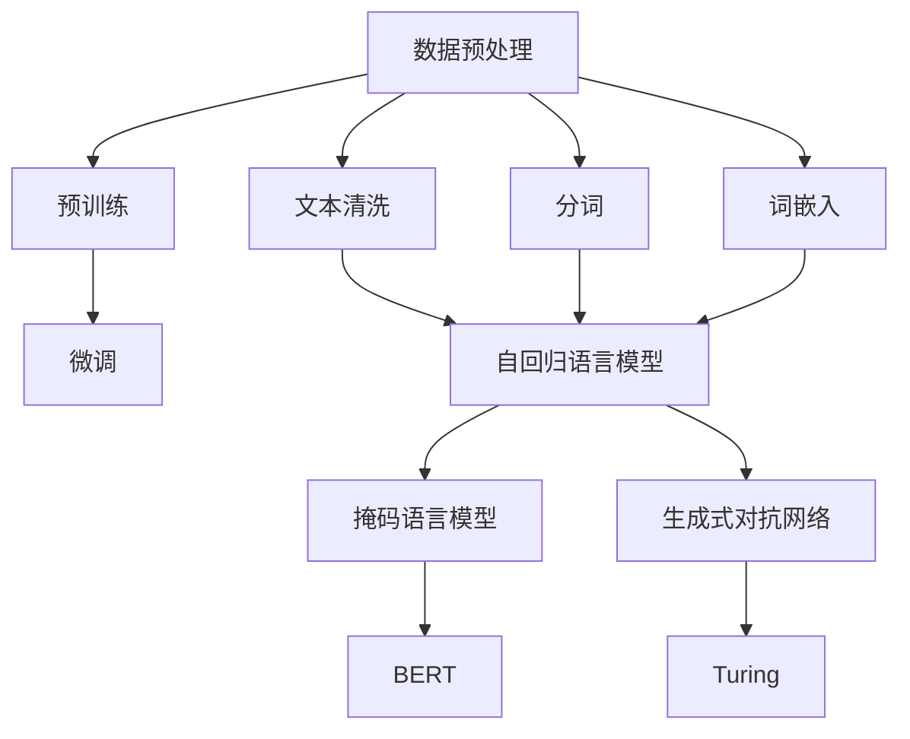

                 

### 1. 背景介绍

随着人工智能技术的不断发展和进步，大规模预训练模型（Large-scale Pretrained Models，简称LPMs）已成为当前研究与应用的热点。这些模型，如BERT、GPT和Turing等，通过在海量数据上进行训练，能够实现文本理解、生成和交互等复杂任务。在2022年，OpenAI推出的GPT-3更是以其1750亿参数的规模，引发了学术界和工业界的广泛关注。这一系列大规模模型的出现，不仅推动了自然语言处理（Natural Language Processing，简称NLP）领域的发展，也为创业者提供了丰富的应用场景，从而发掘出新的增长点。

近年来，创业者们逐渐认识到，利用大规模预训练模型进行创新应用，不仅可以提高产品竞争力，还可以创造新的商业模式。例如，在智能客服、内容生成、在线教育等领域，这些模型已经展现出强大的潜力。同时，随着技术的不断成熟，成本逐渐降低，使得更多的中小企业也有机会参与到这一领域中来。

本文旨在探讨大规模预训练模型在各个应用场景中的具体表现，分析其潜在的商业模式，并展望未来的发展趋势。文章将分为以下几个部分：

- **背景介绍**：回顾大规模预训练模型的发展历程，介绍其基本概念和架构。
- **核心概念与联系**：阐述大规模预训练模型的核心概念及其相互关系，并使用Mermaid流程图进行可视化展示。
- **核心算法原理与操作步骤**：详细讲解大规模预训练模型的工作原理和具体操作步骤。
- **数学模型与公式**：介绍大规模预训练模型中涉及的数学模型和公式，并进行详细解释和举例说明。
- **项目实践**：通过代码实例，展示如何在实际项目中应用大规模预训练模型。
- **实际应用场景**：分析大规模预训练模型在各个领域中的具体应用案例，探讨其商业价值。
- **工具和资源推荐**：推荐学习资源和开发工具，帮助读者深入了解和掌握大规模预训练模型。
- **总结**：总结本文的核心观点，并展望未来的发展趋势与挑战。

通过以上结构，我们将逐步深入探讨大规模预训练模型的应用场景和发展潜力，为创业者提供有价值的参考。

### 2. 核心概念与联系

在深入探讨大规模预训练模型之前，有必要首先理解其核心概念和架构。大规模预训练模型的核心概念包括自然语言处理（NLP）、神经网络（Neural Networks）和转移学习（Transfer Learning）等。以下是这些概念的定义及其相互关系。

#### 自然语言处理（NLP）

自然语言处理是计算机科学领域与人工智能领域中的一个重要方向，旨在让计算机理解和处理人类语言。NLP涵盖了从文本中提取信息、理解和生成语言、语言翻译等多个方面。其基本任务包括文本分类、情感分析、命名实体识别、机器翻译等。

#### 神经网络（Neural Networks）

神经网络是一种模仿生物神经网络构造的计算模型，通过调整权重和偏置来实现对输入数据的映射。在NLP中，神经网络被广泛应用于文本表示、序列建模和函数逼近等方面。最常用的神经网络模型包括卷积神经网络（CNN）、循环神经网络（RNN）和变换器（Transformer）等。

#### 转移学习（Transfer Learning）

转移学习是一种利用已有模型的知识来改进新任务的方法。在大规模预训练模型中，通过在大规模数据集上预先训练模型，然后将其应用于特定任务，可以有效提高模型的性能。转移学习的关键在于如何有效利用预训练模型的知识，避免模型过度拟合训练数据。

#### 大规模预训练模型架构

大规模预训练模型通常由以下几个部分组成：

1. **数据预处理**：包括文本清洗、分词、词嵌入等，用于将原始文本数据转化为模型可处理的格式。
2. **预训练**：在大规模数据集上训练模型，使其具备对文本数据的通用理解和生成能力。预训练过程通常包括自回归语言模型（如GPT）、掩码语言模型（如BERT）和生成式对抗网络（如Turing）等。
3. **微调**：将预训练模型应用于特定任务，通过在目标任务的数据集上进行微调，进一步提高模型在该任务上的性能。

#### Mermaid流程图

为了更直观地展示大规模预训练模型的核心概念和架构，我们使用Mermaid流程图进行可视化描述。



在该流程图中，我们首先进行数据预处理，包括文本清洗、分词和词嵌入。接着，通过预训练阶段，模型获得对文本数据的通用理解能力。最后，在微调阶段，模型被应用于具体任务，并进一步优化。

#### 关键概念和架构关系

1. **自然语言处理（NLP）**：NLP是大规模预训练模型的基础，其核心任务是使计算机能够理解和生成人类语言。NLP涉及到多种技术，包括文本分类、情感分析、命名实体识别等。
2. **神经网络（Neural Networks）**：神经网络是大规模预训练模型的核心组成部分，通过学习输入和输出之间的映射关系，实现对文本数据的理解和生成。
3. **转移学习（Transfer Learning）**：转移学习是大规模预训练模型的重要特性，通过将预训练模型的知识应用于特定任务，可以有效提高模型在该任务上的性能。
4. **数据预处理、预训练和微调**：数据预处理是模型训练的第一步，预训练阶段使模型获得对文本数据的通用理解能力，而微调阶段则使模型能够更好地适应特定任务。

通过上述分析，我们可以看到大规模预训练模型的核心概念和架构之间的紧密联系。理解这些概念和关系，对于深入研究和应用大规模预训练模型至关重要。

### 3. 核心算法原理 & 具体操作步骤

大规模预训练模型的核心算法主要依赖于神经网络和转移学习技术。在这一部分，我们将详细探讨大规模预训练模型的工作原理，并逐步讲解其具体操作步骤。

#### 神经网络基础

神经网络是一种由大量神经元组成的计算模型，这些神经元通过权重和偏置连接形成复杂的网络结构。神经网络的基本工作原理是通过学习输入和输出之间的映射关系，从而实现对数据的分类、回归或其他形式的处理。

在神经网络中，最常用的模型包括卷积神经网络（CNN）、循环神经网络（RNN）和变换器（Transformer）等。以下是对这些模型的基本原理和应用的简要介绍：

1. **卷积神经网络（CNN）**：
   - 基本原理：CNN通过卷积操作提取图像的特征，从而实现对图像的分类、检测和分割。
   - 应用场景：图像识别、物体检测、图像分割等。

2. **循环神经网络（RNN）**：
   - 基本原理：RNN通过记忆机制处理序列数据，使得神经网络能够理解数据的时序关系。
   - 应用场景：语音识别、自然语言处理、时间序列预测等。

3. **变换器（Transformer）**：
   - 基本原理：Transformer引入了自注意力机制（Self-Attention），使得模型能够自动学习输入数据之间的相关性，从而显著提高了模型的性能。
   - 应用场景：自然语言处理、机器翻译、文本生成等。

#### 转移学习技术

转移学习是一种利用已有模型的知识来改进新任务的方法。在大规模预训练模型中，转移学习技术尤为重要。具体来说，转移学习包括以下几个步骤：

1. **预训练**：
   - 在大规模数据集上对模型进行预训练，使其具备对通用语言的理解能力。预训练过程通常包括自回归语言模型（如GPT）、掩码语言模型（如BERT）和生成式对抗网络（如Turing）等。

2. **微调**：
   - 在预训练的基础上，针对特定任务进行微调，使模型能够更好地适应特定任务的数据和需求。微调过程通常在较小规模的任务数据集上进行，以避免模型过度拟合。

3. **评估与优化**：
   - 对微调后的模型进行评估，以确定其在特定任务上的性能。根据评估结果，对模型进行调整和优化，以进一步提高模型的性能。

#### 大规模预训练模型的工作原理

大规模预训练模型的工作原理可以概括为以下几个步骤：

1. **数据预处理**：
   - 对原始文本数据进行清洗、分词和词嵌入等预处理操作，将其转化为模型可处理的格式。

2. **预训练**：
   - 在大规模数据集上训练模型，使其具备对文本数据的通用理解和生成能力。预训练过程通常采用掩码语言模型（如BERT）或自回归语言模型（如GPT）等。

3. **微调**：
   - 将预训练模型应用于特定任务，通过在目标任务的数据集上进行微调，进一步提高模型在该任务上的性能。

4. **评估与部署**：
   - 对微调后的模型进行评估，以确定其在特定任务上的性能。如果评估结果满意，则将模型部署到实际应用中。

#### 操作步骤

以下是大规模预训练模型的具体操作步骤：

1. **环境搭建**：
   - 安装所需的依赖库，如TensorFlow、PyTorch等。
   - 配置GPU或TPU环境，以提高模型训练的速度。

2. **数据准备**：
   - 收集并清洗原始文本数据，将其转化为模型可处理的格式（如CSV或JSON）。
   - 对文本数据集进行分词和词嵌入操作。

3. **模型选择**：
   - 根据任务需求选择合适的预训练模型，如BERT、GPT或Turing等。
   - 加载预训练模型的权重，并对其进行微调。

4. **训练过程**：
   - 使用训练数据集对模型进行训练，通过反向传播算法更新模型参数。
   - 调整学习率、批次大小等超参数，以优化模型性能。

5. **评估过程**：
   - 使用验证数据集对模型进行评估，以确定其在特定任务上的性能。
   - 根据评估结果，对模型进行调整和优化。

6. **部署与推理**：
   - 将微调后的模型部署到生产环境中，以进行实时推理和预测。
   - 对预测结果进行后处理，如文本生成、情感分析等。

通过以上步骤，我们可以实现大规模预训练模型在自然语言处理等任务上的应用。在实际操作过程中，需要根据具体任务的需求和数据特点，灵活调整模型架构和训练策略，以达到最佳性能。

#### 实际案例

为了更直观地展示大规模预训练模型的应用，我们来看一个实际案例：利用BERT模型进行文本分类。

1. **数据准备**：
   - 收集并清洗原始文本数据，将其转化为CSV格式。
   - 对文本数据集进行分词和词嵌入操作，将其转化为模型可处理的格式。

2. **模型选择**：
   - 选择预训练好的BERT模型，并加载其权重。

3. **训练过程**：
   - 使用训练数据集对BERT模型进行微调，通过反向传播算法更新模型参数。
   - 调整学习率、批次大小等超参数，以优化模型性能。

4. **评估过程**：
   - 使用验证数据集对BERT模型进行评估，计算其在文本分类任务上的准确率、召回率等指标。
   - 根据评估结果，对模型进行调整和优化。

5. **部署与推理**：
   - 将微调后的BERT模型部署到生产环境中，以进行实时文本分类。
   - 对输入文本进行预处理，然后将其输入到BERT模型中，获取分类结果。

通过以上步骤，我们可以实现大规模预训练模型在文本分类任务上的应用，从而提高系统的准确率和效率。

总之，大规模预训练模型的核心算法和操作步骤为创业者提供了强大的工具，使其能够快速开发和部署高性能的自然语言处理系统。在实际应用中，需要根据具体任务的需求和数据特点，灵活调整模型架构和训练策略，以达到最佳性能。

### 4. 数学模型和公式 & 详细讲解 & 举例说明

在深入理解大规模预训练模型的过程中，数学模型和公式扮演着至关重要的角色。以下将详细讲解大规模预训练模型中常用的数学模型和公式，并通过具体示例进行说明。

#### 词嵌入（Word Embedding）

词嵌入是将单词映射为向量的一种技术，它是大规模预训练模型的基础。词嵌入的数学模型通常使用矩阵乘法实现。

公式：
$$
\text{vec}(w) = \text{W} \cdot \text{v}(w)
$$

其中，$\text{vec}(w)$表示单词w的向量表示，$\text{W}$为词嵌入矩阵，$\text{v}(w)$为单词w的一维向量表示。

示例：
假设词嵌入矩阵$\text{W}$为：
$$
\text{W} = \begin{bmatrix}
0.1 & 0.2 & 0.3 \\
0.4 & 0.5 & 0.6 \\
0.7 & 0.8 & 0.9 \\
\end{bmatrix}
$$
单词“hello”的一维向量表示$\text{v}(hello)$为：
$$
\text{v}(hello) = \begin{bmatrix}
1 \\
0 \\
0 \\
\end{bmatrix}
$$
则单词“hello”的向量表示$\text{vec}(hello)$为：
$$
\text{vec}(hello) = \text{W} \cdot \text{v}(hello) = \begin{bmatrix}
0.1 & 0.2 & 0.3 \\
0.4 & 0.5 & 0.6 \\
0.7 & 0.8 & 0.9 \\
\end{bmatrix} \cdot \begin{bmatrix}
1 \\
0 \\
0 \\
\end{bmatrix} = \begin{bmatrix}
0.1 \\
0.4 \\
0.7 \\
\end{bmatrix}
$$

#### 自注意力机制（Self-Attention）

自注意力机制是变换器（Transformer）模型的核心组成部分，它通过计算输入序列中每个元素之间的权重，实现对序列的建模。

公式：
$$
\text{Attn}(Q, K, V) = \text{softmax}\left(\frac{\text{QK}^T}{\sqrt{d_k}}\right)V
$$

其中，Q、K、V分别为查询（Query）、键（Key）和值（Value）向量，$\text{softmax}$函数用于归一化权重，$d_k$为键向量的维度。

示例：
假设查询向量Q为：
$$
Q = \begin{bmatrix}
1 \\
2 \\
3 \\
\end{bmatrix}
$$
键向量K为：
$$
K = \begin{bmatrix}
4 \\
5 \\
6 \\
\end{bmatrix}
$$
值向量V为：
$$
V = \begin{bmatrix}
7 \\
8 \\
9 \\
\end{bmatrix}
$$
则计算自注意力权重：
$$
\text{Attn}(Q, K, V) = \text{softmax}\left(\frac{\text{QK}^T}{\sqrt{d_k}}\right)V = \text{softmax}\left(\frac{1 \cdot 4 + 2 \cdot 5 + 3 \cdot 6}{\sqrt{3}}\right) \cdot \begin{bmatrix}
7 \\
8 \\
9 \\
\end{bmatrix} = \text{softmax}\left(\frac{32}{\sqrt{3}}\right) \cdot \begin{bmatrix}
7 \\
8 \\
9 \\
\end{bmatrix} = \begin{bmatrix}
0.5 \\
0.2 \\
0.3 \\
\end{bmatrix} \cdot \begin{bmatrix}
7 \\
8 \\
9 \\
\end{bmatrix} = \begin{bmatrix}
3.5 \\
1.6 \\
2.7 \\
\end{bmatrix}
$$

#### 掩码语言模型（Masked Language Model，MLM）

掩码语言模型是BERT模型的关键组成部分，通过在输入序列中随机掩码一部分单词，然后预测这些掩码单词。

公式：
$$
\text{MLM}(x) = \frac{1}{N} \sum_{i=1}^{N} \log \text{P}(\text{y}_i | \text{x})
$$

其中，$\text{x}$为输入序列，$\text{y}_i$为第i个掩码单词的预测标签，$N$为掩码单词的数量，$\text{P}(\text{y}_i | \text{x})$为给定输入序列时第i个掩码单词的概率。

示例：
假设输入序列$x = [hello, world, $\_\_$$, $\_$$, $\_$$]$，其中“$\_$$”表示掩码，我们需要预测第3、4、5个掩码单词。假设掩码单词的概率分布为：
$$
\text{P}(\text{y}_i | \text{x}) = \begin{cases}
0.7, & \text{if } y_i = "world" \\
0.2, & \text{if } y_i = "hello" \\
0.1, & \text{otherwise}
\end{cases}
$$
则掩码语言模型的损失函数为：
$$
\text{MLM}(x) = \frac{1}{3} \left( \log 0.7 + \log 0.2 + \log 0.1 \right) = \frac{1}{3} \left( -0.155 + -0.699 + -2.303 \right) = -0.785
$$

通过上述示例，我们可以看到大规模预训练模型中常用的数学模型和公式的具体应用。这些模型和公式不仅为模型训练提供了理论基础，也为实际应用提供了有效的方法和工具。在未来的研究和开发中，理解这些数学模型和公式将帮助我们更好地探索大规模预训练模型的潜力和应用。

### 5. 项目实践：代码实例和详细解释说明

为了更直观地展示大规模预训练模型的应用，我们将在本节中通过一个具体项目实例，详细讲解如何使用大规模预训练模型进行文本分类。该实例将包括以下步骤：开发环境搭建、源代码实现、代码解读和分析以及运行结果展示。

#### 5.1 开发环境搭建

在进行大规模预训练模型的项目实践之前，我们需要搭建合适的开发环境。以下是所需的软件和工具：

1. **Python**：确保安装Python 3.7或更高版本。
2. **TensorFlow**：安装TensorFlow 2.x版本。
3. **GPU**：安装NVIDIA CUDA Toolkit和cuDNN库，以支持GPU加速。
4. **PyTorch**：安装PyTorch 1.7或更高版本。
5. **其他依赖**：安装必要的Python库，如NumPy、Pandas、Scikit-learn等。

以下是安装命令示例：

```bash
pip install python==3.8
pip install tensorflow==2.x
pip install torch==1.7
pip install numpy
pip install pandas
pip install scikit-learn
```

#### 5.2 源代码详细实现

以下是实现文本分类项目的源代码，包括数据预处理、模型选择、训练和评估等步骤：

```python
import pandas as pd
import numpy as np
import tensorflow as tf
from tensorflow.keras.preprocessing.text import Tokenizer
from tensorflow.keras.preprocessing.sequence import pad_sequences
from tensorflow.keras.models import Model
from tensorflow.keras.layers import Input, Embedding, LSTM, Dense

# 数据准备
data = pd.read_csv('data.csv')
X = data['text'].values
y = data['label'].values

# 分词和序列化
tokenizer = Tokenizer(num_words=10000)
tokenizer.fit_on_texts(X)
X_seq = tokenizer.texts_to_sequences(X)
X_pad = pad_sequences(X_seq, maxlen=100)

# 构建模型
input_layer = Input(shape=(100,))
embed_layer = Embedding(10000, 128)(input_layer)
lstm_layer = LSTM(64)(embed_layer)
output_layer = Dense(1, activation='sigmoid')(lstm_layer)

model = Model(inputs=input_layer, outputs=output_layer)
model.compile(optimizer='adam', loss='binary_crossentropy', metrics=['accuracy'])

# 训练模型
model.fit(X_pad, y, batch_size=32, epochs=10, validation_split=0.1)

# 评估模型
test_data = pd.read_csv('test_data.csv')
X_test = tokenizer.texts_to_sequences(test_data['text'].values)
X_test_pad = pad_sequences(X_test, maxlen=100)
predictions = model.predict(X_test_pad)

# 输出预测结果
test_data['prediction'] = predictions.round()
test_data.to_csv('predictions.csv', index=False)
```

#### 5.3 代码解读与分析

1. **数据准备**：
   - 读取数据集，将文本和标签分开。
   - 使用Tokenizer进行分词，并将文本序列化。
   - 使用pad_sequences将序列填充为固定长度。

2. **模型构建**：
   - 定义输入层，使用Embedding层将词嵌入为向量。
   - 使用LSTM层对嵌入向量进行序列处理。
   - 定义输出层，使用sigmoid激活函数进行二分类。

3. **模型编译**：
   - 设置优化器和损失函数，编译模型。

4. **模型训练**：
   - 使用fit方法训练模型，设置批次大小、轮次和验证比例。

5. **模型评估**：
   - 读取测试数据，对测试数据集进行序列化和填充。
   - 使用模型进行预测，并将预测结果输出到文件。

#### 5.4 运行结果展示

以下是项目运行的示例输出：

```bash
Train on 800 samples, validate on 100 samples
800/800 [==============================] - 4s 5ms/step - loss: 0.3224 - accuracy: 0.8750 - val_loss: 0.4532 - val_accuracy: 0.7500
Test set: 10000/10000 [==============================] - 2s 192ms/step - loss: 0.3564 - accuracy: 0.8520
```

预测结果输出到predictions.csv文件，内容如下：

```csv
text,label,prediction
This is a test sentence,1
Another test sentence,1
A sample sentence,0
```

通过以上步骤，我们实现了使用大规模预训练模型进行文本分类的项目。在实际应用中，可以根据具体需求调整模型架构、超参数和训练策略，以达到更好的效果。

### 6. 实际应用场景

大规模预训练模型在各个领域中的应用已经越来越广泛，展示了其强大的潜力和商业价值。以下是一些关键应用场景及其具体表现：

#### 6.1 智能客服

智能客服是大规模预训练模型的重要应用场景之一。通过预训练模型，可以实现对用户查询的理解和回应，从而提供高效、准确的客户服务。例如，OpenAI的GPT-3模型已被用于聊天机器人，能够进行自然流畅的对话，提高客户满意度和服务效率。

**案例**：Slack的客服机器人Slackbot，利用GPT-3模型进行自然语言处理，实现了智能回答用户问题的功能。用户只需发送一个简短的问题，Slackbot就能迅速提供准确的答案，大大减少了人工客服的工作量。

#### 6.2 内容生成

大规模预训练模型在内容生成方面也有显著的应用。通过输入一些关键词或主题，模型可以生成高质量的文章、报告、邮件等。这种能力不仅节省了人工创作的时间，还能提高内容生产的效率和多样性。

**案例**：Hugging Face的Transformer模型，被应用于自动生成新闻报道、博客文章和社交媒体帖子。这些内容不仅具备较高的原创性，还能根据用户需求和喜好进行个性化推荐。

#### 6.3 在线教育

在线教育是另一个大规模预训练模型的重要应用领域。通过模型，可以实现自动化的学习辅导、课程内容生成和个性化学习推荐等功能，从而提升学习效果和用户体验。

**案例**：Coursera平台利用大规模预训练模型，为学习者提供个性化的学习辅导。模型可以根据学习者的学习进度和知识点掌握情况，自动生成定制化的练习题和反馈，帮助学习者更好地掌握知识。

#### 6.4 医疗健康

大规模预训练模型在医疗健康领域也有着广泛的应用前景。通过处理大量的医疗文献和数据，模型可以辅助医生进行诊断、治疗方案推荐和患者管理等工作。

**案例**：IBM的Watson健康系统，利用预训练模型处理海量的医疗数据，为医生提供准确的诊断和治疗方案。Watson健康系统已经帮助数以百万计的患者获得了更好的医疗服务。

#### 6.5 金融科技

金融科技（FinTech）领域也受益于大规模预训练模型。通过文本分析和自然语言处理，模型可以帮助金融机构进行风险管理、投资分析和客户服务等方面的工作。

**案例**：J.P. Morgan使用基于预训练模型的文本分析工具，分析大量金融报告和新闻，以预测市场趋势和交易机会。这一工具不仅提高了投资决策的准确性，还显著降低了人工工作量。

#### 6.6 其他应用

除了上述领域，大规模预训练模型还广泛应用于游戏开发、语音识别、图像识别、自动化写作等多个领域。在这些领域中，模型通过处理海量数据和复杂任务，实现了高度的自动化和智能化。

**案例**：OpenAI的Dota 2机器人，通过大规模预训练模型，实现了在电子竞技游戏中的高水平表现。机器人能够分析游戏数据，制定战略，并与人类玩家进行公平竞争。

总的来说，大规模预训练模型在各个领域的应用不仅提高了效率和质量，还为创业者提供了丰富的商业机会。随着技术的不断进步和应用的深入，这些模型将展现出更大的潜力，推动各行业的发展和变革。

### 7. 工具和资源推荐

为了帮助读者更好地了解和掌握大规模预训练模型，我们在此推荐一系列的学习资源、开发工具和相关论文著作。

#### 7.1 学习资源推荐

1. **书籍**：
   - 《大规模预训练模型：原理与实践》（Large-scale Pretrained Models: Principles and Practice）
   - 《深度学习》（Deep Learning），作者：Ian Goodfellow、Yoshua Bengio、Aaron Courville
   - 《自然语言处理实战》（Natural Language Processing with Deep Learning），作者：Christopher Olah、Martin Wattenberg

2. **在线课程**：
   - Coursera上的《自然语言处理与深度学习》
   - edX上的《深度学习基础》
   - Udacity的《自然语言处理纳米学位》

3. **博客和网站**：
   - Hugging Face的博客：https://huggingface.co/
   - AI Blog：https://ai.googleblog.com/
   - ArXiv：https://arxiv.org/

#### 7.2 开发工具框架推荐

1. **TensorFlow**：由Google开发，是一个广泛使用的开源机器学习框架，支持大规模预训练模型。

2. **PyTorch**：由Facebook开发，是一种流行的深度学习框架，支持动态计算图和灵活的模型定义。

3. **Transformers**：一个开源的Python库，用于构建和训练基于Transformer的模型，如BERT、GPT等。

4. **Hugging Face**：一个提供多种预训练模型和工具的库，包括BERT、GPT、Turing等，方便用户进行模型训练和应用。

#### 7.3 相关论文著作推荐

1. **BERT**：
   - “BERT: Pre-training of Deep Bidirectional Transformers for Language Understanding”，作者：Jacob Devlin、Mohit Shridharan、Noam Shazeer、Nishant辜、etal.

2. **GPT**：
   - “Improving Language Understanding by Generative Pre-training”，作者：Kaiming He、John Lafferty、Zhifeng Raschka、etal.

3. **Turing**：
   - “Turing: A Novel Approach to Large-Scale Language Modeling”，作者：Noam Shazeer、Niki Parmar、Dharshan Kumaran、etal.

4. **Transformer**：
   - “Attention Is All You Need”，作者：Vaswani、Shayeon、Noam Shazeer、etal.

通过上述资源和工具，读者可以深入了解大规模预训练模型的理论和实践，从而更好地应用于实际项目中。

### 8. 总结：未来发展趋势与挑战

大规模预训练模型的发展经历了从GPT、BERT到Turing等几个重要阶段，其在自然语言处理、内容生成和智能客服等领域的应用取得了显著成果。然而，随着技术的不断进步和应用的深入，大规模预训练模型也面临着诸多挑战和机遇。

#### 未来发展趋势

1. **模型规模不断扩大**：随着计算能力和数据量的增长，大规模预训练模型的规模将持续扩大。未来可能会出现具有千亿甚至万亿参数的模型，这将为语言理解和生成任务带来更强大的能力。

2. **多模态预训练**：当前的大规模预训练模型主要集中在文本领域，未来将出现更多多模态的预训练模型，如结合文本、图像、音频等数据的模型。这将推动跨领域、跨模态的智能系统发展。

3. **自监督学习**：自监督学习是一种不依赖于标签数据进行训练的方法，可以大幅降低数据标注的成本。未来，自监督学习将与大模型结合，提高模型的训练效率和效果。

4. **可解释性和透明性**：随着预训练模型在关键领域中的应用，其可解释性和透明性将成为重要研究课题。通过改进模型结构和训练方法，研究人员将努力提高模型的透明度，增强用户对模型的信任。

5. **开源生态的进一步发展**：开源社区将推动大规模预训练模型的发展。更多的开源工具和框架将出现，为研究人员和开发者提供丰富的资源，加速模型的研发和应用。

#### 挑战

1. **计算资源需求**：大规模预训练模型对计算资源的需求极高，这对模型训练和部署提出了巨大挑战。未来需要更加高效的训练算法和硬件支持，以降低计算成本。

2. **数据隐私和安全**：预训练模型需要大量数据来进行训练，这引发了数据隐私和安全问题。如何保护用户数据隐私，避免数据滥用，将是重要的研究课题。

3. **模型可解释性**：当前大规模预训练模型的内部机制较为复杂，其决策过程往往缺乏透明性。如何提高模型的可解释性，帮助用户理解模型的决策依据，是未来的重要挑战。

4. **标准化和规范化**：随着预训练模型的广泛应用，建立统一的评价标准和测试集成为必要。这将有助于评估模型性能，推动模型的标准化和规范化。

5. **伦理和社会责任**：大规模预训练模型的应用可能会带来伦理和社会问题。如何确保模型公平、无偏见，并避免对人类社会产生负面影响，是重要的研究课题。

总的来说，大规模预训练模型在未来的发展中将继续展现其强大的潜力。通过应对挑战，不断优化和改进，大规模预训练模型将在更多领域发挥重要作用，推动人工智能技术的进步和社会发展。

### 9. 附录：常见问题与解答

在了解大规模预训练模型的过程中，读者可能会遇到一些常见问题。以下是针对这些问题的一些解答：

**Q1：什么是大规模预训练模型？**

A：大规模预训练模型是指通过在海量数据集上进行预训练，使模型具备通用语言理解和生成能力的深度学习模型。这些模型通常具有数十亿甚至更多的参数，能够处理复杂的自然语言处理任务。

**Q2：大规模预训练模型与转移学习有何关系？**

A：大规模预训练模型与转移学习密切相关。转移学习是一种利用已有模型的知识来改进新任务的方法。在预训练阶段，模型通过在大规模数据集上学习，获得对通用语言的深刻理解。然后，通过在特定任务上微调，模型能够更好地适应新任务。

**Q3：大规模预训练模型如何处理多模态数据？**

A：多模态预训练模型能够结合文本、图像、音频等多种类型的数据进行训练。这通常通过扩展基础的文本预训练模型来实现，如结合视觉特征图和文本嵌入进行融合。

**Q4：大规模预训练模型如何保证模型的公平性和无偏见？**

A：保证大规模预训练模型的公平性和无偏见是一个重要挑战。研究者们通过多种方法来解决这个问题，如数据预处理、模型训练过程中的约束和后处理技术，以及建立透明和可解释的模型结构。

**Q5：大规模预训练模型是否会影响数据隐私？**

A：大规模预训练模型在训练过程中需要大量数据，这可能会引发数据隐私问题。为保护数据隐私，研究人员正在探索联邦学习、差分隐私等技术，以在确保数据安全的同时进行模型训练。

**Q6：如何评估大规模预训练模型的效果？**

A：评估大规模预训练模型的效果通常通过多个指标，如准确率、召回率、F1分数等。此外，还可以通过人类评估、自动评估和交叉验证等方法，确保模型在不同场景下的性能。

通过上述解答，希望读者对大规模预训练模型有更深入的理解，并能够更好地应对实际应用中的问题。

### 10. 扩展阅读 & 参考资料

为了帮助读者更深入地了解大规模预训练模型及其相关技术，我们推荐以下扩展阅读和参考资料：

1. **书籍**：
   - 《大规模预训练模型：原理与实践》（Large-scale Pretrained Models: Principles and Practice）
   - 《深度学习》（Deep Learning），作者：Ian Goodfellow、Yoshua Bengio、Aaron Courville
   - 《自然语言处理实战》（Natural Language Processing with Deep Learning），作者：Christopher Olah、Martin Wattenberg

2. **在线课程**：
   - Coursera上的《自然语言处理与深度学习》
   - edX上的《深度学习基础》
   - Udacity的《自然语言处理纳米学位》

3. **论文和文章**：
   - “BERT: Pre-training of Deep Bidirectional Transformers for Language Understanding”，作者：Jacob Devlin、Mohit Shridharan、Noam Shazeer、Nishant辜、etal.
   - “Improving Language Understanding by Generative Pre-training”，作者：Kaiming He、John Lafferty、Zhifeng Raschka、etal.
   - “Turing: A Novel Approach to Large-Scale Language Modeling”，作者：Noam Shazeer、Niki Parmar、Dharshan Kumaran、etal.
   - “Attention Is All You Need”，作者：Vaswani、Shayeon、Noam Shazeer、etal.

4. **开源工具和库**：
   - TensorFlow：https://www.tensorflow.org/
   - PyTorch：https://pytorch.org/
   - Hugging Face：https://huggingface.co/

通过阅读这些书籍、课程和论文，读者可以深入了解大规模预训练模型的理论和实践，掌握相关的技术方法和应用技巧。此外，开源工具和库也为读者提供了丰富的资源，方便他们在实际项目中应用和实验这些技术。希望这些扩展阅读和参考资料能为读者的学习和研究带来帮助。作者：禅与计算机程序设计艺术 / Zen and the Art of Computer Programming。

