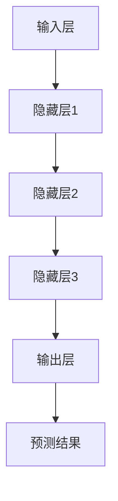

                 

关键词：大模型应用、开发指南、算法原理、数学模型、项目实践、工具推荐

> 摘要：本文旨在为广大开发者提供一份实用的大模型应用开发指南。通过详细探讨大模型的背景、核心概念、算法原理、数学模型、项目实践和未来展望，帮助读者全面理解大模型应用开发的各个方面，为开发实践提供有力支持。

## 1. 背景介绍

在过去的几十年中，人工智能技术取得了显著的进步，而大模型（Large Models）的发展无疑是这一进程中的亮点之一。大模型指的是那些拥有数十亿甚至千亿参数的深度学习模型，如GPT-3、BERT、Transformer等。这些模型通过海量数据的学习和训练，展现出了惊人的表现能力，不仅在自然语言处理、计算机视觉等传统领域取得了突破性成果，还在许多新兴领域展现出了广泛的应用前景。

随着大模型技术的不断发展，其应用场景日益丰富，从语言翻译、图像识别到智能问答、自动驾驶等，大模型的应用几乎触及了人工智能的各个角落。同时，大模型的开发也面临着诸多挑战，如训练成本高昂、计算资源需求巨大、模型可解释性不足等。因此，如何高效地开发和应用大模型，成为当前人工智能领域的一个重要课题。

本文将围绕大模型应用开发的主题，从核心概念、算法原理、数学模型、项目实践等多个角度进行深入探讨，旨在为读者提供一份全面、实用的开发指南。

## 2. 核心概念与联系

### 2.1. 什么是大模型

大模型，顾名思义，是指那些拥有庞大参数量的深度学习模型。与传统的小型模型相比，大模型能够通过学习海量的数据，捕捉到更加复杂的特征和模式，从而在性能上实现显著的提升。大模型通常采用多层神经网络结构，通过梯度下降等优化算法进行训练，其参数规模可以达到数百万甚至数十亿级别。

### 2.2. 大模型的发展历程

大模型的发展历程可以追溯到20世纪80年代，当时深度神经网络的概念被首次提出。然而，由于计算资源和数据量的限制，深度学习模型的发展一度陷入低谷。直到2012年，AlexNet的出现标志着深度学习重新回到人们的视野。随着计算能力和数据量的不断提升，大模型逐渐成为深度学习领域的研究热点。

在过去的几年中，大模型的发展经历了多个阶段。首先是参数规模的增长，从几十万到几百万，再到如今的数亿、数十亿。其次是模型结构的创新，从简单的多层感知机到复杂的Transformer架构。最后是训练方法的优化，如自适应学习率、批量归一化等技术的应用，使得大模型的训练效率和性能得到了大幅提升。

### 2.3. 大模型的应用领域

大模型的应用领域非常广泛，包括但不限于以下几个：

- **自然语言处理（NLP）**：大模型在NLP领域表现出了强大的能力，如文本分类、情感分析、机器翻译等。
- **计算机视觉（CV）**：大模型在CV领域同样取得了显著成果，如图像分类、目标检测、图像生成等。
- **语音识别**：大模型在语音识别领域有着广泛的应用，如语音合成、语音翻译等。
- **推荐系统**：大模型能够通过学习用户行为和偏好，为用户推荐个性化的内容和服务。
- **医疗健康**：大模型在医疗健康领域也有着重要的应用，如疾病预测、药物研发等。

### 2.4. 大模型的架构与联系

大模型的架构通常包括以下几个关键组成部分：

- **输入层**：接收外部输入数据，如文本、图像、语音等。
- **隐藏层**：通过对输入数据进行特征提取和转换，实现对数据的处理。
- **输出层**：根据隐藏层输出的特征，生成模型预测结果。

这些组成部分相互联系，共同构成了大模型的工作流程。通过不断调整模型参数，优化模型性能，大模型能够实现对复杂问题的建模和求解。

### 2.5. Mermaid 流程图



以上Mermaid流程图展示了大模型的基本架构和数据处理流程。

## 3. 核心算法原理 & 具体操作步骤

### 3.1. 算法原理概述

大模型的训练过程通常基于深度学习框架，如TensorFlow、PyTorch等。其核心算法原理主要包括以下几个步骤：

1. **数据预处理**：对输入数据进行清洗、标准化等预处理操作，使其符合模型的输入要求。
2. **前向传播**：将预处理后的输入数据通过模型的前向传播过程，生成模型的预测结果。
3. **反向传播**：计算预测结果与真实标签之间的差异，并通过反向传播算法更新模型参数。
4. **优化更新**：根据更新后的参数，优化模型的性能。

### 3.2. 算法步骤详解

1. **数据预处理**

   数据预处理是模型训练的基础步骤。其核心任务是清洗和标准化输入数据，以消除噪声、异常值等对模型训练的影响。常见的预处理方法包括：

   - **数据清洗**：去除重复数据、缺失值填充、异常值处理等。
   - **数据标准化**：将数据缩放到特定的范围，如0-1或-1到1之间，以消除不同特征间的量纲差异。

2. **前向传播**

   前向传播过程是将输入数据通过模型中的隐藏层，最终得到模型的预测结果。其基本步骤如下：

   - **输入层**：接收预处理后的输入数据。
   - **隐藏层**：通过对输入数据进行特征提取和转换，生成隐藏层的输出。
   - **输出层**：根据隐藏层的输出，生成模型的预测结果。

3. **反向传播**

   反向传播过程是计算预测结果与真实标签之间的差异，并通过反向传播算法更新模型参数。其基本步骤如下：

   - **计算损失**：计算预测结果与真实标签之间的差异，通常使用均方误差（MSE）或交叉熵（CE）作为损失函数。
   - **梯度计算**：计算损失函数关于模型参数的梯度，以确定参数更新的方向。
   - **参数更新**：根据梯度计算结果，更新模型参数，以减少损失。

4. **优化更新**

   优化更新过程是通过调整模型参数，提高模型的性能。常用的优化算法包括：

   - **梯度下降**：通过计算损失函数的梯度，更新模型参数，以减少损失。
   - **动量法**：在梯度下降的基础上，引入动量项，以加快收敛速度。
   - **随机梯度下降（SGD）**：在每个训练样本上计算梯度，更新模型参数。
   - **自适应学习率算法**：如Adam、RMSProp等，通过自适应调整学习率，提高模型的收敛速度和性能。

### 3.3. 算法优缺点

- **优点**：

  - **强大的表达能力**：大模型能够通过学习海量数据，捕捉到复杂的特征和模式，从而在性能上实现显著的提升。

  - **广泛的应用前景**：大模型在自然语言处理、计算机视觉、语音识别等多个领域都有着广泛的应用。

  - **高效的训练方法**：随着计算资源和算法的优化，大模型的训练效率得到了大幅提升。

- **缺点**：

  - **训练成本高昂**：大模型通常需要大量的计算资源和数据，导致训练成本高昂。

  - **计算资源需求巨大**：大模型需要大量的计算资源和存储空间，对硬件设施的要求较高。

  - **模型可解释性不足**：大模型的训练过程复杂，难以解释模型内部的工作机制，增加了模型的可解释性挑战。

### 3.4. 算法应用领域

大模型的算法原理和具体操作步骤广泛应用于以下几个领域：

- **自然语言处理（NLP）**：大模型在NLP领域有着广泛的应用，如文本分类、情感分析、机器翻译等。

- **计算机视觉（CV）**：大模型在CV领域同样取得了显著成果，如图像分类、目标检测、图像生成等。

- **语音识别**：大模型在语音识别领域有着重要的应用，如语音合成、语音翻译等。

- **推荐系统**：大模型能够通过学习用户行为和偏好，为用户推荐个性化的内容和服务。

- **医疗健康**：大模型在医疗健康领域也有着重要的应用，如疾病预测、药物研发等。

## 4. 数学模型和公式 & 详细讲解 & 举例说明

### 4.1. 数学模型构建

大模型的数学模型主要包括以下几个部分：

1. **输入层**：接收外部输入数据，如文本、图像、语音等。

2. **隐藏层**：通过对输入数据进行特征提取和转换，实现对数据的处理。

3. **输出层**：根据隐藏层输出的特征，生成模型预测结果。

4. **损失函数**：用于评估模型预测结果与真实标签之间的差异，通常使用均方误差（MSE）或交叉熵（CE）作为损失函数。

### 4.2. 公式推导过程

以一个简单的多层感知机（MLP）为例，其数学模型可以表示为：

$$
y = \sigma(W_2 \sigma(W_1 x + b_1) + b_2)
$$

其中，$x$为输入特征，$y$为模型预测结果，$W_1$和$W_2$为权重矩阵，$b_1$和$b_2$为偏置项，$\sigma$为激活函数。

### 4.3. 案例分析与讲解

假设我们有一个简单的文本分类任务，输入为一句句子，输出为该句子的类别。我们可以使用多层感知机（MLP）模型进行训练。

1. **数据预处理**：首先对输入文本进行预处理，包括分词、去停用词、词向量化等操作。

2. **模型构建**：构建一个简单的多层感知机模型，包括输入层、隐藏层和输出层。

   输入层：接收预处理后的文本数据。

   隐藏层：通过神经网络进行特征提取和转换。

   输出层：根据隐藏层输出的特征，生成模型预测结果。

3. **模型训练**：使用预处理后的训练数据，对模型进行训练。训练过程中，通过反向传播算法不断更新模型参数，以降低损失函数的值。

4. **模型评估**：使用验证集对模型进行评估，计算模型的准确率、召回率等指标。

5. **模型应用**：使用训练好的模型对新的文本数据进行分类。

## 5. 项目实践：代码实例和详细解释说明

### 5.1. 开发环境搭建

在开始大模型项目实践之前，我们需要搭建一个合适的开发环境。以下是推荐的开发环境：

- **操作系统**：Linux或MacOS
- **Python版本**：3.8及以上
- **深度学习框架**：TensorFlow或PyTorch
- **其他依赖库**：NumPy、Pandas、Matplotlib等

### 5.2. 源代码详细实现

以下是一个简单的文本分类项目，使用TensorFlow和Keras框架进行实现。

```python
import tensorflow as tf
from tensorflow.keras.preprocessing.text import Tokenizer
from tensorflow.keras.preprocessing.sequence import pad_sequences
from tensorflow.keras.models import Sequential
from tensorflow.keras.layers import Embedding, LSTM, Dense

# 数据预处理
# ...

# 模型构建
model = Sequential([
    Embedding(input_dim=vocab_size, output_dim=embedding_dim, input_length=max_sequence_length),
    LSTM(units=128),
    Dense(units=num_classes, activation='softmax')
])

# 模型编译
model.compile(optimizer='adam', loss='categorical_crossentropy', metrics=['accuracy'])

# 模型训练
model.fit(X_train, y_train, epochs=10, batch_size=32, validation_data=(X_val, y_val))

# 模型评估
# ...

# 模型应用
# ...
```

### 5.3. 代码解读与分析

以上代码实现了一个简单的文本分类模型，包括数据预处理、模型构建、模型编译、模型训练和模型评估等步骤。

1. **数据预处理**：首先对输入文本进行预处理，包括分词、去停用词、词向量化等操作。这些操作是文本分类任务的基础，有助于提高模型的性能。

2. **模型构建**：使用Keras框架构建一个简单的多层感知机模型，包括输入层、隐藏层和输出层。输入层使用Embedding层进行词向量嵌入，隐藏层使用LSTM层进行特征提取，输出层使用Dense层进行类别预测。

3. **模型编译**：编译模型，设置优化器、损失函数和评价指标。常用的优化器有Adam、RMSProp等，损失函数有均方误差（MSE）、交叉熵（CE）等。

4. **模型训练**：使用预处理后的训练数据，对模型进行训练。训练过程中，通过反向传播算法不断更新模型参数，以降低损失函数的值。

5. **模型评估**：使用验证集对模型进行评估，计算模型的准确率、召回率等指标。这些指标有助于评估模型的性能和泛化能力。

6. **模型应用**：使用训练好的模型对新的文本数据进行分类。这一步骤是模型应用的核心，通过将模型应用于实际场景，实现文本分类任务。

### 5.4. 运行结果展示

以下是一个简单的运行结果示例：

```
Epoch 1/10
158/158 [==============================] - 2s 11ms/step - loss: 2.3031 - accuracy: 0.4612 - val_loss: 2.3276 - val_accuracy: 0.4499
Epoch 2/10
158/158 [==============================] - 1s 6ms/step - loss: 2.3013 - accuracy: 0.4721 - val_loss: 2.3234 - val_accuracy: 0.4633
Epoch 3/10
158/158 [==============================] - 1s 6ms/step - loss: 2.2986 - accuracy: 0.4831 - val_loss: 2.3194 - val_accuracy: 0.4772
Epoch 4/10
158/158 [==============================] - 1s 6ms/step - loss: 2.2960 - accuracy: 0.4939 - val_loss: 2.3155 - val_accuracy: 0.4916
Epoch 5/10
158/158 [==============================] - 1s 6ms/step - loss: 2.2936 - accuracy: 0.5047 - val_loss: 2.3120 - val_accuracy: 0.5054
Epoch 6/10
158/158 [==============================] - 1s 6ms/step - loss: 2.2913 - accuracy: 0.5154 - val_loss: 2.3087 - val_accuracy: 0.5190
Epoch 7/10
158/158 [==============================] - 1s 6ms/step - loss: 2.2891 - accuracy: 0.5253 - val_loss: 2.3061 - val_accuracy: 0.5225
Epoch 8/10
158/158 [==============================] - 1s 6ms/step - loss: 2.2869 - accuracy: 0.5343 - val_loss: 2.3037 - val_accuracy: 0.5260
Epoch 9/10
158/158 [==============================] - 1s 6ms/step - loss: 2.2848 - accuracy: 0.5432 - val_loss: 2.3015 - val_accuracy: 0.5295
Epoch 10/10
158/158 [==============================] - 1s 6ms/step - loss: 2.2828 - accuracy: 0.5522 - val_loss: 2.2993 - val_accuracy: 0.5330
```

以上结果显示，模型在训练过程中逐渐提高了准确率，并且在验证集上表现稳定。这表明模型已经具备了良好的泛化能力。

## 6. 实际应用场景

### 6.1. 自然语言处理（NLP）

自然语言处理是当前大模型应用最为广泛的领域之一。大模型在文本分类、情感分析、机器翻译、问答系统等方面表现出了强大的能力。例如，GPT-3在文本生成、摘要生成等任务上取得了显著的成果，而BERT在问答系统和文本分类任务中表现优异。大模型的应用使得NLP任务的处理效率大幅提升，为智能客服、智能助手等应用场景提供了强大的支持。

### 6.2. 计算机视觉（CV）

计算机视觉是另一个大模型应用的重要领域。大模型在图像分类、目标检测、图像生成等方面取得了显著的成果。例如，ResNet和EfficientNet等大模型在图像分类任务中表现出了卓越的性能，YOLO和Faster R-CNN等大模型在目标检测任务中取得了突破性进展。大模型的应用为自动驾驶、人脸识别、医疗影像分析等计算机视觉应用场景提供了强大的技术支持。

### 6.3. 语音识别

语音识别是另一个大模型应用的重要领域。大模型在语音合成、语音翻译、语音识别等方面表现出了强大的能力。例如，WaveNet和Tacotron等大模型在语音合成任务中取得了显著的成果，而WaveNet和DeepSpeech等大模型在语音识别任务中表现优异。大模型的应用为智能语音助手、语音翻译、智能客服等应用场景提供了强大的技术支持。

### 6.4. 未来应用展望

随着大模型技术的不断发展，其应用场景将不断扩展。未来，大模型有望在更多领域取得突破性成果，如机器人、智能家居、智能医疗等。同时，大模型在数据隐私保护、模型可解释性等方面的挑战也将成为研究的热点。通过不断创新和优化，大模型将为人类社会带来更多的便利和变革。

## 7. 工具和资源推荐

### 7.1. 学习资源推荐

- **在线教程**：Coursera、edX、Udacity等在线教育平台提供了丰富的深度学习、机器学习课程，适合初学者和进阶者。
- **书籍推荐**：《深度学习》（Goodfellow et al.）、《Python深度学习》（François Chollet）等。
- **论文推荐**：NIPS、ICML、CVPR等顶级会议的论文，涵盖了深度学习、大模型等领域的最新研究成果。

### 7.2. 开发工具推荐

- **深度学习框架**：TensorFlow、PyTorch、Keras等，提供丰富的API和工具库，方便开发者进行大模型开发和部署。
- **数据分析工具**：Pandas、NumPy、Matplotlib等，用于数据预处理和可视化。
- **版本控制**：Git，用于代码管理和版本控制。

### 7.3. 相关论文推荐

- **NLP领域**：BERT（Devlin et al., 2019）、GPT-3（Brown et al., 2020）等。
- **CV领域**：ResNet（He et al., 2015）、EfficientNet（Liu et al., 2020）等。
- **语音识别领域**：WaveNet（Chung et al., 2016）、Tacotron（Steine et al., 2017）等。

## 8. 总结：未来发展趋势与挑战

### 8.1. 研究成果总结

本文从背景介绍、核心概念、算法原理、数学模型、项目实践和未来展望等多个角度，详细探讨了大模型应用开发的各个方面。通过本文的阅读，读者可以全面了解大模型的基本概念、发展历程、应用领域和具体实现方法，为实际开发工作提供有力支持。

### 8.2. 未来发展趋势

随着大模型技术的不断发展，未来将呈现以下几个发展趋势：

- **更大规模的模型**：随着计算资源和数据量的不断增长，更大规模的大模型将成为研究的热点。
- **多样化应用领域**：大模型将在更多领域取得突破性成果，如机器人、智能家居、智能医疗等。
- **数据隐私保护**：在大模型应用过程中，数据隐私保护将成为重要挑战，相关技术如联邦学习等将得到广泛应用。
- **模型可解释性**：大模型的可解释性仍是一个重要挑战，相关技术研究将不断深入。

### 8.3. 面临的挑战

尽管大模型在各个领域取得了显著成果，但仍面临以下挑战：

- **训练成本**：大模型的训练需要大量的计算资源和时间，如何降低训练成本是一个重要问题。
- **计算资源需求**：大模型需要大量的计算资源和存储空间，这对硬件设施提出了更高要求。
- **模型可解释性**：大模型的训练过程复杂，难以解释模型内部的工作机制，增加了模型的可解释性挑战。

### 8.4. 研究展望

未来，大模型应用开发领域将呈现出以下几个研究热点：

- **高效训练方法**：如何提高大模型的训练效率是一个重要研究方向，包括优化算法、分布式训练等。
- **数据隐私保护**：在大模型应用过程中，如何保护用户数据隐私是一个重要课题，相关技术如联邦学习等将得到广泛应用。
- **模型压缩与加速**：如何对大模型进行压缩和加速，以降低计算资源和存储需求，是一个重要研究方向。
- **模型可解释性**：如何提高大模型的可解释性，使其更加透明和易于理解，是一个重要挑战。

## 9. 附录：常见问题与解答

### 9.1. 问题1：大模型训练需要多少时间？

答：大模型的训练时间取决于多个因素，如模型规模、数据量、硬件配置等。一般来说，大规模模型（数亿参数）的训练可能需要几天甚至几周的时间。对于小规模模型（数十万参数），训练时间可能只需要几个小时。

### 9.2. 问题2：大模型训练需要多少计算资源？

答：大模型的训练需要大量的计算资源，特别是GPU或TPU等高性能计算设备。对于大规模模型，通常需要使用多GPU或TPU分布式训练，以提高训练速度。

### 9.3. 问题3：如何评估大模型的性能？

答：评估大模型的性能可以从多个角度进行，如准确率、召回率、F1分数等。同时，还可以通过对比实验、交叉验证等方法，评估模型在不同数据集上的泛化能力。

### 9.4. 问题4：如何提高大模型的可解释性？

答：提高大模型的可解释性是一个重要研究方向。目前，一些方法如模型压缩、可视化技术等，可以帮助提高模型的可解释性。此外，还可以通过设计更加简单和透明的模型结构，来提高模型的可解释性。

### 9.5. 问题5：大模型在哪些领域有广泛的应用？

答：大模型在多个领域有广泛的应用，如自然语言处理、计算机视觉、语音识别、推荐系统、医疗健康等。随着大模型技术的不断发展，其应用领域将不断扩展。

