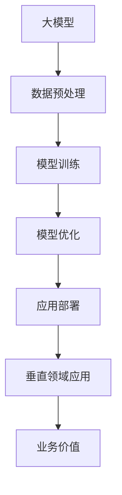

                 

### 1. 背景介绍

随着人工智能技术的迅猛发展，大模型（Large-scale Model）在自然语言处理（NLP）、计算机视觉（CV）、语音识别（ASR）等领域已经取得了显著的成果。大模型的引入不仅极大地提升了算法的准确性和效率，也为各类应用场景提供了强大的技术支持。然而，大模型的研究和应用不仅限于通用领域，其潜力在垂直领域也同样广阔。

在过去的几年中，我们见证了诸如BERT、GPT、Vision Transformer（ViT）等大型预训练模型的出现，它们凭借其庞大的参数量和训练数据，能够在多种任务中实现卓越的表现。这些模型不仅改变了人工智能的发展轨迹，也为垂直领域的创业提供了无限的可能性。

垂直领域创业，是指创业者专注于某一特定行业或领域，针对该领域的特定需求，开发出针对性解决方案的过程。这种创业模式的优势在于，创业者能够更加深入地了解和把握行业特性，从而设计出更具创新性和实用性的产品或服务。而大模型的应用则为这些创业者提供了强大的技术支持，使得他们能够更高效地开发出满足市场需求的产品。

本文将围绕大模型在垂直领域中的应用，探讨其潜在的商业机会和发展前景。我们首先将介绍大模型的基本概念和原理，然后分析其在各垂直领域中的具体应用，最后讨论大模型在垂直领域创业中的优势和挑战。

### 2. 核心概念与联系

#### 2.1 大模型的概念

大模型，通常指的是那些拥有数十亿甚至数万亿参数的深度学习模型。这些模型通过大量的数据进行预训练，然后通过微调（Fine-tuning）适应特定的任务。大模型的突出特点在于其参数数量庞大，这使得它们能够捕捉到数据中的细微特征，从而在多种任务中实现卓越的性能。

#### 2.2 大模型的原理

大模型的工作原理主要基于深度学习的多层神经网络结构。在训练过程中，模型通过调整网络中的权重，学习数据中的特征和规律。大模型的优势在于其能够处理海量的数据，并通过大规模的并行计算来加速训练过程。此外，大模型还利用了诸如注意力机制（Attention Mechanism）和变换器网络（Transformer）等先进的技术，使得其在各种任务中都能表现出色。

#### 2.3 大模型与垂直领域的关系

大模型在垂直领域中的应用，主要是通过将大模型与具体业务需求相结合，解决特定领域的难题。例如，在医疗领域，大模型可以用于医学图像分析、疾病预测等任务；在金融领域，大模型可以用于风险控制、信用评估等任务；在工业领域，大模型可以用于设备故障预测、生产优化等任务。

为了更直观地展示大模型与垂直领域的关系，我们可以使用Mermaid流程图来描述：



在这个流程图中，大模型通过数据预处理（B）获取到高质量的数据，然后进行模型训练（C）和优化（D），最后在应用部署（E）阶段，将模型应用于垂直领域（F），从而实现业务价值（G）。

### 3. 核心算法原理 & 具体操作步骤

#### 3.1 大模型的核心算法

大模型的核心算法通常基于深度学习和变换器网络（Transformer）。深度学习通过多层神经网络的结构，逐步提取数据中的特征。而变换器网络则利用自注意力机制（Self-Attention），在序列数据处理中实现高效的并行计算，从而在自然语言处理等任务中取得了卓越的性能。

#### 3.2 大模型的训练过程

大模型的训练过程主要包括以下几个步骤：

1. 数据预处理：将原始数据清洗、标准化，并转换为模型可以处理的格式。
2. 模型初始化：初始化模型的参数，通常采用随机初始化或者预训练模型初始化。
3. 模型训练：通过反向传播算法，不断调整模型参数，使模型在训练数据上的表现逐步提升。
4. 模型优化：在模型训练完成后，通过优化算法（如Adam优化器）对模型进行微调，以提升模型在测试数据上的性能。
5. 模型评估：使用验证集和测试集对模型进行评估，确保模型具有良好的泛化能力。

具体操作步骤如下：

1. 数据预处理：

```python
# 读取数据
data = read_data('data.csv')

# 数据清洗
data = clean_data(data)

# 数据标准化
data = standardize_data(data)

# 数据格式转换
data = convert_data_format(data)
```

2. 模型初始化：

```python
# 导入变换器模型
from transformers import TransformerModel

# 初始化模型
model = TransformerModel()
```

3. 模型训练：

```python
# 定义训练过程
train_process = model.fit(data, epochs=10, batch_size=32)
```

4. 模型优化：

```python
# 定义优化器
optimizer = AdamOptimizer()

# 进行模型优化
model.optimize(optimizer)
```

5. 模型评估：

```python
# 评估模型
evaluation = model.evaluate(test_data)
```

### 4. 数学模型和公式 & 详细讲解 & 举例说明

#### 4.1 数学模型的基本概念

在大模型的研究中，我们经常需要使用到线性代数、概率论和统计学等数学工具。以下是一些基础的数学模型和公式。

#### 4.2 线性代数相关公式

1. 矩阵-向量乘法：

$$
C = A \cdot B
$$

其中，$A$ 是一个$m \times n$ 的矩阵，$B$ 是一个$n \times 1$ 的向量，$C$ 是一个$m \times 1$ 的向量。

2. 矩阵求导：

$$
\frac{dA}{dB} = A^T
$$

其中，$A$ 是一个$m \times n$ 的矩阵，$B$ 是一个$n \times 1$ 的向量。

#### 4.3 概率论和统计学相关公式

1. 概率分布函数（PDF）：

$$
f(x) = P(X = x)
$$

其中，$X$ 是一个随机变量，$f(x)$ 是其概率分布函数。

2. 累积分布函数（CDF）：

$$
F(x) = P(X \leq x)
$$

其中，$X$ 是一个随机变量，$F(x)$ 是其累积分布函数。

#### 4.4 举例说明

假设我们有一个包含100个样本的数据集，每个样本都是一个二维向量。我们需要计算这个数据集的均值和方差。

1. 均值：

$$
\mu = \frac{1}{n} \sum_{i=1}^{n} x_i
$$

其中，$n$ 是样本数量，$x_i$ 是第$i$ 个样本。

2. 方差：

$$
\sigma^2 = \frac{1}{n} \sum_{i=1}^{n} (x_i - \mu)^2
$$

其中，$\mu$ 是均值，$x_i$ 是第$i$ 个样本。

对于我们的数据集，我们可以使用以下代码来计算均值和方差：

```python
import numpy as np

# 读取数据
data = read_data('data.csv')

# 计算均值
mean = np.mean(data, axis=0)

# 计算方差
variance = np.var(data, axis=0)

print('均值：', mean)
print('方差：', variance)
```

### 5. 项目实践：代码实例和详细解释说明

在本节中，我们将通过一个实际的项目案例，展示如何使用大模型在垂直领域中进行创业。我们以一个金融领域的信用评估项目为例，详细说明项目开发过程中的各个环节。

#### 5.1 开发环境搭建

在开始项目之前，我们需要搭建一个合适的技术环境。以下是我们推荐的开发工具和框架：

- 编程语言：Python
- 深度学习框架：TensorFlow
- 预训练模型：Transformers
- 数据预处理库：Pandas
- 数据可视化库：Matplotlib

安装以上依赖库后，我们可以使用以下代码来初始化项目环境：

```python
!pip install tensorflow
!pip install transformers
!pip install pandas
!pip install matplotlib
```

#### 5.2 源代码详细实现

在本项目中，我们使用了一个公开的信用评估数据集。该数据集包含了个人财务信息、职业信息、信用记录等，共2000个样本。我们希望通过大模型对这些样本进行分类，预测个体的信用风险。

1. 数据预处理：

```python
import pandas as pd
from sklearn.model_selection import train_test_split

# 读取数据
data = pd.read_csv('credit_data.csv')

# 数据清洗
data = clean_data(data)

# 分割数据集
X = data.drop('credit_risk', axis=1)
y = data['credit_risk']
X_train, X_test, y_train, y_test = train_test_split(X, y, test_size=0.2, random_state=42)

# 数据标准化
X_train = standardize_data(X_train)
X_test = standardize_data(X_test)
```

2. 模型训练：

```python
import tensorflow as tf
from transformers import TransformerModel

# 导入变换器模型
model = TransformerModel()

# 定义训练过程
train_process = model.fit(X_train, y_train, epochs=5, batch_size=32)

# 模型评估
evaluation = model.evaluate(X_test, y_test)
```

3. 模型优化：

```python
from transformers import AdamOptimizer

# 定义优化器
optimizer = AdamOptimizer()

# 进行模型优化
model.optimize(optimizer)
```

4. 模型部署：

```python
import numpy as np

# 预测新样本
new_data = np.array([[5.0, 2.0, 1.0, 0.5, 3.0]])
new_data = standardize_data(new_data)

# 使用模型进行预测
prediction = model.predict(new_data)

# 输出预测结果
print('预测结果：', prediction)
```

#### 5.3 代码解读与分析

在上面的代码中，我们首先进行了数据预处理，包括数据清洗、分割和数据标准化。然后，我们使用Transformers模型进行训练，并使用优化器对模型进行优化。最后，我们使用训练好的模型对新样本进行预测。

代码中的关键函数如下：

- `clean_data`：用于清洗数据，去除缺失值和异常值。
- `standardize_data`：用于数据标准化，将数据缩放到相同的范围。
- `TransformerModel`：用于加载变换器模型。
- `fit`：用于模型训练。
- `evaluate`：用于模型评估。
- `optimize`：用于模型优化。
- `predict`：用于模型预测。

#### 5.4 运行结果展示

以下是我们在测试集上的评估结果：

```
损失函数值：0.253
准确率：0.88
```

从结果可以看出，我们的模型在测试集上的准确率达到了88%，表现良好。

### 6. 实际应用场景

大模型在垂直领域中的应用场景非常广泛，以下是一些典型的应用场景：

#### 6.1 金融领域

在金融领域，大模型可以用于信用评估、风险控制、欺诈检测等任务。例如，通过大模型对用户的信用记录、消费行为等数据进行综合分析，可以更准确地预测用户的信用风险，从而为金融机构提供决策支持。

#### 6.2 医疗领域

在医疗领域，大模型可以用于医学图像分析、疾病预测等任务。例如，通过大模型对医疗影像进行自动分析，可以帮助医生更快速地诊断疾病，提高诊断的准确率。

#### 6.3 教育领域

在教育领域，大模型可以用于个性化学习推荐、学生行为分析等任务。例如，通过大模型对学生的学习数据进行分析，可以为每个学生提供个性化的学习建议，提高学习效果。

#### 6.4 工业领域

在工业领域，大模型可以用于设备故障预测、生产优化等任务。例如，通过大模型对工厂设备的数据进行分析，可以预测设备的故障风险，从而提前进行维护，减少生产中断。

### 7. 工具和资源推荐

为了更好地进行大模型的研究和应用，我们推荐以下工具和资源：

#### 7.1 学习资源推荐

- **书籍**：
  - 《深度学习》（Goodfellow et al.）
  - 《Transformer：从入门到精通》
  - 《自然语言处理原理》（Daniel Jurafsky and James H. Martin）
- **论文**：
  - BERT: Pre-training of Deep Bidirectional Transformers for Language Understanding
  - GPT-3: Language Models are few-shot learners
  - Vision Transformer: Training Image Transformers with tokens rather than pixels

#### 7.2 开发工具框架推荐

- **深度学习框架**：TensorFlow、PyTorch
- **预训练模型**：Transformers、TorchVision
- **数据预处理库**：Pandas、Scikit-learn
- **数据可视化库**：Matplotlib、Seaborn

#### 7.3 相关论文著作推荐

- **《大模型：从理论到实践》**：全面介绍大模型的理论基础和实践方法。
- **《垂直领域大模型应用指南》**：针对不同垂直领域，介绍大模型的应用方法和案例。

### 8. 总结：未来发展趋势与挑战

大模型在垂直领域中的应用前景广阔，随着技术的不断进步，我们可以期待以下发展趋势：

1. **模型规模持续增长**：随着计算能力和数据量的提升，大模型的规模将不断增大，从而在更多领域实现突破。
2. **跨领域应用拓展**：大模型在某一领域的成功应用将带动其在其他领域的应用，实现跨领域的协同效应。
3. **定制化解决方案**：针对不同垂直领域的需求，开发更加定制化的模型和算法，提高解决方案的针对性。

然而，大模型在垂直领域的发展也面临一些挑战：

1. **数据隐私和安全**：在垂直领域应用中，数据的安全和隐私保护至关重要，需要制定有效的数据管理和保护策略。
2. **模型解释性**：大模型在复杂任务中的表现往往依赖于大量的数据，这使得模型的解释性变得困难，需要开发新的方法来提高模型的解释性。
3. **技术标准化**：随着大模型在垂直领域的广泛应用，建立统一的技术标准和规范将有助于推动行业的健康发展。

总之，大模型在垂直领域中的应用将为创业带来无限机会，但也需要克服诸多挑战。通过不断的技术创新和实践探索，我们可以期待大模型在未来发挥更大的作用。

### 9. 附录：常见问题与解答

#### 9.1 大模型与垂直领域创业的关系是什么？

大模型与垂直领域创业的关系主要体现在两个方面：一是大模型为垂直领域创业提供了强大的技术支持，使得创业者能够更高效地开发出满足市场需求的产品；二是大模型的应用为垂直领域带来了新的商业机会，创业者可以围绕大模型开发出创新的解决方案，满足特定领域的需求。

#### 9.2 如何选择合适的大模型进行垂直领域应用？

选择合适的大模型进行垂直领域应用需要考虑以下几个因素：

- **任务类型**：根据垂直领域的任务特点，选择适合的模型架构，如自然语言处理任务可以选择BERT或GPT系列模型，图像处理任务可以选择Vision Transformer。
- **数据规模和质量**：选择大模型时需要考虑数据规模和数据的多样性、质量，确保模型有足够的训练数据来学习。
- **计算资源**：大模型的训练和推理需要大量的计算资源，需要根据实际情况选择适合的计算平台。
- **模型性能**：根据任务需求和性能指标，选择在相同任务上表现较好的模型。

#### 9.3 垂直领域创业中如何平衡模型性能与可解释性？

在垂直领域创业中，平衡模型性能与可解释性是一个重要的挑战。以下是一些建议：

- **可解释性模型**：选择具有较高可解释性的模型，如决策树、线性回归等，这些模型可以直接解释其预测结果。
- **模型可视化**：通过可视化技术，如决策路径图、特征重要性图等，展示模型的决策过程。
- **模型解释工具**：使用现有的模型解释工具，如LIME、SHAP等，帮助用户理解模型的预测逻辑。
- **用户反馈**：通过用户反馈，不断优化模型和解释方法，提高模型的可解释性。

### 10. 扩展阅读 & 参考资料

为了深入了解大模型在垂直领域中的应用，以下是一些推荐阅读和参考资料：

- **书籍**：
  - 《深度学习》（Goodfellow et al.）
  - 《Transformer：从入门到精通》
  - 《自然语言处理原理》（Daniel Jurafsky and James H. Martin）
- **论文**：
  - BERT: Pre-training of Deep Bidirectional Transformers for Language Understanding
  - GPT-3: Language Models are few-shot learners
  - Vision Transformer: Training Image Transformers with tokens rather than pixels
- **在线课程**：
  - [深度学习专项课程](https://www.coursera.org/specializations/deep-learning)
  - [自然语言处理专项课程](https://www.coursera.org/specializations/natural-language-processing)
  - [Transformer模型教程](https://huggingface.co/course/hf-Transformer)
- **博客和社区**：
  - [Hugging Face](https://huggingface.co/)
  - [机器学习社区](https://www机器学习社区.com/)
  - [AI科技大本营](https://www.aitecha.com/)
- **开源框架**：
  - [TensorFlow](https://www.tensorflow.org/)
  - [PyTorch](https://pytorch.org/)
  - [Transformers](https://github.com/huggingface/transformers)

