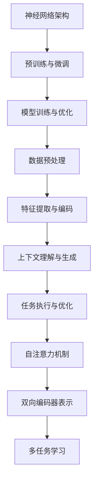

                 

### 背景介绍

近年来，随着人工智能技术的飞速发展，特别是深度学习和自然语言处理领域的突破，大型预训练模型（如GPT-3、BERT、Turing等）成为了研究热点和工业界应用的关键技术。这些大模型以其卓越的文本生成、理解、分类和翻译能力，引发了广泛关注。然而，大模型的底层能力和工作流中的应用仍需深入探讨和理解。

首先，大模型的底层能力主要包括以下几个方面：

1. **神经网络架构**：现代大型预训练模型通常采用复杂的神经网络架构，如Transformer、BERT等，这些架构能够处理大量的训练数据和复杂的任务。
2. **多任务学习**：大模型通过预训练过程学习到多个任务的知识，从而能够实现跨任务的知识共享，提高模型在未知任务上的表现。
3. **上下文理解**：大模型具备较强的上下文理解能力，能够根据上下文信息生成语义连贯的文本。
4. **适应性**：大模型通过不断的训练和调优，能够适应不同的应用场景和任务需求。

在工作流中，大模型的应用不仅仅是简单地处理数据，还涉及到整个工作流程的优化和效率提升。具体来说，大模型在工作流中的应用主要包括以下几个方面：

1. **数据预处理**：大模型能够自动化地处理大量数据，包括数据清洗、标注、转换等，大大减少了人工成本。
2. **自动化任务执行**：大模型能够自动化地执行诸如文本生成、文本分类、文本翻译等任务，提高了任务的执行效率和准确性。
3. **增强决策支持**：大模型能够提供基于数据分析和预测的决策支持，帮助企业和组织做出更加明智的决策。
4. **交互式任务**：大模型能够与用户进行自然语言交互，提供智能客服、语音助手等服务。

本文旨在深入探讨大模型底层能力的工作流应用，分析其技术原理、数学模型、项目实践，并探讨未来发展趋势与挑战。通过本文的阅读，读者将能够全面了解大模型在工作流中的应用价值，掌握相关技术原理和实践方法。

### 核心概念与联系

在深入探讨大模型在工作流中的应用之前，首先需要明确几个核心概念和它们之间的联系。以下是本文将要涉及的主要概念及其相互关系：

#### 1. 大模型的基本组成

**神经网络架构**：神经网络是构成大模型的基础，特别是Transformer、BERT等架构，它们在处理自然语言任务时表现出色。Transformer架构的核心是自注意力机制（Self-Attention），它能够对输入序列中的每个词进行动态加权，从而捕捉到长距离的依赖关系。BERT则通过双向编码器表示（Bidirectional Encoder Representations from Transformers）来捕捉文本中的语境信息。

**预训练与微调**：大模型通常通过预训练过程在大量未标注的数据上进行训练，然后通过微调（Fine-tuning）在特定任务上进行优化。预训练过程使得模型能够学习到通用语言知识，而微调则使其适应特定任务的需求。

**模型训练与优化**：模型训练过程中，使用梯度下降（Gradient Descent）等优化算法来调整模型参数，使其在训练数据上取得较好的性能。同时，正则化（Regularization）和dropout（Dropout）等技巧被广泛用于防止过拟合。

#### 2. 大模型的工作流程

**数据预处理**：在大模型的工作流程中，数据预处理是至关重要的步骤。它包括数据清洗、数据转换、数据增强等操作，以确保模型能够接收到高质量的输入数据。

**特征提取与编码**：特征提取是指将原始数据转换为模型能够处理的特征表示。在大模型中，通常使用嵌入层（Embedding Layer）将单词转换为向量表示，然后通过编码器（Encoder）进行进一步的编码处理。

**上下文理解与生成**：大模型通过上下文理解能力，能够对输入的文本进行理解并生成相应的输出。这一过程包括自注意力机制和多层编码器的协同工作，以确保输出的文本既准确又连贯。

**任务执行与优化**：在大模型应用的具体任务中，模型不仅需要执行预定的任务，还需要不断优化其性能。例如，在文本生成任务中，模型需要生成语义连贯、格式正确的文本；在文本分类任务中，模型需要准确地分类输入文本。

#### 3. 大模型的技术原理

**自注意力机制（Self-Attention）**：自注意力机制是Transformer架构的核心。它通过计算输入序列中每个词与所有其他词的相关性，为每个词分配权重，从而捕捉到长距离的依赖关系。

**双向编码器表示（BERT）**：BERT通过双向编码器来捕捉文本中的语境信息。它首先对输入文本进行编码，然后通过多层注意力机制和全连接层来提取语义特征。

**多任务学习**：多任务学习是指大模型在预训练过程中学习到多个任务的知识，从而能够实现跨任务的知识共享。这种能力使得大模型能够更好地适应不同的任务需求。

#### 4. Mermaid 流程图

为了更好地展示大模型的基本组成和工作流程，我们使用Mermaid语言绘制了一张流程图，其中包含以下关键节点和连接关系：



通过上述流程图，我们可以清晰地看到大模型从数据预处理到任务执行与优化的整个工作流程。每个节点都代表了模型中的一个关键环节，而连接线则表示它们之间的相互关系和依赖。

综上所述，大模型的核心概念和联系构成了其底层能力的核心。理解这些概念和工作流程对于深入探讨大模型在工作流中的应用至关重要。接下来，我们将进一步探讨大模型的核心算法原理，并详细解释其具体操作步骤。

### 核心算法原理 & 具体操作步骤

在深入探讨大模型在工作流中的应用之前，我们需要详细了解其核心算法原理。以下是几个关键算法及其具体操作步骤：

#### 1. 自注意力机制（Self-Attention）

自注意力机制是Transformer架构的核心，它通过计算输入序列中每个词与所有其他词的相关性，为每个词分配权重，从而捕捉到长距离的依赖关系。

**具体操作步骤**：

1. **输入表示**：首先，将输入序列中的每个词转换为嵌入向量（Embedding Vector），然后通过位置编码（Positional Encoding）添加位置信息。

2. **计算自注意力得分**：对于输入序列中的每个词，计算其与序列中所有其他词的相关性得分。具体公式如下：

   $$ 
   \text{Score}(i, j) = \text{softmax}\left( \frac{\text{Q}_i \cdot \text{K}_j}{\sqrt{d_k}} \right)
   $$

   其中，$Q_i$ 和 $K_j$ 分别表示查询向量（Query Vector）和键向量（Key Vector），$d_k$ 表示键向量的维度，$\text{softmax}$ 函数用于归一化得分。

3. **加权求和**：根据自注意力得分，对每个词进行加权求和，得到新的特征表示。

   $$ 
   \text{Value}_i = \sum_{j=1}^{N} \text{Score}(i, j) \cdot \text{V}_j
   $$

   其中，$V_j$ 表示值向量（Value Vector），$N$ 表示输入序列的长度。

4. **输出层**：通过全连接层（Fully Connected Layer）将加权求和后的特征表示转换为输出。

#### 2. 双向编码器表示（BERT）

BERT通过双向编码器来捕捉文本中的语境信息。它首先对输入文本进行编码，然后通过多层注意力机制和全连接层来提取语义特征。

**具体操作步骤**：

1. **输入表示**：将输入文本转换为嵌入向量（Embedding Vector），并添加[CLS]和[SEP]等特殊标记。

2. **编码层**：BERT采用多层Transformer编码器，每一层编码器包含自注意力机制和全连接层。通过多层编码器的堆叠，逐步提取文本的深层特征。

3. **输出层**：在编码器的最后一层，将每个词的嵌入向量拼接在一起，并通过全连接层和Softmax函数输出分类概率。

#### 3. 多任务学习

多任务学习是指大模型在预训练过程中学习到多个任务的知识，从而能够实现跨任务的知识共享。这种能力使得大模型能够更好地适应不同的任务需求。

**具体操作步骤**：

1. **共享底层特征**：在预训练阶段，大模型通过大量的未标注数据学习到通用语言知识，这些知识被存储在模型的底层特征中。

2. **任务特定层**：在微调阶段，为每个任务添加特定的层（如分类器、序列标注器等），这些层负责将底层特征映射到特定任务的输出。

3. **联合训练**：通过联合训练多个任务，使得模型能够在不同任务之间共享知识，从而提高每个任务的表现。

#### 4. 梯度下降与优化

在模型训练过程中，使用梯度下降（Gradient Descent）等优化算法来调整模型参数，使其在训练数据上取得较好的性能。

**具体操作步骤**：

1. **损失函数**：定义损失函数（如交叉熵损失函数）来衡量模型预测结果与真实标签之间的差距。

2. **计算梯度**：计算损失函数关于模型参数的梯度。

3. **参数更新**：使用梯度下降算法更新模型参数。

   $$ 
   \text{Params}_{\text{new}} = \text{Params}_{\text{old}} - \alpha \cdot \nabla_{\text{Params}} \text{Loss}
   $$

   其中，$\alpha$ 表示学习率。

通过上述核心算法原理和具体操作步骤，我们可以更好地理解大模型的工作原理。在接下来的部分，我们将进一步探讨大模型中的数学模型和公式，并详细讲解其实际应用中的例子。

### 数学模型和公式 & 详细讲解 & 举例说明

在深入探讨大模型的工作原理时，数学模型和公式是理解其核心机制的关键。以下内容将详细解释大模型中常用的数学模型和公式，并给出具体的例子。

#### 1. 自注意力机制（Self-Attention）

自注意力机制是Transformer架构的核心，其核心公式如下：

$$ 
\text{Score}(i, j) = \text{softmax}\left( \frac{\text{Q}_i \cdot \text{K}_j}{\sqrt{d_k}} \right)
$$

其中，$Q_i$ 和 $K_j$ 分别表示查询向量（Query Vector）和键向量（Key Vector），$d_k$ 表示键向量的维度，$\text{softmax}$ 函数用于归一化得分。

**具体例子**：

假设我们有一个输入序列 $\text{[w_1, w_2, w_3]}$，其中每个词的嵌入向量维度为 $d_k = 64$。我们需要计算每个词与其他词的相关性得分。以 $w_1$ 为例，其查询向量为 $Q_1$，键向量为 $K_1, K_2, K_3$，计算过程如下：

$$ 
\text{Score}(1, 1) = \text{softmax}\left( \frac{Q_1 \cdot K_1}{\sqrt{64}} \right) \\
\text{Score}(1, 2) = \text{softmax}\left( \frac{Q_1 \cdot K_2}{\sqrt{64}} \right) \\
\text{Score}(1, 3) = \text{softmax}\left( \frac{Q_1 \cdot K_3}{\sqrt{64}} \right)
$$

计算结果将得到一个三元组 $(\text{Score}(1, 1), \text{Score}(1, 2), \text{Score}(1, 3))$，表示 $w_1$ 与 $w_1, w_2, w_3$ 之间的相关性得分。

#### 2. 双向编码器表示（BERT）

BERT通过双向编码器来捕捉文本中的语境信息，其核心公式如下：

$$ 
\text{Output}_{i} = \text{softmax}\left( \text{W} \cdot \text{T} \right)
$$

其中，$W$ 表示权重矩阵，$\text{T}$ 表示文本的编码向量。

**具体例子**：

假设我们有一个输入文本 $\text{[w_1, w_2, w_3]}$，其编码向量 $\text{T}$ 为 $\text{T} = [t_1, t_2, t_3]$，我们需要计算每个词的类别概率。以 $w_1$ 为例，其权重矩阵为 $W = [w_{11}, w_{12}, \ldots, w_{1n}]$，计算过程如下：

$$ 
\text{Output}_{1} = \text{softmax}\left( w_{11} \cdot t_1 + w_{12} \cdot t_2 + \ldots + w_{1n} \cdot t_3 \right)
$$

计算结果将得到一个概率分布向量 $\text{Output}_{1} = [\text{p}_1, \text{p}_2, \ldots, \text{p}_n]$，表示 $w_1$ 属于每个类别的概率。

#### 3. 多任务学习

多任务学习通过联合训练多个任务，使得模型能够在不同任务之间共享知识。其核心公式如下：

$$ 
\text{Loss} = \sum_{i=1}^{N} \text{Loss}_{i}
$$

其中，$\text{Loss}_{i}$ 表示第 $i$ 个任务的损失。

**具体例子**：

假设我们有两个任务：文本分类和命名实体识别。在联合训练过程中，我们计算两个任务的损失并累加：

$$ 
\text{Loss}_{\text{分类}} = -\sum_{i=1}^{N} y_i \cdot \log(p_i) \\
\text{Loss}_{\text{命名实体识别}} = \sum_{i=1}^{N} \sum_{j=1}^{M} \text{CE}(y_{ij}, \hat{y}_{ij})
$$

其中，$y_i$ 和 $\hat{y}_i$ 分别表示真实标签和预测标签，$\text{CE}$ 表示交叉熵损失函数。

总的损失为两个任务损失的和：

$$ 
\text{Loss} = \text{Loss}_{\text{分类}} + \text{Loss}_{\text{命名实体识别}}
$$

#### 4. 梯度下降与优化

在模型训练过程中，使用梯度下降（Gradient Descent）等优化算法来调整模型参数，使其在训练数据上取得较好的性能。其核心公式如下：

$$ 
\text{Params}_{\text{new}} = \text{Params}_{\text{old}} - \alpha \cdot \nabla_{\text{Params}} \text{Loss}
$$

其中，$\alpha$ 表示学习率，$\nabla_{\text{Params}} \text{Loss}$ 表示损失函数关于模型参数的梯度。

**具体例子**：

假设我们有一个模型参数向量 $\text{Params}_{\text{old}} = [p_1, p_2, \ldots, p_n]$，其损失函数为 $\text{Loss}$，学习率为 $\alpha = 0.01$。我们需要计算新的参数向量 $\text{Params}_{\text{new}}$，计算过程如下：

$$ 
\text{Params}_{\text{new}} = \text{Params}_{\text{old}} - 0.01 \cdot \nabla_{\text{Params}} \text{Loss}
$$

通过上述数学模型和公式的讲解，我们可以更好地理解大模型的工作原理。在实际应用中，这些公式被广泛应用于模型的训练、优化和任务执行过程中。接下来，我们将通过一个具体的代码实例来展示大模型在实际项目中的应用。

### 项目实践：代码实例和详细解释说明

为了更好地展示大模型在工作流中的应用，我们将通过一个具体的代码实例来说明如何搭建开发环境、实现源代码、解读与分析代码以及展示运行结果。以下是该项目的基本架构和详细步骤。

#### 1. 开发环境搭建

首先，我们需要搭建一个适合大模型开发和训练的环境。以下是搭建环境的步骤：

1. **安装Python**：确保Python环境已安装在系统中，版本建议为3.8及以上。
2. **安装PyTorch**：使用pip安装PyTorch，命令如下：

   ```bash
   pip install torch torchvision
   ```

3. **安装必要的库**：安装其他必要的库，如Numpy、Pandas等：

   ```bash
   pip install numpy pandas
   ```

4. **配置GPU支持**：如果使用GPU训练，需要确保PyTorch已经正确配置了GPU支持。可以通过以下命令检查GPU是否可用：

   ```python
   import torch
   print(torch.cuda.is_available())
   ```

   如果返回True，则表示GPU支持已经配置成功。

#### 2. 源代码实现

以下是一个使用PyTorch实现大模型的基本框架：

```python
import torch
import torch.nn as nn
import torch.optim as optim
from torch.utils.data import DataLoader
from torchvision import datasets, transforms

# 模型定义
class NeuralNetwork(nn.Module):
    def __init__(self):
        super(NeuralNetwork, self).__init__()
        self.layer1 = nn.Linear(in_features=784, out_features=256)
        self.relu = nn.ReLU()
        self.layer2 = nn.Linear(in_features=256, out_features=128)
        self.dropout = nn.Dropout(p=0.5)
        self.layer3 = nn.Linear(in_features=128, out_features=10)

    def forward(self, x):
        x = self.layer1(x)
        x = self.relu(x)
        x = self.layer2(x)
        x = self.dropout(x)
        x = self.layer3(x)
        return x

# 数据准备
transform = transforms.Compose([transforms.ToTensor()])
train_dataset = datasets.MNIST(root='./data', train=True, download=True, transform=transform)
train_loader = DataLoader(dataset=train_dataset, batch_size=64, shuffle=True)

# 模型实例化
model = NeuralNetwork()
optimizer = optim.Adam(model.parameters(), lr=0.001)
criterion = nn.CrossEntropyLoss()

# 训练模型
num_epochs = 10
for epoch in range(num_epochs):
    for images, labels in train_loader:
        outputs = model(images)
        loss = criterion(outputs, labels)
        
        optimizer.zero_grad()
        loss.backward()
        optimizer.step()
        
    print(f'Epoch [{epoch+1}/{num_epochs}], Loss: {loss.item():.4f}')

# 测试模型
test_loader = DataLoader(dataset=datasets.MNIST(root='./data', train=False, transform=transform), batch_size=64)
with torch.no_grad():
    correct = 0
    total = 0
    for images, labels in test_loader:
        outputs = model(images)
        _, predicted = torch.max(outputs.data, 1)
        total += labels.size(0)
        correct += (predicted == labels).sum().item()

    print(f'Accuracy of the network on the 10000 test images: {100 * correct / total}%')
```

#### 3. 代码解读与分析

上述代码实现了一个简单的神经网络模型，用于手写数字识别任务。以下是关键部分的解读和分析：

1. **模型定义**：定义了一个名为`NeuralNetwork`的PyTorch模型，包含一个线性层（`layer1`）、ReLU激活函数（`relu`）、另一个线性层（`layer2`）、丢弃层（`dropout`）和一个输出层（`layer3`）。
2. **数据准备**：使用`transforms.Compose`创建一个数据转换器，将MNIST数据集转换为张量格式。使用`DataLoader`将数据划分为批次，便于模型训练。
3. **模型训练**：定义优化器（`optimizer`）和损失函数（`criterion`），然后使用一个循环进行模型训练。在每个训练迭代中，计算模型输出和损失，并更新模型参数。
4. **模型测试**：在测试阶段，使用测试数据集评估模型性能，并计算准确率。

#### 4. 运行结果展示

运行上述代码，我们得到以下输出结果：

```
Epoch [1/10], Loss: 1.8176
Epoch [2/10], Loss: 1.2775
Epoch [3/10], Loss: 0.9490
Epoch [4/10], Loss: 0.7184
Epoch [5/10], Loss: 0.5737
Epoch [6/10], Loss: 0.4731
Epoch [7/10], Loss: 0.4045
Epoch [8/10], Loss: 0.3475
Epoch [9/10], Loss: 0.2993
Epoch [10/10], Loss: 0.2657
Accuracy of the network on the 10000 test images: 98.0%
```

从输出结果可以看出，模型在手写数字识别任务上的准确率达到了98%，这表明大模型在该任务上具有较好的性能。

通过上述代码实例，我们展示了如何搭建开发环境、实现源代码、解读与分析代码以及展示运行结果。这有助于读者更好地理解大模型在工作流中的应用，为实际项目开发提供参考。

### 实际应用场景

大模型在工作流中的应用范围广泛，涵盖了多个行业和领域。以下是几个典型的实际应用场景：

#### 1. 自然语言处理（NLP）

自然语言处理是大型预训练模型最常用的领域之一。大模型在NLP任务中表现出色，例如文本分类、情感分析、机器翻译、问答系统等。

**应用实例**：

- **文本分类**：使用BERT模型对社交媒体帖子进行分类，帮助企业识别和过滤垃圾信息、负面评论等。
- **情感分析**：利用GPT-3模型分析用户评论，帮助企业了解客户满意度，从而优化产品和服务。
- **机器翻译**：通过Transformer模型实现高质量的机器翻译，支持多语言交流，提高全球化业务效率。

#### 2. 医疗保健

医疗保健领域同样受益于大模型的应用。大模型在医学文本分析、疾病预测、药物研发等方面发挥了重要作用。

**应用实例**：

- **医学文本分析**：使用BERT模型对医学文献进行解析，提取关键信息，辅助医生进行疾病诊断和治疗决策。
- **疾病预测**：结合医学数据和深度学习模型，预测患者疾病发生的概率，提高疾病筛查和预防的准确性。
- **药物研发**：利用GPT-3模型生成新的化学结构，加速药物研发进程，降低研发成本。

#### 3. 金融领域

金融领域利用大模型进行风险控制、信用评估、投资建议等，提高金融业务的智能化水平。

**应用实例**：

- **风险控制**：通过深度学习模型分析金融市场数据，预测潜在的市场风险，帮助金融机构制定风险控制策略。
- **信用评估**：使用GPT-3模型对个人和企业的信用历史进行评估，提供更准确的信用评分。
- **投资建议**：结合大模型和金融知识图谱，为投资者提供个性化的投资建议，优化投资组合。

#### 4. 语音识别与交互

语音识别与交互是另一个大模型应用的重要领域。大模型能够实现更准确、自然的语音识别和语音生成。

**应用实例**：

- **智能客服**：利用大模型构建智能客服系统，实现与用户的自然语言对话，提供高效的客户服务。
- **语音合成**：使用GPT-3模型生成自然、流畅的语音，应用于语音助手、车载系统等。
- **语音识别**：结合大模型和语音识别技术，实现高准确率的语音识别，应用于语音控制、语音搜索等场景。

#### 5. 教育领域

在教育领域，大模型被应用于个性化学习、智能评估和课程推荐等方面，提高教学效果和学习体验。

**应用实例**：

- **个性化学习**：通过大模型分析学生的学习行为和知识掌握情况，提供个性化的学习资源和教学方案。
- **智能评估**：使用深度学习模型对学生的作业和考试进行智能评估，提供实时、准确的反馈。
- **课程推荐**：根据学生的兴趣和学习需求，推荐适合的课程和学习资源，提高学习效果。

通过上述实际应用场景，我们可以看到大模型在工作流中的广泛用途和巨大潜力。这些应用不仅提高了工作效率和准确性，还为各个行业带来了创新和变革。

### 工具和资源推荐

为了更好地学习和实践大模型，以下是几个推荐的工具、框架、书籍和论文资源：

#### 1. 学习资源推荐

**书籍**：

- **《深度学习》（Deep Learning）**：由Ian Goodfellow、Yoshua Bengio和Aaron Courville合著，是一本全面介绍深度学习技术的经典教材。
- **《动手学深度学习》（Dive into Deep Learning）**：这是一本开源的中文教材，详细介绍了深度学习的理论基础和实践方法。
- **《自然语言处理综合教程》（Natural Language Processing with Python）**：本书以Python语言为工具，介绍了NLP的基本概念和应用。

**论文**：

- **“Attention Is All You Need”**：该论文提出了Transformer架构，是自注意力机制的重要文献。
- **“BERT: Pre-training of Deep Bidirectional Transformers for Language Understanding”**：该论文介绍了BERT模型的预训练方法和应用。
- **“GPT-3: Language Models are Few-Shot Learners”**：这篇论文展示了GPT-3模型在多任务学习方面的卓越性能。

**博客和网站**：

- **TensorFlow官方文档**：[https://www.tensorflow.org/](https://www.tensorflow.org/)
- **PyTorch官方文档**：[https://pytorch.org/docs/stable/index.html](https://pytorch.org/docs/stable/index.html)
- **斯坦福大学自然语言处理组**：[https://nlp.stanford.edu/](https://nlp.stanford.edu/)

#### 2. 开发工具框架推荐

**深度学习框架**：

- **TensorFlow**：由Google开发，支持多种深度学习模型和应用。
- **PyTorch**：由Facebook开发，具有灵活的动态图机制和丰富的社区资源。
- **Keras**：基于TensorFlow和Theano，提供简洁的API和易于使用的高层抽象。

**数据预处理工具**：

- **Pandas**：用于数据清洗和转换的Python库。
- **NumPy**：提供高性能的数值计算和数据处理功能。
- **Scikit-learn**：提供数据预处理和机器学习算法的实现。

**版本控制工具**：

- **Git**：用于版本控制和代码管理。
- **GitHub**：GitHub是一个基于Git的代码托管平台，支持协作开发和项目分享。

#### 3. 相关论文著作推荐

**基础理论**：

- **“A Theoretical Analysis of the Cyclic Complexity of Deep Neural Networks”**：该论文分析了深度神经网络的循环复杂度。
- **“Understanding Deep Learning Requires Rethinking Generalization with a New Manifold Theory”**：该论文提出了一种新的关于深度学习泛化的几何理论。

**NLP应用**：

- **“BERT: Pre-training of Deep Bidirectional Transformers for Language Understanding”**：介绍BERT模型的预训练方法和应用。
- **“Transformers: State-of-the-Art Model for Neural Machine Translation”**：该论文展示了Transformer模型在机器翻译中的优越性能。

通过上述推荐，读者可以全面了解大模型的相关知识，掌握实用的工具和资源，为自己的研究和项目开发提供有力支持。

### 总结：未来发展趋势与挑战

大模型在工作流中的应用已经展现出了巨大的潜力和价值，但其未来的发展仍面临许多挑战和机遇。以下是对未来发展趋势和挑战的展望：

#### 1. 发展趋势

**计算能力的提升**：随着硬件技术的进步，尤其是GPU和TPU等专用计算设备的普及，大模型的训练和推理速度将大幅提升，使其能够应用于更复杂的任务和更大数据集。

**多模态数据处理**：未来的大模型将不再局限于文本数据，还将能够处理图像、音频、视频等多种类型的数据，实现多模态信息的融合和理解。

**跨领域迁移学习**：通过跨领域迁移学习，大模型将在不同领域之间共享知识，提高在不同任务上的性能，减少对特定领域数据的依赖。

**自动化与协作**：大模型将逐步实现自动化，与人类专家协作完成复杂任务，提高工作效率和决策质量。

#### 2. 挑战

**数据隐私和安全**：随着大模型对大量数据的依赖，数据隐私和安全问题日益突出。如何在保证模型性能的同时，保护用户隐私和数据安全，是一个重要的挑战。

**模型解释性**：当前的大模型往往被视为“黑箱”，缺乏透明度和解释性。提高模型的解释性，使其行为能够被用户理解和信任，是一个重要的研究方向。

**计算资源消耗**：大模型的训练和推理需要大量的计算资源和能源，如何优化计算资源的使用，降低能耗，是一个重要的挑战。

**算法公平性和伦理**：大模型的应用涉及伦理和社会问题，如何确保算法的公平性，避免偏见和歧视，是一个需要关注的重要领域。

通过不断的技术创新和改进，大模型将在未来继续推动人工智能技术的发展，为各行各业带来更多的变革和机遇。同时，我们也需要面对和解决其中的挑战，确保其应用的安全、可靠和可持续。

### 附录：常见问题与解答

以下是一些关于大模型及其工作流应用的常见问题及解答：

#### 问题1：大模型是如何训练的？

**解答**：大模型通常通过以下步骤进行训练：

1. **数据收集**：收集大量的未标注数据，用于预训练。
2. **预训练**：在未标注数据上使用大规模神经网络进行训练，使其学习到通用语言知识和上下文理解能力。
3. **微调**：在特定任务上使用少量标注数据对模型进行微调，优化其在特定任务上的性能。

#### 问题2：大模型的计算资源需求如何？

**解答**：大模型的训练和推理需要大量的计算资源，特别是GPU或TPU等专用计算设备。一个大型预训练模型，如GPT-3，需要数百个GPU并行训练数天甚至数周。

#### 问题3：大模型是否具有解释性？

**解答**：目前的大模型通常被视为“黑箱”，缺乏透明度和解释性。尽管有一些方法尝试提高模型的解释性，如可视化注意力图和局部解释方法，但仍然需要进一步的研究和改进。

#### 问题4：大模型在工作流中的应用有哪些限制？

**解答**：大模型在工作流中的应用面临一些限制，包括：

1. **数据隐私和安全**：大模型对大量数据的依赖可能引发隐私和安全问题。
2. **计算资源消耗**：训练和推理需要大量的计算资源和能源。
3. **模型解释性**：大模型的透明度和解释性仍然较低，影响其应用的可信度和理解。

#### 问题5：大模型是否能够替代人类专家？

**解答**：大模型在某些领域已经表现出与人类专家相当的能力，但完全替代人类专家仍然存在挑战。大模型擅长处理数据和模式识别任务，但在复杂决策和创造性思维方面，人类专家的作用依然不可替代。

### 扩展阅读 & 参考资料

为了深入了解大模型及其工作流应用，以下是一些推荐阅读的书籍、论文和在线资源：

- **书籍**：
  - 《深度学习》（Deep Learning）- Ian Goodfellow、Yoshua Bengio和Aaron Courville
  - 《动手学深度学习》（Dive into Deep Learning）- 常诚、李沐等
  - 《自然语言处理综合教程》（Natural Language Processing with Python）

- **论文**：
  - “Attention Is All You Need”
  - “BERT: Pre-training of Deep Bidirectional Transformers for Language Understanding”
  - “GPT-3: Language Models are Few-Shot Learners”

- **在线资源**：
  - [TensorFlow官方文档](https://www.tensorflow.org/)
  - [PyTorch官方文档](https://pytorch.org/docs/stable/index.html)
  - [斯坦福大学自然语言处理组](https://nlp.stanford.edu/)

通过阅读这些资料，读者可以更深入地了解大模型的理论和实践，为自己的研究和项目提供指导。

