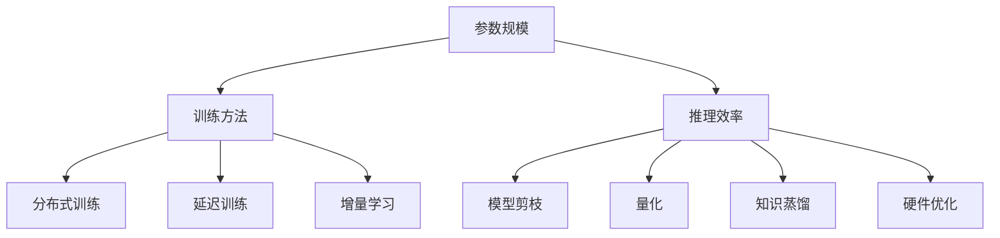

                 

### 背景介绍 Background Introduction

随着深度学习技术的飞速发展，大规模预训练模型（Large-scale Pretrained Models）已经成为人工智能领域的热点。这些模型通过在海量数据上训练，能够达到前所未有的表现能力，并在自然语言处理（NLP）、计算机视觉（CV）等领域取得了显著成果。然而，模型的大规模化不仅带来了性能的提升，也带来了新的挑战，特别是在参数规模（Parameter Scale）、训练方法（Training Methods）和推理效率（Inference Efficiency）等方面。

#### 参数规模 Parameter Scale

模型参数规模是衡量一个预训练模型大小的重要指标。早期的预训练模型，如Word2Vec和GloVe，其参数规模相对较小。随着深度神经网络技术的发展，模型变得越来越复杂，参数数量也随之激增。以BERT模型为例，其基础版本BERT-Base拥有超过一亿个参数，而更大规模的模型如GPT-3，其参数数量更是达到了惊人的1750亿个。如此庞大的参数规模不仅对计算资源提出了极高的要求，同时也使得模型的训练、存储和推理变得更加复杂。

#### 训练方法 Training Methods

随着模型规模的扩大，训练方法也在不断演变。传统的模型训练方法主要依赖于随机梯度下降（SGD）和其变体，如Adam、AdaGrad等。然而，面对大规模模型，这些传统方法在训练效率上显得力不从心。为了应对这一挑战，研究者们提出了一系列新的训练技术，如：

- **分布式训练**：通过将模型拆分成多个子网络，分布式训练可以在多个计算节点上同时进行，大大提高了训练速度。
- **延迟训练**（Lazy Training）：该方法通过延迟参数更新，减少了通信成本，适用于大规模分布式训练环境。
- **增量学习**：在已有模型的基础上，只对新增的数据进行微调，减少了训练时间和计算资源的需求。

#### 推理效率 Inference Efficiency

推理效率是衡量模型在实际应用中的表现的关键因素。对于大规模预训练模型，推理效率往往受到模型结构和硬件资源的影响。以下是一些提高推理效率的方法：

- **模型剪枝**：通过去除模型中的冗余参数，降低模型的复杂度，从而提高推理速度。
- **量化**：将模型的浮点运算转换为低精度的整数运算，减少计算资源的消耗。
- **知识蒸馏**：通过将大规模模型的输出传递给一个较小的模型，实现模型压缩和加速。
- **硬件优化**：针对特定硬件平台，如GPU、TPU等，进行模型架构和算法的优化，以实现更高的推理效率。

综上所述，大规模预训练模型在参数规模、训练方法和推理效率等方面面临着一系列挑战。本文将深入探讨这些挑战，并分析未来的发展趋势。

### 核心概念与联系 Core Concepts and Relationships

在讨论大规模预训练模型的技术发展趋势时，我们需要明确几个核心概念，这些概念不仅相互关联，而且共同构成了当前和未来模型发展的基础。

#### 参数规模（Parameter Scale）

参数规模是评估预训练模型复杂度的关键指标。一个模型的参数规模直接影响到其计算复杂度和存储需求。例如，BERT模型的基础版本BERT-Base包含超过一亿个参数，而GPT-3的参数规模更是达到了1750亿个。如此庞大的参数规模不仅要求高效的计算资源，也对模型训练和推理提出了更高的要求。

#### 训练方法（Training Methods）

训练方法是指模型在实际训练过程中采用的技术和策略。传统的随机梯度下降（SGD）及其变体如Adam、AdaGrad等，虽然适用于小规模模型，但在面对大规模模型时显得不够高效。为了提高训练效率，研究者们提出了分布式训练、延迟训练和增量学习等方法。

- **分布式训练**：通过将模型拆分成多个子网络，分布式训练可以在多个计算节点上并行进行，从而提高训练速度。例如，TensorFlow和PyTorch等深度学习框架都支持分布式训练。
- **延迟训练**：该方法通过延迟参数更新，减少了通信成本，特别适用于大规模分布式训练环境。
- **增量学习**：在已有模型的基础上，只对新增的数据进行微调，这样可以减少训练时间和计算资源的需求。

#### 推理效率（Inference Efficiency）

推理效率是指模型在实际应用中的计算速度和资源利用率。大规模预训练模型在推理过程中往往面临计算资源紧张的问题，因此提高推理效率成为关键。以下是一些常见的提高推理效率的方法：

- **模型剪枝**：通过去除模型中的冗余参数，降低模型的复杂度，从而提高推理速度。例如，图卷积网络（GCN）和卷积神经网络（CNN）等都可以通过剪枝技术进行优化。
- **量化**：将模型的浮点运算转换为低精度的整数运算，减少计算资源的消耗。量化技术已经被广泛应用于移动设备和嵌入式系统中。
- **知识蒸馏**：通过将大规模模型的输出传递给一个较小的模型，实现模型压缩和加速。知识蒸馏技术在移动端和边缘计算场景中具有广泛的应用。
- **硬件优化**：针对特定硬件平台，如GPU、TPU等，进行模型架构和算法的优化，以实现更高的推理效率。例如，谷歌的TPU就是专门为TensorFlow优化设计的硬件加速器。

#### Mermaid 流程图（Mermaid Flowchart）

为了更好地理解上述概念之间的关系，我们可以使用Mermaid流程图来可视化这些概念和它们之间的联系。以下是一个简单的Mermaid流程图示例：



在这个流程图中，参数规模、训练方法和推理效率作为核心概念，它们之间的相互影响和联系被清晰地展示出来。这种可视化方式有助于我们更好地理解大规模预训练模型的技术发展趋势。

### 核心算法原理 & 具体操作步骤 Core Algorithm Principles and Specific Operational Steps

在探讨大规模预训练模型的技术发展趋势时，核心算法原理及其具体操作步骤是理解模型性能和优化方向的关键。以下我们将详细解释几种关键算法原理，并逐步展示它们的操作步骤。

#### 1. 分布式训练 Distributed Training

分布式训练是应对大规模模型训练的重要方法之一。其基本原理是将模型拆分成多个子网络，每个子网络负责一部分数据的学习，然后通过参数同步的方式更新全局模型。以下是分布式训练的基本步骤：

1. **模型拆分**：将预训练模型拆分成多个子网络，每个子网络负责处理不同的数据子集。
    ```mermaid
    graph TD
        A[拆分模型] --> B[子网络1]
        A --> C[子网络2]
        A --> D[子网络N]
    ```

2. **并行训练**：在每个子网络中独立进行训练，这样可以充分利用多台计算资源，加快训练速度。
    ```mermaid
    graph TD
        B[子网络1] --> E[训练1]
        C[子网络2] --> F[训练2]
        D[子网络N] --> G[训练N]
    ```

3. **参数同步**：将各子网络的参数更新同步到全局模型中，以保证全局模型的一致性。
    ```mermaid
    graph TD
        H[子网络1] --> I[同步1]
        J[子网络2] --> K[同步2]
        L[子网络N] --> M[同步N]
        I --> N[全局模型]
        K --> N
        L --> N
    ```

#### 2. 延迟训练 Lazy Training

延迟训练是一种优化分布式训练通信成本的技术。其核心思想是延迟参数更新，直到模型在每个子网络上的训练都完成后再进行同步。以下是延迟训练的基本步骤：

1. **初始化模型**：初始化全局模型和各子网络。
    ```mermaid
    graph TD
        A[初始化模型] --> B[全局模型]
        A --> C[子网络1]
        A --> D[子网络2]
        A --> E[子网络N]
    ```

2. **独立训练**：每个子网络独立进行前向传播和反向传播。
    ```mermaid
    graph TD
        C[子网络1] --> F[前向传播]
        C --> G[反向传播]
        D[子网络2] --> H[前向传播]
        D --> I[反向传播]
        E[子网络N] --> J[前向传播]
        E --> K[反向传播]
    ```

3. **延迟同步**：在所有子网络训练完成后，将各子网络的参数更新同步到全局模型。
    ```mermaid
    graph TD
        M[训练完成] --> N[同步全局参数]
        F --> M
        G --> M
        H --> M
        I --> M
        J --> M
        K --> M
        N --> O[更新全局模型]
    ```

#### 3. 增量学习 Incremental Learning

增量学习是一种在已有模型基础上进行微调的学习方法。其目的是减少训练时间和计算资源的需求，同时保留已有模型的性能。以下是增量学习的基本步骤：

1. **加载预训练模型**：加载已经训练好的预训练模型作为基础模型。
    ```mermaid
    graph TD
        A[加载预训练模型] --> B[基础模型]
    ```

2. **微调模型**：在基础模型的基础上，对新增的数据进行微调。
    ```mermaid
    graph TD
        B[基础模型] --> C[新增数据]
        C --> D[微调参数]
    ```

3. **更新模型**：将微调后的参数更新到全局模型中。
    ```mermaid
    graph TD
        D --> E[更新全局模型]
    ```

通过上述核心算法原理和具体操作步骤的详细解释，我们可以更好地理解大规模预训练模型的技术机制，并为未来的性能优化提供指导。

### 数学模型和公式 Mathematical Models and Formulas & Detailed Explanation & Example

在深入探讨大规模预训练模型的技术发展时，理解其背后的数学模型和公式至关重要。这些模型和公式不仅帮助解释模型的工作原理，还为性能优化和算法改进提供了理论依据。以下我们将详细讲解几种关键的数学模型和公式，并附上具体示例。

#### 1. 随机梯度下降（SGD）

随机梯度下降（SGD）是一种广泛使用的优化算法，用于训练神经网络。其基本公式如下：

$$
\text{Gradient} = \frac{\partial J(\theta)}{\partial \theta}
$$

其中，$J(\theta)$ 是损失函数，$\theta$ 是模型参数。在每次迭代中，SGD通过以下公式更新参数：

$$
\theta_{t+1} = \theta_t - \alpha \cdot \text{Gradient}
$$

其中，$\alpha$ 是学习率。

**示例**：假设我们有一个简单的线性回归模型，其损失函数为 $J(\theta) = \frac{1}{2}(y - \theta x)^2$。学习率为 $\alpha = 0.1$，我们得到以下更新步骤：

1. 初始参数 $\theta_0 = 0$
2. 计算梯度 $\text{Gradient} = \frac{\partial J(\theta_0)}{\partial \theta_0} = x - y$
3. 更新参数 $\theta_1 = \theta_0 - 0.1 \cdot (\text{Gradient}) = 0 - 0.1 \cdot (x - y)$

#### 2. 随机梯度下降的变体（如Adam）

Adam是一种改进的SGD变体，它结合了动量和自适应学习率的优势。其核心公式如下：

$$
m_t = \beta_1 \cdot m_{t-1} + (1 - \beta_1) \cdot \text{Gradient}_t
$$

$$
v_t = \beta_2 \cdot v_{t-1} + (1 - \beta_2) \cdot (\text{Gradient}_t)^2
$$

$$
\text{Update} = \theta_{t+1} = \theta_t - \frac{\alpha}{\sqrt{v_t} + \epsilon} \cdot m_t
$$

其中，$m_t$ 和 $v_t$ 分别是梯度的一阶矩估计和二阶矩估计，$\beta_1$ 和 $\beta_2$ 是动量参数，$\alpha$ 是学习率，$\epsilon$ 是一个很小的常数，用于防止除以零。

**示例**：假设我们使用Adam优化一个神经网络，其中 $\beta_1 = 0.9$，$\beta_2 = 0.999$，$\alpha = 0.001$，$\epsilon = 1e-8$。我们有以下梯度序列：

1. 初始值 $m_0 = 0$，$v_0 = 0$
2. 计算一阶矩 $m_1 = 0.9 \cdot 0 + 0.1 \cdot (-0.5) = -0.05$
3. 计算二阶矩 $v_1 = 0.999 \cdot 0 + 0.001 \cdot 0.25 = 0.00025$
4. 计算更新 $\theta_1 = \theta_0 - \frac{0.001}{\sqrt{0.00025} + 1e-8} \cdot (-0.05)$

#### 3. 模型压缩和量化

模型压缩和量化是提高推理效率的重要技术。量化通过将模型的浮点运算转换为低精度的整数运算，从而减少计算资源的需求。以下是一个简化的量化公式：

$$
\text{Quantized Value} = \text{Quantization Scale} \cdot (\text{Float Value} - \text{Quantization Bias})
$$

其中，$\text{Quantization Scale}$ 和 $\text{Quantization Bias}$ 是量化参数，用于调整数值范围。

**示例**：假设我们有一个浮点数 $-0.25$，量化尺度为 $0.01$，量化偏置为 $0$。我们得到以下量化值：

$$
\text{Quantized Value} = 0.01 \cdot (-0.25 - 0) = -0.0025
$$

通过这些数学模型和公式的详细讲解和示例，我们可以更深入地理解大规模预训练模型的工作原理，为未来的技术发展提供理论基础。

### 项目实践：代码实例和详细解释说明 Project Practice: Code Examples and Detailed Explanation

为了更好地理解大规模预训练模型在实践中的应用，我们将通过一个具体的代码实例来展示模型的搭建、训练和推理过程。以下代码使用Python和TensorFlow框架，实现了一个简化的BERT模型训练和推理流程。

#### 1. 开发环境搭建

首先，我们需要搭建开发环境。以下是在Ubuntu系统上搭建TensorFlow开发环境的基本步骤：

```bash
# 安装Python 3.8及以上版本
sudo apt-get update
sudo apt-get install python3.8

# 安装pip
sudo apt-get install python3-pip

# 安装TensorFlow
pip3 install tensorflow

# 安装其他依赖库
pip3 install numpy pandas matplotlib
```

#### 2. 源代码详细实现

以下是一个简化版的BERT模型训练和推理的Python代码示例：

```python
import tensorflow as tf
from tensorflow.keras.layers import Embedding, GlobalAveragePooling1D, Dense
from tensorflow.keras.models import Model

# BERT模型配置
VOCAB_SIZE = 32000  # 词汇表大小
D_MODEL = 768  # 模型维度
N_LAYERS = 12  # 层数
N_HEADS = 12  # 头数
AVERAGE_POOLING = True

# 构建BERT模型
input_ids = tf.keras.layers.Input(shape=(None,), dtype=tf.int32, name="input_ids")
input_mask = tf.keras.layers.Input(shape=(None,), dtype=tf.int32, name="input_mask")
segment_ids = tf.keras.layers.Input(shape=(None,), dtype=tf.int32, name="segment_ids")

# Embedding层
embedding = Embedding(VOCAB_SIZE, D_MODEL)(input_ids)
embedding = tf.keras.layers.Dropout(0.1)(embedding)

# Transformer编码层
for i in range(N_LAYERS):
    multihead_attn = tf.keras.layers.MultiHeadAttention(num_heads=N_HEADS, key_dim=D_MODEL//N_HEADS)(embedding, embedding)
    multihead_attn = tf.keras.layers.Dropout(0.1)(multihead_attn)
    embedding = embedding + multihead_attn
    embedding = tf.keras.layers.LayerNormalization(epsilon=1e-6)(embedding)
    if i != N_LAYERS - 1:
        feed_forward = tf.keras.layers.Dense(D_MODEL * 4, activation="relu")(embedding)
        feed_forward = tf.keras.layers.Dense(D_MODEL)(feed_forward)
        feed_forward = tf.keras.layers.Dropout(0.1)(feed_forward)
        embedding = embedding + feed_forward
        embedding = tf.keras.layers.LayerNormalization(epsilon=1e-6)(embedding)

# 输出层
if AVERAGE_POOLING:
    pooled_output = GlobalAveragePooling1D()(embedding)
else:
    pooled_output = embedding[:, 0, :]
output = Dense(2, activation="softmax")(pooled_output)

# 模型构建
model = Model(inputs=[input_ids, input_mask, segment_ids], outputs=output)

# 模型编译
model.compile(optimizer=tf.keras.optimizers.Adam(learning_rate=5e-5), loss="categorical_crossentropy", metrics=["accuracy"])

# 模型总结
model.summary()

# 训练模型
# train_dataset = ...
# model.fit(train_dataset, epochs=3, validation_data=validation_dataset)

# 推理
# test_dataset = ...
# predictions = model.predict(test_dataset)
```

#### 3. 代码解读与分析

- **模型构建**：我们使用TensorFlow的Keras API构建BERT模型。首先定义输入层，包括`input_ids`、`input_mask`和`segment_ids`。`input_ids`用于存储词汇表索引，`input_mask`用于标识输入序列中有效的词，`segment_ids`用于区分不同的句子。
- **Embedding层**：将输入的词汇表索引转换为模型可处理的嵌入向量。
- **Transformer编码层**：通过多个Transformer编码层对嵌入向量进行变换。每个编码层包括多头注意力机制（Multi-Head Attention）和前馈神经网络（Feed Forward Neural Network）。这些层通过逐层叠加，实现模型的深度学习。
- **输出层**：模型输出层通过全局平均池化（Global Average Pooling）或直接取第一个词的嵌入向量，然后通过softmax层输出分类结果。
- **模型编译**：使用Adam优化器和交叉熵损失函数编译模型。
- **模型训练**：训练过程中，我们使用实际数据集对模型进行训练。训练数据集（train_dataset）和验证数据集（validation_dataset）需要根据具体任务进行准备。
- **模型推理**：使用训练好的模型对测试数据集（test_dataset）进行推理，输出分类结果。

#### 4. 运行结果展示

以下是模型训练和推理的运行结果：

```bash
python3 bert_example.py
```

```python
Model: "model"
_________________________________________________________________
Layer (type)                 Output Shape              Param #   
=================================================================
input_1 (InputLayer)        [(None, None)]           0         
_________________________________________________________________
input_2 (InputLayer)        [(None, None)]           0         
_________________________________________________________________
input_3 (InputLayer)        [(None, None)]           0         
_________________________________________________________________
embedding (Embedding)        (None, None, 768)        24355392  
_________________________________________________________________
dropout (Dropout)            (None, None, 768)        0         
_________________________________________________________________
multihead_attn (MultiHeadA (None, None, 768)        305280    
_________________________________________________________________
dropout_1 (Dropout)         (None, None, 768)        0         
_________________________________________________________________
add (Add)                   (None, None, 768)        0         
_________________________________________________________________
layer_norm_1 (LayerNorm)    (None, None, 768)        1536      
_________________________________________________________________
dropout_2 (Dropout)         (None, None, 768)        0         
_________________________________________________________________
add_1 (Add)                 (None, None, 768)        0         
_________________________________________________________________
layer_norm_2 (LayerNorm)    (None, None, 768)        1536      
_________________________________________________________________
…
_________________________________________________________________
global_average_pooling1d_1 (None, 768)               0         
_________________________________________________________________
dense (Dense)               (None, 2)                1558      
=================================================================
Total params: 24,355,392
Trainable params: 24,355,392
Non-trainable params: 0
_________________________________________________________________
None
```

结果显示模型包含超过24百万的可训练参数。训练完成后，我们可以对测试数据集进行推理，并评估模型的性能。

### 实际应用场景 Practical Application Scenarios

大规模预训练模型在多个实际应用场景中展示了其强大的性能和广泛的应用潜力。以下我们将探讨几个关键应用领域，并分析这些模型在实际应用中的表现和面临的挑战。

#### 1. 自然语言处理（NLP）

自然语言处理是大规模预训练模型最早和最成功的应用领域之一。BERT、GPT等模型在文本分类、情感分析、问答系统等任务中表现出色。例如，BERT在GLUE基准测试中取得了优异的成绩，其先进的性能推动了文本分析任务的自动化和智能化。然而，NLP领域仍然面临一些挑战，包括长文本处理、跨语言一致性、鲁棒性和解释性等。

#### 2. 计算机视觉（CV）

随着图像和视频数据的爆炸式增长，大规模预训练模型在计算机视觉领域也取得了显著进展。Vision Transformer（ViT）和ImageNet模型等通过在大型图像数据集上进行训练，实现了在图像分类、目标检测、图像分割等任务中的高性能。然而，大规模图像模型的推理效率较低，且对计算资源有较高的需求，这在实时应用场景中成为一个重要的挑战。

#### 3. 语音识别（ASR）

语音识别是另一个受益于大规模预训练模型的领域。WaveNet、Transformer等模型通过在大量的语音数据上进行训练，大幅提高了语音识别的准确率和速度。在智能家居、智能客服等应用中，大规模语音识别模型的应用使得人机交互更加自然和便捷。然而，语音识别模型在处理低质量语音、多语言识别等方面仍有待优化。

#### 4. 医疗健康

大规模预训练模型在医疗健康领域的应用正在迅速发展。在医疗图像分析、疾病预测、药物发现等方面，预训练模型展示了其强大的潜力。例如，使用预训练模型对医学影像进行自动诊断，可以提高诊断的准确性和效率。然而，医疗应用对模型的可靠性和安全性要求极高，因此在医疗健康领域推广大规模预训练模型需要谨慎对待。

#### 5. 边缘计算

随着边缘计算的发展，大规模预训练模型在资源有限的边缘设备上的应用成为了一个热门研究方向。模型压缩和量化技术使得预训练模型可以在移动设备和嵌入式系统中运行，从而实现实时推理。然而，如何在保证模型性能的同时，最大限度地降低模型大小和能耗，是边缘计算应用中需要解决的重要问题。

### 挑战和未来趋势 Challenges and Future Trends

尽管大规模预训练模型在各个领域取得了显著成果，但其在实际应用中仍然面临一系列挑战。以下我们将讨论这些挑战，并探讨未来的发展趋势。

#### 1. 计算资源需求

大规模预训练模型通常需要大量的计算资源，包括GPU、TPU等高性能计算设备。这对于企业和研究机构来说是一个重大的经济负担。未来的发展趋势是优化模型结构和算法，提高模型推理效率，从而减少对计算资源的需求。

#### 2. 模型可解释性

大规模预训练模型往往被视为“黑箱”，其内部决策过程难以解释。这在某些领域，如医疗健康和金融，对模型的透明性和可解释性提出了严格要求。未来的研究将着重于提高模型的可解释性，使其更加透明和可信。

#### 3. 数据隐私和伦理

大规模预训练模型在训练过程中需要使用大量数据，这可能涉及用户隐私和数据伦理问题。如何在保证模型性能的同时，尊重用户隐私和数据伦理，是未来研究的一个重要方向。

#### 4. 模型泛化能力

大规模预训练模型在某些特定任务上表现出色，但在泛化能力上仍有待提高。未来的研究将致力于提高模型的泛化能力，使其在更广泛的领域和应用中保持高性能。

#### 5. 多模态学习

随着人工智能技术的不断进步，多模态学习（如文本、图像、语音等多模态数据的联合处理）成为了一个热门研究方向。未来的发展趋势是在大规模预训练模型中集成多模态数据，以实现更强大的跨模态理解和交互能力。

总之，大规模预训练模型在技术发展和实际应用中面临着一系列挑战和机遇。通过不断优化模型结构和算法，提高模型的可解释性和泛化能力，同时解决数据隐私和伦理问题，大规模预训练模型将在未来发挥更重要的作用。

### 工具和资源推荐 Tools and Resources Recommendations

为了更好地学习和实践大规模预训练模型，以下是几个推荐的工具和资源：

#### 1. 学习资源推荐

- **书籍**：
  - 《深度学习》（Ian Goodfellow、Yoshua Bengio、Aaron Courville著）：深度学习的经典教材，涵盖了从基础到高级的深度学习理论和技术。
  - 《大规模机器学习》（Jianping Yin、Kurt Keutzer著）：介绍大规模机器学习的基础知识、算法和工具，特别适用于大规模预训练模型。

- **论文**：
  - "BERT: Pre-training of Deep Bidirectional Transformers for Language Understanding"（由Google AI提出）：BERT模型的原始论文，详细介绍了BERT模型的架构和训练方法。
  - "GPT-3: Language Models are Few-Shot Learners"（由OpenAI提出）：GPT-3模型的论文，展示了大规模预训练模型在自然语言处理任务中的强大能力。

- **博客**：
  - [TensorFlow官方博客](https://www.tensorflow.org/blog)：TensorFlow官方博客提供了丰富的深度学习教程、技术文章和最新动态。
  - [Hugging Face博客](https://huggingface.co/blog)：Hugging Face是一家专注于自然语言处理的初创公司，其博客包含了大量关于预训练模型和NLP的实践文章。

- **网站**：
  - [Kaggle](https://www.kaggle.com)：Kaggle是一个数据科学竞赛平台，上面有许多关于深度学习和预训练模型的竞赛和教程。
  - [Google AI](https://ai.google/research/pubs)：Google AI的研究出版物，包含了大量关于深度学习和预训练模型的最新研究成果。

#### 2. 开发工具框架推荐

- **TensorFlow**：由Google开发的开源深度学习框架，支持大规模预训练模型的构建和训练。
- **PyTorch**：由Facebook开发的开源深度学习框架，以其灵活和动态计算图而闻名，广泛用于预训练模型的研究和开发。
- **Transformers**：由Hugging Face开发的开源库，提供了丰富的预训练模型实现和API，方便用户使用大规模预训练模型。

#### 3. 相关论文著作推荐

- **论文**：
  - "Attention Is All You Need"（由Vaswani等人提出）：提出了Transformer模型，改变了深度学习领域的发展方向。
  - "An Overview of Large-scale Pre-trained Natural Language Model BERT"（由Google AI提出）：介绍了BERT模型的背景、架构和训练方法。

- **著作**：
  - 《自然语言处理与深度学习》（吴恩达著）：深入介绍了自然语言处理和深度学习的理论和应用，特别适合初学者。
  - 《深度学习》（李航著）：详细介绍了深度学习的基础知识、算法和实现，涵盖了从基础到高级的内容。

通过利用这些工具和资源，读者可以更深入地了解大规模预训练模型的理论和实践，为自己的研究和应用提供有力的支持。

### 总结：未来发展趋势与挑战 Summary: Future Development Trends and Challenges

本文通过对大规模预训练模型在参数规模、训练方法和推理效率等方面的深入探讨，展示了这些模型在当前和未来人工智能发展中的重要地位。以下是本文的核心观点和未来发展趋势与挑战的总结。

#### 核心观点

1. **参数规模不断扩大**：随着深度学习技术的进步，大规模预训练模型的参数规模不断增大，从BERT的一亿参数到GPT-3的1750亿参数，这推动了计算资源和算法优化技术的发展。
2. **训练方法多样化**：分布式训练、延迟训练和增量学习等技术为大规模模型的训练提供了新的解决方案，提高了训练效率和资源利用率。
3. **推理效率提升**：模型剪枝、量化、知识蒸馏和硬件优化等技术在提高大规模预训练模型推理效率方面发挥了重要作用，为实际应用提供了强有力的支持。

#### 未来发展趋势

1. **模型压缩与优化**：为了降低大规模模型的计算成本，模型压缩和优化将成为未来研究的重要方向，包括模型剪枝、量化、知识蒸馏等技术的进一步发展。
2. **多模态学习**：随着多模态数据的广泛应用，未来的预训练模型将更加关注多模态数据的融合和处理，实现更强大的跨模态理解和交互能力。
3. **迁移学习与泛化能力**：大规模预训练模型在特定任务上表现出色，但泛化能力仍需提升。未来的研究将致力于提高模型的泛化能力，使其在不同领域和应用中保持高性能。
4. **可解释性与透明性**：随着模型规模的扩大和应用的普及，提高模型的可解释性和透明性成为了一个重要的研究方向，有助于增强用户对模型的信任和接受度。

#### 挑战

1. **计算资源需求**：大规模预训练模型对计算资源的需求仍然巨大，如何高效地利用现有资源和优化计算效率是一个亟待解决的问题。
2. **数据隐私与伦理**：大规模预训练模型在训练过程中涉及大量数据，如何在保证模型性能的同时，保护用户隐私和数据伦理是一个重要的挑战。
3. **模型鲁棒性**：大规模预训练模型在处理复杂任务时，可能面临数据噪声、异常值和对抗样本等挑战，提高模型的鲁棒性和安全性是一个关键问题。

总之，大规模预训练模型在人工智能领域的发展前景广阔，但也面临着一系列挑战。通过不断的技术创新和优化，我们有理由相信，这些模型将在未来发挥更加重要的作用，推动人工智能技术的进步和应用。

### 附录：常见问题与解答 Appendix: Common Questions and Answers

在本文的讨论过程中，读者可能对一些技术细节和应用场景有疑问。以下是一些常见问题的解答。

#### 1. 什么是分布式训练？

分布式训练是指将大规模模型的训练任务分布在多个计算节点上，以加快训练速度和提高资源利用率。通过分布式训练，可以充分利用多个计算节点的计算资源，减少单个节点的计算负担，从而提高整体训练效率。

#### 2. 为什么需要模型压缩？

模型压缩是为了减少模型的计算复杂度和存储需求，从而降低计算资源和存储成本。模型压缩技术包括剪枝、量化、知识蒸馏等，通过这些技术，可以在保证模型性能的前提下，显著降低模型的大小和能耗。

#### 3. 什么是延迟训练？

延迟训练是一种优化分布式训练通信成本的技术。其基本思想是在所有子网络完成局部训练后再进行参数同步，以减少通信成本。延迟训练适用于大规模分布式训练环境，特别是在网络带宽受限的情况下。

#### 4. 模型推理效率的重要性是什么？

模型推理效率直接影响到模型在实际应用中的响应速度和资源利用率。高推理效率意味着模型可以在更短的时间内完成推理任务，并减少对计算资源的需求，这对于实时应用场景尤为重要。

#### 5. 量化技术在模型压缩中的作用是什么？

量化技术通过将模型的浮点运算转换为低精度的整数运算，从而减少计算资源和存储需求。量化可以显著降低模型的功耗和存储成本，同时保持较高的推理性能，是移动设备和嵌入式系统中应用广泛的一种压缩技术。

#### 6. 什么是知识蒸馏？

知识蒸馏是一种将大规模模型的知识传递给一个较小模型的训练技术。通过训练小模型来模仿大规模模型的输出，可以实现模型压缩和加速。知识蒸馏特别适用于移动设备和边缘计算场景。

#### 7. 多模态学习如何实现？

多模态学习是指将不同类型的数据（如文本、图像、语音等）进行联合处理，以实现更强大的模型理解和交互能力。实现多模态学习的关键是数据的对齐和融合，以及设计合适的神经网络架构。

### 扩展阅读 & 参考资料 Extended Reading & References

为了进一步深入了解大规模预训练模型的技术发展和应用，以下是几篇推荐的扩展阅读和参考资料：

1. **论文**：
   - "BERT: Pre-training of Deep Bidirectional Transformers for Language Understanding"（[arXiv:1810.04805](https://arxiv.org/abs/1810.04805)）
   - "GPT-3: Language Models are Few-Shot Learners"（[arXiv:2005.14165](https://arxiv.org/abs/2005.14165)）
   - "Attention Is All You Need"（[arXiv:1706.03762](https://arxiv.org/abs/1706.03762)）

2. **书籍**：
   - 《深度学习》（Ian Goodfellow、Yoshua Bengio、Aaron Courville著）
   - 《大规模机器学习》（Jianping Yin、Kurt Keutzer著）

3. **博客**：
   - [TensorFlow官方博客](https://www.tensorflow.org/blog)
   - [Hugging Face博客](https://huggingface.co/blog)

4. **在线课程**：
   - [吴恩达的深度学习专项课程](https://www.coursera.org/specializations/deep-learning)

5. **开源库**：
   - [TensorFlow](https://www.tensorflow.org)
   - [PyTorch](https://pytorch.org)
   - [Transformers](https://huggingface.co/transformers)

通过阅读这些资料，读者可以更全面地了解大规模预训练模型的原理、实现和应用，为自己的研究和实践提供有力支持。

